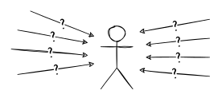
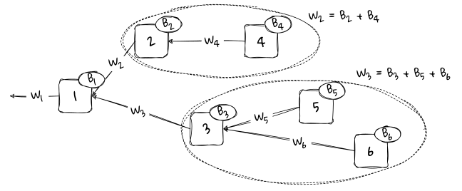
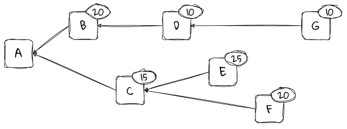
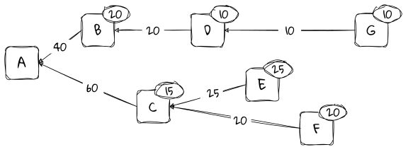
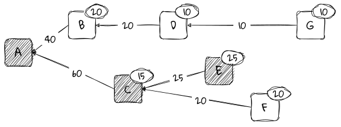
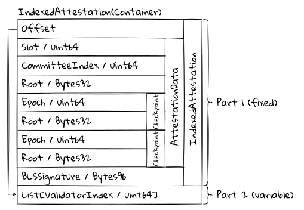
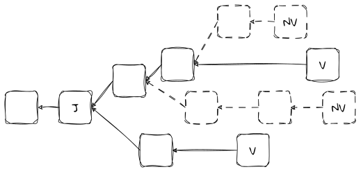
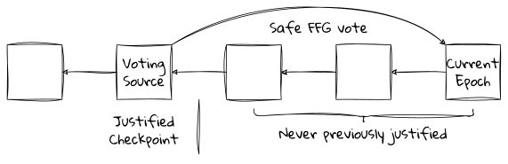
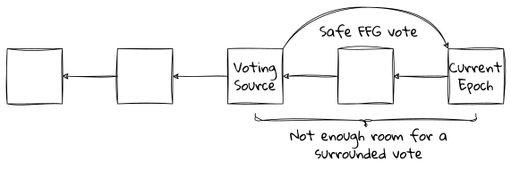
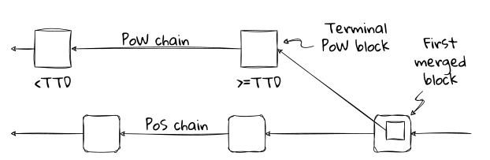

# Preface <!-- /preface/ -->

## Upgrading Ethereum

Welcome to my book about upgrading Ethereum: Ethereum on proof of stake and beyond.

### Work in progress!

I am writing this book backwards. Bottom up. Starting with the details and working towards the big picture.

The first pretty much complete part is [Part 3: The Annotated Spec](/part3/). These are the guts of the machine. Like the innards of a computer, all the components are showing and the wires are hanging out: everything is on display. But with the guts in place, everything else can be built around them with the messiness all neatly tucked away.

I'm now working on [Part 2: Technical Overview](/part2/) which wraps a first, hopefully more accessible, layer around the Annotated Spec. Again, I'm writing this backwards, starting with the protocol's [Building Blocks](/part2/building_blocks/) and its [Incentive Mechanisms](/part2/incentives/) and working forwards towards a higher level narrative of how it all fits together. The current focus is on the [Consensus](/part2/consensus/) chapter.

**Warning:** until Edition 1.0 is out, anything may change. I'll try not to change URLs and anchors in the Annotated Spec part, but no promises. Anything else, including entire chapters and sections, should be considered unstable.

### What to expect

This is a book for those who want to understand Ethereum&nbsp;2.0 &ndash; Ethereum on proof of stake &ndash; at a technical level. What does it do? How does it work? Why is it like this?

Who am I writing for? For people like me! People who enjoy understanding how things work. But more than that, who like to know _why_ things are the way they are. This is not intended to be an academic work; I am more interested in insight than in rigour. But I try to link out to relevant academic papers and formal analyses where relevant.

Although I am an Ethereum staker and an Ethereum user, I am not writing primarily for stakers or users here. Some of the generic material on [Staking](/appendices/staking/) may be relevant (once I have written it), but you will find better help in places like the excellent [EthStaker](https://ethstaker.cc/) community.

The scope of the book concerns (what I consider to be) the Ethereum&nbsp;2.0 protocol. Ethereum&nbsp;2.0 has become a less well-defined term recently. But for me, it broadly includes,

  - all things proof of stake and the beacon chain,
  - the process of The Merge by which Ethereum moved to proof of stake,
  - in-protocol data sharding, and
  - an array of potential future enhancements.

I will not be covering any of the historic Ethereum&nbsp;1.0 protocol, except as it touches upon The Merge. The [Mastering Ethereum book](https://github.com/ethereumbook/ethereumbook) is an excellent resource, though rather out of date now. Although rollups and other so-called layer 2 solutions have rapidly become part of the overall Ethereum&nbsp;2.0 system, they are by definition not in-protocol, and I will not be covering them here. I will not be discussing, DeFi, DAOs, NFTs, or any of the wonderful things that can be built on top of this amazing technology.

It's a chunky list of exclusions, but there's still [plenty to talk about](/contents/).

### Versions

This edition covers the Capella version of the deployed Ethereum&nbsp;2.0 consensus layer. The beacon chain went live with [Phase&nbsp;0](/part4/history/phase0/) on December 1st, 2020. It was upgraded to [Altair](/part4/history/altair/) on October 27th, 2021, to [Bellatrix](/part4/history/bellatrix/) on September 6th, 2022, and to [Capella](/part4/history/capella/) on April 12th, 2023.

Specifically, unless otherwise stated, any reference to the consensus specifications is to the version [tagged v1.3.0](https://github.com/ethereum/consensus-specs/tree/v1.3.0) (the [Gamlum](https://github.com/ethereum/consensus-specs/releases/tag/v1.3.0) release).

Historical and current versions of Upgrading Ethereum are available online:

  - The old [Altair spec version](/../altair/),
  - The old [Bellatrix spec version](/../bellatrix/),
  - The current [Capella spec version](/../capella/), and
  - The [latest version](/../latest/), which is currently Capella.

My original annotated specification for the Phase&nbsp;0 version is [also available](https://benjaminion.xyz/eth2-annotated-spec/phase0/beacon-chain/), though largely of historical interest and now subsumed into this book.

### In defence of &ldquo;Eth2&rdquo;

When I started this writing project, Ethereum on proof of stake was universally known as Ethereum&nbsp;2.0, Eth2 for short, as it had been since 2014. This reflects the fact that the Ethereum&nbsp;2.0 vision diverged from the original Ethereum&nbsp;1.0 implementation in many respects. The direction of travel was well-captured in the [Ethereum.org 2.0 Mauve Paper](https://docs.google.com/document/d/1maFT3cpHvwn29gLvtY4WcQiI6kRbN_nbCf3JlgR3m_8/edit#) in 2016. The details of our eventual implementation differ from what's presented there, but the elements were all in place even then. Eth2 was to deliver not only proof of stake, but new cryptography, new peer-to-peer networking, new cryptoeconomics, and new directions in scalability, among other things. This is what we achieved.

In 2022, the Ethereum Foundation [declared](https://blog.ethereum.org/2022/01/24/the-great-eth2-renaming) that we must emphasise continuity over discontinuity by rebranding Ethereum&nbsp;2.0 back to plain old Ethereum. With the way that the Merge was coming together, that made some sense from an Ethereum user's point of view. The user and developer experience was to be almost unchanged by the move to proof of stake.

However, I am not writing primarily as a user of Ethereum or as a developer on Ethereum. From the point of view of a _protocol engineer_, the Merge was a moment of profound discontinuity. Ethereum on proof of stake is utterly different from Ethereum on proof of work - the size and complexity of this book is ample evidence of that. With Ethereum's new architecture we have delivered a good chunk of what the Mauve Paper laid out all those years ago.

This is why I often continue to refer to Ethereum on proof of stake as Ethereum&nbsp;2.0 or Eth2[^fn-ef-overreach], and I make no apology for that. I am confident that you will understand what I mean, and that it will help clarify rather than confuse.

[^fn-ef-overreach]: That, and being a bloody-minded reactionary who dislikes being told what to do and say by a centralised authority. The EF's claim that, "As of late 2021, core developers stopped using the terminology" is laughably untrue.

<a id="british-english"></a>
While we're here, another thing I won't be apologising for is using British English spelling, punctuation, and quaint idioms. It's a feature, not a bug.

### Acknowledgements

Above all, I want to thank my employer, [Consensys](https://consensys.io/). Much of the writing has been done in my own time, but Consensys has been increasingly supportive of me working on this in the course of my day job. In particular, during Q2 2023, the company granted me three months of writing leave to work full-time on the book. They also allowed me to put a liberal licence on everything. All this is extremely cool of them, and I am deeply grateful. Consensys is a wonderful employer, a terrific force for good in the ecosystem, and an incredible place to work.

So much of what I do involves writing about other people's work, and pretty much everything in this book is other people's work. I deeply value the openness and generosity of the Ethereum community. For me, this is one of its defining characteristics. Many people's contributions are cited throughout this book, and I am indebted to all of you. Being part of the Eth2 dev community has been the best experience of my life.

Thank you to the many GitCoin grant supporters who donated in support of the original annotated specification and my regular What's New in Eth2 newsletter. And to generous crypto friends, anon and otherwise, for your kind gifts over the years. Your support has encouraged me hugely as I've wrestled with the minutiae of the spec. I bloody love this community.

Shout-out to the EthStaker community: you rock!

Finally, to circle back to Consensys: working daily with such brilliant, talented, generous, and knowledgeable people is a joy. The Protocols group, PegaSys, has been my home for the past five-plus years. It is where I helped establish the fabulous Protocols R&D team, and later kicked off the project that became Teku. Thank you for all your support and encouragement. I love working with all you wonderful people.

# Part 1: Building <!-- /part1/ -->

## Introduction <!-- /part1/introduction/* -->

TODO

### Why Ethereum 2.0? <!-- /part1/introduction/whyeth2/* -->

TODO

### The Cathedral and the Bazaar <!-- /part1/introduction/catb/* -->

TODO

### A Brief History of Ethereum's Future <!-- /part1/introduction/history/* -->

TODO

### Who's who <!-- /part1/introduction/who/* -->

TODO

### Outline of the Book <!-- /part1/introduction/outline/* -->

TODO

## Goals <!-- /part1/goals/* -->

### Introduction

TODO

### Design Goals <!-- /part1/goals/design/* -->

TODO

### Attacks and Defences <!-- /part1/goals/attacks/* -->

TODO

## Making the Sausage <!-- /part1/making/* -->

### Introduction

TODO

### The Specifications <!-- /part1/making/specs/* -->

TODO

### The Implementations <!-- /part1/making/implementations/* -->

TODO

# Part 2: Technical Overview <!-- /part2/ -->

## Introduction <!-- /part2/introduction/* -->

TODO: Intro

## The Beacon Chain <!-- /part2/beacon/* -->

### Introduction

TODO

### Terminology <!-- /part2/beacon/terms/* -->

TODO

### Design Overview <!-- /part2/beacon/overview/* -->

TODO

### Architecture of a Node <!-- /part2/beacon/arch/* -->

TODO

### Genesis <!-- /part2/beacon/genesis/* -->

TODO

## Consensus <!-- /part2/consensus/ -->

Here's the opening sentence of [a paper](https://arxiv.org/abs/2110.10086) about attacks on the Ethereum&nbsp;2.0 consensus protocol:

> The Proof-of-Stake (PoS) Ethereum consensus protocol is constructed by applying the finality gadget Casper FFG on top of the fork choice rule LMD GHOST, a flavor of the Greedy Heaviest-Observed Sub-Tree (GHOST) rule which considers only each participant's most recent vote (Latest Message Driven, LMD).

If that makes perfect sense to you then feel free to skip this chapter entirely. Otherwise, read on!

Our aim is to understand that sentence in all its parts. There's a lot to unpack, but we'll take time over it. We'll begin with some [preliminaries](/part2/consensus/preliminaries/) covering basics of consensus that are not particularly specific to Ethereum.

After a high-level [overview](/part2/consensus/overview/) of the how the whole consensus protocol fits together, we will dive down into its component parts, first [LMD GHOST](/part2/consensus/lmd_ghost/), then [Casper FFG](/part2/consensus/casper_ffg/). In the [Gasper](/part2/consensus/gasper/) section we will see how these two are combined together.

Enough subtleties and edge cases arise from the way that the LMD GHOST and Casper FFG protocols interoperate that I've dedicated the closing section of this chapter to discussing these [issues](/part2/consensus/issues/).

### Preliminaries <!-- /part2/consensus/preliminaries/ -->

<div class="summary">

  - Consensus is a way to build reliable distributed systems with unreliable components.
  - Blockchain-based distributed systems aim to agree on a single history of transactions.
  - Proof of work and proof of stake are not consensus protocols, but enable consensus protocols.
  - Many blockchain consensus protocols are "forkful".
  - Forkful chains use a fork choice rule, and sometimes undergo reorganisations.
  - In a "safe" protocol, nothing bad ever happens.
  - In a "live" protocol, something good always happens.
  - No practical protocol can be always safe and always live.

</div>

#### Introduction

This section covers the basics of consensus, fork choice, and finality. Most of it is not specific to Ethereum and is for general background understanding.

The challenge a consensus protocol seeks to solve is that of building a reliable distributed system on top of unreliable infrastructure. Consensus protocol research goes back to the 1970s and beyond, but the scale of the challenges we seek to solve in Ethereum are orders of magnitude more ambitious.

Our goal in Ethereum's consensus layer is to enable tens of thousands of independent nodes around the world to proceed completely in lockstep with each other. Each node maintains a ledger containing the state of every account, and every ledger must match every other ledger. There must be no discrepancies; the nodes must agree, and they must come to agreement swiftly. This is what I mean by "a reliable distributed system".

These nodes often run on [consumer grade hardware](https://stakefromhome.com/). They communicate over Internet connections that might be low bandwidth, or high latency, that lose packets, or drop out for indefinite periods of time. Node operators sometimes misconfigure their software, or don't keep it up to date. And, to make it all the more exciting, there is the possibility of large numbers of bad actors running rogue nodes or tampering with communications for their own gain. This is what I mean by "unreliable infrastructure".

An explicit design goal for Ethereum is that it doesn't only run well when every node is running well and communicating well. We have done our best to design a system that will do its best to continue running even when the world beneath it is falling apart.

#### Coming to consensus

The Ethereum network comprises a large number of individual nodes. Each node acts independently, and nodes communicate over an unreliable, asynchronous network, the Internet. Any individual node might be honest &ndash; behaving correctly at all times &ndash; or faulty in any arbitrary way: simply down or non-communicative, following a different version of the protocol, actively trying to mislead other nodes, publishing contradictory messages, or any manner of other fault.

Users submit transactions to this network of nodes, and the goal of the consensus protocol is that all correct nodes eventually agree on a single, consistent view of the history of transactions. That is, the order in which transactions were processed and the outcome of that processing. So, if I have 1&nbsp;ETH and I simultaneously tell the network that I am sending that 1&nbsp;ETH to Alice and also to Bob, we expect that eventually the network will agree that either I sent it to Alice or I sent it to Bob. It would be a failure if both Alice and Bob received my Ether, or if neither received it.

A consensus protocol is the process by which this agreement on the ordering of transactions comes about.

Ethereum's consensus protocol actually "bolts together" two different consensus protocols. One is called [LMD GHOST](/part2/consensus/lmd_ghost/), the other [Casper FFG](/part2/consensus/casper_ffg/). The combination has become known as [Gasper](/part2/consensus/gasper/). In subsequent sections we will be looking at these both separately and in combination.

#### Byzantine generals

In a 1982 [paper](https://lamport.azurewebsites.net/pubs/byz.pdf) Leslie Lamport described in rather [whimsical terms](https://www.microsoft.com/en-us/research/publication/byzantine-generals-problem/) the fundamental problem that consensus systems are trying to solve - building reliable distributed systems.

> We imagine that several divisions of the Byzantine army are camped outside an enemy city, each division commanded by its own general. The generals can communicate with one another only by messenger. After observing the enemy they must decide on a common plan of action.

This formulation makes clear that there is no overall holistic view, no God-mode in which we can see the whole situation in one glance and make a decision. We are simply one of the generals, and our only source of information about the other generals is the messages that we receive - messages that may be correct, or lies, or mistakes based on limited information, or delayed, or modified in transit. We have only a very limited local view, yet we must come to a view about the state of the whole system.

It is important to keep this in mind at all times. When we draw diagrams of block chains and block trees, it is easy to assume that this is somehow "the state" of the whole system. But these diagrams only ever represent the local view of a single participant in the system. My node's view of the system is likely to differ from your node's view of the system, if only temporarily, because we operate over an unreliable network. For example, you will see blocks at different times from when I see them, or in a different order, or even different blocks from those that I see.

Lamport captures the faultiness of the system in the following way.

> However, some of the generals may be traitors, trying to prevent the loyal generals from reaching agreement.

These treacherous generals exhibit what we've come to call "Byzantine behaviour", or "Byzantine faults". They can act in any arbitrary way: delaying messages, reordering messages, outright lying, sending contradictory messages to different recipients, failing to respond at all, or any other behaviour we can think of.

<a id="img_consensus_messages"></a>
<figure class="diagram" style="width: 50%">



<figcaption>

I receive a ton of messages from other nodes, but I have no idea which are accurate, what order they were sent in, or if any are missing or just delayed. Somehow, we need to reach agreement.

</figcaption>
</figure>

The loyal generals need a method that reliably delivers an outcome on the following terms.

> A. All loyal generals decide upon the same plan of action [e.g. "attack" or "retreat"], and
>
> B. A small number of traitors cannot cause the loyal generals to adopt a bad plan.

Achieving consensus in such a Byzantine distributed system is not an easy problem to solve, but there have been several reasonably successful approaches over the years.

The first mainstream solution was the [Practical Byzantine Fault Tolerance](https://www.scs.stanford.edu/nyu/03sp/sched/bfs.pdf) (PBFT) algorithm published by Liskov and Castro in 1999. This relies on a relatively small and limited set of known consensus participants (called _replicas_). PBFT is always "safe", in the terms discussed [below](#safety) and does not have forks.

Nakamoto consensus, [invented by](https://bitcoinpaper.org/bitcoin.pdf) Satoshi Nakamoto for Bitcoin in 2008, takes a fundamentally different approach. Rather than limiting participants to a known set it uses proof of work to permissionlessly select a temporary leader for the consensus. Unlike PBFT, Nakamoto consensus allows forks and is not formally "safe".

Many, many variants of these and other novel alternatives, such as the [Avalanche family](https://arxiv.org/pdf/1906.08936) of protocols, have since sprung up. Section 7, Related Work, of the [Avalanche white paper](https://arxiv.org/pdf/1906.08936) provides a good survey of the zoo of different consensus protocols currently in use in the blockchain world.

#### Proof of Stake and Proof of Work

This is a good point at which to mention that neither proof of work nor proof of stake is a consensus protocol in itself. They are often (lazily) referred to as consensus protocols, but each is merely an enabler for consensus protocols.

For the most part, both proof of work and proof of stake are [Sybil resistance](/part2/incentives/staking/#introduction) mechanisms that place a cost on participating in the protocol. This prevents attackers from overwhelming the protocol at low or zero cost.[^fn-types-of-proof]

[^fn-types-of-proof]: In proof of work, the "proof" you bring is a number that makes the block hash a certain value. This proves that you did the work to calculate it. In proof of stake, your proof is a private key that is associated with a deposit of stake on the blockchain. Other proof mechanisms are available, such as [proof of space and time](https://en.wikipedia.org/wiki/Proof_of_space#Proof_of_space-time).

Nevertheless, both proof of work and proof of stake are often fairly tightly coupled, via [fork choice rules](#fork-choice-rules), to the consensus mechanisms that they support. They provide a useful way to assign a weight, or a score, to a chain of blocks: in proof of work, the total work done; in proof of stake, the amount of value that supports a particular chain.

Beyond these basic factors, both proof of work and proof of stake enable many kinds of different consensus protocols to be built on them, each with its own dynamics and trade-offs. Once again, the survey in section 7, Related Work, of the [Avalanche white paper](https://arxiv.org/pdf/1906.08936) is instructive.

#### Block chains

The basic primitive that underlies blockchain technology is, of course, the block.

A block comprises a set of transactions that a leader (the block proposer) has assembled. A block's contents (its payload) may vary according to the protocol.

  - The payload of a block on Ethereum's execution chain is a list of user transactions.
  - The payload of a block on the pre-Merge proof of stake beacon chain was (mostly) a set of attestations made by other validators.
  - Post-Merge beacon chain blocks also contain the execution payload (the user transactions).
  - As and when [EIP-4844](https://eips.ethereum.org/EIPS/eip-4844) is implemented on Ethereum, blocks will contain commitments to opaque blobs of data alongside the ordered list of user transactions.

Except for the special Genesis block, every block builds on and points to a parent block. Thus, we end up with a chain of blocks: a blockchain. Whatever the contents of blocks, the goal of the protocol is for all nodes on the network to agree on the same history of the blockchain.

<a id="img_consensus_block_chain"></a>
<figure class="diagram" style="width: 90%">


<figcaption>

A blockchain. Time moves from left to right and, except for the Genesis block, each block points to the parent block it builds on.

</figcaption>
</figure>

The chain grows as nodes add their blocks to its tip. This is accomplished by temporarily selecting a "leader", an individual node that has the right to extend the chain. In proof of work the leader is the miner that first solves the proof of work puzzle for its block. In Ethereum's proof of stake the leader is selected pseudo-randomly from the pool of active stakers.

The leader (usually known as the block proposer) adds a single block to the chain, and has full responsibility for selecting and ordering the contents of that block, though its block must be valid according to the protocol rules otherwise the rest of the network will simply ignore it.

The use of blocks is an optimisation. In principle we could add individual transactions to the chain one by one, but that would add a huge consensus overhead. So blocks are batches of transactions, and sometimes [people argue](https://www.bitrawr.com/bitcoin-block-size-debate-explained) about how big those blocks should be. In Bitcoin, the block size is limited by the number of bytes of data in the block. In Ethereum's execution chain, the block size is limited by the block gas limit (that is, the amount of work needed to process the transactions in the block). [Beacon block](/part3/containers/blocks/#beaconblockbody) sizes are limited by hard-coded constants. The main benefit of bundling transactions into blocks comes from the interval between them (12 seconds in Eth2, 10 minutes on average in Bitcoin). This interval provides time for the network to converge - for as many nodes as possible to see each block and therefore to come to agreement on which block is the head of the chain.

#### Block trees

Our neat diagram of a nice linear chain will for the most part reflect what we see in practice, but not always. Sometimes, due perhaps to network delays, or a dishonest block proposer, or client bugs, any particular node might see something more like the following.

<a id="img_consensus_block_tree"></a>
<figure class="diagram" style="width: 90%">


<figcaption>

In general, we might end up with a block tree rather than a block chain. Again, time moves from left to right and each block points to the parent block it builds on.

</figcaption>
</figure>

In real networks we can end up with something more like a block tree than a block chain. In this example very few blocks are built on their "obvious" parent.

Why did the proposer of block $C$ build on $A$ rather than $B$?

  - It may be that the proposer of $C$ had not received block $B$ by the time it was ready to make its proposal.
  - It may be that the proposer of $C$ deliberately wanted to exclude block $B$ from its chain, for example to steal its transactions, or to censor some transaction in $B$.
  - It may be that the proposer of $C$ thought that block $B$ was invalid for some reason.

The first two reasons, at least, are indistinguishable to the wider network. All we know is that $C$ built on $A$, and we can never know why for certain.

Similarly, why did the proposer of block $D$ build on $B$ rather than $C$? Any of the above reasons apply, and we can add another:

  - The proposer of $D$ may have decided on some basis that there was more chance of the wider network eventually including $B$ than $C$. Thus, building $D$ on $B$ gives it more chance of making it into the eventual block chain than building $D$ on $C$.

The various branches in the block tree are called "forks". Forks happen naturally as a consequence of network and processing delays. But they can also occur due to client faults, malicious client behaviour, or protocol upgrades that change the rules, making old blocks invalid with respect to the new rules. The last of these is sometimes called a "hard fork".

The existence of forking in a consensus protocol is a consequence of prioritising liveness over safety, in the terms discussed [below](#safety-and-liveness): if you were to consult nodes that are following different forks they would give you different answers regarding the state of the system. Non-forking consensus protocols exist, such as [PBFT](https://www.scs.stanford.edu/nyu/03sp/sched/bfs.pdf) in the classical consensus world and [Tendermint](https://blog.cosmos.network/the-4-classes-of-faults-on-mainnet-bfabfbd2726c#a2f1) in the blockchain world. These protocols always produce a single linear chain and are thus formally "safe". However, they sacrifice liveness on asynchronous networks such as the Internet: rather than forking, they just stop entirely.

#### Fork choice rules

As we've seen, for all sorts of reasons &ndash; network delays, network outages, messages received out of order, malicious behaviour by peers &ndash; nodes across the network end up with different views of the network's state. Eventually, we want every correct node on the network to agree on an identical linear view of history and hence a common view of the state of the system. It is the role of the protocol's _fork choice rule_ to bring about this agreement.

Given a block tree and some decision criteria based on a node's local view of the network, the fork choice rule is designed to select, from all the available branches, the one that is most likely to eventually end up in the final linear, canonical chain. That is, it will choose the branch least likely to be later pruned out of the block tree as nodes attempt to converge on a canonical view.

<a id="img_consensus_block_tree_resolved"></a>
<figure class="diagram" style="width: 90%">


<figcaption>

The fork choice rule selects a head block from among the candidates. The head block identifies a unique linear block chain running back to the Genesis block.

</figcaption>
</figure>

The fork choice rule selects a branch implicitly by choosing a block at the tip of a branch, called the head block.

For any correct node, the first criterion for any fork choice rule is that the block it chooses must be valid according to the protocol's rules, and all its ancestors must be valid. Any invalid block is ignored, and any blocks built on an invalid block are themselves invalid.

Given that, there are many examples of different fork choice rules.

  - The proof of work protocols in Ethereum and Bitcoin use a "heaviest chain rule"[^fn-no-ghost] (sometimes called "longest chain", though that's not strictly accurate). The head block is the tip of the chain that represents the most cumulative "work" done under proof of work.
  - The fork choice rule in Ethereum's proof of stake Casper FFG protocol is "follow the chain containing the justified checkpoint of the greatest height", and to never revert a finalised block.
  - The fork choice rule in Ethereum's proof of stake LMD GHOST protocol is specified in its name: take the "Greediest Heaviest Observed SubTree". It involves counting accumulated votes from validators for blocks and their descendent blocks.

We will properly unpack the second and third of these later in their respective sections.

You can perhaps see that each of these fork choice rules is a way to assign a numeric score to a block. The winning block, the head block, has the highest score. The idea is that all correct nodes, when they eventually see a certain block, will unambiguously agree that it is the head and choose to follow its branch whatever else is going on in their own views of the network. Thus, all correct nodes will eventually agree on a common view of a single canonical chain going back to genesis.

[^fn-no-ghost]: Contrary to popular belief, Ethereum's proof of work protocol [did not use](https://ethereum.stackexchange.com/a/50693) any form of GHOST in its fork choice. This misconception is very persistent, probably due to the [Ethereum Whitepaper](https://ethereum.org/en/whitepaper/#modified-ghost-implementation). I eventually asked Vitalik about it, and he confirmed to me that although GHOST had been planned under PoW it was never implemented due to concerns about some unspecified attacks. The heaviest chain rule was simpler and well tested. It served us well.

#### Reorgs and reversions

As a node receives new blocks (and, under proof of stake, new votes for blocks) it will re-evaluate the fork choice rule in the light of the new information. Most commonly, a new block will be a child of the block that the node currently views as the head block, and the new block will become the head block.

However, sometimes the new block might be a descendent of some other block in the block tree. (Note that, if the node doesn't already have the parent block of the new block, it will need to ask its peers for it, and so on for any blocks it knows that it is missing.)

In any case, running the fork choice rule on the updated block tree might indicate a head block that is on a different branch from the previous head block. When this happens, the node must perform a reorg (short for reorganisation), also known as a reversion. It will kick out (revert) blocks that it had previously included in its chain, and will adopt the blocks on the new head's branch.

In the following diagram, the node has evaluated block $F$ to be the head block, hence its chain comprises blocks $A$, $B$, $D$, $E$, and $F$. The node knows about block $C$, but it does not appear in its view of the chain; it is on a side branch.

<a id="img_consensus_reversion_0"></a>
<figure class="diagram" style="width: 70%">


<figcaption>

At this point, the node believes that block $F$ is the best head, and therefore its chain is blocks $[A \leftarrow B \leftarrow D \leftarrow E \leftarrow F]$.

</figcaption>
</figure>

Some time later the node receives block $G$ which is not built on its current head block $F$, but on block $C$ on a different branch. Depending on the details of the fork choice rule, the node might still evaluate $F$ to be a better head than $G$ and therefore ignore $G$. But in this case we will assume that the fork choice rule indicates that $G$ is the better head block.

Blocks $D$, $E$, and $F$ are not ancestors of $G$, so they need to be removed from the node's canonical chain. Any transactions or information those blocks contain will be reverted, as if they were never received. The node must perform a full rewind to the state that it was in after processing block $B$.

After rewinding to $B$, the node can add blocks $C$ and $G$ to its chain and process them accordingly. Once done, the node will have completed the reorganisation of its chain.

<a id="img_consensus_reversion_1"></a>
<figure class="diagram" style="width: 70%">


<figcaption>

Now the node believes that block $G$ is the best head, and therefore its chain must change to the blocks $[A \leftarrow B \leftarrow C \leftarrow G]$.

</figcaption>
</figure>

Later, perhaps, a block $H$ might appear that builds on $F$. If the fork choice rule indicates that $H$ ought to be the new head, then the node will perform a reorg once again, reverting blocks back to $B$ and replaying the blocks on $H$'s branch.

Short reorgs of one or two blocks in both proof of work and Ethereum's proof of stake protocol are not uncommon due to network delays in block propagation. Much longer reorgs ought to be exceedingly rare, unless the chain is under attack, or there is a bug in the formulation of &ndash; or the clients' implementations of &ndash; the fork choice rule.

#### Safety and Liveness

Two important concepts that crop up frequently when discussing consensus mechanisms are _safety_ and _liveness_.

##### Safety

Informally, an algorithm is said to be safe if "nothing bad ever happens".[^fn-safety-liveness]

[^fn-safety-liveness]: The helpful, intuitive definitions of safety and liveness I've quoted appear in short form in Lamport's 1977 paper, [Proving the Correctness of Multiprocess Programs](https://lamport.azurewebsites.net/pubs/proving.pdf), and as stated here in Gilbert and Lynch's 2012 paper, [Perspectives on the CAP Theorem](https://groups.csail.mit.edu/tds/papers/Gilbert/Brewer2.pdf).

Examples of bad things that might happen in the blockchain context could be the double-spend of a coin, or the finalising of two conflicting checkpoints.

An important facet of safety in a distributed system is "consistency". That is, if we were to ask different (honest) nodes about the state of the chain at some point in its progress, such as the balance of an account at a particular block height, then we should always get the same answer, no matter which node we ask. In a safe system, every node has an identical view of the history of the chain that never changes.

Effectively, safety means that our distributed system "behaves like a centralized implementation that executes operations atomically one at a time." (to quote [Castro and Liskov](https://www.scs.stanford.edu/nyu/03sp/sched/bfs.pdf)). A safe system is, in Vitalik's [taxonomy](https://medium.com/@VitalikButerin/the-meaning-of-decentralization-a0c92b76a274) of centralisation, logically centralised.

##### Liveness

Again informally, an algorithm is said to be live if "something good eventually happens".

In a blockchain context we generally understand this to mean that the chain can always add a new block; it will never get into a deadlock situation in which it will not produce a new block with transactions in it.

"Availability" is another way of looking at this. I want the chain to be available, meaning that if I send a valid transaction to an honest node it will eventually be included in a block that extends the chain.

##### You can't have both!

The CAP theorem is a famous result in distributed systems' theory that states that no distributed system can provide all three of (1) consistency, (2) availability, and (3) partition tolerance. Partition tolerance is the ability to function when communication between nodes is not reliable. For example, a network fault might split the nodes into two or more groups that can't communicate with each other.

It is easy to demonstrate the CAP theorem in our blockchain context. Imagine that Amazon Web Services goes offline, such that all the AWS hosted nodes can communicate with each other, but none can talk to the outside world. Or that a country firewalls all connections in and out so that no gossip traffic can pass. Either of these scenarios divide the nodes into two disjoint groups, $A$ and $B$.

<a id="img_consensus_partition"></a>
<figure class="diagram" style="width: 50%">


<figcaption>

The network is partitioned: the nodes in $A$ can talk among themselves, but cannot talk to any node in $B$, and vice versa.

</figcaption>
</figure>

Let's say that somebody connected to the network of group $A$ sends a transaction. If the nodes in $A$ process that transaction then they will end up with a state that is different from the nodes in group $B$, which didn't see the transaction. So, overall, we have lost consistency between all the nodes, and therefore safety. The only way to avoid this is for the nodes in group $A$ to refuse to process the transaction, in which case we have lost availability, and therefore liveness.

In summary, the CAP theorem means that we cannot hope to design a consensus protocol that is both safe and live under all circumstances, since we have no option but to operate across an unreliable network, the Internet.[^fn-flp-theorem]

[^fn-flp-theorem]: The CAP theorem is related to another famous result described by Fisher, Lynch and Paterson in their 1985 paper, [Impossibility of Distributed Consensus with One Faulty Process](https://groups.csail.mit.edu/tds/papers/Lynch/jacm85.pdf), usually called the FLP theorem. This proves that, even in a reliable asynchronous network (that is, with no bound on how long messages can take to be received), just one faulty node can prevent the system from coming to consensus. That is, even this unpartitioned system cannot formally be both live and safe. Gilbert and Lynch's [paper](https://groups.csail.mit.edu/tds/papers/Gilbert/Brewer2.pdf) discusses the FLP theorem in section 3.2.

##### Ethereum prioritises liveness

The Ethereum consensus protocol offers both safety and liveness in good network conditions, but prioritises liveness when things are not running so smoothly. In the case of a network partition the nodes on each side of the partition will continue to produce blocks. However, finality (a safety property) will no longer occur on both sides of the partition. Depending on the proportion of stake managed by each side, either one side or neither side will continue to finalise.

Eventually, unless the partition is resolved, both sides will regain finality due to the novel [inactivity leak](/part2/incentives/inactivity/) mechanism. But this results in the ultimate safety failure. Each chain will finalise a different history and the two chains will become irreconcilable and independent forever.

#### Finality

We're going to be discussing finality a good deal over the following sections, which is a safety property of the chain.

Finality is the idea that there are blocks that will never be reverted. When a block has been finalised, all the honest nodes on the network have agreed that the block will forever remain part of the chain's history, and therefore that all of its ancestors will remain in the chain's history. Finality makes your payment for pizza as irrevocable as if you'd handed over cash. It is the ultimate protection against double-spending.[^fn-finality-not-absolute]

[^fn-finality-not-absolute]: It's worth noting that finality is never absolute. Whatever any protocol claims, if a supermajority of nodes agrees (for example via a software upgrade) to revert a bunch of finalised blocks, then that's going to happen. Ultimately, as in all things, the concept of finality is subservient to social consensus. See [On Settlement Finality](https://blog.ethereum.org/2016/05/09/on-settlement-finality) for further discussion.

Some consensus protocols, like classical PBFT, or Tendermint, finalise every round (every block). As soon as a round's worth of transactions has been included on the chain, all the nodes agree that it will be there forever. On the one hand, these protocols are very "safe": once a transaction has been included on-chain, it will never be reverted. On the other hand, they are vulnerable to liveness failures: if the nodes cannot come to agreement &ndash; for example, if more than one third of them are down or unavailable &ndash; then no transactions can be added to the chain and it will stop dead.

Other consensus protocols, such as Bitcoin's Nakamoto consensus, do not have any finality mechanism at all. There is always the possibility that someone will reveal an alternative, heavier chain. When this happens, all honest nodes must reorg their chains accordingly, reverting whatever transactions they previously processed. Heuristics such as how many confirmations your block has are only approximations to finality, they are not guarantees.[^fn-cdc-40k]

[^fn-cdc-40k]: At the time of writing, at least one exchange requires [40000 confirmations](https://www.reddit.com/r/Crypto_com/comments/w9qmbx/40000_confirmations_and_7_days_to_send_etc_to_cdc/) for deposits from the Ethereum Classic network. That means that forty thousand blocks must be built on top of a block containing the deposit transaction before the exchange will process it, which takes about six days. The requirement reflects concern about the vulnerability of ETC's low hash rate proof of work chain to 51% attacks - it is relatively easy for an attacker to revert blocks at will. The reality is that, in the face of a well-crafted 51% attack, no number of confirmations is truly safe.

Ethereum's consensus layer prioritises liveness, but also strives to offer a safety guarantee in the form of finality when circumstances are favourable. This is an attempt to gain the best of both worlds. Vitalik has [defended this](https://ethresear.ch/t/explaining-the-liveness-guarantee/4228/8?u=benjaminion) as follows.[^fn-liveness-during-nonfinality]

> The general principle is that you want to give users "as much consensus as possible": if there’s $>2/3$ then we get regular consensus, but if there's $<2/3$ then there’s no excuse to just stall and offer nothing, when clearly it’s still possible for the chain to keep growing albeit at a temporarily lower level of security for the new blocks. If an individual application is unhappy with that lower level of security, it’s free to ignore those blocks until they get finalized.

[^fn-liveness-during-nonfinality]: The value of this was evident when the beacon chain [stopped finalising](https://offchain.medium.com/post-mortem-report-ethereum-mainnet-finality-05-11-2023-95e271dfd8b2) for around an hour on the 12th of May, 2023. Participation in consensus dropped from over 99% of validators to around 40% for the duration. Ordinary Ethereum users and applications, however, would have barely noticed. Blocks continued to be produced (albeit fewer than normal) and transactions continued to be executed.

Finality in Ethereum's consensus layer is delivered by the Casper FFG mechanism that we'll be exploring soon. The idea is that, periodically, all honest validators agree on fairly recent checkpoint blocks that they will never revert. That block and all its ancestor blocks are then "final" - they will never change, and if you consult any honest node in the network about them or their ancestors you will always get the same answer.

<a id="img_consensus_finality"></a>
<figure class="diagram" style="width: 80%">


<figcaption>

The honest nodes have agreed that the checkpoint and all its ancestor blocks are "final" and will never be reverted. There are therefore no forks before the checkpoint. The chain descending from the checkpoint remains liable to forking.

</figcaption>
</figure>

Ethereum's finality is "economic finality". It is theoretically possible for the protocol to finalise two conflicting checkpoints, that is, two contradictory views of the chain's history. However, it is possible only at enormous and quantifiable cost. For all but the most extreme attack or failure scenarios, final means final.

The [section on Casper FFG](/part2/consensus/casper_ffg/) dives into the detail of how this finality mechanism works.

#### See also

It's always worth reading anything that Leslie Lamport has had a hand in, and the original 1982 paper by Lamport, Shostak, and Pease on [The Byzantine Generals Problem](https://lamport.azurewebsites.net/pubs/byz.pdf) contains many insights. While the algorithm they propose is hopelessly inefficient in modern terms, the paper is a good introduction to reasoning about consensus protocols in general. The same is true of Castro and Liskov's seminal 1999 paper [Practical Byzantine Fault Tolerance](https://www.scs.stanford.edu/nyu/03sp/sched/bfs.pdf) which significantly influenced the design of Ethereum's Casper FFG protocol. However, you might like to contrast these "classical" approaches with the elegant simplicity of proof of work, as described by Satoshi Nakamoto in the 2008 [Bitcoin white paper](https://bitcoinpaper.org/bitcoin.pdf). If proof of work has just one thing in its favour, it is its simplicity.

We've referred above to Gilbert and Lynch's 2012 paper, [Perspectives on the CAP Theorem](https://groups.csail.mit.edu/tds/papers/Gilbert/Brewer2.pdf). It is a very readable exploration of the concepts of consistency and availability (or safety and liveness in our context).

The Ethereum beacon chain underwent a seven block reorg in May 2022 due to differences between client implementations of the fork choice rule. These differences were known at the time and thought to be harmless. That proved to be not so. Barnabé Monnot's [write-up](https://barnabe.substack.com/p/pos-ethereum-reorg) of the incident is very instructive.

Vitalik's blog post [On Settlement Finality](https://blog.ethereum.org/2016/05/09/on-settlement-finality/) provides a deeper and more nuanced exploration of the concept of finality.

Our ideal for the systems we are building is that they are _politically_ decentralised (for permissionlessness and censorship resistance), _architecturally_ decentralised (for resilience, with no single point of failure), but _logically_ centralised (so that they give consistent results). These criteria strongly influence how we design our consensus protocols. Vitalik explores these issues in his article, [The Meaning of Decentralization](https://medium.com/@VitalikButerin/the-meaning-of-decentralization-a0c92b76a274).

### Overview <!-- /part2/consensus/overview/ -->

<div class="summary">

  - Nodes and validators are the actors of the consensus system.
  - Slots and epochs regulate consensus time.
  - Blocks and attestations are the currency of consensus.
  - Ethereum's consensus protocol combines two separate consensus protocols.
  - "LMD GHOST" essentially provides liveness.
  - "Casper FFG" provides finality.
  - Together they are sometimes known as "Gasper".

</div>

#### Introduction

The last section gave a broad view of blockchain consensus; in this section we will tighten the focus to Ethereum's proof of stake consensus. I've tried to follow a path that gives enough information to make sense of things, without wandering off into the detailed technical weeds on either side. All those weeds are well explored in the [annotated specification](/part3/) and other chapters, and I've included some links for those who want to branch off and go exploring.

The first thing we must cover is the Ethereum-specific terminology that we will be using throughout.

##### Nodes and Validators

The main participants in the Ethereum network are _nodes_. A node's role is to validate consensus and form the communication backbone with other nodes.

Consensus is formed by _validators_, which (in true Ethereum style) are horribly misnamed, as they don't really validate anything - that's done by the nodes. Each validator represents an initial 32 ETH stake. It has its own [secret key](/part2/building_blocks/signatures/#key-pairs), and the related public key that is its identity in the protocol. Validators are attached to nodes, and a single node can host anything from zero to hundreds or thousands of validators. Validators attached to the same node do not act independently, they share the same view of the world.[^fn-validators-nodes]

[^fn-validators-nodes]: It would serve us well to be mindful of this when making claims about the decentralisation of Ethereum. Having, say, 600,000 validators active on the network is a long way from having 600,000 independent actors. Looking at the number of nodes, and the distribution of validators across nodes, will give more useful metrics for Ethereum's decentralisation.

A interesting feature of proof of stake that sets it apart from proof of work is that, under PoS, we know our validator set. We have a complete list of all the public keys that we expect to be active at any time. Knowing our validator set enables us to achieve finality, as we can identify when we have achieved a majority vote of participants.[^fn-accountable-safety-jargon]

[^fn-accountable-safety-jargon]: In consensus jargon, we can have "accountable safety".

##### Slots and Epochs

Time is strictly regimented in Ethereum's proof of stake consensus, which is a major change from proof of work, which only had casual relationship with time - PoW makes some attempt to keep block intervals constant on average, but that's all.

The two most important intervals are the _slot_, which is [12 seconds](/part3/config/configuration/#seconds_per_slot) exactly, and the _epoch_, which is [32 slots](/part3/config/preset/#slots_per_epoch), or 6.4 minutes. Slots and epochs progress regularly and relentlessly, whatever else may be happening on the network.

##### Blocks and Attestations

Every slot, exactly one validator is [selected](/part3/helper/accessors/#get_beacon_proposer_index) to propose a _block_. The block [contains](/part3/containers/blocks/#beaconblockbody) updates to the beacon state, including attestations that the proposer knows about, as well as the [execution payload](/part3/containers/execution/#executionpayload) containing Ethereum user transactions. The proposer shares its block with the whole network via a gossip protocol.

A slot can be empty: a block proposer might be offline, or propose an invalid block, or have its block subsequently reorged out of the chain. These things should not happen often in a well-running beacon chain, but the protocol is intended to be robust when empty slots occur.

Every epoch, every validator gets to share its view of the world exactly once, in the form of an _attestation_. An attestation [contains](/part3/containers/dependencies/#attestationdata) votes for the _head_ of the chain that will be used by the LMD GHOST protocol, and votes for _checkpoints_ that will be used by the Casper FFG protocol. Attestations are also gossiped to the whole network. Like blocks, attestations can be missing for all sorts of reasons, and the protocol can tolerate this to various extents - crudely, the quality of consensus will decrease as the participation rate of attesters decreases.[^fn-attestation-rate]

[^fn-attestation-rate]: The [Beaconcha.in](https://beaconcha.in) site shows attestation participation rate (also called Voting Participation) on a per epoch basis. It is a good measure of network health. The rate often exceeds 99%, which is an outstanding level of performance for a massively distributed consensus protocol.

The function of the epoch is to spread out the workload of handling all those attestations. By attesting, every validator is informing every other validator of its view of the world, which could amount to an immense amount of network traffic and processing load if it were all done at once. Spreading the attestation workload across all 32 slots of an epoch keeps resource usage low. In each slot, committees comprising only $\frac{1}{32}$ of the validators make attestations.

The protocol incentivises block and attestation production and accuracy via a system of rewards and penalties for validators. We don't need to go into these now; there is a whole [separate chapter](/part2/incentives/) on all of that.

##### Slashing

In proof of work, producing a block is expensive. This is a strong incentive for miners to behave well, in line with the protocol's goals, to ensure that their blocks are included.

In proof of stake, creating blocks and attestations is almost free[^fn-nothing-at-stake]. We need a way to prevent attackers from exploiting this to disrupt the network. This is the role of _slashing_. Validators that equivocate over blocks or attestations are subject to being [slashed](/part2/incentives/slashing/), which means that they are ejected from the validator set and fined some portion of their stake. Simply put, equivocation means saying two contradictory things. It might be proposing two different blocks for the same slot, or making two attestations that are inconsistent with each other, that no validator honestly following the protocol would have made.

[^fn-nothing-at-stake]: This is sometimes called the "nothing at stake problem".

#### The Ghosts in the Machine

With some terminology behind us we can begin to outline Ethereum's actual consensus mechanism.

Ethereum's proof of stake consensus protocol is actually a combination of two separate consensus protocols, known individually as LMD GHOST[^fn-lmd-name], and Casper FFG[^fn-ffg-name]. These two have been "bolted together" to form the consensus protocol we have implemented for Eth2 - the combined protocol is sometimes known by the portmanteau "Gasper".

[^fn-lmd-name]: "Latest Message Driven, Greedy Heaviest Observed Subtree". I will unpack the naming in the specific [LMD GHOST chapter](/part2/consensus/lmd_ghost/#naming).

[^fn-ffg-name]: "Casper the Friendly Finality Gadget". Again, I will unpack this slightly curious naming when we get to the specific [Casper FFG chapter](/part2/consensus/casper_ffg/#naming).

Combining the two in Gasper is an attempt to get the best of both worlds in terms of liveness and safety. In essence, LMD GHOST provides slot-by-slot liveness (it keeps the chain running), while Casper FFG provides safety (it protects the chain from long reversions). LMD GHOST allows us to keep churning out blocks on top of one-another, but is forkful and therefore not formally safe. Casper FFG modifies the LMD GHOST fork choice rule to periodically bless the chain with finality. Nevertheless, as [previously discussed](/part2/consensus/preliminaries/#ethereum-prioritises-liveness), Ethereum prioritises liveness. Therefore, in situations in which Casper FFG is unable to confer finality, the chain still continues to grow via the LMD GHOST mechanism.

This bolted-together consensus mechanism is not always pretty. We can sometimes see the joins, and the interaction between the two has led to subtle issues that we will discuss [later](/part2/consensus/issues/). However, in the spirit of Ethereum, it is a workable engineering solution that serves us well in practice.

##### History

The detailed history of Gasper is bound up with the development of the individual components, LMD GHOST and Casper FFG, which we will review in their respective sections. But we note here that Casper FFG was never designed to be a standalone consensus mechanism.

As stated in the [Casper FFG paper](https://arxiv.org/abs/1710.09437),

> Casper the Friendly Finality Gadget is an overlay atop a _proposal mechanism_ &ndash; a mechanism which proposes blocks.

So, there is an underlying block proposal mechanism &ndash; which implies an underlying consensus mechanism &ndash; that Casper FFG sits on top of, delivering a kind of meta-consensus that confers finality on the blockchain.

The original plan was to apply Casper FFG as a proof of stake overlay on top of Ethereum's proof of work consensus. Casper FFG would confer finality &ndash; a property that proof of work chains lack &ndash; on the chain on a periodic basis, say, every 100 blocks. This was intended to be the first step in weaning Ethereum off proof of work. With the finality guarantee, we could have reduced the proof of work block reward, and thereby reduced the overall hash power as an interim step towards replacing mining with full proof of stake at some future date.

By the end of 2017, this plan had become quite advanced. [EIP-1011](https://eips.ethereum.org/EIPS/eip-1011), Hybrid Casper FFG, describes the architecture in detail, and there was even a [testnet](https://hackmd.io/@aTTDQ4GiRVyyce6trnsfpg/Hk6UiFU7z?type=view) that [went live](https://web.archive.org/web/20230630135033/https://nitter.it/karl_dot_tech/status/947503029166546946) on the 31st of December, 2017.

In early 2018, however, that plan was superseded. The limited bandwidth of the Ethereum Virtual Machine constrained the size of the validator set that EIP-1011 could support, in turn leading to a minimum stake of 1500&nbsp;ETH, which was seen as undesirable. Around the same time, paths towards a full, much more scalable proof of stake protocol became clearer, and we began working on the design that became Ethereum&nbsp;2.0.

Due to its generic nature, Casper FFG was able to survive the redesign and was adopted into Ethereum&nbsp;2.0, not as an overlay on proof of work, but as an overlay on a new proof of stake protocol called LMD GHOST.

##### A finality gadget

When we say that Casper FFG overlays an existing block proposal mechanism, we mean that it takes an existing block tree and prunes it in a specific way. Casper FFG modifies the fork choice of the underlying block tree by making some of its branches inaccessible.

Consider this block tree produced by some underlying consensus mechanism, whether it be proof of work, or LMD GHOST in proof of stake.

<a id="img_gasper_blocktree"></a>
<figure class="diagram" style="width: 70%">


<figcaption>

An arbitrary block tree with three forks (branches). Any of blocks $I$, $E$, or $M$ could be the tip of the chain. (The block labels are for convenience and do not imply a particular ordering.)

</figcaption>
</figure>

In this situation, I have three candidate head blocks, $I$, $E$, and $M$. Under proof of work's longest chain rule, the choice of head block is obvious: I must choose M since it has the greatest block height, or (almost) equivalently the greatest amount of work done. Under LMD GHOST we can't choose a head block from this information alone, we'd need to see the votes from the other validators in order to make a choice.

The challenge is that the chain from blocks $J$ to $M$ might be from an attacker. The attacker might have mined that chain in secret and revealed it later in a so-called 51% attack. Proof of work nodes would have no choice but to reorg to make $M$ the head, thereby favouring the attacker's chain and potentially becoming vulnerable to double-spends.

The value that Casper FFG brings is that it confers finality. Let's say that block $D$ is marked as final by Casper FFG (which automatically finalises blocks $A$, $B$, and $C$). Finalisation modifies the fork choice rule of the underlying protocol so that any branch with blocks that competes with block $D$ &ndash; that is, any block not descended from $D$ &ndash; is excluded. Equivalently, branches are pruned so that there are no forks prior to the finalised block.

<a id="img_gasper_blocktree_finalised"></a>
<figure class="diagram" style="width: 70%">


<figcaption>

We have the same block tree as above, but now block $D$ has been finalised. The Casper FFG fork choice says that any chain not including block $D$ is ignored, so our head block is now unambiguously $E$.

</figcaption>
</figure>

When block $D$ is finalised, the fork choice must ignore the branches that begin with blocks $F$ and $J$. We end up with a single candidate head block, $E$.

Essentially, the finality delivered by Casper FFG prevents long reorganisations (reversions). No finalised block, or ancestor of a finalised block, will ever be reverted. In Ethereum's Casper FFG implementation we must qualify "ever", with, "without burning at least 1/3 of the entire amount of staked Ether". This is the economic finality that the proof of stake chain provides.

#### Conclusion

As a reminder, [this](/part2/consensus/) is the sentence we are trying to understand in all its parts.

> The Proof-of-Stake (PoS) Ethereum consensus protocol is constructed by applying the finality gadget Casper FFG on top of the fork choice rule LMD GHOST, a flavor of the Greedy Heaviest-Observed Sub-Tree (GHOST) rule which considers only each participant's most recent vote (Latest Message Driven, LMD).

We've spent some time on what a consensus protocol is and does, and touched a little on proof of stake. We talked about finality, and at a high level I've illustrated how Casper FFG forms a "finality gadget" applied on top of LMD GHOST as a block proposal mechanism.

Much work remains, however. In the next sections we will take deeper dives into [LMD GHOST](/part2/consensus/lmd_ghost/), [Casper FFG](/part2/consensus/casper_ffg/), and how they combine to form the [Gasper](/part2/consensus/gasper/) protocol.

#### See also

On the history of how everything came together, Vitalik made a terrific [tweet storm](https://web.archive.org/web/20230630135150/https://nitter.it/VitalikButerin/status/1029900695925706753). Consolidated versions are available [here](https://www.trustnodes.com/2018/08/16/vitalik-buterin-tells-story-race-vlad-zamfir-implement-proof-stake-casper) and [here](https://hackmd.io/@liangcc/BJZDR1mIX?type=view). He discusses weak subjectivity a little, which we will deal with [later](/part2/validator/weak_subjectivity/).

The [Proof of Stake FAQ](https://vitalik.ca/general/2017/12/31/pos_faq.html) remains an excellent primer on many of the topics we'll be covering.

Joachim Neu's presentation, [The Why and How of PoS Ethereum's Consensus Problem](https://www.youtube.com/watch?v=2nMS-TK_tMw) (at ETHconomics, Devconnect 2022), is a very accessible insight into the availability&ndash;finality trade-off, and how Ethereum seeks to manage it. We'll pick up again on the idea of "nested ledgers" when we get to the [Gasper protocol](/part2/consensus/gasper/).

### LMD Ghost <!-- /part2/consensus/lmd_ghost/ -->

<div class="summary">

  - LMD GHOST is a fork choice rule used by nodes to determine the best chain.
  - It assigns weights to branches based on votes from all active validators.
  - LMD GHOST does not provide finality, but does support a confirmation rule.
  - Slashing is used to solve the "nothing at stake" problem.

</div>

#### Introduction

In this section we will consider LMD GHOST in isolation, ignoring completely the Casper FFG finality overlay[^fn-casper-and-gasper-next]. LMD GHOST is the essence of a consensus mechanism in itself &ndash; it is a fork choice rule, just as the heaviest chain rule in Nakamoto consensus is &ndash; and has its own sets of properties and trade-offs.

[^fn-casper-and-gasper-next]: The next section covers [Casper FFG](/part2/consensus/casper_ffg/), and the one after that the combination of the two into [Gasper](/part2/consensus/gasper/).

For now, we will be considering only the "how it works" part of the story - the happy flow. We will look at the "how it can go wrong" part later, in the [Issues and Fixes](/part2/consensus/issues/) section.

#### Naming

The name LMD GHOST comprises two acronyms, for "Latest Message Driven", and "Greedy Heaviest-Observed Sub-Tree". We'll unpack GHOST first, then LMD.

##### GHOST

The GHOST protocol comes from a 2013 [paper by Sompolinsky and Zohar](https://eprint.iacr.org/2013/881) about how to safely improve transaction throughput on Bitcoin. Increasing the block size, or decreasing the interval between blocks, makes the chain more susceptible to forking in a network that has uncontrolled latency (delays), like the Internet. Chains that fork have more reorgs, and reorgs are bad for transaction security. Replacing Bitcoin's longest chain fork choice rule with the GHOST fork choice was shown to be more stable in the presence of latency, allowing block production to be more frequent.

The name GHOST stands for "Greedy Heaviest-Observed Sub-Tree", which describes how the algorithm works. We will expand on that [below](#finding-the-head-block). In short, GHOST's fork choice doesn't follow the heaviest chain, but the heaviest subtree. It recognises that a vote for a block is not only for that block, but implicitly a vote for each of its ancestors as well, so whole subtrees have an associated weight.

Bitcoin never adopted GHOST, and (despite that paper stating otherwise) neither did Ethereum under proof of work, although it had [originally](https://ethereum.org/en/whitepaper/#modified-ghost-implementation) been planned, and the old proof of work "uncle" rewards were related to it.

##### LMD

The GHOST protocol that we are using in Ethereum's proof of stake has been extended to be able to handle attestations. In proof of work, the voters are the block proposers. They vote for a branch by building their own block on top of it. In our proof of stake protocol, all validators are voters, and each casts a vote for its view of the network once every 6.4 minutes on average by publishing an attestation. So, under PoS, we have a lot more information available about participants' views of the network.

This is what it means to be "message driven", giving us the MD in LMD. The fork choice is driven not by blocks added by proposers, but by messages (attestations, votes) published by all validators.

The "L" stands for "latest": LMD GHOST takes into account only the _latest_ message from each validator, that is, the most recent attestation that we have received from that validator. All a validator's earlier messages are discarded, but its latest vote is retained and has weight indefinitely.

As a side note, other versions of message-driven GHOST are available. Vitalik [initially favoured](https://web.archive.org/web/20230630135311/https://nitter.it/VitalikButerin/status/1029906757512966144#m) IMD, "Immediate Message Driven", GHOST. As far as I can tell[^fn-imd-tricky], this retains all attestations indefinitely, and the fork choice chooses based on whatever attestation was current at the time. Then there's [FMD](https://ethresear.ch/t/saving-strategy-and-fmd-ghost/6226?u=benjaminion), "Fresh Message Driven", GHOST, which considers attestations only from the current and previous epochs. And [RLMD](https://ethresear.ch/t/a-simple-single-slot-finality-protocol/14920?u=benjaminion), "Recent Latest Message Driven", GHOST which remembers validators' latest attestations only for a parameterisable number of epochs.

[^fn-imd-tricky]: I've yet to find a lucid exposition of IMD GHOST. Looking back through the history on the [original mini-spec](https://ethresear.ch/t/beacon-chain-casper-mini-spec/2760?u=benjaminion) gives some information, but it's hard to understand what was really happening. It was first known as ["recursive proximity to justification"](https://web.archive.org/web/2/https://nitter.it/VitalikButerin/status/1029906887376961536#m), since it was bound up with Casper FFG in a way that LMD GHOST is not.

#### How it works

LMD GHOST, above all, is a [fork choice rule](/part2/consensus/preliminaries/#fork-choice-rules). Given a tree of blocks and a collection of votes, LMD GHOST will tell me which block I should consider to be the best head, thereby giving me a linear view of history from that head all the way back to genesis. The decision is based on my local view of the chain, based on the messages (blocks and attestations) that my node has received - remember, there is no "God's eye view", my local view is all that I have to work with, and it may well differ from other nodes' local views. The idea is that honest validators will build their blocks on the best head that they see, and will in turn cast their votes according the best head block they see.

Some things that a good fork choice rule will deliver are as follows.[^fn-good-fork-choice-rule]

[^fn-good-fork-choice-rule]: I've adapted this from an old post of Vitalik's, [PoS fork choice rule desiderata](https://ethresear.ch/t/pos-fork-choice-rule-desiderata/2636?u=benjaminion). I'm postponing his finality point for now. I am not aware of much formal analysis of LMD GHOST with respect to properties like these; in fact, our implementation of LMD GHOST [may not do too well](https://arxiv.org/pdf/2302.11326.pdf) in some respects. But these goals are worth bearing in mind as we explore how the mechanism works.

  - Majority honest progress: if over 50% of nodes build blocks by following the fork choice rule, the chain progresses and is (exponentially) unlikely to revert older blocks.
  - Stability: the fork choice is a good prediction of the future fork choice.
  - Manipulation resistance: even if an attacker captures a temporary supermajority of some small set of participants, the attacker is unlikely to be able to revert blocks.

All these points are interrelated. Stability, in particular, is important for block proposers. When I propose a block, I want to be as sure as I possibly can be that the block will remain in the chain forever. Equivalently, that it will not be reorged out. Finding the head block means finding the block that most likely will make my new block the head in the views of other nodes when I build on it.

We'll divide our exploration of how LMD GHOST works in two. We'll look first at the LMD part, latest messages, and then at the GHOST part, finding the head.

##### Latest messages

Messages, in this context, are the head block votes found in attestations.

###### Votes in LMD GHOST

In an attestation's [data](/part3/containers/dependencies/#attestationdata), the head vote is the `beacon_block_root` field:

```python
class AttestationData(Container):
    slot: Slot
    index: CommitteeIndex
    # LMD GHOST vote
    beacon_block_root: Root
    # FFG vote
    source: Checkpoint
    target: Checkpoint
```

Every honest validator makes an attestation exactly once per epoch, containing its vote for the best head block in its view at the moment that it attests. Within each epoch, the validator set is split up so that only $1/32$ of the validators are attesting at each slot. (The `index` field in this structure relates to the attesting validators being further divided into up to 64 [committees](/part2/building_blocks/committees/) at each slot for operational reasons, but this is not relevant to the mechanics of LMD GHOST and we shall ignore it.)

Nodes receive attestations both directly, via attestation gossip, and indirectly, contained in blocks. In principle, a node could receive attestations through other means &ndash; I could type an attestation in at the keyboard if I wished &ndash; but in practice votes propagate only via attestation gossip and within blocks.

###### Storing latest messages

On receiving an attestation, by whatever means, the node calls the fork choice's [`on_attestation()`](/part3/forkchoice/phase0/#on_attestation) handler. Before proceeding, the `on_attestation()` handler performs some basic [validity checks](/part3/forkchoice/phase0/#validate_on_attestation) on the attestation:

  - Is it too old?
    - It must be from the current or previous epoch. See [Attestation consideration delay](/part2/consensus/issues/#attestation-consideration-delay).
  - Is it too new?
    - It must be from no later than the previous slot. See [Attestation recency](/part2/consensus/issues/#attestation-recency).
  - Do we know about the block that it is voting for, the `beacon_block_root`?
    - We must have received that block already. If not we might try to fetch it from a peer.
  - Is its signature correct?
    - Validators sign attestations and are accountable for them.
  - Is the attestation slashable?
    - We must ignore attestations that conflict with other attestations. See [Attestation equivocation](/part2/consensus/issues/#attestation-equivocation).

After passing these and some other checks, the attestation is considered for insertion into the node's Store, which is its repository of information about the state of the chain: its view. This is done in [`update_latest_messages()`](/part3/forkchoice/phase0/#update_latest_messages). If we don't already have a head block vote for the validator, then this one is stored for it. If we have a head block vote for the validator, then this one replaces it if it is more recent.

Over time, then, a node's Store builds up a list containing a single latest vote for each validator that it has heard from.

Note that a vote can be inserted in the store only if we heard about it in the same epoch or the epoch after it was made. However, once it is in the store it remains there indefinitely, and continues to contribute to the fork choice until it is updated with a more recent vote. This is a key difference between LMD GHOST and, say, the [Goldfish protocol](https://arxiv.org/pdf/2209.03255.pdf), or [RLMD GHOST](https://arxiv.org/pdf/2302.11326.pdf).

##### Finding the head block

In essence, the LMD GHOST fork choice rule is a function $\text{GetHead}(\text{Store}) \rightarrow \text{HeadBlock}$. As we've seen, a node's Store is its view of the world: all the relevant information it has received that could affect the fork choice. For the pure LMD GHOST algorithm we are looking at here, the relevant parts of the [Store](/part3/forkchoice/phase0/#store) are the following.

  - The block tree, which is just a list of blocks. The blocks' parent links join them logically into a tree.
  - The list of latest messages (votes) from validators.
  - The validators' [effective balances](/part2/incentives/balances/) (based on some state) as these provide the weights used in the algorithm.

The goal of the GHOST algorithm is to select a single leaf block from the given block tree, where a leaf is a block without any descendants. This will be our chosen head block.

We are going to assume that all the blocks in our block tree descend from a single root block. In a pure GHOST algorithm, that would be the genesis block: by definition, all blocks must descend from genesis. In our full consensus implementation, that root block will be the last justified checkpoint block. For our present purposes, all we need to know is that the GHOST algorithm starts from a given block, and ignores all blocks not descended from that block.

###### Get weight

The first thing we do is calculate the "weight" of each branch in the tree. A branch's weight is its score, in some sense.

The weight of a vote is the [effective balance](/part2/incentives/balances/) of the validator that made the vote. This will usually be 32 ETH, the maximum effective balance, but could be less. A vote, recall, is the latest message we have from that validator.

The weight of a branch is the weight of the votes for the block that roots it, plus the weights of that block's child branches. By including the weights of child branches, we are acknowledging that a vote for a block is also a vote for each of the ancestors of that block. The weight of a branch consisting of only a leaf block will be just the weight of the votes for that block.

<a id="img_annotated_forkchoice_get_weight_0"></a>
<figure class="diagram" style="width: 90%">



<figcaption>

$B_N$ is the sum of the effective balances of the validators whose most recent head vote was for block $N$, and $W_N$ is the weight of the branch rooted at block $N$.

</figcaption>
</figure>

Some obvious relationships apply between the weights, $W_x$, of branches, and $B_x$, the weights of the votes for blocks.

  - For a branch comprising only a leaf block, $L$, $W_L = B_L$.
  - The weight of a branch is the weight of the votes for the block at its root plus the sum of the weights of all branches below it. So, in the diagram, $W_1 = B_1 + W_2 + W_3$.
  - The weight of a branch is the sum of the weights of all votes for blocks in the subtree that forms the branch.

Since votes always carry a positive weight, no block will have a greater weight than the root block, and the root block's weight is the sum of the weights of all the votes for blocks in the tree. Every validator has at most one latest message &ndash; that is, one vote &ndash;, so that weight is bounded above by the total effective balance of all active validators.[^fn-ignoring-proposer-boost]

[^fn-ignoring-proposer-boost]: Ignoring proposer boost, which we shall deal with [later](/part2/consensus/issues/#proposer-boost).

###### Get head

Once we have the weight of each branch or subtree, the algorithm proceeds recursively. Given a block, we select the heaviest branch descending from it. We then repeat the process with the block at that branch's root. If a block has only one child, then the choice is obvious and there is no work to do. If two or more branches have equal weight, we arbitrarily choose the branch rooted at the child block with the highest block hash value. Eventually we will reach a block with no children. This is a leaf block and will be the output of the algorithm.

Unpacking the GHOST name, we see that the algorithm: is Greedy, meaning that it takes the Heaviest-Observed branch immediately, without looking further; and deals with Sub-Trees, the weight of a branch being the sum of all the weights of votes for blocks in the subtree.

Here's a simple example. In the diagrams, I've distinguished between (1) the weight of the votes for a particular block, which are the numbers attached to each block, and (2) the weights of branches, which I've added to the lines joining the blocks to their parents.

First, from the latest messages in the Store, we calculate the weight of votes for each block in the tree.

<a id="img_annotated_forkchoice_lmd_ghost_0"></a>
<figure class="diagram" style="width: 85%">



<figcaption>

`get_head()` starts from the root block, $A$, of a block tree. The numbers show the weights of the votes for each block.

</figcaption>
</figure>

Second, from the weights of votes for each block, we can calculate the weight of each branch or subtree.

<a id="img_annotated_forkchoice_lmd_ghost_1"></a>
<figure class="diagram" style="width: 85%">



<figcaption>

The `get_weight()` function when applied to a block returns the total weight of the subtree of the block and all its descendants. These weights are shown on the lines between child and parent blocks.

</figcaption>
</figure>

Third, we move recursively through the blocks at the roots of the subtrees, always choosing the branch or subtree with the highest weight. Eventually, we will reach a leaf, which is our chosen head block.

<a id="img_annotated_forkchoice_lmd_ghost_2"></a>
<figure class="diagram" style="width: 85%">



<figcaption>

At block $A$, branch $C$ is heavier. At $C$, branch $E$ is heavier. Block $E$ is a leaf block, so it is GHOST's choice for the head of the chain. Our blockchain is $[A \leftarrow C \leftarrow E]$. A "longest chain" rule would have chosen block $G$, although that branch has minority support from validators.

</figcaption>
</figure>

If, say, the subtrees rooted at $B$ and $C$ had equal weight, we would choose according to which of blocks $B$ and $C$ had the greatest block hash - this is a completely arbitrary tie-break mechanism.

###### The specification

The code that implements all this in the specification is [`get_head()`](/part3/forkchoice/phase0/#get_head), which walks up through the tree from the root, taking the heaviest branch at each fork. The code for calculating the weight of a subtree is [`get_weight()`](/part3/forkchoice/phase0/#get_weight).

If you look at the [`get_weight()`](/part3/forkchoice/phase0/#get_weight), you'll find that it is more complex than what we've covered here, due to something called "proposer boost". We shall discuss proposer boost in detail in the [Issues and Fixes](/part2/consensus/issues/) section.

#### Intuition

Having seen how the GHOST protocol works, it's perhaps easier to gain some intuition for why we prefer it to a longest chain rule. The occurrence of forks suggests that block propagation time has become of similar order to, or exceeds, block production intervals (slots). In short, not all validators are seeing all the blocks in time to attest to them or to build on them.[^fn-toward-12s]

[^fn-toward-12s]: See Vitalik's [Toward a 12-second block time](https://blog.ethereum.org/2014/07/11/toward-a-12-second-block-time) for a fascinating analysis of this in a proof of work context. However, not much of it carries over to our PoS implementation, except that GHOST helps to make sense of a forkful network.

In these circumstances, we want to take advantage of the maximum amount of information available. Votes for two different children of the same parent block should be taken as confirmation that all those validators favour the parent block's branch, even if there is disagreement about the child blocks. GHOST achieves this simply by allowing a vote for a child block to add weight to all of its ancestors. Thus, when faced with a choice, we favour the branch with the greatest total support from validators. I've illustrated this in the [diagram above](#img_annotated_forkchoice_lmd_ghost_2): branch $C$ is favoured over branch $B$, even though block $B$ has more direct votes than block $C$, since more validators overall made latest votes for branch $C$.

The longest chain rule discards all this information, and can allow a branch to win even if only a minority of validators has been working on it.

#### Confirmation rule

In proof of work, the only data available for input into the fork choice comes from block production, which represents the view of a single miner at the time of publishing the block.

In Ethereum's proof of stake protocol, we have vastly more information available to us, in the form of head block votes from $\frac{1}{32}$ of the validator set every 12 seconds, in addition to the block proposer's view.

In principle, all this extra information ought to allow us to be very sure, very quickly, about whether blocks will remain canonical or are in danger of being reverted. Proof of work chains tend to use a heuristic around the number of confirmations that a block has received. That is, blocks are assumed to be exponentially less likely to be reverted the more blocks have been built on top of them. This is generally true, but can fail badly in high-latency environments (such as an attacker making a longer chain in secret).

Proof of stake's ultimate answer to this is finality, which we shall look at in the next section. LMD GHOST on its own does not provide finality. However, it's interesting to consider whether there is some heuristic analogous to proof of work's confirmations rule that we can use, and it turns out that [there is](https://ethresear.ch/t/confirmation-rule-for-ethereum-pos/15454?u=benjaminion). In fact, it improves on the PoW confirmation rule by giving a "yes/no" statement about the safety of a block, rather than a probability.

The details of the confirmation rule are described by Aditya Asgaonkar in a [blog post](https://www.adiasg.me/confirmation-rule-for-ethereum/) and an accompanying paper. The general idea is that, for a block $b$, we calculate two values $q$ and $q_\text{min}$. When $q > q_\text{min}$, _and_ the network remains close to synchronous, then that block is confirmed as "safe". We can be fully confident that it will not be reorged.

The quantity $q^n_b$ is defined as the weight of the subtree rooted at $b$ at slot $n$ divided by the total weight of votes cast since $b$ was produced. Simply put, if, in the slots since $b$ was proposed, 80% of validators voted for $b$ or a descendant of $b$, then $q^n_b$ would be $0.8$.

$q_\text{min}$ is defined as $\frac{1}{2} + \beta$, where $\beta$ is the fraction of stake we believe is controlled by an adversary. This fraction is unknown, but is assumed to be less than one third, otherwise we have big problems.

Now, if $q^n_{b'} > q_\text{min}$ for $b$ and all its (non-finalised) ancestors, $b'$, then $b$ is considered to be confirmed, or "safe".

The idea is that, once a branch up to block $b$ has accumulated a simple majority of the available voting weight, then all honest validators will continue to vote for that branch, so it will maintain its majority indefinitely. One way this can fail is if dishonest validators swap their votes to another branch, giving that branch a majority instead. That's why we add a fraction $\beta$ to the basic majority safety parameter of $\frac{1}{2}$, so that, even if all the dishonest validators swap branches, our branch maintains a majority. The other way this can fail is if the network begins to suffer delays or partitions (loses synchrony), so that some honest validators cannot see other honest validators' votes, hence the reliance on the network remaining sufficiently synchronous.

While this seems very intuitive, there are some important subtleties and complications related to the integration with Casper FFG that modify the confirmation rule, so anyone dealing with this should consult the [full paper](https://ethresear.ch/uploads/short-url/fV7zyTggJtMn8xlUUNVXTOB532G.pdf) (which remains a draft). In addition, [proposer boost](/part2/consensus/issues/#proposer-boost) makes it easier for an adversarial block proposer to reorg a block, so we need to account for that as well.

The table below summarises the differences between the confirmation rule and finality for a block.

| &nbsp;   | Confirmation      | Finality |
| ----     | --------          | -------- |
| Time | One slot in ideal circumstances, less than a minute more generally. | At least two epochs / 13 minutes. |
| Assumptions | Network remains synchronous until finality. | No synchrony assumption. |
| Breakage | A confirmed block can be reorged if the network does not remain synchronous. | A conflicting block can be finalized if more than $\frac{1}{3}$ of the validators commit a slashable action. |

The confirmation rule is not yet implemented in client software as I write, but should be available in due course via the [safe block](/part3/safe-block/) specification.

#### Incentives in LMD GHOST

One of the ways cryptoeconomic systems secure themselves is by rewarding good behaviour and penalising bad behaviour. In our implementation of LMD GHOST, both proposers and attesters are rewarded in different ways for accurately finding the head of the chain.

The incentive for a block proposer to build on the best head is clear. If it doesn't, then there's a good chance that its block will not be included in the eventual canonical chain &ndash; it will be orphaned &ndash; in which case the proposer will not receive any of its block rewards. This is an implicit incentive rather than explicit; miners in proof of work are in a similar situation.

By contrast, validators are directly rewarded for voting accurately. When a validator makes an accurate head vote, and its attestation is included in a block in the very next slot, it receives [a micro reward](/part2/incentives/rewards/#introduction). A perfectly performing validator will gain about 22% of its total protocol rewards from making accurate head votes. Proposers, in turn, are incentivised to include such attestations in blocks as they receive a proportionate micro, micro reward for each one they manage to get in.

A vote is accurate if it matches what ends up in the canonical chain. So if the validator voted for a block at the previous slot, and the canonical chain has a matching block there, then it receives its reward. If it voted for a block from a previous slot, indicating a skipped slot, and the canonical chain has skipped slots between that block and the present, then it will also receive its reward.

There is no penalty if a validator makes an inaccurate head vote, or their head vote is not included on chain within one slot. Getting the head vote right is difficult when the beacon chain is under stress, and there are late and missing blocks. This is often no fault of the validator itself, and it was felt unfair to penalise them in such circumstances.[^fn-head-block-penalty]

[^fn-head-block-penalty]: The original Phase 0 specification [did have a penalty](https://benjaminion.xyz/eth2-annotated-spec/phase0/beacon-chain/#components-of-attestation-deltas) for a missed head vote. This was removed in the [Altair upgrade](/part4/history/altair/)'s accounting reforms.

#### Slashing in LMD GHOST

One of the big breakthroughs in proof of stake design was the adoption of slashing as a way around the ["nothing at stake" problem](https://ethereum.stackexchange.com/questions/2402/what-exactly-is-the-nothing-at-stake-problem). The problem, in essence, is that under proof of stake it is almost costless for a validator to equivocate by publishing multiple contradictory messages.

The solution turns out to be rather elegant. We detect when a validator has equivocated and punish it. The punishment is called ["slashing"](/part2/incentives/slashing/), and entails removing a proportion of the validator's stake, and ejecting the validator from the protocol. Since validators digitally sign their messages, finding two contradictory signed messages is absolute proof of misbehaviour, so we can slash with confidence.

The name "slashing" comes from Vitalik's [Slasher](https://blog.ethereum.org/2014/01/15/slasher-a-punitive-proof-of-stake-algorithm) algorithm from early 2014. That was a very early proposal for solving the nothing at stake problem. Our current design doesn't look much like Slasher, but some things have carried over, not least the name.

##### Proposer slashing

When it is a validator's turn to produce a block in a particular slot, the validator is supposed to run the [fork choice rule](/part2/consensus/preliminaries/#fork-choice-rules) in order to decide which existing block it will build its own block on. Its goal is to identify the fork that is most likely, based on the evidence it has, to be the one that eventually becomes canonical. That is, the one that the whole set of correct validators will converge on.

<a id="img_consensus_nas_0"></a>
<figure class="diagram" style="width: 70%">


<figcaption>

The proposer of a block needs to choose which block to build on. The best strategy is to build on the block least likely to be reorged, as indicated by the fork choice rule.

</figcaption>
</figure>

However, why choose? Under proof of stake &ndash; unlike under proof of work &ndash; it is almost costless for validators to produce blocks. Therefore, a good strategy would seem to be to propose multiple blocks, one built on each possible head, then at least one of my blocks is guaranteed to become part of the eventual canonical chain.

<a id="img_consensus_nas_1"></a>
<figure class="diagram" style="width: 70%">


<figcaption>

In the absence of punishment, a lazy or dishonest proposer might choose to extend both sides of the fork.

</figcaption>
</figure>

This is undesirable because it prolongs any fork and prevents the network from converging on a linear history. Users of the chain may not be able to work out which fork is correct, and that makes them vulnerable to double spend attacks, the very thing we wish to avoid.

This illustrates the [nothing at stake problem](https://ethereum.stackexchange.com/questions/2402/what-exactly-is-the-nothing-at-stake-problem). As outlined above, the solution is to detect the two contradictory blocks and slash the validator that proposed them.

Proposer equivocation is not detected in-protocol, but relies on a third-party constructing a proof of equivocation in the form of a [`ProposerSlashing`](/part3/containers/operations/#proposerslashing) object. The proof comprises just two signed beacon block headers: that's enough to prove that the proposer signed off on two blocks in the same slot. A subsequent block proposer will include the proof in a block (and be well rewarded for it), and the protocol will slash the offending validator's balance and eject it from the active validator set.

##### Attester slashing

Similarly, when it is a validator's turn to publish an attestation, it is supposed to run its fork choice rule and vote for the head block that it thinks is best. The issue here is that an attacker could make multiple contradictory attestations in order to provoke or prolong forks and prevent the network from converging on a single chain. Even a mostly-honest validator might be tempted to make two attestations for a borderline late block: one voting for the block, one voting for an empty slot. If it weren't punishable behaviour, this would hedge the chance of voting the wrong way and missing out on a reward.

The remedy is the same: detect and punish contradictory attestations. That is, attestations made in by the same validator in the same slot for different head blocks.

#### History

The LMD GHOST fork choice in Ethereum has its origin's in Vlad Zamfir's work on the Casper CBC protocol (then known as Casper TFG, and not to be confused with Casper FFG, which is something quite different[^fn-naming-in-ethereum]). The [initial announcement](https://blog.ethereum.org/2015/08/01/introducing-casper-friendly-ghost) of Casper TFG was in 2015, and in his 2017 [Casper the Friendly Ghost](https://raw.githubusercontent.com/vladzamfir/research/master/papers/CasperTFG/CasperTFG.pdf) paper, Zamfir describes combining Sompolinsky and Zohar's [GHOST](https://eprint.iacr.org/2013/881) protocol with a "latest message" construction.

[^fn-naming-in-ethereum]: Welcome to the joy of naming things in Ethereum.

In August 2018, Vitalik [still favoured](https://web.archive.org/web/20230630135358/https://nitter.it/VitalikButerin/status/1029906887376961536#m) a fork choice called [IMD GHOST](https://ethresear.ch/t/immediate-message-driven-ghost-as-ffg-fork-choice-rule/2561?u=benjaminion) (formerly known as Recursive Proximity to Justification), that was more aware of finalisation and justification than the pure LMD GHOST that we have today. As the [Eth2 consensus mini-spec](https://ethresear.ch/t/beacon-chain-casper-mini-spec/2760?u=benjaminion) evolved, IMD GHOST was changed to LMD GHOST in November 2018[^fn-see-the-changes]. This was due to concerns about the [stability properties](https://ethresear.ch/t/beacon-chain-casper-mini-spec/2760/17?u=benjaminion) of IMD GHOST.

[^fn-see-the-changes]: You can view the history of changes to the [mini-spec](https://ethresear.ch/t/beacon-chain-casper-mini-spec/2760?u=benjaminion) by clicking on the pencil icon near the title.

That November 2018 description of LMD GHOST in the [mini-spec](https://ethresear.ch/t/beacon-chain-casper-mini-spec/2760?u=benjaminion) is essentially what we are using today.

#### See also

Bear in mind that this section has covered only the pure form of LMD GHOST. In Ethereum's full consensus protocol, LMD GHOST is modified by being integrated with Casper FFG, as we shall see in the [Gasper](/part2/consensus/gasper/) section. It is also modified by [proposer boost](/part2/consensus/issues/#proposer-boost), which we shall also discuss later.

The [fork choice](https://github.com/ethereum/consensus-specs/blob/v1.3.0/specs/phase0/fork-choice.md) document in the consensus specs repo contains the relevant specifications. They are covered in my annotated specification in the following places.

  - [`get_head()`](/part3/forkchoice/phase0/#get_head) is the entry point to the fork choice when we want to get an opinion on the best current head block.
  - [`get_weight()`](/part3/forkchoice/phase0/#get_weight) is where the LMD GHOST algorithm is implemented.
  - The [`on_attestation()`](/part3/forkchoice/phase0/#on_attestation) handler is where the fork choice learns about LMD GHOST votes.
    - Validating those votes is mostly taken care of in [`validate_on_attestation()`](/part3/forkchoice/phase0/#validate_on_attestation).
    - [`update_latest_messages()`](/part3/forkchoice/phase0/#update_latest_messages) takes care of the record keeping around latest messages.

The introduction to Vitalik's [annotated fork choice](https://github.com/ethereum/annotated-spec/blob/master/phase0/fork-choice.md) is an excellent overview (though some of the details in the spec itself are now outdated). The LMD GHOST part of Vitalik's [CBC Casper tutorial](https://vitalik.ca/general/2018/12/05/cbc_casper.html) has a nice explainer. Ignore the later stuff about finality in Casper CBC - that does not concern us.

Some weaknesses of LMD GHOST as it is currently implemented in Ethereum are reviewed in the [RLMD GHOST](https://arxiv.org/pdf/2302.11326.pdf) paper. For example, LMD GHOST does not handle dynamic participation securely &ndash; that is, when large numbers of validators go offline &ndash; among other things. We will consider some of the issues [later](/part2/consensus/issues/), but the introduction to that paper is a good read if you want to get a head start.

### Casper FFG <!-- /part2/consensus/casper_ffg/ -->

<div class="summary">

  - Casper FFG adds finality to the Eth2 consensus protocol.
  - It acts as an overlay on LMD GHOST consensus that modifies its fork choice rule.
  - Casper FFG is classically safe under asynchrony when less than $\frac{1}{3}$ of validators are faulty or adversarial.
  - Moreover, slashing allows Casper FFG to provide accountable safety, also known as economic finality, when more than $\frac{1}{3}$ are adversarial.

</div>

#### Introduction

Many articles have been written to explain the basic mechanics of Casper FFG &ndash; _how_ it works &ndash; but there is very little about _why_ it works. I hope that by the end of this section you will feel that you have some insight into why Casper FFG is effective.

The mechanics of Casper FFG are not very complicated. Even so, as you read on, bear in mind that the effectiveness of Casper FFG really comes down to two big ideas. First, the two-phase commit (justification and finalisation) and, second, accountable safety.

The two-phase commit gives Casper FFG classical consensus safety. It makes it possible to declare blocks final, being certain that no honest validator will ever revert them. But that's enforceable only when over two-thirds of the stake is controlled by honest validators, something we cannot always assume.

On top of this, Casper FFG offers an extra guarantee called accountable safety for situations when over one-third of the validators are dishonest. If the chain ever suffers from conflicting finality, at least one-third of the total amount of staked Ether will be burnt. This is enforced by slashing validators that break either of the two Casper commandments.

#### Overview

Casper FFG is a kind of meta-consensus protocol. It is an overlay that can be run on top of an underlying consensus protocol in order to add finality to it. Recall that [finality](/part2/consensus/preliminaries/#finality) is the property that there are blocks in the chain that are guaranteed never to be reverted: they will be part of the chain forever. In Ethereum's proof of stake consensus, the underlying protocol is [LMD GHOST](/part2/consensus/lmd_ghost/) which does not provide finality - there is always a chance that validators might decide to build a competing chain, and there is no real penalty for doing so. Casper FFG functions as a "finality gadget", and we use it to add finality to LMD GHOST.

Casper FFG takes advantage of the fact that, as a proof of stake protocol, we know who our participants are: the validators that manage the staked Ether. This means that we can use vote counting to judge when we have seen a majority of the votes of honest validators. More precisely, votes from validators managing a majority of the stake - in everything that follows, every validator's vote is weighted by the value of the stake that it manages, but for simplicity we won't spell it out every time.

We operate on an asynchronous network, the Internet, which means that we can tolerate at most $\frac{1}{3}$ of the validators being adversarial (or faulty) if we want to achieve both safety and liveness. This is a well-known result in consensus theory[^fn-bracha-toueg], and the reasoning goes as follows.

  - We have a total of $n$ validators, of which a number, $f$, may be faulty or adversarial in some way.
  - To preserve liveness, we need to be able to make a decision after hearing from only $n - f$ validators, since the $f$ faulty ones might withhold their votes.
  - But this is an asynchronous environment, so the $f$ non-responders may simply be delayed, and not faulty at all.
  - Therefore we must account for up to $f$ of the $n - f$ responses we have received being from faulty or adversarial validators.
  - To guarantee that we can always achieve a simple majority of honest validators after hearing from $n - f$ validators, we require that $(n - f)/2 > f$. That is, $n > 3f$.

[^fn-bracha-toueg]: See, for example, the paper [Asynchronous consensus and broadcast protocols](https://dl.acm.org/doi/10.1145/4221.214134) (1985) by Bracha and Toueg. The earlier work [Reaching Agreement in the Presence of Faults](https://lamport.azurewebsites.net/pubs/reaching.pdf) (1980) by Pease, Shostak and Lamport gives the same bound, but is based on synchronous communications in a system where validators can forge messages. Our environment is asynchronous with unforgeable messages, so Bracha and Toueg's analysis is the relevant one.

To summarise, like all classical Byzantine fault tolerant (BFT) protocols, Casper FFG is able to provide finality when less than one-third of the total validator set is faulty or adversarial. When sufficient honest validators have declared a block finalised, all honest validators will follow, and that block will not be reverted. However, as we shall see, unlike classical BFT protocols, Casper FFG is also able to provide economic finality (accountable safety) even when more than one-third of the validator set is faulty or adversarial.

In this section, we will consider Casper FFG on its own terms, without spending much time on how it is integrated with LMD GHOST. This is in the spirit of the [Casper FFG paper](https://arxiv.org/pdf/1710.09437.pdf) which has very little to say about the underlying blockchain consensus mechanism. We will look at how the two are combined into Gasper in [the next section](/part2/consensus/gasper/).

#### Naming

Once again, the name Casper FFG comprises two parts, and it's worth looking at them both.

##### Casper

The Casper part of the name seems to be due to Vlad Zamfir. He explains in [Part 5](https://medium.com/@Vlad_Zamfir/the-history-of-casper-chapter-5-8652959cef58) of his History of Casper as follows.

> In this chapter I recount the story of Casper’s birth as an application of the principles of Aviv Zohar and Jonatan Sompolinsky’s GHOST to proof-of-stake.
>
> I called it "the friendly ghost" because of incentives designed to guarantee censorship resistance against the oligopolists: incentives that force the cartel to be friendly to non-cartel validators.

The GHOST protocol he mentions is the same as we looked at in the [previous section](/part2/consensus/lmd_ghost/#ghost). It helps to make sense of all this if you share the cultural context that Casper the Friendly Ghost is a cartoon character that's been around [since the 1940s](https://en.wikipedia.org/wiki/Casper_the_Friendly_Ghost).

Zamfir's protocol was initially called Casper TFG (The Friendly Ghost), and later renamed Casper CBC (Correct By Construction). Vitalik's Casper FFG grew up alongside Zamfir's Casper TFG/CBC &ndash; which presumably explains the naming synergy &ndash; but has very little in common with it. Indeed, Casper FFG doesn't even use the GHOST protocol.[^fn-casper-confusion]

[^fn-casper-confusion]: This is, of course, quite confusing. But it's very far from being the most confusing thing in Ethereum naming, so we just live with it.

##### FFG

The FFG part stands for the "Friendly Finality Gadget", as in the title of the [Casper FFG paper](https://arxiv.org/pdf/1710.09437.pdf).

This is clearly a play on Zamfir's TFG name, but also indicates that Casper FFG is not a fully self-contained blockchain protocol, but a "gadget" than can add finality to an underlying consensus protocol.

#### Terminology

As ever, the jargon that we use is the way into understanding how the protocol is constructed.

##### Epochs and checkpoints

In order to come to a decision about finality, the Casper FFG mechanism needs to process votes from at least $\frac{2}{3}$ of the validator set. In Ethereum, the validator set is potentially very large, and it is infeasible for votes from several hundred thousand validators to be broadcast, gossiped, and processed simultaneously.

To work around this, voting is spread out through the duration of an epoch[^fn-epoch-dynasty], which, in Eth2, is 32 slots of 12 seconds each. At each slot, $\frac{1}{32}$ of the total validator set is scheduled to broadcast a vote, so each validator is scheduled to cast a vote exactly once per epoch. For efficiency, we bundle each validator's Casper FFG vote with its LMD GHOST vote, although that's by no means necessary.

[^fn-epoch-dynasty]: The Casper FFG paper generally uses the word "dynasty" for epoch, with a few exceptions. It's the same thing.

To ensure that validators voting at different times during the epoch have something in common to vote for, we make them vote for a checkpoint, which is the first slot of an epoch. The checkpoint in epoch $N$ is at slot number $32N$ (remembering that slots and epochs are numbered from zero).

<a id="img_consensus_slots_epochs_checkpoints"></a>
<figure class="diagram" style="width: 90%">


<figcaption>

An epoch is divided into 32 slots, each of which usually contains a block. The first slot of an epoch is its checkpoint. Time increases from left to right.

</figcaption>
</figure>

As an aside, people often talk lazily of finalising epochs, but that's not correct. Casper FFG finalises checkpoints, the first slots of epochs. When we have finalised the checkpoint in epoch $N$, we have finalised everything up to and including slot $32N$. This includes all of epoch $N-1$ and the first slot of epoch $N$. But we have not yet finalised epoch $N$ - it still has 31 unfinalised slots in it.

For the time-being we will assume that every slot has a block in it. This is because the original Casper FFG's checkpoints are based on block heights rather than slot numbers. We will relax this assumption to allow empty slots and checkpoints when we look at [Gasper](/part2/consensus/gasper/).

Within the protocol, a [`Checkpoint`](/part3/containers/dependencies/#checkpoint) object simply contains the epoch number of the checkpoint, and the hash tree root of the head block in the epoch's first slot (`root`):

```python
class Checkpoint(Container):
    epoch: Epoch
    root: Root
```

##### Justification and finalisation

Like classical BFT consensus protocols, Casper FFG achieves finality through a two-round process.

In the first round, I broadcast my view of the current epoch's checkpoint ($X$, say) to rest of the network, and I hear from the rest of the network what their view is. If a supermajority tells me that they also support $X$, that allows me to _justify_ it. Justification is local to my network view: at this stage, I believe that the majority of the network believes that $X$ is favourable for finalisation. But I don't yet know that the rest of the network has come to the same conclusion. Under adversarial conditions, it is possible that a sufficient majority of the other validators failed to come to a decision on $X$. We shall look at such a scenario [later](#conflicting-justification).

In the second round, I broadcast the fact that I've heard from a supermajority of validators that they support $X$ (that is, that I've justified $X$) and I hear from the rest of the network whether they believe that a supermajority of validators supports $X$ (that is, that they have justified $X$). If I hear that a supermajority of validators agrees with me that $X$ is justified, then I will _finalise_ $X$. Finalisation is a global property: once a checkpoint is finalised, I know that no honest validator will ever revert it. Even if they haven't yet marked the checkpoint as finalised in their view, I know that they've at least marked it justified, and that there is no (non-slashable) behaviour that will be able to revert that justification.

To summarise, for me to be absolutely certain that the whole network agrees that a block will not be reverted requires the following steps.[^pbft-prepare-commit]

  1. Round 1 (ideally leading to justification):
     1. I tell the network what I think is the best checkpoint.
     2. I hear from the network what all the other validators think is the best checkpoint.
     3. If I hear that $\frac{2}{3}$ of the validators agree with me, I justify the checkpoint.
  2. Round 2 (ideally leading to finalisation):
     1. I tell the network my justified checkpoint, the collective view I gained from round 1.
     2. I hear from the network what all the other validators think the collective view is, their justified checkpoints.
     3. If I hear that $\frac{2}{3}$ of the validators agree with me, I finalise the checkpoint.

[^pbft-prepare-commit]: The two rounds map roughly onto the `PREPARE` and `COMMIT` phases of [classical PBFT](https://www.scs.stanford.edu/nyu/03sp/sched/bfs.pdf) consensus. The `PRE-PREPARE` phase of PBFT more or less corresponds to a checkpoint block being broadcast in Casper FFG.

In short, when I justify a checkpoint I make a commitment never to revert it. When I finalise a checkpoint I know that all honest validators are committed to never reverting it.

<a id="img_consensus_two_rounds"></a>
<figure class="diagram" style="width: 95%">


<figcaption>

In Round 1, I broadcast my best checkpoint and hear from all the others their best checkpoint. Ideally this leads to justification. In Round 2, I broadcast what I heard everyone's best checkpoint to be and hear their views. Ideally this leads to finalisation.

</figcaption>
</figure>

Under ideal conditions, each round lasts an epoch, so it takes an epoch to justify a checkpoint and a further epoch to finalise a checkpoint. At the start of epoch $N$ we are aiming to have justified checkpoint $N-1$ and to have finalised checkpoint $N-2$.

Quantifying that, it takes 12.8 minutes, two epochs, to finalise a checkpoint in-protocol. In Casper FFG, the two rounds are overlapped and pipelined, so that, although it takes 12.8 minutes from end to end to finalise a checkpoint, we can finalise a checkpoint every 6.4 minutes, once per epoch.

Note that it can be possible from outside the protocol to see that a checkpoint is likely to be finalised a little earlier than the full 12.8 minutes, assuming that there is no long chain reorg. Specifically, it is possible to have collected enough votes by $\frac{2}{3}$ of the way through the second round, that is after about 11 minutes. However, in-protocol justification and finalisation is done only during end of epoch processing.

An aside on the nomenclature: the terms "finalised" and "justified" do not appear in the classical consensus literature. It's easy to see where "finalised" comes from, but perhaps not so for "justified", which is frankly a peculiar term to be using here. As far as I can tell, its origins are in Vlad Zamfir's [Casper TFG](https://github.com/vladzamfir/research/blob/master/papers/CasperTFG/CasperTFG.pdf) protocol. In that work, messages contain a "justification" to support the vote being made. The paper doesn't use the word "justified" anywhere, but I suspect that's where we got it from. In Casper FFG, my "justfication" is having seen evidence that $\frac{2}{3}$ of validators like the same checkpoint as I do.

##### Sources and targets, links and conflicts

A vote in Casper FFG has two parts: a _source_ checkpoint vote and a _target_ checkpoint vote. These are the `source` and `target` fields in an attestation's [data](/part3/containers/dependencies/#attestationdata):

```python
class AttestationData(Container):
    slot: Slot
    index: CommitteeIndex
    # LMD GHOST vote
    beacon_block_root: Root
    # FFG vote
    source: Checkpoint
    target: Checkpoint
```

Source and target votes are made simultaneously in the form of a _link_ ${s \rightarrow t}$, where $s$ is the source checkpoint and $t$ is the target checkpoint.

The role of my target vote is to broadcast my view of what the I think should be the next checkpoint to be justified. In the terms above, it is my round 1 vote. My target vote is a soft (conditional) commitment not to revert that checkpoint as long as I hear from $\frac{2}{3}$ of validators that they also commit to that checkpoint.

The role of my source vote is to broadcast that I've seen support from $\frac{2}{3}$ of the network for checkpoint $s$, and that it is the most recent such checkpoint that I know about. In the terms above, it is my round 2 vote announcing the collective view that I've heard. By making this source vote I am upgrading my previous soft commitment not to revert the checkpoint to a hard (unconditional) commitment never to revert it.

<a id="img_consensus_ffg_vote"></a>
<figure class="diagram" style="width: 50%">


<figcaption>

Casper FFG combines the source and target votes into a single message: a vote for a link ${s \rightarrow t}$.

</figcaption>
</figure>

An honest validator's source vote will always be the highest justified checkpoint in its view of the chain. Its target vote will be the checkpoint of the current epoch that descends from the source checkpoint. The source and the target checkpoints do not need to be consecutive; it is permissible to jump checkpoints. But when the beacon chain is running smoothly, the target vote of one epoch will be the source vote of the next epoch.

<a id="img_consensus_source_target"></a>
<figure class="diagram" style="width: 50%">


<figcaption>

A link from a justified checkpoint to a checkpoint on a chain that descends from it is valid. Only checkpoints are shown here; the intermediate blocks have been omitted for clarity.

</figcaption>
</figure>

In a valid link, the source checkpoint will always be an ancestor of the target checkpoint. If it weren't so, I'd be contradicting myself: the source vote announces my commitment never to revert checkpoint $s$; if the target checkpoint $t$ is not descended from $s$ then that would be a vote to revert $s$. However, it is not a slashable offence to publish such an invalid link[^fn-conflicting-link-slashable].

[^fn-conflicting-link-slashable]: It was a slashable offence to link conflicting checkpoints in [earlier versions](https://medium.com/@VitalikButerin/minimal-slashing-conditions-20f0b500fc6c) of Casper FFG, but this was simplified in the Casper FFG design we use today, as per footnote 4 of the [Casper FFG paper](https://arxiv.org/pdf/1710.09437.pdf).

<a id="img_consensus_conflict"></a>
<figure class="diagram" style="width: 50%">


<figcaption>

A link from a justified checkpoint to a checkpoint on a chain that does not descend from it is invalid. The two checkpoints are said to be _conflicting_ as neither descends from the other.

</figcaption>
</figure>

There are some specific criteria around timeliness that valid Casper FFG votes must satisfy in the Eth2 implementation. We'll discuss these more in the [Gasper section](/part2/consensus/gasper/) as they don't apply to the abstract Casper FFG protocol that we're considering here.

When weighing Casper FFG votes, only votes that have been received in blocks are considered. Unlike with LMD GHOST's fork choice, we do not consider any Casper FFG votes received solely via gossip, by carrier pigeon, or by any other means. This is because we must always have a common record of our decision making around finality, and the block history provides that common record. So, when I said above, "I tell the network", it's shorthand for saying that I broadcast an attestation that will be picked up by a block proposer and included in a block. And when I said, "I hear from the network", it's shorthand for saying that I processed the attestations included in a block.

Also, allow me to reiterate that votes in Casper FFG are weighted according to validators' [effective balances](/part2/incentives/balances/). A vote from a validator with a 24 ETH effective balance carries 75% of the weight of a vote from a validator with a 32 ETH effective balance. I will frequently say things like, "the votes of two-thirds of the validators"; you should understand this as, "the votes of validators managing two-thirds of the stake".

##### Supermajority links

As described above, a _link_ is a Casper FFG vote pair that links the source and target checkpoints, ${s \rightarrow t}$.

A link ${s \rightarrow t}$ is a _supermajority link_ when over $\frac{2}{3}$ of the validators (weighted by stake) have published the same link (and had their votes included in blocks in a timely way).

#### The mechanics of Casper FFG

With (most of) the terminology and key concepts behind us, we can now look at how Casper FFG operates in detail. It is fairly straightforward.

##### Justification

When a node sees a supermajority link from justified checkpoint $c_1$ to checkpoint $c_2$, then it considers checkpoint $c_2$ to be _justified_.

<a id="img_consensus_justified"></a>
<figure class="diagram" style="width: 80%">


<figcaption>

My node has seen a supermajority link ${C_N \rightarrow C_{N+2}}$, therefore I mark $C_{N+2}$ as justified. Justified checkpoints are hatched and marked with "J".

</figcaption>
</figure>

Justification means that I have seen commitments from over $\frac{2}{3}$ of the validator set that they will not revert checkpoint $c_2$ as long as they get confirmation from at least $\frac{2}{3}$ of validators that also will not revert $c_2$.

##### Finalisation

When a node sees a supermajority link from justified checkpoint $c_1$ to checkpoint $c_2$, and checkpoint $c_2$ is a direct child checkpoint of $c_1$, then it considers checkpoint $c_1$ to be _finalised_.

In other words, a finalised checkpoint is a justified checkpoint whose direct child is justified.

<a id="img_consensus_finalised"></a>
<figure class="diagram" style="width: 80%">


<figcaption>

My node has seen a supermajority link ${C_N \rightarrow C_{N+1}}$, therefore I mark $C_{N+1}$ as justified. Since $C_{N+1}$ is a direct child of $C_N$ in the checkpoint tree, I also make $C_N$ as finalised. Finalised checkpoints are cross-hatched and marked with "F".

</figcaption>
</figure>

Finalisation means that I have seen confirmation from over $\frac{2}{3}$ of the validators that they have seen commitments from over $\frac{2}{3}$ of the validators that they will not revert checkpoint $c_1$. Checkpoint $c_1$ cannot now be reverted without at least $\frac{1}{3}$ of validators provably changing their minds, and therefore getting slashed.

The above rule for finalising a checkpoint is the one described in the original Casper FFG paper. In practice we can use a slight generalisation of this rule, without affecting the [safety proof](#proof-of-accountable-safety). The generalisation is called [k-finality](#k-finality) and we will look at it a little later.

##### The Casper commandments

In the Casper FFG paper, each checkpoint has a defined height: if $c$ is a checkpoint, then $h(c)$ is the height of that checkpoint. Checkpoint heights increase monotonically with distance from the genesis block.

In the Eth2 implementation of Casper FFG, the checkpoint height is the checkpoint's epoch number: $h(c) = \texttt{c.epoch}$. Recall that a checkpoint comprises both a block hash and an epoch number. If either of these differs then the checkpoints are different.

Casper FFG's proof of accountable safety relies on any validator that violates either of the following two rules, or "commandments", being slashed.

###### No double vote

**Commandment 1**: a validator must not publish distinct votes ${s_1 \rightarrow t_1}$ and ${s_2 \rightarrow t_2}$ such that $h(t_1) = h(t_2)$.

Simply put, a validator must make at most one vote for any target epoch.

<a id="img_consensus_commandment_1a"></a>
<figure class="diagram" style="width: 60%">


<figcaption>

One way to violate the no double vote rule: voting for the same target checkpoint from different source checkpoints: ${0 \rightarrow 3}$ and ${1 \rightarrow 3}$.

</figcaption>
</figure>

<a id="img_consensus_commandment_1b"></a>
<figure class="diagram" style="width: 60%">


<figcaption>

Another way to violate the no double vote rule: voting for different target checkpoints in the same epoch: ${0 \rightarrow 3}$ and ${0 \rightarrow 3'}$.

</figcaption>
</figure>

###### No surround vote

**Commandment 2**: a validator must not publish distinct votes ${s_1 \rightarrow t_1}$ and ${s_2 \rightarrow t_2}$ such that $h(s_1) < h(s_2) < h(t_2) < h(t_1)$.

That is, a validator must not make a vote such that its link either surrounds, or is surrounded by, a previous link it voted for.

<a id="img_consensus_commandment_2a"></a>
<figure class="diagram" style="width: 60%">


<figcaption>

One way to violate the no surround vote rule: the link ${0 \rightarrow 3}$ surrounds the link ${1 \rightarrow 2}$.

</figcaption>
</figure>

<a id="img_consensus_commandment_2b"></a>
<figure class="diagram" style="width: 60%">


<figcaption>

Another way to violate the no surround vote rule: again, the link ${0 \rightarrow 3}$ surrounds the link ${1 \rightarrow 2}$, albeit on different branches.

</figcaption>
</figure>

##### Slashing

Any validator that violates either of the Casper commandments is liable to being slashed. This means that some or all of its stake is removed and it is ejected from the validator set.

Slashing underpins the accountable safety guarantee of Casper by putting a price on bad behaviour - specifically, behaviour that could lead to conflicting checkpoints being finalised. Slashing also [features](/part2/consensus/lmd_ghost/#slashing-in-lmd-ghost) in LMD GHOST, and the [Incentive Layer chapter](/part2/incentives/slashing/) has more information on the detailed mechanics of slashing.

Violations of the commandments are potentially difficult to detect in-protocol. In particular, detection of surround votes might require searching a substantial history of validators' previous votes[^fn-proto-surround-vote]. For this reason, we rely on external slashing detection services[^fn-slasher-implementations] to detect slashing condition violations and submit the evidence to block proposers. There needs to be only one such service on the network, as long as it is reliable. In practice we have more, but it is certainly not necessary for every node operator to run a slashing detector.

Once evidence of breaking one of the commandments has been found, it is easy to prove on chain that the validator broke the rules. Validators sign every attestation they publish, so, given two conflicting attestations, it is [a simple matter](/part3/transition/block/#attester-slashings) to verify their signatures and show that the validator broke the rules in publishing them.

[^fn-proto-surround-vote]: See Protolambda's [`eth2-surround`](https://github.com/protolambda/eth2-surround) GitHub repo for some analysis of the challenges of finding surround votes.

[^fn-slasher-implementations]: Slashing detection software has been created by the [Lighthouse team](https://lighthouse-book.sigmaprime.io/slasher.html) and the [Prysm team](https://docs.prylabs.network/docs/prysm-usage/slasher).

The protocol as it is presented in the Casper FFG paper assumes that, on proof of having violated a slashing condition, "the validator's entire deposit is taken away". We have implemented [a variation of this](/part2/incentives/slashing/#the-correlation-penalty) for Eth2 that scales the proportion of a validator's stake that is forfeit in proportion to total amount of stake slashed in a given period. If $\frac{1}{3}$ of all stake violated slashing conditions within a 36 day window, then the whole stake would be forfeit, as in the classic Casper FFG protocol. But if there were very few other slashings in the window, then almost no stake would be forfeit. This nicety does not change the Casper FFG guarantees in practice, at least since the [Bellatrix upgrade](/part4/history/bellatrix/) to the beacon chain gave the [`PROPORTIONAL_SLASHING_MULTIPLIER`](/part3/config/preset/#proportional_slashing_multiplier) constant its final value.

##### Fork choice rule

Casper FFG's fork choice rule takes the form of a modification to the underlying consensus mechanism's fork choice rule. From the Casper FFG paper, the underlying consensus mechanism must,

> follow the chain containing the justified checkpoint of the greatest height.

The pure [LMD GHOST](/part2/consensus/lmd_ghost/) protocol always begins its search for the head block from the root of the chain, the genesis block. When modified by Casper FFG's fork choice rule, LMD GHOST will start its search for the head block from the highest justified checkpoint it knows about, and will ignore potential head blocks that do not descend from the highest justified checkpoint. We will discuss this more when we get to [Gasper](/part2/consensus/gasper/).

This modification to the underlying consensus protocol's fork choice rule is what confers finality. When a node has justified a checkpoint in its local view, it is committed to never reverting it. Therefore, the underlying chain must always include that checkpoint; all branches that do not include that checkpoint must be ignored.

Note that this fork choice rule is compatible with the [plausible liveness](#plausible-liveness) guarantee of Casper FFG.

#### The guarantees of Casper FFG

The Casper FFG consensus protocol makes two guarantees that are analogous to, but different from, the concepts safety and liveness in classical consensus: accountable safety, and plausible liveness.

##### Accountable safety

Classical PBFT consensus can guarantee safety only when less than one-third of validators are adversarial (faulty). If more than one-third are adversarial then it makes no promises at all.

Casper FFG comes with essentially the same safety guarantee when validators controlling less than one-third of the stake are adversarial: finalised checkpoints will never be reverted. In addition, it provides the further guarantee that, if conflicting checkpoints are ever finalised, validators representing at least one-third of the staked Ether will be slashed. This is called "accountable safety". It is accountable in that we can identify exactly which validators behaved badly and punish them directly.

The extra safety this guarantee provides is not safety in the usual consensus protocol sense of the word, but it is safety of a specifically cryptoeconomic nature: bad behaviour is heavily disincentivised by the protocol. It is often referred to as "economic finality".

###### Proof of accountable safety

The proof of Casper FFG's accountable safety is reasonably intuitive. I will sketch out the proof below more-or-less as it is presented in the Casper FFG paper, but modified for epochs rather than the more abstract "checkpoint height" that the paper uses.

We will prove that, if fewer than $\frac{1}{3}$ of validators (weighted by stake) violate a [Casper commandment](#the-casper-commandments), two conflicting checkpoints cannot both be finalised. We will do this by showing that the only way a conflicting checkpoint could be finalised is for there to be a supermajority link that is surrounded by another supermajority link, which contradicts the assumption at start of this paragraph, since surround votes violate the [second commandment](#no-surround-vote).

The first handy observation we'll need is that, under this assumption, at most one checkpoint can be justified in any epoch (in the views of honest nodes). This follows directly from the no double vote commandment.

Let us take two conflicting finalised checkpoints $a_m$ and $b_n$ in epochs $m$ and $n$ respectively. Since the checkpoints conflict, neither is a descendent of the other. From the previous observation, we know that $m \ne n$. Without loss of generality, we will take $m < n$, so that $b_n$ is the higher finalised checkpoint.

Now, there must be a continuous series of justified checkpoints leading from the root checkpoint to $b_n$ with supermajority links between them. That is, there is a set of $k$ supermajority links $\{{r \rightarrow b_{i_1}},\allowbreak {b_{i_1} \rightarrow b_{i_2}},\allowbreak {b_{i_2} \rightarrow b_{i_3}},\allowbreak \ldots,\allowbreak {b_{i_{k-1}} \rightarrow b_{i_k}}\}$, with $i_k = n$. This follows from the definition of justification. The set of justified checkpoints leading to $b_n$ is thus, $\mathcal{B} = \{r, b_{i_1},\allowbreak b_{i_2}, b_{i_3},\allowbreak \ldots,\allowbreak b_{i_{k-1}}, b_{i_k}\}$. We can imagine bouncing along supermajority links from the root, landing on each of these checkpoints before jumping to the next.

<a id="img_consensus_justification_chain"></a>
<figure class="diagram" style="width: 85%">


<figcaption>

For any finalised checkpoint, such as $b_{10}$, there is a contiguous chain of supermajority links leading to it from the root, $r$. The chain of links here justifies the set of checkpoints $\mathcal{B} = \{r, b_1,\allowbreak b_4, b_5,\allowbreak b_9, b_{10}\}$. Shaded checkpoints are justified (and maybe finalised); cross-hatched checkpoints are finalised (also marked with "F").

</figcaption>
</figure>

Now consider conflicting finalised checkpoint $a_m$. From the definition of finalisation, there must be a supermajority link ${a_m \rightarrow a_{m+1}}$ from $a_m$ to $a_{m+1}$ in the next epoch. Clearly neither $a_m$ nor $a_{m+1}$ is in the set $\mathcal{B}$, since that would make $a_m$ an ancestor of $b_n$ and not conflicting. Also, set $\mathcal{B}$ contains no checkpoint $b_m$ or $b_{m+1}$ since we may have only one justified checkpoint in an epoch.

Given these observations, it is inevitable that the pair of checkpoints $(a_m, a_{m+1})$ falls between the epochs of two consecutive elements of $\mathcal{B}$, say $b_{i_{j-1}}$ and $b_{i_j}$. That is, there is a $j$ such that $i_{j-1} < m < m+1 < i_j$.

Finally, we can see that there must be a supermajority link ${b_{i_{j-1}} \rightarrow b_{i_j}}$ that _surrounds_ the supermajority link ${a_m \rightarrow a_{m+1}}$. Either the surrounding or surrounded link cannot exist unless at least $\frac{1}{3}$ of validators have violated the second Casper commandment, which we have assumed they did not.

Therefore, we have proved (by contradiction) that two conflicting checkpoints cannot both be finalised if fewer than $\frac{1}{3}$ of validators (by weight) violate a Casper commandment.

<a id="img_consensus_conflicting_finalised"></a>
<figure class="diagram" style="width: 85%">


<figcaption>

Suppose an earlier, conflicting checkpoint $a_6$ is finalised. Finalisation means that there must be a supermajority link ${a_6 \rightarrow a_7}$. One of the supermajority links on the $b$ chain &ndash; in this case, ${b_5 \rightarrow b_9}$ &ndash; must span ${a_6 \rightarrow a_7}$.

</figcaption>
</figure>

In this proof, we have relied on the definition of finalisation being that there is a supermajority link from the checkpoint being finalised to the checkpoint in the very next epoch. It turns out that we can relax that definition a little and calculate finality in the form of $k$-finality. We will discuss this [below](#k-finality).

###### Economic finality

The proof of accountable safety rested on there being,

1. no two supermajority links that target distinct checkpoints at the same height, and
2. no two supermajority links such that one surrounds the other.

These conditions are enforced by the two [Casper commandments](#the-casper-commandments). Since a supermajority link requires support from $\frac{2}{3}$ of the validators (by stake), if there are two supermajority links that break one of these rules, then at least $\frac{1}{3}$ of the validators must have voted for both of the links. That is, at least $\frac{1}{3}$ of validators made a [double vote](#no-double-vote) or a [surround vote](#no-surround-vote).

As we have [seen already](#slashing), any validator that breaks a commandment is liable to being slashed, that is, having all or part of its stake removed, and being ejected from the validator set. Therefore, in the event of a conflicting finalisation, we have the guarantee that at least $\frac{1}{3}$ of the staked Ether will be slashed.

In this way, slashing puts a price on attacking the chain, and a huge (and calculable) cost on successfully attacking the chain[^fn-current-cost-of-attack]. As Vitalik [puts it](https://medium.com/@VitalikButerin/minimal-slashing-conditions-20f0b500fc6c),

> Basically, if a block is finalized, then that block is part of the chain, and it is very, very expensive to cause that to change.

[^fn-current-cost-of-attack]: As I write (in July 2023), there is 21.6 million ETH staked on the beacon chain, so a finality reversion would result in at least 7.2 million ETH being slashed. This amounts to \$13.7 billion of economic security against reversion, at current prices.

We call this "economic finality". It is not finality enforced by software; it is finality enforced by the cost of an attack. Validators' stakes are a "good behaviour bond" that can be taken away from them if it is ever proved that they broke the protocol's rules. Validators have unique identities in the form of their secret keys that they use to sign all their messages, so it is possible to hold individual validators to account, and punish them very specifically.

You might wonder why we need a concept like economic finality at all. After all, PBFT manages to deliver finality without such a construct. Couldn't the protocol simply refuse to finalise a conflicting checkpoint?

The difference is that in PBFT there is the luxury of a hard safety assumption that fewer than one-third of the validators are adversarial. Similarly, in Casper FFG, an adversary with less than one-third of the stake cannot finalise conflicting checkpoints. However, in the world of permissionless blockchains, we must have some defence for when more than one-third of the stake is adversarial. That defence is slashing, which gives us the economic finality guarantee: if more than one-third of validators are willing to behave badly, we can't prevent them from finalising conflicting checkpoints, but we can put a huge cost on doing so.[^fn-economic-finality-pow]

[^fn-economic-finality-pow]: This has some conceptual similarity to the cost of mounting a 51% attack in proof of work. Except that, in PoW, the cost of a successful attack can be zero, since the attacker gains all the block rewards, and the attack can be repeated indefinitely using the same hardware. The economic finality provided by slashing is much higher. In Vlad Zamfir's famous words, getting slashed is "as though your ASIC farm burned down if you participated in a 51% attack".

In a blog post, [On Settlement Finality](https://blog.ethereum.org/2016/05/09/on-settlement-finality), Vitalik puts it like this,

> We can't guarantee that "X will never be reverted", but we _can_ guarantee the slightly weaker claim that "either X will never be reverted or a large group of validators will voluntarily destroy millions of dollars of their own capital".

Faced with a greater than one-third attacker and an asynchronous network, it's not useful for validators simply to refuse to finalise conflicting checkpoints in-protocol. Attacks that can finalise conflicting checkpoints depend on partitioning the set of honest validators so that they don't see each other's votes, and don't know what the other side has finalised. Under the treat of such powerful attacks, economic finality is a powerful safety guarantee. The ultimate remedy in the event of conflicting finality is manual intervention. As Vitalik observes in the same post, "the user community around an on-chain asset is quite free to simply apply common sense to determine which fork was not an attack and actually represents the result of the transactions that were originally agreed upon as finalized".

##### Plausible liveness

Casper FFG on its own does not offer liveness in the classic sense of ensuring that users' transactions get included on chain. All block production and chain building is the responsibility of the underlying consensus mechanism, LMD GHOST in our case.

However, there is a sense in which we want Casper FFG to be live: we always want to be able to continue justifying and finalising checkpoints if at least two-thirds of validators are honest, without any of those validators getting slashed. Conversely, we never want to end up in a deadlock in which it is not possible to finalise a new checkpoint without honest validators being slashed. This accords with the "something good eventually happens" [definition](/part2/consensus/preliminaries/#safety-and-liveness) of liveness.

In [Vitalik's words](https://medium.com/@VitalikButerin/minimal-slashing-conditions-20f0b500fc6c),

> Plausible liveness basically means that "it should not be possible for the algorithm to get 'stuck' and not be able to finalize anything at all".

More formally, from the Casper paper,

> Supermajority links can always be added to produce new finalized checkpoints, provided there exist children extending the finalized chain.

The proof runs like this. There will be an existing highest justified checkpoint, $a$, and there will be a checkpoint $b$ at the same height or higher (not necessarily descending from $a$) that is the highest checkpoint for which any validator has made a target vote.

Let $c$ be a checkpoint on the chain descending from $a$ in epoch $h(b) + 1$, that is, the epoch directly after $b$.

All validators can vote for the link ${a \rightarrow c}$ without fear of being slashed because, (1) it cannot be a double vote, since no validator has previously voted with target $h(c)$, and (2) it cannot be a surround vote since no honest validator can have previously used a source higher than $h(a)$, nor can it be a surrounded vote since no existing link has a target higher than $h(b)$.

<a id="img_consensus_plausible_liveness"></a>
<figure class="diagram" style="width: 65%">


<figcaption>

Voting for the link ${a \rightarrow c}$ is safe because (1) nobody has previously voted with $c$ as the target as $b$ has the highest target votes so far, and (2) it cannot surround another link since there is no higher justified checkpoint than $a$ to use as a source vote.

</figcaption>
</figure>

Therefore we can justify checkpoint $c$. It is then clearly safe for all validators to vote ${c \rightarrow d}$ where $d$ is the direct child of $c$, and thus we can finalise $c$ without breaking either of the commandments.

This requirement for plausible liveness underpins Casper FFG's [fork choice rule](#fork-choice-rule): the underlying consensus mechanism must follow the chain containing the justified checkpoint of the greatest height. As long as the underlying chain keeps building on top of the highest justified checkpoint then, according to this proof, we are guaranteed to be able to keep finalising checkpoints on it without anyone getting slashed.

#### Exercise

As an interlude, it's a fun and useful exercise to think through different ways in which Casper FFG could behave.

For example, how could a situation like the following diagram arise? That is, with supermajority links continually skipping checkpoints, resulting in a string of justified checkpoints with none finalised.

<a id="img_consensus_exercise_0"></a>
<figure class="diagram" style="width: 80%">


<figcaption>

Always justifying but never finalising. How can we get into such a situation?

</figcaption>
</figure>

The answer is [below](#answer-to-the-exercise), but take a moment to think through the circumstances that could lead to this.

#### Casper FFG miscellania

##### Incentives

In LMD GHOST, we saw that correct head votes that are included in a block in the next slot receive a reward. But there was no penalty for late or incorrect head votes.

Rewards and penalties are a little more complex in the implementation of Casper FFG. Validators are [well incentivised](/part2/incentives/rewards/#introduction) to make accurate and timely Casper FFG votes: 22% of a validator's potential staking rewards come from source votes, and 41% from target votes. Moreover, inaccurate or late source or target votes are penalised by the same amount as the reward.

To get any Casper FFG reward at all, a validator's source vote must be correct. That is, it must agree with the history that the eventual canonical chain converges on. If the source vote is incorrect, then it's as if the validator has not voted at all and it receives a full penalty for missing both source and target. The rationale for this is that having a wrong source means that it was working on a different branch from the one that became canonical in the end. Thus its votes were competing with rather than supporting the consensus.

To receive the source vote reward, the source vote must be correct, and it must also be timely. If a validator's vote is included in a block within five slots, then it receives the source vote reward, otherwise it receives a penalty of the same size. There is some discussion of the reason for the five slot limit in the [Annotated Specification](/part2/incentives/rewards/#timeliness).

To receive the target vote reward, the target vote must be correct, and it must also be timely. If a validator's vote is included in a block within thirty-two slots, then it receives the target vote reward, otherwise it receives a penalty of the same size[^fn-deneb-change-to-target-inclusion-time].

[^fn-deneb-change-to-target-inclusion-time]: This will [be changed](https://github.com/ethereum/consensus-specs/pull/3360) at the Deneb upgrade. Target votes for either the current or previous epoch will be valid, rather than expiring after 32 slots.

The Annotated Spec has a [full matrix](/part2/incentives/penalties/#penalties-rewards-table) of rewards and penalties for the different degrees of correctness and timeliness of votes.

##### Dynamic validator sets

In all of the above, we have discussed Casper FFG in terms of a static validator set, assuming that no validators enter or exit the protocol. This is not entirely realistic, as we wish to be able to onboard new stakers and to allow stakers to exit.

The Casper FFG paper discusses how accountable safety can be maintained when the validator set changes from epoch to epoch. It analyses this in terms of forward and rear validator sets. The implementation in Ethereum 2.0 ignores this mechanism, working around it instead by severely rate-limiting validator activations and exits. Each epoch, we allow activations and deactivations of validators amounting to a fraction of about 0.0015% of the full validator (see [`CHURN_LIMIT_QUOTIENT`](/part3/config/configuration/#validator-cycle)).

The effect of this simplification is analysed in the [Gasper paper](https://arxiv.org/pdf/2003.03052.pdf), section 8.6. By rate-limiting entries and exits, but not accounting for forward and rear validator sets, we fractionally reduce the level of accountable safety. That is, it is possible that slightly less than one-third of the stake gets slashed in the event of finalising a conflicting checkpoint. Specifically, if the validator sets between the epochs of the two conflicting finalised checkpoints differ by a staked amount $\varepsilon$, then the economic finality (the minimum amount of stake that will get slashed) becomes $\frac{2}{3} - \varepsilon$ rather than $\frac{2}{3}$. In practice, the rate limiting of validator set changes is so severe that this difference is negligible.

##### k-finality

The original Casper paper requires that, to finalise a checkpoint, we must have a supermajority link from that checkpoint to its direct descendant. It turns out that we can generalise this without affecting the validity of the safety proof.

The key observation that the safety proof relies on is the existence of a supermajority link between two consecutive members of $\mathcal{B}$ spanning the supermajority link ${a_m \rightarrow a_{m+1}}$ that finalises $a_m$. However, the surrounding link on the $b$ branch must still exist if there is a supermajority link ${a_m \rightarrow a_{m+k}}$ where all the checkpoints between $a_m$ and $a_{m+k}$ are justified on the $a$ branch. That's because $\mathcal{B}$ cannot have members in the epochs $m$ to $m+k$ if this is so.

<a id="img_consensus_k_finality_proof"></a>
<figure class="diagram" style="width: 85%">


<figcaption>

The guarantees of the accountable safety proof all carry over if we finalise a checkpoint when there is a supermajority link from it that jumps over only justified checkpoints. Here, $a_5$ and $a_6$ are justified, so we can safely finalise $a_4$ with the supermajority link ${a_4 \rightarrow a_7}$.

</figcaption>
</figure>

So, our generalised finality rule is that we can finalise checkpoint $a_m$ when we have a supermajority link ${a_m \rightarrow a_{m+k}}$ and checkpoints $a_{m+1}$, $a_{m+2}$, $\ldots$, $a_{m+k-1}$ are all justified.

This is called $k$-finality and is discussed in section 4.5 of the [Gasper paper](https://arxiv.org/pdf/2003.03052.pdf).

How many checkpoints $k$ one might want to consider when calculating finality depends on how much record keeping one is prepared to do. On the Ethereum&nbsp;2.0 beacon chain we have adopted $2$-finality: we keep a record of the justification status of four consecutive epochs, and allow the processing of target votes for two epochs (older target votes are considered invalid).

<a id="img_consensus_2_finality"></a>
<figure class="diagram" style="width: 65%">


<figcaption>

The four cases of 2-finality. In each case the supermajority link causes the checkpoint at its start (the source) to become finalised and the checkpoint at its end (the target) to become justified. Cases 2 and 4 are classic 1-finality. Checkpoint numbers are along the bottom.

</figcaption>
</figure>

Almost always, we would expect to see only the $1$-finality cases, in particular, case 4. The $2$-finality cases would occur only in situations where many attestations are delayed, or when we are very close to the two-thirds participation threshold. Note that these evaluations stack, so it is possible for rule 2 to finalise $C_{n-2}$ and then for rule 4 to immediately finalise $C_{n-1}$, for example.

The detailed mechanics of this are performed in the [`weigh_justification_and_finalization()`](/part3/transition/epoch/#def_weigh_justification_and_finalization) function during epoch processing[^fn-danny-k-finality-video].

[^fn-danny-k-finality-video]: Danny Ryan briefly discussed $k$-finality in [this video](https://www.youtube.com/watch?v=N5DdClfLQfw&t=601s) from Devcon V.

##### Why two-thirds?

Where does the $\frac{2}{3}$ majority threshold for finalisation come from? It's actually [not obvious](https://ethresear.ch/t/latest-casper-basics-tear-it-apart/151/58?u=benjaminion), and we could have chosen a different value to define a supermajority link. Let's call this threshold $p$: if a proportion $p$ of the validator set votes to finalise a checkpoint then it is finalised.

We are seeking to balance two factors. On the one hand, a proportion $1-p$ of adversarial or faulty validators can prevent finality, which is a kind of liveness failure.

On the other hand, we want to maximise the accountable safety of finalisation. That is, the proportion of the stake that must equivocate in order to finalise conflicting checkpoints. This proportion is $2p-1$.

Given these constraints, setting $p = \frac{2}{3}$ maximises fault tolerance against liveness attacks &ndash; less than one third of validators cannot prevent finalisation &ndash; while maximising tolerance to safety faults &ndash; at least one third of validators would be slashed if conflicting blocks were finalised.

<a id="img_consensus_two_thirds"></a>
<figure class="diagram" style="width: 40%">


<figcaption>

The threshold that maximises both accountable safety and tolerance to liveness faults together is $p = \frac{2}{3}$.

</figcaption>
</figure>

Vitalik wrote some notes on this in footnote 2 of the [Minimal Slashing Conditions](https://medium.com/@VitalikButerin/minimal-slashing-conditions-20f0b500fc6c#44b0) article.

##### How not to get slashed

The two Casper commandments are quite simple, and avoiding being slashed is straightforward in principle: just don't break the rules.

By far the most common reason that validators get slashed is due to their secret signing key being run on different nodes at the same time. If the nodes' views of the network diverge at all &ndash; for example, due to a checkpoint block being seen late by one, but not the other &ndash; then each instance of the validator can end up signing different votes for the same epoch, violating the first commandment.

The basic way to avoid this is simply not to do that. Only ever run your keys in one place at any time. Client software implementations often provide a defensive mechanisms such as [doppelganger detection](https://docs.teku.consensys.net/how-to/enable-doppelganger-detection) to help to protect stakers from doing this inadvertently. Doppelganger detection will wait for a couple of epochs before starting to sign attestations; if, during this time, it sees signatures on chain from another instance with the same keys, it refuses to start. An alternative is to delegate signing of votes to a centralised signer that maintains a database of your validator's past votes, and will refuse to sign anything that violates the commandments. One such signing service is [Web3Signer](https://docs.web3signer.consensys.net/).

It is possible in rare instances for even a single instance of a validator to get into a situation where it could make slashable attestations. For example, if the host machine's clock were to jump backward in time. Or when there is a long reversion in the chain, greater than an epoch, a validator's duties can be recalculated. It may find that it has voted in the epoch once already due to its old duties, and then its new duties call for it to vote again later in the epoch, which will lead to a slashable double vote.

For reasons like these, all client software includes slashing protection mechanisms. Different clients take different approaches, but there is an agreed common interchange format for the slashing protection data, [EIP-3076](https://eips.ethereum.org/EIPS/eip-3076), that can be used for migrating between clients if necessary. Teku takes a very robust, minimalist approach to this. For each validator managed by a Teku node, it [maintains a text file](https://docs.teku.consensys.net/concepts/slashing-protection#validator-slashing-protection-file) with the epoch numbers of the validator's highest source vote and highest target vote to date. For a new attestation to be signed, its source must not be lower than the stored source, and its target must be higher than the stored target. This is sufficient to guarantee that a single instance of a Teku validator will not make a double vote for the same target epoch, and will not make a surround vote.

##### Casper FFG vs PBFT

As Vitalik [acknowledges](https://web.archive.org/web/2/https://nitter.it/VitalikButerin/status/1029903234226216960#m), the technical roots of Casper FFG are in the classical BFT (Byzantine fault tolerant) consensus protocols developed during the 1980s and 1990s. In particular, it has some similarities to the PBFT ([Practical Byzantine Fault Tolerance](https://www.scs.stanford.edu/nyu/03sp/sched/bfs.pdf)) algorithm that was published in 1999.

Nevertheless, Casper FFG is not PBFT, and there are some marked differences between the two. What follows is not a rigorous comparison, but touches on the main points.

Both PBFT and Casper FFG are "round based", and involve a two-phase commit process. In Casper FFG, a full round is two epochs, but rounds are overlapped, or pipelined, so the `PREPARE` step of one round (justification) coincides with the `COMMIT` step of the previous round (finalisation). This overlap allows Casper FFG to use only one message type (an attestation) that contains two votes (the source and target). Classical PBFT relies on replicas (validators) broadcasting separate `PREPARE` and `COMMIT` messages, and rounds are strictly sequential.

Both PBFT and Casper FFG rely on a leader in some way. The leaders in Casper FFG are the block proposers of the underlying consensus mechanism, and are expected to change every round. The leader in PBFT is called the primary, and is only changed if it is deemed by the other replicas to be offline or faulty. PBFT has a whole "view change" mechanism to handle switching to a new leader when necessary.

Importantly, PBFT will stall if more than one-third of validators are offline since it will be unable to execute a view change. In these circumstances, block production would halt completely, which is a consequence of PBFT and its close relatives favouring safety over liveness. Casper FFG will also stall if more than one-third of validators offline in the sense that finalisation will not move forward. However, there is nothing to prevent the underlying chain from continuing to make progress and provide liveness to the system as a whole. This results from Casper FFG's nature as an overlay on top of an underlying block proposal mechanism.

Finally, the safety guarantees of each differ. Safety (finality) in PBFT is a guarantee that, when fewer than one-third of the replicas are faulty, the output of a round will never be changed. Of course, this is subject as always to social consensus. PBFT is a permissioned protocol, falling into the proof of authority category. If all the authorised participants colluded to update their software, they could revert the state of the system quite easily.

Safety in Casper FFG adds the further cryptoeconomic guarantee that a conflicting checkpoint cannot be finalised without burning at least one-third of the stake. This is a substantially different type of guarantee, but fits well with the permissionless nature of Ethereum's proof of stake protocol.

##### Are the Casper commandments optimal?

There's an interesting discussion to be had around whether the two [Casper commandments](#the-casper-commandments) are ideal or not. For example, there are situations, like the first surround vote shown [above](#img_consensus_commandment_2a), that are harmless, but would nevertheless lead to the validator being slashed. Daniel Lubarov discussed another such scenario in [a post](https://ethresear.ch/t/casper-ffg-leniency-tweak/2286?u=benjaminion) that proposes replacing the second commandment with, "a validator must be prohibited from casting a _finalization_ vote within the span of another vote" (we currently prohibit all spanned votes).

Along similar lines, Justin Drake has proposed [a tight and intuitive Casper slashing condition](https://ethresear.ch/t/a-tight-and-intuitive-casper-slashing-condition/3359?u=benjaminion) that unifies the two commandments into a single commandment.

> A validator must not cast a vote ${s \rightarrow t}$ that "hops over" one of his finalisation votes ${\tilde{s} \rightarrow \tilde{t}}$, i.e. $h(s) \le h(\tilde{s})$ and $h(t) \ge h(\tilde{t})$ [and such that the target votes conflict].

Jacob Eliosoff [goes further](https://ethresear.ch/t/simplifying-casper-votes-to-remove-the-source-param-take-two/6398?u=benjaminion) by suggesting that we remove the source vote altogether and rework the slashing rules accordingly.

While worth thinking through, I think that proposals like these have failed to gain traction simply because what we have is good enough, on the principle of "if it ain't broke, don't fix it". Much work has been done on implementing, analysing, and formally verifying the current version of Casper FFG, and making any change now that does not gain us a huge benefit (such as single slot finality) is unlikely to be worth the effort.

#### Conflicting justification

If you want to test your ability to reason about this distributed consensus stuff &ndash; and it's not easy &ndash; it's worth thinking through why we need both a justified and a finalised status. Why can't I immediately mark as finalised any checkpoint for which I've seen a $\frac{2}{3}$ supermajority vote?

The key point is that justification is a local property; finality is global.

For me to _justify_ a checkpoint means that I've heard from $\frac{2}{3}$ of the validators that they think that the checkpoint is good. But this is only my local view, since the other validators might have heard something different - I have no idea whether they did or didn't. Nevertheless, as an honest validator, I commit to never reverting any checkpoint that I've justified in my local view.

For me to _finalise_ a checkpoint means that I've heard back from $\frac{2}{3}$ of the validators that they've heard from $\frac{2}{3}$ of the validators that the checkpoint is good. I now know that $\frac{2}{3}$ of the validators know that $\frac{2}{3}$ of validators have marked that checkpoint as justified, and therefore that a supermajority of validators globally has committed to never reverting it. That checkpoint is globally safe from reversion.

This is all a bit mind-bending, so perhaps it's best understood by looking at ways things can fail if we don't do the full round-trip of confirming that everyone confirms what I have confirmed[^fn-blue-eyes-puzzle].

[^fn-blue-eyes-puzzle]: If you _really_ want to test your understanding of all this "I confirm that everybody has confirmed that everybody has confirmed" stuff, which is at the heart of consensus safety, then I highly recommend tackling the [blue eyes puzzle](https://xkcd.com/blue_eyes.html). I think Joseph Poon introduced me to this in early 2018. It took me a good couple of hours of head scratching to get there, but the effort is worth it. The solution is out there, but I urge you to take a good run at the puzzle before looking it up.

##### Simplified model

Let's consider an extreme case. We have four validators, $A$, $B$, $C$, and $D$. They are all honest, but the network can suffer indefinite delays. For illustration purposes we will have a checkpoint at every block height. We'll arbitrarily number the epochs from $0$, but block $0$ is not intended to be the genesis block - it could be, but that would slightly alter the description that follows.

###### Epoch 1 - setup

<a id="img_consensus_conflicting_justification_0"></a>
<figure class="diagram" style="width: 80%">


<figcaption>

In epoch $1$, block $1$ contains enough votes to justify checkpoint $0$. Everybody votes ${0 \rightarrow 1}$.

</figcaption>
</figure>

Recall that only Casper FFG votes contained in blocks affect justification and finalisation. At the start, all the validators have a common view. They all see block $1$, and it contains enough votes to justify checkpoint $0$. So far this is the happy flow. All four validators make the same vote $0 \rightarrow 1$: their source checkpoint is $0$, which they just justified; their target checkpoint is $1$, the current epoch's checkpoint. It's a supermajority vote that _ought_ to lead to checkpoint $1$ being justified by everybody.

###### Epoch 2 - inconsistent justification

This is where things go wrong. In epoch $2$, validator $A$ is chosen to propose, but for some reason $A$'s block is not seen by the others - it was severely delayed on the network, perhaps by a denial of service attack. Therefore, validators $B$, $C$ and $D$ don't see the supermajority link it contains that justifies checkpoint $1$, so they don't know that anyone else likes checkpoint $1$. We now have split views: validator $A$ has justified checkpoint $1$ and is irrevocably committed to it; the other validators still consider checkpoint $0$ to be the highest justified.

<a id="img_consensus_conflicting_justification_1"></a>
<figure class="diagram" style="width: 80%">


<figcaption>

In epoch $2$, validator $A$ proposes block $2$. It contains all four ${0 \rightarrow 1}$ votes, but validators $B$, $C$ and $D$ never see it. Validator $A$ has seen a supermajority link ${0 \rightarrow 1}$, so it marks checkpoint $1$ as justified. Validators $B$, $C$ and $D$ saw no votes in epoch and their best justified checkpoint remains $0$. $A$ votes ${1 \rightarrow 2}$; $B$, $C$ and $D$ vote ${0 \rightarrow X}$, where $X$ is an empty checkpoint.

</figcaption>
</figure>

The source of the issue is that $A$ has seen everyone else agree, but the others have no evidence of the agreement. As far as $B$, $C$ and $D$ are aware, each is on its own. They have no alternative but to leave things as-is for now and to try to agree in the next round[^fn-less-contrived].

[^fn-less-contrived]: They are likely to have seen each others' votes via gossip, and in a more realistic model, with multiple blocks per epoch, are likely to include these votes in later blocks. But it is not guaranteed, and in our contrived, simplified model, is not possible.

It's not important for this example, but it's worth noting that, by justifying checkpoint $1$, validator $A$ will have finalised checkpoint $0$. Validator $A$ knows that checkpoint $0$ will never be reverted globally since it knows that at least $\frac{2}{3}$ of validators consider it justified (they used it as their source vote) and will therefore never revert it, irrespective of whatever else is happening.

As for voting in epoch $2$, validator $A$ will vote ${1 \rightarrow 2}$, and the three others will vote ${0 \rightarrow X}$, where $X$ shows that they see the checkpoint in epoch 2 as empty. We haven't discussed empty checkpoints yet &ndash; we'll cover them when we get to Gasper &ndash; for now you can understand that a vote for empty checkpoint $X$ is a statement that the head of the chain in epoch $2$ remains block $1$.

###### Epoch 3 - conflicting justification

Now assume that the block in epoch $3$ is proposed by one of $B$, $C$ or $D$. It contains the three ${0 \rightarrow X}$ votes, but cannot contain $A$'s vote since it has a different source. In turn, validator $A$ will consider block 3 to be invalid since it contains attestations whose source is not checkpoint $1$, $A$'s highest justified checkpoint. The three votes are enough in the views of $B$, $C$ and $D$ to form a supermajority, so they duly justify checkpoint $X$.

<a id="img_consensus_conflicting_justification_2"></a>
<figure class="diagram" style="width: 80%">


<figcaption>

In epoch $3$, one of $B$, $C$ or $D$ publishes block $3$. It contains the three ${0 \rightarrow X}$ votes, so validators $B$, $C$ and $D$ have a supermajority link justifying the empty checkpoint $X$. Validator $A$ considers block $3$ to be invalid.

</figcaption>
</figure>

At this point, validator $A$'s situation is irrecoverable. The $BCD$ chain will never make votes with checkpoint $1$ as source, so validator $A$ will never consider their attestations or their blocks valid, and vice-versa. Justification cannot progress on $A$'s chain since it can see only $\frac{1}{4}$ of the voting weight. The only remedy is for the node hosting $A$ to wipe its database and perform a fresh re-sync onto the canonical chain. Validator $A$ will then be able to join in again as usual without any risk of violating a Casper commandment[^fn-extreme-and-contrived].

[^fn-extreme-and-contrived]: It should be recognised that this is a rather extreme and contrived example. It would be very unusual for anything like this to occur in practice.

Note that we have not yet answered our question. What if validator $A$ had immediately marked block $1$ as final rather than only justified? In this example it would not have made a material difference. Block $1$ ultimately appears in the canonical chain progressed by $B$, $C$ and $D$, so marking it as final would have been fine.

##### Now with adversarial action

To see why skipping the justification step is dangerous we will introduce some adversarial action. Let's say that $C$ and $D$ are not honest validators.

When all three of $B$, $C$ and $D$ are acting honestly, as above, in epoch $2$ they will vote for the empty checkpoint $X$ that descends from block $1$, then in epoch $3$ will justify it. This locks them into including block $1$ into their canonical chain, since the Casper FFG fork choice now prevents them from building a conflicting branch.

However, if a majority of $B$, $C$ and $D$ is dishonest, they can fail to justify $X$ (by not voting), and in epoch $3$ can choose to build a new branch on block $0$, which remains their highest justified checkpoint. In so doing, they will orphan block $1$. Crucially, they can do this _without violating a slashing rule_.

<a id="img_consensus_conflicting_justification_3"></a>
<figure class="diagram" style="width: 80%">


<figcaption>

When a majority of $B$, $C$ and $D$ is not honest, they can fail to justify checkpoint $X$ and build a branch that orphans block $1$.

</figcaption>
</figure>

Now we get to the point. Had validator $A$ immediately marked block $1$ as final, it would be disastrous for any applications or users that relied on validator $A$'s node for information about the chain. They would have seen a finalised block that never appears in the later canonical chain maintained by $B$, $C$ and $D$. That is, they would have seen a "finalised" block being reverted without any slashing, violating Casper FFG's accountable safety guarantee.[^fn-ffg-split-views]

[^fn-ffg-split-views]: If we had assumed that $C$ and $D$ were controlled by the adversary from the outset, and that the adversary has some control over which of $A$ or $B$ sees their blocks, then it is quite simple for the adversary to split the views of $A$ and $B$ so that each justifies a checkpoint on a different branch. I shall leave it as an exercise for the reader to show this - the flow is similar to the above.

Note that we've framed this in terms of adversarial action. But, actually, the assumption of dishonesty _is not necessary_ to prove our point. Perhaps a network delay prevented the epoch $2$ votes from $C$ and $D$ from making it on chain. It is evident that the bad consequences of premature finalisation don't depend on there being more than one-third dishonest validators, which is pretty disastrous.

In summary, the only way to guarantee safety is via the two-phase commit. This guarantees that a block marked finalised will always appear in the canonical chain, unless at least one-third of validators are slashed.

##### Summary and reflections

Using this toy model, we've have seen that we are able to achieve Casper FFG's guarantees only by using the two-phase commit. We cannot skip justification and go straight to finalisation when we see a supermajority link.

Even this radically simplified model of the beacon chain is quite tricky to reason about. But all the confirming and re-confirming of things is very much in the nature of distributed systems. Everything would be much easier if we had a trusted central authority. For example, in a national leadership election, we all cast our votes and the central authority counts them and broadcasts the result - it's a single round process. But the consequences can be very bad if the central authority turns out to be corrupt. The two-phase commit is the cost of making our protocol incorruptible.

#### History of Casper FFG

The development of the proof of stake consensus protocol for Ethereum 2.0 has a long history which is very well summarised by Vitalik in a [tweet thread](https://web.archive.org/web/20230630135150/https://nitter.it/VitalikButerin/status/1029900695925706753) (consolidated [here](https://hackmd.io/@liangcc/BJZDR1mIX?type=view)), and in Vlad Zamfir's memoirs linked from there.

The origins date back as far as January 2014 and Vitalik's [Slasher: A Punitive Proof-of-Stake Algorithm](https://blog.ethereum.org/2014/01/15/slasher-a-punitive-proof-of-stake-algorithm) article. Although almost nothing of the Slasher algorithm is in use today, it introduced the idea of punishing misbehaving validators for violating protocol rules, thus solving the nothing at stake problem that we [discussed](/part2/consensus/lmd_ghost/#slashing-in-lmd-ghost) under LMD GHOST. Slashing paved the way for the idea of [economic finality](#economic-finality).

In 2015 Vitalik was working on [consensus by bet](https://blog.ethereum.org/2015/12/28/understanding-serenity-part-2-casper), a form of which appeared in 2016 in the [Ethereum.org 2.0 Mauve Paper](https://docs.google.com/document/d/1maFT3cpHvwn29gLvtY4WcQiI6kRbN_nbCf3JlgR3m_8/edit#heading=h.v9zt0v8gvrdh). He [describes](https://web.archive.org/web/20230630150818/https://nitter.it/VitalikButerin/status/1029902353703391233#m) consensus by bet as having been, "a big long, and ultimately unproductive, tangent". However, consensus by bet did pioneer the idea of retrospectively conferring finality on top of a forkful block production mechanism, which is the essence of Casper FFG.

The Casper FFG mechanism that we have today really started taking shape in 2017, after Vitalik had [returned to](https://web.archive.org/web/20230630151614/https://nitter.it/VitalikButerin/status/1029903234226216960#m) the classical PBFT literature. The [design that emerged](https://medium.com/@VitalikButerin/minimal-slashing-conditions-20f0b500fc6c) begins to look quite familiar to us today, although it doesn't yet use the "justification" terminology, still preferring the `PREPARE` and `COMMIT` terms of PBFT. A really novel feature it provides is achieving economic finality through the use of slashing conditions. There were four slashing conditions at that time, which were [later reduced](https://web.archive.org/web/20230630153358/https://nitter.it/VitalikButerin/status/1029903583897051136#m) to two[^fn-four-to-two-casper], with [one message type](https://ethresear.ch/t/casper-ffg-with-one-message-type-and-simpler-fork-choice-rule/103?u=benjaminion).

[^fn-four-to-two-casper]: Footnote four of the [Casper FFG paper](https://arxiv.org/pdf/1710.09437.pdf) explains the thinking behind reducing the number of message types from four to two.

Vitalik's Casper FFG and Vlad Zamfir's Casper CBC consensus protocols grew up alongside each other during this period. As Vitalik describes in a [blog post](https://blog.ethereum.org/2016/12/04/ethereum-research-update) in December, 2016, the design imperative for Casper FFG was to, "create a simple proof of stake protocol that would provide desirable properties with as few changes from proof of work as possible". He contrasts this typically pragmatic approach with Zamfir's more purist desire to "rebuild consensus from the ground up". Confusingly, the two resulting Casper protocols have little in common apart from generic proof of stake things. Nevertheless, Vitalik still occasionally expresses the hope that Ethereum might [eventually switch](https://www.reddit.com/r/ethereum/comments/ajc9ip/comment/eeudjjw/) to something like Casper CBC.

The first version of the [Casper the Friendly Finality Gadget](https://arxiv.org/abs/1710.09437) paper was uploaded in October 2017. It was written by Vitalik and Virgil Griffith, and pretty much describes the scheme that we use today - subject to the modifications for Gasper that we'll cover in the [next section](/part2/consensus/gasper/).

As noted [earlier](/part2/consensus/overview/#history), the original plan had been to apply Casper FFG as an overlay on Ethereum's existing proof of work protocol. This effort progressed quite far, with an [EIP-1011](https://eips.ethereum.org/EIPS/eip-1011) testnet [going live](https://web.archive.org/web/20230630135033/https://nitter.it/karl_dot_tech/status/947503029166546946) on the 31st of December, 2017.

The PoW overlay plan was abandoned in 2018 in favour of moving directly to full proof of stake via a new beacon chain architecture running the Gasper (LMD GHOST plus Casper FFG) consensus architecture - this is the architecture that we have today.

The initial specification for Casper FFG on the beacon chain was maintained on [Ethresear.ch](https://ethresear.ch/t/beacon-chain-casper-mini-spec/2760?u=benjaminion) (you can see the document history there). It includes $k$-finality, a slightly weird version of the Casper FFG fork choice rule, and the two Casper commandments as we use them today. However, the beacon chain now uses 32 slot epochs rather than 64, and we did not implement the dynamic validator set mechanism.

The current Casper FFG specification is maintained as part of [epoch processing](/part3/transition/epoch/) in the beacon chain's state transition function.

#### Answer to the Exercise

Here's the answer to the [exercise above](#exercise).

<details>
<summary>Answer</summary>

Suppose that attestations are always delayed by exactly one epoch, so that votes made in epoch $N$ are not processed until epoch $N+1$, and consider the following progress of the Casper FFG algorithm.

<a id="img_consensus_answer_0"></a>
<figure class="diagram" style="width: 80%">


<figcaption>

We start with Checkpoint&nbsp;0 being justified. During Epoch&nbsp;1 everyone votes ${0 \rightarrow 1}$ as usual. The supermajority link vote is shown dashed because processing the votes will be delayed until the next epoch.

</figcaption>
</figure>

<a id="img_consensus_answer_1"></a>
<figure class="diagram" style="width: 80%">


<figcaption>

At the end of Epoch&nbsp;1, no votes have been seen, due to the delay, so Checkpoint&nbsp;1 remains unjustified. During Epoch&nbsp;2 everyone votes ${0 \rightarrow 2}$.

</figcaption>
</figure>

<a id="img_consensus_answer_2"></a>
<figure class="diagram" style="width: 80%">


<figcaption>

At the end of Epoch&nbsp;2, we can process the Epoch&nbsp;1 votes, which justify Checkpoint&nbsp;1 (and finalise 0, but that's irrelevant). Checkpoint&nbsp;2 remains unjustified as we haven't seen the Epoch&nbsp;2 votes yet. During Epoch&nbsp;3 everyone votes ${1 \rightarrow 3}$.

</figcaption>
</figure>

<a id="img_consensus_answer_3"></a>
<figure class="diagram" style="width: 80%">


<figcaption>

Justification continues to lag one epoch behind due to the delayed attestations. During Epoch&nbsp;4 everyone votes ${2 \rightarrow 4}$.

</figcaption>
</figure>

<a id="img_consensus_answer_4"></a>
<figure class="diagram" style="width: 80%">


<figcaption>

We are now perpetually locked into this leap-frog behaviour where votes always skip a checkpoint because the skipped checkpoint's justification always happens one epoch late.

</figcaption>
</figure>

</details>

#### See also

The original [Casper the Friendly Finality Gadget](https://arxiv.org/pdf/1710.09437.pdf) paper remains the canonical reference. Although the details of our implementation in Ethereum&nbsp;2.0 differ in some respects, the foundations remains the same.

That paper also discusses using an "inactivity leak" to recover from catastrophic crashes (section 4.2). I've covered [elsewhere](/part2/incentives/inactivity/) how we've implemented the inactivity leak in Eth2.

Once again, Vitalik's Casper history [Tweet storm](https://web.archive.org/web/20230630135150/https://nitter.it/VitalikButerin/status/1029900695925706753) (also available [here](https://www.trustnodes.com/2018/08/16/vitalik-buterin-tells-story-race-vlad-zamfir-implement-proof-stake-casper) and [here](https://hackmd.io/@liangcc/BJZDR1mIX?type=view)) provides terrific first-hand background to the development of the Casper consensus protocols, CBC and FFG.

In the consensus layer specifications:

  - Justification and finalisation calculations are performed during epoch processing, the entry point being [`process_justification_and_finalization()`](/part3/transition/epoch/#def_process_justification_and_finalization), with the main work done by [`weigh_justification_and_finalization()`](/part3/transition/epoch/#def_weigh_justification_and_finalization), including the $k$-finality handling.
  - Rewards and penalties are applied during epoch processing by [`process_rewards_and_penalties()`](/part3/transition/epoch/#def_process_rewards_and_penalties), but this is only a simple totting up the rewards calculated block-by-block in [`process_attestation()`](/part3/transition/block/#def_process_attestation).
  - Casper FFG slashing violations are handled by [`process_attester_slashing()`](/part3/transition/block/#def_process_attester_slashing).

One of the better articles I've found on Casper FFG is by [Juin Chiu](https://medium.com/unitychain/intro-to-casper-ffg-9ed944d98b2d). It is particularly good on the relationship between Casper FFG and classical PBFT. Vitalik's [Minimal slashing conditions](https://medium.com/@VitalikButerin/minimal-slashing-conditions-20f0b500fc6c) article contains many insights (even if those slashing conditions did not turn out to be minimal).

Some formal verification work on the guarantees of Casper FFG (as presented in the original paper, that is, without $k$-finality, for example) is described in the [Verification of Casper in the Coq Proof Assistant](https://core.ac.uk/download/pdf/161954227.pdf) (2018) paper. It contains some useful insights that clarify the assumptions behind the plausible liveness proof, in particular.

### Gasper <!-- /part2/consensus/gasper/* -->

TODO

#### Safety and liveness in Gasper

TODO

##### Heads and tails

TODO

### Issues and Fixes <!-- /part2/consensus/issues/ -->

#### LMD GHOST

<!-- [RLMD GHOST paper](https://arxiv.org/pdf/2302.11326.pdf). -->

TODO

##### Attestation consideration delay

TODO <!-- 1 slot delay in consideration -->

##### Attestation recency

TODO. See the [Annotated Fork Choice](/part3/forkchoice/phase0/#attestation-timeliness).

##### Attestation equivocation

TODO. See the [Annotated Fork Choice](/part3/forkchoice/phase0/#on_attester_slashing).

##### Reorgs and Reversions

TODO

###### Ex ante reorgs

TODO

###### Ex post reorgs

TODO

##### Proposer boost

TODO. See the [Annotated Fork Choice](/part3/forkchoice/phase0/#proposer-boost).

#### Casper FFG

##### Casper FFG's fork choice can cause long reorgs

Casper FFG's [fork choice rule](/part2/consensus/casper_ffg/#fork-choice-rule) says that the underlying consensus protocol must follow the chain with the highest justified checkpoint. This guarantees Casper FFG's [plausible liveness](/part2/consensus/casper_ffg/#plausible-liveness), but can also lead to long reorgs in exceptional circumstances.

Such an incident occurred on Ethereum's Goerli testnet on the 28th of July, 2023. The following explanation is guided by the excellent [analysis by Potuz](https://web.archive.org/web/20230922104428/https://nitter.net/potuz1/status/1685736037321166848).

If we look at [Epoch 192879](https://goerli.beaconcha.in/epoch/192879) on the Goerli testnet, we notice that it has an initial block in [Slot 6172128](https://goerli.beaconcha.in/slot/6172128), but all subsequent blocks in the epoch are either missing completely or were orphaned. A fork choice visualiser [shows](https://web.archive.org/web/20230922104428/https://nitter.net/potuz1/status/1685736037321166848) that the proposers in [Epoch 192880](https://goerli.beaconcha.in/epoch/192880) simply ignored everything after the first slot of Epoch 192879 and chose instead to build on the block in Slot 6172128.

So, what happened?

1. Unusually, Checkpoint 192878 had not been justified by the end of Epoch 192878, since not enough votes had been accumulated.
2. The block at [Slot 6172128](https://goerli.beaconcha.in/slot/6172128), at the start of Epoch 192879, contained enough votes to justify Checkpoint 192878, but the block was published very late.
3. Subsequent proposers correctly ignored the block at Slot 6172128 due to its lateness and instead built a chain on the block at Slot 6172126. They continued building this chain throughout Epoch 192879.
   - However, the blocks on this new chain did not include the votes that would have justified Checkpoint 192878. By design, blocks have [limited space](/part3/config/preset/#max-operations-per-block) for attestations. Due to several slots being empty, attestation space was congested.
   - They also did not have enough votes to justify Checkpoint 192879 by the end of Epoch 192879.
4. After epoch processing at the end of Epoch 192879 we have two branches:
   1. the first contains a single block in Epoch 192879, at Slot 6172128, and Checkpoint 192878 is the highest justified;
   2. the second contains many blocks in Epoch 192879, and Checkpoint 192877 is the highest justified.
5. At start of Epoch 192880, Casper FFG's fork choice says that Block 6172128 must be the new head since it has the highest justified checkpoint, and all of the subsequent blocks in [Epoch 192879](https://goerli.beaconcha.in/epoch/192879) must be ignored.

<a id="img_consensus_issues_ffg_reorg"></a>
<figure class="diagram" style="width: 95%">


<figcaption>

During epoch processing at the end of 192879, the top branch contains votes that justify Checkpoint 192878, while the bottom branch does not contain sufficient votes to justify either 192878 or 192879. Casper FFG's fork choice forces proposers in 192880 to build on the branch with higher justification. As a result, all blocks in slots 6172130 to 6172159 were orphaned (reorged). The large squares are checkpoints, the rounded squares are blocks.

</figcaption>
</figure>

This was not due to an implementation bug, but due to Casper FFG's fork choice. If the bottom fork had remained canonical in epoch 192880, any validator following the top fork, and not seeing the blocks on the bottom fork until much later, would be forced eventually to move its justified epoch back from 192878 to 192877, potentially requiring them to make slashable surround votes in future.

The severity of the reorg was exacerbated by:

  - the length of epochs, with accounting being performed only every 32 slots;
  - overall participation rates that were close to the 67% supermajority threshold;
  - a block (at slot 6172128) that contained key justification information having been published late;
  - several empty slots that caused contention for block space, so that important attestations were excluded from the longer chain in Epoch 192879; and
  - too tight a time window for attestations to be included, which ought to be helped by the change planned in [EIP 7045](https://eips.ethereum.org/EIPS/eip-7045).

Note that all of this is independent of the separate issues around [unrealised justification](/part3/forkchoice/phase0/#unrealised-justification).

This scenario would be very unlikely to occur on the Ethereum mainnet, principally because participation is almost always over 99%, way above the supermajority threshold, and blocks are much more rarely missed than on the testnets.

#### Gasper

TODO

##### Unrealised Justification

TODO. See the [Annotated Fork Choice](/part3/forkchoice/phase0/#unrealised-justification).

### Weak Subjectivity <!-- /part2/validator/weak_subjectivity/* -->

The two great problems that had to be solved in order for proof of stake to be a sound foundation for the world's economic activity were (1) the nothing at stake problem, and (2) long range attacks.

Ethereum's consensus solves the nothing at stake problem &ndash; that it is costless for a proof of stake validator to equivocate on every block proposal, building on every fork rather than picking one &ndash; with a slashing mechanism. The long range attack problem is solved by [embracing weak subjectivity](https://blog.ethereum.org/2014/11/25/proof-stake-learned-love-weak-subjectivity).

<!-- Vlad's earlier post has a good viewpoint on weak subjectvity: https://blog.ethereum.org/2015/08/01/introducing-casper-friendly-ghost -->

TODO

## The Progress of a Slot <!-- /part2/slot/* -->

### Introduction

TODO

### Proposing <!-- /part2/slot/proposing/* -->

TODO

### Attesting <!-- /part2/slot/attesting/* -->

TODO

### Aggregating <!-- /part2/slot/aggregating/* -->

TODO

### Sync Committee Participation <!-- /part2/slot/sync/* -->

TODO

## The Progress of an Epoch <!-- /part2/epoch/* -->

### Introduction

TODO

### Applying Rewards and Penalties <!-- /part2/epoch/rewards/* -->

TODO

### Justification and Finalisation <!-- /part2/epoch/finality/* -->

TODO

### Other State Updates <!-- /part2/epoch/updates/* -->

TODO

## Validator Lifecycle <!-- /part2/validator/* -->

### Introduction

TODO

## Deposits and Withdrawals <!-- /part2/deposits-withdrawals/ -->

<div class="summary">

  - Deposits are transfers of Ether from the execution layer to the consensus layer.
  - Withdrawals are transfers of Ether from the consensus layer to the execution layer.
  - Accounting on each layer is completely separate.
  - Stakers send transactions to the deposit contract in order to stake.
  - Staking is permissionless.
  - Withdrawals are periodic and automatic.
  - Withdrawals are either partial or full.

</div>

### Overview

As a proof of stake protocol, Ethereum depends on stakers locking up capital within the protocol (deposits), and, eventually, receiving that capital back along with the rewards they have earned (withdrawals).

The form of capital that is staked is Ether (ETH), Ethereum's native currency. Ether on the consensus layer exists separately, and is accounted for separately, from Ether in normal Ethereum accounts and contracts. Ether on the consensus layer is in the form of balances of validator accounts. Validator accounts are extremely limited: they have a balance that increases due to deposits and rewards, and decreases due to withdrawals and penalties. You cannot make transfers between validator accounts or run any kind of transaction on them. Validator account balances are tracked as part of the [beacon state](/part3/containers/state/), and do not form part of the normal Ethereum execution state. Note that execution balances are denominated in Wei ($10^{-18}$ ETH), whereas validator balances are denominated in Gwei ($10^{-9}$ ETH).

The basic architecture (that we'll cover thoroughly in the following sections) is that stakers make a deposit by sending an Ethereum transaction to the deposit contract, which is a standard Ethereum smart contract on the execution layer. It is important that staking is completely permissionless. Anybody may stake and gain the right to run a validator by sending 32&nbsp;ETH to the deposit contract in a normal Ethereum transaction.

On receiving a deposit, the deposit contract emits a receipt. After a while, this receipt is picked up by the consensus layer, and a validator account is created and credited with the deposit amount. The staker can then run an Ethereum validator.

All being well, the validator will earn rewards. These will be periodically, and automatically, debited from the validator's balance and credited to the Eth1 account specified in the withdrawal credentials, the withdrawal address.

When the validator finally signals that it wants to exit the protocol (or is slashed), then any remaining balance is debited from the validator account and credited to the withdrawal address.

The whole flow is illustrated in the following diagram.

<a id="img_deposits_withdrawals_overview"></a>
<figure class="diagram" style="width: 98%">


<figcaption>

A sketch of the flows of deposits and withdrawals for a validator. Time runs roughly from top to bottom. Top-up deposits are optional, but shown for completeness. Accounts 1 and 2 may be the same, and may be contracts. Account 2 is the withdrawal address.

</figcaption>
</figure>

An amusing observation from the diagram is that there is no minus sign attached to the deposit contract: the deposit contract's balance is "up-only" as validators exit and restake. When a validator exits and restakes, the deposit contract's balance increases by 32&nbsp;ETH while everything else is essentially unchanged. If this were to happen 3.2 million times (not inconceivable with well over half a million validators currently staked) then the balance of the deposit contract would exceed the total amount of Ether that's ever circulated, roughly 120 million ETH. This is of no importance, except to underline that the balance of the deposit contract should be considered burned, and counted as zero when totting up Ethereum's total supply.[^fn-deposit-contract-balance]

[^fn-deposit-contract-balance]: Now that the Engine API is available, we could in principle reduce the deposit contract's balance whenever a receipt is processed on the consensus layer, but the added complexity is undesirable only to fix this quirk.

More importantly, there are two types of deposit and two types of withdrawals. A validator is created when its first deposit is processed by the consensus layer (which may or may not be enough to activate it). Any subsequent deposits for the same validator are top-up deposits and have a slightly different workflow with less validation.

As for withdrawals, partial withdrawals are regular transfers of anything above 32&nbsp;ETH from the validator's balance to the execution layer. A full withdrawal occurs when the validator has exited the protocol and has become "withdrawable", at which point the whole of the validator's remaining balance will be transferred. Both types of withdrawal occur automatically and periodically.

In the following sections, we will look first at the mechanics of [making a deposit](/part2/deposits-withdrawals/staking/), followed by an in-depth study of [the deposit contract](/part2/deposits-withdrawals/contract/). We will close by looking at the consensus layer mechanics for processing [deposits](/part2/deposits-withdrawals/deposit-processing/) and [withdrawals](/part2/deposits-withdrawals/withdrawal-processing/).

A constant theme of the next sections is that much of the complexity in the current deposit and withdrawal processes has arisen due to Ethereum's peculiar history. The deposit contract's incremental Merkle tree, the Eth1Data voting period, the Eth1 follow distance - all these are due to the execution layer having remained on proof of work while we built a separate beacon chain on proof of stake. The whole BLS withdrawal credentials saga arose from our uncertainty about the roadmap at the time.

Another theme is that, post-Merge, we have the opportunity to clean some of this up. [EIP-6110](https://eips.ethereum.org/EIPS/eip-6110) is a proposal for significantly streamlining deposit handling. Nevertheless, some of the complexity will be with us forever.

### Making a Deposit <!-- /part2/deposits-withdrawals/staking/ -->

<div class="summary">

  - Initial deposits create a validator's record.
  - Top-up deposits increase an existing validator's balance.
  - Making a deposit involves sending a transaction to the deposit contract.
  - The Ethereum Launchpad provides a nice interface for this, although alternatives exist.
  - The deposit CLI tool, among others, can create deposit data and BLS keystores.

</div>

#### Introduction

This is not a how-to guide, so I'll only consider the main tools and workflows as an introduction to the ideas.

The Ethereum Foundation's [Staking Launchpad](https://launchpad.ethereum.org/) is the entry point for many solo stakers. Large operations might use smart contracts to submit deposits [in batches](https://github.com/stakefish/eth2-batch-deposit), but we will focus on a single deposit of 32&nbsp;ETH.

The Launchpad will guide you towards using the [staking deposit CLI tool](https://github.com/ethereum/staking-deposit-cli)[^fn-eth-staking-smith]. It is strongly recommended that you run the deposit CLI tool offline, possibly air-gapped and on a live-booted machine. This is to keep your mnemonic seed phrase as safe as possible[^fn-safe-mnemonic].

[^fn-eth-staking-smith]: [Eth-staking-smith](https://github.com/ChorusOne/eth-staking-smith) is an alternative. I have not used it and cannot vouch for it, though the source is legit. It has the interesting feature of being able to use PBKDF2 as the key derivation function - see [below](#keystores).

[^fn-safe-mnemonic]: It used to be more important to protect your mnemonic as it controlled your withdrawal credentials as well as your signing key. Nowadays it will normally be used only for your signing key - an attacker can do you less harm with that than with the withdrawal credentials.

#### Initial deposits

When making an initial deposit &ndash; that is, for a validator that does not exist yet &ndash; the staking CLI can be run interactively as follows.

```bash
./deposit new-mnemonic --execution_address '0x00....09'
```

By default, without the `--execution-address` parameter, the staking CLI will generate old-style [BLS withdrawal credentials](/part2/deposits-withdrawals/withdrawal-processing/#bls-withdrawal-credentials). You'll want to be using the new-style [Eth1 withdrawal credentials](/part2/deposits-withdrawals/withdrawal-processing/#eth1-withdrawal-credentials), so specify the address of an Ethereum account that you control here. If you don't do it now, you will need to [change it later](/part2/deposits-withdrawals/withdrawal-processing/#credential-changes) to receive your rewards and retrieve your stake.

The tool will generate a new 256 bit seed using your machine's randomness and convert it into a 24 word mnemonic phrase based on the [BIP-39 standard](https://github.com/bitcoin/bips/blob/master/bip-0039.mediawiki). A single mnemonic seed phrase can be used to generate a large number of BLS12-381 [private&ndash;public key pairs](/part2/building_blocks/signatures/#key-pairs), and hence a large number of validators. Keep this mnemonic phrase very safely somewhere, and never online. You will need it if you ever need to recreate your validator keys, and when you exit your validator.

You can generate keystores for multiple validators at once, based on the same mnemonic. Just tell the deposit CLI how many. Each will need its own 32&nbsp;ETH stake, however.

After running through all the prompts and confirmations, the deposit CLI will generate some files. There will be a single `deposit_data-xxx.json` file and one `keystore-m_12381_3600_0_0_n_xxx.json` files per validator you generated.

##### Deposit data

The `deposit_data-xxx.json` file is part of the Launchpad's workflow; other tools may have different ways to do this. When you submit the deposit data file to the Launchpad, it will create a deposit transaction for each validator, which you sign with your normal Ethereum wallet, thereby sending 32&nbsp;ETH to the deposit contract.

The file contains a section like this for each validator (I've truncated some lines for convenience).

```json
{
  "pubkey": "a70d57e5fd4615bd3110a709be82be7a8b966fe881290f2738e4d8d0b38f39fe...",
  "withdrawal_credentials": "0100000000000000000000000001020304050607080900010203040506070809",
  "amount": 32000000000,
  "signature": "a6821877521df6ea65e7458fd599ef6430d23f64789cf7d89a75658eccdaf841...",
  "deposit_message_root": "047eb9f043b4cd464084c44db76ddb937e3fda11a63fde59a6149f74b8c50685",
  "deposit_data_root": "5a05c42ace9518a92c5ec950e6f58a6fd490a06b7619370d1b700d8d93b2cbbe",
  "fork_version": "00000000",
  "network_name": "mainnet",
  "deposit_cli_version": "2.5.0"
}
```

The fields are as follows.

  - `pubkey` is generated from the secret key that was generated from your mnemonic. It is the unique identity of the validator on the consensus layer. You can look it up on the [Beaconcha.in](https://beaconcha.in) explorer, for example.
  - `withdrawal_credentials` will begin with `01` if you specified the `execution_address`, and end with the 40 hexadecimal digits of the Ethereum account that withdrawals will go to. If you did not specify an `execution_address`, then `withdrawal_credentials` will begin `00` and be followed by a BLS withdrawal commitment.
  - `amount` is in Gwei. `32000000000` is 32&nbsp;ETH.
  - `signature` is a [BLS signature](/part2/building_blocks/signatures/) over the previous three fields, using your secret signing key.
  - `deposit_message_root` is the actual data that is signed with `signature`. It is the [hash tree root](/part2/building_blocks/merkleization/) of the [`DepositMessage`](/part3/containers/dependencies/#depositmessage) object. It's technically redundant as it can be recalculated easily, but the Launchpad uses it as a checksum to validate that the submitted data and signature all validate correctly.
  - `deposit_data_root` is the hash tree root of the [`DepositData`](/part3/containers/dependencies/#depositdata) object created from the first four fields above (i.e. deposit message plus its signature). This is used as a checksum by the deposit contract.
  - `fork_version` specifies which chain the deposit is for. The `fork_version` is encoded into the signature so that deposits are valid only on the intended chain. The chain's [`GENESIS_FORK_VERSION`](/part3/config/configuration/#genesis_fork_version) is always used when signing deposits.

The remaining fields are just administrative records.

##### Keystores

Also generated by the deposit CLI is a keystore file for each validator. This contains the validator's encrypted secret key. The keystore will be used by the staker's client software and needs to be installed as per the client's instructions. The keystore contents are protected by the password provided when the deposit CLI was run, which also needs to be provided to the staking client. Each client handles this differently, so consult the docs.

<details>
<summary>Example keystore</summary>

A keystore file has contents like the below. You can see that the `pubkey` matches the `pubkey` in the deposit data file, above. I won't go into the details of this, but the format is described in [ERC-2335](https://eips.ethereum.org/EIPS/eip-2335). The derivation `path` parameter is discussed in [ERC-2334](https://eips.ethereum.org/EIPS/eip-2334).

```json
{
  "crypto": {
    "kdf": {
      "function": "scrypt",
      "params": {
        "dklen": 32,
        "n": 262144,
        "r": 8,
        "p": 1,
        "salt": "d6679024b3693066eba27bbe7c2269fc62c98a1accf225c916d6eafb24abcdae"
      },
      "message": ""
    },
    "checksum": {
      "function": "sha256",
      "params": {},
      "message": "402eb9c5d6042f354bb8013ed19019b9d8cfa7deed1ed44eb2c0680615df1b13"
    },
    "cipher": {
      "function": "aes-128-ctr",
      "params": {
        "iv": "4ced4174acc07417f34106eb1cb5c685"
      },
      "message": "e7adc1ab79c2870fccd87b9cbd09830fcf0654cccca944ff3c9c26a1f6fb10b5"
    }
  },
  "description": "",
  "pubkey": "a70d57e5fd4615bd3110a709be82be7a8b966fe881290f2738e4d8d0b38f39fe..."
  "path": "m/12381/3600/0/0/0",
  "uuid": "7b25b4a7-9241-4ad8-9540-f0ed096f30cd",
  "version": 4
}
```

</details>

A key derivation function (KDF) is used to protect the secret key with a password. The KDF is designed to make it computationally infeasible to decrypt the secret key by brute-force.

The deposit CLI uses the [Scrypt KDF](https://en.wikipedia.org/wiki/Scrypt) which, by design, is slow and uses a lot of memory, about 300MB per key. This is fine for a solo-staker loading one or two keys, but can become a significant bottleneck for large staking services loading hundreds or thousands of keys at startup.

ERC-2335 keystores also support [PBKDF2](https://en.wikipedia.org/wiki/PBKDF2) as the KDF, which is much faster and less memory intensive. Depending on one's appetite for trading key security for loading speed, PBKDF2 may be preferable. The [`ethdo`](https://github.com/wealdtech/ethdo) and [`eth-staking-smith`](https://github.com/ChorusOne/eth-staking-smith) tools are able to generate keystores using PBKDF2.

#### Top-up deposits

Top-ups are deposits for validators that already exist. You might want to top-up a validator if its [effective balance](/part2/incentives/balances/) falls below 32&nbsp;ETH in order to restore it to maximum effectiveness.

The Staking Launchpad provides a [top-up](https://launchpad.ethereum.org/en/top-up) interface. You don't need access to your keystore or mnemonic to make a top-up deposit. In fact, anyone can top-up any validator at any time.

The transaction that gets sent to the deposit contract for a top-up is essentially the same as the transaction for an initial deposit, with the following differences:

  - the public key must match the public key of an existing validator,
  - the signature is not checked, and can be an "empty" dummy signature[^fn-top-up-signature], and
  - the withdrawal credentials are ignored.

[^fn-top-up-signature]: It seems that block explorers [do not know this](https://github.com/ConsenSys/teku/issues/7060) and can incorrectly mark top-up transactions as invalid.

It is possible to build up a validator's stake over time, with an initial deposit that's less than 32&nbsp;ETH, followed by one or more top-up deposits. The validator will become active when its effective balance reaches 32&nbsp;ETH. However, if you plan to do this, watch out for a tricky [edge case](/part2/incentives/balances/#an-edge-case) involving hysteresis when the final top-up is 1&nbsp;ETH.

##### See also

The [Ethereum.org website](https://ethereum.org/en/staking/solo/) has more information about solo staking, with a comparison of alternatives to the deposit CLI tool.

If you want to play around with consensus layer keys and wallets, the [`ethdo`](https://github.com/wealdtech/ethdo) tool is extremely useful. It has been [audited](https://www.wealdtech.com/articles/ethdo-audit/), and has a huge range of features as well as [handling the basics](https://medium.com/coinmonks/creating-ethereum-2-withdrawal-keys-using-ethdo-6e41b14ddd7b).

Three ERC standards have been proposed in relation to key handling for the consensus layer.

  - [ERC-2333: BLS12-381 Key Generation](https://eips.ethereum.org/EIPS/eip-2333).
  - [ERC-2334: BLS12-381 Deterministic Account Hierarchy](https://eips.ethereum.org/EIPS/eip-2334).
  - [ERC-2335: BLS12-381 Keystore](https://eips.ethereum.org/EIPS/eip-2335).

### The Deposit Contract <!-- /part2/deposits-withdrawals/contract/ -->

<div class="summary">

  - The deposit contract is the protocol's entry point for staking.
  - Anybody may permissionlessly stake 32&nbsp;ETH via the contract.
  - On receiving a valid deposit the contract emits a receipt.
  - An incremental Merkle tree maintains a Merkle root of all deposits.
  - The deposit contract cannot verify a deposit's BLS signature.
  - The balance of the deposit contract never decreases.
  - Ether sent to the deposit contract should be considered burned.

</div>

#### Overview

The deposit contract is the means by which stakers commit their Ether to the protocol in order to gain the right to run a validator.

The source code for the contract is available in the [specs repo](https://github.com/ethereum/consensus-specs/tree/dev/solidity_deposit_contract), and the verified byte code is [deployed on-chain](https://etherscan.io/address/0x00000000219ab540356cbb839cbe05303d7705fa#code).

##### Functionality

The deposit contract is a normal Ethereum smart contract running on the execution (Eth1) layer. Anyone wishing to place a stake in order to run a validator may send 32&nbsp;ETH to the deposit contract via a normal Ethereum transaction.

In addition to the Ether transferred, the deposit transaction must contain further data as follows.

First, the public key of the validator. A validator's public key is derived from its secret signing key, and is its primary identity on the consensus layer. The staker will provide the secret signing key separately to the consensus client for normal operational use.

Second, withdrawal credentials specifying which Ethereum account rewards earned will be sent to. This will also be the address that receives the validator's full balance when it eventually exits. Withdrawal credentials come in two forms, which we will discuss [later](/part2/deposits-withdrawals/withdrawal-processing/#withdrawal-credentials).

Third, a signature over the public key, the withdrawal credentials, and the deposit amount, using the normal signing key. This signature's main role is to serve as a "proof of possession" of the secret key of the validator, which side-steps a nasty [rogue public key attack](/part2/building_blocks/signatures/#proof-of-possession).

Fourth, the deposit data root, which is an [SSZ Merkleization](/part2/building_blocks/merkleization/) of all of the above data that serves as a kind of checksum that the contract can verify.

The deposit contract does some verification on these parameters. In particular, the deposit amount is subject to checks, and the deposit data root is verified. If either of these fails then the deposit will be rejected - that is, the deposit transaction will be reverted.

However, the deposit contract does not validate the signature - the EVM does not yet have the elliptic curve apparatus to do this, and it would be prohibitively expensive to do in normal bytecode. The signature will be validated later by the consensus layer, and if found to be incorrect (for new validators) the deposit will fail, and the Ether will be lost.

Once the deposit contract is as satisfied as it can be that the deposit is valid, it issues [a receipt](#deposit-receipts) (an EVM log event) containing the deposit data. This receipt will later be picked up by the consensus layer for processing.

##### Development

The original deposit contract [was written in Vyper](https://github.com/ethereum/deposit_contract), a Python-like smart contract language. Work on the contract code began in January 2018, some months before the beacon chain was conceived of: it is one of the very few carry-overs from earlier Ethereum proof of stake designs. The pre-beacon chain version, however, omitted all the of the Merkle tree apparatus as it was not required[^fn-6110-no-merkle]. Using the incremental (also called progressive) Merkle tree was [suggested by Vitalik](https://github.com/ethereum/consensus-specs/pull/490) in January 2019.

[^fn-6110-no-merkle]: With [EIP-6110](https://eips.ethereum.org/EIPS/eip-6110) we might end up going back in that direction, with the Merkle root no longer needed.

Around April 2020, work began to rewrite the deposit contract in Solidity, a more mainstream smart contract language. The stated reason in the [new repo](https://github.com/ethereum/consensus-specs/tree/dev/solidity_deposit_contract) is the following, which relates to formally verifying the contract.

> The original motivation was to run the SMTChecker and the new Yul IR generator option (`--ir`) in the compiler.

Runtime Verification's [verification work](https://github.com/runtimeverification/deposit-contract-verification/blob/master/deposit-contract-verification.pdf) cites "community concerns about the [then] current Vyper compiler" as the motivation for the rewrite. These concerns are captured in Suhabe Bugrara's initial [review of the Vyper contract](https://github.com/suhabe/eth-deposit-contract-vyper-review/blob/master/EthDepositContractVyperReview.pdf), and discussed in the Ethereum Foundation's [blog entry](https://blog.ethereum.org/2020/06/23/eth2-quick-update-no-12#solidity-deposit-contract-and-formal-verification).

The deployed deposit contract was compiled from [Solidity source code](https://etherscan.io/address/0x00000000219ab540356cbb839cbe05303d7705fa#code).

##### Verification work

Since Ethereum contracts are immutable once deployed, it was crucial that the deposit contract be correct: its balance would come to be a large fraction of all Ether. To this end, various analyses and formal verification activities were performed.

In June 2020 Runtime Verification performed a [formal verification](https://github.com/runtimeverification/deposit-contract-verification) covering two aspects.

1. Verification that the incremental Merkle tree algorithm is equivalent to a full Merkle tree construction.
2. Verification that the bytecode was correctly generated from the Solidity source code, using the KEVM verifier.

Just prior to the deployment of the contract, Franck Cassez of Consensys performed some further work as described in his paper, [Verification of the Incremental Merkle Tree Algorithm with Dafny](https://arxiv.org/pdf/2105.06009.pdf), and [GitHub repository](https://github.com/ConsenSys/deposit-sc-dafny). This goes further than Runtime Verification's work by fully mechanically verifying the incremental Merkle tree algorithm, using the Dafny formal verification language.

##### Deployment

The deposit contract was [deployed](https://etherscan.io/tx/0xe75fb554e433e03763a1560646ee22dcb74e5274b34c5ad644e7c0f619a7e1d0) on October the 14th, 2020, at 09:22:52 UTC to Ethereum address [`0x00000000219ab540356cbb839cbe05303d7705fa`](https://etherscan.io/address/0x00000000219ab540356cbb839cbe05303d7705fa).

The [deploying account](https://etherscan.io/address/0xb20a608c624ca5003905aa834de7156c68b2e1d0) was presumably generated by grinding for a key whose first transaction would deploy the contract to an address with the distinctive eight zero prefix: Ethereum contract addresses [are computed](https://ethereum.org/en/developers/docs/accounts/#contract-accounts) from the deployer's account address and nonce value. This would have taken on the order of $2^{32}$ (4.3 billion) key generation attempts.

Ignoring spam, there are only three transactions associated with the deploying account.

  - The account was funded with 1&nbsp;ETH (minus fee) via [a transfer from Tornado Cash](https://etherscan.io/tx/0x1956761ad42396786160cb4cbca845409dadc5366c46a2b4e178d63dc0f17578).
    - As a result, we have no way of identifying the deployer. Since the contract bytecode was publicly available, it could have been anybody.
  - The [deposit contract deployment](https://etherscan.io/tx/0xe75fb554e433e03763a1560646ee22dcb74e5274b34c5ad644e7c0f619a7e1d0) cost 0.31478286&nbsp;ETH.
  - The leftover ETH was transferred [to the WikiLeaks donation address](https://etherscan.io/tx/0x8aa30f7d95cd5f22dd02e59434c0e66794c6e370ed2659ea532ed6fe49f9cce5).

#### Code

The following exposition is based on the Solidity source code as [verified on Etherscan](https://etherscan.io/address/0x00000000219ab540356cbb839cbe05303d7705fa#code), which ought to match the source code in the [consensus specs repository](https://github.com/ethereum/consensus-specs/blob/v1.3.0/solidity_deposit_contract/deposit_contract.sol).

For brevity, I've omitted the interface boilerplate and some lengthy comments.

##### `DepositContract`

```solidity
contract DepositContract is IDepositContract, ERC165 {
    uint constant DEPOSIT_CONTRACT_TREE_DEPTH = 32;
    // NOTE: this also ensures `deposit_count` will fit into 64-bits
    uint constant MAX_DEPOSIT_COUNT = 2**DEPOSIT_CONTRACT_TREE_DEPTH - 1;

    bytes32[DEPOSIT_CONTRACT_TREE_DEPTH] branch;
    uint256 deposit_count;

    bytes32[DEPOSIT_CONTRACT_TREE_DEPTH] zero_hashes;

    constructor() public {
        // Compute hashes in empty sparse Merkle tree
        for (uint height = 0; height < DEPOSIT_CONTRACT_TREE_DEPTH - 1; height++)
            zero_hashes[height + 1] = sha256(abi.encodePacked(zero_hashes[height], zero_hashes[height]));
    }
```

After declaring its interfaces &ndash; we will look at ERC165 [below](#supportsinterface) &ndash; comes constants and storage.

The `DEPOSIT_CONTRACT_TREE_DEPTH` specifies the number of levels in the internal Merkle tree. With a depth of 32, it can have $2^{32}$ leaves, allowing for up to 4.3 billion deposits (`MAX_DEPOSIT_COUNT`[^fn-max-deposit-count])[^fn-eip-6110-max-deposits]. A deposit is a minimum of one ETH, so there's sufficient space for every ETH in existence to be deposited 35 times over.

[^fn-max-deposit-count]: Regarding the comment on `MAX_DEPOSIT_COUNT`, it will of course fit into 32 bits, which is definitely less than 64. The point is that `uint`s on the consensus layer are standardised at a size of 64 bits, and we don't want to overflow that.

[^fn-eip-6110-max-deposits]:  With the proposed mechanism in [EIP-6110](https://github.com/ethereum/consensus-specs/pull/3177) for deposit handling, we would no longer need the Merkle proofs and could in principle lift this limit. However, it is immutably encoded into the deposit contract, so would not be possible in practice.

The underlying data structure of the deposit contract is an incremental Merkle tree. This is a Merkle tree that supports only two operations, (1) appending a leaf, and (2) calculating the root. Constraining the data like this allows us to avoid storing the entire Merkle tree, which would be huge. Instead the contract stores only the last `branch` &ndash; a mere 32 nodes &ndash; which is all the information that's needed to calculate the Merkle root.

To gain this efficiency, we need an array of `zero_hashes`. At any given level of the tree, the zero hash is the value the node would have if all of the leaves under it were zero. Since we assign leaves sequentially, huge parts of the tree can be represented by the zero hashes.

The `constructor()` (which takes no arguments) only initialises the `zero_hashes` structure, taking advantage of the EVM's default that the uninitialised `zero_hashes[0]` storage value will be zero.

<a id="img_deposits_withdrawals_zero_hashes"></a>
<figure class="diagram" style="width: 75%">


<figcaption>

To construct $Z_n$, we start with $Z_0 = 0$ and define $Z_{i+1} = \text{Hash}(Z_i, Z_i)$.

</figcaption>
</figure>

##### `get_deposit_root`

```solidity
    function get_deposit_root() override external view returns (bytes32) {
        bytes32 node;
        uint size = deposit_count;
        for (uint height = 0; height < DEPOSIT_CONTRACT_TREE_DEPTH; height++) {
            if ((size & 1) == 1)
                node = sha256(abi.encodePacked(branch[height], node));
            else
                node = sha256(abi.encodePacked(node, zero_hashes[height]));
            size /= 2;
        }
        return sha256(abi.encodePacked(
            node,
            to_little_endian_64(uint64(deposit_count)),
            bytes24(0)
        ));
    }
```

Calculating the deposit root on demand saves us from having to use a storage slot to save it in. Local execution of `view` functions is free, while writing to blockchain state is very expensive.

The algorithm works as follows. In a binary Merkle tree, a node is either a left child or a right child.

  - If a node is a left child (`size & 1 == 0`), we know its sibling must be a zero hash, since the tree is incremental.
  - If a node is a right child, we take its sibling from `branch`. Thus, the important elements of `branch` are those that store the left-child nodes for the current value of `deposit_count`.

In effect, we are using the `zero_hashes`, $Z_n$, and the `branch` values, $B_n$, to summarise large parts of the tree. $Z_n$ is the root of a subtree whose $2^n$ leaves are all zero, with $Z_0 = 0$. $B_n$ is the root of a subtree, all of whose $2^n$ leaves were previously assigned, with $B_0$ being the last left-leaf that was inserted. By the time we reach the root, we will have effectively included all the leaves in the calculation.

This being an incremental Merkle tree, we know that the value of the leaf at `deposit_count` is zero: the count is zero-based, so leaf `deposit_count` has not yet been assigned; it will be the next leaf to be assigned.

To calculate the parent node, we hash together the value of its left and right children. Solidity's [`abi.encodePacked()`](https://docs.soliditylang.org/en/v0.8.11/abi-spec.html#non-standard-packed-mode) function is used to concatenate the 32 bytes of each sibling.

Note that we don't use any of the $B_n$ for $n > \log_2 i$, where $i$ is `deposit count` - any nodes we visit higher than this will be left nodes only. We make use of this when [updating `branch`](#updating_branch) after a new deposit.

###### Toy example

The beauty of the incremental Merkle tree is that we can calculate a root for a tree with up to $N$ leaves by maintaining just $\log_2 N$ values in storage, plus the `deposit_count`, with a further $\log_2 N$ constants.

<a id="img_deposits_withdrawals_deposit_root"></a>
<figure class="diagram" style="width: 75%">


<figcaption>

Finding the root of a three-level incremental Merkle tree. Five leaves have been assigned, $v_0$ to $v_4$, although we don't store their values. In the algorithm, `node` visits the dashed nodes from the leaf at the top to the root at the bottom. The $B_n$ are `branch` values maintained by `deposit()`, and the $Z_n$ are the pre-computed `zero_hashes`.

</figcaption>
</figure>

The diagram shows an incremental Merkle tree with three levels. We have filled up five of the leaves with values $v_0$ to $v_4$, but the only things that we actually store are the three $B_n$ values of `branch`, and the three $Z_n$ values of `zero_hashes`. At each level $n$ we will use either $B_n$ or $Z_n$ to calculate the parent.

The `deposit_count` is 5, so we start with `node` at the leaf labelled "5", which we know will be zero since it has not yet been assigned. This is a right child, therefore we combine it with $B_0$ as its left sibling. We know that $B_0$ will be equal to the last leaf value inserted, $v_4$. (If it were a left child, we would combine it with $Z_0 = 0$.)

Moving to level 1, `node` is now a left child, so we combine it with the level 1 zero hash, $Z_1$. We know that all the leaves descended from that $Z_1$ node are zero.

On level 2, `node` is again a right child, so we combine it with our stored value of $B_2$ to obtain the value at the root of the tree.

###### Why do we need the deposit root?

As we shall see later, each staking node separately maintains its own Merkle tree of deposits, independently of the deposit contract, which it builds using the deposit receipts from the execution layer. Why, then, do we need to put all this complex apparatus into the deposit contract in order to calculate the root?

Using the deposit root provides a self-contained way to verify that the deposit data in a block is correct. In the early stages of Eth2, it was not at all clear that all beacon chain nodes would be connected to Eth1 clients. In fact, pre-Merge, it was perfectly fine for a non-staking node not to be connected to an Eth1 client. Those nodes needed some way to be able to reject blocks with fake deposits. Putting the evidence on-chain via a Merkle proof allowed them to do so.

By means of the voting process [described below](/part2/deposits-withdrawals/deposit-processing/#eth1-voting-and-follow-distance), validators periodically import a deposit root from the contract onto the beacon chain. When a proposer includes deposits in its block, it must add a proof that the deposits are included in that deposit root. This allows every node that processes the chain to verify every deposit without having to consult the Eth1 chain.

Interestingly, post-Merge, all nodes (whether running validators or not) are required to comprise both consensus and execution clients, and execution payloads are included in beacon blocks. Therefore, nowadays, the data we need to validate deposits is on-chain as a matter of course, and we no longer strictly need to mess about with all this deposit root stuff. In fact, [EIP-6110](https://eips.ethereum.org/EIPS/eip-6110) proposes to explicitly expose validator deposits on-chain, after which the deposit contract code for maintaining the root will be redundant. Although, being immutable, it will continue to exist forever.

##### `get_deposit_count`

```solidity
    function get_deposit_count() override external view returns (bytes memory) {
        return to_little_endian_64(uint64(deposit_count));
    }
```

The only wrinkle here is the endianness transformation. The consensus layer uses little-endian format to serialise integers, whereas the EVM uses big-endian. The consensus layer calls this function to find out about new deposits, so it's convenient to get the output in the right format.

##### `deposit`

```solidity
    function deposit(
        bytes calldata pubkey,
        bytes calldata withdrawal_credentials,
        bytes calldata signature,
        bytes32 deposit_data_root
    ) override external payable {
        // Extended ABI length checks since dynamic types are used.
        require(pubkey.length == 48, "DepositContract: invalid pubkey length");
        require(withdrawal_credentials.length == 32, "DepositContract: invalid withdrawal_credentials length");
        require(signature.length == 96, "DepositContract: invalid signature length");

        // Check deposit amount
        require(msg.value >= 1 ether, "DepositContract: deposit value too low");
        require(msg.value % 1 gwei == 0, "DepositContract: deposit value not multiple of gwei");
        uint deposit_amount = msg.value / 1 gwei;
        require(deposit_amount <= type(uint64).max, "DepositContract: deposit value too high");
```

This is the business part of the contract - where stakers' deposits are made.

A deposit comprises the following items.

  - The public key of the validator: `pubkey` is the 48 byte (compressed) BLS public key derived from the staker's secret signing key.
  - The withdrawal credentials: `withdrawal_credentials` is 32 bytes of either `0x00` [BLS credentials](/part3/config/constants/#bls_withdrawal_prefix) or `0x01` [Eth1 credentials](/part3/config/constants/#eth1_address_withdrawal_prefix). Apart from their length, the withdrawal credentials are not validated anywhere in the contract, or even on the consensus layer.
  - The `signature` is a 96 Byte [BLS signature](/part2/building_blocks/signatures/). It is generated by signing the hash tree root of a [`DepositMessage`](/part3/containers/dependencies/#depositmessage) object (`public_key`, `withdrawal_credentials`, and `deposit_amount`), with the validator's signing key.
  - The `deposit_data_root` is basically a form of checksum. See below for how it is verified.
  - Finally, a `msg.value`. The message value is the amount of Ether (denominated in Wei, which are $10^{-18}$ ETH) that was sent with the transaction. This will normally be 32&nbsp;ETH for a new validator, but can be more or less. It must be,
    - at least one ETH,
    - a whole number of ETH, and
    - less than $2^{64}$ Gwei[^fn-gwei], which is 18.4 Billion ETH.

The very last condition is formally to avoid overflowing a consensus layer `uint64`, but seems kind of redundant in practice.

[^fn-gwei]: A Gwei is $10^9$ Wei, or $10^{-9}$ ETH, and is the unit of account on the consensus layer.

```solidity
        // Emit `DepositEvent` log
        bytes memory amount = to_little_endian_64(uint64(deposit_amount));
        emit DepositEvent(
            pubkey,
            withdrawal_credentials,
            amount,
            signature,
            to_little_endian_64(uint64(deposit_count))
        );
```

The contract now emits an event log (receipt). These receipts are how information about new deposits is picked up by the consensus layer. It looks a bit weird to emit the log before finishing all the checks (we have a couple more `require`s to pass yet), but if the transaction reverts, the beacon chain will also revert the event log, so no real harm is done emitting it early.

See [below](#deposit-receipts) for more detail on the receipt.

```solidity
        // Compute deposit data root (`DepositData` hash tree root)
        bytes32 pubkey_root = sha256(abi.encodePacked(pubkey, bytes16(0)));
        bytes32 signature_root = sha256(abi.encodePacked(
            sha256(abi.encodePacked(signature[:64])),
            sha256(abi.encodePacked(signature[64:], bytes32(0)))
        ));
        bytes32 node = sha256(abi.encodePacked(
            sha256(abi.encodePacked(pubkey_root, withdrawal_credentials)),
            sha256(abi.encodePacked(amount, bytes24(0), signature_root))
        ));

        // Verify computed and expected deposit data roots match
        require(node == deposit_data_root, "DepositContract: reconstructed DepositData does not match supplied deposit_data_root");
```

Here we have a "by hand" implementation of the [hash tree root](/part2/building_blocks/merkleization/) for a consensus layer [`DepositData`](/part3/containers/dependencies/#depositdata) object.

```none
class DepositData(Container):
    pubkey: BLSPubkey
    withdrawal_credentials: Bytes32
    amount: Gwei
    signature: BLSSignature  # Signing over DepositMessage
```

Using the same style as in the [Merkleization](/part2/building_blocks/merkleization/) chapter, we can illustrate the process in the following diagram. With a bit of head-scratching it's not too difficult to map it onto the mess of `sha256` calls in the code.

<a id="img_deposits_withdrawals_deposit_data_root"></a>
<figure class="diagram" style="width: 100%">


<figcaption>

Each box is a 32 byte chunk, possibly padded with zeros (in the cases of $S{(Pubkey)}_2$ and $S(Amount)$). Merkleization is the process of finding the hash tree root by iteratively hashing together pairs of chunks, in the form of binary trees, until the root is reached.

</figcaption>
</figure>

The only reason for doing this here is as a kind of checksum. The staker provides `deposit_data_root`, which is their independent calculation of the deposit root from the input data. The contract recalculates it to ensure that it matches the supplied data.

The `deposit_data_root` is the quantity (`node`) that will be inserted as a new leaf in the Merkle tree and forms part of the verification of a deposit on the consensus layer.

```solidity
        // Avoid overflowing the Merkle tree (and prevent edge case in computing `branch`)
        require(deposit_count < MAX_DEPOSIT_COUNT, "DepositContract: merkle tree full");

        // Add deposit data root to Merkle tree (update a single `branch` node)
        deposit_count += 1;
        uint size = deposit_count;
        for (uint height = 0; height < DEPOSIT_CONTRACT_TREE_DEPTH; height++) {
            if ((size & 1) == 1) {
                branch[height] = node;
                return;
            }
            node = sha256(abi.encodePacked(branch[height], node));
            size /= 2;
        }
        // As the loop should always end prematurely with the `return` statement,
        // this code should be unreachable. We assert `false` just to be safe.
        assert(false);
    }
```

<a id="updating_branch"></a>

Finally, we must update the Merkle tree.

A very cool feature of the incremental Merkle tree is that, not only can we continuously maintain its root by maintaining only the 32 values in `branch`, but when we insert a new leaf value, we need to update only a _single value_ of `branch`.

This is not obvious, but we can deduce it as follows. For a more formal explanation and analysis, see Franck Cassez's paper, [Verification of the Incremental Merkle Tree Algorithm with Dafny](https://arxiv.org/pdf/2105.06009).

Consider paths from adjacent leaves to the root: path $P$ from leaf $j - 1$, and path $Q$ from leaf $j$, where $j$ is `deposit_count`. Beyond some level $i$, paths $P$ and $Q$ will converge and visit the same nodes. At level $i$, path $P$ will visit a left node, having visited only right nodes previously, and path $Q$ will visit a right node, having visited only left nodes previously[^fn-binary-arithmetic].

[^fn-binary-arithmetic]: If it's not clear from thinking about paths, then consider binary numbers. If $j-1$ is `0111`, then $j$ is `1000`. The zeros represent left nodes, and the ones represent right nodes.

In short,

  - Path $P$ will comprise $(i-1)$ right nodes, followed by a left node, followed by some tail shared with $Q$.
  - Path $Q$ will comprise $(i-1)$ left nodes, followed by a right node, followed by some tail shared with $P$.

Path $Q$ is that path that will be used in the [`get_deposit_root()`](#get_deposit_root) algorithm.

Now, by construction, the $B_n$ (the `branch` values) always represent left nodes in the tree, and are needed only when path $Q$ visits a right node.

For levels greater than or equal to $i$ &ndash; where paths $P$ and $Q$ coincide &ndash; either the nodes visited are left nodes, in which case the $B_n$ value is irrelevant, or they are right nodes, in which case the $B_n$ value is unchanged since it is calculated from a sub tree whose leaves have not changed. So, no update is required to $B_n$ for $n > i$.

As for levels $n < i$, all the $Q_n$ are left nodes, and thus the $B_n$ are irrelevant. Therefore the sole $B_n$ that needs to be updated is $B_i$. The intuition is that, due to the way binary increments work, every time we need a new $B_n$, it have been be updated by the previous insertion, "just in time".

<a id="img_deposits_withdrawals_update_branch"></a>
<figure class="diagram" style="width: 100%">


<figcaption>

We've just inserted a leaf at position $j$. Next time `get_deposit_root()` is called, it will traverse path $Q$ from $j+1$, having previously traversed $P$ from $j$ . The paths converge at height $i + 1$. For $n < i$ path $Q$ is entirely left nodes, so $B_n$ is irrelevant. For $n > i$, $B_n$ is either unchanged or irrelevant. So we need only to updated $B_i$ to $B_i'$.

</figcaption>
</figure>

##### `supportsInterface`

```solidity
    function supportsInterface(bytes4 interfaceId) override external pure returns (bool) {
        return interfaceId == type(ERC165).interfaceId || interfaceId == type(IDepositContract).interfaceId;
    }
```

This is standard code based on [ERC-165](https://eips.ethereum.org/EIPS/eip-165) that allows calling applications to detect programmatically whether the contract supports a function interface based on the given function selector, `interfaceID`.

For example, according to the [Ethereum ABI](https://docs.soliditylang.org/en/develop/abi-spec.html#function-selector), the function selector for `get_deposit_count()` is `0x621fd130`. Therefore, calling `supportsInterface(0x621fd130)` will return `true`.

I don't know of any reason for implementing this for the deposit contract, but I suppose it's considered good practice to do so.

##### `to_little_endian_64`

```solidity
    function to_little_endian_64(uint64 value) internal pure returns (bytes memory ret) {
        ret = new bytes(8);
        bytes8 bytesValue = bytes8(value);
        // Byteswapping during copying to bytes.
        ret[0] = bytesValue[7];
        ret[1] = bytesValue[6];
        ret[2] = bytesValue[5];
        ret[3] = bytesValue[4];
        ret[4] = bytesValue[3];
        ret[5] = bytesValue[2];
        ret[6] = bytesValue[1];
        ret[7] = bytesValue[0];
    }
```

This is used in `get_deposit_root()`, `get_deposit_count()` and when emitting the `DepositEvent` log. All of these will be consumed by the consensus layer, which [uses little-endian](/part3/config/constants/#endianness) encoding for SSZ integers.

```solidity
}
```

And we're done.

#### Deposit Receipts

For every deposit accepted by the deposit contract it issues a receipt (also called a log or event[^fn-receipts-naming]), which is generated via an EVM `LOG1` opcode.

[^fn-receipts-naming]: Naming of these things is really messed up. I believe that Eth1 logs, events, and receipts are all the same thing. Etherscan hedges its bets by calling them "Transaction Receipt Event Logs".

The receipt has a single topic, which is the `DepositEvent` signature: `0x649bbc62d0e31342`<wbr/>`afea4e5cd82d4049`<wbr/>`e7e1ee912fc0889a`<wbr/>`a790803be39038c5`, equal to `keccak256("DepositEvent(bytes,`<wbr/>`bytes,`<wbr/>`bytes,`<wbr/>`bytes,`<wbr/>`bytes)")`.

The receipt's data is the 576 byte ABI encoding of `pubkey`, `withdrawal_credentials`, `amount`, `signature`, and `deposit_count`, converted to little-endian where required. Here's [an example](https://etherscan.io/tx/0xa41ae80276c837f3855e109c3bbba89bb6078215f86ccc4b981a4930858d3f3a#eventlog).

<details>
<summary>Example receipt data</summary>

The first column is the hexadecimal byte position of the start of the data in the second column.

```none
# Pointer to pubkey: 0x0a0
000  00000000000000000000000000000000000000000000000000000000000000a0

# Pointer to withdrawal_credentials: 0x100
020  0000000000000000000000000000000000000000000000000000000000000100

# Pointer to amount: 0x140
040  0000000000000000000000000000000000000000000000000000000000000140

# Pointer to signature: 0x180
060  0000000000000000000000000000000000000000000000000000000000000180

# Pointer to deposit_count: 0x200
080  0000000000000000000000000000000000000000000000000000000000000200

# Length of pubkey: 48 bytes
0a0  0000000000000000000000000000000000000000000000000000000000000030

# Pubkey data, padded with 16 zero bytes
0c0  b73fe99acbf91f0032ae95c3ed0d663ea246d02332373e101ff5c7ed520ce098
0e0  652de3eab056a9889bb3d05d734be21400000000000000000000000000000000

# Length of withdrawal_credentials: 32 bytes
100  0000000000000000000000000000000000000000000000000000000000000020

# Withdrawal credentials (0x01 type)
120  010000000000000000000000e637a2acbc531531700fcb7d2ed7e6d96ed8bbe8

# Length of amount: 8 bytes
140  0000000000000000000000000000000000000000000000000000000000000008

# Amount, little-endian encoded. 0x0773594000 = 32,000,000,000
160  0040597307000000000000000000000000000000000000000000000000000000

# Length of signature: 96 bytes
180  0000000000000000000000000000000000000000000000000000000000000060

# Signature data
1a0  b4a7e1546b13be69d31849b4302d870a04867b9de73a973794f8be88c25dc71f
1c0  c3440141c33cf3fbf2dea328179c89550f4e19cad118dd962b07a7c40a3aa8ac
1e0  eaded660edb6e030df48074ddfbe70b26d0e9db1c3be28afc0b47096aab7a616

# Length of deposit_count: 8 bytes
200  0000000000000000000000000000000000000000000000000000000000000008

# Deposit count, little-endian. 0x0a7b1a = 686,874
220  1a7b0a0000000000000000000000000000000000000000000000000000000000
```

</details>

A consensus client can request these receipts from its attached execution client via the standard [`eth_getLogs`](https://docs.infura.io/infura/networks/ethereum/json-rpc-methods/eth_getlogs) RPC method, filtering by the deposit contract address, block numbers, and event topic. This is how the consensus layer becomes aware of the details of new deposits.

The use of event logs here is an optimisation. The deposit contract could instead store all the Merkle tree's leaves and make them available via an `eth_call` method. However, since logs are not stored in the chain's state, only in block history, it is much cheaper to use them than it would be to store the leaves in the contract's state. However, this places a constraint on the amount of history we must keep around - we cannot now discard block history from before the deployment of the deposit contract. A newly activated consensus client needs access to the full receipt history in order to rebuild its internal view of the Merkle tree, even if it is able to checkpoint sync its beacon state. For convenience, some clients now support starting from a [deposit snapshot](https://github.com/ConsenSys/teku/pull/5954) of the Merkle tree that can be shared with other clients in much the same way as [checkpoint states](https://eth-clients.github.io/checkpoint-sync-endpoints/). This allows aggressive pruning of block history for those who want to do that.

### Deposit Processing <!-- /part2/deposits-withdrawals/deposit-processing/ -->

<div class="summary">

  - The consensus layer commits to the state of the deposit contract after an 8 hour delay, with a 2048 slot voting period.
  - The delay and voting are no longer necessary post-Merge and may be removed in future.
  - When a new deposit root is voted in, proposers must include deposits in blocks.
  - The block proposer makes an inclusion proof of the deposit against the contract's deposit root that all nodes can verify.
  - Deposits for new public keys create new validator records.
  - Deposits for existing public keys top up validators' balances.

</div>

#### Overview

The previous section on [the deposit contract](/part2/deposits-withdrawals/contract/) covered how deposits are handled on the execution layer. Now we shall look at how they get handed off to the consensus layer where the business of staking actually happens. A (valid) deposit into the execution layer deposit contract will either create a new validator on the consensus layer, or top up the balance of an existing validator.

There are two ways in which deposit information is transferred over from the execution layer to the consensus layer. One is the voting process by which the consensus layer comes to agreement on the state of the deposit contract at a particular execution block height. The other is validators directly importing deposit receipts from their attached Eth1 clients, which they will include in blocks and use to maintain their own copies of the deposit Merkle tree.

<a id="img_deposits_withdrawals_eth_calls"></a>
<figure class="diagram" style="width: 90%">


<figcaption>

Only block proposers directly need information from the deposit contract. They acquire this by making calls to the execution layer via the standard JSON RPC interface. Proposers rely on deposit receipts for including deposits in blocks, and for maintaining a copy of the deposit Merkle tree to make proofs for those deposits. Proposers also cast a vote for a recent state of the deposit contract.

</figcaption>
</figure>

Both of these mechanisms are somewhat legacy, post-Merge, although still in place for now. There is a proposal to overhaul the whole consensus layer deposit handling workflow at some point, in the form of [EIP-6110](https://eips.ethereum.org/EIPS/eip-6110).

#### Eth1 Voting and Follow Distance

As mentioned above, Eth1 voting is a legacy of the pre-Merge era of the consensus layer. It is the means by which the beacon chain comes to agreement on a common view of the Ethereum 1.0 chain, and in particular, a common view of the state of the deposit contract. Post-Merge, execution payloads are included in beacon blocks, and by definition all correct beacon nodes now have a common view of the Eth1 chain.

The consensus layer's common view of the deposit contract is formed by a majority vote of beacon block proposers over a repeating cycle of 2048 slots (about 6.8 hours, see [`EPOCHS_PER_ETH1_VOTING_PERIOD`](/part3/config/preset/#epochs_per_eth1_voting_period)). Each proposer includes in its block an [`Eth1Data`](/part3/containers/dependencies/#eth1data) vote as follows.

```python
class Eth1Data(Container):
    deposit_root: Root
    deposit_count: uint64
    block_hash: Hash32
```

The last field, `block_hash`, identifies a particular block on the execution chain. The `deposit_root` and `deposit_count` fields are set by calling the deposit contract's [`get_deposit_root()`](/part2/deposits-withdrawals/contract/#get_deposit_root) method at that block. The consensus client does this via normal JSON RPC [`eth_call`](https://ethereum.org/en/developers/docs/apis/json-rpc/#eth_call) invocations on the execution client.

During block processing, the beacon chain's [`process_eth1_data()`](/part3/transition/block/#def_process_eth1_data) function counts up the votes for each instance of Eth1Data seen in the current period. The first set of Eth1Data to be supported by more than 1024 validators (more than half of the period's block proposers) is adopted by immediately updating `state.eth1_data`. If no Eth1Data vote reaches the threshold during the voting period, then `state.eth1_data` is not updated. A fresh voting period begins only when the earlier one has run its full course of 2048 slots, even if new Eth1Data was voted in early.

##### Eth1 voting

Block proposers choose their Eth1 votes as described in the [honest validator guide](https://github.com/ethereum/consensus-specs/blob/v1.3.0/specs/phase0/validator.md#eth1-data). Here's a summary of the process. We set $S$ to be the wall clock time of the start of the current voting period. The $8\ \text{hours}$ comes from [`ETH1_FOLLOW_DISTANCE`](/part3/config/configuration/#eth1_follow_distance) (2048 Eth1 blocks) multiplied by [`SECONDS_PER_ETH1_BLOCK`](/part3/config/configuration/#seconds_per_eth1_block) (set to 14 as an approximate average value under proof of work)[^fn-28672-seconds].

[^fn-28672-seconds]: This is actually 28,672 seconds, but 8 hours is close enough for explanatory purposes. What's 128 seconds between friends?

1. First, ask the Eth1 client for all the Eth1 blocks with timestamps $t$ in the interval, $(S - 2\times 8\ \text{hours}) \le t \le (S - 8\ \text{hours})$.
2. Filter out any blocks that have a deposit count less than `state.eth1_data.deposit_count`: we've already seen these.
3. The proposer's default vote will be the Eth1Data from last block in this period, or if the list is empty (because Eth1 has stalled), then the winning vote from the previous voting period.
4. We're seeking to find agreement as quickly as possible, so an honest proposer will discard any Eth1Data that has not been voted for by other proposers already during the current period.
5. Finally, the honest proposer will cast a vote for the Eth1Data that already has the greatest support in the list that remains. If that list is empty (for example, if it is the first proposer in a voting period), it casts its default vote.

This algorithm has been refined considerably over time. Anecdotally, Eth1 data voting has been the source of significant numbers of issues on testnets over the years. It seems to be difficult to get right, probably because it is difficult to test. Getting Eth1Data voting correct is also not incentivised by the protocol. Rather, it is mildly disincentivised, since on-boarding new validators dilutes existing validators' rewards. In any case, it will be good to see the whole thing gone.

##### Eth1 follow distance

Appearing in the above is an 8 hour delay, [`ETH1_FOLLOW_DISTANCE`](/part3/config/configuration/#eth1_follow_distance) ` * ` [`SECONDS_PER_ETH1_BLOCK`](/part3/config/configuration/#seconds_per_eth1_block), before the consensus layer will even consider the state of the deposit contract.

This delay serves two functions. Under proof of work there was always a chance that blocks near the tip of the chain could be reorged out. It would be very bad for the beacon chain to include deposits that were later reverted - people might even try to "double spend" the consensus layer.

For all practical purposes, a delay of a few blocks would probably have been sufficient to counter this, since Ethereum under proof of work never suffered reversions longer than two or three blocks. Setting the follow distance as long as 8 hours is more about providing devs with enough time to respond if there were to be an incident on the Eth1 chain that might affect the deposit process, such as a chain split. In any case, this delay is now redundant as, post-Merge, the beacon chain and the execution chain move in lock-step.

The upshot of all of this is that the absolute minimum time interval between sending a deposit to the deposit contract and the consensus layer processing that deposit is around 11.4 hours: 8 hours due to the follow distance, and 3.4 hours being half of the voting period, the least required to get a majority vote. Assuming that voting is working well, the average time will be just over 17 hours. This doesn't include subsequent time waiting for the deposit to be included in a block, the validator sitting in the activation queue, etc.

For an in-depth analysis of the Eth1 follow distance and the Eth1 voting period length, see Mikhail Kalinin's Ethresear.ch article, [On the way to Eth1 finality](https://ethresear.ch/t/on-the-way-to-eth1-finality/7041?u=benjaminion). Note that both the follow distance and the voting period have been doubled in length since the article was written.

#### Deposit inclusion

Let's say that new Eth1Data has been voted in, with the `deposit_count`, $n$, replacing the previous count, $m < n$, in the beacon state. This means that subsequent block proposers have $n - m$ fresh deposits to include in blocks.

The `deposit_root` in the Eth1Data is the root of the deposit Merkle after $n$ deposits. Block proposers must construct proofs that deposits $m + 1$, $m + 2$, $\dots$, and $n$ are included in that Merkle root: proofs of inclusion in the Merkle tree.

In order to do this, each validator maintains its own deposit Merkle tree based on the deposit receipts it has downloaded from its attached Eth1 client. To construct a proof that deposit $m + 1$ is included in the tree, I need to have already built the tree that has all $n$ deposits. Then I can easily provide the [Merkle branch](https://pangea.cloud/docs/audit/merkle-trees) from leaf $m + 1$ to the known value of `deposit_root`.

Beacon block proposers must include all available deposits, in consecutive order, along with their Merkle proofs of inclusion, up to a maximum of [`MAX_DEPOSITS`](/part3/config/preset/#max-operations-per-block). If a block fails to include all available deposits in the correct order then the entire block is invalid.

The actual data that will be included in the proposer's beacon block for each deposit is a [`Deposit`](/part3/containers/operations/#deposit) object,

```python
class Deposit(Container):
    proof: Vector[Bytes32, DEPOSIT_CONTRACT_TREE_DEPTH + 1]  # Merkle path to deposit root
    data: DepositData
```

where [`DepositData`](/part3/containers/dependencies/#depositdata) is as follows,

```python
class DepositData(Container):
    pubkey: BLSPubkey
    withdrawal_credentials: Bytes32
    amount: Gwei
    signature: BLSSignature
```

Up to [`MAX_DEPOSITS`](/part3/config/preset/#max-operations-per-block) (16) of these can be included per block.

#### Deposit verification

Deposits are verified by all nodes during block processing in [`process_deposit()`](/part3/transition/block/#def_process_deposit) and [`apply_deposit()`](/part3/transition/block/#def_apply_deposit). In addition, the check that the block contains the expected number of deposits (the lesser of `MAX_DEPOSITS` and the remaining number of deposits to be processed) is done in [`process_operations()`](/part3/transition/block/#def_process_operations).

For each deposit, the first thing to be checked is its Merkle proof of inclusion. The [verification is performed](/part3/helper/predicates/#def_is_valid_merkle_branch) against the deposit root from the Eth1Data that was voted in. If a deposit passes the check, it proves that it was included in the deposit contract's tree at the same leaf position. If this check fails for any deposit, then the whole block is invalid.

When the deposit is for a new validator &ndash; that is, its public key does not already exist in the validator set &ndash; then the deposit's signature is verified. Signature verification proves that the public key belongs to a genuine, known secret key in the possession of the depositor. Importantly, a deposit with an invalid signature does not invalidate the whole block. It is just ignored and processing moves on. This is because the deposit contract was not able to validate the signature, so it is possible for invalid deposits to be present in its Merkle tree.

#### New Validators

If the public key in the deposit data does not already exist in the [validator registry](/part3/containers/state/#registry) then a new validator record is created, and the deposit amount is credited to the validator's account. The deposit amount will usually be the full 32&nbsp;ETH needed to activate a validator, but need not be. Later, at the end of the epoch, the validator's [effective balance](/part2/incentives/balances/) will be calculated - when the effective balance first becomes 32&nbsp;ETH then the validator will be queued for activation, otherwise the account will just sit there inactive until the effective balance is raised to 32&nbsp;ETH via a top-up deposit.

The validator's withdrawal credentials will also be set at this point. If they are `0x01` Eth1 withdrawal credentials, then they are permanent and cannot be changed in future. If they are `0x00` BLS withdrawal credentials then they may later be changed once to `0x01` credentials. See [the next section](/part2/deposits-withdrawals/withdrawal-processing/#withdrawal-credentials) for more on this.

#### Validator Top-ups

It is also possible to make top-up deposits for pre-existing validators. Anyone may do this for any validator. Top-up deposits have exactly the same structure as normal deposits, except that the top-up deposit's BLS signature is not checked, and the withdrawal credentials are ignored.

The minimum top-up amount is 1&nbsp;ETH. One might wish to send a top-up if a validator's effective balance has dropped below the maximum of 32&nbsp;ETH. Since most rewards are proportional to effective balance, such a validator will be under-performing. For example, with a 31&nbsp;ETH effective balance your expected rewards will be reduced by around 3%, and topping up to maintain a 32&nbsp;ETH effective balance might be worthwhile. Not many top-ups have been performed to date, but there are some [examples](https://etherscan.io/tx/0x3e68702566edee0061344eb99c484b4fac8800db082980bb6027d1dca09f5812).

As noted earlier, it is possible to build up a validator's stake over time, with an initial deposit that's less than 32&nbsp;ETH, followed by one or more top-up deposits. The validator will become active when its effective balance reaches 32&nbsp;ETH. However, if you plan to do this, watch out for a tricky [edge case](/part2/incentives/balances/#an-edge-case) involving hysteresis when the final top-up is 1&nbsp;ETH.

#### See also

Largely of historic interest now, Mikhail Kalinin's article [On the way to Eth1 finality](https://ethresear.ch/t/on-the-way-to-eth1-finality/7041?u=benjaminion) is an exemplary analysis of the deposit bridge from the Eth1 to Eth2.

The relevant spec functions and data structures for deposits are as follows.

  - The [deposit contract](/part2/deposits-withdrawals/contract/).
  - Constants [`ETH1_FOLLOW_DISTANCE`](/part3/config/configuration/#eth1_follow_distance), [`SECONDS_PER_ETH1_BLOCK`](/part3/config/configuration/#seconds_per_eth1_block), [`EPOCHS_PER_ETH1_VOTING_PERIOD`](/part3/config/preset/#epochs_per_eth1_voting_period), and [`MAX_DEPOSITS`](/part3/config/preset/#max-operations-per-block).
  - The [`Eth1Data`](/part3/containers/dependencies/#eth1data), [`DepositData`](/part3/containers/dependencies/#depositdata), and [`Deposit`](/part3/containers/operations/#deposit) containers.
  - Functions, [`process_eth1_data()`](/part3/transition/block/#def_process_eth1_data), [`process_deposit()`](/part3/transition/block/#def_process_deposit), [`is_valid_merkle_branch()`](/part3/helper/predicates/#def_is_valid_merkle_branch), and [`apply_deposit()`](/part3/transition/block/#def_apply_deposit), all part of [block processing](/part3/transition/block/).
  - Eth1 data handling in the [honest validator guide](https://github.com/ethereum/consensus-specs/blob/v1.3.0/specs/phase0/validator.md#eth1-data).

### Withdrawals <!-- /part2/deposits-withdrawals/withdrawal-processing/ -->

<div class="summary">

  - Consensus layer withdrawals were enabled in the Capella upgrade.
  - A validator must have Eth1 withdrawal credentials to benefit from withdrawals.
  - A one-time update from BLS credentials to Eth1 credentials is possible.
  - Withdrawals are automatic and periodic.
  - Up to 16 withdrawals per block can be processed.
  - A withdrawal might be partial (for active validators) or full (for exited validators).

</div>

#### Background

The ability to make withdrawals from the consensus layer was enabled in the [Capella upgrade](/part4/history/capella/), the first upgrade after the Merge.

Clearly, a fully-functioning proof of stake system needs ways both to stake and to unstake. However, for the first 29 months of the beacon chain's life, only staking was possible. All stakes, and all rewards earned, were locked within the consensus layer.

To have made withdrawals available pre-Merge would have needed [a bridge](https://ethresear.ch/t/two-way-bridges-between-eth1-and-eth2/6286?u=benjaminion) from the beacon chain to Ethereum's proof of work chain, perhaps via some kind of beacon chain light-client implementation on the Eth1 side. This was deemed to be a complex project that would only have delayed the Merge.

For similar reasons, we didn't enable withdrawals at the time of the Merge, either. The Merge on its own was complex and carried risk. We did what we could to simplify and de-risk it as much as we could, which included postponing withdrawals once again.

Eventually, fulfilling the core devs' soft commitment to the Ethereum community, withdrawals were successfully enabled in the first post-Merge upgrade, Capella, on April the 12th, 2023.

Two approaches were considered for enabling beacon chain Ether to be recovered on the execution chain.

The first design was for [pull withdrawals](https://github.com/ethereum/consensus-specs/pull/2759). After a validator had exited, the consensus layer would create a receipt that the staker could manually submit to the execution layer as a normal Ethereum transaction in order to recover the staked Ether and rewards. In a kind of mirroring of deposits, the consensus layer would maintain a Merkle tree of withdrawal receipts, exposing its root to the execution layer so that the withdrawal receipts could be validated when submitted there. Partial withdrawals were not really addressed in that work.

The adopted design, though, was for [push withdrawals](https://github.com/ethereum/consensus-specs/pull/2836), as described below. Push withdrawals happen automatically and do not require any action by the staker. This approach provides a better user experience, and required barely any increase to the beacon state size. It takes advantage of the post-Merge [Engine API](https://github.com/ethereum/execution-apis/blob/main/src/engine/common.md) as a bridge between the execution and consensus layers.

#### Withdrawal Credentials

When the beacon chain was conceived, it was to be only the first phase (Phase&nbsp;0) of the much larger Ethereum 2.0 project. It wasn't at all clear at that time what would happen to the existing Ethereum 1.0 chain, what kind of accounts would be implemented in Eth2.0, what kind of signature schemes would be used, and so on.

In view of the unknowns, we decided to implement withdrawal credentials as a commitment to being able to withdraw _somehow_ in the future, even though we had little idea what that might look like. The staker would keep a BLS withdrawal key, and, via the BLS withdrawal credentials, would be able to prove ownership of the validator's balance.

The beacon chain launched with only BLS withdrawal credentials, and all the early validators used these. Eth1 withdrawal credentials were [committed to](https://github.com/ethereum/consensus-specs/pull/2149) in the specs in February, 2021, only three months or so into the beacon chain's life. Since no validation is done on withdrawal credentials when a deposit is made, stakers continue to be free to use whichever they prefer. At the point of the Capella upgrade, 322,491 validators (56.9%) had BLS credentials, and 244,653 (43.1%) had Eth1 credentials[^fn-check-your-creds].

[^fn-check-your-creds]: You can check what type of credentials your validator has via its page on the [Beaconcha.in](https://beaconcha.in) explorer. Go to the "Deposits" tab. If your credentials begin `0x00` then they are BLS, if they begin `0x01` then they are Eth1.

##### BLS withdrawal credentials

BLS withdrawal credentials are often called `0x00` credentials due to their [prefix](/part3/config/constants/#withdrawal-prefixes). You can think of them as version zero credentials. A BLS withdrawal credential is the 32-byte hash of a 48-byte BLS public key, with the first byte replaced by `0x00`.

Here's [validator zero](https://beaconcha.in/validator/0#deposits)'s original BLS withdrawal credential. Note the initial `0x00` byte.

```none
0x00f50428677c60f997aadeab24aabf7fceaef491c96a52b463ae91f95611cf71
```

The idea is that the staker has a second BLS secret key, a withdrawal key, in addition to their usual signing key. The commitment from the protocol devs was that the withdrawal key could be used in future to sign a credential change message. The BLS withdrawal credential ensures that the claimed public key on that message matches the deposit that was initially made, so only the original depositor can access the stake and the rewards.

Separating the withdrawal key from the normal signing key has a number of benefits. Primarily, it separates ownership of the stake (controlled by the withdrawal key) from management of the stake (controlled by the signing key). This has allowed "non-custodial" staking services to appear, in which the staking service uses the signing key for day-to-day operations, but they have no ownership of the stake or rewards since the individual staker retains the withdrawal key. It also allows the withdrawal key to be kept offline, in cold storage, while the signing key remains online and "hot".

For ease of recovery, the BLS withdrawal key can be generated from the same mnemonic as the signing key by using a slightly different derivation path, as described in [ERC-2334](https://eips.ethereum.org/EIPS/eip-2334#validator-keys). This is what the [`staking-deposit-cli` tool](https://github.com/ethereum/staking-deposit-cli) does.

##### Eth1 withdrawal credentials

Unless you want to keep your Ether locked up on the consensus layer for some reason, everybody should now use Eth1 withdrawal credentials. These are set either when staking[^fn-cli-tool-eth1-creds], or by sending a BLS to execution change message.

[^fn-cli-tool-eth1-creds]: Take care when using the [`staking-deposit-cli`](https://github.com/ethereum/staking-deposit-cli) to make a deposit. It (silently) defaults to BLS withdrawal credentials unless you specify the `--eth1_withdrawal_address` command line parameter.

An Eth1 (execution) withdrawal credential has the [prefix](/part3/config/constants/#withdrawal-prefixes) `0x01`, followed by eleven zero bytes, followed by the 20 bytes of a normal Ethereum address. That address is where all Ether from withdrawals will be sent.

Here's [validator zero](https://beaconcha.in/validator/0#deposits)'s current Eth1 withdrawal credential. Note the initial `0x01` byte.

```none
0x0100000000000000000000000d369bb49efa5100fd3b86a9f828c55da04d2d50
```

The withdrawal address may be a normal Ethereum account (an EOA) or a smart contract. However, when it is a smart contract, no code will be executed on receiving a withdrawal payout. This differs from receiving Ether via a transfer, which can cause a fallback function to be called.

##### Credential changes

Only validators that have Eth1 withdrawal credentials are eligible for withdrawals. Validators with BLS withdrawal credentials need to send a withdrawal credential change message to update to Eth1 credentials. Until they do this, their stake and rewards remain locked on the consensus layer.

Changing withdrawal credentials is a one-time operation. Once a validator has Eth1 credentials, no further change is possible. The only way to change your withdrawal payout address once it has been set is to exit your validator and re-stake with the new credentials.

###### Making a credential change

A staker whose validator has BLS withdrawal credentials, who wishes to change to Eth1 credentials, must send a message to the beacon chain, signed with the validator's withdrawal key. The [`staking-deposit-cli`](https://github.com/ethereum/staking-deposit-cli) and the [`ethdo`](https://github.com/wealdtech/ethdo) tool are both able to generate this message. It is a straightforward process, requiring the validator's public key, the mnemonic used when staking, and the validator's existing withdrawal credentials as a checksum. It is recommended that generating the message be done offline as the BLS withdrawal key remains highly valuable to hackers until after the credential change has been completed.

Once the credential change message has been generated, it needs to be uploaded to a beacon node to be broadcast to the network. This can be done via any beacon node's [REST API](https://ethereum.github.io/beacon-APIs/#/Beacon/submitPoolBLSToExecutionChange), or via the Beaconcha.in explorer's handy signed message [submission service](https://beaconcha.in/tools/broadcast).

Some time after the message has been uploaded and broadcast, a block proposer should include the credential change message in a beacon block for processing by the consensus layer. Up to [`MAX_BLS_TO_EXECUTION_CHANGES`](/part3/config/preset/#max_bls_to_execution_changes) (16) such messages can be included per block.

For reference, a BLS to Eth1 credential change message has the [following contents](/part3/containers/operations/#blstoexecutionchange).

```python
class BLSToExecutionChange(Container):
    validator_index: ValidatorIndex
    from_bls_pubkey: BLSPubkey
    to_execution_address: ExecutionAddress
```

###### Processing a credential change

Credential change messages are handled during block processing by the [`process_bls_to_execution_change()`](/part3/transition/block/#def_process_bls_to_execution_change) function.

It checks that,

1. the validator currently has `0x00` BLS credentials,
2. the hash of the public withdrawal key (generated from the secret withdrawal key) matches the withdrawal credentials created when the deposit was made, and
3. the signature on the message verifies against the public withdrawal key provided.

Once satisfied that all is correct, the validator's withdrawal credentials are irrevocably updated to Eth1 withdrawal credentials. The validator is now eligible for automatic push withdrawals that will be made to the `to_execution_address` provided in the `BLSToExecutionChange` data.

To reiterate, changing withdrawal credentials is a one-time process. You can only change from BLS to Eth1 credentials. It is not possible to change Eth1 credentials without exiting the validator and re-staking.

#### Withdrawal processing

As mentioned above, we decided to adopt a "push" mechanism for withdrawals. Push withdrawals happen automatically, with no intervention from the staker. Up to [`MAX_WITHDRAWALS_PER_PAYLOAD`](/part3/config/preset/#max_withdrawals_per_payload) (16) consensus layer withdrawals are made per block.

<!-- Number of validators -->

Validator withdrawals are processed in a round-robin fashion. Starting from validator 0 at the Capella upgrade, with each block, the consensus layer sweeps through the validator set in validator index order until it has found 16 withdrawals to include. The next block proposer will pick up where the previous proposer left off in the validator set and scan for 16 further withdrawals, and so on. If every validator were eligible for a withdrawal, and if the beacon chain is performing perfectly, then a full sweep of 576,000 validators would take 5 days. That is, a validator could expect to receive a partial withdrawal payout every 5 days.

##### Finding withdrawals

To find the withdrawals it must include, the block proposer calls the [`get_expected_withdrawals()`](/part3/transition/block/#def_get_expected_withdrawals) function. This will return a list of up to `MAX_WITHDRAWALS_PER_PAYLOAD` [`Withdrawal`](/part3/containers/dependencies/#withdrawal) objects, each containing the following information.

```python
class Withdrawal(Container):
    index: WithdrawalIndex
    validator_index: ValidatorIndex
    address: ExecutionAddress
    amount: Gwei
```

The `index` field is the number of previous withdrawals ever made. It is populated from `state.next_withdrawal_index` and increases by one for each withdrawal. It is used only for uniquely indexing withdrawals in the execution layer. The `validator_index` is, of course, the validator whose beacon chain balance will be decreased, and whose Eth1 withdrawal address balance (the `address` field here) will be increased.

The list of withdrawals is generated deterministically. The block proposer starts from the current value of `state.next_withdrawal_validator_index` and considers validators in turn. If a validator is eligible for a withdrawal then it is added to the list, otherwise it is skipped. When either `MAX_WITHDRAWALS_PER_PAYLOAD` withdrawals have been added, or `MAX_VALIDATORS_PER_WITHDRAWALS_SWEEP` have been considered, the list is returned. If the end of the validator registry is hit, the search wraps around again to validator 0.

To be eligible for a withdrawal, a validator must have [Eth1 withdrawal credentials](#eth1-withdrawal-credentials) set, and one of the following must also apply:

  - The validator has exited, has become withdrawable, and has a non-zero balance. Such a validator is eligible for a [full withdrawal](#full-withdrawals).
  - The validator has an [effective balance](/part2/incentives/balances/) of [`MAX_EFFECTIVE_BALANCE`](/part3/config/preset/#max_effective_balance) (32&nbsp;ETH), and an actual balance higher than that. Such a validator is eligible for a [partial withdrawal](#partial-withdrawals).

Both of these may be true at once, in which case the first takes priority and a full withdrawal will be made for the validator.

Usually, a full list of 16 withdrawals will be generated. However, the search is bounded by considering a maximum of [`MAX_VALIDATORS_PER_WITHDRAWALS_SWEEP`](/part3/config/preset/#max_validators_per_withdrawals_sweep) validators. If this limit is hit, fewer than 16 withdrawals will be generated.

The reason for [limiting the search](https://github.com/ethereum/consensus-specs/pull/3095), rather than making a full sweep through the whole validator set, is to bound the computational load on consensus nodes. Accessing the validator registry can be quite costly; an unbounded sweep could become a performance bottleneck.

There are two scenarios in which the bound might become relevant. The first is if there were long sections of the validator registry in which no validator had upgraded to Eth1 withdrawal credentials. This was more of a concern at the point of the Capella upgrade, when all early validators necessarily had BLS withdrawal credentials. More interesting is the possibility of an [inactivity leak](/part2/incentives/inactivity/), which occurs when the chain stops finalising in a timely way. During an inactivity leak, no validator receives attestation rewards, and many validators receive extra inactivity penalties. Very few balances will be increasing - only block proposers and sync committee members, perhaps. During a prolonged inactivity leak it is possible that large sections of the validator registry would be ineligible for a withdrawal, and the bound on the withdrawals sweep would be enforced.

##### Performing withdrawals

The consensus layer and the execution layer must coordinate carefully in order to process a withdrawal, which makes the full round-trip a little convoluted. The steps are as follows.

1. The beacon block proposer assembles a list of withdrawals by calling [`get_expected_withdrawals()`](/part3/transition/block/#def_get_expected_withdrawals) as detailed above.
2. The beacon block proposer sends the withdrawals list to its attached execution client via the Engine API. See [`prepare_execution_payload()`](https://github.com/ethereum/consensus-specs/blob/v1.3.0/specs/capella/validator.md#executionpayload) in the Honest Validator spec. The relevant Engine API data structure is [`PayloadAttributesV2`](https://github.com/ethereum/execution-apis/blob/main/src/engine/shanghai.md#payloadattributesv2).
3. The execution client returns an [execution payload](https://github.com/ethereum/execution-apis/blob/main/src/engine/shanghai.md#executionpayloadv2) that includes the list of withdrawals, along with everything else.
4. The block proposer incorporates the execution payload into its beacon block and broadcasts it to the network.
5. On receiving the block, all consensus nodes extract the withdrawals list from the [execution payload](/part3/containers/execution/#executionpayload) and call [`process_withdrawals()`](/part3/transition/block/#def_process_withdrawals) to deduct the withdrawal amounts from the validators' balances. Each node calls [`get_expected_withdrawals()`](/part3/transition/block/#def_get_expected_withdrawals) independently, and the beacon block is valid only if its withdrawals list matches.
6. The consensus node sends the execution payload to its attached execution client. The execution client will process the withdrawals alongside all the other transactions in the payload, incrementing the Eth1 withdrawal addresses as required.

The execution layer mechanics of withdrawal processing are described in [EIP-4895](https://eips.ethereum.org/EIPS/eip-4895). Withdrawal transactions are processed after all the normal transactions in the block.

As mentioned above, withdrawal transactions don't trigger smart contract processing when the Eth1 account balance is incremented. This is primarily to avoid failures (EVM transaction reversions) that would complicate the entire process. It also avoids placing an unknown load on the execution client. The benefit of this is that withdrawals are gasless and therefore free. The receiving account's balance will increase by precisely the same amount of ETH as is deducted from the validator's beacon chain balance.

##### Partial and full withdrawals

A validator might be eligible for a partial withdrawal or for a full withdrawal. Neither type is prioritised over the other; they both occur alongside each other as validators are considered during the withdrawals sweep. If a validator is eligible for both, a full withdrawal will be performed.

In both cases, there is no minimum withdrawal amount - it could be a single Gwei, the beacon chain's smallest unit of account. Withdrawals are not created for zero amounts.

###### Partial withdrawals

Partial withdrawals make up the majority of withdrawals processed. Partial withdrawals periodically skim excess balance from validators as they earn rewards.

To be eligible for a partial withdrawal, all of the following must be true. The second and third criteria are checked in the [`is_partially_withdrawable_validator()`](/part3/helper/predicates/#is_partially_withdrawable_validator) predicate.

  - The validator has [Eth1 withdrawal credentials](#eth1-withdrawal-credentials).
  - The validator's effective balance is [`MAX_EFFECTIVE_BALANCE`](/part3/config/preset/#max_effective_balance) (32&nbsp;ETH).
  - The validator's actual balance exceeds `MAX_EFFECTIVE_BALANCE`.

The amount of the partial withdrawal will be the validator's balance in excess of `MAX_EFFECTIVE_BALANCE`.

The condition on the validator's effective balance eliminates an edge case where a validator has an effective balance of 31&nbsp;ETH, but an actual balance of over 32&nbsp;ETH, which can arise due to [hysteresis](/part2/incentives/balances/#hysteresis). If the condition on effective balance were not applied, it might become impossible for a validator ever to regain a full effective balance of 32 ETH (without a top-up deposit), due to its balance being continually skimmed.

###### Full withdrawals

A full withdrawal takes place after a validator has exited the validator set and subsequently become withdrawable. A validator normally becomes withdrawable about [27 hours](/part3/config/configuration/#min_validator_withdrawability_delay) after making its way through the exit queue, but a slashed validator will take [much longer](/part3/config/preset/#epochs_per_slashings_vector).

The precise criteria are in the [`is_fully_withdrawable_validator()`](/part3/helper/predicates/#is_fully_withdrawable_validator) predicate. All of the following must apply.

  - The validator has [Eth1 withdrawal credentials](#eth1-withdrawal-credentials).
  - The validator is withdrawable (the current epoch is greater than or equal to its withdrawable epoch).
  - The validator has a non-zero balance.

The amount of the full withdrawal will be the validator's entire balance.

Note that there is [no flag](https://github.com/ethereum/consensus-specs/pull/2836#discussion_r817657925) to indicate that a validator has been withdrawn. This in principle allows a top-up deposit to be made for a validator after a full withdrawal has occurred, in which case another full withdrawal will occur, and the top-up amount will be returned to the execution layer.

#### See also

The Ethereum.org pages have a [section on withdrawals](https://ethereum.org/en/staking/withdrawals/), and there is a separate [withdrawals FAQ](https://notes.ethereum.org/@launchpad/withdrawals-faq). They both have plenty of links to further resources.

The relevant spec functions and data structures for withdrawals are as follows.

  - The constants [`MAX_WITHDRAWALS_PER_PAYLOAD`](/part3/config/preset/#max_withdrawals_per_payload), [`MAX_VALIDATORS_PER_WITHDRAWALS_SWEEP`](/part3/config/preset/#max_validators_per_withdrawals_sweep), and [`MAX_EFFECTIVE_BALANCE`](/part3/config/preset/#max_effective_balance).
  - `next_withdrawal_index`, and `next_withdrawal_validator_index` in the [beacon state](/part3/containers/state/#withdrawals).
  - The [`Withdrawal`](/part3/containers/dependencies/#withdrawal) container, and the `withdrawals` list in the [`ExecutionPayload`](/part3/containers/execution/#executionpayload) container.
  - [`get_expected_withdrawals()`](/part3/transition/block/#def_get_expected_withdrawals), [`process_withdrawals()`](/part3/transition/block/#def_process_withdrawals) in [block processing](/part3/transition/block/).
  - [`is_fully_withdrawable_validator()`](/part3/helper/predicates/#def_is_fully_withdrawable_validator), [`is_partially_withdrawable_validator()`](/part3/helper/predicates/#def_is_partially_withdrawable_validator) in [predicates](/part3/helper/predicates/).
  - Preparing the `ExecutionPayload` in the Capella [honest validator guide](https://github.com/ethereum/consensus-specs/blob/v1.3.0/specs/capella/validator.md#executionpayload), and `PayloadAttributesV2` in the [Execution API](https://github.com/ethereum/execution-apis/blob/main/src/engine/shanghai.md#payloadattributesv2).
  - [EIP-4895](https://eips.ethereum.org/EIPS/eip-4895), "Beacon chain push withdrawals as operations", covers the execution layer side.

And for credential changes.

  - [Withdrawal prefixes](/part3/config/constants/#withdrawal-prefixes) in [constants](/part3/config/constants/).
  - The [`BLSToExecutionChange`](/part3/containers/operations/#blstoexecutionchange) and [`SignedBLSToExecutionChange`](/part3/containers/envelopes/#signedblstoexecutionchange) containers.
  - [`process_bls_to_execution_change()`](/part3/transition/block/#def_process_bls_to_execution_change) in [block processing](/part3/transition/block/).
  - The `submitPoolBLSToExecutionChange` method of the [Beacon API](https://ethereum.github.io/beacon-APIs/#/Beacon/submitPoolBLSToExecutionChange).

## The Incentive Layer <!-- /part2/incentives/ -->

### Carrots and Sticks and Sudden Death

Permissionless blockchains are cryptoeconomic systems: cryptography enforces correct behaviour where possible; economics incentivises correct behaviour where it cannot be enforced. The correct behaviours we're looking for roughly correspond to availability and security. We want the chain to keep making progress, and we want the chain to give reliable, non-contradictory results under all reasonable circumstances.

This chapter describes the economic tools the beacon chain uses to incentivise its participants; the cryptography side is covered elsewhere. Broadly speaking, the tools available to help us meet these goals are (1) rewards for behaviour that helps the protocol, (2) penalties for behaviour that hinders the protocol, and (3) punishments for behaviour that looks like an attack on the protocol.

One of the few attractive aspects of proof of work is the simplicity of its economic model. Miners receive block rewards for creating blocks that get included on chain, and receive fees for including transactions in their blocks. The block rewards come from newly created coins (issuance), and transaction fees are from previously issued coins. There are no explicit in-protocol penalties or punishments. Combined with the "heaviest chain" fork choice rule, this simple model has proved to be incredibly robust. Ethereum&nbsp;1 added a little complexity with uncle rewards for miners and the EIP-1559 fee burning mechanism, but it remains fundamentally simple and fairly easy to reason about.

By contrast, the Ethereum&nbsp;2.0 proof of stake protocol employs an array of different economic incentives. We will break things down into the following elements over the next sections.

1. The most fundamental economic component is the [stake](/part2/incentives/staking/) itself.
2. Within the protocol, the stake is represented in validator [balances](/part2/incentives/balances/), in particular a quantity called the "effective balance" that is the actual measure of the influence a particular validator has on the protocol.
3. Similarly to proof of work, the protocol issues new coins to provide the incentives we are discussing. We'll look at this in the section on [issuance](/part2/incentives/issuance/).
4. An array of [rewards](/part2/incentives/rewards/) is used to incentivise desirable behaviours such as publishing beacon blocks and timely attestations.
5. [Penalties](/part2/incentives/penalties/) are used to disincentivise undesirable behaviours such as failing to make attestations, or making late or incorrect attestations.
6. The [inactivity leak](/part2/incentives/inactivity/) is a special regime that the beacon chain may enter in which rewards and penalties are modified to much more heavily penalise non-participation.
7. [Slashings](/part2/incentives/slashing/) are punishments for breaking the protocol rules in very specific ways that look like attacks.
8. Finally, we close with a note on how aspects of these incentives combine to make [diversity](/part2/incentives/diversity/) of deployment of beacon chain infrastructure the safest strategy.

Be aware that the discussion in these sections considers the consensus layer in isolation. Now that we are post-Merge, this is no longer the whole picture. In addition to protocol-generated rewards, Ethereum stakers can now profit from transaction fee tips, and [MEV](https://ethereum.org/en/developers/docs/mev/) (maximal extractable value). In future, they might be able to profit from [restaking](https://docs.eigenlayer.xyz/overview/readme). All of these can modify the protocol incentives. For example, a validator behaved economically rationally when it got itself [slashed](https://beaconcha.in/validator/552061) (at a cost of 1&nbsp;ETH) to [gain around \$20 million](https://collective.flashbots.net/t/post-mortem-april-3rd-2023-mev-boost-relay-incident-and-related-timing-issue/1540) of MEV income, although it acted dishonestly by the protocol rules in doing so. The effects of these things are the subject of much discussion, development and debate, and merit an entire book to themselves. Nevertheless, for the purposes of this work, I am focusing only on the consensus layer cryptoeconomic stack.

#### See also

Vlad Zamfir's memoirs on the development of the Casper Protocol are not only a great read, but a good introduction to the challenges of designing a proof of stake protocol. They discuss the background to many of the design decisions that led, eventually, to the protocol we see today. [Part 1](https://medium.com/@Vlad_Zamfir/the-history-of-casper-part-1-59233819c9a9), [Part 2](https://medium.com/@Vlad_Zamfir/the-history-of-casper-chapter-2-8e09b9d3b780), [Part 3](https://medium.com/@Vlad_Zamfir/the-history-of-casper-chapter-3-70fefb1182fc), [Part 4](https://medium.com/@Vlad_Zamfir/the-history-of-casper-chapter-4-3855638b5f0e), [Part 5](https://medium.com/@Vlad_Zamfir/the-history-of-casper-chapter-5-8652959cef58).

Much of the material in the following sections is also covered in the more recent report by Umberto Natale of Chorus One, [Analysing Ethereum Cryptoeconomics: the validator's perspective](https://docs.google.com/document/d/1r640UQOm2z-Q9nsJzqBq3BVgCtTL1_Yc7WnPp4jEBgk/edit).

### Staking <!-- /part2/incentives/staking/ -->

<div class="summary">

  - The stake in proof of stake provides three things: an anti-Sybil mechanism, an accountability mechanism, and an incentive alignment mechanism.
  - The 32&nbsp;ETH stake size is a trade-off between network overhead, number of validators, and time to finality.
  - Combined with the Casper FFG rules, stakes provide economic finality: a quantifiable measure of the security of the chain.

</div>

#### Introduction

A stake is the deposit that a full participant of the Ethereum&nbsp;2 protocol must lock up. The stake is lodged permanently in the [deposit contract](/part2/deposits-withdrawals/contract/) on the Ethereum chain, and reflected in a balance in the validator's record on the beacon chain. The stake entitles a validator to propose blocks, to attest to blocks and checkpoints, and to participate in sync committees, all in return for rewards that accrue to its beacon chain balance.

In Ethereum&nbsp;2 the stake has three key roles.

First, the stake is an anti-Sybil mechanism. Ethereum&nbsp;2 is a permissionless system that anyone can participate in. Permissionless systems must find a way to allocate influence among their participants. There must be some cost to creating an identity in the protocol, otherwise individuals could cheaply create vast numbers of duplicate identities and overwhelm the chain. In proof of work chains a participant's influence is proportional to its hash power, a limited resource[^fn-one-cpu-one-vote]. In proof of stake chains participants must stake some of the chain's coin, which is again a limited resource. The influence of each staker in the protocol is proportional to the stake that they lock up.

[^fn-one-cpu-one-vote]: In the Bitcoin white paper, Satoshi wrote that, "Proof-of-work is essentially one-CPU-one-vote", although ASICs and mining farms have long subverted this. Proof of stake is one-stake-one-vote.

Second, the stake provides accountability. There is a direct cost to acting in a harmful way in Ethereum&nbsp;2. Specific types of harmful behaviour can be uniquely attributed to the stakers that performed them, and their stakes can be reduced or taken away entirely in a process called [slashing](/part2/incentives/slashing/). This allows us to quantify the [economic security](#economic-finality) of the protocol in terms of what it would cost an attacker to do something harmful.

Third, the stake aligns incentives. Stakers necessarily own some of what they are guarding, and are incentivised to guard it well.

#### Stake size

The size of the stake in Ethereum&nbsp;2 is 32&nbsp;ETH per validator.

This value is a compromise. It tries to be as small as possible to allow wide participation, while remaining large enough that we don't end up with too many validators. In short, if we reduced the stake, we would potentially be forcing stakers to run more expensive hardware on higher bandwidth networks, thus increasing the forces of centralisation.

The main practical constraint on the number of validators in a monolithic[^fn-monolithic] L1 blockchain is the messaging overhead required to achieve finality. Like other [PBFT](https://pmg.csail.mit.edu/papers/osdi99.pdf)-style consensus algorithms, Casper&nbsp;FFG requires two rounds of all-to-all communication to achieve finality. That is, for all nodes to agree on a block that will never be reverted.

<!-- markdownlint-disable code-block-style ul-indent -->
[^fn-monolithic]: A monolithic blockchain is one in which all nodes process all information, be it transactions or consensus-related. Pretty much all blockchains to date, including Ethereum, have been monolithic. One way to escape the scalability trilemma is to go "modular". This is the intent behind Ethereum's [rollup-centric roadmap](https://ethereum-magicians.org/t/a-rollup-centric-ethereum-roadmap/4698).

    - More on the general scalability trilemma: [Why sharding is great](https://vitalik.ca/general/2021/04/07/sharding.html) by Vitalik.
    - More on modularity: [Modular Blockchains: A Deep Dive](https://volt.capital/blog/modular-blockchains) by Alec Chen of Volt Capital.
    - Well worth a read: Polynya's entertaining (if a little grumpy), [The horrific inefficiencies of monolithic blockchains](https://polynya.mirror.xyz/3-omFNK3uU0iAaYSpFz0f9rCvrDBjx0H3XOSDGXU8hY).
<!-- markdownlint-enable code-block-style ul-indent -->

Following Vitalik's [notation](https://notes.ethereum.org/@vbuterin/rkhCgQteN#Why-32-ETH-validator-sizes), if we can tolerate a network overhead of $\omega$ messages per second, and we want a time to finality of $f$, then we can have participation from at most $n$ validators, where

$$
n \le \frac{\omega f}{2}
$$

We would like to keep $\omega$ small to allow the broadest possible participation by validators, including those on slower networks. And we would like $f$ to be as short as possible since a shorter time to finality is much more useful than a longer time[^fn-finality-utility]. Taken together, these requirements imply a cap on $n$, the total number of validators.

<!-- markdownlint-disable code-block-style -->
[^fn-finality-utility]: In an [unfinished paper](https://github.com/ethereum/research/blob/master/papers/casper-economics/casper_economics_basic.pdf) Vitalik attempts to quantify the "protocol utility" for different times to finality.

    > ...a blockchain with some finality time $f$ has utility roughly $-\log(f)$, or in other words increasing the finality time of a blockchain by a constant factor causes a constant loss of utility. The utility difference between 1 minute and 2 minute finality is the same as the utility difference between 1 hour and 2 hour finality.

    He goes on to make a justification for this (p.10).
<!-- markdownlint-enable code-block-style -->

This is a classic scalability trilemma. Personally, I don't find these pictures of triangles very intuitive, but they have become the canonical way to represent the trade-offs.

<a id="img_incentives_scalability_trilemma"></a>
<figure class="diagram" style="width: 60%">


<figcaption>

A version of the scalability trilemma: pick any two.

</figcaption>
</figure>

1. Our ideal might be to have high participation (large $n$) with low overhead (low $\omega$) &ndash; lots of stakers on low-spec machines &ndash;, but finality would take a long time since message exchange would be slow.
2. We could have very fast finality and high participation, but would need to mandate that stakers run high spec machines on high bandwidth networks in order to participate.
3. Or we could have fast finality on reasonably modest machines by severely limiting the number of participants.

It's not clear exactly how to place Ethereum&nbsp;2 on such a diagram, but we definitely favour participation over time to finality: maybe "x" marks the spot. One complexity is that participation and overhead are not entirely independent: we could decrease the stake to encourage participation, but that would increase the hardware and networking requirements (the overhead), which will tend to reduce the number of people able or willing to participate.[^fn-exercise-triangle]

[^fn-exercise-triangle]: Exercise for the reader: try placing some of the other monolithic L1 blockchains within the trade-off space.

To put this in concrete terms, the hard limit on the number of validators is the total Ether supply divided by the stake size. With a 32&nbsp;ETH stake, that's about 3.6 million validators today, which is consistent with a time to finality of 768 seconds (two epochs), and a message overhead of 9375 messages per second[^fn-message-overhead]. That's a substantial number of messages per second to handle. However, we don't ever expect _all_ Ether to be staked, perhaps around 10-20%. In addition, due to the use of [BLS aggregate signatures](/part2/building_blocks/signatures/), messages are highly compressed to an asymptotic 1-bit per validator.

[^fn-message-overhead]: Vitalik's [estimate](https://notes.ethereum.org/@vbuterin/rkhCgQteN#Why-32-ETH-validator-sizes) of 5461 is too low since he omits the factor of two in the calculation.

Given the capacity of current p2p networks, 32&nbsp;ETH per stake is about as low as we can go while delivering finality in two epochs. Anecdotally, my staking node continually consumes about 3.5mb/s in up and down bandwidth. That's about 30% of my upstream bandwidth on residential ADSL. If the protocol were more any chatty it would rule out home staking for many.

An alternative approach might be to [cap the number](https://github.com/ethereum/consensus-specs/issues/2137) of validators active at any one time to put an upper bound on the number of messages exchanged. With something like that in place, we could explore reducing the stake below 32&nbsp;ETH, allowing many more validators to participate, but each participating only on a part-time basis.

Note that this analysis overlooks the distinction between nodes (which actually have to handle the messages) and validators (a large number of which can be hosted by a single node). A design goal of the Ethereum&nbsp;2 protocol is to minimise any economies of scale, putting the solo-staker on as equal as possible footing with staking pools. Thus, we ought to be careful to apply our analyses to the most distributed case, that of one-validator per node.

Fun fact: the original hybrid Casper FFG PoS proposal ([EIP-1011](https://github.com/ethereum/EIPs/blob/master/EIPS/eip-1011.md)) called for a minimum deposit size of 1500&nbsp;ETH as the system design could handle up to around 900 active validators. While 32&nbsp;ETH now represents a great deal of money for most people, decentralised staking pools that can take less than 32&nbsp;ETH are now becoming available.

#### Economic finality

The requirement for validators to lock up stakes, and the introduction of slashing conditions allows us to quantify the security of the beacon chain in some sense.

The main attack we wish to prevent is one that rewrites the history of the chain. The cost of such an attack parameterises the security of the chain. In proof of work, this is the cost of acquiring an overwhelming (51%) of hash power for a period of time. Interestingly, a successful 51% attack in proof of work costs essentially nothing, since the attacker claims all the block rewards on the rewritten chain.

In Ethereum's proof of stake protocol we can measure security in terms of _economic finality_. That is, if an attacker wished to revert a finalised block on the chain, what would be the cost?

This turns out to be easy to quantify. To quote Vitalik's [Parametrizing Casper](https://medium.com/@VitalikButerin/parametrizing-casper-the-decentralization-finality-time-overhead-tradeoff-3f2011672735),

> State $H_1$ is economically finalized if enough validators sign a message attesting to $H_1$, with the property that if both $H_1$ and a conflicting $H_2$ are finalized, then there is evidence that can be used to prove that at least $\frac{1}{3}$ of validators were malicious and therefore destroy their entire deposits.

Ethereum's proof of stake protocol has this property. In order to finalise a checkpoint ($H_1$), two-thirds of the validators must have attested to it. To finalise a conflicting checkpoint ($H_2$) requires two-thirds of validators to attest to that as well. Thus, at least one-third of validators must have attested to both checkpoints. Since individual validators sign their attestations, this is both detectable and attributable: it's easy to submit the evidence on-chain that those validators contradicted themselves, and they can be punished by the protocol.

If one-third of validators were to be slashed simultaneously, they would have their entire effective balances burned (up to 32&nbsp;ETH each). At that point with, say, fifteen million ETH staked in total, the cost of reverting a finalised block would be five million of the attackers' ETH being permanently burned and the attackers being expelled from the network.

It is obligatory at this point to quote (or paraphrase) Vlad Zamfir: comparing proof of stake to proof of work, "it's as though your ASIC farm burned down if you participated in a 51% attack".

For more on the mechanics of economic finality, see below under [Slashing](/part2/incentives/slashing/), and for more on the rationale and justification, see the section on [Casper FFG](/part2/consensus/casper_ffg/).

#### See also

  - [Parametrizing Casper: the decentralization/finality time/overhead tradeoff](https://medium.com/@VitalikButerin/parametrizing-casper-the-decentralization-finality-time-overhead-tradeoff-3f2011672735) presents some early reasoning about the trade-offs for different stake sizes. Things have moved on somewhat since then, most notably with the advent of BLS aggregate signatures.
  - [Why 32&nbsp;ETH validator sizes?](https://notes.ethereum.org/@vbuterin/rkhCgQteN#Why-32-ETH-validator-sizes) from Vitalik's Serenity Design Rationale.

Vitalik's discussion document around achieving [single slot finality](https://notes.ethereum.org/@vbuterin/single_slot_finality) looks at the participation/overhead/finality trade-off space from a different perspective.

### Balances <!-- /part2/incentives/balances/ -->

<div class="summary">

  - Each validator maintains an _effective balance_ in addition to its actual balance.
  - The validator's influence in the protocol is proportional to its effective balance, as are its rewards and penalties.
  - The effective balance tracks the validator's actual balance, but is designed to change much more rarely. This is an optimisation.
  - A validator's effective balance is capped at 32&nbsp;ETH.

</div>

#### Introduction

The beacon chain maintains two separate records of each validator's balance: its actual balance and its effective balance.

A validator's actual balance is straightforward. It is the sum of any deposits made for it via the deposit contract, plus accrued beacon chain rewards, minus accrued penalties and withdrawals. The actual balance is rapidly changing, being updated at least once per epoch for all active validators, and every slot for sync committee participants. It is also fine-grained: units of the actual balance are Gwei, that is, $10^{-9}$&nbsp;ETH.

A validator's effective balance is derived from its actual balance in such a way that it changes much more slowly. To achieve this, the units of effective balance are whole ETH (see [`EFFECTIVE_BALANCE_INCREMENT`](/part3/config/preset/#effective_balance_increment)), and changes to the effective balance are subject to [hysteresis](#hysteresis).

Using the effective balance achieves two goals, one to do with economics, the other purely engineering.

#### Economic aspects of effective balance

The effective balance was first introduced to represent the "[maximum balance at risk](https://github.com/ethereum/consensus-specs/pull/162#issuecomment-441759461)" for a validator, capped at 32&nbsp;ETH. A validator's actual balance could be much higher, for example if a double deposit had been accidentally made a validator would have an actual balance of 64&nbsp;ETH but an effective balance of only 32&nbsp;ETH. We could envisage a protocol in which each validator has influence proportional to its uncapped actual balance, but that would complicate committee membership among other things. Instead, we cap the effective balance and require stakers to deposit for more validators if they wish to stake more.[^fn-eip-7251]

[^fn-eip-7251]: There is, in fact, a proposal to [increase the maximum effective balance](https://notes.ethereum.org/@mikeneuder/eip-7251-faq) to 2048 ETH.

The scope of effective balance quickly grew, and now it completely represents the weight of a validator in the consensus protocol.

All the following consensus-related quantities are proportional to the effective balance of a validator:

  - the probability of being [selected](/part3/helper/misc/#def_compute_proposer_index) as the beacon block proposer;
  - the validator's weight in the LMD-GHOST [fork choice rule](/part3/forkchoice/phase0/#get_weight);
  - the validator's weight in the justification and finalisation [calculations](/part3/transition/epoch/#def_weigh_justification_and_finalization); and
  - the probability of being [included](/part3/helper/accessors/#def_get_next_sync_committee_indices) in a sync committee.

Correspondingly, the following rewards, penalties, and punishments are also weighted by effective balance:

  - the [base reward](/part3/transition/epoch/#def_get_base_reward) for a validator, in terms of which the attestation rewards and penalties are calculated;
  - the [inactivity penalties](/part2/incentives/inactivity/) applied to a validator as a consequence of an inactivity leak; and
  - both the [initial](/part2/incentives/slashing/#the-initial-penalty) slashing penalty and the [correlated](/part2/incentives/slashing/#the-correlation-penalty) slashing penalty.

However, the block proposer reward is not scaled in proportion to the proposer's effective balance. Since a validator's probability of being selected to propose is proportional to its effective balance, the reward scaling with effective balance is already taken care of. For the same reason sync committee rewards are not proportional to the participants' effective balances either.

#### Engineering aspects of effective balance

We could achieve all the above simply by using validators' actual balances as their weights, capped at 32&nbsp;ETH. However, we can gain significant performance benefits by basing everything on effective balances instead.

For one thing, effective balances are [updated](/part3/transition/epoch/#def_process_effective_balance_updates) only once per epoch, which means that we need only calculate things like the [base reward per increment](/part2/incentives/issuance/#the-base-reward-per-increment) once then cache the result for the whole epoch, irrespective of any changes in actual balances.

But the main feature of effective balances is that they are designed to change much more rarely than that. This is achieved by making them very [granular](#increments), and by applying [hysteresis](#hysteresis) to any updates.

One of the big performance challenges in calculating the beacon chain state transition is generating the hash tree root of the entire state. The [Merkleization](/part2/building_blocks/merkleization/) process allows parts of the state that have not been changed to be cached, providing a significant performance boost.

The list of validator records in the state is a large data structure. Were we to store the validators' actual balances within those records they would be frequently changing, and the whole data structure would need to be re-hashed at least once per epoch.

The [first attempt](https://github.com/ethereum/consensus-specs/pull/317/files) at addressing this simply moved the validators' balances out of the validator records into a dedicated list in the state. This reduces the amount of re-hashing required as the whole validator list does not need to be re-hashed when only the validators' balances change.

However, that approach led to performance issues elsewhere. Light clients needing information on validators' balances would now need to acquire data from two different parts of the state &ndash; both the validator record and the validator balance list. This requires two Merkle proofs rather than one, significantly increasing their bandwidth costs.

A way round this is to store a slowly changing version of the balances in the validators' records &ndash; meaning that they need to be re-hashed infrequently &ndash; and to store the fast-changing actual balances in a separate list, a much smaller structure to re-hash.

From the notes for an [early attempt](https://github.com/ethereum/consensus-specs/issues/685) at a kind of effective balance implementation:

> [Effective balances are an] "approximate balance" that can be used by light clients in the `validator_registry`, reducing the number of Merkle branches per validator they need to download from 3 to 2 (actually often from ~2.01 to ~1.01, because when fetching a committee the Merkle branches in active_index_roots are mostly shared), achieving a very significant decrease in light client bandwidth costs

The point is that light clients will not need to access the list of actual balances that is stored separately in state, only the validator records they were downloading anyway.

In summary, adding effective balances to validators' records allows us to achieve two performance goals simultaneously: avoiding the workload of frequently re-hashing the validator list in the state while not increasing the workload of light clients.

##### Increments

Although effective balances are denominated in Gwei they can only be whole multiples of [`EFFECTIVE_BALANCE_INCREMENT`](/part3/config/preset/#effective_balance_increment), which is 1&nbsp;ETH ($10^9$&nbsp;Gwei). Actual balances can be any number of Gwei.

This multiple is known in the spec as an "increment" and shows up in places like calculating the [base reward](/part3/transition/epoch/#def_get_base_reward_per_increment), and other rewards and penalties calculations. Being a handy 1&nbsp;ETH, it's easy to mentally substitute "Ether" for "increment" to gain some intuition.

It would probably be cleaner to store effective balance in terms of increments instead of Gwei. It would certainly reduce the amount of dividing and multiplying by `EFFECTIVE_BALANCE_INCREMENT` that goes on, and the associated danger of [arithmetic overflows](https://github.com/ethereum/consensus-specs/pull/1286). But the current version evolved over time, and it would be intrusive and risky to go back and change things now.

##### Hysteresis

Effective balances are guaranteed to vary much more slowly than actual balances by adding [hysteresis](https://en.wikipedia.org/wiki/Hysteresis) to their calculation.

In our context, hysteresis means that if the effective balance is 31&nbsp;ETH, the actual balance must rise to 32.25&nbsp;ETH to trigger an effective balance update to 32&nbsp;ETH. Similarly, if the effective balance is 31&nbsp;ETH, then the actual balance must fall to 30.75&nbsp;ETH to trigger an effective balance update to 30&nbsp;ETH.

The following chart illustrates the behaviour.

  - The actual balance and the effective balance both start at 32&nbsp;ETH.
  - Initially the actual balance rises. Effective balance is capped at 32&nbsp;ETH, so it does not get updated.
  - Only when the actual balance falls below 31.75&nbsp;ETH does the effective balance get reduced to 31&nbsp;ETH.
  - Although the actual balance rises and oscillates around 32&nbsp;ETH, no effective balance update is triggered, and it remains at 31&nbsp;ETH.
  - Eventually the actual balance rises above 32.25&nbsp;ETH, and the effective balance is updated to 32&nbsp;ETH.
  - Despite the actual balance falling again, it does not fall below 31.75&nbsp;ETH, so the effective balance remains at 32&nbsp;ETH.

<a id="img_hysteresis"></a>
<figure class="chart">


<figcaption>

Illustration of the relationship between the actual balance (solid line) and the effective balance (dashed line) of a validator. The dotted lines are the thresholds at which the effective balance gets updated - the hysteresis.

</figcaption>
</figure>

The hysteresis levels are controlled by the [hysteresis parameters](/part3/config/preset/#hysteresis-parameters) in the spec:

| Name | Value |
| - | - |
| `HYSTERESIS_QUOTIENT` | `uint64(4)` |
| `HYSTERESIS_DOWNWARD_MULTIPLIER` | `uint64(1)` |
| `HYSTERESIS_UPWARD_MULTIPLIER` | `uint64(5)` |

These are applied at the end of each epoch during [effective balance updates](/part3/transition/epoch/#effective-balances-updates). Every validator in the state (whether active or not) has its effective balance updated as follows:

  - If actual balance is less than effective balance minus 0.25 (`=` `HYSTERESIS_DOWNWARD_MULTIPLIER` `/` `HYSTERESIS_QUOTIENT`) increments (ETH), then reduce the effective balance by an increment.
  - If actual balance is more than effective balance plus 1.25 (`=` `HYSTERESIS_UPWARD_MULTIPLIER` `/` `HYSTERESIS_QUOTIENT`) increments (ETH), then increase the effective balance by an increment.

The effect of the hysteresis is that the effective balance cannot change more often than it takes for a validator's actual balance to change by 0.5&nbsp;ETH, which would normally take several weeks or months.

###### An edge case

The hysteresis design gives rise to an interesting [edge case](https://github.com/ethereum/consensus-specs/issues/3049) in deposit processing. The [deposit contract](https://github.com/ethereum/consensus-specs/blob/v1.3.0/solidity_deposit_contract/deposit_contract.sol) allows a staker to deposit any amount greater than or equal to 1&nbsp;ETH; a deposit doesn't have to be the full 32&nbsp;ETH. This allows a stake to be accumulated from multiple deposits. For example, a deposit of 24&nbsp;ETH followed by a separate deposit of 8&nbsp;ETH makes up a full stake and will activate the validator once the second deposit has been processed.

The edge case occurs when the final deposit for a validator takes its actual balance to 32&nbsp;ETH or more but, due to the hysteresis, is not sufficient to update its effective balance to 32&nbsp;ETH. For example, after a deposit of 31&nbsp;ETH the validator's actual and effective balances will both be 31&nbsp;ETH. A further deposit of 1&nbsp;ETH will take the validator's actual balance to 32&nbsp;ETH &ndash; which makes it technically eligible for activation &ndash; but will leave its effective balance at 31&nbsp;ETH due to the hysteresis calculation. Thus, it will not be activated.

Validator [418408](https://beaconcha.in/validator/b6c1531b7896e3493806a8dd72fa9c3387f4f7a2fdc565bf1e8e66becb0666f8c3938270a757703e3865619dcc34bf7c#deposits) is an example of this occurring on mainnet. The penultimate deposit of 1&nbsp;ETH took the validator's total balance to 32&nbsp;ETH, but it was not activated until a further deposit of 1&nbsp;ETH was made in order to force an update to effective balance.

[TODO: link to deposit contract section when written]::

###### A historical note

The initial implementation of hysteresis effectively [had](https://github.com/ethereum/consensus-specs/pull/1627#discussion_r387294528) `QUOTIENT = 2`, `DOWNWARD_MULTIPLIER = 0`, and `UPWARD_MULTIPLIER = 3`. This meant that a validator starting with an actual balance of 32&nbsp;ETH, but suffering a minor initial outage, would immediately drop to 31&nbsp;ETH effective balance. To get back to 32&nbsp;ETH effective balance it would need to achieve a 32.5&nbsp;ETH actual balance, and meanwhile the validator's rewards would be 3.1% lower due to the reduced effective balance. This [seemed unfair](https://github.com/ethereum/consensus-specs/issues/1609), and incentivised stakers to "over-deposit" Ether to avoid the risk of an initial effective balance drop, hence the [change](https://github.com/ethereum/consensus-specs/pull/1627) to adopt the current parameters.

#### See also

From the spec:

  - The presets that constrain the effective balance, [`MAX_EFFECTIVE_BALANCE`](/part3/config/preset/#max_effective_balance) and [`EFFECTIVE_BALANCE_INCREMENT`](/part3/config/preset/#effective_balance_increment).
  - The [parameters that control the hysteresis](/part3/config/preset/#hysteresis-parameters).
  - The function [`process_effective_balance_updates()`](/part3/transition/epoch/#def_process_effective_balance_updates) for the actual calculation and application of hysteresis.
  - [`Validator`](/part3/containers/dependencies/#validator) objects store the effective balances. The [registry](/part3/containers/state/#registry) in the beacon state contains the list of validators alongside a separate list of the actual balances.

### Issuance <!-- /part2/incentives/issuance/ -->

<div class="summary">

  - Issuance is the amount of new Ether created by the protocol in order to incentivise its participants.
  - An ideally running beacon chain issues a set amount of Ether per epoch, which is a multiple of the base reward per increment.
  - Total issuance is proportional to the square root of the number of validators. This is not a completely arbitrary choice.

</div>

#### Introduction

There are three views we can take of the rewards given to validators to incentivise their correct participation in the protocol.

First, there is "issuance", which is the overall amount of new Ether generated by the protocol to pay rewards. Second there is the expected reward a validator might earn over the long run. And, third, there is the actual reward that any particular validator earns.

In this section we will look at issuance, and in [the next](/part2/incentives/rewards/) we'll look at rewards. There is a strong relationship between these, though, so the separation is not totally clean.

First we must define the fundamental unit of reward, which is the "base reward per increment".

#### The base reward per increment

All rewards are calculated in terms of a "base reward per increment". This is in turn [calculated](/part3/transition/epoch/#def_get_base_reward_per_increment) as

```none
Gwei(EFFECTIVE_BALANCE_INCREMENT * BASE_REWARD_FACTOR // integer_squareroot(get_total_active_balance(state)))
```

We will call the base reward per increment $b$ for brevity. An increment is one unit of effective balance, which is 1&nbsp;ETH ([`EFFECTIVE_BALANCE_INCREMENT`](/part3/config/preset/#effective_balance_increment)), so active validators have up to 32 increments.

The [`BASE_REWARD_FACTOR`](/part3/config/preset/#base_reward_factor) is the big knob that we could turn if we wished to change the issuance rate of Ether on the beacon chain. So far it's always been set at 64 which results in the issuance graph we see below. This seems to be working very well and there are no plans to change it.

#### Rewards come from issuance

Issuance is the amount of new Ether created by the protocol in order to incentivise its participants. The net issuance, after accounting for penalties, burned transaction fees and so forth is sometimes referred to as inflation, or supply growth.

Pre-Merge, the Eth1 chain issued new Ether in the form of block and uncle rewards. Since the London upgrade this issuance has been offset in part, or even at times exceeded, by the burning of transaction base fees due to [EIP-1559](https://github.com/ethereum/EIPs/blob/master/EIPS/eip-1559.md).

Post-Merge, there are no longer any block or uncle rewards issued on the Eth1 chain. But the base fee burn remains. It is possible for the net issuance to become negative &ndash; such that more Ether is destroyed than created[^fn-ultrasound-money] &ndash; at least in the short to medium term. In the longer term, Anders Elowsson argues that there will be [a circulating supply equilibrium](https://ethresear.ch/t/circulating-supply-equilibrium-for-ethereum-and-minimum-viable-issuance-during-the-proof-of-stake-era/10954?u=benjaminion) arising from Ether issuance by proof of stake and Ether destruction due to EIP-1559.

[^fn-ultrasound-money]: You can see Ethereum's current issuance and play with various scenarios at [ultrasound.money](https://ultrasound.money/).

In the following we will be assuming that the beacon chain is running optimally, that is, with all validators performing their duties perfectly. In reality this is impossible to achieve on a permissionless, globally distributed, peer-to-peer network, although the beacon chain has been performing within a few percent of optimally for most of its history. Actual validator rewards and net issuance will certainly be a little or a lot lower, depending on participation rates in the network.

#### Overall issuance

Under the ideal conditions we are assuming, the beacon chain is designed to issue a total of exactly $Tb$ Gwei in rewards per epoch. Here, $T$ is the total number of increments held by active validators, or in other words the total of all their effective balances in Ether. This is the maximum issuance &ndash; the maximum amount of new Ether &ndash; that the beacon chain can generate. If all $N$ validators have the maximum 32&nbsp;ETH effective balance, then this works out to be $32Nb$ Gwei per epoch in total.

With $365.25 \times 225 = 82181.25$ epochs per year, and [`BASE_REWARD_FACTOR`](/part3/config/preset/#base_reward_factor) $= 64$,

$$
\begin{aligned}
\text{Max issuance per year} &= 82181.25 \times \frac{32 \times 64 \times N}{\sqrt{32 \times 10^9 \times N}} \text{ETH} \\
                             &= 940.8659 \sqrt{N} \\
\end{aligned}
$$

<!-- Number of validators -->

With 500,000 validators this equates to 665,292&nbsp;ETH per year, plus change. For comparison, under proof of work, Ethereum's block and uncle rewards amounted to almost five million ETH per year.

We can graph the maximum issuance as a function of the number of validators. It's just a scaled square root curve.

<a id="img_issuance_curve"></a>
<figure class="chart">


<figcaption>

Maximum annual protocol issuance on the beacon chain as a function of the number of active validators.

</figcaption>
</figure>

#### Validator rewards

The goal is to distribute these rewards evenly among validators (continuing to assume that things are running optimally), so that, on a long term average, each validator $i$ earns $n_{i}b$ Gwei per epoch, where $n_i$ is the number of increments it possesses, equivalently its effective balance in Ether. In these terms $T = \sum^{N-1}_{i=0}{n_i}$.

Given this, a well-performing validator with a 32&nbsp;ETH effective balance can expect to earn a long-term average of $32b$ Gwei per epoch. Of course, $b$ changes over time as the total active balance changes, but in the absence of a mass slashing event that change will be slow.

Similarly to the issuance calculation, we can calculate the expected annual percentage reward for a validator due to participating in the beacon chain protocol:

$$
\begin{aligned}
\text{APR} &= 100 \times 82181.25 \times \frac{64}{\sqrt{32 \times 10^9 \times N}} \% \\
           &= \frac{2940.21}{\sqrt{N}} \% \\
\end{aligned}
$$

<!-- Number of validators -->

For example, with 500,000 validators participating, this amounts to an expected return of 4.16% on a validator's effective balance.

Graphing this give us an inverse square root curve.

<a id="img_rewards_curve"></a>
<figure class="chart">


<figcaption>

The expected annual percentage rewards for stakers as a function of the number of active validators.

</figcaption>
</figure>

#### Inverse square root scaling

The choice to scale the per-validator expected reward with $\frac{1}{\sqrt{N}}$ is not obvious, and we can imagine different scenarios.

If we model the per-validator reward as $r \propto N^{-p}$, then some options are as follows.

1. $p = 0$: each validator earns a constant return regardless of the total number of validators. Issuance is proportional to $N$.
2. $p = \frac{1}{2}$: issuance scales like $\sqrt{N}$, the formula we are using.
3. $p = 1$: each validator's expected reward is inversely proportional to the total number of validators. Issuance is independent of the total number of validators.

Adopting a concave function is attractive as it allows an equilibrium number of validators to be discovered without constantly fiddling with parameters. Ideally, if more validators join, we want the per-validator reward to decrease to disincentivise further joiners; if validators drop out we want the per-validator reward to increase to encourage new joiners. Eventually, an equilibrium number of validators will be found that balances the staking reward against the perceived risk and opportunity cost of staking. Assuming that the protocol is not overly sensitive to the total number of validators, this seems to be a nice feature to have.

That would rule out the first, $p=0$, option. The risk with $p = 0$ is that, if the reward rate is set lower than the perceived risk, then all rational validators will exit. If we set it too high, then we end up paying for more security than we need (too many over-incentivised validators). Frequent manual tuning via hard-forks could be required to adjust the rate.

The arguments for selecting $p = \frac{1}{2}$ over $p = 1$ are quite subtle and relate to [discouragement attacks](/part2/incentives/rewards/#discouragement-attacks). With $p \ne 0$, a set of validators may act against other validators by censoring them, or performing other types of denial of service, in order to persuade them to exit the system, thus increasing the rewards for themselves. Subject to various assumptions and models, we find that we require $p \le \frac{1}{2}$ for certain kinds of attack to be unprofitable. Essentially, we don't want to increase rewards too much for validators that succeed in making other validators exit the beacon chain.

Note that since the Merge, validators' income can include a significant component from transaction priority fees and MEV. This has the effect of pushing $p$ closer to $1$, and much of the reasoning above becomes moot. Discouragement attacks in this regime are an unsolved problem.

#### See also

For more background to the $\frac{1}{\sqrt{N}}$ reward curve, see

  - [Casper: The Fixed Income Approach](https://ethresear.ch/t/casper-the-fixed-income-approach/218?u=benjaminion),
  - Vitalik's [Serenity Design Rationale](https://notes.ethereum.org/@vbuterin/rkhCgQteN#Base-rewards), and
  - the [Discouragement Attacks](https://github.com/ethereum/research/blob/master/papers/discouragement/discouragement.pdf) paper.

Anders Elowsson's work on Ethereum's circulating supply equilibrium and minimum viable issuance takes a deeper look at the relationship between staking issuance and total Ether supply. See his [post and comments](https://ethresear.ch/t/circulating-supply-equilibrium-for-ethereum-and-minimum-viable-issuance-during-the-proof-of-stake-era/10954?u=benjaminion) on Ethresear.ch, and [ETHconomics presentation](https://www.youtube.com/watch?v=LtEMabS0Oas) at Devconnect 2022.

### Rewards <!-- /part2/incentives/rewards/ -->

<div class="summary">

  - Validators receive rewards for making attestations according to their view of the chain, proposing blocks, and participating in sync committees in varying proportions.
  - Votes that make up attestations must be both correct and timely in order to be rewarded.
  - The proposer's reward is a fixed proportion, $\frac{1}{7}$, of the total reward for all the duties it includes in its block.
  - A validator's expected long-term reward is $nb$ per epoch (number of increments times the base reward per increment), but there is significant variance due to the randomness of proposer and sync committee assignments.
  - Rewards are scaled both with a validator's effective balance and with the total participation rate of the validator set.
  - The need to defend against discouragement attacks has shaped various aspects of the protocol.

</div>

#### Introduction

In this section we will consider only rewards. We'll cover penalties in the [next](/part2/incentives/penalties/) section.

The beacon chain protocol incentivises each validator to behave well by providing rewards for three activities as follows.

1. Attesting to its view of the chain as part of the consensus protocol:
   - voting for a source checkpoint for Casper FFG;
   - voting for a target checkpoint for Casper FFG; and
   - voting for a chain head block for LMD-GHOST.
2. Proposing beacon chain blocks.
3. Signing off on blocks in the sync committees that support light clients.

The first of these, making attestations, happens regularly every epoch and accounts for the majority of a validator's total expected reward.

However, validators are selected at random to propose blocks or participate in sync committees, so there is a natural variance to the latter two rewards. Over the long run, the expected proportion of rewards earned for each activity breaks down as per the following chart.

<a id="img_incentives_weights"></a>
<figure class="diagram" style="width:50%">


<figcaption>

The proportion of a validator's total reward derived from each activity.

</figcaption>
</figure>

These proportions are set by the [incentivisation weights](/part3/config/constants/#incentivization-weights) in the spec. For convenience, I've assigned a symbol to each weight in the last column.

| Name | Value | Percentage | Symbol |
| - | - | - | - |
| `TIMELY_SOURCE_WEIGHT` | `uint64(14)` | 21.9% | $W_s$ |
| `TIMELY_TARGET_WEIGHT` | `uint64(26)` | 40.6% | $W_t$ |
| `TIMELY_HEAD_WEIGHT`   | `uint64(14)` | 21.9% | $W_h$ |
| `SYNC_REWARD_WEIGHT`   | `uint64(2)`  | 3.1%  | $W_y$ |
| `PROPOSER_WEIGHT`      | `uint64(8)`  | 12.5% | $W_p$ |
| `WEIGHT_DENOMINATOR`   | `uint64(64)` | 100%  | $W_{\Sigma}$ |

One further reward is available to block proposers for reporting violations of the slashing rules, but this ought to be very rare, and we will ignore it in this section (see [Slashing](/part2/incentives/slashing/) for more on this).

Rewards are newly created Ether that is simply added to validators' balances on the beacon chain.

#### Eligibility for rewards

There are three relevant milestones in a validator's lifecycle: its activation epoch, its exit epoch, and its withdrawable epoch. Eligibility for rewards, penalties and slashing vary based on these.

<a id="img_incentives_rewards_eligibility"></a>
<figure class="diagram" style="width:80%">


<figcaption>

Timeline of the eligibility of validators for rewards

</figcaption>
</figure>

Validators may receive rewards only between their activation and exit epochs. Note that, after submitting a voluntary exit, there may be a delay while the validator moves through the exit queue until its exit epoch is passed. The validator is expected to participate as usual during this period.

Similarly, validators receive penalties only between their activation and exit epochs. The exception to this is slashed validators. As a [special case](/part2/incentives/slashing/#other-penalties), slashed validators continue to receive penalties until they reach their withdrawable epoch, which may be long after their exit epoch.

All unslashed validators that are between their activation epoch and their withdrawable epoch are liable to being slashed.

[TODO: link to validator lifecycle when done]::

#### Rewards scale with effective balance

As described [earlier](/part2/incentives/balances/#economic-aspects-of-effective-balance), all rewards are scaled in proportion to a validator's effective balance. This reflects the fact that a validator's influence (weight) in the protocol is proportional to its effective balance.

If a validator has $n$ increments (that is, an effective balance of $n \times$ `EFFECTIVE_BALANCE_INCREMENT`, or $n$&nbsp;ETH in other words) then its expected[^fn-expected-value] income per epoch is $nb$, where $b$ is the [base reward per increment](/part2/incentives/issuance/#the-base-reward-per-increment).

[^fn-expected-value]: I'm using the word "expected" in its [technical sense](https://en.wikipedia.org/wiki/Expected_value) here. Due to [randomness](#individual-validator-rewards-vary) there is a chance that some validators earn less and a chance that some validators earn more. The averagely lucky validator can expect their rewards to average out to $nb$ Gwei per epoch over the long term.

For the regular attestations that occur every epoch, this is achieved explicitly by multiplying the base reward by the number of increments in [`get_base_reward()`](/part3/transition/epoch/#def_get_base_reward).

For the random elements &ndash; block proposals and sync committee participation &ndash; the scaling is achieved implicitly by modifying the probability that a validator is selected for duty to be proportional to $\frac{n}{T}$, where $T$ is the total number of increments of the active validator set. So, if your effective balance is 24&nbsp;ETH, then you are 25% less likely to be selected to propose a block or join a sync committee than a validator with 32&nbsp;ETH. See [`compute_proposer_index()`](/part3/helper/misc/#def_compute_proposer_index) and [`get_next_sync_committee_indices()`](/part3/helper/accessors/#def_get_next_sync_committee_indices) for the details.

#### Attestation rewards

The largest part, 84.4%, of validators' rewards come from making attestations. Although committee and slot assignments for attesting are randomised, every active validator will be selected to make exactly one attestation each epoch.

Attestations receive rewards only if they are included in beacon chain blocks. An attestation contains three votes. Each vote is eligible for a reward subject to conditions.

| Validity | Timeliness | Reward |
| - | - | - |
| Correct source                  | Within 5 slots  | $\frac{W_s}{W_{\Sigma}}nb$ |
| Correct source and target       | Within 32 slots | $\frac{W_t}{W_{\Sigma}}nb$ |
| Correct source, target and head | Within 1 slot   | $\frac{W_h}{W_{\Sigma}}nb$ |

These are cumulative, so the maximum attestation reward per epoch (for getting all three votes correct and getting the attestation included the next block) is $\frac{W_s + W_t + W_h}{W_{\Sigma}}nb$, or $0.84375nb$.

The full matrix of possible weights for an attestation reward is as follows. In each case we need to multiply by $\frac{nb}{W_{\Sigma}}$ to get the actual reward.

<a id="rewards-table"></a>

| Timeliness | 1 slot | <= 5 slots | <= 32 slots | > 32 Slots (missing) |
| - | - | - | - | - |
| Wrong source                    | 0                 | 0           | 0     | 0 |
| Correct source                  | $W_s$             | $W_s$       | 0     | 0 |
| Correct source and target       | $W_s + W_t$       | $W_s + W_t$ | $W_t$ | 0 |
| Correct source, target and head | $W_s + W_t + W_h$ | $W_s + W_t$ | $W_t$ | 0 |

But this is not the whole picture: we will also need to account for [penalties](/part2/incentives/penalties/) for incorrect or late attestations.

The maximum total issuance per epoch across all validators is

$$
I_A = \frac{W_s + W_t + W_h}{W_{\Sigma}}Tb
$$

where, once again, $T$ is the total number of increments of active validators (the sum of their effective balances in ETH terms).

##### Correctness

"Correct" in the above means that the attestation agrees with the view of the blockchain that the current block proposer has. If the attesting validator votes for different checkpoints or head blocks then it is on a different fork and that vote is not useful to us. For instance, if the source checkpoint vote is different from what we as proposer think it ought to be, then our view of the chain's history is fundamentally different from the attester's, and so we must ignore their attestation. The attestation will instead receive rewards in blocks on the other fork, and eventually one fork or the other fork will win. To disincentivise attacks it is important that only participants in the winning chain receive rewards.

##### Timeliness

One of the changes brought in with Altair was a tightening of the timeliness requirements for attestations. Previously, there were rewards for correctness and a separate reward for timely inclusion that declined as $\frac{1}{d}$, where $d$ was the inclusion distance in slots, up to a maximum of 32 slots. This led to oddities, like it being worth waiting slightly longer to make sure to get the head vote correct since that was worth more than any loss due to lateness of inclusion, even though a late head vote is pretty much useless.

The new timeliness reward better reflect the relative importance of the votes. A head vote that is older than one slot is not useful, so it gets no reward.

Target votes are always useful, but we only want to track attestations pertaining to the current and previous epochs, so we ignore them if they are older than 32 slots. The number 32 was chosen for reasons of fairness: whichever slot in an epoch validators attest, their attestations are valid for the same length of time.[^fn-eip7045-notes]

[^fn-eip7045-notes]: [EIP-7045](https://eips.ethereum.org/EIPS/eip-7045) proposes to change this in the [Deneb upgrade](/part4/history/deneb/) to accept and reward target votes for the whole of the current and previous epochs. Danny Ryan made an insightful presentation on the reasons for changing this, and a defence of why the changes remain fair to validators, in the [PEEPanEIP 114 session](https://www.youtube.com/watch?v=Z4tMgrreCN8).

The choice of distance for including the source vote is interesting. It is chosen to be $\lfloor \sqrt{\tt SLOTS\_PER\_EPOCH} \rfloor = \lfloor \sqrt{32} \rfloor = 5$, which is the geometric mean of 1 and 32, the head and target values. It's a somewhat arbitrary choice, but is intended to put a fully correct attestation on an exponentially decreasing curve with respect to timeliness: each step down in (net) reward happens after an exponentially increasing number of slots.[^fn-five-slots]

<a id="img_reward_timeliness"></a>
<figure class="chart">


<figcaption>

It is plausible that setting the inclusion distance for correct source to 5 gives a kind of exponential reduction in reward with time. This graph shows the net reward (reward + penalty) for a completely correct attestation as it gets older plotted against an exponential curve for comparison.

</figcaption>
</figure>

<!-- markdownlint-disable code-block-style -->
[^fn-five-slots]: This is taken from a [conversation](https://discord.com/channels/595666850260713488/595701173944713277/871340571107655700) on the Ethereum R&D Discord server:

    > vbuterin:<br/>
    > The rationale for the number 5 is just that 5 is geometrically halfway in between 1 and 32<br/>
    > And so we get the closest that makes sense to a smooth curve in terms of rewarding earlier inclusion<br/>
    > ...<br/>
    > ah I mean on an exponential curve, not quadratic<br/>
    > To me exponential feels more logical<br/>
    > What's a bigger improvement in quality, 4 slot delay vs 6 slot delay, or 20 slot delay vs 23 slot delay?
<!-- markdownlint-enable code-block-style -->

##### Remarks

Note that the attester does not have full control over whether it receives rewards or not. An attester may behave perfectly, but if the next block is skipped because the proposer is offline, then it will not receive the correct head block reward. Or if the next proposer happens to be on a minority fork, the attester will again forgo rewards. Or if the next proposer's block is late and gets orphaned - subsequent proposers are supposed to pick up the orphaned attestations, but there can be considerable delays if block space is tight. There are countless failure modes outside the attester's control.

It often perplexes stakers when, to all intents and purposes, their validators seem to be working perfectly, yet they still miss out on rewards or receive penalties. But this is the nature of permissionless, global, peer-to-peer networks. It is a testament to the quality of the protocol and the various client implementations that missed rewards have been surprisingly rare on the beacon chain so far.

#### Proposer rewards for attestations

If the attestations in a block are worth a total of $R$ in rewards to the attesters, then the proposer that includes the attestations in a block receives a reward of

$$
R_{A_P} = \frac{W_p}{W_{\Sigma} - W_p}R
$$

Thus, over an epoch, the maximum total issuance due to proposer rewards in respect of attestations is

$$
I_{A_P} = \frac{W_p}{W_{\Sigma} - W_p}I_A
$$

with $I_A$ being the maximum issuance to attesters per epoch, as above.

Thus, a proposer is strongly incentivised to include high value attestations, which basically means including them quickly, and including well-packed, as correct as possible aggregates.

#### Sync committee rewards

<!-- Number of validators -->

Once every [256](/part3/config/preset/#epochs_per_sync_committee_period) epochs (27.3 hours), [512](/part3/config/preset/#sync_committee_size) validators are selected to participate in the sync committee. For any given validator this will happen rarely; with 500,000 validators, the expected interval between being chosen for sync committee duty is around 37 months. However, during the 27-hour period of participation the rewards are relatively very large.

[TODO: link to explanation of sync committees when done]::

Sync committee participants receive a reward for every slot that they correctly perform their duties. With 512 members in the committee, and 32 slots per epoch, the reward per validator per slot for correct participation is

$$
R_Y = \frac{W_y}{32 \times 512 \times W_{\Sigma}}Tb
$$

The $T$ here is the total increments of the whole active validator set, so this is a large number. The per-epoch per-validator reward is 32 times this.

The maximum issuance per epoch to sync committee members in respect of their sync contributions is then

$$
I_Y = \frac{W_y}{W_{\Sigma}}Tb
$$

#### Proposer rewards for sync committees

As with attestations, the block proposer that includes the sync committee's output receives a reward proportional to the reward of the whole committee:

$$
R_{Y_P} = 512\frac{W_p}{W_{\Sigma} - W_p}R_Y
$$

So the maximum issuance per epoch to proposers for including sync committee contributions is

$$
I_{Y_P} = \frac{W_p}{W_{\Sigma} - W_p}I_Y
$$

#### Remarks on proposer rewards

You'll note that, for both attestations and sync committees, the proposer reward for including them in a block is a fixed fraction of the validator reward. If $R$ is the validator reward for a duty, then the proposer reward is $\frac{W_p}{W_{\Sigma} - W_p}R$. In [Vitalik's words](https://github.com/ethereum/annotated-spec/blob/master/altair/beacon-chain.md#aside-proposer-rewards-in-altair), "The proposer reward for a duty is the attester reward for that duty, multiplied by the _proposer reward as a fraction of everything but the proposer reward_" (emphasis his).

This factor works out to be $\frac{8}{56} = \frac{1}{7}$ which means that $\frac{7}{8}$ of rewards go to validators performing duties and $\frac{1}{8}$ to the proposers including the evidence in blocks.

In the following charts, I have separated out the validator rewards from the proposer rewards, and we can see that they have exactly the same division among the duties. The chart on the right should probably be one seventh of the size of the one on the left for true accuracy.

<a id="img_incentives_reward_split"></a>
<figure class="diagram">


<figcaption>

On the left, the breakdown of expected rewards for validators for performing duties. On the right, the breakdown of rewards for proposers for including evidence of those duties.

</figcaption>
</figure>

This equivalence ensures that the interests of attesters and proposers are aligned.

#### Total issuance

To check that the calculations above are consistent with our [claim](/part2/incentives/issuance/#overall-issuance) that the maximum issuance by the beacon chain per epoch is $Tb$ Gwei, let us sum up the issuance due to the four rewards: attester rewards, proposer rewards in respect of attestation inclusion, sync committee rewards, and proposer rewards in respect of sync committee inclusion. The total maximum issuance per epoch is

$$
\begin{aligned}
I &= I_A + I_{A_P} + I_Y + I_{Y_P} \\
  &= \left(1 + \frac{W_p}{W_{\Sigma} - W_p}\right)\left(I_A + I_Y\right) \\
  &= \left(1 + \frac{W_p}{W_{\Sigma} - W_p}\right)\left(\frac{W_s + W_t + W_h + W_y}{W_{\Sigma}}\right)Tb \\
  &= \left(\frac{W_{\Sigma}}{W_{\Sigma} - W_p}\right)\left(\frac{W_{\Sigma} - W_p}{W_{\Sigma}}\right)Tb \\
  &= Tb
\end{aligned}
$$

as expected.

#### Rewards in numbers

<!-- Number of validators -->

The following calculations are based on 500 thousand active validators, all performing perfectly and all with 32&nbsp;ETH of effective balance.

  - [Base reward per increment](/part2/incentives/issuance/#the-base-reward-per-increment)
    - $b = \frac{1{,}000{,}000{,}000 \times 64}{\sqrt{32{,}000{,}000{,}000 \times 500{,}000}} = 505$ Gwei
  - Value of a single attestation
    - $R_A = \frac{14 + 26 + 14}{64}32b = 13{,}635$ Gwei
  - Value of a single sync committee contribution
    - $R_Y = \frac{2}{32 \times 512 \times 64}500{,}000 \times 32b = 15{,}411$ Gwei
  - Value of a block proposal due to attestations
    - $R_{A_P} = \frac{500{,}000}{32}\frac{8}{64-8}R_A = 30{,}435{,}267$ Gwei
    - Note: this can actually be higher if the chain is not performing perfectly, as after a skip slot the proposer can include high value attestations from the missed slot.
  - Value of a block proposal due to sync committee contributions
    - $R_{Y_P} = 512\frac{8}{64-8}R_Y = 1{,}127{,}204$ Gwei

Putting it all together, the total available reward per epoch across all validators is $500{,}000R_A + 32(512R_Y + R_{A_P} + R_{Y_P}) = 8{,}080{,}000{,}000$ Gwei (to 5 significant figures)

Finally, as a check-sum, $Tb = 500{,}000 \times 32b = 8{,}080{,}000{,}000 \text{ Gwei} = 8.080 \text{ ETH}$ issued per epoch.

#### Individual validator rewards vary

Actual individual validator returns, even on an optimally running beacon chain, will vary above and below the expected amounts, since block proposals and sync committee duties are assigned randomly. This leads to variance in the rewards, with some validators earning more and some earning less. Nonetheless, an average validator over a long period can expect to earn a return in line with $nb$ per epoch.

<!-- Number of validators -->

The following chart shows the expected distribution of annual rewards for 500,000 validators, all participating perfectly, each with 32&nbsp;ETH of effective balance. The mean reward is 1.3302&nbsp;ETH/year (the 4.16% number from [earlier](/part2/incentives/issuance/#validator-rewards)), and the median 1.3123&nbsp;ETH/year, but there is a large standard deviation of 0.1037 due to the randomness of being selected to propose blocks or participate in sync committees. In fact, ten percent of validators will earn less than 1.2175&nbsp;ETH in rewards over the year, and 10% more than 1.4704&nbsp;ETH, due solely to randomness in assigning duties.

<a id="img_reward_variance"></a>
<figure class="chart">

<!-- Number of validators -->


<figcaption>

Distribution of annual beacon chain rewards for 500,000 perfectly performing validators with 32&nbsp;ETH staked. The variance comes from the probabilities of different numbers block proposals or sync committee assignments. Some values are not attainable in this idealised model.

</figcaption>
</figure>

A few remarks on this.

First, the Altair upgrade did not change the expected reward per validator, but it did change the variance considerably. This is due to an increase in the block reward of a factor of four and the introduction of sync committees, with a corresponding reduction in attestation rewards. Since block proposals and sync committee participation are randomly assigned, while attestation rewards are steady, Altair greatly increased the variance in actual rewards. For an analysis of the change, see [Pintail's article](https://pintail.xyz/posts/modelling-the-impact-of-altair/).

Second, there are further sources of variation that the above analysis doesn't account for. For example, if my validator proposes a block right after a skipped slot, in which there was no block, then my block proposal could be worth up to 71.4% more than a normal block proposal. This is because I get to include attestations from the skipped slot as well as from my own slot, and benefit from the extra source and target votes (but not the extra head votes, which will be too late, or the extra sync committee inclusion).

Third (and most significantly), post-Merge, validators additionally receive the transaction priority fees from execution payloads, and potentially MEV-related income as well. These can substantially increase the percentage earnings and variance in earnings for stakers, but will not affect overall issuance on the beacon chain since they come from recycled Ether rather than new issuance.

#### Rewards scale with participation

One surprising aspect of attestation rewards not so far mentioned is that they are scaled in proportion to participation. That is, for each duty (source, target, head vote) the attester's reward is scaled by the proportion of the total stake that made the same vote.

For example, if I made a correct head vote, and validators with 75% of the total effective balance increments made the same head vote, then I would receive $0.75 \times \frac{W_h}{W_{\Sigma}}nb$ reward for that vote.

A hand-wavy reason for this is that this scaling makes it to my advantage to help other validators get their attestations included. Several aspects of the protocol are not explicitly incentivised yet are somewhat expensive, such as forwarding gossip messages and attestation aggregation duty. This scaling provides me with an implicit reward for helping out other validators by providing these services: if they perform better, then I perform better.

For a more quantitative analysis, see on [discouragement attacks](#discouragement-attacks) below.

One interesting side effect of this is that, if participation drops by 10% (due to 10% of validators being offline, say), then total issuance of rewards due to attestations will fall by 19%, in addition to a further reduction from penalties.

We can calculate the participation rate at which net issuance due to attestations turns negative. With a participation rate $p$, the reward for a fully correct attestation is $0.844nbp$, and the penalty for a missed attestation is $0.625Tb$. This gives us a net issuance of $p^2(0.844Tb) - (1-p)(0.625Tb)$. The positive root of this is $p = 56.7\%$. But since this is below the 2/3 participation rate for finalisation, the [inactivity leak](/part2/incentives/inactivity/) will kick-in before we reach this level and completely change the reward and penalty profile, so the calculation is of theoretical interest only.

Note that the proposer reward is not scaled like this &ndash; proposers are already well incentivised to include all relevant attestations &ndash; and neither are sync committee rewards. Penalties do not scale with participation, either.

#### Discouragement attacks

Quoting from Vitalik's [Discouragement Attacks paper](https://github.com/ethereum/research/blob/master/papers/discouragement/discouragement.pdf),

> A discouragement attack consists of an attacker acting maliciously inside a consensus mechanism in order to reduce other validators' revenue, even at some cost to themselves, in order to encourage the victims to drop out of the mechanism.

Attackers might do this to gain more rewards with fewer participants in the system. Or they might do it as preparation for an attack on the chain: by reducing the number of validators they decrease their own cost of attack.

The paper goes into some quantitative analysis of different kinds of discouragement attacks. I would encourage you to read it and think through these things. As per the conclusion:

> In general, this is still an active area of research, and more research on counter-strategies is desired.

Some parts of the beacon chain design that have already been influenced by a desire to avoid discouragement attacks are:

  - the [inverse square root scaling](/part2/incentives/issuance/#inverse-square-root-scaling) of validator rewards;
  - the [scaling of rewards](#rewards-scale-with-participation) with participation;
  - the zeroing of attestation rewards during an [inactivity leak](/part2/incentives/inactivity/); and
  - rate limiting of validator exits, which means that an attacker needs to sustain an attack for longer, at greater cost to achieve the same ends.

#### See also

The detailed rewards calculations are defined in the spec in these functions:

  - Validator rewards for attestations are calculated in [`get_flag_index_deltas()`](/part3/helper/accessors/#def_get_flag_index_deltas) as part of [epoch processing](/part3/transition/epoch/).
  - Proposer rewards for attestations are calculated in [`process_attestation()`](/part3/transition/block/#def_process_attestation) as part of [block processing](/part3/transition/block/#block-processing).
  - Both validator and proposer rewards for sync committee participation are calculated in [`process_sync_aggregate()`](/part3/transition/block/#def_process_sync_aggregate) as part of [block processing](/part3/transition/block/#block-processing).

The discussion of the variance of rewards is based on [Pintail's analysis of Altair](https://pintail.xyz/posts/modelling-the-impact-of-altair/). The code I used to generate the stats and the chart are based on the code in that article.

Discouragement attacks are analysed in a [paper](https://github.com/ethereum/research/blob/master/papers/discouragement/discouragement.pdf) by Vitalik.

### Penalties <!-- /part2/incentives/penalties/ -->

<div class="summary">

  - Validators that do not fulfil their assigned duties are penalised by losing small amounts of stake.
  - Receiving a penalty is not the same as being slashed!
  - Break-even uptime for a validator is around 43%.

</div>

#### Introduction

Incentivisation of validators on the beacon chain is a combination of carrot and stick. Validators are rewarded for contributing to the chain's security, and penalised for failing to contribute. As we shall see, penalties are quite mild. Nonetheless, they provide good motivation for stakers to ensure that their validator deployments are running well.

It's common to hear of the penalties for being offline being referred to as "getting slashed". This is incorrect. Being [slashed](/part2/incentives/slashing/) is a severe punishment for very specific misbehaviours, and results in the validator being ejected from the protocol in addition to some or all of its stake being removed.

Penalties are subtracted from validators' balances on the beacon chain and effectively burned, so they reduce the net issuance of the beacon chain.

#### Attestation penalties

Attestations are penalised for being missing, late, or incorrect. We'll lump these together as "missed" for conciseness.

Attesters are penalised for missed Casper FFG votes, that is, missed source or target votes. But there is no penalty for a missed head vote. If a source vote is incorrect, then the target vote is missed; if the source or target vote is incorrect then the head vote is missed.

Let's update our [rewards' matrix](/part2/incentives/rewards/#rewards-table) to give the full picture of penalties and rewards for attestations. Recall that this shows the weights; we need to multiply by $\frac{nb}{W_{\Sigma}}$ to get the actual reward.

<a id="penalties-rewards-table"></a>

| Timeliness | 1 slot | <= 5 slots | <= 32 slots | > 32 Slots (missing) |
| - | - | - | - | - |
| Wrong source                    | $-W_s-W_t$    | $-W_s-W_t$ | $-W_s-W_t$ | $-W_s-W_t$ |
| Correct source only             | $W_s-W_t$     | $W_s-W_t$  | $-W_s-W_t$ | $-W_s-W_t$ |
| Correct source and target only  | $W_s+W_t$     | $W_s+W_t$  | $-W_s+W_t$ | $-W_s-W_t$ |
| Correct source, target and head | $W_s+W_t+W_h$ | $W_s+W_t$  | $-W_s+W_t$ | $-W_s-W_t$ |

For more intuition, we can put in the numbers, $W_s = 14$, $W_t = 26$, $W_h = 14$, and normalise with $W_{\Sigma} = 64$:

| Timeliness | 1 slot | <= 5 slots | <= 32 slots | > 32 Slots (missing) |
| - | - | - | - | - |
| Wrong source                    | $-0.625$ | $-0.625$ | $-0.625$ | $-0.625$ |
| Correct source only             | $-0.188$ | $-0.188$ | $-0.625$ | $-0.625$ |
| Correct source and target only  | $+0.625$ | $+0.625$ | $+0.188$ | $-0.625$ |
| Correct source, target and head | $+0.844$ | $+0.625$ | $+0.188$ | $-0.625$ |

##### Break-even uptime

Stakers sometimes worry that downtime will be very expensive. To examine this, we can estimate the break-even uptime. We'll ignore sync committee participation since that is so rare, so only attestations are relevant for the calculation.

We'll assume that, when online, the validator's performance is perfect, and that the rest of the validators are performing well (both of which are pretty good approximations to the beacon chain's actual performance over its first year).

If $p$ is the proportion of time the validator is online, then its net income is, $0.844p - 0.625(1-p) = 1.469p - 0.625$. This is positive for $p > 42.5\%$. So, if your validator is online more than 42.5% of the time, you will be earning a positive return.

A useful rule of thumb is that it takes about a day of uptime to recover from a day of downtime.

#### Sync committee penalties

The small group of validators currently on sync committee duty receive a [reward](/part2/incentives/rewards/#sync-committee-rewards) in each slot that they sign off on the correct head block (correct from the proposer's point of view).

Validators that don't participate (sign the wrong head block or don't show up at all) receive a penalty exactly equal to the reward they would have earned for being correct. And the block proposer receives nothing for the missing contribution.

Historical note: Since sync committee participation is rare for any given validator, and since rewards are significant, there were [concerns](https://github.com/ethereum/consensus-specs/issues/2448) with earlier designs that the resulting [variance in rewards](/part2/incentives/rewards/#individual-validator-rewards-vary) for validators would be quite unfair. Small stakers might prefer to join staking pools rather than solo stake in order to smooth out the variance, similarly to how proof of work mining pools have sprung up.

One [suggested approach](https://github.com/ethereum/consensus-specs/pull/2450) to reducing the variance was not to reward sync committee participation at all, but rather to raise overall reward levels for everyone and to penalise the sync committee validators if they did not participate. Ultimately the [approach adopted](https://github.com/ethereum/consensus-specs/pull/2453) was to reduce the length of sync committees (meaning lower rewards, but more often), reduce the proportion of total reward for participation, and introduce a penalty for non-participation &ndash; kind of half-way to the other proposal.

The main reasons[^fn-sync-penalties] for not adopting the former proposal, although it is elegant, seem to be around the psychology of being explicitly penalised but never explicitly rewarded. The penalty for not participating in a sync committee would be substantially bigger than the attestation reward over an epoch. In addition, participation is not entirely in the validator's own hands: it depends on the next block proposer being on the right fork. There were also concerns about changing the [clean relationship](/part2/incentives/rewards/#remarks-on-proposer-rewards) between proposer rewards and the value of the duties they include in blocks.

[^fn-sync-penalties]: The quite interesting discussion remains on the [Ethereum R&D Discord](https://discord.com/channels/595666850260713488/595701319793377299/847063172174577744).

#### Remarks on penalties

There are no explicit penalties related to block proposers.

In particular, there is no explicit penalty for failing to include deposits from the Eth1 chain, nor any direct incentive for including them. However, if a block proposer does not include deposits that the rest of the network knows about, then its block is invalid. This provides a powerful incentive to include outstanding deposits.

Also note that penalties are not scaled with participation as [rewards are](/part2/incentives/rewards/#rewards-scale-with-participation).

#### See also

The detailed penalty calculations are defined in the spec in these functions:

  - Penalties for missed attestations are calculated in [`get_flag_index_deltas()`](/part3/helper/accessors/#def_get_flag_index_deltas) as part of [epoch processing](/part3/transition/epoch/).
  - Penalties for missed sync committee participation are calculated in [`process_sync_aggregate()`](/part3/transition/block/#def_process_sync_aggregate) as part of [block processing](/part3/transition/block/#block-processing).

### Inactivity leak <!-- /part2/incentives/inactivity/ -->

<div class="summary">

  - When the beacon chain is not finalising it enters a special "inactivity leak" mode.
  - Attesters receive no rewards. Non-participating validators receive increasingly large penalties based on their track records.
  - This is designed to restore finality in the event of the permanent failure of large numbers of validators.

</div>

#### Introduction

If the beacon chain hasn't finalised a checkpoint for longer than [`MIN_EPOCHS_TO_INACTIVITY_PENALTY`](/part3/config/preset/#min_epochs_to_inactivity_penalty) (4) epochs, then it enters "inactivity leak" mode[^fn-inactivity-leak-mainnet].

[^fn-inactivity-leak-mainnet]: The Ethereum mainnet had nine consecutive epochs of delayed finality from epoch 200,750 to 200,758 on the 12th of May, 2023. This was the first sufficiently long period of delayed finality on mainnet to trigger the inactivity leak.

The inactivity leak is a kind of emergency state in which rewards and penalties are modified as follows.

  - Attesters receive no attestation rewards while attestation penalties are unchanged.
  - Any validators deemed inactive have their inactivity scores raised, leading to an additional inactivity penalty that potentially grows quadratically with time. This is the inactivity leak, sometimes known as the quadratic leak.
  - Proposer and sync committee rewards are unchanged.

The idea for the inactivity leak was proposed in the original [Casper FFG paper](https://arxiv.org/abs/1710.09437). The problem it addresses is that of how to recover finality (liveness, in some sense) in the event that over one-third of validators goes offline. Finality requires a majority vote from validators representing 2/3 of the total stake.

The mechanism works as follows. When loss of finality is detected the inactivity leak gradually reduces the stakes of validators who are not making attestations until, eventually, the participating validators control 2/3 of the remaining stake. They can then begin to finalise checkpoints once again.

This inactivity penalty mechanism is designed to protect the chain long-term in the face of catastrophic events (sometimes referred to as the ability to survive World War III). The result might be that the beacon chain could permanently split into two independent chains either side of a network partition, and this is assumed to be a reasonable outcome for any problem that can't be fixed in a few weeks. In this sense, the beacon chain formally prioritises availability over consistency. (You [can't have both](https://en.wikipedia.org/wiki/CAP_theorem).)

In any case, it provides a powerful incentive for stakers to fix any issues they have and to get back online.

The reason why no validators receive attestation rewards during an inactivity leak is once again due to the possibility of [discouragement attacks](/part2/incentives/rewards/#discouragement-attacks). An attacker might deliberately drive the beacon chain into an inactivity leak, perhaps by a combination of censorship and denial of service attack on other validators. This would cause the non-participants to suffer the leak, while the attacker continues to attest normally. We need to increase the cost to the attacker in this scenario, which we do by not rewarding attestations at all during an inactivity leak.

As with penalties, the amounts subtracted from validators' beacon chain accounts due to the inactivity leak are effectively burned, reducing the overall net issuance of the beacon chain.

#### Mathematics

Let's study the effect of the leak on a single validator's balance, assuming that during the period of the inactivity leak (non-finalisation) the validator is completely offline.

At each epoch, the offline validator will be penalised an amount proportional to $tB / \alpha$, where $t$ is the number of epochs since the chain last finalised, $B$ is the validator's effective balance, and $\alpha$ is the prevailing [inactivity penalty quotient](/part3/config/preset/#rewards-and-penalties) (currently `INACTIVITY_PENALTY_QUOTIENT_BELLATRIX`).

The effective balance $B$ will remain constant for a while, by design, during which time the total amount of the penalty after $t$ epochs would be $t(t+1)B / 2\alpha$: the famous "quadratic leak". If $B$ were continuously variable, the penalty would satisfy $\frac{dB}{dt}=-\frac{tB}{\alpha}$, which can be solved to give the exponential $B(t)=B_0e^{-t^2/2\alpha}$. The actual behaviour is somewhere between these two (piecewise quadratic) since the effective balance is neither constant nor continuously variable but decreases in a step-wise fashion.

In the continuous approximation, the inactivity penalty quotient, $\alpha$, is the square of the time it takes to reduce the balance of a non-participating validator to $1 / \sqrt{e}$, or around 60.7% of its initial value. With the value of `INACTIVITY_PENALTY_QUOTIENT_BELLATRIX` at $2^{24}$, this equates to 4096 epochs, or 18.2 days.

For Phase&nbsp;0 of the beacon chain, the value of `INACTIVITY_PENALTY_QUOTIENT` [was increased](https://github.com/ethereum/consensus-specs/commit/157f7e8ef4be3675543980e68581eb4b73284763) by a factor of four from $2^{24}$ to $2^{26}$, so that validators would be penalised less severely if there were non-finalisation due to implementation problems in the early days. As it happens, there were no instances of non-finalisation during the whole eleven months of Phase&nbsp;0 of the beacon chain.

The value was decreased by one quarter in the Altair upgrade from $2^{26}$ (`INACTIVITY_PENALTY_QUOTIENT`) to $3 \cdot 2^{24}$ (`INACTIVITY_PENALTY_QUOTIENT_ALTAIR`), and to its final value of $2^{24}$ (`INACTIVITY_PENALTY_QUOTIENT_BELLATRIX`) in the [Bellatrix upgrade](/part4/history/bellatrix/). Decreasing the inactivity penalty quotient speeds up recovery of finalisation in the event of an inactivity leak.

#### Inactivity scores

During Phase&nbsp;0, the inactivity penalty was an increasing global amount applied to all validators that did not participate in an epoch, regardless of their individual track records of participation. So a validator that was able to participate for a significant fraction of the time could still be quite severely penalised due to the growth of the inactivity penalty. Vitalik gives a simplified [example](https://github.com/ethereum/consensus-specs/issues/2125#issue-737768917): "if fully [off]line validators get leaked and lose 40% of their balance, someone who has been trying hard to stay online and succeeds at 90% of their duties would still lose 4% of their balance. Arguably this is unfair." We found during the [Medalla testnet incident](https://hackmd.io/@benjaminion/wnie2_200822#Medalla-Meltdown-redux) that keeping a validator online when all around you is chaos is not easy. We don't want to punish stakers who are honestly doing their best.

To improve this, the Altair upgrade introduced individual validator inactivity scores that are stored in the state. Validators' scores are updated each epoch as follows.

  - At the end of epoch $N$, irrespective of the inactivity leak,
    - decrease a validator's score by one when it made a correct and timely target vote in epoch $N-1$, and
    - increase the validator's score by `INACTIVITY_SCORE_BIAS` (four) otherwise.
  - When _not_ in an inactivity leak,
    - decrease every validator's score by `INACTIVITY_SCORE_RECOVERY_RATE` (sixteen).

Graphically, the flow-chart looks like this.

<a id="img_incentives_inactivity_scores_flow"></a>
<figure class="diagram">


<figcaption>

How each validator's inactivity score is updated. The happy flow is right through the middle. "Active", when updating the scores at the end of epoch $N$, means having made a correct and timely target vote in epoch $N-1$.

</figcaption>
</figure>

Note that there is a floor of zero on the score.

When not in an inactivity leak validators' inactivity scores are reduced by `INACTIVITY_SCORE_RECOVERY_RATE` ` + ` `1` per epoch when they make a timely target vote, and by `INACTIVITY_SCORE_RECOVERY_RATE` ` - ` `INACTIVITY_SCORE_BIAS` when they don't. So, even for non-performing validators, scores decrease outside a leak.

When in a leak, if $p$ is the participation rate between $0$ and $1$, and $\lambda$ is `INACTIVITY_SCORE_BIAS`, then the expected score after $N$ epochs is $\max (0, N((1-p)\lambda - p))$. For $\lambda = 4$ this is $\max (0, N(4 - 5p))$. So a validator that is participating 80% of the time or more can maintain a score that is bounded near zero. With less than 80% average participation, its score will increase unboundedly.

This is nice because, if many validators are able to participate intermittently, it indicates that whatever event has befallen the chain is potentially recoverable, unlike a permanent network partition, or a super-majority network fork, for example. The inactivity leak is intended to bring finality to irrecoverable situations, so prolonging the time to finality if it's recoverable is likely a good thing.

The following graph illustrates some scenarios. We have an inactivity leak that starts at zero, and ends after 100 epochs, after which finality is recovered and we are no longer in the leak. There are five validators. Working up from the lowest line, they are:

1. Always online: correctly registering a timely target vote in every epoch. The inactivity score remains at zero.
2. 90% online: the inactivity score remains bounded near zero. From the analysis above, it is expected that anything better than 80% online will bound the score near zero.
3. 70% online: the inactivity score grows slowly over time.
4. Generally online, but offline between epochs 50 and 75: the inactivity score is zero during the initial online period; grows linearly and fairly rapidly while offline during the leak; declines slowly when back online during the leak; and declines rapidly once the leak is over.
5. Always offline: the inactivity score increases rapidly during the leak, and declines even more rapidly once the leak is over.

<a id="img_inactivity_scores"></a>
<figure class="chart">


<figcaption>

The inactivity scores of five different validator personas in an inactivity leak that starts at zero and ends at epoch 100 (labelled "End" and shown with a dashed line). The dotted lines labelled "A" and "B" mark the start and end of the offline period for the fourth validator.

</figcaption>
</figure>

#### Inactivity penalties

The inactivity penalty is applied to all validators at every epoch based on their individual inactivity scores, irrespective of whether a leak is in progress or not. When there is no leak, the scores return to zero (rapidly for active validators, less rapidly for inactive ones), so most of the time this is a no-op.

The penalty for validator $i$ is calculated as

$$
\begin{split}
s_{i}B_{i} / (\tt{INACTIVITY\_SCORE\_BIAS} \times \tt{INACTIVITY\_PENALTY\_QUOTIENT\_BELLATRIX}) \\
= \frac{s_{i}B_{i}}{4 \times 16{,}777{,}216}
\end{split}
$$

where $s_i$ is the validator's inactivity score, and $B_i$ is the validator's effective balance.

This penalty is applied at each epoch, so (for constant $B_i$) the total penalty is proportional to the area under the curve of the inactivity score, above. With the same five validator persona's we can quantify the penalties in the following graph.

1. Always online: no penalty due to the leak.
2. 90% online: negligible penalty due to the leak.
3. 70% online: the total penalty grows quadratically but slowly during the leak, and rapidly stops after the leak ends.
4. Generally online, but offline between epochs 50 and 75: a growing penalty during the leak, that rapidly stops when the leak ends.
5. Always offline: we can clearly see the quadratic nature of the penalty in the initial parabolic shape of the curve. After the end of the leak it takes around 35 epochs for the penalties to return to zero.

<a id="img_inactivity_balances"></a>
<figure class="chart">


<figcaption>

The balance retained by each of the five validator personas after the inactivity leak penalty has been applied. The scenario is identical to the chart above.

</figcaption>
</figure>

We can see that the new scoring system means that some validators will continue to be penalised due to the leak even after finalisation starts again. This is [intentional](https://github.com/ethereum/consensus-specs/issues/2098). When the leak causes the beacon chain to finalise, at that point we have just two-thirds of the stake online. If we immediately stop the leak (as we used to), then the amount of stake online would remain close to two-thirds and the chain would be vulnerable to flipping in and out of finality as small numbers of validators come and go. We saw this behaviour on some of the testnets prior to launch. Continuing the leak after finalisation serves to increase the balances of participating validators to greater than two-thirds, providing a buffer that should mitigate such behaviour.

#### Ejection

It is not necessary for non-participating validators to be ejected from the active validator set in order for the inactivity leak to be effective at regaining finality. Reducing the proportion of the total stake held by those non-participating validators is sufficient.

Nonetheless, a validator will be exited when its effective balance drops to [`EJECTION_BALANCE`](/part3/config/configuration/#ejection_balance). This is taken care of in the end of epoch [registry updates](/part3/transition/epoch/#registry-updates). Note that, due to the way that effective balance is calculated, the ejection will happen when the actual balance drops below 16.75&nbsp;ETH.

We can simulate how long it would take for a completely offline validator to be ejected due solely to the inactivity leak. It will be slightly sooner in reality due to the additional penalties for missing attestations.

For a validator starting the leak period with an actual balance of 32&nbsp;ETH, the simulation shows that it would take 4686 epochs (almost 3 weeks) for it to be ejected. We can also take this as a rough upper-bound on how long it would take the beacon chain to recover finality, however many validators went offline[^fn-ejection-queue].

[^fn-ejection-queue]: This is complicated by the need for validators to be queued for exit, and the rate-limit on processing that queue. It is not possible to instantly exit validators en masse. Exiting validators remain subject to the inactivity leak while they sit in the queue, so their effective balances could drop lower than 16&nbsp;ETH.

<details>
<summary>Ejection simulation code</summary>

```python
GWEI = 10 ** 9
EJECTION_BALANCE = 16 * GWEI
MAX_EFFECTIVE_BALANCE = 32 * GWEI
HYSTERESIS_QUOTIENT = 4
INACTIVITY_SCORE_BIAS = 4
INACTIVITY_PENALTY_QUOTIENT = 2 ** 24

# Simplified hysteresis for monotonically decreasing balance
def calc_effective_balance(balance):
    return min(MAX_EFFECTIVE_BALANCE, (balance + GWEI // HYSTERESIS_QUOTIENT) // GWEI * GWEI)

epoch = 0
score = 0
balance = 32 * GWEI
effective_balance = calc_effective_balance(balance)

while effective_balance > EJECTION_BALANCE:
    balance -= effective_balance * score // (INACTIVITY_SCORE_BIAS * INACTIVITY_PENALTY_QUOTIENT)
    effective_balance = calc_effective_balance(balance)
    score += INACTIVITY_SCORE_BIAS
    epoch += 1

print(balance / GWEI)
print(effective_balance // GWEI)
print(epoch)
```

</details>

#### See also

From the spec:

  - Inactivity scores are updated during epoch processing in [`process_inactivity_updates()`](/part3/transition/epoch/#def_process_inactivity_updates).
  - Inactivity penalties are calculated in [`def_get_inactivity_penalty_deltas()`](/part3/transition/epoch/#def_get_inactivity_penalty_deltas).

For the original description of the mechanics of the inactivity leak, see the [Casper paper](https://arxiv.org/abs/1710.09437), section 4.2.

### Slashing <!-- /part2/incentives/slashing/ -->

<div class="summary">

  - Validators are slashed for breaking very specific protocol rules that could be part of an attack on the chain.
  - Slashed validators are exited from the beacon chain and receive three types of penalty.
  - Correlated penalties mean that punishment is light for isolated incidents, but severe when many validators are slashed in a short time period.
  - Block proposers receive rewards for reporting evidence of slashable offences.

</div>

#### Introduction

Slashing occurs when validators make attestations or block proposals that break very specific protocol rules. It applies to behaviour that could potentially be part of an attack on the chain. Getting slashed means losing a significant amount of stake and being ejected from the protocol. It is more "punishment" than "penalty"[^fn-slashing-punitive]. The good news is that stakers can take simple precautions to protect against ever being slashed.

[^fn-slashing-punitive]: The concept of slashing has its roots in Vitalik's [Slasher](https://blog.ethereum.org/2014/01/15/slasher-a-punitive-proof-of-stake-algorithm) algorithm from early 2014. Our current design looks quite different, but some things remain. In particular, he says that, "we are calling [it] Slasher to express its harshly punitive nature", and we retail the name "slashing" for the same reason.

The behaviours that lead to slashing are as follows.

1. Related to Casper FFG consensus,
    - making two differing attestations for the same target checkpoint, or
    - making an attestation whose source and target votes "surround" those in another attestation from the same validator.
2. Related to LMD GHOST consensus,
    - proposing more than one distinct block at the same height, or
    - attesting to different head blocks, with the same source and target checkpoints[^fn-slash-different-heads].

[TODO: Link to Casper FFG and LMD GHOST sections when done]::

[^fn-slash-different-heads]: This condition is not very obvious in the [code](/part3/helper/predicates/#is_slashable_attestation_data). It comes about because two attestations with the same source and target votes but different head votes differ from each other. They are therefore counted as conflicting votes for the same target and slashed under the first Casper FFG rule.

All of these slashable behaviours relate to "equivocation", which is when a validator contradicts something it previously advertised to the network.[^fn-avoid-slashing]

[^fn-avoid-slashing]: To avoid being slashed, simply be sure not to equivocate. Any normally operating client (in the absence of bugs) will never do so. As far as can be determined, every Ethereum slashing to date has been due to a node operator simultaneously running the same validator keys on two different nodes, perhaps as a misguided way to improve uptime. Don't do this. (Update: [one slashing](https://beaconcha.in/slot/6142320#proposer-slashings) was due to a proposer [attacking a MEV Relay](https://collective.flashbots.net/t/post-mortem-april-3rd-2023-mev-boost-relay-incident-and-related-timing-issue/1540).)

The slashing conditions related to Casper FFG underpin Ethereum&nbsp;2.0's [economic finality](/part2/incentives/staking/#economic-finality) guarantee. They effectively impose a well-determined price on reverting finality.

The slashing conditions related to LMD GHOST are designed to combat the [nothing at stake](https://ethereum.stackexchange.com/questions/2402/what-exactly-is-the-nothing-at-stake-problem) problem, and are not directly related to economic finality. They punish bad behaviour that could lead to serious issues such as the [balancing attack](https://ethresear.ch/t/a-balancing-attack-on-gasper-the-current-candidate-for-eth2s-beacon-chain/8079?u=benjaminion). Since we already had the slashing mechanism available for use with Casper FFG, it was simple enough to extend it to LMD GHOST.

As with penalties, any amount removed from validators' beacon chain accounts due to slashing is effectively burned, reducing the overall net issuance of the beacon chain.

#### The cost of being slashed

When it comes to the punishment for being slashed it does not matter which rule was broken. All slashings are dealt with in the same way.

##### The initial penalty

Slashing is triggered by the evidence of the offence being included in a beacon chain block. Once the evidence is confirmed by the network, the offending validator (or validators) is slashed.

The offender immediately has $\frac{1}{32}$ ([`MIN_SLASHING_PENALTY_QUOTIENT_BELLATRIX`](/part3/config/preset/#min_slashing_penalty_quotient)) of its effective balance deducted from its actual balance. This is a maximum of 1&nbsp;ETH due to the cap on effective balance.

This initial penalty was [introduced](https://github.com/ethereum/consensus-specs/pull/624) to make it somewhat costly for validators to self-slash for any reason[^fn-initial-penalty].

[^fn-initial-penalty]: It is not clear to me under what circumstances self-slashing would give any advantage under the beacon chain's current design. To date, the only effect of the initial penalty has been to punish small stakers for misconfiguring their staking setups (by running keys in more than one place) which seems to me unduly harsh. I have argued that it ought to be removed entirely. Nonetheless, it remains.

Along with the initial penalty, the validator is queued for exit, and has its withdrawability epoch set to around 36 days ([`EPOCHS_PER_SLASHINGS_VECTOR`](/part3/config/preset/#epochs_per_slashings_vector), which is 8192 epochs) in the future.

During Phase&nbsp;0 the initial penalty was $\frac{1}{128}$ of the offender's effective balance, and during Altair, $\frac{1}{64}$. It was raised to its full value of $\frac{1}{32}$ of the slashed validator's effective balance, a maximum of 1&nbsp;ETH, in the pre-Merge [Bellatrix upgrade](/part4/history/bellatrix/).

##### The correlation penalty

At the halfway point of its withdrawability period (18 days after being slashed) the slashed validator is due to receive a second penalty.

This second penalty is based on the total amount of stake slashed during the 18 days before and after our validator was slashed. The idea is to scale the punishment so that a one-off event posing little threat to the chain is only lightly punished, while a mass slashing event that might be the result of an attempt to finalise conflicting blocks is punished to the maximum extent possible.

To be able to calculate this, the beacon chain maintains a record of the effective balances of all validators that were slashed during the most recent 8192 epochs (about 36 days).

The correlated penalty is calculated as follows.

 1. Compute the sum of the effective balances (as they were when the validators were slashed) of all validators that were slashed in the previous 36 days. That is, for the 18 days preceding and the 18 days following our validator's slashing.
 2. Multiply this sum by [`PROPORTIONAL_SLASHING_MULTIPLIER_BELLATRIX`](/part3/config/preset/#proportional_slashing_multiplier), but cap the result at `total_balance`, the total active balance of all validators.
 3. Multiply the slashed validator's effective balance by the result of #2 and then divide by the `total_balance`. This results in an amount between zero and the full effective balance of the slashed validator. That amount is subtracted from its actual balance as the penalty. Note that the effective balance could exceed the actual balance in odd corner cases, but [`decrease_balance()`](/part3/helper/mutators/#def_decrease_balance) ensures the balance does not go negative.

The slashing multiplier since Bellatrix is set to 3. With $S$ being the sum of increments in the list of slashed validators over the last 36 days, $B$ my effective balance, and $T$ the total increments, the calculation looks as follows.

$$
\text{Correlation penalty} = \min(B, \frac{3SB}{T})
$$

Interestingly, [due to](https://github.com/ethereum/consensus-specs/issues/1322) the way the integer arithmetic is constructed in [the implementation](/part3/transition/epoch/#def_process_slashings) the result of this calculation will be zero if $3SB < T$. Effectively, the penalty is rounded down to the nearest whole amount of Ether. As a consequence, when there are few slashings there is no extra correlated slashing penalty at all, which is probably a good thing.

The proportional slashing multiplier was increased gradually through the early deployment of the beacon chain. At Genesis, it was set to one (`PROPORTIONAL_SLASHING_MULTIPLIER`), at Altair it was increased to two (`PROPORTIONAL_SLASHING_MULTIPLIER_ALTAIR`), and at Bellatrix set to its final value of three (`PROPORTIONAL_SLASHING_MULTIPLIER_BELLATRIX`). This was intended to punish slashed validators less harshly while we were becoming accustomed to running the beacon chain. As it happened, no correlated slashings occurred that incurred a penalty greater than zero under this mechanism.

##### Other penalties

Validators that exit normally (by sending a voluntary exit message) are expected to participate only until their exit epoch, which is normally only a couple of epochs later.

A validator that is slashed continues to receive attestation penalties until its withdrawable epoch, which is set to 8192 epochs (36 days) after the slashing, and they are unable to receive any attestation rewards during this time. They are also subject for this entire period to any [inactivity leak](/part2/incentives/inactivity/) that might be in operation. Whatever the slashed validator does, it is penalised exactly as if it is failing to participate.[^fn-slashed-validators]

[^fn-slashed-validators]: Having such a long overhang from being slashed during which validators continue to receive penalties seems like "kicking a man when he's down", especially since slashed validators are locked in for twice as long as needed to calculate the correlation penalty. Vitalik [says](https://notes.ethereum.org/@vbuterin/Sys3GLJbD#Aside-note-on-a-validators-life-cycle) that this measure "is included to prevent self-slashing from being a way to escape inactivity leaks." But validators don't need to self-slash to avoid this; they could just make a normal voluntary exit.

<!-- Number of validators -->

So, in addition to the initial slashing penalty and the correlation penalty, there is a further penalty of up to $8192\frac{14 + 26}{64}32b = 82{,}739{,}200 \text{ Gwei} = 0.0827 \text{ ETH}$, based on 500k validators, where $b$ is the [base reward per increment](/part2/incentives/issuance/#the-base-reward-per-increment). This assumes that the chain is not in an inactivity leak; the penalties will be much higher if it is.

Slashed validators are eligible to be selected to propose blocks until they reach their exit epoch, but those blocks will be considered invalid, so there is no proposer reward available to them. This is in preference to immediately recomputing the duties assignments which would break the lookahead guarantees they have. (The proposer selection algorithm could easily be modified to [skip slashed validators](https://github.com/ethereum/consensus-specs/pull/3175), but that is not how it is implemented currently.)

In an interesting edge case, however, slashed validators are eligible to be selected for sync committee duty until they reach their exit epoch and to receive the rewards for sync committee participation. The odds of this happening, though, in the absence of a mass slashing event, are pretty tiny.

#### The value of reporting a slashing

In order for the beacon chain to verify slashings and take action against the offender, the evidence needs to be included in a beacon block. To incentivise validators to make the effort there is a specific reward for the proposer of a block that includes slashings.

##### The proposer reward

At the point of the initial slashing report being included in a block, the proposer of the block receives a reward of `validator.effective_balance` / [`WHISTLEBLOWER_REWARD_QUOTIENT`](/part3/config/preset/#whistleblower_reward_quotient), which is $B / 512$ if $B$ is the effective balance of the validator being slashed.

A report of a proposer slashing violation can slash only one validator, but a report of an attestation slashing violation can simultaneously slash up to an entire committee, which might be hundreds of validators. This could be very lucrative for the proposer including the reports. A single block can contain up to 16 proposer slashing reports and up to 2 attester slashing reports.

Note that no new issuance is required to pay for this reward. The proposer reward is much less than the initial slashing applied to the validator, so the net issuance due to a slashing event is always negative.

##### The whistleblower reward

In the [code](/part3/helper/mutators/#def_slash_validator) implementing the reward for reporting slashing evidence there is provision for a "whistleblower reward", with the whistleblower receiving $\frac{7}{8}$ of the above reward and the proposer $\frac{1}{8}$.

The idea is to incentivise nodes that search for and discover evidence of slashable behaviour, which can be an intensive process.

However, this functionality is not currently used on the beacon chain, and the proposer receives both the whistleblower reward and the proposer reward, as above. The challenge is that it is too easy for a proposer just to steal a slashing report, so there's no point incentivising them separately. It's not an ideal situation, but so far there seem to be sufficient altruistic slashing detectors running on the beacon chain for slashings to be reported swiftly. There only needs to be one in practice.

This functionality may become useful in future upgrades.

#### See also

From the spec:

  - The initial slashing penalty and proposer reward are applied in [`slash_validator()`](/part3/helper/mutators/#def_slash_validator) during block processing.
  - The correlation slashing penalty is applied in [`process_slashings()`](/part3/transition/epoch/#def_process_slashings) during epoch processing.

In the Serenity Design Rationale Vitalik gives some further background on why Ethereum&nbsp;2.0 [includes proposer slashing](https://notes.ethereum.org/@vbuterin/rkhCgQteN#Slashing). It is specifically intended to discourage stakers from simultaneously running primary and backup nodes.

### Diversity <!-- /part2/incentives/diversity/ -->

<div class="summary">

  - Beacon chain incentives strongly encourage diversity among client deployments, hosting infrastructure, and staking pools.
  - Lack of diversity puts at risk both the chain in general and all those running the majority client.
  - The greater the share of validators hosted by a single client implementation the greater the risk.
  - The beacon chain is at its most robust and fault-tolerant when no single client type manages more than one-third (33%) of validators.

</div>

#### Diversity makes us all stronger

Just as diversity in biological ecosystems makes them more resilient, and monocultures make them very fragile &ndash; yes, I've been watching David Attenborough &ndash;, so it is with Ethereum staking.

It is not unintentional that both the [inactivity leak](/part2/incentives/inactivity/) and the slashing [correlation penalty](/part2/incentives/slashing/#the-correlation-penalty) provide a strong encouragement to diversify the network as much as possible.

For example, the inactivity leak is much more likely to occur on a network in which a single client implementation runs over 33% of validators, or a single staking operator controls over 33% of validators, or over 33% of validators are deployed to the same hosting infrastructure. All these scenarios constitute single points of failure that could prevent the beacon chain from finalising and lead to a leak that penalises those running the majority (offline) client most harshly.

#### Scenarios

Let's consider some scenarios. For the sake of this exercise you are running the beacon chain client X. In each scenario you and others using client X host validators managing a certain fraction of the total stake. We will consider what happens if client X has a bug that takes it down. It might be a consensus bug or another kind of bug that takes the client off the network: we saw examples of both of these on the pre-launch testnets.

##### 1. Client X has less than one-third of the stake

When a client managing less than one-third of the total stake goes down, the consequences are minimal. The beacon chain can continue to finalise as normal. Users of client X will suffer only the normal offline penalties until the bug is fixed, though rewards will be lower across the board for the other validators. But this is not catastrophic and there is time to recover without a panic, either by fixing the bug or swapping to a different client.

_The beacon chain is at its most robust and fault-tolerant when no single client type manages more than one-third (33%) of validators._

##### 2. Client X has more than one-third of the stake

If client X goes down while managing more than one-third of the total stake, then the beacon chain will be unable to finalise and will enter the [inactivity leak](/part2/incentives/inactivity/).

In this situation no validators will receive rewards for attesting. Users of non-X clients will not lose stake, but users of client X will suffer much bigger losses than usual, due to the quadratically increasing inactivity leak. There is strong time pressure to get the issue with client X resolved either by fixing the bug or swapping to a different client.

##### 3. Client X has around half of the stake

The situation becomes potentially much worse when X hosts around half of the validators. If X were to have a consensus bug, but otherwise keep running, the beacon chain would split into two similarly sized chains. Each chain would see half its validators missing and start leaking out the stakes of those validators. Within three to four weeks each chain would have leaked out enough of the stake of the missing validators that the present validators would control two-thirds of the remaining stake, meaning that the chains could each finalise separately. It would be extremely difficult &ndash; effectively impossible &ndash; to reunite these chains ever again since they would contain conflicting finalised checkpoints. The beacon chain would be permanently partitioned.

Hopefully, 3-4 weeks is sufficient time for client X to fix its bug or for users of X to migrate to other clients. Meanwhile, users of X are suffering large inactivity penalties on the correct chain as per scenario 2.

##### 4. Client X approaches or exceeds two-thirds of the stake

A scenario in which a single client approaches[^fn-approaches-67] hosting two-thirds (66%) of the validators is potentially catastrophic. A consensus bug in that client would very quickly &ndash; possibly within 13 minutes &ndash; finalise a broken version of the chain with no chance to intervene.

That would leave the Ethereum community with a horrible dilemma.

One possible response would be to modify the other clients (and the specification) to reproduce the bug and allow them to join X's chain. The feasibility of this depends on the nature of the consensus bug. For a trivial bug it might be possible, but it would be very unfair to the non-X clients since they would suffer penalties despite having acted perfectly correctly. In any case, many types of consensus bug would make this infeasible: one way or another X's chain is broken and now incompatible with the entirety of the rest of the ecosystem.

The correct &ndash; but nuclear &ndash; option is to fix the bug in client X. Unfortunately, however, there would be no way for the stakers on the incorrect X chain to rejoin the correct chain. Any that tried to do so would be slashed, having previously finalised a checkpoint on the incorrect chain. The only reasonable strategy for (former) users of client X would be to stop validating and voluntarily exit their stakes. Exiting could take a long time due to the queuing mechanism, resulting in large penalties from the inactivity leak. Many of the affected stakers are likely to try to start validating again and would surely be slashed.

There are no good outcomes here, which is why it is critical that we never have a client with a two-thirds or more supermajority.[^fn-client-diversity-220112]

[^fn-approaches-67]: If the share is less than 67% the incorrect chain won't finalise immediately, but very soon the inactivity leak will raise the proportion above 67% on that chain, and it will then finalise.

[^fn-client-diversity-220112]: As of 2022-01-12, the Prysm client [appeared to have](https://web.archive.org/web/20230630135447/https://nitter.it/sproulM_/status/1481109509544513539) 68.1% of the validators.

#### Slashing

As for slashing, once again running a majority client could be an act of self-harm. In the unlikely event that a client implementation has a bug that leads to its validators becoming slashed en-masse, the [correlated slashing penalties](/part2/incentives/slashing/#the-correlation-penalty) would be much more severe than if the same thing happened to those running a minority client.

#### Another view

Danny Ryan has presented a slightly [different angle](https://blog.ethereum.org/2022/01/31/finalized-no-33/) on client diversity that's insightful:

> If a single client:
>
>   - Does not exceed 66.6%, a fault/bug in a single client cannot be finalized.
>   - Does not exceed 50%, a fault/bug in a single client's fork choice cannot dominate the head of the chain.
>   - Does not exceed 33.3%, a fault/bug in a single client cannot disrupt finality.

#### Epilogue

Let me emphasise that _these scenarios are far from theoretical_. It is of existential importance to the Ethereum network that stakers pay attention to the distribution of client software and avoid adding to the share of the majority client.

It is instructive to revisit the [major incident](https://hackmd.io/@benjaminion/wnie2_200822#Medalla-Meltdown-redux) that occurred on the Medalla testnet, in which an issue in the majority client caused a high degree of chaos and led to large numbers of slashings. Had that client managed a smaller proportion of the network, the consequences for everybody would have been much less severe.

#### See also

  - [Run the majority client at your own peril!](https://dankradfeist.de/ethereum/2022/03/24/run-the-majority-client-at-your-own-peril.html) by Dankrad Feist.
  - [What Happens If Beacon Chain Consensus Fails?](https://www.symphonious.net/2021/09/23/what-happens-if-beacon-chain-consensus-fails/) by Adrian Sutton.

## The Building Blocks <!-- /part2/building_blocks/ -->

### Introduction

In this chapter we will explore some of the fundamental innovations that make the Ethereum&nbsp;2 protocol practical, the building blocks from which the higher level protocol is constructed.

None of the building blocks is absolutely brand new &ndash; they all depend to a degree on existing technologies &ndash; but in each case some aspect of the application to Eth2 is novel. The Ethereum Foundation R&D team deserves huge credit for the research and insights behind these advances.

Be alert, as you read, to the trade-offs that underpin these design choices. The gateway to deep understanding is always in the trade-offs.

Some of the trade-offs are quite interesting. For example, neither the [shuffling](/part2/building_blocks/shuffling/) algorithm nor the [state root](/part2/building_blocks/merkleization/) calculation algorithm are the most efficient that we could have chosen, at least in terms of pure speed. In both cases we preferred algorithms that enable a light client ecosystem over algorithms that might be more performant for full nodes.

The building blocks I've grouped together in this chapter are those that are part of the protocol specification itself. Client implementations often employ other optimisations that are not part of the specification. We'll consider some of those later in the [Implementation](/part2/implementation/) chapter.

These are the topics that I've picked out for special attention.

  - [BLS Signatures](/part2/building_blocks/signatures/) precipitated the total redesign of Ethereum's proof of stake protocol, and underpin the scale and ambition of Ethereum 2.
  - [Randomness](/part2/building_blocks/randomness/) is a vital aspect of security, but difficult to generate in a deterministic system. The beacon chain accomplishes it with BLS signatures.
  - [Shuffling](/part2/building_blocks/shuffling/) uses randomness to populate committees. But, for the sake of light clients, we use an "oblivious" shuffle rather than the standard Fisher&ndash;Yates.
  - [Committees](/part2/building_blocks/committees/) distribute the workload of the beacon chain.
  - [Aggregator Selection](/part2/building_blocks/aggregator/) secretly selects small subsets of committees to do the work of aggregating attestations.
  - [SSZ: Simple Serialize](/part2/building_blocks/ssz/) is a novel serialisation technique that appears everywhere in the protocol. It embodies elegance and efficiency.
  - [Hash Tree Roots and Merkleization](/part2/building_blocks/merkleization/) are applications of SSZ. Among other things, they make light clients practical.
  - Generalised indices and Merkle proofs (TODO).
  - Sync Committees (TODO).

### BLS Signatures <!-- /part2/building_blocks/signatures/ -->

<div class="summary">

  - Proof of stake protocols use digital signatures to identify their participants and hold them accountable.
  - BLS signatures can be aggregated together, making them efficient to verify at large scale.
  - Signature aggregation allows the beacon chain to scale to hundreds of thousands of validators.
  - Ethereum transaction signatures on the execution (Eth1) layer remain as-is.

</div>

#### Digital signatures

[Digital signatures](https://en.wikipedia.org/wiki/Digital_signature) are heavily used in blockchain technology. A digital signature is applied to a message to ensure two things: (1) that the message has not been tampered with in any way; and (2) that the sender of the message is who it claims to be. Digital signatures are not new, and really developed during the 1980s as a result of the invention of [asymmetric cryptography](https://en.wikipedia.org/wiki/Public-key_cryptography). However, more recent developments involving elliptic curve, pairing-based cryptography have heavily influenced the design of Ethereum&nbsp;2.

Every time you send an Ethereum transaction you are using a digital signature; all Ethereum users are familiar with the signing work flow. But that's at the transaction level. At the consensus protocol level digital signatures are not used at all in Ethereum&nbsp;1 &ndash; Under proof of work, a block just needs to have a correct `mixHash` proving that it was correctly mined, nobody cares who actually mined the block, so no signature is needed.

In Ethereum&nbsp;2, however, validators have identities and are accountable for their actions. In order to enforce the Casper FFG rules, and in order to be able to count votes for the LMD GHOST fork choice, we need to be able to uniquely identify the validators making individual attestations and blocks.

#### Digital signature usage

The primary function of a digital signature is to irrevocably link the sender of a message with the contents of the message. This can be used, for example, to prove with certainty that a validator has published conflicting votes and is therefore subject to being slashed.

The ability to tie messages to validators is also useful outside the protocol. For example, in the gossip layer, signatures are validated by nodes before they are forwarded as an anti-spam mechanism.

Alongside their usual function of identifying message senders, digital signatures have a couple of fairly novel uses within the Ethereum&nbsp;2 protocol. They are used when contributing randomness to the [RANDAO](/part2/building_blocks/randomness/), and they are used when selecting [subsets of committees](/part2/building_blocks/aggregator/) for aggregation duty. We will discuss those usages in their respective sections and focus on the signing of protocol messages in this section.

#### Background

<!-- Number of validators -->

One of the characteristics of proof of stake protocols is the sheer number of protocol messages that need to be handled. With 500,000 active validators, the current beacon chain design calls for over 1,300 attestations per second to be gossiped across the network. That's a sustained average, there are much higher bursts in practice. Not only do these messages need to travel over the network, but each individual digital signature needs to be verified by every node, which is a CPU-intensive operation. Not to mention having to store all those signed messages in the block history. These challenging requirements have typically limited the validator numbers in proof of stake or proof of authority networks. Pure PBFT-based consensus protocols tend to have validator sets that number in the dozens rather than the thousands.

The prevailing work-in-progress design in early 2018 for Ethereum's (partial) move to proof of stake, [EIP-1011](https://github.com/ethereum/EIPs/blob/master/EIPS/eip-1011.md), estimated that the protocol could handle a maximum of around 900 validators due to this message overhead, and accordingly set a hefty stake size of 1500&nbsp;ETH per validator.

The turning point came in May 2018 with the publication by Justin Drake of an article on the Ethresear.ch forum titled [Pragmatic signature aggregation with BLS](https://ethresear.ch/t/pragmatic-signature-aggregation-with-bls/2105?u=benjaminion). The article proposed using a new signature scheme that is able to _aggregate_ many digital signatures into one while preserving the individual accountability of each validator that signed. Aggregation provides a way to dramatically reduce the number of individual messages that must be gossiped around the network, and the cost of verifying the integrity of those messages. It therefore enables us to scale to hundreds of thousands of consensus participants.[^fn-dfinity-credit]

[^fn-dfinity-credit]: To give credit where it is due, the Dfinity blockchain researchers had published [a white paper](https://dfinity.org/pdf-viewer/pdfs/viewer?file=../library/dfinity-consensus.pdf) a few months earlier proposing the use of BLS signatures in a threshold scheme. However, their use of threshold signatures makes the chain vulnerable to liveness failures, and also requires a tricky distributed key generation protocol. Ethereum's aggregation-based approach has neither of these issues. Nonetheless, the name "beacon chain" that we still use today derives from Dfinity's "randomness beacon" described in that paper.

This signature aggregation capability was the main breakthrough that prompted us to abandon the EIP-1011 on-chain PoS management mechanism entirely and move to the "beacon chain" model that we have today[^fn-killing-of-hybrid-casper].

[^fn-killing-of-hybrid-casper]: The last significant update to EIP-1011 was made on the [16th of May 2018](https://github.com/ethereum/EIPs/commit/46927c516f6dda913cbabb0beb44a3f19f02c0bb). Justin Drake's post on signature aggregation was made just [two weeks later](https://ethresear.ch/t/pragmatic-signature-aggregation-with-bls/2105?u=benjaminion).

#### BLS Digital Signatures

Digital signatures in the blockchain world are usually based on elliptic curve groups. For signing users' transactions, Ethereum uses [ECDSA](https://en.wikipedia.org/wiki/Elliptic_Curve_Digital_Signature_Algorithm) signatures with the [secp256k1](https://en.bitcoin.it/wiki/Secp256k1) elliptic curve. However, the beacon chain protocol uses [BLS](https://en.wikipedia.org/wiki/BLS_digital_signature) signatures with the [BLS12-381](https://hackmd.io/@benjaminion/bls12-381) elliptic curve[^fn-bls-bls]. Although similar in usage, ECDSA and BLS signatures are mathematically quite different, with the latter relying on a special property of certain elliptic curves called "[pairing](https://medium.com/@VitalikButerin/exploring-elliptic-curve-pairings-c73c1864e627)". Although ECDSA signatures are [much faster](https://datatracker.ietf.org/doc/html/draft-irtf-cfrg-bls-signature-04#section-1.1) than BLS signatures, it is the pairing property of BLS signatures that allows us to aggregate signatures, thus making the whole consensus protocol practical.

[^fn-bls-bls]: There is a curious naming collision here. The BLS trio of "BLS signatures" are Boneh, Lynn, and Shacham, whereas those of the "BLS12-381" elliptic curve are Barreto, Lynn, and Scott. Ben Lynn is the only common name between the two.

Several other blockchain protocols have adopted or will adopt BLS signatures over the BLS12-381 curve, and throughout our implementation in Eth2 we have been mindful to follow whatever standards exist, and to participate in the defining of those standards where possible. This both helps interoperability and supports the development of common libraries and tooling.

The high-level workflow for creating and verifying a BLS signature is relatively straightforward. In the sections that follow I'll describe how it all works with some words, some pictures, and some maths. Feel free to skip the maths if you wish, it's not compulsory and there's no test at the end. Though it is rather elegant.

##### Components

There are four component pieces of data within the BLS digital signature process.

1. The _secret key_. Every entity acting within the protocol (that is, a validator in the context of Eth2) has a secret key, sometimes called a private key. The secret key is used to sign messages and must be kept secret, as its name suggests.
2. The _public key_. The public key is uniquely derived from the secret key, but the secret key cannot be reverse engineered from it (without impossibly huge amounts of work). A validator's public key represents its identity within the protocol, and is known to everybody.
3. The _message_. We'll look later at the kinds of messages used in the Eth2 protocol and how they are constructed. For now, the message is just a string of bytes.
4. The _signature_, which is the output of the signing process. The signature is created by combining the message with the secret key. Given a message, a signature for that message, and a public key, we can verify that the validator with that public key signed exactly that message. In other words, no-one else could have signed that message, and the message has not been changed since signing.

More mathematically, things look like this. We use two subgroups of the BLS12-381 elliptic curve: $G_1$ defined over a base field $F_q$, and $G_2$ defined over the field extension $F_{q^2}$. The order of both the subgroups is $r$, a 77 digit prime number. The (arbitrarily chosen) generator of $G_1$ is $g_1$, and of $G_2$, $g_2$.

1. The secret key, $sk$, is a number between $1$ and $r$ (technically the range includes $1$, but not $r$. However, very small values of $sk$ would be hopelessly insecure).
2. The public key, $pk$, is $[sk]g_1$ where the square brackets represent scalar multiplication of the elliptic curve group point. The public key is therefore a member of the $G_1$ group.
3. The message, $m$ is a sequence of bytes. During the signing process this will be mapped to some point $H(m)$ that is a member of the $G_2$ group.
4. The signature, $\sigma$, is also a member of the $G_2$ group, namely $[sk]H(m)$.

<a id="img_bls_key"></a>
<figure class="diagram" style="width:80%">


<figcaption>

The key to the keys. This is how we will depict the various components in the diagrams below. Variants of the same object are hatched differently. The secret key is mathematically a scalar; public keys are $G_1$ group members; message roots are mapped to $G_2$ group members; and signatures are $G_2$ group members.

</figcaption>
</figure>

##### Key pairs

A key pair is a secret key along with its public key. Together these irrefutably link each validator with its actions.

Every validator on the beacon chain has at least one key pair, the "signing key" that is used in daily operations (making attestations, producing blocks, etc.). Depending on which version of [withdrawal credentials](/part3/config/constants/#withdrawal-prefixes) the validator is using, it may also have a second BLS key pair, the "withdrawal key", that is kept offline.

The secret key is supposed to be uniformly randomly generated in the range $[1,r)$. [EIP-2333](https://github.com/ethereum/EIPs/blob/master/EIPS/eip-2333.md) defines a standard way to do this based on the [`KeyGen`](https://datatracker.ietf.org/doc/html/draft-irtf-cfrg-bls-signature-04#section-2.3) method of the draft IRTF BLS signatures standard. It's not compulsory to use this method &ndash; no-one will ever know if you don't &ndash; but you'd be ill-advised not to. In practice, many stakers generate their keys with the [`eth2.0-deposit-cli`](https://github.com/ethereum/eth2.0-deposit-cli) tool created by the Ethereum Foundation. Operationally, key pairs are often stored in password-protected [EIP-2335](https://github.com/ethereum/EIPs/blob/master/EIPS/eip-2335.md) keystore files.

The secret key, $sk$ is a 32 byte unsigned integer. The public key, $pk$, is a point on the $G_1$ curve, which is represented in-protocol in its [compressed](https://hackmd.io/@benjaminion/bls12-381#Point-compression) serialised form as a string of 48 bytes.

<a id="img_bls_setup"></a>
<figure class="diagram" style="width:50%">


<figcaption>

A validator randomly generates its secret key. Its public key is then derived from that.

</figcaption>
</figure>

##### Signing

In the beacon chain protocol the only messages that get signed are [hash tree roots](/part2/building_blocks/merkleization/) of objects: their so-called signing roots, which are 32 byte strings. The [`compute_signing_root()`](/part3/helper/misc/#compute_signing_root) function always combines the hash tree root of an object with a "domain" as described [below](#domain-separation-and-forks).

Once we have the signing root it needs to be mapped onto an elliptic curve point in the $G_2$ group. If the message's signing root is $m$, then the point is $H(m)$ where $H()$ is a function that maps bytes to $G_2$. This mapping is hard to do well, and an entire [draft standard](https://datatracker.ietf.org/doc/draft-irtf-cfrg-hash-to-curve/) exists to define the process. Thankfully, we can ignore the details completely and leave them to our cryptographic libraries[^fn-implement-h2g2].

[^fn-implement-h2g2]: Unless you have to implement the thing, as I [ended up doing](https://github.com/ConsenSys/teku/commit/e927d9be89b64fe8297b74405f37aa0e6378024) in Java.

Now that we have $H(m)$, the signing process itself is simple, being just a scalar multiplication of the $G_2$ point by the secret key:

$$
\sigma = [sk]H(m)
$$

Evidently the signature $\sigma$ is also a member of the $G_2$ group, and it serialises to a 96 byte string in compressed form.

<a id="img_bls_signing"></a>
<figure class="diagram" style="width:65%">


<figcaption>

A validator applies its secret key to a message to generate a unique digital signature.

</figcaption>
</figure>

##### Verifying

To verify a signature we need to know the public key of the validator that signed it. Every validator's public key is stored in the beacon state and can be simply looked up via the validator's index which, by design, is always available by some means whenever it's required.

Signature verification can be treated as a black-box: we send the message, the public key, and the signature to the verifier; if after some cryptographic magic the signature matches the public key and the message then we declare it valid. Otherwise, either the signature is corrupt, the incorrect secret key was used, or the message is not what was signed.

More formally, signatures are verified using elliptic curve pairings.

With respect to the curve BLS12-381, a pairing simply takes a point $P\in G_1$, and a point $Q\in G_2$ and outputs a point from a group $G_T\subset F_{q^{12}}$. That is, for a pairing $e$, $e:G_1\times G_2\rightarrow G_T$.[^fn-pairing-multiplication]

[^fn-pairing-multiplication]: If it helps, you can loosely think of a pairing as being a way to "multiply" a point in $G_1$ by a point in $G_2$. If we were to write all the groups additively then the arithmetic would work out very nicely. However, we conventionally write $G_T$ multiplicatively, so the notation isn't quite right.

Pairings are usually denoted $e(P,Q)$ and have special properties. In particular, with $P$ and $S$ in $G_1$ and $Q$ and $R$ in $G_2$,

  - $e(P, Q + R) = e(P, Q) \cdot e(P, R)$, and
  - $e(P + S, R) = e(P, R) \cdot e(S, R)$.

(Conventionally $G_1$ and $G_2$ are written as additive groups, and $G_T$ as multiplicative, so the $\cdot$ operator is point multiplication in $G_T$.)

From this, we can deduce that all the following identities hold:

$$
e([a]P,[b]Q)={e(P,[b]Q)}^a={e(P,Q)}^{ab}={e(P,[a]Q)}^b=e([b]P,[a]Q)
$$

Armed with our pairing, verifying a signature is straightforward. The signature is valid if and only if

$$
e(g_1,\sigma)=e(pk,H(m))
$$

That is, given the message $m$, the public key $pk$, the signature $\sigma$, and the fixed public value $g_1$ (the generator of the $G_1$ group), we can verify that the message was signed by the secret key $sk$.

This identity comes directly from the properties of pairings described above.

$$
e(pk,H(m)) = e([sk]g_1,H(m)) = {e(g_1,H(m))}^{(sk)} = e(g_1,[sk]H(m)) = e(g_1,\sigma)
$$

Note that elliptic curves supporting such a pairing function are very rare. Such curves can be constructed, as [BLS12-381 was](https://hackmd.io/@benjaminion/bls12-381#History), but general elliptic curves such as the more commonly used secp256k1 curve do not support pairings and cannot be used for BLS signatures.

<a id="img_bls_verifying"></a>
<figure class="diagram" style="width:80%">


<figcaption>

To verify that a particular validator signed a particular message we use the validator's public key, the original message, and the signature. The verification operation outputs true if the signature is correct and false otherwise.

</figcaption>
</figure>

The verification will return `True` if and only if the signature corresponds both to the public key (that is, the signature and the public key were both generated from the same secret key) and to the message (that is, the message is identical to the one that was signed originally). Otherwise, it will return `False`.

#### Aggregation

So far we've looked at the basic set up of BLS signatures. In functional terms, what we've seen is very similar to any other digital signature scheme. Where the magic happens is in _aggregation_.

Aggregation means that multiple signatures over the same message &ndash; potentially thousands of signatures &ndash; can be checked with a single verification operation. Furthermore, the aggregate signature has the same size as a regular signature, 96 bytes. This is a massive gain in scalability, and it is this gain that fundamentally makes the Ethereum&nbsp;2 consensus protocol viable.

How does this work? Recall that public keys and signatures are elliptic curve points. Because of the bilinearity property of the pairing function, $e()$, it turns out that we can form linear combinations of public keys and signatures over the same message, and verification still works as expected.

This statement is a little opaque; let's go step by step.

##### Aggregating signatures

In the following we will only consider aggregation of signatures over the same message[^fn-aggregation-terminology].

[^fn-aggregation-terminology]: A note on terminology. The [original paper](https://eprint.iacr.org/2018/483.pdf) describing this scheme uses the term "multi-signature" when combining signatures over the same message, and "aggregate signature" when combining signatures over distinct messages. In Eth2 we only do the former, and just call it aggregation.

The process is conceptually very simple: we simply "add up" the signatures. The exact operations are not like the normal addition of numbers that we are familiar with, but the operation is completely analogous. Addition of points on the elliptic curve is the group operation for the $G_2$ group, and each signature is a point in this group, thus the result is also a point in the group.  An aggregated signature is mathematically indistinguishable from a non-aggregated signature, and has the same 96 byte size.

<a id="img_bls_signature_aggregation"></a>
<figure class="diagram" style="width:60%">


<figcaption>

Aggregation of signatures is simply group addition in the $G_2$ group.

</figcaption>
</figure>

##### Aggregating public keys

To verify an aggregate signature, we need an aggregate public key. As long as we know exactly which validators signed the original message, this is equally easy to construct. Once again we simply "add up" the public keys of the signers. This time the addition is the group operation of the $G_1$ elliptic curve group, and the result will also be a member of the $G_1$ group, so it is mathematically indistinguishable from a non-aggregated public key, and has the same 48 byte size.

<a id="img_bls_pubkey_aggregation"></a>
<figure class="diagram" style="width:60%">


<figcaption>

Aggregation of public keys is simply group addition in the $G_1$ group.

</figcaption>
</figure>

##### Verifying aggregate signatures

Since aggregate signatures are indistinguishable from normal signatures, and aggregate public keys are indistinguishable from normal public keys, we can simply feed them into our normal verification algorithm.

<a id="img_bls_aggregate_verify"></a>
<figure class="diagram" style="width:70%">


<figcaption>

Verification of an aggregate signature is identical to verification of a normal signature as long as we use the corresponding aggregate public key.

</figcaption>
</figure>

This miracle is due to the bilinearity of the pairing operation. With an aggregate signature $\sigma_{agg}$ and a corresponding aggregate public key $pk_{agg}$, and common message $m$, we have the following identity, which is exactly the same as the verification identity for a single signature and public key.

$$
\begin{aligned}
e(pk_{agg},H(m)) &= e(pk_1 + pk_2 + \cdots + pk_n,H(m)) \\
                 &= e([sk_1 + sk_2 + \cdots + sk_n]g_1,H(m)) \\
                 &= {e(g_1,H(m))}^{(sk_1 + sk_2 + \cdots + sk_n)} \\
                 &= e(g_1,[sk_1 + sk_2 + \cdots + sk_n]H(m)) \\
                 &= e(g_1,\sigma_1 + \sigma_2 + \cdots + \sigma_n) \\
                 &= e(g_1,\sigma_{agg})
\end{aligned}
$$

##### Benefits of aggregation

Verification of a BLS signature is expensive (resource intensive) compared with verification of an ECDSA signature &ndash; more than an order of magnitude slower due to the pairing operation &ndash; so what benefits do we gain?

The benefits accrue when we are able to aggregate significant numbers of signatures. This is exactly what we have with beacon chain attestation committees. Ideally, all the validators in the committee sign-off on the same attestation data, so all their signatures can be aggregated. In practice, there might be differences of opinion about the chain state between committee members resulting in two or three different attestations, but even so there will be many fewer aggregates than the total number of committee members.

###### Speed benefits

To a first approximation, then, we can verify all the attestations of a whole committee &ndash; potentially hundreds &ndash; with a single signature verification operation.

This is a first approximation because we also need to account for aggregating the public keys and the signatures. But these aggregation operations involve only point additions in their respective elliptic curve groups, which are very cheap compared with the verification.

In summary:

  - We can verify a single signature with two pairings.
  - We can naively verify $N$ signatures with $2N$ pairings.
  - Or we can verify $N$ signatures via aggregation with just two pairings, $N-1$ additions in $G_1$, and $N-1$ additions in $G_2$. Each elliptic curve point addition is much, much cheaper than a pairing.

###### Space benefits

There is also a huge space saving when we aggregate signatures.

An aggregate signature has 96 bytes as all BLS signatures do. So, to a first approximation, an aggregate of $N$ signatures occupies $\frac{1}{N}$ the space of the unaggregated signatures.

Again, this is only a first approximation. The subtlety here is that, in order to construct the corresponding aggregate public key, we somehow need to keep track of which validators signed the message. We cannot assume that the whole committee participated, and we need to be careful not to include any validator more than once.

If we know in advance who the members of the committee are and how they are ordered then this tracking can be done at the marginal cost of one bit per validator: true if the validator contributed to the aggregate, false if it did not.

##### The full picture

This diagram illustrates the full flow from signing, through aggregating, to verifying. There are three validators in this case, although there could be many more, and each is signing the same message contents. Each validator has its own unique secret key and public key pair. The workflow is entirely non-interactive, and any of the actions before the verification can happen independently. Even the aggregation can be done incrementally.

<a id="img_bls_aggregation"></a>
<figure class="diagram" style="width:80%">


<figcaption>

The end-to-end aggregate signature workflow. Verifying the single aggregate signature is much faster than verifying the original signatures separately.

</figcaption>
</figure>

##### Aggregation examples

Two useful examples of how aggregate signatures are used in practice are in aggregate attestations and in sync committee aggregates.

###### Aggregate attestations

Aggregate attestations are a very compact way to store and prove which validators made a particular attestation.

Within each beacon chain committee at each slot, individual validators attest to their view of the chain, as described in the [validator spec](https://github.com/ethereum/consensus-specs/blob/v1.3.0/specs/phase0/validator.md#attesting).

An [`Attestation`](/part3/containers/operations/#attestation) object looks like this:

```python
class Attestation(Container):
    aggregation_bits: Bitlist[MAX_VALIDATORS_PER_COMMITTEE]
    data: AttestationData
    signature: BLSSignature
```

When making its attestation, the validator sets a single bit in the `aggregation_bits` field to indicate which member of the committee it is. That is sufficient, in conjunction with the slot number and the committee index, to uniquely identify the attesting validator in the global validator set.

The `signature` field is the validator's [signature](https://github.com/ethereum/consensus-specs/blob/v1.3.0/specs/phase0/validator.md#aggregate-signature) over the `AttestationData` in the `data` field.

This attestation will later be [aggregated](https://github.com/ethereum/consensus-specs/blob/v1.3.0/specs/phase0/validator.md#attestation-aggregation) with other attestations from the committee that contain identical `data`. An attestation is added to an aggregate by copying over its bit from the `aggregation_bits` field and adding (in the sense of elliptic curve addition) its signature to the `signature` field. Aggregate attestations can be aggregated together in the same way, but only if their `aggregation_bits` lists are disjoint: we must not include a validator more than once. (In principle we could include individual validators multiple times, but then we'd need more than a single bit to track how many times, and the redundancy is not useful.)

This aggregate attestation will be gossiped around the network and eventually included in a block. At each step the aggregate signature will be verified.

To verify the signature, a node needs to reconstruct the list of validators in the committee, which it can do from the information in the [`AttestationData`](/part3/containers/dependencies/#attestationdata):

```python
class AttestationData(Container):
    slot: Slot
    index: CommitteeIndex
    beacon_block_root: Root
...
```

Given the reconstructed list of committee members, the validating node filters the list according to which `aggregation_bits` are set in the attestation. Now it has the indices of all the validators that contributed to this attestation. The node retrieves the public keys of those validators from the beacon state and aggregates those keys together (by elliptic curve addition).

Finally, the aggregate signature, the aggregate public key, and the signing root of the `data` are fed into the standard BLS signature verification function. If all is well this will return `True`, else the aggregate attestation is invalid.

###### Sync aggregates

[`SyncAggregate`](/part3/containers/operations/#syncaggregate)s are produced by a sync committee of 512 members.

```python
class SyncAggregate(Container):
    sync_committee_bits: Bitvector[SYNC_COMMITTEE_SIZE]
    sync_committee_signature: BLSSignature
```

The current members of the [`SyncCommittee`](/part3/containers/dependencies/#synccommittee) are stored in the beacon state in the following form:

```python
class SyncCommittee(Container):
    pubkeys: Vector[BLSPubkey, SYNC_COMMITTEE_SIZE]
    aggregate_pubkey: BLSPubkey
```

Production and aggregation of sync committee messages [differs slightly](https://github.com/ethereum/consensus-specs/blob/v1.3.0/specs/altair/validator.md#sync-committees) from attestations, but is sufficiently similar that I'll skip over it here.

The main points of interest are that the `SyncCommittee` object contains the actual public keys of all the members (possibly with duplicates), rather than validator indices. It also contains a pre-computed `aggregate_pubkey` field that is the aggregate of all the public keys in the committee.

The idea of this is to reduce the computation load for light clients, who will be the ones needing to verify the `SyncAggregate` signatures. Sync committees are expected to have high participation, with, say, 90% of the validators contributing. To verify the aggregate signature we need to aggregate the public keys of all the contributors. Starting from an empty set, that would mean 461 elliptic curve point additions (90% of 512). However, if we start from the _full_ set, `aggregate_pubkey`, then we can achieve the same thing by _subtracting_ the 10% that did not participate. That's 51 elliptic curve subtractions (which have the same cost as additions) and nine times less work.

#### Various topics

##### Domain separation and forks

Every signature that's used in the Eth2 protocol has a `domain` value mixed into the message before signing. This is taken care of by the [`compute_signing_root()`](/part3/helper/misc/#def_compute_signing_root) function which both calculates the SSZ [hash tree root](/part2/building_blocks/merkleization/) of the object to be signed and mixes in the given domain.

```python
def compute_signing_root(ssz_object: SSZObject, domain: Domain) -> Root:
    return hash_tree_root(SigningData(
        object_root=hash_tree_root(ssz_object),
        domain=domain,
    ))
```

The domain, in turn, is calculated by the [`compute_domain()`](/part3/helper/misc/#def_compute_domain) function which combines one of ten [domain types](/part3/config/constants/#domain-types) with a mash-up of the [fork version](/part3/config/types/#version) and the [genesis validators root](/part3/containers/state/#genesis_validators_root).

Each of the extra quantities that's rolled into the message has a specific purpose.

  - The domain type ensures that signatures made for one purpose cannot be re-used for a different purpose. Objects of different SSZ types are not guaranteed to have unique hash tree roots, and we would rather like to be able to tell the difference between them. The ten [domain types](/part3/config/constants/#domain-types) are all the different ways signatures are used in the protocol.
  - The genesis validators root uniquely identifies this particular beacon chain, distinguishing it from any other testnet or alternative chain. This ensures that signatures from different chains are always incompatible.
  - The fork version identifies deliberate consensus upgrades to the beacon chain. Mixing the fork version into the message ensures that messages from validators that have not upgraded are invalid. They are out of consensus and have no information that is useful to us, so this provides a convenient way to ignore their messages. Alternatively, a validator may wish to operate on both sides of a contentious fork, and the fork version provides a way for them to do so safely.

The sole exception to the mixing-in of the fork version is signatures on deposits. Deposits are always valid, however the beacon chain gets upgraded.

##### Choice of groups

BLS signatures are based on two elliptic curve groups, $G_1$ and $G_2$. Elements of $G_1$ are small (48 bytes when serialised), and their group arithmetic is faster; elements of $G_2$ are large (96 bytes when serialised) and their group arithmetic is slower, perhaps three times slower.

We can choose to use either group for public keys, as long as we use the other group for signatures: the pairing function doesn't care; everything still works if we swap the groups over. The [original paper](https://eprint.iacr.org/2018/483.pdf) describing BLS aggregate signatures has public keys in $G_2$ and signatures in $G_1$, while for Ethereum&nbsp;2 we made the opposite choice.

The main reason for this is that we want public key aggregation to be as fast as possible. Signatures are verified much more often than they are aggregated &ndash; by far the main load on beacon chain clients currently is signature verification &ndash; and verification requires public key aggregation. So we choose to have our public keys in the faster $G_1$ group. This also has the benefit of reducing the size of the beacon state, since public keys are stored in validator records. If we were to use the $G_2$ group for public keys, the beacon state would be about 35% larger.

The trade-off is that protocol messages and beacon chain blocks are larger due to the larger signature size.

Fundamentally, verification of aggregate signatures is an "on-chain" activity that we wish to be as light as possible, and signature aggregation is "off-chain" so can be more heavyweight.

##### Proof of possession

There is a possible attack on the BLS signature scheme that we wish to avoid, the "rogue public key" attack.

Say your public key is $pk_1$, and I have a secret key, $sk_2$. But instead of publishing my true public key, I publish $pk'_2=[sk_2]g_1-pk_1$ (that is, my real public key plus the inverse of yours). I can sign a message $H(m)$ with my secret key to make $\sigma=[sk_2]H(m)$. I then publish this claiming that it is an aggregate signature that both you and I have signed.

Now, when verifying with my rogue public key and your actual public key, the claim checks out: it looks like you signed the message when you didn't: $e(g1,\sigma)=e(g_1,[sk_2]H(m))=e([sk_2]g_1,H(m))=e(pk_1+pk'_2,H(m))$.

One relatively simple defence against this &ndash; the one we are using in Ethereum&nbsp;2 &ndash; is to force validators to register a "proof of possession" of the secret key corresponding to their claimed public key. You see, the attacker doesn't have and cannot calculate the $sk'_2$ corresponding to $pk'_2$. The proof of possession can be done simply by getting all validators to sign their public keys on registration, that is, when they deposit their stakes in the deposit contract. If the actual signature validates with the claimed public key then all is well.

##### Threshold signatures

In addition to aggregation, the BLS scheme also supports [threshold signatures](https://alinush.github.io/2020/03/12/scalable-bls-threshold-signatures.html). This is where a secret key is divided between $N$ validators. For a predefined value of $M \le N$, if $M$ of the validators sign a message then a single joint public key of all the validators can be used to verify the signature.

Threshold signatures are not currently used within the core Ethereum&nbsp;2 protocol. However, they are useful at an infrastructure level. For example, for security and resilience it might be desirable to split a validator's secret key between multiple locations. If an attacker acquires fewer than $M$ shares then the key still remains secure; if up to  $N-M$ keystores are unavailable, the validator can still sign correctly. An operational example of this is Attestant's [Dirk](https://www.attestant.io/posts/introducing-dirk/) key manager.

Threshold signatures also find a place in Distributed Validator Technology, which I will write about in a different chapter.

[TODO - link to DVT when done]::

##### Batch verification

The bilinearity of the pairing function allows for some pretty funky optimisations. For example, Vitalik has formulated a method for [verifying a batch](https://ethresear.ch/t/fast-verification-of-multiple-bls-signatures/5407?u=benjaminion) of signatures simultaneously &ndash; such as all the signatures contained in a block &ndash; that significantly reduces the number of pairing operations required. Since this technique constitutes a client-side optimisation rather than being a fundamental part of the protocol, I shall describe it properly in the Implementation chapter.

[TODO - link to batch verification when done]::

##### Quantum security

The security (unforgeability) of BLS signatures relies on, among other things, the hardness of something called the elliptic curve discrete logarithm problem (ECDLP)[^fn-discrete-division-problem]. Basically, given the public key $[sk]g_1$ it is computationally infeasible to work out what the secret key $sk$ is.

[^fn-discrete-division-problem]: It's puzzling to me that this is called the discrete logarithm problem when we write groups additively, rather than the discrete division problem. But it's far from being the most confusing thing about elliptic curves.

The ECDLP is believed to be vulnerable to attack by [quantum computers](https://en.wikipedia.org/wiki/Elliptic-curve_cryptography#Quantum_computing_attacks), thus our signature scheme may have a limited shelf-life.

Quantum-resistant alternatives such as [zkSTARKs](https://eprint.iacr.org/2018/046.pdf) are known, but currently not as practical as the BLS scheme. The expectation is that, at some point, we will migrate to such a scheme as a drop-in replacement for BLS signatures.

In case someone overnight unveils a sufficiently capable quantum computer, [EIP-2333](https://github.com/ethereum/EIPs/blob/master/EIPS/eip-2333.md) (which is a standard for BLS key generation in Ethereum) describes a way to generate a hierarchy of [Lamport signatures](https://en.wikipedia.org/wiki/Lamport_signature). Lamport signatures are believed to be quantum secure, but come with their own limitations. In principle, we could make an emergency switch over to these to tide us over while implementing STARKs. But this would be extremely challenging in practice.

#### BLS library functions

As a reference, the following are the BLS library functions used in the Ethereum&nbsp;2 [specification](https://github.com/ethereum/consensus-specs/blob/v1.3.0/specs/phase0/beacon-chain.md#bls-signatures). They are named for and defined by the draft [BLS Signature Standard](https://datatracker.ietf.org/doc/html/draft-irtf-cfrg-bls-signature-04)[^fn-ietf-irtf-0]. Function names link to the definitions in the standard. Since we use the [proof of possession](https://datatracker.ietf.org/doc/html/draft-irtf-cfrg-bls-signature-04#section-3.3) scheme defined in the standard, our `Sign`, `Verify`, and `AggregateVerify` functions correspond to `CoreSign`, `CoreVerify`, and `CoreAggregateVerify` respectively.

[^fn-ietf-irtf-0]: This document does not have the full force of an IETF standard. For one thing, it remains a draft (that is now expired), for another it is an IRTF document, meaning that it is from a research group rather than being on the IETF standards track. [Some context](https://mailarchive.ietf.org/arch/msg/ietf/A8MaBwNpbWf_DJoWj0sRROIml3Y/) from Brian Carpenter, former IETF chair,
    > I gather that you are referring to an issue in draft-irtf-cfrg-bls-signature-04. That is not even an IETF draft; it's an IRTF draft, apparently being discussed in an IRTF Research Group. So it is not even remotely under consideration to become an IETF standard...

  - `def` [`Sign`](https://datatracker.ietf.org/doc/html/draft-irtf-cfrg-bls-signature-04#section-2.6)`(privkey: int, message: Bytes) -> BLSSignature`
    - Sign a message with the validator's secret (private) key.
  - `def` [`Verify`](https://datatracker.ietf.org/doc/html/draft-irtf-cfrg-bls-signature-04#section-2.7)`(pubkey: BLSPubkey, message: Bytes, signature: BLSSignature) -> bool`
    - Verify a signature given the public key and the message.
  - `def` [`Aggregate`](https://datatracker.ietf.org/doc/html/draft-irtf-cfrg-bls-signature-04#section-2.8)`(signatures: Sequence[BLSSignature]) -> BLSSignature`
    - Aggregate a list of signatures.
  - `def` [`FastAggregateVerify`](https://datatracker.ietf.org/doc/html/draft-irtf-cfrg-bls-signature-04#section-3.3.4)`(pubkeys: Sequence[BLSPubkey], message: Bytes, signature: BLSSignature) - bool`
    - Verify an aggregate signature given the message and the list of public keys corresponding to the validators that contributed to the aggregate signature.
  - `def` [`AggregateVerify`](https://datatracker.ietf.org/doc/html/draft-irtf-cfrg-bls-signature-04#section-2.9)`(pubkeys: Sequence[BLSPubkey], messages: Sequence[Bytes], signature: BLSSignature) -> bool`
    - This is not used in the current spec but appears in the future [Proof of Custody spec](https://github.com/ethereum/consensus-specs/blob/v1.3.0/specs/_features/custody_game/beacon-chain.md). It takes $n$ messages signed by $n$ validators and verifies their aggregate signature. The mathematics is similar to that above, but requires $n+1$ pairing operations rather than just two. But this is better than the $2n$ pairings that would be required to verify the unaggregated signatures.
  - `def` [`KeyValidate`](https://datatracker.ietf.org/doc/html/draft-irtf-cfrg-bls-signature-04#section-2.5)`(pubkey: BLSPubkey) -> bool`
    - Checks that a public key is valid. That is, it lies on the elliptic curve, it is not the group's identity point (corresponding to the zero secret key), and it is a member of the $G_1$ subgroup of the curve. All these checks are important to avoid certain attacks. The group membership check is quite expensive but only ever needs to be done once per public key stored in the beacon state.

The Eth2 spec also defines two further BLS utility functions, `eth_aggregate_pubkeys()` and `eth_fast_aggregate_verify()` that I describe in the [annotated spec](/part3/helper/crypto/#bls-signatures).

#### See also

The main standards that we strive to follow are the following IRTF drafts:

  - [BLS Signatures](https://datatracker.ietf.org/doc/html/draft-irtf-cfrg-bls-signature-04)
  - [Hashing to Elliptic Curves](https://datatracker.ietf.org/doc/html/draft-irtf-cfrg-hash-to-curve-09)
  - [Pairing-Friendly Curves](https://datatracker.ietf.org/doc/html/draft-irtf-cfrg-pairing-friendly-curves-10)

[Compact Multi-Signatures for Smaller Blockchains](https://eprint.iacr.org/2018/483.pdf) (Boneh, Drijvers, Neven) is the original paper that described efficient BLS multi-signatures. And [Pragmatic signature aggregation with BLS](https://ethresear.ch/t/pragmatic-signature-aggregation-with-bls/2105?u=benjaminion) is Justin Drake's proposal to use these signatures in an Ethereum&nbsp;2 context.

For a gentle(ish) introduction to pairings, Vitalik's [Exploring Elliptic Curve Pairings](https://medium.com/@VitalikButerin/exploring-elliptic-curve-pairings-c73c1864e627) is very good. If you are looking for a very deep rabbit hole to explore, [Pairings for Beginners](https://www.craigcostello.com.au/s/PairingsForBeginners.pdf) by Craig Costello is amazing.

I've written a lengthy homage to the [BLS12-381](https://hackmd.io/@benjaminion/bls12-381) elliptic curve that also covers some BLS signature topics.

Three EIPs are intended to govern the generation and storage of keys in practice:

  - [EIP-2333](https://github.com/ethereum/EIPs/blob/master/EIPS/eip-2333.md) provides a method for deriving a tree-hierarchy of BLS12-381 keys based on an entropy seed.
  - [EIP-2334](https://github.com/ethereum/EIPs/blob/master/EIPS/eip-2334.md) defines a deterministic account hierarchy for specifying the purpose of keys.
  - [EIP-2335](https://github.com/ethereum/EIPs/blob/master/EIPS/eip-2335.md) specifies a standard keystore format for storage and interchange of BLS12-381 keys.

There are several implementations of pairings on the BLS12-381 curve around, which can be used to implement the BLS signature scheme we use:

  - The [Blst](https://github.com/supranational/blst) library is the most commonly used by Eth2 client implementers.
  - The [noble-bls12-381](https://github.com/paulmillr/noble-bls12-381) library is better documented and may be more enjoyable if you want to try playing around with these things.

### Randomness <!-- /part2/building_blocks/randomness/ -->

<div class="summary">

  - Assigning beacon chain duties unpredictably is an important defence against some attacks.
  - The beacon chain maintains a RANDAO to accumulate randomness.
  - Duties such as proposing blocks, committee assignments, and sync committee participation are assigned based on the RANDAO, with a limited lookahead period.
  - Block proposers verifiably contribute randomness to the RANDAO via BLS signatures over the epoch number.
  - Validators are able to bias the RANDAO to a small extent, but this is not significant problem in practice.

</div>

#### Introduction

An element of randomness is an important part of a permissionless blockchain protocol, both for security and for fairness.

A protocol that is fully predictable could work well in a benign environment. But we must assume that our protocols will come under attack, and predictability provides attackers with opportunities - just as the bad guys in crime thrillers often take advantage of their victims' predictable routines.

An attacker with advance knowledge of which validators will be active in different roles has a significant foothold for mounting an attack. For example, to selectively mount denial of service attacks against future proposers, or to bribe members of a particular committee, or to register especially advantageous validator numbers for themselves allowing them to take over a future committee, or simply to censor transactions.[^fn-initial-shuffling]

[^fn-initial-shuffling]: For a cute illustration of the perils of insufficient unpredictability, see [Issue 1446](https://github.com/ethereum/consensus-specs/issues/1446) on the specs repo: Manipulating deposit contract to gain an early majority. Hat-tip to [Paul Hauner](https://web.archive.org/web/20230630135550/https://nitter.it/paulhauner/status/1509677010448121856).

To quote from a [paper](https://arxiv.org/abs/1809.06528) by Brown-Cohen et al[^fn-unpredictability-paper],

> Intuitively, it is good for protocols to be unpredictable in the sense that miners do not learn that they are eligible to mine a block until shortly before it is due to be mined. Many attacks, such as double-spending, or selfish-mining, can become much more profitable if miners know in advance when they become eligible to mine.

[^fn-unpredictability-paper]: [Formal Barriers to Longest-Chain Proof-of-Stake Protocols](https://arxiv.org/abs/1809.06528), Jonah Brown-Cohen, Arvind Narayanan, Christos-Alexandros Psomas, and S. Matthew Weinberg (2018). Quotation is from section 3.1.

Unpredictability, arising from randomness, is an excellent first line of defence against many attacks.

Unpredictability in proof of work comes from the process used to mine blocks. A block is valid only if it satisfies a [certain condition](https://ethereum.org/en/developers/docs/consensus-mechanisms/pow/), and the only way to satisfy that condition is through trial and error. Miners make a random guess, test it, and try again if it's not correct - this is the "work" in proof of work. Only if the guess is correct is the block valid and the miner gets to extend the chain. As I write, the difficulty of the Ethereum PoW chain is around 12.5 Peta hashes. That means that mining an Ethereum block requires $1.25 \times 10^{16}$ guesses on average. This is similar to the odds of rolling 21 dice until they all come up six on the same roll. It is fabulously unlikely, yet somewhere on the Ethereum network somebody manages to do it every 13 seconds or so. Since the process is uniform &ndash; nobody is better at guessing (rolling dice) than anyone else &ndash; it provides fairness. Every Giga hash per second is equivalent to every other Giga hash per second (although there are other sources of unfairness in proof of work). And since guessing is random it provides unpredictability, which mitigates the attacks mentioned above.

Randomness[^fn-pseudo-random] in Ethereum's proof of stake protocol is used to bring unpredictability to the selection of block proposers, and to the membership of the committees that attest to blocks and sign sync data.

[^fn-pseudo-random]: I'm not going to distinguish the niceties of randomness and pseudo-randomness in this section. We are actually using pseudo-randomness seeded with (presumed) genuine randomness. It must be the case as it is impossible to come to consensus on genuine randomness. However, I will just call it "randomness" throughout.

In this section we will look at the way that randomness is introduced into the beacon chain, some ways in which it is used, and finally some issues with the current scheme.

#### The RANDAO

The beacon chain design has always used a RANDAO[^fn-randao-naming] mechanism to provide its in-protocol randomness. A RANDAO is simply an accumulator that incrementally gathers randomness from contributors. So, with each block, the proposer mixes in a random contribution to the existing RANDAO value.

[^fn-randao-naming]: I'm not certain where the name RANDAO comes from, but it's modelled as a DAO (decentralised autonomous organisation) that deals in randomness. The Ethereum [randao project](https://github.com/randao/randao) from 2016 may be the origin of the name.

To unpack that a little, the beacon chain maintains a RANDAO value. Every block included in the chain contains a verifiable random value provided by the validator that proposed it, its [`randao_reveal`](/part3/containers/blocks/#beaconblockbody). As each block is processed the beacon chain's RANDAO value is mixed with the `randao_reveal` from the block. Thus, over time, the RANDAO accumulates randomness from all the block proposers.

If $R_n$ is the RANDAO value after $n$ contributions, and $r_n$ is the $n$th `randao_reveal`, then the following holds. Here we are mixing in the new contribution using the `xor` function, $\oplus$. Alternatives might be to use a sum or a hash, but `xor` is simple and has useful properties.

$$
R_n = r_n \oplus R_{n-1}
$$

We can think of a RANDAO as being like a deck of cards that's passed round the table, each person shuffling it in turn: the deck gets repeatedly re-randomised. Even if one contributor's randomness is weak, the cumulative result has a high level of entropy.

<a id="img_randomness_shuffle"></a>
<figure class="diagram" style="width:80%">


<figcaption>

We can imagine the RANDAO as a deck of cards that accumulates randomness over time as each participant shuffles the deck in turn.

</figcaption>
</figure>

Current and past RANDAO values are stored in the [beacon state](/part3/containers/state/#beaconstate) in the `randao_mixes` field. The current value is updated by [`process_randao`](/part3/transition/block/#def_process_randao) with every block that the beacon chain processes. If there is no block in a slot then the RANDAO is not updated. In addition to the RANDAO's current value, [`EPOCHS_PER_HISTORICAL_VECTOR`](/part3/config/preset/#epochs_per_historical_vector) (minus one) past values of the RANDAO at the ends of epochs are also stored in the state. These can be used to recalculate past committee assignments, which allows historical attestations to be slashed even months later.

#### Source of randomness

Every [block](/part3/containers/blocks/#beaconblockbody) includes a field `randao_reveal` that is its proposer's contribution to be mixed in to the RANDAO.

This contribution needs to satisfy two properties: it should be unpredictable by any other node, yet it should be verifiable by all nodes.

"Verifiable" means that, although random (read pseudo-random), the RANDAO contribution value must not be arbitrary. The proposer must not be able to pick and choose its contribution, otherwise it will just choose a value that gives itself some sort of advantage. There must be a single valid contribution that the proposer can make in any given block, and all the other nodes must be able to verify that contribution.

##### The old: hash onions

[Early ideas](https://github.com/ethereum/consensus-specs/pull/33/files#diff-d74f72ec8cd401e342e5e5f6939647b860dd98518a6618d3a7f5256edbaf4b69R480) for verifiable randomness had each validator pre-committing to a "hash onion". Before joining the beacon chain a validator would generate a random number. When registering its initial deposit the validator would include the result of repeatedly cryptographically hashing that number a large number (thousands) of times as a commitment. Then when proposing a block the `randao_reveal` would be the pre-image of that commitment: one layer would be "peeled off the onion". Since a cryptographic hash is not invertible, only the proposer could calculate this value, but it's easily verifiable by everyone. Then the reveal gets stored as the new commitment and so on.

This scheme is viable, but has complexities and edge cases &ndash; for example, if a block gets orphaned, everybody (except the beacon chain) can now see the proposer's reveal &ndash; that make it clunky to implement in practice.

##### The new: BLS signatures

An alternative to the hash onion became available when we moved to using [BLS signatures](/part2/building_blocks/signatures/) in the protocol. With the BLS scheme every validator already has a closely guarded random value: the secret key that it uses for signing blocks and attestations. As far as anyone knows the signatures produced are uniformly random.

The signature for an agreed message nicely satisfies our two desired properties for the RANDAO contribution. It is unpredictable to the other validators since they do not know the proposer's private key, but it is easily verifiable since all validators know the proposer's public key.

The elegance and simplicity of reusing the BLS key infrastructure for the RANDAO makes it a considerable improvement on the original hash onion design.

There is a further nice benefit to using BLS signatures that may not be obvious. The [aggregation property](/part2/building_blocks/signatures/#aggregation) of the signatures allows the contribution to be derived via a multi-party computation. That is, signatures from multiple validators can be combined into a threshold signature so that they can effectively act as a single validator. We do not use this property within the core Eth2 protocol, but it enables [Distributed Validator Technology](https://docs.obol.tech/docs/int/key-concepts), which would be very difficult with the old hash onion approach.

[TODO: add link to DVT when done]::

For all these reasons, [we now use](https://github.com/ethereum/consensus-specs/pull/483) a BLS signature as the entropy contribution to the RANDAO, that is, the `randao_reveal`.

##### Where does the entropy come from?

Evidently the predominant source of randomness in the Ethereum 2 protocol is the secret keys of the validators. If every validator key is generated uniformly randomly and independently then each contributes 256 bits of entropy to the overall pool. However, keys are sometimes not independently generated[^fn-vasily]. [EIP-2333](https://github.com/ethereum/EIPs/blob/master/EIPS/eip-2333.md) provides a way to derive multiple validator keys from a single entropy seed, and large stakers are likely to have done this. Thus, the total entropy from $N$ validator keys will be less than $N \times 256$ bits, but we don't know how much less.

[^fn-vasily]: I am indebted to Vasiliy Shapovalov for reminding me of this.

Some other sources of entropy for the RANDAO are noted in [EIP-4399](https://eips.ethereum.org/EIPS/eip-4399).

  - Missed or orphaned block proposals directly affect the RANDAO's output. Network conditions, node faults, or maintenance downtime can all lead to missed block proposals that have a degree of randomness.
  - The total number of active validators in an epoch affects the selection of proposers which in turn affects participation in the RANDAO. Thus, deposits and exits (both voluntary and forced) contribute entropy.
  - A validator's [effective balance](/part2/incentives/balances/) affects its likelihood of being selected to propose a block. Thus, changes in effective balances (perhaps due to one or more validators being offline for a period of time) add entropy.

#### Updating the RANDAO

When a validator proposes [a block](/part3/containers/blocks/#beaconblockbody), it includes a field `randao_reveal` which has `BLSSignature` type. This is the proposer's signature over the [epoch number](https://github.com/ethereum/consensus-specs/pull/498), using its normal signing secret key.

The `randao_reveal` is [computed](https://github.com/ethereum/consensus-specs/blob/v1.3.0/specs/phase0/validator.md#randao-reveal) by the proposer as follows, the `privkey` input being the validator's random secret key.

```python
def get_epoch_signature(state: BeaconState, block: BeaconBlock, privkey: int) -> BLSSignature:
    domain = get_domain(state, DOMAIN_RANDAO, compute_epoch_at_slot(block.slot))
    signing_root = compute_signing_root(compute_epoch_at_slot(block.slot), domain)
    return bls.Sign(privkey, signing_root)
```

When a block is processed, the `randao_reveal` is mixed into the RANDAO [like this](/part3/transition/block/#def_process_randao):

```python
def process_randao(state: BeaconState, body: BeaconBlockBody) -> None:
    epoch = get_current_epoch(state)
    # Verify RANDAO reveal
    proposer = state.validators[get_beacon_proposer_index(state)]
    signing_root = compute_signing_root(epoch, get_domain(state, DOMAIN_RANDAO))
    assert bls.Verify(proposer.pubkey, signing_root, body.randao_reveal)
    # Mix in RANDAO reveal
    mix = xor(get_randao_mix(state, epoch), hash(body.randao_reveal))
    state.randao_mixes[epoch % EPOCHS_PER_HISTORICAL_VECTOR] = mix
```

Two things are going on in the processing of the `randao_reveal` signature.

First, the signature is verified using the proposer's public key before being mixed in. This means that the proposer has almost no choice about what it contributes to the RANDAO: it either contributes a single verifiable value &ndash; the correct signature over the epoch number &ndash; or it withholds its block and contributes nothing. (Equivalently, a block with an incorrect reveal is invalid.)

Second, the hash of the signature is mixed in to the beacon state's RANDAO using an `xor` operation. We apply the hash operation to reduce the length of the RANDAO accumulator from about 762 bits &ndash; the length of a compressed BLS signature, an inconvenient number of bits to work with &ndash; to 256 bits. The uniformity of the output of hash functions is also better established than that of BLS signatures.

<a id="img_randomness_reveal"></a>
<figure class="diagram" style="width:80%">


<figcaption>

What's really happening when the RANDAO is shuffled. The signature over the epoch number is the RANDAO reveal that the proposer includes in its block. This is hashed then mixed in to the existing RANDAO with an `xor` operation.

</figcaption>
</figure>

<a id="randao_xor"></a>
We could have mixed in the reveal by hashing it directly with the RANDAO accumulator, however we choose to mix it in via an `xor` operation. The combination of using the epoch number as the signed quantity and using `xor` to mix it in leads to a subtle, albeit tiny, [improvement](https://github.com/ethereum/consensus-specs/pull/496#issuecomment-457449830) in attack-resistance of the RANDAO. Justin Drake explains in his [notes](https://notes.ethereum.org/@JustinDrake/rkPjB1_xr):

> Using `xor` in `process_randao` is (slightly) more secure than using `hash`. To illustrate why, imagine an attacker can grind randomness in the current epoch such that two of his validators are the last proposers, in a different order, in two resulting samplings of the next epochs. The commutativity of `xor` makes those two samplings equivalent, hence reducing the attacker's grinding opportunity for the next epoch versus `hash` (which is not commutative). The strict security improvement may simplify the derivation of RANDAO security formal lower bounds.

We will see [shortly](#randao-biasability) that it can be advantageous to an attacker to have control of the last slots of an epoch. Justin's [point](https://github.com/ethereum/consensus-specs/pull/496#issuecomment-457546253) is that, under the current scheme, the attacker having validators $V_0, V_1$ in the two last slots of an epoch is equivalent to it having $V_1, V_0$ with respect to the `randao_reveal`s. This fractionally reduces an attacker's choices when it comes to influencing the RANDAO. If we used `hash` rather than `xor`, or if we signed over the slot number rather than the epoch number, these orderings would result in different outcomes from each other, giving an attacker more choice and therefore more power.

#### Lookahead

We started this section with a discussion of unpredictability. Ideally, it should not be possible to predict the duties for any block proposer or committee member until the moment they become active. However, in practice, proposers and committee members need a little advance notice of their duties to allow them to join the right p2p network subnets and do whatever other preparation they need to do.

The RANDAO seed at the end of epoch $N$ is used to compute validator duties for the whole of epoch $N+2$. This interval is controlled by [`MIN_SEED_LOOKAHEAD`](/part3/config/preset/#min_seed_lookahead) via the [`get_seed()`](/part3/helper/accessors/#def_get_seed) function. Thus, validators have at least one full epoch to prepare themselves for any duties, but no more than two.

Under normal circumstances, then, an attacker is not able to predict the duty assignments more than two epochs in advance. However, if an attacker has a large proportion of the stake or is, for example, able to mount a DoS attack against block proposers for a while, then it might be possible for the attacker to predict the output of the RANDAO further ahead than `MIN_SEED_LOOKAHEAD` would normally allow. The attacker might then use this foreknowledge to strategically exit validators or make deposits[^fn-instant-activations] in order to gain control of a committee, or a large number of block proposal slots.

[^fn-instant-activations]: In the current protocol you'd need to predict the RANDAO for around 16 hours ahead for deposits to be useful in manipulating it, due to [`ETH1_FOLLOW_DISTANCE`](/part3/config/configuration/#eth1_follow_distance) and [`EPOCHS_PER_ETH1_VOTING_PERIOD`](/part3/config/preset/#epochs_per_eth1_voting_period). However, at some point post-Merge, it may become possible to onboard deposits more-or-less immediately.

It's certainly not an easy attack. Nonetheless, it is easy to defend against, so we might as well do so.

To prevent this, we assume a maximum feasible lookahead that an attacker might achieve, [`MAX_SEED_LOOKAHEAD`](/part3/config/preset/#max_seed_lookahead) and delay all activations and exits by this amount, which allows time for new randomness to come in via block proposals from honest validators, making irrelevant any manipulation by the entering or exiting validators. With `MAX_SEED_LOOKAHEAD` set to 4, if only 10% of validators are online and honest, then the chance that an attacker can succeed in forecasting the seed beyond (`MAX_SEED_LOOKAHEAD` ` - ` `MIN_SEED_LOOKAHEAD`) = 3 epochs is $0.9^{3\times 32}$, which is about 1 in 25,000.

<a id="img_randomness_lookahead"></a>
<figure class="diagram" style="width:90%">


<figcaption>

The RANDAO value at the end of epoch $N$ is used to set duties for epoch $N+2$, which is controlled by `MIN_SEED_LOOKAHEAD`. A validator exiting in epoch $N+1$ remains active until at least the end of epoch $N+5$ (depending on the exit queue). This is controlled by `MAX_SEED_LOOKAHEAD`.

</figcaption>
</figure>

##### Single Secret Leader Election

As currently implemented, both the minimum and maximum lookaheads smell a little of engineering hackery. In a perfect design only the block proposer would know ahead of time that it has been chosen to propose in that slot. Once its block is revealed then the rest of the network would be able to verify that, yes, this was indeed the chosen proposer. This feature is called [Single Secret Leader Election](https://eprint.iacr.org/2020/025). We do not yet have it in the Ethereum protocol, and I shall write about it elsewhere. Meanwhile, some [good progress](https://ethresear.ch/t/simplified-ssle/12315?u=benjaminion) is being made towards making it practical.

[TODO: link to SSLE when done]::

#### RANDAO biasability

The RANDAO value for an epoch is set at the end of the previous epoch, and duty assignments for the entire epoch (proposals and committee memberships) depend on that value. (Actually &ndash; due to [`MIN_SEED_LOOKAHEAD`](/part3/config/preset/#min_seed_lookahead) &ndash; on the RANDAO value at the end of the last-but-one epoch, but we'll overlook that in what follows.)

<a id="img_randomness_assignments"></a>
<figure class="diagram" style="width:80%">


<figcaption>

Future duty assignments for validators &ndash; block proposers, committee members, sync committee duty &ndash; are calculated based on the state of the RANDAO at the end of each epoch.

</figcaption>
</figure>

Thus, when a validator happens to be assigned to propose a block in the last slot of an epoch, it gains a small amount of control over the assignments for the next epoch. This is because it can choose to reveal its block, which mixes in its RANDAO reveal, or it can choose (at a cost) to withhold its block and keep the existing RANDAO value, knowing that there will be no subsequent RANDAO change before duties are calculated. In this way, a validator is able to exert a little influence over the proposer and committee assignments in the next epoch. This is called "one bit of influence" over the RANDAO as the validator has a choice of two outcomes.

<a id="img_randomness_biasing"></a>
<figure class="diagram" style="width:80%">


<figcaption>

The last proposer in an epoch has a choice. It can propose its block as usual, updating the RANDAO, resulting in a set of duty assignments $A$. Or it can withhold its block, leaving the RANDAO as-is, resulting in a set of duty assignments $B$. If outcome $B$ gives the owner of the validator sufficient advantage to compensate for having missed a proposal, then it is an opportunity to "cheat".

</figcaption>
</figure>

If an attacker gets a string of proposals at the end of an epoch then it has more power. Having $k$ consecutive proposals at the end of an epoch gives the attacker $2^k$ choices for the ultimate value of the RANDAO that will be used to compute future validator duties. In this scenario the attacker has "$k$ bits of influence" over the RANDAO.

#### Biasability analyses

This section is fully optional. I got a bit carried away with the maths; it's fine to skip to the [next section](#verifiable-delay-functions).

To make discussion of RANDAO biasability more concrete I shall try to quantify what it means in practice with a couple of examples. In each case the entity "cheating" or "attacking" has control over a proportion of the stake $r$, either directly or through some sort of collusion, and we will assume that the remaining validators are all acting independently and correctly. We will also assume, of course, that individual `randao_reveal`s are uniformly random.

In the first example, I will try to gain control of the RANDAO by permanently acquiring proposals in the last slots of an epoch. In the second example I will try to improve my expected number of block proposals by biasing the RANDAO when I get the opportunity to do so. In both cases I will be selectively making and withholding proposals having computed the best outcome: a process of "grinding" the RANDAO.

These examples are intended only as illustrations. They are not academic studies, and there are lots of loose ends. It's very likely I've messed something up: probability is _hard_. I'd be very interested if anyone wanted to make them more rigorous and complete. Some related work, more simulation based, was previously done by [Runtime Verification](https://github.com/runtimeverification/rdao-smc/blob/master/report/rdao-analysis.pdf).

##### RANDAO takeover

If I control a proportion $r$ of the total stake, how much can I boost my influence over the protocol by manipulating the RANDAO?

The ability to influence the RANDAO depends on controlling a consecutive string of block proposals at the end of an epoch. We shall call this property "having a tail", and the tail will have a length $k$ from 0 to a maximum of 32, an entire epoch.

Our question can be framed like this: if I have a tail of length $k$ in one epoch, what is my expected length of tail in the next epoch? With a tail of length $k$ I have $2^k$ opportunities to reshuffle the RANDAO by selectively making or withholding block proposals. Can I grind through the possibilities to increase my tail length next time, and eventually take over the whole epoch?

In the absence of any manipulation, my probability of having a tail of length exactly $k$ in any given epoch is $(1-r)r^k$ for $k < 32$, and $r^{32}$ when $k = 32$. This is the chance that I make $k$ proposals in the tail positions preceded by a proposal that I did not make.

$$
q_k =
\begin{cases}
(1-r)r^k & 0 \leq k < 32 \\
r^k      & k = 32
\end{cases}
$$

So the expected tail length for someone controlling a proportion $r$ of the stake is,

$$
E(r) = \sum_{n=1}^{32} n q_n = \sum_{n=1}^{31} n (1-r) r^n + 32 r^{32}
$$

<a id="img_randao_tail"></a>
<figure class="chart" style="width:100%">


<figcaption>

The bottom axis is $r$, and the side axis is my expected proposals tail length $E(r)$ assuming no RANDAO manipulation.

</figcaption>
</figure>

Now we will calculate $E^{(k)}(r)$, the expected length of tail I can achieve in the next epoch by using my previous tail of length $k$ to grind the options.

Consider the case where I have a tail of length $k = 1$ in some epoch. This gives me two options: I can publish my RANDAO contribution, or I can withhold my RANDAO contribution (by withholding my block). My strategy is to choose the longest tail for the next epoch that I can gain via either of these options.

The probability, $p^{(1)}_j$, of gaining a tail of exactly length $j$ as a result of having a tail of length 1 is,

$$
p^{(1)}_j =  2\sum_{i=0}^{j-1}q_{j}q_{i} + q_{j}q_{j} = q_j \left( 2\sum_{i=0}^{j-1}q_i + q_j \right)
$$

We can think about this as follows. With $k = 1$ we get two attempts, therefore $q$ appears twice in each product. To calculate $p^{(1)}_j$ we need the sum over the all the combinations of the probability of getting a tail of length exactly $j$ (that is, $q_j$) multiplied by the probability of getting a tail of $j$ or less (that is, not getting a tail longer than $j$, otherwise we would have chosen that length instead of $j$).

Visually, calculating $p^{(1)}_2$ looks like the sum of the values in the shaded area of the next diagram.

<a id="img_randomness_tail_probabilities"></a>
<figure class="diagram" style="width:40%">


<figcaption>

The probability that we get a maximum tail length of exactly two with two attempts is the sum of the terms in the shaded areas. Despite the overlap, each term is included only once.

</figcaption>
</figure>

This example with tail length $k = 1$ results in a two-dimensional square since we have two possibilities to try. One way to calculate $p^{(1)}_j$ is to take the difference between the sum of all the products in the square side $j + 1$ and the sum of all the products in the square side $j$.

Thinking of it like this helps us to generalise to the cases when $k > 1$. In those cases we are dealing with a hyper-cube of dimension $2^k$; each element is the product of $2^k$ values of $q$. To calculate $p^{(k)}_j$ we can find the difference between the sum of all the products in the $2^k$-dimensional cube side $j + 1$ and the sum of all the products in the $2^k$-dimensional cube side $j$. This is tedious to write down and involves a mind-boggling number of calculations even for quite small $k$, but see my [example code](#tail-extension-code) for an efficient a way to calculate it.

Now, finally, we can calculate the expected tail length in the next epoch given that we have a tail of length $k$ in this epoch.

$$
E^{(k)}(r) = \sum_{n=1}^{32} n p^{(k)}_n
$$

Graphing this for various values of $k$ we get the following. Note that the solid, $k = 0$, line is the same as $E(r)$ above - the expected tail with no manipulation. That is, $E^{(0)}(r) = E(r)$ as you'd expect.

<a id="img_randao_extend_0"></a>
<figure class="chart" style="width:100%">


<figcaption>

The bottom axis is $r$, and the side axis is my subsequent expected proposals tail length, $E^{(k)}(r)$ given various values of tail length $k$ that I can play with. Note that $E^{(0)}(r) = E(r)$ from the graph above.

</figcaption>
</figure>

We see that, if I end up with any length of tail in an epoch, I can always grind my RANDAO contributions to improve my expected length of tail in the next epoch when compared with not grinding the RANDAO. And the longer the tail I have, the better the tail I can expect to have in the next epoch. These results are not surprising.

The important question is, under what circumstances can I use this ability in order to indefinitely increase my expected tail length, so that I can eventually gain full control of the RANDAO?

To investigate this, consider the following graph. Here, for each $k$ line we have plotted $E^{(k)}(r) - k$. This allows us to see whether our expected tail in the next epoch is greater or less than our current tail. If $E^{(k)}(r) - k$ is negative then I can expect to have fewer proposals in the next epoch than I have in this one.

<a id="img_randao_extend_1"></a>
<figure class="chart" style="width:100%">


<figcaption>

The bottom axis is $r$, and the side axis is my subsequent expected proposals tail length minus my current tail length, $E^{(k)}(r) - k$ for various values of $k$.

</figcaption>
</figure>

We can see that for $r$ less than around 0.5, especially as $k$ grows, we expect our tail length to shrink rather than grow, despite our best RANDAO grinding efforts. However, for $r$ greater than 0.5, we expect our tail length to grow as a result of our grinding, whatever tail length we start with.

For completeness, we shouldn't only look at expectations, but also at probabilities. The following graph shows the probability that if I have a tail of length $k$ then I will have a tail of length less than $k$ in the next epoch. As $k$ increases you can see that a step function is forming: for a proportion of stake less than about 50% it becomes practically certain that my tail will decrease in length from one epoch to the next despite my best efforts to grow it; conversely, for a proportion of stake greater than a little over 50% it becomes practically certain that I can maintain or grow my tail of block proposals.

<a id="img_randao_extend_2"></a>
<figure class="chart" style="width:100%">


<figcaption>

The bottom axis is $r$, and the side axis is the probability that my best tail length in the next epoch is less than my current tail length for various values of tail length $k$.

</figcaption>
</figure>

###### Discussion of RANDAO takeover

What can we conclude from this? If I control less than about half the stake, then I cannot expect to be able to climb the ladder of increasing tail length: with high probability the length of tail I have will decrease rather than increase. Whereas, if I have more than half the stake, my expected length of tail increases each epoch, so I am likely to be able to eventually take over the RANDAO completely. With high enough $r$, the $2^k$ options I have for grinding the RANDAO overwhelm the probability of losing tail proposals. For large values of $k$ it will not be practical to grind through all these options. However, we need to arrive at only one good combination in order to succeed, so we might not need to do the full calculation.

The good news is that, if attackers control more than half the stake, they have more interesting attacks available, such as taking over the LMD fork choice rule. So we generally assume in the protocol that any attacker has less than half the stake, in which case the RANDAO takeover attack appears to be infeasible.

As a final observation, we have ignored cases where two or more of the tail proposals are from the same validator. As discussed [above](#randao_xor), these proposals would each result in the same RANDAO contribution and reduce my grinding options. However, with a large number of validators in the system this is a reasonable approximation to make.

<a id="tail-extension-code"></a>
<details>
<summary>Code for calculating the length of tail with cheating</summary>

Here is the code for generating the data for the graphs above. The length of tail goes up to $k = 12$. Feel free to increase that, although it gets quite compute intensive. Twelve is enough to see the general picture.

```python
def prob_tail_eq(r, k):
    return (1 - r) * r**k if k < N else r**k

# The sum of the products of all the q_i in the hypercube of side j and dim k
# Recursive is cooler, but written iteratively so that python doesn't run out of stack
def hyper(q, j, k):
    h = 1
    for n in range(1, k + 1):
        h = sum([q[i] * h for i in range(j)])
    return h

# Smoke test.
assert abs(hyper([0.9, 0.09, 0.009, 0.0009, 0.00009, 0.00001], 6, 32) - 1.0) < 1e-12

N    = 32 # The number of slots per epoch
KMAX = 12 # The maximum length of prior tail we will consider
NINT = 20 # The number of intervals of r between 0 and 1 to generate

expected = [[] for i in range(KMAX + 1)]
prob_dec = [[] for i in range(KMAX + 1)]
rs = [i / NINT for i in range(1, NINT)]
for r in rs:
    # q[j] = the probability of having a tail of exactly j in one attempt
    q = [prob_tail_eq(r, j) for j in range(N + 1)]
    for k in range(KMAX + 1):
        h = [hyper(q, j, 2**k) for j in range(N + 2)]
        # p[j] = the probability that with a tail of k I can achieve a tail of j in the next epoch
        p = [h[j + 1] - h[j] for j in range(N + 1)]
        # The expected length of tail in the next epoch given r and k
        expected[k].append(sum([j * p[j] for j in range(N + 1)]))
        # The probability of a decrease in tail length to < k
        prob_dec[k].append(h[k])
print(rs)
print(expected)
print(prob_dec)
```

</details>

##### Block proposals boost

For the second worked example I will try to improve the overall number of proposals that I get among my validators. Unlike in the first example, I will not be trying to maximise my advantage at any cost. I will only manipulate the RANDAO when I can do so without any net cost to myself.

Once again, I control a proportion $r$ of the stake. I will only be considering tails of length zero or of length one - going beyond that gets quite messy, and my intuition is that for values of $r$ less than a half or so it will make little difference.

Let $q_j$ be my probability of getting exactly $j$ proposals in an epoch without any manipulation of the RANDAO (different from the $q$ in the first example, but related):

$$
q_j = r^j{(1-r)}^{32-j}{32 \choose j}
$$

My expected number of proposals per epoch when acting honestly is simple to compute,

$$
E = \sum_{n=1}^{32} n q_n = 32 r
$$

Now I will try to bias the RANDAO to give myself more proposals whenever I have the last slot of an epoch, which will happen with probability $r$. Doing this, my expected number of proposals in the next epoch is as follows. The prime is to show that I am trying to maximise my advantage (cheat), and the subscript is to show that we are looking one epoch ahead.

$$
E'_1 = \sum_{n=1}^{32} n ((1 - r) q_n + r p_n)
$$

Unpacking this, the first term in the addition is the probability, $1 - r$, that I did not have the last slot in the previous epoch (so I cannot do any biasing) combined with the usual probability $q_n$ of having $n$ proposals in an epoch.

The second term is the probability, $r$, that I _did_ have the last slot in the previous epoch combined with the probability $p_n$ that I get either $n$ proposals by proposing my block, or $n + 1$ proposals by withholding my block. We need the plus one to make up for the block I would be withholding at the end of the previous epoch in order to get this outcome.

$$
p_j =
\begin{cases}
\sum_{i=0}^{j} q_i (q_j + q_{j+1}) & 0 \leq j < 32 \\
\sum_{i=0}^{j} q_i q_j            & j = 32
\end{cases}
$$

As before, we can illustrate this by considering the matrix of probabilities. With a tail of one I have two choices: to propose or to withhold. To achieve a net number of exactly $j$ proposals we are looking for the combinations where either of the following holds.

 1. Proposing gives me exactly $j$ proposals and withholding gives no more than $j+1$ (that is, $\sum_{i=0}^{j+1}q_{i}q_{j}$). These are the elements in the horizontal bar in the diagram below.
 2. Proposing gives me no more than $j$ proposals and withholding gives me exactly $j + 1$ (that is, $\sum_{i=0}^{j}q_{j+1}q_i$).[^fn-hyper-hurts-head] These are the elements in the vertical bar in the diagram below.

Note that the $q_{j+1}q_j$ element appears in both outcomes, but must be included only once.

[^fn-hyper-hurts-head]: You can see why I am restricting this example to tails of length just zero or one: I don't want to think about what this looks like in a $2^k$ dimensional space.

<a id="img_randomness_propose_probabilities"></a>
<figure class="diagram" style="width:40%">


<figcaption>

The probability that we get a net number of exactly two proposals with two attempts is the sum of the terms in the shaded areas. Despite the overlap, each term is included only once.

</figcaption>
</figure>

We can iterate this epoch by epoch to calculate the maximum long-term improvement in my expected number of proposals. The probability that I gain the last slot of epoch $N$ is $E'_N / 32$.

$$
E'_{N+1} = \sum_{n=1}^{32} n \left((1 - \frac{E'_N}{32}) q_n + \frac{E'_N}{32} p_n\right)
$$

<a id="img_randao_proposals"></a>
<figure class="chart" style="width:100%">


<figcaption>

The solid line is $E$, the expected number of block proposals per epoch for a proportion of the stake that does not seek to bias the RANDAO. The dashed line is $E'$, the long-term expected number of block proposals per epoch for a proportion of the stake that coordinates to bias the RANDAO in its favour.

</figcaption>
</figure>

The maximum percentage gain in block proposals that I can acquire is shown in the following graph.

<a id="img_randao_proposals_percent"></a>
<figure class="chart" style="width:100%">


<figcaption>

The long-term percentage increase in the expected number of proposals per epoch that can be gained by a proportion of the stake coordinating to bias the RANDAO. An entity with 25% of the stake can gain an extra 2.99% of proposals (8.24 per epoch rather than exactly 8), assuming that the remaining stakers are uncoordinated.

</figcaption>
</figure>

<details>
<summary>Code for calculating the expected number of proposals with cheating</summary>

The following Python code calculates $E'_N$ to convergence.

```python
def fac(n):
    return n * fac(n - 1) if n else 1

def choose(n, k):
    return fac(n) / fac(k) / fac(n - k)

def prob(n, k, r):
    return r**k * (1 - r)**(n - k) * choose(n, k)

nintervals = 20
for idx in range(1, nintervals + 1):
    r = r0 = idx / nintervals
    q = [prob(32, j, r0) for j in range(33)]

    p = []
    for j in range(33):
        p.append(sum([q[i] * q[j] + (q[j + 1] * q[i] if (j < 32) else 0) for i in range(j + 1)]))

    # Iterate to convergence
    e = 0
    while (e == 0 or abs(e - e_old) > 0.000001):
        e_old = e
        e = sum([i * (q[i] * (1 - r) + p[i] * r) for i in range(33)])
        r = e / 32

    print(r0, r0 * 32, e, 100 * (e / (r0 * 32) - 1))
```

</details>

###### Discussion of proposals boost

In the above analysis we considered only the effect of using the last slot of an epoch to bias the RANDAO and saw that an entity with any amount of stake can fractionally improve its overall expected number of block proposals, assuming that everyone else is acting honestly.

The expected gain may be higher if we consider using the two last slots, or the $k$ last slots, especially if combined with the previous tail-extension attack. But I expect that for $r$ less than a half or so any further improvement will be very small.

#### Verifiable delay functions

We've seen that, although the RANDAO is biasable, it is not so biasable as to break the protocol: for our purposes the randomness is "good enough".

Nonetheless, it is interesting to explore how it might be improved, especially as, with The Merge, the RANDAO value is now available to Ethereum's smart contract layer. Randomness biasability in a large lottery contract, for example, could be more of a problem than biasability in the consensus protocol.

The long-term fix for biasability is to use a verifiable delay function (VDF). A VDF is guaranteed to be slow to compute its output, but that output can be verified quickly. In practice the VDF is a calculation run on a specialised hardware device that is assumed to have a performance within a small factor of the theoretical maximum performance. So, a VDF might output a result in, say, 20 seconds with the assumption that the best that any other device could do is to obtain the result in, say, 5 seconds.

The idea is that RANDAO updates would come from the output of the VDF. A proposer would have to decide whether to commit its `randao_reveal` before it is possible for it to compute the actual contribution: the future output of the VDF. This eliminates any opportunistic biasing of the RANDAO.

Only one VDF needs to be active at any time on the network since it can publish its result for quick verification by all the other nodes.

Although a [lot of work](https://www.vdfalliance.org/) has been done on designing and specifying VDFs there is no active plan to implement one in Ethereum at this time. If anything, recent results on the [difficulty of constructing VDF functions](https://ethresear.ch/t/statement-regarding-the-public-report-on-the-analysis-of-minroot/16670?u=benjaminion) suggest that the prospect of an in-protocol VDF is receding at this time.

#### See also

Vitalik has some notes on randomness in his [Annotated Ethereum 2.0 Spec](https://notes.ethereum.org/@vbuterin/SkeyEI3xv#Aside-RANDAO-seeds-and-committee-generation). His article [Validator Ordering and Randomness in PoS](https://web.archive.org/web/20160723105229/https://vitalik.ca/files/randomness.html) summarises some early thinking on the options for random validator selection in proof of stake[^fn-paddy-randomness].

[^fn-paddy-randomness]: This article seems only to be available now on the Internet Archive. I am grateful to Patrick McCorry for tracking it down.

On RANDAO biasability, Runtime Verification did an analysis in 2018 that both complements and goes deeper than the sketches I presented in this section. There is both a [statistical model](https://github.com/runtimeverification/rdao-smc) and a thorough [write-up](https://github.com/runtimeverification/rdao-smc/blob/master/report/rdao-analysis.pdf) of their work.

A [search for RANDAO](https://ethresear.ch/search?q=RANDAO) on ethresear.ch yields quite a few articles discussing various issues with it, and proposing some solutions (none of which we have adopted).

A good place to start exploring verifiable delay functions is the [VDF Alliance site](https://www.vdfalliance.org/).

### Shuffling <!-- /part2/building_blocks/shuffling/ -->

<div class="summary">

  - Shuffling is used to randomly assign validators to committees and choose block proposers.
  - Ethereum&nbsp;2 uses a "swap-or-not" shuffle.
  - Swap-or-not is an oblivious shuffle: it can be applied to single list elements and subsets.
  - This makes it ideal for supporting light clients.

</div>

#### Introduction

Shuffling is used to randomly assign validators to committees, both attestation committees and sync committees. It is also used to select the block proposer at each slot.

Although there are [pitfalls](https://www.developer.com/tech/article.php/616221/How-We-Learned-to-Cheat-at-Online-Poker-A-Study-in-Software-Security.htm) to be aware of, shuffling is a well understood problem in computer science. The gold standard is probably the [Fisher&ndash;Yates shuffle](https://en.wikipedia.org/wiki/Fisher%E2%80%93Yates_shuffle). So why aren't we using that for Eth2? In short: light clients.

Other shuffles rely on processing the entire list of elements to find the final ordering. We wish to spare light clients this burden. Ideally, they should deal with only the subsets of lists that they are interested in. Therefore, rather than Fisher&ndash;Yates, we are using a construction called a "swap-or-not" shuffle. The swap-or-not shuffle can tell you the destination index (or, conversely, the origin index) of a single list element, so is ideal when dealing with subsets of the whole validator set.

For example, formally committees are assigned by shuffling the full validator list and then taking contiguous slices of the resulting permutation. If I only need to know the members of committee $k$, then this is very inefficient. Instead, I can run the swap-or-not shuffle backwards for only the indices in slice $k$ to find out which of the whole set of validators would be shuffled into $k$. This is much more efficient.

#### Swap-or-not Specification

The algorithm for shuffling [in the specification](https://github.com/ethereum/consensus-specs/blob/v1.3.0/specs/phase0/beacon-chain.md#compute_shuffled_index) deals with only a single index at a time.

```python
def compute_shuffled_index(index: uint64, index_count: uint64, seed: Bytes32) -> uint64:
    """
    Return the shuffled index corresponding to ``seed`` (and ``index_count``).
    """
    assert index < index_count

    # Swap or not (https://link.springer.com/content/pdf/10.1007%2F978-3-642-32009-5_1.pdf)
    # See the 'generalized domain' algorithm on page 3
    for current_round in range(SHUFFLE_ROUND_COUNT):
        pivot = bytes_to_uint64(hash(seed + uint_to_bytes(uint8(current_round)))[0:8]) % index_count
        flip = (pivot + index_count - index) % index_count
        position = max(index, flip)
        source = hash(
            seed
            + uint_to_bytes(uint8(current_round))
            + uint_to_bytes(uint32(position // 256))
        )
        byte = uint8(source[(position % 256) // 8])
        bit = (byte >> (position % 8)) % 2
        index = flip if bit else index

    return index
```

An index position in the list to be shuffled, `index`, is provided, along with the total number of indices, `index_count`, and a `seed` value. The output is the index that the initial index gets shuffled to.

The hash functions used to calculate `pivot` and `source` are deterministic, and are used to generate pseudo-random output from the inputs: given the same input, they will generate the same output. So we can see that, for given values of `index`, `index_count`, and `seed`, the routine will always return the same output.

The shuffling proceeds in rounds. In each round, a `pivot` index is pseudo-randomly chosen somewhere in the list, based only on the `seed` value and the round number.

Next, an index `flip` is found, which is `pivot - index`, after accounting for wrap-around due to the modulo function. The important points are that, given `pivot`, every `index` maps to a unique `flip`, and that the calculation is symmetrical, so that `flip` maps to `index`.

  - With `index_count = 100`, `pivot = 70`, `index = 45`, we get `flip = 25`.
  - With `index_count = 100`, `pivot = 70`, `index = 82`, we get `flip = 88`.

As the last step in the round, a decision is made whether to keep the index as-is, or to update it to `flip`. This decision is pseudo-randomly made based on the values of `seed`, the round number, and the higher of `index` and `flip`.

Note that basing the swap-or-not decision on the higher of `index` and `flip` brings a symmetry to the algorithm. Whether we are considering the element at `index` or the element at `flip`, the decision whether to swap the elements or not will be the same. This is the key to seeing the that full algorithm delivers a shuffling (permutation) of the original set.

The algorithm proceeds with the next iteration based on the updated index.

It may not be immediately obvious, but since we are deterministically calculating `flip` based only on the round number, the shuffle can be run in reverse simply by running from `SHUFFLE_ROUND_COUNT - 1` to `0`. The same swap-or-not decisions will be made in reverse. As described above, this reverse shuffle is perfect for finding which validators ended up in a particular committee.

#### A full shuffle

To get an intuition for how this single-index shuffle can deliver a full shuffling of a list of indices, we can consider how the algorithm is typically [implemented in clients](https://github.com/ConsenSys/teku/blob/04294427f2622c86326db68f3b88ed20d1e6cdc1/ethereum/spec/src/main/java/tech/pegasys/teku/spec/logic/common/helpers/MiscHelpers.java#L154) when shuffling an entire list at once.

As an optimisation, the loop over the indices to be shuffled is brought inside the loop over rounds. This hugely reduces the amount of hashing required since the pivot is fixed for the round (it does not depend on the index) and the bits of `source` can be reused for 256 consecutive indices, since the hash has a 256-bit output.

For each round, we do the following.

##### 1. Choose a pivot and find the first mirror index

First, we pick a pivot index $p$. This is pseudo-randomly chosen, based on the round number and some other seed data. The pivot is fixed for the rest of the round.

With this pivot, we then pick the mirror index $m_1$ halfway between $p$ and $0$. That is, $m_1 = p / 2$. (We will simplify by ignoring off-by-one rounding issues for the purposes of this explanation.)

<a id="img_shuffling_0"></a>
<figure class="diagram" style="width:80%">


<figcaption>

The pivot and the first mirror index.

</figcaption>
</figure>

##### 2. Traverse first mirror to pivot, swapping or not

For each index between the mirror index $m_1$ and the pivot index $p$, we decide whether we are going to swap the element or not.

Consider the element at index $i$. If we choose not to swap it, we just move on to consider the next index.

If we do decide to swap, then we exchange the list element at $i$ with that at $i'$, its image in the mirror index. That is, $i$ is swapped with $i' = m_1 - (i - m_1)$, so that $i$ and $i'$ are equidistant from $m_1$. In practice, we don't exchange the elements at this point, we just update the indices $i \rightarrow i'$, and $i' \rightarrow i$.

We make the same swap-or-not decision for each index between $m_1$ and $p$.

<a id="img_shuffling_1"></a>
<figure class="diagram" style="width:80%">


<figcaption>

Swapping or not from the first mirror up to the pivot.

</figcaption>
</figure>

The decision whether to swap or not is based on hashing together the random seed, the round number, and some position data. A single bit is extracted from this hash for each index, and the swap is made or not according to whether this bit is one or zero.

##### 3. Calculate the second mirror index

After considering all the indices $i$ from $m_1$ to $p$, mirroring in $m_1$, we now find a second mirror index at $m_2$, which is the point equidistant between $p$ and the end of the list: $m_2 = m_1 + n / 2$.

<a id="img_shuffling_2"></a>
<figure class="diagram" style="width:80%">


<figcaption>

The second mirror index.

</figcaption>
</figure>

##### 4. Traverse pivot to second mirror, swapping or not

Finally, we repeat the swap-or-not process, considering all the points $j$ from the pivot, $p$ to the second mirror $m_2$. If we choose not to swap, we just move on. If we choose to swap then we exchange the element at $j$ with its image at $j'$ in the mirror index $m_2$. Here, $j' = m_2 + (m_2 - j)$.

<a id="img_shuffling_3"></a>
<figure class="diagram" style="width:80%">


<figcaption>

Swapping or not from the pivot to the second mirror.

</figcaption>
</figure>

##### Putting it all together

At the end of the round, we have considered all the indices between $m_1$ and $m_2$, which, by construction, is half of the total indices. For each index considered, we have either left the element in place, or swapped the element at a distinct index in the other half. Thus, all the indices have been considered exactly once for swapping.

The next round begins by incrementing (or decrementing for a reverse shuffle) the round number, which gives us a new pivot index, and off we go again.

<a id="img_shuffling_4"></a>
<figure class="diagram" style="width:80%">


<figcaption>

The whole process running from one mirror to the other in a single round.

</figcaption>
</figure>

#### Discussion

##### A key insight

When deciding whether to swap or not for each index, the algorithm cleverly bases its decision on the higher of the candidate index or its image in the mirror. That is, $i$ rather than $i'$ (when below the pivot), and $j'$ rather than $j$ (when above the pivot). This means that we have flexibility when running through the indices of the list: we could do $0$ to $m_1$ and $p$ to $m_2$ as two separate loops, or do it with a single loop from $m_1$ to $m_2$ as I outlined above. The result will be the same: it doesn't matter if we are considering $i$ or its image $i'$; the decision whether to swap or not has the same outcome.

##### The number of rounds

In Ethereum&nbsp;2.0 we do 90 rounds of the algorithm per shuffle, set by the constant [`SHUFFLE_ROUND_COUNT`](/part3/config/preset/#misc). The [original paper](https://link.springer.com/content/pdf/10.1007%2F978-3-642-32009-5_1.pdf) on which this technique is based suggests that $6\lg{N}$ rounds is required "to start to see a good bound on CCA-security", where $N$ is the list length. In his [annotated spec](https://github.com/ethereum/annotated-spec/blob/master/phase0/beacon-chain.md) Vitalik says "Expert cryptographer advice told us ~$4\log_2{N}$ is sufficient for safety". The absolute maximum number of validators in Eth2, and hence the maximum size of the list we would ever need to shuffle, is about $2^{22}$ (4.2 million). On Vitalik's estimate that gives us 88 rounds required, on the paper's estimate, 92 rounds (assuming that $\lg$ is the natural logarithm). So we are in the right ballpark, especially as we are very, very unlikely to end up with that many active validators.

It might be interesting to make the number of rounds adaptive based on list length. But we don't do that; it's probably an optimisation too far.

Fun fact: when Least Authority audited the beacon chain specification, they initially found bias in the shuffling used for selecting block proposers (see Issue F [in their report](https://leastauthority.wpengine.com/static/publications/LeastAuthority-Ethereum-2.0-Specifications-Audit-Report.pdf)). This turned out to be due to mistakenly using a configuration that had only 10 rounds of shuffling. When they increased it to the 90 we use for mainnet, the bias no longer appeared.

##### (Pseudo) randomness

The algorithm requires that we select a pivot point randomly in each round, and randomly choose whether to swap each element or not in each round.

In Eth2, we deterministically generate the "randomness" from a seed value, such that the same seed will always generate the same shuffling.

The pivot index is generated from eight bytes of a SHA256 hash of the seed concatenated with the round number, so it usually changes each round.

The decision bits used to determine whether to swap elements are bits drawn from SHA256 hashes of the seed, the round number, and the index of the element within the list.

##### Efficiency

This shuffling algorithm is much slower than Fisher&ndash;Yates. That algorithm requires $N$ swaps. Our algorithm will require $90N/4$ swaps on average to shuffle $N$ elements.

We should also consider the generation of pseudo-randomness, which is the most expensive part of the algorithm. Fisher&ndash;Yates needs something like $N\log_2{N}$ bits of randomness, and we need $90(\log_2{N} + N/2)$ bits, which, for the range of $N$ we need in Eth2, is many more bits (about twice as many when $N$ is a million).

#### Why swap-or-not?

Why would we use such an inefficient implementation?

##### Shuffling single elements

The brilliance is that, if we are interested in only a few indices, we do not need to compute the shuffling of the whole list. In fact, we can apply the algorithm to a single index to find out which index it will be swapped with.

So, if we want to know where the element with index 217 gets shuffled to, we can run the algorithm with only that index; we do not need to shuffle the whole list. Moreover, if we want to know the converse, which element gets shuffled into index 217, we can just run the algorithm backwards for element 217 (backwards means running the round number from high to low rather than low to high).

In summary, we can compute the destination of element $i$ in $O(1)$ operations, and the source of element $i'$ (the inverse operation) also in $O(1)$, not dependent on the length of the list. Shuffles like the Fisher&ndash;Yates shuffle do not have this property and cannot work with single indices, they always need to iterate the whole list. The technical term for a shuffle having this property is that it is _oblivious_ (to all the other elements in the list).

##### Keeping light clients light

This property is important for light clients. Light clients are observers of the Eth2 beacon chain that do not store the entire state, but do wish to be able to securely access the chain's data. As part of verifying that they have the correct data &ndash; that no-one has lied to them &ndash; it is necessary to compute the committees that attested to that data. This means shuffling, and we don't want light clients to have to hold and shuffle the entire list of validators. By using the swap-or-not shuffle, light clients need only to consider the small subset of validators that they are interested in, which is vastly more efficient overall.

#### See also

  - The initial discussion about the search for a good shuffling algorithm is [Issue 323](https://github.com/ethereum/consensus-specs/issues/323) on the specs repo.
  - The winning algorithm was announced in [Issue 563](https://github.com/ethereum/consensus-specs/issues/563).
  - The original paper describing the swap-or-not shuffle is Hoang, Morris, and Rogaway, 2012, ["An Enciphering Scheme Based on a Card Shuffle"](https://link.springer.com/content/pdf/10.1007%2F978-3-642-32009-5_1.pdf). See the "generalized domain" algorithm on page 3.

### Committees <!-- /part2/building_blocks/committees/ -->

<div class="summary">

  - Committees are subsets of the full set of active validators that are used to distribute the overall workload.
  - Beacon committees manage attestations for the consensus protocol; sync committees are discussed [elsewhere](/part2/building_blocks/sync_committees/).
  - Having 64 beacon committees at each slot is a relic of previous Eth2 designs.
  - Nonetheless, multiple committees per slot allow us to parallelise attestation aggregation.
  - Beacon committee membership is random and transient.
  - A target minimum committee size of 128 protects them against capture.

</div>

#### Introduction

One of the challenges of building a highly scalable consensus protocol is organising the work involved so as not to overwhelm the network or individual nodes.

A goal of the Ethereum&nbsp;2 proof of stake protocol is to achieve economic finality. In the current design (though see [below](#see-also) for discussion of single slot finality) this requires us to gather votes from at least two-thirds of the validator set, and we must do this twice: once to justify an epoch, and once again to finalise it.

If the whole validator set were to attest simultaneously, the number of messages on the network would be immense, and the amount of work required of beacon nodes too much for modest hardware. This is where committees help. The work of attesting is divided among subsets of the validator set (committees) and spread across an epoch (6.4 minutes). Each validator participates in only one of the committees.

The Altair spec introduced two types of committees, beacon committees and sync committees, each having quite a different function. We will focus on beacon committees in this section, and deal with sync committees in a [later section](/part2/building_blocks/sync_committees/).

The current beacon committee structure was strongly influenced by a previous roadmap that included in-protocol data sharding. That design is [now deprecated](https://github.com/ethereum/consensus-specs/pull/1428), yet a remnant of it remains in our 64 beacon committees per slot. These were originally intended to map directly to 64 shards as "crosslink committees" but no longer have that function. Nonetheless, beacon committees still serve a useful purpose in parallelising the aggregation of attestations. Whether 64 remains the right number of committees per slot has not been analysed to my knowledge. The trade-off is that fewer beacon committees would reduce the amount of block space needed for aggregate attestations, but would increase the time needed for [aggregators](/part2/building_blocks/aggregator/) to do their work.

In any case, logically, all of the committees in a slot now act as a single large super-committee, all voting on the same information.

#### Committee assignments

Beacon committees are convened to vote exactly once and then disbanded immediately - they are completely transient. By contrast, a sync committee lasts for 256 epochs (a little over 27 hours), and votes 8192 times during that period.

During an epoch, every active validator is a member of exactly one committee, so all the epoch's committees are disjoint. At the start of the next epoch, all the existing committees are disbanded and the active validator set is divided into a fresh set of committees.

The composition of the committees for an epoch is fully determined at the start of an epoch by (1) the active validator set for that epoch, and (2) the [RANDAO seed](/part2/building_blocks/randomness/#lookahead) value at the start of the previous epoch.

<a id="img_committees_random"></a>
<figure class="diagram" style="width: 80%">


<figcaption>

Here we have divided thirty circles and fifteen triangles into five committees at random. The attacking triangles do not have a majority in any committee.

</figcaption>
</figure>

We assign validators to committees randomly in order to defend against a minority attacker being able to capture any single committee. If committee assignments were not random, or were calculable long in advance, then it might be possible for an attacker with a minority of validators to organise them so that they became a supermajority in some committees. They might do this by manipulating the entries and exits of their validators, for example.

<a id="img_committees_organised"></a>
<figure class="diagram" style="width: 80%">


<figcaption>

It would be improbable for the triangles to gain a 2/3 supermajority in a committee purely by chance. But if the attacker could manipulate the assignments then they might gain a supermajority in some committees, such as the first two here.

</figcaption>
</figure>

The committee sizes used in the Eth2 protocol were chosen to make the takeover of a committee by a minority attacker extremely unlikely. See [target committee size](#target-committee-size), below, for further analysis of this.

#### The number of committees

The protocol adjusts the total number of committees in each epoch according to the number of active validators. The goals are,

1. to have the same number of committees per slot throughout the epoch (so the number of committees in an epoch is always a multiple of `SLOTS_PER_EPOCH`),
2. to have the largest number of committees that ensures that each committee has at least `TARGET_COMMITTEE_SIZE` members, and
3. to have a maximum of `MAX_COMMITTEES_PER_SLOT` committees per slot.

Clearly, the first goal is not achievable if there are fewer than `SLOTS_PER_EPOCH` validators &ndash; is a committee a committee if nobody is in it? &ndash; and the second goal is not achievable if there are fewer than `SLOTS_PER_EPOCH` `*` `TARGET_COMMITTEE_SIZE` (4096) validators. The protocol could hardly be considered secure with fewer than 4096 validators, so this is not a significant issue in practice.

<a id="img_committees_all"></a>
<figure class="diagram" style="width: 90%">


<figcaption>

Every slot in an epoch has the same number of committees, $N$, up to a maximum of `MAX_COMMITTEES_PER_SLOT`. Every active validator in the epoch appears in exactly one committee, so the committees are all disjoint.

</figcaption>
</figure>

The number of committees per slot is calculated by the spec function [`get_committee_count_per_slot()`](/part3/helper/accessors/#get_committee_count_per_slot). This can be simplified for illustrative purposes, given the number $n$ of active validators in the epoch, as

```code
MAX_COMMITTEES_PER_SLOT = 64
SLOTS_PER_EPOCH = 32
TARGET_COMMITTEE_SIZE = 128
def committees_per_slot(n):
    return max(1, min(MAX_COMMITTEES_PER_SLOT, n // SLOTS_PER_EPOCH // TARGET_COMMITTEE_SIZE))
```

This generates a committee structure that evolves as per the following table as the number of validators grows or shrinks.

| $n$ min | $n$ max | Committees / slot | Members per committee | Min | Max |
| - | - | -- | ----- | - | - |
| $0$ | $31$ | $1$ | Some committees have zero members | 0 | 1 |
| $32$ | $4095$ | $1$ | ${\lceil n / 32 \rceil}$ or ${\lfloor n / 32 \rfloor}$, which is below `TARGET_COMMITTEE_SIZE` | 1 | 128 |
| $4096$ | $262\,143$ | ${N = \lfloor n / 4096 \rfloor}$ | ${\lceil n / (32N) \rceil}$ or ${\lfloor n / (32N) \rfloor}$ | 128 | 256 |
| $262\,144$ | $4\,194\,304$ | 64 | ${\lceil n / 2048 \rceil}$ or ${\lfloor n / 2048 \rfloor}$ | 128 | 2048 |
| $4\,194\,305$ | - | 64 | [Things break](https://consensys.net/blog/news/formal-verification-of-ethereum-2-0-part-1-fixing-the-array-out-of-bound-runtime-error/) Note that this can [never happen](/part3/config/preset/#max_validators_per_committee) in practice. | - | - |

The numbers at the various thresholds in this table are calculated from the spec constants:

  - 32 is [`SLOTS_PER_EPOCH`](/part3/config/preset/#slots_per_epoch).
  - 4096 is `SLOTS_PER_EPOCH` `*` [`TARGET_COMMITTEE_SIZE`](/part3/config/preset/#target_committee_size). This is the point at which all the committees achieve their target minimum size.
  - 262,144 is `SLOTS_PER_EPOCH` `*` `TARGET_COMMITTEE_SIZE` `*` [`MAX_COMMITTEES_PER_SLOT`](/part3/config/preset/#max_committees_per_slot). We have reached the maximum number of committees per slot (64). We no longer add new committees as the validator set grows, we just make the committees larger.
  - 4,194,304 is `SLOTS_PER_EPOCH` `*` [`MAX_VALIDATORS_PER_COMMITTEE`](/part3/config/preset/#max_validators_per_committee) `*` `MAX_COMMITTEES_PER_SLOT`. There is not enough Ether in existence to allow us to reach this number of active validators. The limit exists in protocol to enable us to specify a maximum size for the [`aggregation_bits`](/part3/containers/operations/#attestation) SSZ [`Bitlist`](/part2/building_blocks/ssz/#bitlists) type in attestations.

##### Committee index

Each of the $N$ committees within a slot has a committee index from $0$ to $N-1$. I will call this $i$ in what follows and refer to it as the slot-based index. This [slot-based index](/part3/config/types/#committeeindex) is included in committees' attestations via the [`AttestationData`](/part3/containers/dependencies/#attestationdata) object,

```code
class AttestationData(Container):
    slot: Slot
    index: CommitteeIndex
    # LMD GHOST vote
    beacon_block_root: Root
    # FFG vote
    source: Checkpoint
    target: Checkpoint
```

The `slot` and the committee `index` within that slot together uniquely identify a committee, and together with the RANDAO value, its membership.

Since all committees in a slot are voting on exactly the same information (source, target, and head block), the `index` is the only thing that varies between the aggregate attestations produced by the slot's committees (assuming that most of the validators have the same view of the network). This prevents the attestations from the slot's committees being aggregated further, so we will generally end up with $N$ aggregate attestations per slot that we must store in a beacon block.

If it were not for the `index` then all these $N$ aggregate attestations could be further aggregated into a single aggregate attestation, combining the votes from all the validators voting at that slot.

As a thought experiment we can calculate the potential space savings of doing this. Given a committee size of $k$ and $N$ committees per slot, the current space required for $N$ aggregate `Attestation` objects is $N * (229 + \lfloor k / 8 \rfloor)$ bytes. If we could remove the committee index from the signed data and combine all of these into a single aggregate `Attestation` the space required would be $221 + \lfloor kN / 8 \rfloor$ bytes. So we could save $229N - 221$ bytes per block, which is 14.4&nbsp;KB with the maximum 64 committees. This seems nice to have, but would likely make the [committee aggregation process](/part2/building_blocks/aggregator/) more complex.

There is another index that appears when assigning validators to committees in [`compute_committee()`](/part3/helper/misc/#compute_committee): an epoch-based committee index that I shall call $j$. The indices $i$ and $j$ are related as $i = \mod(j, N)$ and $j = Ns + i$  where $s$ is the slot number in the epoch.

#### The size of committees

Validators are divided among the committees in an epoch by the [`compute_committee()`](/part3/helper/misc/#compute_committee) function.

Given the epoch-based index $j$, `compute_committee()` returns a slice of the full, shuffled validator set as the committee membership. Within the shuffled list, the index of the first validator in the committee is $\lfloor nj / 32N \rfloor$, and the index of the last validator in the committee is $\lfloor n(j + 1) / 32N \rfloor - 1$. So the size of each committee is either $\lfloor n / 32N \rfloor$ or $\lceil n / 32N \rceil$. In any case, the committee sizes within an epoch differ by at most one.

In simplified form the [`compute_committee()`](/part3/helper/misc/#compute_committee) calculation looks like this. `N` is the number of committees per slot, `n` is the total number of active validators, and `j` is the epoch-based committee index,

```code
def compute_committee_size(n, j, N):
    start = n * j // (32 * N)
    end = n * (j + 1) // (32 * N)
    return end - start
```

The length of the vector returned will be either `n // (32 * N)` or `1 + n // (32 * N)`. The function [`compute_shuffled_index()`](/part3/helper/misc/#compute_shuffled_index) is described in the [previous section](/part2/building_blocks/shuffling/).

<a id="img_committees_selection"></a>
<figure class="diagram" style="width: 95%">


<figcaption>

Conceptually, to calculate the committee assignments for an epoch, the entire active validator set is shuffled into a list of length $n$, then sliced into $32N$ committees of as close to the same size as possible. $N$ is the number of committees per slot. The epoch-based committee number, $j$, is shown.

</figcaption>
</figure>

In the caption to the diagram above I said that this is "conceptually" how committee membership is determined. In practice, due to our use of an [oblivious shuffle](/part2/building_blocks/shuffling/), the membership of an individual committee can be calculated without shuffling the entire validator set; the result will be the same.

##### Target committee size

To achieve a desirable level of security, committees need to be larger than a certain size. This makes it infeasible for an attacker to randomly end up with a super-majority in a committee even if they control a significant number of validators. The target here is a kind of lower-bound on committee size. If there are not enough validators for all committees to have at least `TARGET_COMMITTEE_SIZE` (128) members, then, as a first measure, the number of committees per slot is reduced to maintain this minimum. Only if there are fewer than `SLOTS_PER_EPOCH` `*` `TARGET_COMMITTEE_SIZE` (4096) validators in total will the committee size be reduced below `TARGET_COMMITTEE_SIZE`. With so few validators the system would be insecure in any case.

Given a proportion of the validator set controlled by an attacker, what is the probability that the attacker ends up controlling a two-thirds majority in a uniformly randomly selected committee drawn from the full set of validators? Vitalik [calculated 111](https://web.archive.org/web/20190504131341/https://vitalik.ca/files/Ithaca201807_Sharding.pdf) to be the minimum committee size required to maintain a $2^{-40}$ chance (one-in-a-trillion) of an attacker with one third of the validators gaining by chance a two-thirds majority in any one committee. The value 128 was chosen as being the next higher power of two.

If an attacker has a proportion $p$ of the validator set, then the probability of selecting a committee of $n$ validators that has $k$ or more validators belonging to the attacker is,

$$
\sum_{i=k}^{n} p^i{(1-p)}^{n-i}{n\choose i}
$$

Using this we can calculate that, in fact, 109 members is sufficient to give only a $2^{-40}$ chance of an attacker with one third of the validators gaining a two-thirds majority by chance.

<a id="target-committee-size-code"></a>
<details>
<summary>Code for calculating the target committee size</summary>

The following is Vitalik's Python code for calculating the probabilities.

```code
def fac(n):
    return n * fac(n-1) if n else 1

def choose(n, k):
    return fac(n) / fac(k) / fac(n-k)

def prob(n, k, p):
    return p**k * (1-p)**(n-k) * choose(n,k)

def probge(n, k, p):
    return sum([prob(n,i,p) for i in range(k,n+1)])
```

Armed with this we find that the minimum committee size to avoid a two-thirds majority with a $2^{-40}$ probability is 109 rather than 111.

```code
>>> probge(108, 72, 1.0 / 3) < 2**-40
False
>>> probge(109, 73, 1.0 / 3) < 2**-40
True
```

In any case, a committee size of 128 is very safe against an attacker with 1/3 of the stake:

```code
>>> probge(128, 86, 1.0 / 3)
5.551560731791749e-15
```

</details>

Odds of one-in-trillion may sound like over-engineering, but we must also consider that an attacker might gain some [power over](/part2/building_blocks/randomness/#randao-biasability) the RANDAO, so some safety margin is desirable.

Notwithstanding all of this, in the current beacon chain design the minimum target committee size is irrelevant as committees never operate alone. As long as we have at least 8192 active validators, each slot has multiple committees all operating together, and it is their aggregate size that confers security, not the size of any individual committee. As previously mentioned, the current committee design is influenced by an old data sharding model that is now superseded. Nonetheless, individual committees might find a role in future versions of the protocol, so the minimum target size is worth preserving.

#### See also

In his survey article, [Paths toward single-slot finality](https://notes.ethereum.org/@vbuterin/single_slot_finality), Vitalik considers what it would take to introduce a single "super-committee" at each slot to replace the existing beacon committees. The super-committee would be a large enough subset of the whole validator set to achieve a satisfactorily secure level of finality within a single (extended, 16 second or longer) slot.

### Aggregator Selection <!-- /part2/building_blocks/aggregator/ -->

<div class="summary">

  - In each committee, a subset of validators is selected to perform aggregation of the committee's messages. This improves scaling.
  - Selection of aggregators is probabilistic based on BLS signatures.
  - This selection method preserves both secrecy and easy verifiability of the identity of the aggregators.

</div>

#### Introduction

In both [beacon committees](/part2/building_blocks/committees/) and [sync committees](/part2/building_blocks/sync_committees/) validators create and sign their own votes (`Attestation`s and `SyncCommitteeMessage`s respectively). These votes must be [aggregated](/part2/building_blocks/signatures/#aggregation) into a much smaller number of aggregate signed votes, ideally into a single aggregate signature over a single vote, before being included in beacon blocks.

The goals of aggregation are three-fold: to reduce the signature verification load on the next block proposer, to reduce the network load on the global gossip channel, and to reduce the amount of block space required to store the signatures.

In the current beacon chain design, voting is done in committees with the goal of getting a majority of committee members to sign off on the same vote, although in practice there might be a number of different votes depending on the network views of the individual committee members. In any case, members of different committees are signing different data that cannot be aggregated across committees.

The process of aggregation is as follows:

1. Committee members sign their votes ([`Attestation`](/part3/containers/operations/#attestation)s or [`SyncCommitteeMessage`](https://github.com/ethereum/consensus-specs/blob/v1.3.0/specs/altair/validator.md#synccommitteemessage)s depending on which type of committee we are considering) and broadcast them to a peer-to-peer subnet that the whole committee is subscribed to.
2. A subset of the committee is selected to be aggregators for that committee.
3. The aggregators listen on the subnet for votes, then aggregate all the votes they receive that agree with their own view of the network into a single aggregate vote (aggregate [`Attestation`](/part3/containers/operations/#attestation) or [`SyncCommitteeContribution`](https://github.com/ethereum/consensus-specs/blob/v1.3.0/specs/altair/validator.md#synccommitteecontribution)).
4. Each aggregator wraps its aggregate vote with a proof that it was indeed an aggregator for that committee, and it signs the resulting data ([`SignedAggregateAndProof`](https://github.com/ethereum/consensus-specs/blob/v1.3.0/specs/phase0/validator.md#signedaggregateandproof) or [`SignedContributionAndProof`](https://github.com/ethereum/consensus-specs/blob/v1.3.0/specs/altair/validator.md#signedcontributionandproof))
5. Finally, the aggregator broadcasts its aggregated vote and proof to a global channel to be received by the next block proposer.

This section is concerned with steps 2 and 4: how the aggregators are selected for duty, and how they prove that they were indeed selected.

<a id="img_aggregators"></a>
<figure class="diagram" style="width: 80%">


<figcaption>

Within a beacon committee, all members send their individual attestations to a gossip subnet. Aggregators are a chosen subset of the committee who listen to the subnet and aggregate the attestations they receive. The aggregators broadcast their aggregates to the global channel for the next block proposer to pick up.

</figcaption>
</figure>

#### Aggregator selection desiderata

Aggregator selection has been designed with three properties in mind.

First, the size of the resulting aggregator set. With very high probability we want a small, non-empty subset of the committee to be selected in order that we have a very high chance of selecting at least one honest, well-connected aggregator. It doesn't matter too much if our set of aggregators is slightly on the large side, but we really want to avoid having no aggregators at all. Bearing in mind that there's a chance of validators being down or malicious, selecting only one or two aggregators is also risky.

Second, secrecy. We'd prefer that nobody be able to calculate who the aggregators are until after they have broadcast their aggregations. This helps to avoid denial of service (DoS) attacks. Disrupting consensus would be much simpler via a network DoS attack against a small number of aggregators than against a whole committee. The secrecy property prevents this.

Third, verifiability. We want it to be easy to verify a claim that a particular validator was selected to be an aggregator. The rationale for this is [explained in the p2p spec](https://github.com/ethereum/consensus-specs/blob/v1.3.0/specs/phase0/p2p-interface.md#why-are-aggregate-attestations-broadcast-to-the-global-topic-as-aggregateandproofs-rather-than-just-as-attestations). Basically, without verifiability it would be a good strategy for _all_ the validators in the committee to make and broadcast aggregate attestations to ensure that at least one aggregate includes their own attestation. This would destroy the benefits of the whole aggregator scheme.

#### Aggregator selection details

The current aggregation strategy was introduced in [PR 1440](https://github.com/ethereum/consensus-specs/pull/1440) and is described in the Honest Validator specs for [beacon committees](https://github.com/ethereum/consensus-specs/blob/v1.3.0/specs/phase0/validator.md#attestation-aggregation) and [sync committees](https://github.com/ethereum/consensus-specs/blob/v1.3.0/specs/altair/validator.md#aggregation-selection).

It turns out that we can straightforwardly satisfy our three desirable properties of size, secrecy, and verifiability using [BLS signatures](/part2/building_blocks/signatures/). The algorithm is quite simple. Each validator in the committee generates a verifiable random number; if that random number modulo another number is zero then it is an aggregator, otherwise it is not an aggregator.

The validator creates its verifiable random number by making a signature over the current slot number using its normal secret signing key, and then hashing the signature. We assume that the result of this is uniformly random; we have no reason to suspect it isn't.

Any validator whose random number modulo `len(committee)` `//` `TARGET_AGGREGATORS_PER_COMMITTEE` equals zero is then an aggregator. This modulus is chosen to provide an average of 16 aggregators per beacon committee.

The following are the [spec functions](https://github.com/ethereum/consensus-specs/blob/v1.3.0/specs/phase0/validator.md#aggregation-selection) for determining which validators are the aggregators in beacon committees.

<a id="def_get_slot_signature"></a>

```python
def get_slot_signature(state: BeaconState, slot: Slot, privkey: int) -> BLSSignature:
    domain = get_domain(state, DOMAIN_SELECTION_PROOF, compute_epoch_at_slot(slot))
    signing_root = compute_signing_root(slot, domain)
    return bls.Sign(privkey, signing_root)
```

<a id="def_is_aggregator"></a>

```python
def is_aggregator(state: BeaconState, slot: Slot, index: CommitteeIndex, slot_signature: BLSSignature) -> bool:
    committee = get_beacon_committee(state, slot, index)
    modulo = max(1, len(committee) // TARGET_AGGREGATORS_PER_COMMITTEE)
    return bytes_to_uint64(hash(slot_signature)[0:8]) % modulo == 0
```

This approach provides secrecy since it relies on the validator's secret key: no-one else can determine whether or not I am an aggregator until after I have published the proof. And it provides verifiability since, once the proof is published, it is easy to check the validity of the signature using the validator's public key.

What about the size criterion?

##### Beacon committee aggregators

Assuming that BLS signatures are uniformly random, then in a committee of size $N$ each validator will have a probability of being selected of `TARGET_AGGREGATORS_PER_COMMITTEE` `/` $N$ (ignoring the integer arithmetic). So in expectation we will have `TARGET_AGGREGATORS_PER_COMMITTEE` (16) aggregators per committee.

The probability of having zero aggregators is ${(1 - \frac{16}{N})}^N$. For the minimum target committee size of $N = 128$ this is 1 in 26 million, and for the maximum committee size of $N = 2048$, 1 in 9.5 million. So we would expect to see a beacon committee with no aggregators about once every 13,000 epochs (8 weeks) in the former case and once every 5000 epochs (3 weeks) in the latter. Each committee comprises only a fraction $1/2048$ of the total validator set, so occasionally having no aggregator is insignificant for the protocol, but it is unfortunate for those in that committee who will most likely not have their attestations included in a block as a result.

<a id="img_committee_aggregators"></a>
<figure class="chart">


<figcaption>

The probability of having $k$ aggregators in a beacon committee of size 256. The expected number is 16.

</figcaption>
</figure>

##### Sync committee aggregators

Sync committees operate similarly. Each committee has 512 members that are divided across four independent subnets. The target is to have 16 aggregators per subnet as above, with the aggregators changing in each slot.

The `TARGET_AGGREGATORS_PER_SYNC_SUBCOMMITTEE` value was [increased from 4 to 16](https://github.com/ethereum/consensus-specs/pull/2514) ahead of the implementation of sync committees. This was based on an [analysis](https://docs.google.com/spreadsheets/d/1C7pBqEWJgzk3_jesLkqJoDTnjZOODnGTOJUrxUMdxMA/edit#gid=1790975994) showing that, by targeting only four aggregators, there would be an unacceptably high chance of having no aggregators on a sync committee subnet.

#### Incentivisation

Aggregators are not directly incentivised by the protocol: there are no explicit rewards or penalties for performing or not performing aggregation duties.

However, there are implicit incentives. For one, if I produce a high quality aggregate signature it helps to ensure that my own signature is included in a block (there's a chance that someone else's aggregate may not include my signature). For another, since overall attestation rewards [scale in proportion to participation](/part2/incentives/rewards/#rewards-scale-with-participation) (inclusion of attestations in blocks), aggregators benefit alongside all the other validators from slightly higher rewards when they make high quality aggregates that include many votes.

#### See also

Hsiao-Wei Wang has documented the [original research](https://notes.ethereum.org/@hww/aggregation) around aggregator selection.

This aggregation strategy presents a difficulty for building distributed validator technology (DVT). One approach to implementing DVT is for the multiple validators representing a single validator to operate independently, alongside a middleware that combines their signed attestations. This works because BLS signatures are additive: each validator has part of the key, and the signed attestations can be combined with a [threshold signature](/part2/building_blocks/signatures/#threshold-signatures) scheme into a signature from the full key. However, the process of hashing the (combined) signature can't be done in a distributed way, so it is difficult for the individual validators to determine whether the collective validator has been selected to be an aggregator or not. Oisín Kyne's [ethresear.ch article](https://ethresear.ch/t/distributed-validator-middlewares-and-the-aggregation-duty/13044?u=benjaminion) explores this problem and suggests a solution, which appears (slightly modified) in the [proposed addition](https://github.com/ethereum/beacon-APIs/pull/224) of two endpoints to the Beacon API spec.

[TODO: link to DVT when done]::

### SSZ: Simple Serialize <!-- /part2/building_blocks/ssz/ -->

<div class="summary">

  - The beacon chain uses a novel serialisation method called Simple Serialize (SSZ).
  - After much debate we chose to use SSZ for both consensus and communication.
  - SSZ is not self-describing; you need to know in advance what you are deserialising.
  - An offset scheme allows fast access to subsets of the data.
  - SSZ plays nicely with Merkleization and generalised indices in Merkle proofs.

</div>

#### Introduction

[Serialisation](https://en.wikipedia.org/wiki/Serialization) is the process of taking structured information (in our case, a data structure) and transforming it into a representation that can be stored or transmitted.

A cooking recipe is a kind of serialisation. I can write down a method for cooking something in such a way that you and others can recreate the method to cook the same thing. The recipe can be written in a book, appear online, even be spoken and memorised &ndash; this is serialisation. Using the recipe to cook something is deserialisation.

Serialisation is used for three main purposes on the beacon chain.

1. Consensus: if you and I each have information in a data structure, such as the beacon state, how can we know if our data structures are the same or not? Serialisation allows us to answer this question, as long as all clients use the same method. Note that this is also bound up with [Merkleization](/part2/building_blocks/merkleization/).
2. Peer-to-peer communication: we need to exchange data structures over the Internet, such as attestations and blocks. We can't transmit structured data as-is, it must be serialised for transmission and deserialised at the other end. All clients must use the same p2p serialisation, but it doesn't need to be the same as the consensus serialisation.
3. Similarly, data structures need to be serialised for users accessing a beacon node's API. Clients are free to choose their own API serialisation. For example, the Prysm client has [an API](https://docs.prylabs.network/docs/how-prysm-works/prysm-public-api/) that uses [Protocol Buffers](https://developers.google.com/protocol-buffers) (which is being deprecated now that we have agreed a [common API format](https://github.com/ethereum/beacon-APIs) that uses both SSZ and JSON).

In addition, data must be serialised before being written to disk. Each client is free to do this internally however they wish.

Ethereum&nbsp;2.0 uses a bespoke serialisation scheme called Simple Serialize, or more commonly just "SSZ"[^fn-ssz-z], for all of these purposes.

[^fn-ssz-z]: Thus enshrining that ugly "z" in the full name, and the [ghastly](/preface/#british-english) "ess-ess-zee" pronunciation.

#### History

It seems like we spent months over the end of 2018 and the start of 2019 talking about serialisation, and the story below is highly simplified. But I think it's worth recording some of the considerations and design decisions.

Ethereum&nbsp;1 has always used a serialisation format called [RLP](https://eth.wiki/fundamentals/rlp) (recursive length prefix). This was deemed unsuitable for Ethereum&nbsp;2, largely because it is regarded as [overly complex](https://ethereum.org/en/developers/docs/networking-layer/#ssz-vs-rlp).[^fn-rlp-complexity]

[TODO - https://web.archive.org/web/20220528042454/https://eth.wiki/en/concepts/wishlist#rlp is a better link, but archive.org seems very slow right now. Need to revisit this.]::

[^fn-rlp-complexity]: [Vitalik](https://github.com/ethereum/consensus-specs/issues/692#issuecomment-467684205), "As the inventor of RLP, I'm inclined to prefer SSZ", and [again](https://ethresear.ch/t/replacing-ssz-with-rlp-zip-and-sha256/5706/12?u=benjaminion), "RLP honestly sucks" (with some explanation as to why!).

So, we had the freedom to choose a new serialisation protocol. What kind of decision points did we consider?

##### Serialisation for consensus

Starting with serialisation in the consensus protocol, the first big question was whether to adopt an existing off-the-shelf protocol or to roll our own.

One major issue with many [existing schemes](https://notes.ethereum.org/15_FcGc0Rq-GuxaBV5SP2Q?view) is that they do not guarantee that the serialisation is deterministic: they sometimes re-order fields in unpredictable ways. This makes them totally unsuitable for consensus; the same data must result in the same output every time.

A more general concern was around using third-party libraries in a consensus-critical situation. Back in 2014, Vitalik wrote a justification, titled [Why not use X?](https://blog.ethereum.org/2014/02/09/why-not-just-use-x-an-instructive-example-from-bitcoin/), of Ethereum implementing its own technology (such as RLP) for so many things. Here's an excerpt:

> One of our core principles in Ethereum is simplicity; the protocol should be as simple as possible, and the protocol should not contain any black boxes. Every single feature of every single sub-protocol should be precisely 100% documented on the whitepaper or wiki, and implemented using that as a specification.

Certainly, with respect to serialisation, some third-party libraries are far more generic than we need, which can lead to issues. Others don't map nicely to the data types that we want to use.

In view of these concerns, momentum was in favour of adopting a bespoke, tightly specified serialisation method. It was the development of [Merkleization](/part2/building_blocks/merkleization/) on top of SSZ that cemented this, making SSZ (in some form) the clear leader for consensus serialisation.

##### Serialisation for communications

That decision made, the next big question was whether to use the same scheme for both consensus serialisation and peer-to-peer communications serialisation (the "wire-protocol"). This was finely balanced, and [good arguments](https://github.com/ethereum/consensus-specs/issues/129) were made in favour of using Protocol Buffers for p2p communication and SSZ for consensus.

Discussion around this was extensive (see the references [below](#see-also)), but we eventually [decided](https://github.com/ethereum/eth2.0-pm/blob/master/eth2.0-implementers-calls/call_003.md#tentative-decisions) to use SSZ for p2p communications.

The factors that tipped the balance in favour of SSZ for communications were (1) a desire to maintain only one serialisation library, and (2) some possible performance benefit.

On the first of these, there is a bias in Ethereum&nbsp;2 to [favour](https://github.com/ethereum/consensus-specs/issues/692#issuecomment-467684205) "simplicity over efficiency". Maintaining two serialisation libraries is arguably more overhead than any potential gain from using different ones. Having said that, RLP is [still used](https://github.com/ethresearch/p2p/issues/15) in Eth2's discovery layer (since it is shared with Eth1), so this argument loses some of its force.

On the second, when we receive an object over the wire, often the first thing we will want to do is to serialise it to calculate its data root for consensus. If we receive it already serialised in the right format then it saves a deserialise/reserialise round trip.

SSZ does not make any effort to compact or compress the serialised data, and there were concerns that this might make it inefficient for the wire transfer protocol. These concerns were alleviated by adding [Snappy compression](https://github.com/ethereum/consensus-specs/blob/v1.3.0/specs/phase0/p2p-interface.md#encoding-strategies) on the wire, as is already done in Ethereum&nbsp;1.

##### SSZ development

SSZ is [based on](https://ethresear.ch/t/replacing-ssz-with-rlp-zip-and-sha256/5706/12?u=benjaminion) Ethereum's smart contract [ABI](https://docs.soliditylang.org/en/v0.8.11/abi-spec.html), but with 4-byte position and size records rather than 32-byte, and different basic data types. It will immediately feel familiar to anyone who has fiddled with that. The rudiments of SSZ were laid down by Vitalik in [August 2017](https://github.com/ethereum/research/tree/master/py_ssz).

The initial, more developed, spec for SSZ was merged into the beacon chain repository in [October 2018](https://github.com/ethereum/consensus-specs/pull/18), with the `Container` type being added [a month later](https://github.com/ethereum/consensus-specs/pull/102/files).

A big step forward in the utility of SSZ, and what established it as the serialisation protocol of choice for consensus, was the development of [Merkleization](/part2/building_blocks/merkleization/) (also known as tree hashing), first discussed in [October 2018](https://github.com/ethereum/consensus-specs/issues/54) and adopted into the spec in [November](https://github.com/ethereum/consensus-specs/pull/120).

Also in [November 2018](https://github.com/ethereum/consensus-specs/pull/139) we agreed to switch the byte ordering for integer types from big-endian to little-endian at the request of the Nimbus team. This means that the 32-bit number representing 66 decimal is now serialised as `0x42000000` rather than `0x00000042`. The main motivation for the change was to map better to byte-ordering in typical microprocessors.

[April 2019](https://github.com/ethereum/consensus-specs/pull/787) saw a major change to SSZ with the adoption of offsets. This came from a scheme, [Simple Offset Serialisation](https://gist.github.com/karalabe/3a25832b1413ee98daad9f0c47be3632), previously proposed by Péter Szilágyi. The idea is to split the objects we are serialising according to whether they are fixed length or variable length. The serialisation then has two sections. The first section contains both actual serialisations of any fixed length objects, and pointers (offsets) to the serialisations of any variable length objects. The second section contains the serialisations of the variable length objects. The motivation for this is to allow fast access to arbitrary parts of the serialised data without having to deserialise the whole structure.

There was one final substantial re-work of the SSZ spec in [June 2019](https://github.com/ethereum/consensus-specs/pull/1180) in which SSZ lists were required to have a maximum length specified, and bitlist and bitvector types [were added](https://github.com/ethereum/consensus-specs/pull/1224).

#### Overview

The [specification of SSZ](https://github.com/ethereum/consensus-specs/blob/v1.3.0/ssz/simple-serialize.md) is maintained in the main consensus specs repo, and that's the place to go for all the details. I will only be presenting an introductory overview here, with a few examples.

The ultimate goal of SSZ is to be able to represent complex internal data structures such as the [BeaconState](/part3/containers/state/#beaconstate) as strings of bytes.

The formal properties that we require for SSZ to be useful for both consensus and communications are as defined in the [SSZ formal verification](https://github.com/ConsenSys/eth2.0-dafny/blob/master/wiki/ssz-notes.md#expected-properties-of-serialisedeserialise) exercise. Given objects $O_1$ and $O_2$, both of type $T$, we require that SSZ be

  1. involutive: $\texttt{deserialise}\langle T \rangle(\texttt{serialise}\langle T \rangle(O_1)) = O_1$  (required for communications), and
  2. injective: $\texttt{serialise}\langle T \rangle(O_1) = \texttt{serialise}\langle T \rangle(O_2)$ implies that $O_1 = O_2$ (required for consensus).

The first property says that when we serialise an object of a certain type then deserialise the result, we end up with an object identical to the one we started with. This is essential for the communications protocol.

The second says that if we serialise two objects of the same type and get the same result then the two objects are identical. Equivalently, if we have two different objects of the same type then their serialisations will differ. This is essential for the consensus protocol.

Beyond those basic functional requirements, other goals for SSZ are to be (relatively) simple, to create (fairly) compact serialisations, and to be compatible with [Merkleization](/part2/building_blocks/merkleization/). It is also useful to be able to quickly access specific bits of data within the serialisation without deserialising the entire object. The adoption of offsets into SSZ improved its performance in that respect.

Unlike RLP, SSZ is not self-describing. You can decode RLP data into a structured object without knowing in advance what that object looks like. This is not the case for SSZ: you must know in advance exactly what you are deserialising. In practice this has not been a problem for Eth2: we always know in advance what class of object a particular deserialised blob of data corresponds to. A consequence of this is that, while in RLP two objects of different types cannot serialise to the same output, in SSZ they can. We'll see an example of this shortly.

#### Specification

I don't plan to go into every last detail of SSZ &ndash; that's what the [specification](https://github.com/ethereum/consensus-specs/blob/v1.3.0/ssz/simple-serialize.md) is for &ndash; rather, we'll take a general overview and then dive into a [worked example](#worked-example).

The building blocks of SSZ are its basic types and its composite types.

##### Basic types

SSZ's basic types are very simple and limited, comprising only the following two classes.

  - Unsigned integers: a `uintN` is an `N`-bit unsigned integer, where `N` can be 8, 16, 32, 64, 128 or 256.
  - Booleans: a `boolean` is either `True` or `False`.

The serialisation of basic types lives up to the "simple" name:

  - `uintN` types are encoded as the little-endian representation in `N/8` bytes. For example, the decimal number 12345 (`0x3039` in hexadecimal) as a `uint16` type is serialised as `0x3930` (two bytes). The same number as a `uint32` type is serialised as `0x39300000` (four bytes).
  - `boolean` types are always one byte and serialised as `0x01` for true and `0x00` for false.

I have embedded some examples in the following descriptions. You can run them yourself if you set up the Eth2 spec as per the [instructions](/appendices/running/) in the Appendices. The examples can be run via the Python REPL or by putting the commands in a file (I show both approaches).

```python
>>> from eth2spec.utils.ssz.ssz_typing import uint64, boolean
>>> uint64(0x0123456789abcdef).encode_bytes().hex()
'efcdab8967452301'
>>> boolean(True).encode_bytes().hex()
'01'
>>> boolean(False).encode_bytes().hex()
'00'
```

##### Composite types

Composite types hold combinations of or multiples of smaller types. The spec defines the following composite types: vectors, lists, bitvectors, bitlists, unions, and containers. I will skip unions in the following as they are not currently used in Ethereum&nbsp;2.

###### Vectors

A vector is an ordered fixed-length homogeneous collection with exactly `N` values. "Homogeneous" means that all the elements of a vector must be of the same type, but they do not need to be of the same size. For example, we could have a vector containing lists that each have different numbers of elements.

In the SSZ spec a vector is denoted by `Vector[type, N]`. For example `Vector[uint8, 32]` is a 32 element list of `uint8` types (bytes). The `type` can be anything, including other vectors or even containers.

Vectors provide a simple example of needing to know what kind of object you are deserialising before you attempt it. In the following example, the same string of bytes encodes both a four element set of two-byte integers, and an eight element set of one-byte integers. When we deserialise this we need to know which of these (or many other possibilities) we are expecting to get.

```python
>>> from eth2spec.utils.ssz.ssz_typing import uint8, uint16, Vector
>>> Vector[uint16, 4](1, 2, 3, 4).encode_bytes().hex()
'0100020003000400'
>>> Vector[uint8, 8](1, 0, 2, 0, 3, 0, 4, 0).encode_bytes().hex()
'0100020003000400'
```

Fun fact: in early versions of the SSZ spec, vectors were called [tuples](https://github.com/ethereum/consensus-specs/pull/794).

###### Lists

A list is an ordered variable-length homogeneous collection with a maximum of `N` values.

In the SSZ spec a list is denoted by `List[type, N]`. For example, `List[uint64, 100]` is a list containing anywhere between zero and one hundred `uint64` types.

The maximum length parameter, `N`, on lists is [not used](https://github.com/ethereum/consensus-specs/pull/1180#issuecomment-504169216) in serialisation or deserialisation. It is used, however, in Merkleization, and in particular enables [generalised indices](https://github.com/ethereum/consensus-specs/blob/v1.3.0/ssz/merkle-proofs.md#generalized-merkle-tree-index) in Merkle proof generation.

[TODO: link to Merkleization and generalised indices]::

Both vectors and lists have the same serialisation when they are treated as stand-alone objects:

```python
>>> from eth2spec.utils.ssz.ssz_typing import uint8, List, Vector
>>> List[uint8, 100](1, 2, 3).encode_bytes().hex()
'010203'
>>> Vector[uint8, 3](1, 2, 3).encode_bytes().hex()
'010203'
```

So why not use lists everywhere? Since lists are variable sized objects in SSZ they are encoded differently from fixed sized vectors when contained within another object, so there is a small overhead. The container `Foo` holding the variable sized list is encoded with an extra four-byte offset at the start. We'll see why a bit later.

```python
>>> from eth2spec.utils.ssz.ssz_typing import uint8, Vector, List, Container
>>> class Foo(Container):
...     x: List[uint8, 3]
>>> class Bar(Container):
...     x: Vector[uint8, 3]
>>> Foo(x = [1, 2, 3]).encode_bytes().hex()
'04000000010203'
>>> Bar(x = [1, 2, 3]).encode_bytes().hex()
'010203'
```

###### Bitvectors

A bitvector is an ordered fixed-length collection of `boolean` values with `N` bits. In the SSZ spec, a bitvector is denoted by `Bitvector[N]`.

It is not obvious from the spec, but bitvectors use little-endian bit format:

```python
>>> from eth2spec.utils.ssz.ssz_typing import Bitvector
>>> Bitvector[8](0,0,0,0,0,0,0,1).encode_bytes().hex()
'80'
```

Bitvectors are encoded into the minimum necessary number of whole bytes (`N // 8`) and padded with zeroes in the high bits if `N` is not a multiple of 8.

As noted in the spec, functionally we could use either `Vector[boolean, N]` or `Bitvector[N]` to represent a list of bits. However, the latter will have a serialisation up to eight times shorter in practice since the former will use a whole byte per bit.

```python
>>> from eth2spec.utils.ssz.ssz_typing import Vector, Bitvector, boolean
>>> Bitvector[5](1,0,1,0,1).encode_bytes().hex()
'15'
>>> Vector[boolean,5](1,0,1,0,1).encode_bytes().hex()
'0100010001'
```

The same consideration applies for lists and bitlists.

###### Bitlists

A bitlist is an ordered variable-length collection of `boolean` values with a maximum of `N` bits. In the SSZ spec, a bitlist is denoted by `Bitlist[N]`.

An interesting feature of bitlists[^fn-bitlist-sentinel] is that they use a sentinel bit to indicate the length of the list. The number of whole bytes in the bitlist is easily derived from the offsets in the serialisation, but that doesn't give us the precise number of bits. For example, in a naive scheme 13 bits would be serialised into two bytes, so we would only know that the actual list length is somewhere between 9 and 16 bits.

[^fn-bitlist-sentinel]: Though [not entirely](https://github.com/ethereum/consensus-specs/issues/1266) uncontroversial. Basically, if the application layer already knows what length of bitlist it expects &ndash; which it generally does in Eth2, since although committee sizes change, the sizes are known &ndash; then we could in principle dispense with the sentinel bit.

To resolve this problem, bitlist serialisation adds an extra `1` bit at the end of the list (which becomes the highest-order bit in the little-endian encoding). The exact length of the bitlist can then be found by ignoring any consecutive high-order zero bits and then stripping off the single sentinel bit.

As an example, this bitlist with three elements is encoded into a single byte. To deserialise this, we take the total length in bits (eight), skip the four high-order zero bits, skip the sentinel bit, and then our list comprises the remaining three bits. Equivalently, the bitlist length is the index of the highest `1` bit in the serialisation.

```python
>>> from eth2spec.utils.ssz.ssz_typing import Bitlist
>>> Bitlist[100](0,0,0).encode_bytes().hex()
'08'
```

<a id="img_ssz_bitlist"></a>
<figure class="diagram" style="width: 60%">


<figcaption>

The sentinel bit indicates the end of the bitlist. All bits beyond the sentinel are zero.

</figcaption>
</figure>

As a consequence of the sentinel, we require an extra byte to serialise a bitlist if its actual length is a multiple of eight (irrespective of the maximum length). This is not the case for a bitvector.

```python
>>> Bitlist[8](0,0,0,0,0,0,0,0).encode_bytes().hex()
'0001'
>>> Bitvector[8](0,0,0,0,0,0,0,0).encode_bytes().hex()
'00'
```

###### Containers

A container is an ordered heterogeneous collection of values. Basically, a container can contain any arbitrary mix of types, including containers.

We define containers using Python's `dataclass` notation with key&ndash;type pairs. For example, this is a [`Deposit`](/part3/containers/operations/#deposit) container. In the following examples I have indicated the underlying types in the appended comments.

```python
class Deposit(Container):
    proof: Vector[Bytes32, DEPOSIT_CONTRACT_TREE_DEPTH + 1] # Vector[Vector[uint8, 32], N]
    data: DepositData
```

The `Deposit` container contains a [`DepositData`](/part3/containers/dependencies/#depositdata) container which is defined as follows.

```python
class DepositData(Container):
    pubkey: BLSPubkey                # Bytes48 / Vector[uint8, 48]
    withdrawal_credentials: Bytes32  # Vector[uint8, 32]
    amount: Gwei                     # uint64
    signature: BLSSignature          # Bytes96 / Vector[uint8, 96]
```

We'll see how containers are serialised in the [worked example](#worked-example), below.

##### Fixed and variable size types

SSZ distinguishes between fixed size and variable size types, and treats them differently when they are contained within other types.

  - Variable size types are lists, bitlists, and any type that contains a variable size type.
  - Everything else is fixed size.

This distinction is important when we serialise a compound type. The serialised output is created in two parts, as follows.

  1. The serialisation of fixed length types, along with 32-bit offsets to any variable length types.
  2. The serialisation of any variable length types.

This split between a fixed length part and a variable length part came about as a result of the offset encoding described earlier: it allows fast access to specific fields within a serialised data structure without needing to deserialise the whole thing.

As an example, consider the following container. It has a single fixed length `uint8` type, followed by a variable length `List[uint8,10]` type, followed again by a fixed length `uint8`.

```python
>>> from eth2spec.utils.ssz.ssz_typing import uint8, List, Container
>>> class Baz(Container):
...     x: uint8
...     y: List[uint8, 10]
...     z: uint8
>>> Baz(x = 1, y = [2, 3], z = 4).encode_bytes().hex()
'0106000000040203'
```

We see that the serialisation contains an unexpected `0x06` byte and some zero bytes. To see where they come from I'll break down the output as follows, where the first column is the byte number in the serialised string.

```none
Start of Part 1 (fixed size elements)
00 01       - The serialisation of x = uint8(1)
01 06000000 - A 32-bit offset to byte 6 (in little-endian format),
              the start of the serialisation of y
05 04       - The serialisation of z = uint8(4)

Start of Part 2 (variable size elements)
06 0203     - The serialisation of y = List[uint8, N]([2, 3])
```

In Part&nbsp;1, instead of directly encoding the variable size list in place, it is replaced with a pointer (an offset) to its serialisation in Part&nbsp;2. So, for any container, the size of Part&nbsp;1 is known and fixed no matter what kinds of variable size types are present. The actual lengths of the variable size objects can be deduced from the offsets in Part&nbsp;1 and the overall length of the serialisation string.

<a id="img_ssz_examples_baz"></a>
<figure class="diagram" style="width:60%">


<figcaption>

Serialisation of the `Baz` container. Fixed size parts are done first, with an offset specified for the variable size `List` data.

</figcaption>
</figure>

It's not only containers that use this format, it applies to any type that contains variable size types. Here's a vector whose elements are lists. As an exercise for the reader I'll leave you to decode what's going on here.

```python
>>> from eth2spec.utils.ssz.ssz_typing import uint8, List, Vector
>>> Vector[List[uint8,3],4]([1,2],[3,4,5],[],[6]).encode_bytes().hex()
'10000000120000001500000015000000010203040506'
```

##### Aliases

Just quoting directly from [the SSZ spec](https://github.com/ethereum/consensus-specs/blob/v1.3.0/ssz/simple-serialize.md#aliases) here for completeness[^fn-ssz-json]:

> For convenience we alias:
>
>   - `bit` to `boolean`
>   - `byte` to `uint8` (this is a basic type)
>   - `BytesN` and `ByteVector[N]` to `Vector[byte, N]` (this is _not_ a basic type)
>   - `ByteList[N]` to `List[byte, N]`

[^fn-ssz-json]: An instructive discussion of the wisdom or otherwise of aliasing `byte` to `uint8` was sparked when we began defining a [canonical JSON mapping](https://github.com/ethereum/consensus-specs/pull/2983) for SSZ data. The words "fight to the death" were used.

In the main beacon chain spec, a bunch of [custom types](/part3/config/types/#table_custom_types) are also defined in terms of the standard SSZ types and aliases. For example, `Slot` is an SSZ `uint64` type, `BLSPubkey` is an SSZ `Bytes48` type, and so on.

##### Default values

Finally, each type has a default value. Once again directly from [the SSZ spec](https://github.com/ethereum/consensus-specs/blob/v1.3.0/ssz/simple-serialize.md#default-values):

| Type | Default Value |
| ---- | ------------- |
| `uintN` | `0` |
| `boolean` | `False` |
| `Container` | `[default(type) for type in container]` |
| `Vector[type, N]` | `[default(type)] * N` |
| `Bitvector[N]` | `[False] * N` |
| `List[type, N]` | `[]` |
| `Bitlist[N]` | `[]` |

#### Worked example

Let's explore a worked example to gather all of this together. I'd rather use a real example than make up a synthetic object, so we are going to look at the aggregate `IndexedAttestation` that was included in the beacon chain block [at slot 3080831](https://beaconcha.in/slot/3080831#attestations), at position 87 within the block. (It would actually have been an [`Attestation`](/part3/containers/operations/#attestation) object in the block, but those bitlists are fiddly, so we'll look at the equivalent [`IndexedAttestation`](/part3/containers/dependencies/#indexedattestation).)

##### The data structures

The [`IndexedAttestation`](/part3/containers/dependencies/#indexedattestation) container looks like this.

```python
class IndexedAttestation(Container):
    attesting_indices: List[ValidatorIndex, MAX_VALIDATORS_PER_COMMITTEE]
    data: AttestationData
    signature: BLSSignature
```

It contains an [`AttestationData`](/part3/containers/dependencies/#attestationdata) container,

```python
class AttestationData(Container):
    slot: Slot
    index: CommitteeIndex
    beacon_block_root: Root
    source: Checkpoint
    target: Checkpoint
```

which in turn contains two [`Checkpoint`](/part3/containers/dependencies/#checkpoint) containers,

```python
class Checkpoint(Container):
    epoch: Epoch
    root: Root
```

##### The serialisation

Now we have enough information to build the `IndexedAttestation` object and calculate its SSZ serialisation.

```python
from eth2spec.utils.ssz.ssz_typing import *
from eth2spec.capella import mainnet
from eth2spec.capella.mainnet import *

attestation = IndexedAttestation(
    attesting_indices = [33652, 59750, 92360],
    data = AttestationData(
        slot = 3080829,
        index = 9,
        beacon_block_root = '0x4f4250c05956f5c2b87129cf7372f14dd576fc152543bf7042e963196b843fe6',
        source = Checkpoint (
            epoch = 96274,
            root = '0xd24639f2e661bc1adcbe7157280776cf76670fff0fee0691f146ab827f4f1ade'
        ),
        target = Checkpoint(
            epoch = 96275,
            root = '0x9bcd31881817ddeab686f878c8619d664e8bfa4f8948707cba5bc25c8d74915d'
        )
    ),
    signature = '0xaaf504503ff15ae86723c906b4b6bac91ad728e4431aea3be2e8e3acc888d8af'
                + '5dffbbcf53b234ea8e3fde67fbb09120027335ec63cf23f0213cc439e8d1b856'
                + 'c2ddfc1a78ed3326fb9b4fe333af4ad3702159dbf9caeb1a4633b752991ac437'
)

print(attestation.encode_bytes().hex())
```

The resulting serialised blob of data that represents this `IndexedAttestation` object is (in hexadecimal):

```none
e40000007d022f000000000009000000000000004f4250c05956f5c2b87129cf7372f14dd576fc15
2543bf7042e963196b843fe61278010000000000d24639f2e661bc1adcbe7157280776cf76670fff
0fee0691f146ab827f4f1ade13780100000000009bcd31881817ddeab686f878c8619d664e8bfa4f
8948707cba5bc25c8d74915daaf504503ff15ae86723c906b4b6bac91ad728e4431aea3be2e8e3ac
c888d8af5dffbbcf53b234ea8e3fde67fbb09120027335ec63cf23f0213cc439e8d1b856c2ddfc1a
78ed3326fb9b4fe333af4ad3702159dbf9caeb1a4633b752991ac437748300000000000066e90000
00000000c868010000000000
```

This can be transmitted as a string of bytes over the wire and, knowing at the other end that it represents an `IndexedAttestation`, reconstituted into an identical copy.

##### The serialisation unpacked

To make sense of this, we'll break down the serialisation into its parts. The first column is the byte-offset from the start of the byte string (in hexadecimal). Before each line I've indicated which part of the data structure it corresponds to, and I've translated the type aliases into their basic underlying SSZ types. Remember that all integer types are little-endian, so `7d022f0000000000` is the hexadecimal number `0x2f027d`, which is 3080829 in decimal (the slot number).

```none
Start of Part 1 (fixed size elements)
   4-byte offset to the variable length attestation.attesting_indices starting at 0xe4
00 e4000000

   attestation.data.slot: Slot / uint64
04 7d022f0000000000

   attestation.data.index: CommitteeIndex / uint64
0c 0900000000000000

   attestation.data.beacon_block_root: Root / Bytes32 / Vector[uint8, 32]
14 4f4250c05956f5c2b87129cf7372f14dd576fc152543bf7042e963196b843fe6

   attestation.data.source.epoch: Epoch / uint64
34 1278010000000000

   attestation.data.source.root: Root / Bytes32 / Vector[uint8, 32]
3c d24639f2e661bc1adcbe7157280776cf76670fff0fee0691f146ab827f4f1ade

   attestation.data.target.epoch: Epoch / uint64
5c 1378010000000000

   attestation.data.target.root: Root / Bytes32 / Vector[uint8, 32]
64 9bcd31881817ddeab686f878c8619d664e8bfa4f8948707cba5bc25c8d74915d

   attestation.signature: BLSSignature / Bytes96 / Vector[uint8, 96]
84 aaf504503ff15ae86723c906b4b6bac91ad728e4431aea3be2e8e3acc888d8af
a4 5dffbbcf53b234ea8e3fde67fbb09120027335ec63cf23f0213cc439e8d1b856
c4 c2ddfc1a78ed3326fb9b4fe333af4ad3702159dbf9caeb1a4633b752991ac437

Start of Part 2 (variable size elements)
   attestation.attesting_indices: List[uint64, MAX_VALIDATORS_PER_COMMITTEE]
e4 748300000000000066e9000000000000c868010000000000
```

The first thing to notice is that the `attesting_indices` list is variable size, so it is represented in Part&nbsp;1 by an offset pointing to where the actual data is. In this case, at `0xe4` bytes (228 bytes) from the start of the serialised data. The actual length of the list can be calculated as the length of the whole string (252 bytes) minus 228 bytes (the start of the list) divided by 8 bytes, one per element. And so, we recover our list of three validator indices.

All the remaining items are fixed size, and are encoded in-place, including recursively encoding the fixed size `AttestationData` object, and its fixed size `Checkpoint` children.

<a id="img_ssz_examples_indexedattestation"></a>
<figure class="diagram" style="width:72%">



<figcaption>

Serialisation of the `IndexedAttestation` container.

</figcaption>
</figure>

##### Multiple variable size objects

It is instructive to see how container with multiple variable size child objects is serialised. For this example we will make an [`AttesterSlashing`](/part3/containers/operations/#attesterslashing) object that contains two of the above `IndexedAttestation` objects. This is a contrived example; the slashing report is not valid since the contents are duplicates.

An `AttesterSlashing` container is defined as follows,

```python
class AttesterSlashing(Container):
    attestation_1: IndexedAttestation
    attestation_2: IndexedAttestation
```

which we can populate and serialise like this, using our previously defined `IndexedAttestation` object, `attestation`.

```python
slashing = AttesterSlashing(
    attestation_1 = attestation,
    attestation_2 = attestation
)

print(slashing.encode_bytes().hex())
```

From this we get the following serialisation, again shown with the byte-offset within the byte string in the first column.

```none
Start of Part 1 (fixed size elements)
0000 08000000
0004 04010000

Start of Part 2 (variable size elements)
0008 e40000007d022...
0104 e40000007d022...
```

This time we have two variable length types, so they are both replaced by offsets pointing to the start of the actual variable length data which appears in Part 2. The length of `attestation_1` is calculated as the difference between the two offsets, and the length of `attestation_2` is calculated as the length from its offset to the end of the string.

Another thing to note is that, since `attestation_1` and `attestation_2` are identical, their serialisations within this compound object are identical, _including_ their internal offsets to their own variable length parts. That is, both attestations have variable length data at offset `0xe4` within their own serialisations; the offset is relative to the start of each sub-object's serialisation, not the entire string. This property simplifies recursive serialisation and deserialisation: a given object will have the same serialisation no matter what context it is found in.

<a id="img_ssz_examples_attesterslashing"></a>
<figure class="diagram" style="width:60%">


<figcaption>

Serialisation of the `AttesterSlashing` container.

</figcaption>
</figure>

#### See also

The [SSZ specification](https://github.com/ethereum/consensus-specs/blob/v1.3.0/ssz/simple-serialize.md) is the authoritative source. There is also a curated list of [SSZ implementations](https://github.com/ethereum/consensus-specs/issues/2138).

The historical discussion threads around whether to use SSZ for both consensus and p2p serialisation or not are a goldmine of insight and wisdom.

  - [Possibly the first](https://ethresear.ch/t/discussion-p2p-message-serialization-standard/2781?u=benjaminion) substantial discussion around which serialisation scheme to adopt. It covers various alternatives, touches on the p2p vs. consensus issues, and rehearses some of the desirable properties.
  - An [early discussion of SSZ](https://github.com/ethereum/beacon_chain/issues/94) went over some of the issues and led into the discussion below.
  - [Proposal to use SSZ for consensus only](https://github.com/ethereum/consensus-specs/issues/129).
  - Piper Merriam's [Everything You Never Wanted To Know About Serialization](https://notes.ethereum.org/QF8jgOQbRTWUhK1zoi8D4Q#) remains a good summary of many of the considerations.

Other SSZ resources:

  - [SSZ encoding diagrams](https://github.com/protolambda/eth2-docs#ssz-encoding) by Protolambda.
  - Formal verification of the SSZ specification: [Notes](https://github.com/ConsenSys/eth2.0-dafny/blob/master/wiki/ssz-notes.md) and [Code](https://github.com/ConsenSys/eth2.0-dafny/tree/master/src/dafny/ssz).
  - An excellent [SSZ explainer](https://rauljordan.com/go-lessons-from-writing-a-serialization-library-for-ethereum/) by Raul Jordan with a deep dive into implementing it in Golang. (Note that the specific library referenced in the article has now been [deprecated](https://github.com/prysmaticlabs/go-ssz) in favour of [fastssz](https://github.com/ferranbt/fastssz).)
  - An [interactive SSZ serialiser/deserialiser](https://simpleserialize.com/) by ChainSafe with all the containers for the various consensus layer upgrades available to play with. On the "Deserialize" tab you can paste the data from the `IndexedAttestation` above and verify that it deserialises correctly (you'll need to remove line breaks).

### Hash Tree Roots and Merkleization <!-- /part2/building_blocks/merkleization/ -->

<div class="summary">

  - A hash tree root provides a succinct cryptographic digest of an SSZ data structure.
  - Calculating the hash tree root involves recursively Merkleizing the data structure.
  - Merkleization is tightly coupled to [SSZ](/part2/building_blocks/ssz/) and is defined in the same spec.
  - The use of hash tree roots enables large parts of the beacon state to be cached, making it practical to operate with a monolithic beacon state.
  - Eth2's Merkleization approach facilitates [generalised indices and Merkle proofs](/part2/building_blocks/merkle_proofs/) which are important for light clients.

</div>

#### Introduction

While discussing [SSZ](/part2/building_blocks/ssz/), I asserted that serialisation is important for consensus without going into the details. In this section we will unpack that and take a deep dive into how Ethereum&nbsp;2 nodes know that they share a view of the world.

Let's say that you and I want to compare our beacon states to see if we have an identical view of the state of the chain. One way we could do this is by serialising our respective beacon states and sending them to each other. We could then compare them byte-by-byte to check that they match. The problem with this is that the serialised beacon state at the time of writing is over 41&nbsp;MB in size and takes several seconds to transmit over the Internet. This is completely impractical for a global consensus protocol.

What we need is a _digest_ of the state: a brief summary that is enough to determine with a very high degree of confidence whether you and I have the same state, or whether they differ. The digest must also have the property that no-one can fake it. That is, you can't convince me that you have the same state as I do while actually having a different state.

Thankfully, such digests exist in the form of [cryptographic hash functions](https://en.wikipedia.org/wiki/Cryptographic_hash_function). These take a (potentially) large amount of input data and mangle it up into a small number of bytes, typically 32, that for all practical purposes uniquely fingerprint the data.

Armed with such a hash function[^fn-hash-function-search] we can improve on the previous idea. You and I separately serialise our beacon states and then hash (apply the hash function to) the resulting strings. This is much faster than sending all the data over the network. Now we only need to exchange and compare our very short 32-byte hashes. If they match then we have the same state; if they don't match then our states differ.

[^fn-hash-function-search]: See the [Annotated Spec](/part3/helper/crypto/#hash) for the saga of Eth2's hash function, and how we ended up with SHA256.

This process is very common, and was an early candidate for consensus purposes in Ethereum&nbsp;2, though it was apparent [fairly early](https://github.com/ethereum/consensus-specs/blame/24c8a53b5c7be0248015413b6c0f8586e79d6b67/specs/casper_sharding_v2.1.md#L588) that there might be better ways.

A problem with this approach is that, if you modify any part of the state &ndash; even a single bit &ndash; then you need to recalculate the hash of the entire serialised state. This is potentially a huge overhead. It was dealt with in early versions of the spec by splitting the beacon state into [two parts](https://github.com/ethereum/consensus-specs/commit/0001b7b9de2bf87ff267547acdb99788cf9b463c#diff-4b26170476a5cef3886e7a1e74bb27a76abf80c7f4c4413d0ad1b47692571b6bR85): a slowly changing "crystallised" state that would rarely need re-hashing, and a smaller fast changing "active" state. However, this division of the state was a bit arbitrary and began to compromise some [other parts](https://github.com/ethereum/consensus-specs/pull/122#issuecomment-437170249) of the design.

Ultimately, the split state approach was abandoned in favour of a method called "tree hashing", which is built on a technique called Merkleization[^fn-merkleization-name]. The remainder of this section explores this approach.

<!-- markdownlint-disable code-block-style -->
[^fn-merkleization-name]: The name Merkleization derives from [Merkle trees](https://en.wikipedia.org/wiki/Merkle_tree), which in turn are named for the computer scientist [Ralph Merkle](https://en.wikipedia.org/wiki/Ralph_Merkle).

    I believe the noun "Merkleization", though, is ours. I've adopted the [majority](https://web.archive.org/web/20230630135623/https://nitter.it/sina_mahmoodi/status/1266026711512162305) preferred spelling, which is also the version that made it into the [SSZ spec](https://github.com/ethereum/consensus-specs/blob/v1.3.0/ssz/simple-serialize.md#merkleization). The ugly version won despite my [best efforts](https://web.archive.org/web/20230630135649/https://nitter.it/benjaminion_xyz/status/1266049966163857408).
<!-- markdownlint-enable code-block-style -->

Tree hashing brings two significant advantages over other methods of creating a beacon state digest.

The first advantage is performance. On the face of it, tree hashing is [quite inefficient](https://github.com/ethereum/consensus-specs/pull/120#issue-378791752) since it requires hashing around double the amount of data to calculate the digest (the root) of a structure compared with the other method of simply hashing the entire serialisation. However, the way that hash trees are constructed in Ethereum&nbsp;2 allows us to cache the roots of entire subtrees that have not changed. So, for example, [by design](/part2/incentives/balances/#engineering-aspects-of-effective-balance) the list of validator records in the state does not change frequently. As a result we can cache the hash tree root of the list and do not need to recalculate it every time we recalculate the entire beacon state root. Overall this feature results in a huge reduction in the total amount of hashing required to calculate state roots, and is an important part of making the beacon chain protocol usable in practice.

The second advantage is light-client support. Indeed, the [original motivation](https://github.com/ethereum/consensus-specs/issues/54) for implementing tree hashing was only about supporting light clients. Tree hashing enables efficient Merkle proofs that allow subsets of the beacon state to be provided to light clients. As long as a light client has the hash tree root by some means it can use the proofs to verify that the provided data is correct.

We will first recap Merkle trees, then extend them to Merkleization, and finally look at the construction of the hash tree root, which is our ultimate goal.

##### Terminology

The SSZ specification uses the term "Merkleization" to refer to both

  - the operation of finding the root of a Merkle tree given its leaves, and
  - the operation of finding the hash tree root of an SSZ object.

For didactic purposes I've chosen to distinguish between these more precisely. In the following sections I'll be calling the first "Merkleization", and the second "calculating a hash tree root".

With these definitions, calculating the hash tree root of an SSZ object _uses_ Merkleization, potentially multiple steps of it, but also involves other steps such packing, chunking, and length mix-ins. Moreover, Merkleization always works with full binary trees (the number of leaves is a power of two), whereas hash tree roots can be derived from much more complex binary tree structures.

#### Merkle Trees

To understand Merkleization we first need to understand [Merkle trees](https://en.wikipedia.org/wiki/Merkle_tree). These are not at all new, and date back to the 1970s.

The idea is that we have a set of "leaves", which is our data, and we iteratively reduce those leaves down to a single, short root via hashing. This reduction is done by hashing the leaves in pairs to make a "parent" node. We repeat the process on the parent nodes to make grandparent nodes, and so on to build a binary tree structure that culminates in a single ancestral root. In Merkleization we will be dealing only with structures that have a power of two number of leaves, so we have a full binary tree.

In the following diagram, the leaves are our four blobs of data, $A$, $B$, $C$, and $D$. These can be any string of data, though in Merkleization they will be 32 byte "chunks". The function $H$ is our hash function, and the operator $+$ concatenates strings. So $H(A+B)$ is the hash of the concatenation of strings $A$ and $B$[^fn-roots-and-leaves].

[^fn-roots-and-leaves]: For some reason, in computer science, trees are traditionally depicted the other way up. Call me eccentric, but I like my trees to have their leaves at the top and their roots at the bottom.

<a id="img_merkleization_tree"></a>
<figure class="diagram" style="width:80%">


<figcaption>

Example of a Merkle tree.

</figcaption>
</figure>

In the Eth2 implementation, each box in the diagram is a 32-byte string of data: either a 32-byte leaf, or the 32-byte output of the hash function. Thus, we obtain the 32-byte root of the tree, which is a "digest" of the data represented by the leaves. The root uniquely represents the data in the leaves; any change in the leaves leads to a different root.

Here's the same thing again on the Python REPL, assigning leaf values as $A=1$, $B=2$, $C=3$ and $D=4$. We construct the root of the tree starting from the leaves and descending through its levels until reaching the root, $H(H(A + B) + H(C + D))$. Note that all the leaf values are padded to 32-bytes and are little-endian (as per their SSZ serialisation).

```python
>>> from eth2spec.utils.ssz.ssz_typing import uint256
>>> from eth2spec.utils.hash_function import hash
>>> a = uint256(1).to_bytes(length = 32, byteorder='little')
>>> b = uint256(2).to_bytes(length = 32, byteorder='little')
>>> c = uint256(3).to_bytes(length = 32, byteorder='little')
>>> d = uint256(4).to_bytes(length = 32, byteorder='little')
>>> ab = hash(a + b)
>>> cd = hash(c + d)
>>> abcd = hash(ab + cd)
>>> abcd.hex()
'bfe3c665d2e561f13b30606c580cb703b2041287e212ade110f0bfd8563e21bb'
```

Merkle tree constructions are a fairly common way to calculate a digest of a bunch of data, such as a blockchain state. Ethereum&nbsp;1 uses a more sophisticated version of this called a hexary Merkle&ndash;Patricia trie (in Eth1 it's a "trie" not a "tree" for [complicated reasons](https://en.wikipedia.org/wiki/Trie)), though there are proposals to [simplify that](https://eips.ethereum.org/EIPS/eip-3102).

An extremely useful feature of Merkle trees is that it is quite efficient to construct inclusion proofs using them. This is critical functionality for light clients, and we will discuss it in depth when we look at [Merkle proofs](/part2/building_blocks/merkle_proofs/).

#### Merkleization

The normal way to implement a Merkle tree is to store the entire tree structure in memory or on disk, including all the intermediate levels between the leaves and the root. As leaves are updated the affected nodes in the tree are updated: changing $A$ means updating $H(A+B)$ and then the root, everything else is unchanged.

The difference with Merkleization is that the Merkle tree is computed on-the-fly from the given leaves. We can pick up where we left off from the last REPL session as follows.

```python
>>> from eth2spec.utils.merkle_minimal import merkleize_chunks
>>> merkleize_chunks([a, b, c, d]).hex()
'bfe3c665d2e561f13b30606c580cb703b2041287e212ade110f0bfd8563e21bb'
```

The Merkleization function (called `merkleize()` in the SSZ spec, and [`merkleize_chunks()`](https://github.com/ethereum/consensus-specs/blob/v1.3.0/tests/core/pyspec/eth2spec/utils/merkle_minimal.py#L47) in the executable spec) takes a list of 32-byte chunks and returns the root of the tree for which those chunks are the leaves.

The list of chunks passed to `merkleize_chunks()` can be any length, but will be padded with zero chunks so that the total number of chunks is rounded up to the next whole power of two, such that we conceptually have a full binary tree. Thus, a list of three chunks gets implicitly padded with an extra zero chunk:

```python
>>> z = bytearray(32)
>>> merkleize_chunks([a, b, c]).hex()
'66c419026fee8793be7fd0011b9db46b98a79f9c9b640e25317865c358f442db'
>>> merkleize_chunks([a, b, c, z]).hex()
'66c419026fee8793be7fd0011b9db46b98a79f9c9b640e25317865c358f442db'
```

A larger tree width can be provided as a parameter to `merkleize_chunks()`, and the list will be padded with zero chunks accordingly. This capability is used when dealing with lists and bitlists.

```python
>>> merkleize_chunks([a]).hex()
'0100000000000000000000000000000000000000000000000000000000000000'
>>> merkleize_chunks([a], 4).hex()
'553c8ccfd20bb4db224b1ae47359e9968a5c8098c15d8bf728b19e55749c773b'
>>> merkleize_chunks([a, z, z, z]).hex()
'553c8ccfd20bb4db224b1ae47359e9968a5c8098c15d8bf728b19e55749c773b'
```

An implementation can do this zero padding "virtually", and can optimise further by pre-computing the various levels of hashes of zero chunks: $H(0 + 0)$, $H(H(0 + 0) + H(0 + 0))$, and so on. In this way we don't always need to build the whole tree to find the Merkle root.

Note that the Merkleization of a single chunk is always just the chunk itself. This reduces the overall amount of hashing needed.

#### The Hash Tree Root

The hash tree root is a generalisation of Merkleization that we can apply to the kind of complex, compound data structures we have in the beacon state. Calculating hash tree roots is tightly connected to the type-scheme of [Simple Serialize](/part2/building_blocks/ssz/).

Calculating the hash tree root of an SSZ object is recursive. Given a composite SSZ object, we iteratively move through the layers of its structure until we reach a basic type or collection of basic types that we can pack into chunks and Merkleize directly. Then we move back through the structure using the calculated hash tree roots as chunks themselves.

The process of calculating a hash tree root is defined in the [Simple Serialize specification](https://github.com/ethereum/consensus-specs/blob/v1.3.0/ssz/simple-serialize.md#merkleization), and that's the place to go for the full details. However, in simplified form (once again ignoring the SSZ union type) there are basically two paths to choose from when finding an object's hash tree root.

  - For basic types or collections of basic types (lists and vectors), we just pack and Merkleize directly.
  - For containers and collections of composite types, we recursively find the hash tree roots of the contents.

The following two rules are a simplified summary of the first six rules listed in [the specification](https://github.com/ethereum/consensus-specs/blob/v1.3.0/ssz/simple-serialize.md#merkleization).

 1. If `X` is an SSZ basic object, a list or vector of basic objects, or a bitlist or bitvector, then `hash_tree_root(X) = merkleize_chunks(pack(X))`. The `pack()` function returns a list of chunks that can be Merkleized directly.
 2. If `X` is an SSZ container, or a vector or list of composite objects, then the hash tree root is calculated recursively, `hash_tree_root(X) = merkleize_chunks([hash_tree_root(x) for x in X])`. The list comprehension is a list of hash tree roots, which is equivalent to a list of chunks.

We'll see plenty of concrete applications of these two rules in the [worked example](#worked-example) below.

##### Packing and Chunking

Merkleization operates on lists of "chunks" which are 32-byte blobs of data. Lists generated by means of step 2 above are already in this form. However, step 1 involves basic objects that require a "packing and chunking" operation prior to Merkleization.

The [spec](https://github.com/ethereum/consensus-specs/blob/v1.3.0/ssz/simple-serialize.md#merkleization) gives the precise rules, but it basically looks like this:

  - The object (a basic type, a list/vector of basic types, or a bitlist/bitvector) is serialised via SSZ. The sentinel bit is omitted from the serialisation of bitlist types.
  - The serialisation is right-padded with zero bytes up to the next full chunk (32 byte boundary).
  - The result is split into a list of 32 byte chunks.
  - If necessary, further (virtual) zero chunks will be appended to reach the following total lengths (only lists and bitlists might actually need extra padding):
    - All basic types give a single chunk; no basic type has a serialisation longer than 32 bytes.
    - `Bitlist[N]` and `Bitvector[N]`: `(N + 255) // 256` (dividing by chunk size in bits and rounding up)
    - `List[B, N]` and `Vector[B, N]`, where `B` is a basic type: `(N * size_of(B) + 31) // 32` (dividing by chunk size in bytes and rounding up)

Containers and composite objects that result from rule 2 will have the following numbers of chunks, including zero-chunk padding where required for lists.

  - `List[C, N]` and `Vector[C, N]`, where `C` is a composite type: `N`, since the Merkleization comprises `N` hash tree roots.
  - Containers: `len(fields)`, since there is one hash tree root per field in the container.

It is not immediately obvious why lists and bitlists are padded with zero chunks up to their full maximum lengths, even if these are "virtual" chunks. However, this enables the use of generalised indices which provide a consistent way of creating Merkle proofs against hash tree roots, the topic of our [next section](/part2/building_blocks/merkle_proofs/).

Recall that, in addition to any padding added here, the Merkleization process will further pad the list with zero chunks to make it up to a power-of-two in length.

##### Mixing in the length

We want objects that have the same type but different contents to have different hash tree roots. This presents a problem for lists. Consider the list `a` of three elements, and the list `b` which is the same three elements plus a fourth zero element on the end. These are different lists of the same type, but both Merkleize to the same value.

```python
>>> from eth2spec.utils.ssz.ssz_typing import uint256, List
>>> from eth2spec.utils.merkle_minimal import merkleize_chunks
>>> a = List[uint256, 4](1, 2, 3).encode_bytes()
>>> b = List[uint256, 4](1, 2, 3, 0).encode_bytes()
>>> merkleize_chunks([a[0:32], a[32:64], a[64:96]])
0x66c419026fee8793be7fd0011b9db46b98a79f9c9b640e25317865c358f442db
>>> merkleize_chunks([b[0:32], b[32:64], b[64:96], b[96:128]])
0x66c419026fee8793be7fd0011b9db46b98a79f9c9b640e25317865c358f442db
```

We need to ensure that a list ending with a zero value has a different hash tree root from the same list without the zero value. To do this, we put lists (and bitlists) through an extra `mix_in_length()` process that involves hashing a concatenation of the Merkle root of the list and the length of the list. This is equivalent to the Merkleization of two chunks, the first being the Merkle root of the list, the second being its length.

See the [diagram](#img_merkleization_attestingindices) for `attesting_indices` below for an illustration of this in practice.

Bitlists require a similar treatment since we remove the sentinel bit before Merkleizing.

#### Summaries and Expansions

The SSZ spec describes features of Merkleization called [summaries and expansions](https://github.com/ethereum/consensus-specs/blob/v1.3.0/ssz/simple-serialize.md#summaries-and-expansions). These are not explicit functions of Merkleization, but implicitly arise as consequences of the design.

Simply put, anywhere in the process, an entire SSZ object can be replaced with its hash tree root without affecting the final result.

We make use of this in a number of ways. First and foremost is the ability to cache the hash tree roots of any unchanged parts of the state, which makes it practical to recalculate the hash tree root of the whole state when required. For example, if a validator record is unchanged we do not need to recalculate its hash tree root when finding the root of the validator registry. If the validator registry is unchanged, we do not need to recalculate its hash tree root when calculating the full state root.

As another example, consider the [`BeaconBlock`](/part3/containers/blocks/#beaconblock) and the [`BeaconBlockHeader`](/part3/containers/dependencies/#beaconblockheader) types.

```python
class BeaconBlock(Container):
    slot: Slot
    proposer_index: ValidatorIndex
    parent_root: Root
    state_root: Root
    body: BeaconBlockBody

class BeaconBlockHeader(Container):
    slot: Slot
    proposer_index: ValidatorIndex
    parent_root: Root
    state_root: Root
    body_root: Root
```

These differ only in their last fields, `body` and `body_root` respectively. If `body_root` is the hash tree root of the `BeaconBlockBody`, `body`, then these two objects will have exactly the same hash tree root. `BeaconBlock` is the expansion type of `BeaconBlockHeader`; `BeaconBlockHeader` is a summary type of `BeaconBlock`. [Proposer slashing](/part3/containers/operations/#proposerslashing) reports make use of this fact to save space by stripping out the block bodies and replacing them with their hash tree roots.

The Flashbots [MEV-Boost](https://ethresear.ch/t/mev-boost-merge-ready-flashbots-architecture/11177?u=benjaminion) design also makes use of this capability. In the MEV-Boost system validators are required to sign "blinded blocks". That is, blocks for which they do not have the bodies. Since the header is a summary of the block (in the sense we are using the word summary here) the same signature will be valid both for the `BeaconBlockHeader` and the corresponding full `BeaconBlock`. This simplifies the protocol design.

#### Worked example

For this section's worked example we shall revisit our friend, the [`IndexedAttestation`](/part3/containers/dependencies/#indexedattestation). This gives us nice instances of Merkleizing composite type, list types, and vector types, as well as demonstrating summaries and expansions.

Recall that the `IndexedAttestation` type is defined as follows,

```python
class IndexedAttestation(Container):
    attesting_indices: List[ValidatorIndex, MAX_VALIDATORS_PER_COMMITTEE]
    data: AttestationData
    signature: BLSSignature
```

We will create an instance of this just as we did [previously](/part2/building_blocks/ssz/#the-serialisation), only for brevity I shall call it `a`, rather than `attestation`. We want to calculate the hash tree root of this `IndexedAttestation`, `a`.

A container's hash tree root is the Merkleization of the list of hash tree roots of the objects it contains (by rule 2). Diagrammatically we are building the following tree and finding its root.

<a id="img_merkleization_indexedattestation"></a>
<figure class="diagram" style="width:60%">


<figcaption>

Calculating the hash tree root of an `IndexedAttestation`. In this and the following diagrams, $R(X)$ is the Merkleization of $X$, $S(X)$ is the SSZ serialisation of $X$. Each box is a 32 byte chunk, and the small digits are the number of leaves in the Merkleization operation.

</figcaption>
</figure>

Alternatively, in code, we have the following.

```python
assert(a.hash_tree_root() == merkleize_chunks(
    [
        a.attesting_indices.hash_tree_root(),
        a.data.hash_tree_root(),
        a.signature.hash_tree_root()
    ]))
```

The [`merkleize_chunks()`](https://github.com/ethereum/consensus-specs/blob/v1.3.0/tests/core/pyspec/eth2spec/utils/merkle_minimal.py#L47) function is provided by the `merkle_minimal.py` library. We can apply this function directly as the hash tree roots in the list already constitute chunks. (We could also use the [`get_merkle_root()`](https://github.com/ethereum/consensus-specs/blob/v1.3.0/tests/core/pyspec/eth2spec/utils/merkle_minimal.py#L30) function, but then we'd have to specify a `pad_to` value of 4 to get a tree of the correct depth.)

##### The `attesting_indices` root

Working down the members of the list, we need the hash tree root of the `attesting_indices` object, which has type `List[ValidatorIndex, MAX_VALIDATORS_PER_COMMITTEE]`. This is a list of basic types, namely `uint64` since that's the type of [`ValidatorIndex`](/part3/config/types/#table_custom_types), and rule 1 applies.

Our `attesting_indices` list has three elements, `[33652, 59750, 92360]`, which we need to chunk and pad. First we serialise the list as usual with SSZ, then we pad it up to 32 bytes:

```python
>>> serialize(a.attesting_indices).hex()
'748300000000000066e9000000000000c868010000000000'
>>> (serialize(a.attesting_indices) + bytearray(8)).hex()
'748300000000000066e9000000000000c8680100000000000000000000000000'
```

This gives us our first chunk. However, the full number of chunks we need is `2048 // 4 = 512` (`MAX_VALIDATORS_PER_COMMITTEE` divided by `uint64`s per chunk), so we must add 511 zero chunks. In practice this padding is done "virtually". The `merkleize_chunks()` function allows us to specify the full number of chunks and takes care of adding the extras. Behind the scenes, it is creating a ten-layer deep Merkle tree with our 512 chunks as leaves and returning the tree's root.

```python
>>> merkleize_chunks([serialize(a.attesting_indices) + bytearray(8)], 512).hex()
'04e3bf0951474a6b06dd506648fdf8e84866542614e1c14fa832cd4bebfda0e3'
```

If this were a vector then our work would be done. However, when working with lists, there is a little further wrinkle: as a final step we need to concatenate the root that we have with the actual length of the list and hash them together. This is the `mix_in_length()` function described [above](#mixing-in-the-length) which we implement here by Merkleizing the list's Merkle root with the list's length.

```python
assert(a.attesting_indices.hash_tree_root() ==
       merkleize_chunks(
           [
               merkleize_chunks([a.attesting_indices.encode_bytes() + bytearray(8)], 512),
               a.attesting_indices.length().to_bytes(32, 'little')
           ]))
```

In diagram form the hash tree root calculation for the list looks like this.

<a id="img_merkleization_attestingindices"></a>
<figure class="diagram" style="width:60%">


<figcaption>

Calculating the hash tree root of the `attesting_indices`. This is a `List[uint256, 2048]` type, and our example list has three elements, comprising a single chunk. Note the extra `mix_in_length()` step that's applied to lists.

</figcaption>
</figure>

##### The `data` root

The `data` field of the `IndexedAttestation` is another container, an [`AttestationData`](/part3/containers/dependencies/#attestationdata) object, defined as,

```python
class AttestationData(Container):
    slot: Slot
    index: CommitteeIndex
    beacon_block_root: Root
    source: Checkpoint
    target: Checkpoint
```

As before, to find the hash tree root of a container, by rule 2 we need the root of the roots it contains. That is,

```python
assert(a.data.hash_tree_root() == merkleize_chunks(
    [
        a.data.slot.hash_tree_root(),
        a.data.index.hash_tree_root(),
        a.data.beacon_block_root.hash_tree_root(),
        a.data.source.hash_tree_root(),
        a.data.target.hash_tree_root()
    ]))
```

The `Slot` and the `CommitteeIndex` are just basic `uint64` types. Their hash tree roots are their little-endian 256-bit representations.

```python
>>> a.data.slot.hash_tree_root().hex()
'7d022f0000000000000000000000000000000000000000000000000000000000'
>>> a.data.index.hash_tree_root().hex()
'0900000000000000000000000000000000000000000000000000000000000000'
```

The `Root` is `Bytes32` type, which is equivalent to a `Vector[unit8, 32]`. Handily, the hash tree root is just the `Root` value itself since it is only a single chunk.

```python
>>> a.data.beacon_block_root.hex()
'4f4250c05956f5c2b87129cf7372f14dd576fc152543bf7042e963196b843fe6'
>>> a.data.beacon_block_root.hash_tree_root().hex()
'4f4250c05956f5c2b87129cf7372f14dd576fc152543bf7042e963196b843fe6'
```

The `source` and `target` are once again containers, both having type [`Checkpoint`](/part3/containers/dependencies/#checkpoint). The `Checkpoint` type is simple to Merkleize with the knowledge we have. So, putting everything together, we can find the hash tree root of the `data` field by hand as follows.

```python
assert(a.data.hash_tree_root() == merkleize_chunks(
    [
        a.data.slot.to_bytes(32, 'little'),
        a.data.index.to_bytes(32, 'little'),
        a.data.beacon_block_root,
        merkleize_chunks([a.data.source.epoch.to_bytes(32, 'little'), a.data.source.root]),
        merkleize_chunks([a.data.target.epoch.to_bytes(32, 'little'), a.data.target.root])
    ]))
```

<a id="img_merkleization_attestationdata"></a>
<figure class="diagram" style="width:80%">


<figcaption>

Calculating the hash tree root of an `AttestationData` container. It contains in turn two `Checkpoint` containers, `source` and `target`.

</figcaption>
</figure>

##### The `signature` root

The final part of the `IndexedAttestation` we need to deal with is the `signature` field. This is of type `Signature`, which is a `Vector[uint8, 96]` and rule 1 applies. This is simple to Merkleize as it is exactly three chunks when packed. The `merkleize_chunks()` function takes care of adding a single virtual zero chunk to make a power-of-two number of leaves.

```python
assert(a.signature.hash_tree_root() ==
       merkleize_chunks([a.signature[0:32], a.signature[32:64], a.signature[64:96]]))
```

<a id="img_merkleization_signature"></a>
<figure class="diagram" style="width:60%">


<figcaption>

Calculating the hash tree root of a `Signature`, which is really a `Bytes96`, or `Vector[uint8, 96]` type.

</figcaption>
</figure>

#### Putting it all together

Assembling all these parts we can illustrate in both diagram form and code form how the hash tree root of the `IndexedAttestation` is calculated from the serialisation of the underlying basic types via repeated applications of Merkleization.

##### The full picture

<a id="img_merkleization_indexedattestation_all"></a>
<figure class="diagram" style="width:100%">


<figcaption>

Illustrating the steps required to calculate the hash tree root of an `IndexedAttestation`. The small digits are the number of leaves in each Merkleization operation.

</figcaption>
</figure>

##### The full code

The following code illustrates all the points from the worked example. You can run it by setting up the executable spec as described in [the Appendix](/appendices/running/). If everything goes well the only thing it should print is `Success!`.

```python
from eth2spec.capella import mainnet
from eth2spec.capella.mainnet import *
from eth2spec.utils.ssz.ssz_typing import *
from eth2spec.utils.merkle_minimal import merkleize_chunks

# Initialise an IndexedAttestation type
a = IndexedAttestation(
    attesting_indices = [33652, 59750, 92360],
    data = AttestationData(
        slot = 3080829,
        index = 9,
        beacon_block_root = '0x4f4250c05956f5c2b87129cf7372f14dd576fc152543bf7042e963196b843fe6',
        source = Checkpoint (
            epoch = 96274,
            root = '0xd24639f2e661bc1adcbe7157280776cf76670fff0fee0691f146ab827f4f1ade'
        ),
        target = Checkpoint(
            epoch = 96275,
            root = '0x9bcd31881817ddeab686f878c8619d664e8bfa4f8948707cba5bc25c8d74915d'
        )
    ),
    signature = '0xaaf504503ff15ae86723c906b4b6bac91ad728e4431aea3be2e8e3acc888d8af'
                + '5dffbbcf53b234ea8e3fde67fbb09120027335ec63cf23f0213cc439e8d1b856'
                + 'c2ddfc1a78ed3326fb9b4fe333af4ad3702159dbf9caeb1a4633b752991ac437'
)

# A container's root is the merkleization of the roots of its fields.
# This is IndexedAttestation.
assert(a.hash_tree_root() == merkleize_chunks(
    [
        a.attesting_indices.hash_tree_root(),
        a.data.hash_tree_root(),
        a.signature.hash_tree_root()
    ]))

# A list is serialised then (virtually) padded to its full number of chunks before Merkleization.
# Finally its actual length is mixed in via a further hash/merkleization.
assert(a.attesting_indices.hash_tree_root() ==
       merkleize_chunks(
           [
               merkleize_chunks([a.attesting_indices.encode_bytes() + bytearray(8)], 512),
               a.attesting_indices.length().to_bytes(32, 'little')
           ]))

# A container's root is the merkleization of the roots of its fields.
# This is AttestationData.
assert(a.data.hash_tree_root() == merkleize_chunks(
    [
        a.data.slot.hash_tree_root(),
        a.data.index.hash_tree_root(),
        a.data.beacon_block_root.hash_tree_root(),
        a.data.source.hash_tree_root(),
        a.data.target.hash_tree_root()
    ]))

# Expanding the above AttestationData roots by "manually" calculating the roots of its fields.
assert(a.data.hash_tree_root() == merkleize_chunks(
    [
        a.data.slot.to_bytes(32, 'little'),
        a.data.index.to_bytes(32, 'little'),
        a.data.beacon_block_root,
        merkleize_chunks([a.data.source.epoch.to_bytes(32, 'little'), a.data.source.root]),
        merkleize_chunks([a.data.target.epoch.to_bytes(32, 'little'), a.data.target.root]),
    ]))

# The Signature type has a simple Merkleization.
assert(a.signature.hash_tree_root() ==
       merkleize_chunks([a.signature[0:32], a.signature[32:64], a.signature[64:96]]))

# Putting everything together, we have a "by-hand" Merkleization of the IndexedAttestation.
assert(a.hash_tree_root() == merkleize_chunks(
    [
        # a.attesting_indices.hash_tree_root()
        merkleize_chunks(
            [
                merkleize_chunks([a.attesting_indices.encode_bytes() + bytearray(8)], 512),
                a.attesting_indices.length().to_bytes(32, 'little')
            ]),
        # a.data.hash_tree_root()
        merkleize_chunks(
            [
                a.data.slot.to_bytes(32, 'little'),
                a.data.index.to_bytes(32, 'little'),
                a.data.beacon_block_root,
                merkleize_chunks([a.data.source.epoch.to_bytes(32, 'little'), a.data.source.root]),
                merkleize_chunks([a.data.target.epoch.to_bytes(32, 'little'), a.data.target.root]),
            ]),
        # a.signature.hash_tree_root()
        merkleize_chunks([a.signature[0:32], a.signature[32:64], a.signature[64:96]])
    ]))

print("Success!")
```

#### See also

[What is a Merkle Tree?](https://decentralizedthoughts.github.io/2020-12-22-what-is-a-merkle-tree/) by Alin Tomescu is the best primer I have found on Merkle trees, and a great starting point if you are unsure about their construction and properties.

The [SSZ specification](https://github.com/ethereum/consensus-specs/blob/v1.3.0/ssz/simple-serialize.md) is the authoritative source for Merkleization as well as serialisation. Many [SSZ implementations](https://github.com/ethereum/consensus-specs/issues/2138) also include Merkleization.

A formal verification of Merkleization has been performed: [Notes](https://github.com/ConsenSys/eth2.0-dafny/blob/master/wiki/merkleise-notes.md) and [Code](https://github.com/ConsenSys/eth2.0-dafny/tree/master/src/dafny/merkle).

The [Remerkleable](https://github.com/protolambda/remerkleable) library is a Python implementation that introduces some more advanced tools such as backing trees for the data structures. [Ztyp](https://github.com/protolambda/ztyp) is a further exploration of backing trees. Backing trees are a useful approach to representing and maintaining the beacon state within client implementations.

[TODO: Link to backing trees section when done]::

Given the limited type of hashing that's done during Merkleization (always hashing the concatenation of two 32 byte strings), it's worth looking into whether specific performance optimisations are available. Potuz has produced an optimised library, [Hashtree](https://github.com/prysmaticlabs/hashtree), for Merkle tree computation that takes advantage of this.

### Generalised indices and Merkle proofs <!-- /part2/building_blocks/merkle_proofs/* -->

TODO

### Sync Committees <!-- /part2/building_blocks/sync_committees/* -->

TODO

## Networking <!-- /part2/networking/* -->

### Introduction

TODO

### Discovery <!-- /part2/networking/discovery/* -->

TODO

### Gossip <!-- /part2/networking/gossip/* -->

TODO

### RPC <!-- /part2/networking/rpc/* -->

TODO

### Syncing <!-- /part2/networking/syncing/* -->

TODO

### Message Types <!-- /part2/networking/messages/* -->

TODO

## Implementation <!-- /part2/implementation/* -->

### Introduction

TODO

### Protoarray <!-- /part2/implementation/protoarray/* -->

TODO

### SSZ backing tree <!-- /part2/implementation/backing_tree/* -->

TODO

### Batch signature verification <!-- /part2/implementation/batch_verification/* -->

TODO

### Slashing protection <!-- /part2/implementation/anti_slash/* -->

TODO

### Checkpoint sync <!-- /part2/implementation/checkpoint_sync/* -->

TODO

# Part 3: Annotated Specification <!-- /part3/ -->

## Introduction <!-- /part3/introduction/ -->

The beacon chain specification is the guts of the machine. Like the guts of a computer, all the components are showing and the wires are hanging out: everything is on display. In the course of the next sections I will be dissecting the entire core beacon chain specification line by line. My aim is not only to explain how things work, but also to give some historical context: some of the reasoning behind how we ended up where we are today.

[Early versions](https://github.com/ethereum/consensus-specs/blob/86ec833172704ea0889b5d595d17f45ba1a6676f/specs/core/0_beacon-chain.md) of the specs were written with much more narrative and explanation than today's. Over time, they were coded up in Python for better precision and the benefits of being executable. However, in that process, most of the explanation and intuition was removed.[^fn-justinification] Vitalik has created his own [annotated specifications](https://github.com/ethereum/annotated-spec) that covers many of the key insights. It's hard to compete with Vitalik, but my intention here is to go one level deeper in thoroughness and detail. And perhaps to give an independent perspective.

[^fn-justinification]: A process called "Justinification". Iykyk `;-)`

As and when other parts of the book get written I will add links to the specific chapters on each topic (for example on Simple Serialize, consensus, networking).

Note that the online annotated specification is available in two forms:

  - divided into chapters in [Part 3](/part3/) of the main book, and
  - as a standalone [single page](/annotated-spec/) that's useful for searching.

The contents of each are identical.

### Version information

This edition of Upgrading Ethereum is based on the Capella version of the beacon chain specification, and corresponds to [Release v1.3.0](https://github.com/ethereum/consensus-specs/releases/tag/v1.3.0), made on the 18th of April, 2023.

There is no single specification document that covers Capella. Rather, we have the [Phase&nbsp;0 specification](https://github.com/ethereum/consensus-specs/blob/v1.3.0/specs/phase0/beacon-chain.md), the [Altair specification changes](https://github.com/ethereum/consensus-specs/blob/v1.3.0/specs/altair/beacon-chain.md), the [Bellatrix specification changes](https://github.com/ethereum/consensus-specs/blob/v1.3.0/specs/bellatrix/beacon-chain.md), and the [Capella specification changes](https://github.com/ethereum/consensus-specs/blob/v1.3.0/specs/capella/beacon-chain.md). Each builds on top of the previous version in a kind of text-based diff. In addition, these documents are not stable between upgrades. For example, the Phase&nbsp;0 specs [were updated](https://github.com/ethereum/consensus-specs/compare/v1.2.0..v1.3.0#diff-0e824f6ab9ff551699ddf9d108c0b3705ce41e2bd72f68c7f1f32269e58f0bdf) as part of the Capella release. This can all be rather confusing and difficult to track.

To make the whole thing easier to follow in this chapter, I have consolidated all of the specifications to date, (mostly) omitting parts that have been superseded[^fn-superseded-parts]. In general, I have tried to reflect the existing structure of the documents to make them easier to read side-by-side with the original specs. However, I have included the separate [BLS](https://github.com/ethereum/consensus-specs/blob/v1.3.0/specs/altair/bls.md) document into the flow of this one.

[^fn-superseded-parts]: You can still find old versions, as described in the [Preface](/preface/#versions).

#### See also

In addition to the spec documents referenced above, a few other current and historical documents exist.

  - Vitalik's [annotated specifications](https://github.com/ethereum/annotated-spec), covering Phase&nbsp;0, Altair, The Merge, and beyond.
  - [Serenity Design Rationale](https://notes.ethereum.org/@vbuterin/rkhCgQteN)
  - [Phase 0 for Humans \[v0.10.0\]](https://notes.ethereum.org/@djrtwo/Bkn3zpwxB)
  - [Phase 0 design notes](https://notes.ethereum.org/@JustinDrake/rkPjB1_xr) (Justin Drake)
  - My own [Phase&nbsp;0 annotated specification](https://benjaminion.xyz/eth2-annotated-spec/phase0/beacon-chain/) remains available for historical interest.

Hsiao-Wei Wang gave a [Lightning Talk](https://archive.devcon.org/archive/watch/6/how-to-use-executable-consensus-pyspec/) on the consensus Pyspec at Devcon VI that briefly describes its structure and how it can be executed.

## Types, Constants, Presets, and Configuration <!-- /part3/config/ -->

### Preamble

For some, a chapter on constants, presets and parameters will seem drier than the Namib Desert, but I've long found these to be a rich and fertile way in to the ideas and mechanisms we'll be unpacking in detail in later chapters. Far from being a desert, this part of the spec bustles with life.

The foundation is laid with a set of custom data types. The beacon chain specification is executable in Python; the data types defined at the top of the spec represent the fundamental quantities that will reappear frequently.

Then &ndash; with constants, presets, and parameters &ndash; we will examine the numbers that define and constrain the behaviour of the chain. Each of these quantities tells a story. Each parameter encapsulates an insight, or a mechanism, or a compromise. Why is it here? How has it changed over time? Where does its value come from?

### Custom Types <!-- /part3/config/types/ -->

The specification defines the following Python custom types, "for type hinting and readability": the data types defined here appear frequently throughout the spec; they are the building blocks for everything else.

Each type has a name, an "SSZ equivalent", and a description. [SSZ](/part2/building_blocks/ssz/) is the encoding method used to pass data between clients, among other things. Here it can be thought of as just a primitive data type.

Throughout the spec, (almost) all integers are unsigned 64-bit numbers, `uint64`, but this hasn't always been the case.

Regarding "unsigned", there was [much discussion](https://github.com/ethereum/consensus-specs/issues/626) around whether Eth2 should use signed or unsigned integers, and eventually unsigned was chosen. As a result, it is critical to preserve the order of operations in some places to avoid inadvertently causing underflows since negative numbers are forbidden.

And regarding "64-bit", early versions of the spec used [other](https://github.com/ethereum/consensus-specs/commit/4c3c8510d4abf969a7170fce10dcfb5d4df408c8) bit lengths than 64 (a "[premature optimisation](https://wiki.c2.com/?PrematureOptimization)"), but arithmetic integers are now [standardised at 64 bits](https://github.com/ethereum/consensus-specs/pull/1746) throughout the spec, the only exception being [`ParticipationFlags`](#participationflags), introduced in the Altair upgrade, which has type `uint8`, and is really a `byte` type.

<a id="table_custom_types"></a>

| Name                 | SSZ equivalent | Description                                                |
| --                   | ---            | -----                                                      |
| `Slot`               | `uint64`       | a slot number                                              |
| `Epoch`              | `uint64`       | an epoch number                                            |
| `CommitteeIndex`     | `uint64`       | a committee index at a slot                                |
| `ValidatorIndex`     | `uint64`       | a validator registry index                                 |
| `Gwei`               | `uint64`       | an amount in Gwei                                          |
| `Root`               | `Bytes32`      | a Merkle root                                              |
| `Hash32`             | `Bytes32`      | a 256-bit hash                                             |
| `Version`            | `Bytes4`       | a fork version number                                      |
| `DomainType`         | `Bytes4`       | a domain type                                              |
| `ForkDigest`         | `Bytes4`       | a digest of the current fork data                          |
| `Domain`             | `Bytes32`      | a signature domain                                         |
| `BLSPubkey`          | `Bytes48`      | a BLS12-381 public key                                     |
| `BLSSignature`       | `Bytes96`      | a BLS12-381 signature                                      |
| `ParticipationFlags` | `uint8`        | a succinct representation of 8 boolean participation flags |
| `Transaction`        | `ByteList[MAX_BYTES_PER_TRANSACTION]` | either a [typed transaction envelope](https://eips.ethereum.org/EIPS/eip-2718#opaque-byte-array-rather-than-an-rlp-array) or a legacy transaction |
| `ExecutionAddress`   | `Bytes20`      | Address of account on the execution layer |
| `WithdrawalIndex`    | `uint64`       | an index of a `Withdrawal` |

#### Slot

Time is divided into fixed length slots. Within each slot, exactly one validator is randomly selected to propose a beacon chain block. The progress of slots is the fundamental heartbeat of the beacon chain.

[TODO: link to Slots chapter]::

#### Epoch

Sequences of slots are combined into fixed-length epochs.

Epoch boundaries are the points at which the chain can be justified and finalised (by the Casper FFG mechanism). They are also the points at which validator balances are updated, validator committees get shuffled, and validator exits, entries, and slashings are processed. That is, the main state-transition work is performed per epoch, not per slot.

Epochs have always felt like a slightly uncomfortable overlay on top of the slot-by-slot progress of the beacon chain, but necessitated by Casper FFG finality. There have been [proposals](https://ethresear.ch/t/epoch-less-casper-ffg-liveness-safety-argument/2702?u=benjaminion) to move away from epochs, and there are possible future developments that could allow us to [do away](https://ethresear.ch/t/a-model-for-cumulative-committee-based-finality/10259?u=benjaminion) with epochs entirely. But, for the time being, they remain.

[TODO: link to Epochs chapter]::
[TODO: link to Casper FFG]::

Fun fact: Epochs were originally [called Cycles](https://github.com/ethereum/consensus-specs/pull/149).

#### CommitteeIndex

Validators are organised into committees that collectively vote (make attestations) on blocks. Each committee is active at exactly one slot per epoch, but several committees are active at each slot. The `CommitteeIndex` type is an index into the list of committees active at a slot.

The beacon chain's [committee-based design](/part2/building_blocks/committees/) is a large part of what makes it practical to implement while maintaining security. If all validators were active all the time, there would be an overwhelming number of messages to deal with. The random shuffling of committees make them very hard to subvert by an attacker without a supermajority of stake.

#### ValidatorIndex

Each validator making a successful deposit is consecutively assigned a unique validator index number that is permanent, remaining even after the validator exits. It is permanent because the validator's balance is associated with its index, so the data needs to be preserved when the validator exits, at least until the balance is withdrawn at an unknown future time.

#### Gwei

All Ether amounts on the consensus layer are specified in units of Gwei ($10^9$ Wei, $10^{-9}$ Ether). This is basically a hack to avoid having to use integers wider than 64 bits to store validator balances and while doing calculations, since $2^{64}$ Wei is only 18 Ether. Even so, in some places care needs to be taken to avoid arithmetic overflow when dealing with Ether calculations.

#### Root

Merkle roots are ubiquitous in the Eth2 protocol. They are a very succinct and tamper-proof way of representing a lot of data, an example of a [cryptographic accumulator](https://en.wikipedia.org/wiki/Accumulator_%28cryptography%29). Blocks are summarised by their Merkle roots; state is summarised by its Merkle root; the list of Eth1 deposits is summarised by its Merkle root; the digital signature of a message is calculated from the Merkle root of the data structure contained within the message.

#### Hash32

Merkle roots are constructed with cryptographic hash functions. In the spec, a `Hash32` type is used to represent Eth1 block roots (which are also Merkle roots).

I don't know why only the Eth1 block hash has been awarded the `Hash32` type: other hashes in the spec [remain](https://github.com/ethereum/consensus-specs/pull/2689) `Bytes32`. In early versions of the spec `Hash32` was used for all cryptographic has quantities, but this was [changed](https://github.com/ethereum/consensus-specs/pull/458) to `Bytes32`.

Anyway, it's worth taking a moment in appreciation of the humble [cryptographic hash function](https://en.wikipedia.org/wiki/Cryptographic_hash_function). The hash function is arguably the single most important algorithmic innovation underpinning blockchain technology, and in fact most of our online lives. Easily taken for granted, but utterly critical in enabling our modern world.

#### Version

Unlike Ethereum 1[^fn-eth1-forkid], the beacon chain has an in-protocol concept of a version number. It is expected that the protocol will be updated/upgraded from time to time, a process commonly known as a "hard-fork". For example, the upgrade from Phase&nbsp;0 to Altair took place on the 27th of October 2021, and was assigned [its own fork version](/part3/config/configuration/#altair_fork_version). Similarly, the upgrade from Altair to Bellatrix was assigned a [different fork version](/part3/config/configuration/#bellatrix_fork_version).

`Version` is used when computing the [`ForkDigest`](#forkdigest).

[^fn-eth1-forkid]: Ethereum 1.0 introduced a fork identifier as defined in [EIP-2124](https://eips.ethereum.org/EIPS/eip-2124) which is similar to `Version`, but the Eth1 fork ID is not part of the consensus protocol and is used only in the [networking protocol](https://eips.ethereum.org/EIPS/eip-2364).

[TODO: Link to networking section]::

#### DomainType

`DomainType` is just a [cryptographic nicety](https://datatracker.ietf.org/doc/html/draft-irtf-cfrg-hash-to-curve-12#section-2.2.5): messages intended for different purposes are tagged with different domains before being hashed and possibly signed. It's a kind of name-spacing to avoid clashes; probably unnecessary, but considered a best-practice. Eleven domain types are [defined in Capella](/part3/config/constants/#domain-types).

#### ForkDigest

`ForkDigest` is the unique chain identifier, generated by combining information gathered at genesis with the current chain [`Version`](#version) identifier.

The `ForkDigest` serves two purposes.

  1. Within the consensus protocol to prevent, for example, attestations from validators on one fork (that maybe haven't upgraded yet) being counted on a different fork.
  2. Within the networking protocol to help to distinguish between useful peers that on the same chain, and useless peers that are on a different chain. This usage is described in the [Ethereum 2.0 networking specification](https://github.com/ethereum/consensus-specs/blob/v1.3.0/specs/phase0/p2p-interface.md#how-should-fork-version-be-used-in-practice), where `ForkDigest` appears frequently.

Specifically, `ForkDigest` is the first four bytes of the hash tree root of the [`ForkData`](/part3/containers/dependencies/#forkdata) object containing the current chain [`Version`](#version) and the [`genesis_validators_root`](/part3/containers/state/#genesis_validators_root) which was created at beacon chain [initialisation](/part3/initialise/#def_initialize_beacon_state_from_eth1). It is computed in [`compute_fork_digest()`](/part3/helper/misc/#def_compute_fork_digest).

[TODO: link to networking section]::

#### Domain

`Domain` is used when verifying protocol messages validators. To be valid, a message must have been [combined](/part3/helper/misc/#def_compute_signing_root) with both the correct domain and the correct fork version. It calculated as the concatenation of the four byte [`DomainType`](#domaintype) and the first 28 bytes of the [fork data root](/part3/helper/misc/#compute_fork_data_root).

#### BLSPubkey

BLS (Boneh-Lynn-Shacham) is the digital signature scheme used by Eth2. It has some [very nice properties](https://ethresear.ch/t/pragmatic-signature-aggregation-with-bls/2105?u=benjaminion), in particular the ability to aggregate signatures. This means that many validators can sign the same message (for example, that they support block X), and these signatures can all be efficiently aggregated into a single signature for verification. The ability to do this efficiently makes Eth2 practical as a protocol. Several other protocols have adopted or will adopt BLS, such as Zcash, Chia, Dfinity and Algorand. We are using the BLS signature scheme based on the [BLS12-381](https://hackmd.io/@benjaminion/bls12-381) (Barreto-Lynn-Scott) elliptic curve.

The `BLSPubkey` type holds a validator's public key, or the aggregation of several validators' public keys. This is used to verify messages that are claimed to have come from that validator or group of validators.

In Ethereum&nbsp;2.0, BLS public keys are elliptic curve points from the BLS12-381 $G_1$ group, thus are 48 bytes long when compressed.

See the section on [BLS signatures](/part2/building_blocks/signatures/) in part&nbsp;2 for a more in-depth look at these things.

#### BLSSignature

As above, we are using BLS signatures over the [BLS12-381](https://hackmd.io/@benjaminion/bls12-381) elliptic curve in order to sign messages between participants. As with all digital signature schemes, this guarantees both the identity of the sender and the integrity of the contents of any message.

In Ethereum&nbsp;2.0, BLS signatures are elliptic curve points from the BLS12-381 $G_2$ group, thus are 96 bytes long when compressed.

#### ParticipationFlags

The `ParticipationFlags` type was introduced in the Altair upgrade as part of the accounting reforms.

Prior to Altair, all attestations seen in blocks were stored in state for two epochs. At the end of an epoch, finality calculations, and reward and penalty calculations for each active validator, would be done by processing all the attestations for the previous epoch as a batch. This created a spike in processing at epoch boundaries, and led to a noticeable increase in late blocks and attestations during the first slots of epochs. With Altair, [participation flags](https://github.com/ethereum/consensus-specs/pull/2140) are now used to continuously track validators' attestations, reducing the processing load at the end of epochs.

Three of the eight bits are [currently used](/part3/config/constants/#participation-flag-indices); five are reserved for future use.

As an aside, it might have been more intuitive if `ParticipationFlags` were a `Bytes1` type, rather than introducing a weird `uint8` into the spec. After all, it is not used as an arithmetic integer. However, `Bytes1` is a composite type in SSZ, really an alias for `Vector[uint8, 1]`, whereas `uint8` is a basic type. When computing the hash tree root of a `List` type, multiple basic types can be packed into a single leaf, while composite types take a leaf each. This would result in 32 times as many hashing operations for a list of `Bytes1`. For similar reasons the type of `ParticipationFlags` [was changed](https://github.com/ethereum/consensus-specs/pull/2176#pullrequestreview-566879992) from `bitlist` to `uint8`.

#### Transaction

The Transaction type was introduced in the Bellatrix pre-Merge upgrade to allow for Ethereum transactions to be included in beacon blocks. It appears in [`ExecutionPayload`](/part3/containers/execution/#executionpayload) objects.

Transactions are completely opaque to the beacon chain and are exclusively handled in the execution layer. A note reflecting this is included in the [Bellatrix specification](https://github.com/ethereum/consensus-specs/blob/v1.3.0/specs/bellatrix/beacon-chain.md):

> _Note_: The `Transaction` type is a stub which is not final.

The maximum size of a transaction is [`MAX_BYTES_PER_TRANSACTION`](/part3/config/preset/#max_bytes_per_transaction) which looks huge, but since the underlying type is an SSZ `ByteList` (which is a [`List`](/part2/building_blocks/ssz/#lists)), a Transaction object will only occupy as much space as necessary.

#### ExecutionAddress

The ExecutionAddress type was introduced in the Bellatrix pre-Merge upgrade to represent the fee recipient on the execution chain for beacon blocks that contain transactions. It is a normal, 20-byte, Ethereum address, and is used in the [`ExecutionPayload`](/part3/containers/execution/#executionpayload) class.

#### WithdrawalIndex

The WithdrawalIndex keeps track of the total number of withdrawal transactions made from the consensus layer to the execution layer. All nodes store this number in their state, so a block containing withdrawal transactions that have unexpected withdrawal indices is invalid.

At the maximum rate of 16 withdrawals per slot, a `uint64` will take 438 billion years to overflow. This ought to be enough.

#### References

  - A [primer on Merkle roots](https://www.mycryptopedia.com/merkle-tree-merkle-root-explained/).
    - See also [Wikipedia on Merkle Trees](https://en.wikipedia.org/wiki/Merkle_tree).
  - I have written an [intro to the BLS12-381 elliptic curve](https://hackmd.io/@benjaminion/bls12-381) elsewhere.

### Constants <!-- /part3/config/constants/ -->

The distinction between "constants", "presets", and "configuration values" is not always clear, and things have moved back and forth between the sections at times[^fn-presets]. In essence, "constants" are things that are expected never to change for the beacon chain, no matter what fork or test network it is running.

[^fn-presets]: See [Issue 2390](https://github.com/ethereum/consensus-specs/pull/2390) for discussion and a rationale for the current categorisation into constants, presets, and configuration variables.

#### Miscellaneous

| Name | Value |
| - | - |
| `GENESIS_SLOT` | `Slot(0)` |
| `GENESIS_EPOCH` | `Epoch(0)` |
| `FAR_FUTURE_EPOCH` | `Epoch(2**64 - 1)` |
| `DEPOSIT_CONTRACT_TREE_DEPTH` | `uint64(2**5)` (= 32) |
| `JUSTIFICATION_BITS_LENGTH` | `uint64(4)` |
| `PARTICIPATION_FLAG_WEIGHTS` | `[TIMELY_SOURCE_WEIGHT, TIMELY_TARGET_WEIGHT, TIMELY_HEAD_WEIGHT]` |
| `ENDIANNESS` | `'little'` |

##### `GENESIS_SLOT`

The very first slot number for the beacon chain is zero.

Perhaps this seems uncontroversial, but it actually featured heavily in the Great Signedness Wars mentioned [previously](/part3/config/types/#custom-types). The issue was that calculations on unsigned integers might have negative intermediate values, which would cause problems. A proposed work-around for this was to start the chain at a non-zero slot number. It was initially set to [2^19](https://github.com/ethereum/consensus-specs/commit/656eae6f6ad85de5f4b9493ca0a4f8ca16d2e261#diff-51a43328a58414e132a744f3771f018cR193), then [2^63](https://github.com/ethereum/consensus-specs/commit/7f39f79b2e72654920b2e12127cfdfe6ad0088c6), then [2^32](https://github.com/ethereum/consensus-specs/commit/9b7b35bc9d18d0fac92ee142f1ea66ab289d3175), and finally [back to zero](https://github.com/ethereum/consensus-specs/commit/8c32128ffbda5c7e056c218cdb78ab76d856c5f5#diff-51a43328a58414e132a744f3771f018cR219). In my humble opinion, this madness only confirms that we should have been using signed integers all along.

##### `GENESIS_EPOCH`

As above. When the chain starts, it starts at epoch zero.

##### `FAR_FUTURE_EPOCH`

A candidate for the dullest constant. It's used as a default initialiser for validators' activation and exit times before they are properly set. No epoch number will ever be bigger than this one.

##### `DEPOSIT_CONTRACT_TREE_DEPTH`

`DEPOSIT_CONTRACT_TREE_DEPTH` specifies the size of the (sparse) Merkle tree used by the Eth1 deposit contract to store deposits made. With a value of 32, this allows for $2^{32}$ = 4.3 billion deposits. Given that the minimum deposit it 1 Ether, that number is clearly enough.

Since deposit receipts contain Merkle proofs, their size depends on the value of this constant.

##### `JUSTIFICATION_BITS_LENGTH`

As an optimisation to Casper FFG &ndash; the process by which finality is conferred on epochs &ndash; the beacon chain uses a "$k$-finality" rule. We will describe this more fully when we look at processing [justification and finalisation](/part3/transition/epoch/#def_weigh_justification_and_finalization). For now, this constant is just the number of bits we need to store in state to implement $k$-finality. With $k = 2$, we track the justification status of the last four epochs.

##### `PARTICIPATION_FLAG_WEIGHTS`

This array is just a convenient way to access the various weights given to different validator achievements when calculating rewards. The three weights are defined under [incentivization weights](#incentivization-weights), and each weight corresponds to a flag stored in state and defined under [participation flag indices](#participation-flag-indices).

##### `ENDIANNESS`

[Endianness](https://en.wikipedia.org/wiki/Endianness) refers to the order of bytes in the binary representation of a number: most-significant byte first is big-endian; least-significant byte first is little-endian. For the most part, these details are hidden by compilers, and we don't need to worry about endianness. But endianness matters when converting between integers and bytes, which is relevant to shuffling and proposer selection, the RANDAO, and when serialising with SSZ.

The spec began life as big-endian, but the Nimbus team from Status successfully lobbied for it to be changed to little-endian in order to better match processor hardware implementations, and the endianness [of WASM](https://webassembly.org/docs/portability/). SSZ was changed [first](https://github.com/ethereum/consensus-specs/pull/139), and then the rest of the spec [followed](https://github.com/ethereum/consensus-specs/pull/564).

#### Participation flag indices

| Name                       | Value |
| -                          | -     |
| `TIMELY_SOURCE_FLAG_INDEX` | `0`   |
| `TIMELY_TARGET_FLAG_INDEX` | `1`   |
| `TIMELY_HEAD_FLAG_INDEX`   | `2`   |

Validators making attestations that get included on-chain are rewarded for three things:

  - getting attestations included with the correct source checkpoint within 5 slots (`integer_squareroot(SLOTS_PER_EPOCH)`);
  - getting attestations included with the correct target checkpoint within 32 slots (`SLOTS_PER_EPOCH`); and,
  - getting attestations included with the correct head within 1 slot (`MIN_ATTESTATION_INCLUSION_DELAY`), basically immediately.

These flags are temporarily recorded in the [`BeaconState`](/part3/containers/state/#beaconstate) when attestations are processed, then used at the ends of epochs to update finality and to calculate validator rewards for making attestations.

The mechanism for rewarding timely inclusion of attestations (thus penalising late attestations) differs between Altair and Phase&nbsp;0. In Phase&nbsp;0, attestations included within 32 slots would receive the full reward for the votes they got correct (source, target, head), plus a declining reward based on the delay in inclusion: $\frac{1}{2}$ for a two slot delay, $\frac{1}{3}$ for a three slot delay, and so on. With Altair, for each vote, we now have a cliff before which the validator receives the full reward and after which a penalty. The cliffs differ in duration, which is intended to more accurately target incentives at behaviours that genuinely help the chain (there is little value in rewarding a correct head vote made 30 slots late, for example). See [`get_attestation_participation_flag_indices()`](/part3/helper/accessors/#get_attestation_participation_flag_indices) for how this is implemented in code.

#### Incentivization weights

| Name | Value |
| - | - |
| `TIMELY_SOURCE_WEIGHT` | `uint64(14)` |
| `TIMELY_TARGET_WEIGHT` | `uint64(26)` |
| `TIMELY_HEAD_WEIGHT` | `uint64(14)` |
| `SYNC_REWARD_WEIGHT` | `uint64(2)` |
| `PROPOSER_WEIGHT` | `uint64(8)` |
| `WEIGHT_DENOMINATOR` | `uint64(64)` |

These weights are used to calculate the reward earned by a validator for performing its duties. There are five duties in total. Three relate to making attestations: attesting to the source epoch, attesting to the target epoch, and attesting to the head block. There are also rewards for proposing blocks, and for participating in sync committees. Note that the sum of the five weights is equal to `WEIGHT_DENOMINATOR`.

On a long-term average, a validator can expect to earn a total amount of [`get_base_reward()`](/part3/transition/epoch/#def_get_base_reward) per epoch, with these weights being the relative portions for each of the duties comprising that total. Proposing blocks and participating in sync committees do not happen in every epoch, but are randomly assigned, so over small periods of time validator earnings may differ from `get_base_reward()`.

[TODO: link to discussion of things that can reduce rewards, a la V's annotated spec]::

The apportioning of rewards was overhauled in the Altair upgrade to better reflect the importance of each activity within the protocol. The total reward amount remains the same, but sync committee rewards were added, and the relative weights were adjusted. Previously, the weights corresponded to 16 for correct source, 16 for correct target, 16 for correct head, 14 for inclusion (equivalent to correct source), and 2 for block proposals. The factor of four increase in the proposer reward addressed a long-standing [spec bug](https://github.com/ethereum/consensus-specs/issues/2152#issuecomment-747465241).

<a id="img_incentives_weights"></a>
<figure class="diagram" style="width:50%">


<figcaption>

The proportion of the total reward derived from each of the micro-rewards.

</figcaption>
</figure>

#### Withdrawal Prefixes

| Name | Value |
| - | - |
| `BLS_WITHDRAWAL_PREFIX` | `Bytes1('0x00')` |
| `ETH1_ADDRESS_WITHDRAWAL_PREFIX` | `Bytes1('0x01')` |

[TODO: link to somewhere useful for withdrawal creds]::

Withdrawal prefixes relate to the withdrawal credentials provided when deposits are made for validators.

Two ways to specify the withdrawal credentials are currently available, versioned with these prefixes, with others such as [`0x02`](https://github.com/ethereum/consensus-specs/pull/2454) and [`0x03`](https://ethresear.ch/t/0x03-withdrawal-credentials-simple-eth1-triggerable-withdrawals/10021?u=benjaminion) under discussion.

When processing deposits onto the consensus layer, the `withdrawal_credential` of the deposit is not checked in any way. It's up to the depositor to ensure that they are using the correct prefix and contents to be able to receive their rewards and retrieve their stake back after exiting the consensus layer. This also means that we can potentially introduce new types of withdrawal credentials at any time, enabling them later with a hard fork, just as we did with `0x01` credentials ahead of the [Capella upgrade](/part4/history/capella/) that began using them.

##### `BLS_WITHDRAWAL_PREFIX`

The beacon chain launched with only BLS-style withdrawal credentials available, so all early stakers used this.

It was not at all clear in the early days what accounts on Ethereum&nbsp;2.0 would look like, and what addressing scheme they might use. The `0x00` credential created a placeholder or commitment to a future withdrawal credential change.

With this type of credential, in addition to a BLS signing key, stakers have a second BLS "withdrawal" key. Since the Capella upgrade, stakers have been able to use their withdrawal key to sign a message instructing the consensus layer to [change its withdrawal credential](/part3/transition/block/#def_process_bls_to_execution_change) from type `0x00` to type `0x01`.

The credential registered in the deposit data is the 32 byte SHA256 hash of the validator's withdrawal public key, with the first byte set to `0x00` (`BLS_WITHDRAWAL_PREFIX`).

##### `ETH1_ADDRESS_WITHDRAWAL_PREFIX`

Eth1 withdrawal credentials are much simpler, and were [adopted](https://github.com/ethereum/consensus-specs/pull/2149) once it became clear that Ethereum&nbsp;2.0 would not be using a BLS-based address scheme for accounts at any time soon. The Capella upgrade enables automatic partial and full withdrawals of validators' balances from the beacon chain to normal Ethereum accounts and wallets.

An Eth1 withdrawal credential looks like the byte `0x01` (`ETH1_ADDRESS_WITHDRAWAL_PREFIX`), followed by eleven `0x00` bytes, followed by the 20-byte Ethereum address of the destination account.

In addition to enabling withdrawal transactions for validators having `0x01` Eth1 credentials, the Capella upgrade gives validators with old `0x00` BLS style credentials the opportunity to make a [one-time change](/part3/transition/block/#def_process_bls_to_execution_change) from BLS to Eth1 withdrawal credentials[^fn-capella-bls-eth1].

[^fn-capella-bls-eth1]: Fun fact: at the point of the Capella upgrade, out of 567,144 total validators, 322,491 (56.9%) had `0x00` BLS withdrawal credentials and 244,653 (43.1%) had `0x01` Eth1 withdrawal credentials.

#### Domain types

<a id="domain_beacon_proposer"></a>
<a id="domain_beacon_attester"></a>
<a id="domain_randao"></a>
<a id="domain_deposit"></a>
<a id="domain_voluntary_exit"></a>
<a id="domain_selection_proof"></a>
<a id="domain_aggregate_and_proof"></a>
<a id="domain_sync_committee"></a>
<a id="domain_sync_committee_selection_proof"></a>
<a id="domain_contribution_and_proof"></a>
<a id="domain_bls_to_execution_change"></a>

| Name | Value |
| - | - |
| `DOMAIN_BEACON_PROPOSER`                | `DomainType('0x00000000')` |
| `DOMAIN_BEACON_ATTESTER`                | `DomainType('0x01000000')` |
| `DOMAIN_RANDAO`                         | `DomainType('0x02000000')` |
| `DOMAIN_DEPOSIT`                        | `DomainType('0x03000000')` |
| `DOMAIN_VOLUNTARY_EXIT`                 | `DomainType('0x04000000')` |
| `DOMAIN_SELECTION_PROOF`                | `DomainType('0x05000000')` |
| `DOMAIN_AGGREGATE_AND_PROOF`            | `DomainType('0x06000000')` |
| `DOMAIN_SYNC_COMMITTEE`                 | `DomainType('0x07000000')` |
| `DOMAIN_SYNC_COMMITTEE_SELECTION_PROOF` | `DomainType('0x08000000')` |
| `DOMAIN_CONTRIBUTION_AND_PROOF`         | `DomainType('0x09000000')` |
| `DOMAIN_BLS_TO_EXECUTION_CHANGE`        | `DomainType('0x0A000000')` |

These domain types are used in three ways: for seeds, for signatures, and for selecting aggregators.

##### As seeds

When random numbers are required in-protocol, one way they are generated is by hashing the RANDAO mix with other quantities, one of them being a domain type (see [`get_seed()`](/part3/helper/accessors/#def_get_seed)). The [original motivation](https://github.com/ethereum/consensus-specs/pull/1415) was to avoid occasional collisions between Phase&nbsp;0 committees and Phase&nbsp;1 persistent committees, back when they were a thing. So, when computing the beacon block proposer, `DOMAIN_BEACON_PROPOSER` is hashed into the seed, when computing attestation committees, `DOMAIN_BEACON_ATTESTER` is hashed in, and when computing sync committees, `DOMAIN_SYNC_COMMITTEE` is hashed in.

See the [Randomness](/part2/building_blocks/randomness/) chapter for more information.

##### As signatures

In addition, as a cryptographic nicety, each of the protocol's signature types is augmented with the appropriate domain before being signed:

  - Signed block proposals incorporate `DOMAIN_BEACON_PROPOSER`
  - Signed attestations incorporate `DOMAIN_BEACON_ATTESTER`
  - RANDAO reveals are BLS signatures, and use `DOMAIN_RANDAO`
  - Deposit data messages incorporate `DOMAIN_DEPOSIT`
  - Validator voluntary exit messages incorporate `DOMAIN_VOLUNTARY_EXIT`
  - Sync committee signatures incorporate `DOMAIN_SYNC_COMMITTEE`
  - BLS withdrawal credential change messages incorporate `DOMAIN_BLS_TO_EXECUTION_CHANGE`

For most of these, the fork version is [also incorporated](/part3/helper/accessors/#get_domain) before signing. This allows validators to participate, if they wish, in two independent forks of the beacon chain without fear of being slashed.

However, the user-signed messages for deposits (`DOMAIN_DEPOSIT`) and for BLS withdrawal credential changes (`DOMAIN_BLS_TO_EXECUTION_CHANGE`) do not incorporate the fork version when signed. This makes them valid across all forks, which is a usability enhancement.

Voluntary exit messages (`DOMAIN_VOLUNTARY_EXIT`) are a bit of an anomaly in that they are user signed but also incorporate the fork version, meaning that they expire after two upgrades (voluntary exit messages signed in Phase 0 or Altair are no longer valid in Capella). There is [some discussion](https://github.com/ethereum/consensus-specs/pull/3288) about making voluntary exits non-expiring in future.

See the [BLS signatures](/part2/building_blocks/signatures/) chapter for more information.

##### Aggregator selection

The remaining four types, suffixed `_PROOF` are not used directly in the beacon chain specification. They [were introduced](https://github.com/ethereum/consensus-specs/pull/1615) to implement [attestation subnet validations](https://github.com/ethereum/consensus-specs/issues/1595) for denial of service resistance. The technique was [extended](https://github.com/ethereum/consensus-specs/pull/2266) to sync committees with the Altair upgrade.

Briefly, at each slot, validators are selected to aggregate attestations from their committees. The selection is done based on the validator's signature over the slot number, mixing in `DOMAIN_SELECTION_PROOF`. The validator then signs the whole aggregated attestation, including the previous signature as proof that it was selected to be a validator, using `DOMAIN_AGGREGATE_AND_PROOF`. And similarly for sync committees. In this way, everything is verifiable and attributable, making it hard to flood the network with fake messages.

These four are not part of the consensus-critical state-transition, but are nonetheless important to the healthy functioning of the chain.

This mechanism is described in the [Phase&nbsp;0 honest validator spec](https://github.com/ethereum/consensus-specs/blob/v1.3.0/specs/phase0/validator.md#aggregation-selection) for attestation aggregation, and in the [Altair honest validator spec](https://github.com/ethereum/consensus-specs/blob/v1.3.0/specs/altair/validator.md#aggregation-selection) for sync committee aggregation.

See the [Aggregator Selection](/part2/building_blocks/aggregator/) chapter for more information.

#### Crypto

<a id="g2_point_at_infinity"></a>

| Name | Value |
| - | - |
| `G2_POINT_AT_INFINITY` | `BLSSignature(b'\xc0' + b'\x00' * 95)` |

This is the compressed [serialisation](https://github.com/zcash/librustzcash/blob/6e0364cd42a2b3d2b958a54771ef51a8db79dd29/pairing/src/bls12_381/README.md#serialization) of the "point at infinity", the identity point, of the G2 group of the BLS12-381 curve that we are using for signatures. Note that it is in big-endian format (unlike all other constants in the spec).

It was introduced as a convenience when verifying aggregate signatures that contain no public keys in [`eth_fast_aggregate_verify()`](/part3/helper/crypto/#def_eth_fast_aggregate_verify). The underlying [FastAggregateVerify](https://datatracker.ietf.org/doc/html/draft-irtf-cfrg-bls-signature-04#section-3.3.4) function from the BLS signature standard would reject these.

`G2_POINT_AT_INFINITY` is described in the separate [BLS Extensions](https://github.com/ethereum/consensus-specs/blob/v1.3.0/specs/altair/bls.md) document, but included here for convenience.

### Preset <!-- /part3/config/preset/ -->

The "presets" are consistent collections of configuration variables that are bundled together. The [specs repo](https://github.com/ethereum/consensus-specs/tree/v1.3.0/configs) currently defines two sets of presets, [mainnet](https://github.com/ethereum/consensus-specs/blob/v1.3.0/configs/mainnet.yaml) and [minimal](https://github.com/ethereum/consensus-specs/blob/v1.3.0/configs/minimal.yaml). The mainnet configuration is running in production on the beacon chain; minimal is often used for testing. Other configurations are possible. For example, Teku uses a [swift](https://github.com/ConsenSys/teku/blob/d368fd44ec43eb93923dd4c150a6649d82798e43/util/src/main/resources/tech/pegasys/teku/util/config/configs/swift.yaml) configuration for acceptance testing.

All the values discussed below are from the mainnet configuration.

You'll notice that most of these values are powers of two. There's no huge significance to this. Computer scientists think it's neat, and it ensures that things cleanly divide other things in general. There is a [view](https://github.com/ethereum/consensus-specs/issues/1633#issuecomment-592949297) that this practice helps to minimise [bike-shedding](https://en.wikipedia.org/wiki/Law_of_triviality) (endless arguments over trivial matters).

Some of the configuration parameters below are quite technical and perhaps obscure. I'll take the opportunity here to introduce some concepts, and give more detailed explanations when they appear in later chapters.

#### Misc

| Name | Value |
| - | - |
| `MAX_COMMITTEES_PER_SLOT` | `uint64(2**6)` (= 64) |
| `TARGET_COMMITTEE_SIZE` | `uint64(2**7)` (= 128) |
| `MAX_VALIDATORS_PER_COMMITTEE` | `uint64(2**11)` (= 2,048) |
| `SHUFFLE_ROUND_COUNT` | `uint64(90)` |

##### `MAX_COMMITTEES_PER_SLOT`

Validators are organised into committees to do their work. At any one time, each validator is a member of exactly one beacon chain committee, and is called on to make an attestation exactly once per epoch. An attestation is a vote for, or a statement of, the validator's view of the chain at that point in time.

On the beacon chain, up to 64 committees are active in a slot and effectively act as a single committee as far as the fork-choice rule is concerned. They all vote on the proposed block for the slot, and their votes/attestations are pooled. In a similar way, all committees active during an epoch (that is, the whole active validator set) act effectively as a single committee as far as justification and finalisation are concerned.

The number 64 was intended to map to [one committee per shard](https://github.com/ethereum/consensus-specs/pull/1428) once data shards were deployed in the now abandoned Phase&nbsp;1 of the Ethereum&nbsp;2.0 roadmap. The plan was for each committee to also vote on one shard crosslink, for a total of 64 shards. We are no longer going down that path, but the committees remain at each slot.

All the above is discussed further in the section on [Committees](/part2/building_blocks/committees/).

Note that sync committees are a different thing: there is only one sync committee active at any time.

##### `TARGET_COMMITTEE_SIZE`

To achieve a desirable level of security, committees need to be larger than a certain size. This makes it infeasible for an attacker to randomly end up with a super-majority in a committee even if they control a significant number of validators. The target here is a kind of lower-bound on committee size. If there are not enough validators for all committees to have at least 128 members, then, as a first measure, the number of committees per slot is reduced to maintain this minimum. Only if there are fewer than `SLOTS_PER_EPOCH` * `TARGET_COMMITTEE_SIZE` = 4096 validators in total will the committee size be reduced below `TARGET_COMMITTEE_SIZE`. With so few validators, the system would be insecure in any case.

For further discussion and an explanation of how the value of `TARGET_COMMITTEE_SIZE` was set, see the [section on committees](/part2/building_blocks/committees/#target-committee-size).

##### `MAX_VALIDATORS_PER_COMMITTEE`

This is just used for sizing some data structures, and is not particularly interesting. Reaching this limit would imply over 4 million active validators, staked with a total of 128 million Ether, which exceeds the [total supply](https://etherscan.io/stat/supply) today.

##### `SHUFFLE_ROUND_COUNT`

The beacon chain implements a [rather interesting](/part2/building_blocks/shuffling/) way of shuffling validators in order to select committees, called the "swap-or-not shuffle". This shuffle proceeds in rounds, and the degree of shuffling is determined by the number of rounds, `SHUFFLE_ROUND_COUNT`. The time taken to shuffle is linear in the number of rounds, so for light-weight, non-mainnet configurations, the number of rounds can be reduced.

The value 90 was introduced in Vitalik's [initial commit](https://github.com/ethereum/consensus-specs/pull/576/commits/c58410e6ce9904c6619cd925b64fbd04c00b9a89) without explanation. The [original paper](https://link.springer.com/content/pdf/10.1007%2F978-3-642-32009-5_1.pdf) describing the shuffling technique seems to suggest that a cryptographically safe number of rounds is $6\log{N}$. With 90 rounds, then, we should be good for shuffling 3.3 million validators, which is close to the maximum number possible (given the Ether supply).

#### Hysteresis parameters

| Name | Value |
| - | - |
| `HYSTERESIS_QUOTIENT` | `uint64(4)` |
| `HYSTERESIS_DOWNWARD_MULTIPLIER` | `uint64(1)` |
| `HYSTERESIS_UPWARD_MULTIPLIER` | `uint64(5)` |

The parameters prefixed `HYSTERESIS_` control the way that effective balance is changed (see [`EFFECTIVE_BALANCE_INCREMENT`](#effective_balance_increment)). As described there, the effective balance of a validator follows changes to the actual balance in a step-wise way, with [hysteresis](https://en.wikipedia.org/wiki/Hysteresis) applied. This ensures that the effective balance does not change often.

The original hysteresis design had an [unintended effect](https://github.com/ethereum/consensus-specs/issues/1609) that might have encouraged stakers to over-deposit or make multiple deposits in order to maintain a balance above 32 Ether at all times. If a validator's balance were to drop below 32 Ether soon after depositing, however briefly, the effective balance would have immediately dropped to 31 Ether and taken a long time to recover. This would have resulted in a 3% reduction in rewards for a period.

This problem was addressed by [making the hysteresis configurable](https://github.com/ethereum/consensus-specs/pull/1627) via these parameters. Specifically, these settings mean:

 1. if a validators' balance falls 0.25&nbsp;Ether below its effective balance, then its effective balance is reduced by 1&nbsp;Ether
 2. if a validator's balance rises 1.25&nbsp;Ether above its effective balance, then its effective balance is increased by 1&nbsp;Ether

These calculations are done in [`process_effective_balance_updates()`](/part3/transition/epoch/#def_process_effective_balance_updates) during end of epoch processing.

#### Gwei values

| Name | Value |
| - | - |
| `MIN_DEPOSIT_AMOUNT` | `Gwei(2**0 * 10**9)` (= 1,000,000,000) |
| `MAX_EFFECTIVE_BALANCE` | `Gwei(2**5 * 10**9)` (= 32,000,000,000) |
| `EFFECTIVE_BALANCE_INCREMENT` | `Gwei(2**0 * 10**9)` (= 1,000,000,000) |

##### `MIN_DEPOSIT_AMOUNT`

`MIN_DEPOSIT_AMOUNT` is not actually used anywhere within the beacon chain specification document. Rather, it is enforced in the [deposit contract](https://github.com/ethereum/consensus-specs/blob/v1.3.0/solidity_deposit_contract/deposit_contract.sol#L113) that [was deployed](https://etherscan.io/address/0x00000000219ab540356cbb839cbe05303d7705fa#code) to the Ethereum 1 chain. Any amount less than this value sent to the deposit contract is reverted.

Allowing stakers to make deposits smaller than a full stake is useful for topping-up a validator's balance if its effective balance has dropped below 32&nbsp;Ether in order to maintain full productivity. However, this actually led to a [vulnerability](https://medium.com/immunefi/rocketpool-lido-frontrunning-bug-fix-postmortem-e701f26d7971) for some staking pools, involving the front-running of deposits. In some circumstances, a front-running attacker could change a genuine depositor's withdrawal credentials to their own.

##### `MAX_EFFECTIVE_BALANCE`

There is a concept of "effective balance" for validators: whatever a validator's total balance, its voting power is weighted by its effective balance, even if its actual balance is higher. Effective balance is also the amount on which all rewards, penalties, and slashings are calculated - it's used a lot in the protocol

The `MAX_EFFECTIVE_BALANCE` is the highest effective balance that a validator can have: 32 Ether. Any balance above this is ignored. Note that this means that staking rewards don't compound in the usual case (unless a validator's effective balance somehow falls below 32&nbsp;Ether, in which case rewards kind of compound).

There is a discussion in the [Design Rationale](https://notes.ethereum.org/@vbuterin/rkhCgQteN#Why-32-ETH-validator-sizes) of why 32 Ether was chosen as the staking amount. In short, we want enough validators to keep the chain both alive and secure under attack, but not so many that the message overhead on the network becomes too high.

##### `EFFECTIVE_BALANCE_INCREMENT`

Throughout the protocol, a quantity called "effective balance" is used instead of the validators' actual balances. Effective balance tracks the actual balance, with two differences: (1) effective balance is capped at `MAX_EFFECTIVE_BALANCE` no matter how high the actual balance of a validator is, and (2) effective balance is much more granular - it changes only in steps of `EFFECTIVE_BALANCE_INCREMENT` rather than [`Gwei`](/part3/config/types/#gwei).

This discretisation of effective balance is intended to reduce the amount of hashing required when making state updates. The goal is to avoid having to re-calculate the hash tree root of validator records too often. Validators' actual balances, which change frequently, are stored as a contiguous list in BeaconState, outside validators' records. Effective balances are stored inside validators' individual records, which are more costly to update (more hashing required). So we try to update effective balances relatively infrequently.

Effective balance is changed according to a process with hysteresis to avoid situations where it might change frequently. See [`HYSTERESIS_QUOTIENT`](#hysteresis-parameters).

You can read more about effective balance in the [Design Rationale](https://notes.ethereum.org/@vbuterin/rkhCgQteN#Effective-balances) and in [this article](https://www.attestant.io/posts/understanding-validator-effective-balance/).

#### Time parameters

| Name                               | Value                     | Unit   | Duration     |
|------------------------------------|---------------------------|--------|--------------|
| `MIN_ATTESTATION_INCLUSION_DELAY`  | `uint64(2**0)` (= 1)      | slots  | 12 seconds   |
| `SLOTS_PER_EPOCH`                  | `uint64(2**5)` (= 32)     | slots  | 6.4 minutes  |
| `MIN_SEED_LOOKAHEAD`               | `uint64(2**0)` (= 1)      | epochs | 6.4 minutes  |
| `MAX_SEED_LOOKAHEAD`               | `uint64(2**2)` (= 4)      | epochs | 25.6 minutes |
| `MIN_EPOCHS_TO_INACTIVITY_PENALTY` | `uint64(2**2)` (= 4)      | epochs | 25.6 minutes |
| `EPOCHS_PER_ETH1_VOTING_PERIOD`    | `uint64(2**6)` (= 64)     | epochs | ~6.8 hours   |
| `SLOTS_PER_HISTORICAL_ROOT`        | `uint64(2**13)` (= 8,192) | slots  | ~27 hours    |

##### `MIN_ATTESTATION_INCLUSION_DELAY`

A design goal of Ethereum&nbsp;2.0 is not to heavily disadvantage validators that are running on lower-spec systems, or, conversely, to reduce any advantage gained by running on high-spec systems.

One aspect of performance is network bandwidth. When a validator becomes the block proposer, it needs to gather attestations from the rest of its committee. On a low-bandwidth link, this takes longer, and could result in the proposer not being able to include as many past attestations as other better-connected validators might, thus receiving lower rewards.

`MIN_ATTESTATION_INCLUSION_DELAY` was an attempt to "level the playing field" by setting a minimum number of slots before an attestation can be included in a beacon block. It was [originally set at 4](https://github.com/ethereum/consensus-specs/pull/143), with a 6-second slot time, allowing 24 seconds for attestations to propagate around the network.

It was [later set to one](https://github.com/ethereum/consensus-specs/pull/1157) &ndash; attestations are included as early as possible &ndash; and `MIN_ATTESTATION_INCLUSION_DELAY` exists today as a relic of the earlier design. The current slot time of 12 seconds is assumed to allow sufficient time for attestations to propagate and be aggregated sufficiently within one slot.

##### `SLOTS_PER_EPOCH`

We currently have 12-second slots and 32-slot epochs. In earlier designs, slots were 6 seconds and there were 64 slots per epoch. So the time between epoch boundaries was unchanged when slots were lengthened.

The choice of 32 slots per epoch is a trade-off between time to finality (we need two epochs to finalise, so we prefer to keep them as short as we can) and being as certain as possible that at least one honest proposer per epoch will make a block to update the RANDAO (for which we prefer longer epochs).

In addition, [epoch boundaries](/part3/transition/epoch/#epoch-processing) are where the heaviest part of the beacon chain state-transition calculation occurs, so that's another reason for not having them too close together.

Since every validator attests one every epoch, there is an interplay between the number of slots per epoch, the number of committees per slot, committee sizes, and the total number of validators.

##### `MIN_SEED_LOOKAHEAD`

A random seed is used to select all the committees and proposers for an epoch. During each epoch, the beacon chain accumulates randomness from proposers via the RANDAO and stores it. The seed for the current epoch is based on the RANDAO output from the epoch `MIN_SEED_LOOKAHEAD` ` + ` `1` ago. With `MIN_SEED_LOOKAHEAD` set to one, the effect is that we can know the seed for the current epoch and the next epoch, but not beyond, since the next-but-one epoch depends on randomness from the current epoch that hasn't been accumulated yet.

This mechanism is designed to allow sufficient time for members of newly formed committees to find each other on the peer-to-peer network, while preventing committee makeup being known too far ahead limits the opportunity for coordinated collusion between validators.

##### `MAX_SEED_LOOKAHEAD`

The above notwithstanding, if an attacker has a large proportion of the stake, or is, for example, able to DoS block proposers for a while, then it might be possible for the attacker to predict the output of the RANDAO further ahead than `MIN_SEED_LOOKAHEAD` would normally allow. This might enable the attacker to manipulate committee memberships to their advantage by performing well-timed exits and activations of their validators.

To prevent this, we assume a maximum feasible lookahead that an attacker might achieve (`MAX_SEED_LOOKAHEAD`) and delay all activations and exits by this amount, which allows new randomness to come in via block proposals from honest validators. With `MAX_SEED_LOOKAHEAD` set to 4, if only 10% of validators are online and honest, then the chance that an attacker can succeed in forecasting the seed beyond (`MAX_SEED_LOOKAHEAD` ` - ` `MIN_SEED_LOOKAHEAD`) = 3 epochs is $0.9^{3\times 32}$, which is about 1 in 25,000.

##### `MIN_EPOCHS_TO_INACTIVITY_PENALTY`

The inactivity penalty is discussed [below](#inactivity_penalty_quotient). This parameter sets the length of time until it kicks in. If the last finalised epoch is longer ago than `MIN_EPOCHS_TO_INACTIVITY_PENALTY`, then the beacon chain starts operating in "leak" mode. In this mode, participating validators no longer get rewarded, and validators that are not participating get penalised.

##### `EPOCHS_PER_ETH1_VOTING_PERIOD`

In order to safely onboard new validators, the beacon chain needs to take a view on what the Eth1 chain looks like. This is done by collecting votes from beacon block proposers - they are expected to consult an available Eth1 client in order to construct their vote.

`EPOCHS_PER_ETH1_VOTING_PERIOD` ` * ` `SLOTS_PER_EPOCH` is the total number of votes for Eth1 blocks that are collected. As soon as half of this number of votes are for the same Eth1 block, that block is adopted by the beacon chain and deposit processing can continue. This processing is done in [`process_eth1_data()`](/part3/transition/block/#def_process_eth1_data).

Rules for how validators select the right block to vote for are set out in the [validator guide](https://github.com/ethereum/consensus-specs/blob/v1.3.0/specs/phase0/validator.md#get_eth1_data). [`ETH1_FOLLOW_DISTANCE`](/part3/config/configuration/#eth1_follow_distance) is the (approximate) minimum depth of block that can be considered.

This parameter [was increased](https://github.com/ethereum/consensus-specs/pull/2093/files) from 32 to 64 epochs for the beacon chain mainnet. This increase is intended to allow devs more time to respond if there is any trouble on the Eth1 chain, in addition to the eight hours grace provided by `ETH1_FOLLOW_DISTANCE`.

For a detailed analysis of these parameters, see this [article](https://ethresear.ch/t/on-the-way-to-eth1-finality/7041?u=benjaminion).

##### `SLOTS_PER_HISTORICAL_ROOT`

There have been several redesigns of the way the beacon chain stores its past history. The current design is a [double batched accumulator](https://ethresear.ch/t/double-batched-merkle-log-accumulator/571?u=benjaminion). The block root and state root for every slot are stored in the state for `SLOTS_PER_HISTORICAL_ROOT` slots. When those lists are full, each list is [Merkleized separately](/part3/transition/epoch/#def_process_historical_summaries_update), and their roots are added to the ever-growing `state.historical_summaries` list within an [`HistoricalSummary`](/part3/containers/dependencies/#historicalsummary) container.

#### State list lengths

The following parameters set the sizes of some lists in the beacon chain state. Some lists have natural sizes, others such as the validator registry need an explicit maximum size [to guide SSZ serialisation](https://github.com/ethereum/consensus-specs/pull/1180).

| Name                           | Value                                 | Unit             | Duration      |
|--------------------------------|-----------------------------------    |------------------|---------------|
| `EPOCHS_PER_HISTORICAL_VECTOR` | `uint64(2**16)` (= 65,536)            | epochs           | ~0.8 years    |
| `EPOCHS_PER_SLASHINGS_VECTOR`  | `uint64(2**13)` (= 8,192)             | epochs           | ~36 days      |
| `HISTORICAL_ROOTS_LIMIT`       | `uint64(2**24)` (= 16,777,216)        | historical roots | ~52,262 years |
| `VALIDATOR_REGISTRY_LIMIT`     | `uint64(2**40)`<br/>(= 1,099,511,627,776) | validators       | -         |

##### `EPOCHS_PER_HISTORICAL_VECTOR`

This is the number of epochs of previous RANDAO mixes that are stored (one per epoch). Having access to past randao mixes allows historical shufflings to be recalculated. Since [Validator](/part3/containers/dependencies/#validator) records keep track of the activation and exit epochs of all past validators, we can reconstitute past committees as far back as we have the RANDAO values. This information can be used for slashing long-past attestations, for example. It is not clear how the value of this parameter [was decided](https://github.com/ethereum/consensus-specs/pull/1196).

##### `EPOCHS_PER_SLASHINGS_VECTOR`

In the epoch in which a misbehaving validator is slashed, its effective balance is added to an accumulator in the state. In this way, the `state.slashings` list tracks the total effective balance of all validators slashed during the last `EPOCHS_PER_SLASHINGS_VECTOR` epochs.

At a time `EPOCHS_PER_SLASHINGS_VECTOR` `//` `2` after being slashed, a further penalty is applied to the slashed validator, based on the total amount of value slashed during the 4096 epochs before and the 4096 epochs after it was originally slashed.

The idea of this is to disproportionately punish coordinated attacks, in which many validators break the slashing conditions around the same time, while only lightly penalising validators that get slashed by making a mistake. Early designs for Eth2 would always slash a validator's entire deposit.

See also [`PROPORTIONAL_SLASHING_MULTIPLIER_BELLATRIX`](#proportional_slashing_multiplier).

##### `HISTORICAL_ROOTS_LIMIT`

Every [`SLOTS_PER_HISTORICAL_ROOT`](#slots_per_historical_root) slots, the list of block roots and the list of state roots in the beacon state are Merkleized and added to `state.historical_roots` list. Although `state.historical_roots` is in principle unbounded, all SSZ lists must have maximum sizes specified. The size `HISTORICAL_ROOTS_LIMIT` will be fine for the next few millennia, after which it will be somebody else's problem. The list grows at less than 10 KB per year.

Storing past roots like this allows Merkle proofs to be constructed about anything in the beacon chain's history if required.

##### `VALIDATOR_REGISTRY_LIMIT`

Every time the Eth1 deposit contract processes a deposit from a new validator (as identified by its public key), a new entry is appended to the `state.validators` list.

In the current design, validators are never removed from this list, even after exiting from being a validator. This is largely because there is nowhere yet to send a validator's remaining deposit and staking rewards, so they continue to need to be tracked in the beacon chain.

The maximum length of this list is `VALIDATOR_REGISTRY_LIMIT`, which is one trillion, so we ought to be OK for a while, especially given that the minimum deposit amount is 1 Ether.

#### Rewards and penalties

| Name | Value |
| - | - |
| `BASE_REWARD_FACTOR` | `uint64(2**6)` (= 64) |
| `WHISTLEBLOWER_REWARD_QUOTIENT` | `uint64(2**9)` (= 512) |
| `PROPOSER_REWARD_QUOTIENT` | `uint64(2**3)` (= 8) |
| `INACTIVITY_PENALTY_QUOTIENT` | `uint64(2**26)` (= 67,108,864) |
| `MIN_SLASHING_PENALTY_QUOTIENT` | `uint64(2**7)` (= 128) |
| `PROPORTIONAL_SLASHING_MULTIPLIER` | `uint64(1)` |
| `INACTIVITY_PENALTY_QUOTIENT_ALTAIR` | `uint64(3 * 2**24)` (= 50,331,648) |
| `MIN_SLASHING_PENALTY_QUOTIENT_ALTAIR` | `uint64(2**6)` (= 64) |
| `PROPORTIONAL_SLASHING_MULTIPLIER_ALTAIR` | `uint64(2)` |
| `INACTIVITY_PENALTY_QUOTIENT_BELLATRIX` | `uint64(2**24)` (= 16,777,216) |
| `MIN_SLASHING_PENALTY_QUOTIENT_BELLATRIX` | `uint64(2**5)` (= 32) |
| `PROPORTIONAL_SLASHING_MULTIPLIER_BELLATRIX` | `uint64(3)` |

Note that there are similar constants with different values here.

  - The original beacon chain Phase&nbsp;0 constants have no suffix.
  - Constants updated in the Altair upgrade have the suffix `_ALTAIR`.
  - Constants updated in the Bellatrix upgrade have the suffix `_BELLATRIX`.

This is [explained](https://github.com/ethereum/consensus-specs/tree/v1.3.0/configs#forking) in the specs repo as follows:

> Variables are not replaced but extended with forks. This is to support syncing from one state to another over a fork boundary, without hot-swapping a config. Instead, for forks that introduce changes in a variable, the variable name is suffixed with the fork name.

##### `BASE_REWARD_FACTOR`

This is the big knob to turn to change the issuance rate of Eth2. Almost all validator rewards are calculated in terms of a "base reward per increment" which is [formulated as](/part3/transition/epoch/#def_get_base_reward_per_increment),

```code
  EFFECTIVE_BALANCE_INCREMENT * BASE_REWARD_FACTOR // integer_squareroot(get_total_active_balance(state))
```

Thus, the total validator rewards per epoch (the Eth2 issuance rate) could be tuned by increasing or decreasing `BASE_REWARD_FACTOR`.

The exception is proposer rewards for including slashing reports in blocks. However, these are more than offset by the amount of stake burnt, so do not increase the overall issuance rate.

##### `WHISTLEBLOWER_REWARD_QUOTIENT`

[TODO: link to some explanation of WB process]::

One reward that is not tied to the base reward is the whistleblower reward. This is an amount awarded to the proposer of a block containing one or more proofs that a proposer or attester has violated a slashing condition. The whistleblower reward is set at $\frac{1}{512}$ of the effective balance of the slashed validator.

The whistleblower reward comes from new issuance of Ether on the beacon chain, but is more than offset by the Ether burned due to slashing penalties.

##### `PROPOSER_REWARD_QUOTIENT`

`PROPOSER_REWARD_QUOTIENT` was removed in the Altair upgrade in favour of [`PROPOSER_WEIGHT`](/part3/config/constants/#incentivization-weights). It was used to apportion rewards between attesters and proposers when including attestations in blocks.

<a id="inactivity_penalty_quotient"></a>

##### `INACTIVITY_PENALTY_QUOTIENT_BELLATRIX`

This value supersedes `INACTIVITY_PENALTY_QUOTIENT` and `INACTIVITY_PENALTY_QUOTIENT_ALTAIR`.

If the beacon chain hasn't finalised a checkpoint for longer than [`MIN_EPOCHS_TO_INACTIVITY_PENALTY`](#min_epochs_to_inactivity_penalty) epochs, then it enters "leak" mode. In this mode, any validator that does not vote (or votes for an incorrect target) is penalised an amount each epoch of `(effective_balance * inactivity_score) // (` `INACTIVITY_SCORE_BIAS` ` * ` `INACTIVITY_PENALTY_QUOTIENT_BELLATRIX` `)`.

Since the Altair upgrade, `inactivity_score` has become a per-validator quantity, whereas previously validators were penalised by a globally calculated amount when they missed a duty during a leak. See [inactivity penalties](/part3/config/configuration/#inactivity-penalties) for more on the rationale for this and how this score is calculated per validator.

During a leak, no validators receive rewards, and they continue to accrue the normal penalties when they fail to fulfil duties. In addition, for epochs in which validators do not make a correct, timely target vote, they receive a leak penalty.

To examine the effect of the leak on a single validator's balance, assume that during a period of inactivity leak (non-finalisation) the validator is completely offline. At each epoch, the offline validator will be penalised an extra amount $nB / \alpha$, where $n$ is the number of epochs since the leak started, $B$ is the validator's effective balance, and $\alpha$ is the prevailing inactivity penalty quotient (currently `INACTIVITY_PENALTY_QUOTIENT_BELLATRIX`).

The effective balance $B$ will remain constant for a while, by design, during which time the total amount of the penalty after $n$ epochs would be $n(n+1)B / 2\alpha$. This is sometimes called the "quadratic leak" since it grows as $n^2$ to first order. If $B$ were continuously variable, the penalty would satisfy $\frac{dB}{dt}=-\frac{Bt}{\alpha}$, which can be solved to give $B(t)=B_0e^{-t^2/2\alpha}$. The actual behaviour is somewhere between these two (piecewise quadratic) since the effective balance is neither constant nor continuously variable but decreases in a step-wise fashion.

In the continuous approximation, the inactivity penalty quotient, $\alpha$, is the square of the time it takes to reduce the balance of a non-participating validator to $1 / \sqrt{e}$, or around 60.7% of its initial value. With the value of `INACTIVITY_PENALTY_QUOTIENT_BELLATRIX` at `2**24`, this equates to 4096 epochs, or 18.2 days.

The idea for the inactivity leak (aka the quadratic leak) was proposed in the original [Casper FFG paper](https://arxiv.org/abs/1710.09437). The problem it addresses is that, if a large fraction of the validator set were to go offline at the same time, it would not be possible to continue finalising checkpoints, since a majority vote from validators representing 2/3 of the total stake is required for finalisation.

In order to recover, the inactivity leak gradually reduces the stakes of validators who are not making attestations until, eventually, the participating validators control 2/3 of the remaining stake. They can then begin to finalise checkpoints once again.

This inactivity penalty mechanism is designed to protect the chain long-term in the face of catastrophic events (sometimes referred to as the ability to survive World War III). The result might be that the beacon chain could permanently split into two independent chains either side of a network partition, and this is assumed to be a reasonable outcome for any problem that can't be fixed in a few weeks. In this sense, the beacon chain formally prioritises availability over consistency. (You [can't have both](https://en.wikipedia.org/wiki/CAP_theorem).)

The value of `INACTIVITY_PENALTY_QUOTIENT` [was increased](https://github.com/ethereum/consensus-specs/commit/157f7e8ef4be3675543980e68581eb4b73284763) by a factor of four from `2**24` to `2**26` for the beacon chain launch, with the intention of penalising validators less severely in case of non-finalisation due to implementation problems in the early days. As it happens, there were no instances of non-finalisation during the eleven months of Phase&nbsp;0 of the beacon chain.

The value was decreased by one quarter in the Altair upgrade from `2**26` (`INACTIVITY_PENALTY_QUOTIENT`) to `3 * 2**24` (`INACTIVITY_PENALTY_QUOTIENT_ALTAIR`), and to its final value of `2**24` (`INACTIVITY_PENALTY_QUOTIENT_BELLATRIX`) in the Bellatrix upgrade. Decreasing the inactivity penalty quotient speeds up recovery of finalisation in the event of an inactivity leak.

<a id="min_slashing_penalty_quotient"></a>

##### `MIN_SLASHING_PENALTY_QUOTIENT_BELLATRIX`

When a validator is first convicted of a slashable offence, an initial penalty is applied. This is calculated as, `validator.effective_balance` ` // ` `MIN_SLASHING_PENALTY_QUOTIENT_BELLATRIX`.

Thus, the initial slashing penalty is between 0.5&nbsp;ETH and 1&nbsp;ETH depending on the validator's effective balance (which is between 16 and 32 Ether; note that effective balance is denominated in Gwei).

A further slashing penalty is applied later based on the total amount of balance slashed during a period of [`EPOCHS_PER_SLASHINGS_VECTOR`](#epochs_per_slashings_vector).

The value of `MIN_SLASHING_PENALTY_QUOTIENT` [was increased](https://github.com/ethereum/consensus-specs/commit/157f7e8ef4be3675543980e68581eb4b73284763) by a factor of four from `2**5` to `2**7` for the beacon chain launch, anticipating that unfamiliarity with the rules of Ethereum&nbsp;2.0 staking was likely to result in some unwary users getting slashed. In the event, a total of 157 validators were slashed during Phase&nbsp;0, all as a result of user error or misconfiguration as far as can be determined.

The value of this parameter was halved in the Altair upgrade from `2**7` (`MIN_SLASHING_PENALTY_QUOTIENT`) to `2**6` (`MIN_SLASHING_PENALTY_QUOTIENT_ALTAIR`), and set to its final value of `2**5` (`MIN_SLASHING_PENALTY_QUOTIENT_BELLATRIX`) in the Bellatrix upgrade.

<a id="proportional_slashing_multiplier"></a>

##### `PROPORTIONAL_SLASHING_MULTIPLIER_BELLATRIX`

When a validator has been slashed, a further penalty is later applied to the validator based on how many other validators were slashed during a window of size [`EPOCHS_PER_SLASHINGS_VECTOR`](#epochs_per_slashings_vector) epochs centred on that slashing event (approximately 18 days before and after).

The proportion of the validator's remaining effective balance that will be subtracted [is calculated](/part3/transition/epoch/#slashings) as, `PROPORTIONAL_SLASHING_MULTIPLIER_BELLATRIX` multiplied by the sum of the effective balances of the slashed validators in the window, divided by the total effective balance of all validators. The idea of this mechanism is to punish accidents lightly (in which only a small number of validators were slashed) and attacks heavily (where many validators coordinated to double vote).

To finalise conflicting checkpoints, at least a third of the balance must have voted for both. That's why the "natural" setting of `PROPORTIONAL_SLASHING_MULTIPLIER` is three: in the event of an attack that finalises conflicting checkpoints, the attackers lose their entire stake. This provides "the maximal minimum accountable safety margin".

However, for the initial stage of the beacon chain, Phase&nbsp;0, `PROPORTIONAL_SLASHING_MULTIPLIER` was set to one. It was increased to two at the Altair upgrade, and to its final value of three at the Bellatrix upgrade. The lower values provided some insurance against client bugs that might have caused mass slashings in the early days.

#### Max operations per block

<a id="max_proposer_slashings"></a>
<a id="max_attester_slashings"></a>
<a id="max_attestations"></a>
<a id="max_deposits"></a>
<a id="max_voluntary_exits"></a>
<a id="max_bls_to_execution_changes"></a>

| Name | Value |
| - | - |
| `MAX_PROPOSER_SLASHINGS`       | `2**4` (= 16)  |
| `MAX_ATTESTER_SLASHINGS`       | `2**1` (= 2)   |
| `MAX_ATTESTATIONS`             | `2**7` (= 128) |
| `MAX_DEPOSITS`                 | `2**4` (= 16)  |
| `MAX_VOLUNTARY_EXITS`          | `2**4` (= 16)  |
| `MAX_BLS_TO_EXECUTION_CHANGES` | `2**4` (= 16)  |

These parameters are used to size lists in the beacon block bodies for the purposes of SSZ serialisation, as well as constraining the maximum size of beacon blocks so that they can propagate efficiently, and avoid DoS attacks.

Some comments on the chosen values:

  - I have suggested [elsewhere](https://github.com/ethereum/consensus-specs/issues/2152) reducing `MAX_DEPOSITS` from sixteen to one to ensure that more validators must process deposits, which encourages them to run Eth1 clients.
  - At first sight, there looks to be a disparity between the number of proposer slashings and the number of attester slashings that may be included in a block. But note that an attester slashing (a) can be much larger than a proposer slashing, and (b) can result in many more validators getting slashed than a proposer slashing.
  - `MAX_ATTESTATIONS` is double the value of [`MAX_COMMITTEES_PER_SLOT`](#max_committees_per_slot). This allows there to be an empty slot (with no block proposal), yet still include all the attestations for the empty slot in the next slot. Since, ideally, each committee produces a single aggregate attestation, a block can hold two slots' worth of aggregate attestations.

#### Sync committee

<a id="sync_committee_size"></a>
<a id="epochs_per_sync_committee_period"></a>

| Name | Value | Unit | Duration |
| - | - | - | - |
| `SYNC_COMMITTEE_SIZE` | `uint64(2**9)` (= 512) | Validators | |
| `EPOCHS_PER_SYNC_COMMITTEE_PERIOD` | `uint64(2**8)` (= 256) | epochs | ~27 hours |

[TODO: Link to sync committees section]::

Sync committees were introduced by the Altair upgrade to allow light clients to quickly and trustlessly determine the head of the beacon chain.

Why did we need a new committee type? Couldn't this be built on top of existing committees, say committees 0 to 3 at a slot? After all, voting for the head of the chain is already one of their duties. The reason is that it is important for reducing the load on light clients that sync committees do not change very often. Standard committees change every slot; we need something much longer lived here.

Only a single sync committee is active at any one time, and contains a randomly selected subset of size `SYNC_COMMITTEE_SIZE` of the total validator set.

A sync committee does its duties (and receives rewards for doing so) for only `EPOCHS_PER_SYNC_COMMITTEE_PERIOD` epochs until the next committee takes over.

<!-- Number of validators -->

With 500,000 validators, the expected time between being selected for sync committee duty is around 37 months. The probability of being in the current sync committee would be $\frac{512}{500{,}000}$ per validator.

`SYNC_COMMITTEE_SIZE` is a [trade-off](https://github.com/ethereum/consensus-specs/pull/2130) between [security](https://notes.ethereum.org/iMxxlEkuQMiPkEL1S6SfbQ) (ensuring that enough honest validators are always present) and efficiency for light clients (ensuring that they do not have to handle too much computation). The value 512 is conservative in terms of safety. It would be catastrophic for trustless bridges to other protocols, for example, if a sync committee voted in an invalid block.

`EPOCHS_PER_SYNC_COMMITTEE_PERIOD` is around a day, and again is a trade-off between security (short enough that it's hard for an attacker to find and corrupt committee members) and efficiency (reducing the data load on light clients).

#### Execution

<a id="max_bytes_per_transaction"></a>
<a id="max_transactions_per_payload"></a>
<a id="bytes_per_logs_bloom"></a>
<a id="max_extra_data_bytes"></a>
<a id="max_withdrawals_per_payload"></a>

| Name | Value |
| - | - |
| `MAX_BYTES_PER_TRANSACTION` | `uint64(2**30)` (= 1,073,741,824) |
| `MAX_TRANSACTIONS_PER_PAYLOAD` | `uint64(2**20)` (= 1,048,576) |
| `BYTES_PER_LOGS_BLOOM` | `uint64(2**8)` (= 256) |
| `MAX_EXTRA_DATA_BYTES` | `2**5` (= 32) |
| `MAX_WITHDRAWALS_PER_PAYLOAD` | `uint64(2**4)` (= 16) |

These first four of these constants were introduced at the Bellatrix pre-Merge upgrade and are used only to size some fields within the [`ExecutionPayload`](/part3/containers/execution/#executionpayload) class.

The execution payload (formerly known as an Eth1 block) contains a list of up to `MAX_TRANSACTIONS_PER_PAYLOAD` normal Ethereum transactions. Each of these has size up to `MAX_BYTES_PER_TRANSACTION`. These constants are needed only because [SSZ list types](/part2/building_blocks/ssz/#lists) require a maximum size to be specified. They are set ludicrously large, but that's not a problem in practice.

`BYTES_PER_LOGS_BLOOM` and `MAX_EXTRA_DATA_BYTES` are a direct carry-over from Eth1 blocks as specified in the [Yellow Paper](https://ethereum.org/615606b8e1e1da72687e66dba79771e9/yellow-paper-berlin.pdf), being the size of a block's Bloom filter and the size of a block's extra data field respectively. The execution payload's extra data is analogous to a beacon block's graffiti - the block builder can set it to any value they choose.

`MAX_WITHDRAWALS_PER_PAYLOAD` was introduced at the [Capella upgrade](/part4/history/capella/). It is the maximum number of withdrawals that the consensus client will ask the execution client to include in an execution payload. As a consequence, the rate of withdrawals is limited to `MAX_WITHDRAWALS_PER_PAYLOAD` per slot.

#### Withdrawals processing

<a id="max_validators_per_withdrawals_sweep"></a>

| Name | Value |
| - | - |
| `MAX_VALIDATORS_PER_WITHDRAWALS_SWEEP` | `16384` (= 2**14 ) |

This preset constant was introduced in the [Capella upgrade](/part4/history/capella/) to bound the amount of work each node must do when processing withdrawals.

The number of withdrawal transactions per block is bounded at [`MAX_WITHDRAWALS_PER_PAYLOAD`](#max_withdrawals_per_payload). But not all validators will be eligible for a withdrawal transaction, meaning that nodes might have to search indefinitely through the validator set to find enough withdrawals to include. Searching the validator set can be an expensive operation, therefore we [bound the search](/part3/transition/block/#def_get_expected_withdrawals), considering only `MAX_VALIDATORS_PER_WITHDRAWALS_SWEEP` validators per block. If we find fewer withdrawable validators than `MAX_WITHDRAWALS_PER_PAYLOAD` then we make fewer withdrawal transactions.

The primary reason that a validator might not be withdrawable is that it still has an old `0x00` [BLS withdrawal credential](/part3/config/constants/#withdrawal-prefixes). At least in the early days of Capella this could have led to long stretches of the validator set that were not withdrawable, before many validators had updated their credentials.

Another reason might be having an effective balance lower than [`MAX_EFFECTIVE_BALANCE`](/part3/config/preset/#max_effective_balance). In the event of an [inactivity leak](/part2/incentives/inactivity/) this could also lead to long stretches of validators being non-withdrawable.

### Configuration <!-- /part3/config/configuration/ -->

#### Genesis Settings

Beacon chain genesis is long behind us. Nevertheless, the ability to spin-up testnets is useful in all sorts of scenarios, so the spec retains genesis functionality, now called [initialisation](/part3/initialise/#initialise-state).

The following parameters refer to the actual mainnet beacon chain genesis, and I'll explain them in that context. When starting up new testnets, these will of course be changed. For example, see the configuration file for the [Prater testnet](https://github.com/eth2-clients/eth2-networks/blob/274e71c7af8fb26f65b47016ffa6169079315e2c/shared/prater/config.yaml).

| Name | Value |
| - | - |
| `MIN_GENESIS_ACTIVE_VALIDATOR_COUNT` | `uint64(2**14)` (= 16,384) |
| `MIN_GENESIS_TIME` | `uint64(1606824000)` (Dec 1, 2020, 12pm UTC) |
| `GENESIS_FORK_VERSION` | `Version('0x00000000')` |
| `GENESIS_DELAY` | `uint64(604800)` (7 days) |

##### `MIN_GENESIS_ACTIVE_VALIDATOR_COUNT`

`MIN_GENESIS_ACTIVE_VALIDATOR_COUNT` is the minimum number of full validator stakes that must have been deposited before the beacon chain can start producing blocks. The number is chosen to ensure a degree of security. It allows for four 128 member committees per slot, rather than the 64 committees per slot eventually desired to support the fully operational data shards that were on the roadmap at that time (but no longer). Fewer validators means higher rewards per validator, so it is designed to attract early participants to get things bootstrapped.

`MIN_GENESIS_ACTIVE_VALIDATOR_COUNT` used to be much higher (65,536 = 2 million Ether staked), but was reduced when `MIN_GENESIS_TIME`, below, was added.

In the actual event of beacon chain genesis, there were 21,063 participating validators, comfortably exceeding the minimum necessary count.

##### `MIN_GENESIS_TIME`

`MIN_GENESIS_TIME` is the earliest date that the beacon chain can start.

Having a `MIN_GENESIS_TIME` allows us to start the chain with fewer validators than was previously thought necessary. The previous plan was to start the chain as soon as there were `MIN_GENESIS_ACTIVE_VALIDATOR_COUNT` validators staked. But there were concerns that with a lowish initial validator count, a single entity could form the majority of them and then act to prevent other validators from entering (a "[gatekeeper attack](https://github.com/ethereum/consensus-specs/pull/1467)"). A minimum genesis time allows time for all those who wish to make deposits to do so before they could be excluded by a gatekeeper attack.

The beacon chain actually started at 12:00:23 UTC on the 1st of December 2020. The extra 23 seconds comes from the timestamp of the first Eth1 block to meet the [genesis criteria](/part3/initialise/#genesis-state), [block 11320899](https://etherscan.io/block/11320899). I like to think of this as a little remnant of proof of work forever embedded in the beacon chain's history.

##### `GENESIS_FORK_VERSION`

Unlike Ethereum&nbsp;1.0, the beacon chain gives in-protocol versions to its forks. See the [Version custom type](/part3/config/types/#version) for more explanation.

`GENESIS_FORK_VERSION` is the fork version the beacon chain starts with at its "genesis" event: the point at which the chain first starts producing blocks. Nowadays, this value is used only when [computing](/part3/helper/misc/#compute_domain) the cryptographic domain for deposit messages and BLS credential change messages, which are valid across all forks.

Fork versions and timings for the [Altair](https://github.com/ethereum/consensus-specs/blob/v1.3.0/specs/altair/fork.md#configuration), [Bellatrix](https://github.com/ethereum/consensus-specs/blob/v1.3.0/specs/bellatrix/fork.md#configuration), and [Capella](https://github.com/ethereum/consensus-specs/blob/v1.3.0/specs/capella/fork.md#configuration) upgrades are defined in their respective specifications as follows.

<a id="altair_fork_version"></a>
<a id="altair_fork_epoch"></a>
<a id="bellatrix_fork_version"></a>
<a id="bellatrix_fork_epoch"></a>
<a id="capella_fork_version"></a>
<a id="capella_fork_epoch"></a>

| Name | Value |
| - | - |
| `ALTAIR_FORK_VERSION`    | `Version('0x01000000')` |
| `ALTAIR_FORK_EPOCH`      | `Epoch(74240)` (Oct 27, 2021, 10:56:23am UTC) |
| `BELLATRIX_FORK_VERSION` | `Version('0x02000000')` |
| `BELLATRIX_FORK_EPOCH`   | `Epoch(144896)` (Sept 6, 2022, 11:34:47am UTC) |
| `CAPELLA_FORK_VERSION`   | `Version('0x03000000')` |
| `CAPELLA_FORK_EPOCH`     | `Epoch(194048)` (April 12, 2023, 10:27:35pm UTC) |

##### `GENESIS_DELAY`

The `GENESIS_DELAY` is a grace period to allow nodes and node operators time to prepare for the genesis event. The genesis event cannot occur before [`MIN_GENESIS_TIME`](#min_genesis_time). If [`MIN_GENESIS_ACTIVE_VALIDATOR_COUNT`](#min_genesis_active_validator_count) validators are not registered sufficiently in advance of `MIN_GENESIS_TIME`, then Genesis will occur `GENESIS_DELAY` seconds after enough validators have been registered.

Seven days' notice was regarded as sufficient to allow client dev teams time to make a release once the genesis parameters were known, and for node operators to upgrade to that release. And, of course, to organise some parties. It was increased from 2 days over time due to lessons learned on some of the pre-genesis testnets.

#### Time parameters

| Name                                  | Value                     | Unit        | Duration   |
|---------------------------------------|---------------------------|-------------|------------|
| `SECONDS_PER_SLOT`                    | `uint64(12)`              | seconds     | 12 seconds |
| `SECONDS_PER_ETH1_BLOCK`              | `uint64(14)`              | seconds     | 14 seconds |
| `MIN_VALIDATOR_WITHDRAWABILITY_DELAY` | `uint64(2**8)` (= 256)    | epochs      | ~27 hours  |
| `SHARD_COMMITTEE_PERIOD`              | `uint64(2**8)` (= 256)    | epochs      | ~27 hours  |
| `ETH1_FOLLOW_DISTANCE`                | `uint64(2**11)` (= 2,048) | Eth1 blocks | ~8 hours   |

##### `SECONDS_PER_SLOT`

This was originally six seconds, but [is now twelve](https://github.com/ethereum/consensus-specs/pull/1428#issue-327424983), and has been [other values](https://github.com/ethereum/consensus-specs/pull/143/files#diff-51a43328a58414e132a744f3771f018cL42) in between.

Network delays are the main limiting factor in shortening the slot length. Three communication activities need to be accomplished within a slot, and it is supposed that four seconds is enough for the vast majority of nodes to have participated in each:

1. Blocks are proposed at the start of a slot and should have propagated to most of the network within the first four seconds.
2. At four seconds into a slot, committee members create and broadcast attestations, including attesting to this slot's block. During the next four seconds, these attestations are collected by aggregators in each committee.
3. At eight seconds into the slot, the aggregators broadcast their aggregate attestations which then have four seconds to reach the validator who is proposing the next block.

[TODO: find this discussion and link to it]::

There is a general intention to shorten the slot time in future, perhaps to [8 seconds](https://github.com/ethereum/consensus-specs/issues/1890#issue-638024803), if it proves possible to do this in practice. Or perhaps to lengthen it to [16 seconds](https://ethresear.ch/t/two-slot-proposer-builder-separation/10980?u=benjaminion).

Post-Merge, the time taken by the execution client to validate the execution payload contents (that is, the normal Ethereum transactions) is now on the critical path for validators during step 1, the first four seconds. In order for the validator to attest correctly, the beacon block must first be broadcast, propagated and received, then validated by the consensus client, and also validated by the execution client, all within that initial four-second window. In borderline cases, the extra time taken by execution validation can push the whole process beyond the four-second point at which attestations must be made. This can lead to voting incorrectly for an empty slot. See Adrian Sutton's article [Understanding Attestation Misses](https://symphonious.net/2022/09/25/understanding-attestation-misses/) for further explanation.

##### `SECONDS_PER_ETH1_BLOCK`

The assumed block interval on the Eth1 chain, used in conjunction with [`ETH1_FOLLOW_DISTANCE`](#eth1_follow_distance) when considering blocks on the Eth1 chain, either at genesis, or when voting on the deposit contract state.

The [average Eth1 block time](https://etherscan.io/chart/blocktime) since January 2020 has actually been nearer 13 seconds, but never mind. The net effect is that we will be going a little deeper back in the Eth1 chain than [`ETH1_FOLLOW_DISTANCE`](#eth1_follow_distance) would suggest, which ought to be safer.

##### `MIN_VALIDATOR_WITHDRAWABILITY_DELAY`

A validator can stop participating once it has made it through the exit queue. However, its stake remains locked for the duration of `MIN_VALIDATOR_WITHDRAWABILITY_DELAY`. This is to allow some time for any slashable behaviour to be detected and reported so that the validator can still be penalised (in which case the validator's withdrawable time is pushed [`EPOCHS_PER_SLASHINGS_VECTOR`](/part3/config/preset/#epochs_per_slashings_vector) into the future).

Once the `MIN_VALIDATOR_WITHDRAWABILITY_DELAY` period has passed, the validator becomes eligible for a full withdrawal of its stake and rewards on the next withdrawals sweep, as long as it has [`ETH1_ADDRESS_WITHDRAWAL_PREFIX`](/part3/config/constants/#eth1_address_withdrawal_prefix) (`0x01`) withdrawal credentials set. In any case, being in a "withdrawable" state means that a validator has now fully exited from the protocol.

##### `SHARD_COMMITTEE_PERIOD`

This really anticipates the implementation of data shards, which is no longer planned, at least in its originally envisaged form. The [idea is](https://github.com/ethereum/consensus-specs/issues/675#issuecomment-468159678) that it's bad for the stability of longer-lived committees if validators can appear and disappear very rapidly. Therefore, a validator cannot initiate a voluntary exit until `SHARD_COMMITTEE_PERIOD` epochs after it has been activated. However, it could still be ejected by slashing before this time.

##### `ETH1_FOLLOW_DISTANCE`

This is used to calculate the minimum depth of block on the Ethereum&nbsp;1 chain that can be considered by the Eth2 chain: it applies to the [Genesis](/part3/initialise/#initialise-state) process and the [processing of deposits](https://github.com/ethereum/consensus-specs/blob/v1.3.0/specs/phase0/validator.md#process-deposit) by validators.  The Eth1 chain depth is estimated by multiplying this value by the target average Eth1 block time, [`SECONDS_PER_ETH1_BLOCK`](#seconds_per_eth1_block).

The value of `ETH1_FOLLOW_DISTANCE` is not based on the expected depth of any reorgs of the Eth1 chain, which are rarely if ever more than 2-3 blocks deep. It is about providing time to respond to an incident on the Eth1 chain such as a consensus failure between clients.

This parameter [was increased](https://github.com/ethereum/consensus-specs/pull/2093/files) from 1024 to 2048 blocks for the beacon chain mainnet, to allow devs more time to respond if there were any trouble on the Eth1 chain.

The whole follow distance concept has been made redundant by the Merge and may be removed in a future upgrade, so that validators can make deposits and become active more-or-less instantly.

#### Validator Cycle

| Name | Value |
| - | - |
| `EJECTION_BALANCE` | `Gwei(2**4 * 10**9)` (= 16,000,000,000) |
| `MIN_PER_EPOCH_CHURN_LIMIT` | `uint64(2**2)` (= 4) |
| `CHURN_LIMIT_QUOTIENT` | `uint64(2**16)` (= 65,536) |

##### `EJECTION_BALANCE`

If a validator's effective balance falls to 16 Ether or below then it is exited from the system. This is most likely to happen as a result of the ["inactivity leak"](/part3/config/preset/#inactivity_penalty_quotient), which gradually reduces the balances of inactive validators in order to maintain the liveness of the beacon chain.

This mechanism is intended to protect stakers who no longer have access to their keys. If a validator has been offline for long enough to lose half of its balance, it is unlikely to be coming back. To save the staker from losing everything, we choose to eject the validator before its balance reaches zero.

Note that the dependence on effective balance means that the validator is queued for ejection as soon as its actual balance falls to 16.75 Ether.

##### `MIN_PER_EPOCH_CHURN_LIMIT`

Validators are allowed to exit the system and cease validating, and new validators may apply to join at any time. For [interesting reasons](https://notes.ethereum.org/@vbuterin/rkhCgQteN#Exiting), a design decision was made to apply a rate-limit to entries (activations) and exits. Basically, it is important in proof of stake protocols that the validator set not change too quickly.

In the normal case, a validator is able to exit fairly swiftly: it just needs to wait [`MAX_SEED_LOOKAHEAD`](/part3/config/preset/#max_seed_lookahead) (currently four) epochs. However, if a large number of validators wishes to exit at the same time, a queue forms with a limited number of exits allowed per epoch. The minimum number of exits per epoch (the minimum "churn") is `MIN_PER_EPOCH_CHURN_LIMIT`, so that validators can always eventually exit. The actual allowed churn per epoch is [calculated](/part3/helper/accessors/#get_validator_churn_limit) in conjunction with `CHURN_LIMIT_QUOTIENT`.

The same applies to new validator activations, once a validator has been marked as eligible for activation.

The rate at which validators can exit is strongly related to the concept of weak subjectivity, and the weak subjectivity period.

[TODO: Link to weak subjectivity discussion when done]::

##### `CHURN_LIMIT_QUOTIENT`

This is used in conjunction with `MIN_PER_EPOCH_CHURN_LIMIT` to [calculate](/part3/helper/accessors/#get_validator_churn_limit) the actual number of validator exits and activations allowed per epoch. The number of exits allowed is `max(MIN_PER_EPOCH_CHURN_LIMIT, n // CHURN_LIMIT_QUOTIENT)`, where `n` is the number of active validators. The same applies to activations.

#### Inactivity penalties

| Name | Value | Description |
| - | - | - |
| `INACTIVITY_SCORE_BIAS` | `uint64(2**2)` (= 4) | score points per inactive epoch |
| `INACTIVITY_SCORE_RECOVERY_RATE` | `uint64(2**4)` (= 16) | score points per leak-free epoch |

##### `INACTIVITY_SCORE_BIAS`

If the beacon chain hasn't finalised an epoch for longer than [`MIN_EPOCHS_TO_INACTIVITY_PENALTY`](/part3/config/preset/#min_epochs_to_inactivity_penalty) epochs, then it enters "leak" mode. In this mode, any validator that does not vote (or votes for an incorrect target) is penalised an amount each epoch of `(effective_balance * inactivity_score) // (INACTIVITY_SCORE_BIAS * INACTIVITY_PENALTY_QUOTIENT_BELLATRIX)`. See [`INACTIVITY_PENALTY_QUOTIENT_BELLATRIX`](/part3/config/preset/#inactivity_penalty_quotient) for discussion of the inactivity leak itself.

The per-validator `inactivity-score` was introduced in the Altair upgrade. During Phase&nbsp;0, inactivity penalties were an increasing global amount applied to all validators that did not participate in an epoch, regardless of their individual track records of participation. So a validator that was able to participate for a significant fraction of the time nevertheless could be quite severely penalised due to the growth of the per-epoch inactivity penalty. Vitalik gives a simplified [example](https://github.com/ethereum/consensus-specs/issues/2125#issue-737768917): "if fully [off]line validators get leaked and lose 40% of their balance, someone who has been trying hard to stay online and succeeds at 90% of their duties would still lose 4% of their balance. Arguably this is unfair."

In addition, if many validators are able to participate intermittently, it indicates that whatever event has befallen the chain is potentially recoverable (unlike a permanent network partition, or a super-majority network fork, for example). The inactivity leak is intended to bring finality to irrecoverable situations, so prolonging the time to finality if it's not irrecoverable is likely a good thing.

Each validator has an individual inactivity score in the beacon state which is updated by [`process_inactivity_updates()`](/part3/transition/epoch/#def_process_inactivity_updates) as follows.

  - Every epoch, irrespective of the inactivity leak,
    - decrease the score by one when the validator makes a correct timely target vote, and
    - increase the score by `INACTIVITY_SCORE_BIAS` otherwise.
  - When _not_ in an inactivity leak
    - decrease every validator's score by `INACTIVITY_SCORE_RECOVERY_RATE`.

There is a floor of zero on the score. So, outside a leak, validators' scores will rapidly return to zero and stay there, since `INACTIVITY_SCORE_RECOVERY_RATE` is greater than `INACTIVITY_SCORE_BIAS`.

When in a leak, if $p$ is the participation rate between $0$ and $1$, and $\lambda$ is `INACTIVITY_SCORE_BIAS`, then the expected score after $N$ epochs is $\max (0, N((1-p)\lambda - p))$. For $\lambda = 4$ this is $\max (0, N(4 - 5p))$. So a validator that is participating 80% of the time or more can maintain a score that is bounded near zero. With less than 80% average participation, its score will increase unboundedly.

##### `INACTIVITY_SCORE_RECOVERY_RATE`

When not in an inactivity leak, validators' inactivity scores are reduced by `INACTIVITY_SCORE_RECOVERY_RATE` ` + ` `1` per epoch when they make a timely target vote, and by `INACTIVITY_SCORE_RECOVERY_RATE` ` - ` `INACTIVITY_SCORE_BIAS` when they don't. So, even for non-performing validators, scores decrease three times faster than they increase.

The new scoring system means that some validators will continue to be penalised due to the leak, even after finalisation starts again. This is [intentional](https://github.com/ethereum/consensus-specs/issues/2098). When the leak causes the beacon chain to finalise, at that point we have just 2/3 of the stake online. If we immediately stop the leak (as we used to), then the amount of stake online would remain close to 2/3 and the chain would be vulnerable to flipping in and out of finality as small numbers of validators come and go. We saw this behaviour on some of the testnets prior to launch. Continuing the leak after finalisation serves to increase the balances of participating validators to greater than 2/3, providing a margin that should help to prevent such behaviour.

See the section on the [Inactivity Leak](/part2/incentives/inactivity/) for some more analysis of the inactivity score and some graphs of its effect.

#### Transition settings

| Name | Value |
| - | - |
| `TERMINAL_TOTAL_DIFFICULTY` | `58750000000000000000000` |
| `TERMINAL_BLOCK_HASH` | `Hash32()` |
| `TERMINAL_BLOCK_HASH_ACTIVATION_EPOCH` | `FAR_FUTURE_EPOCH` |

These values are not used in the main beacon chain specification, but are used in the Bellatrix [fork choice](https://github.com/ethereum/consensus-specs/blob/v1.3.0/specs/bellatrix/fork-choice.md) and [validator guide](https://github.com/ethereum/consensus-specs/blob/v1.3.0/specs/bellatrix/validator.md) to determine the point of handover from proof of work to proof of stake for the execution chain.

All previous upgrades to the Ethereum proof of work chain took place at a pre-defined block height. That approach was deemed to be insecure for the Merge due to the irreversible dynamics of the switch to proof of stake. The rationale is given in the Security Considerations section of [EIP-3675](https://eips.ethereum.org/EIPS/eip-3675).

> Using a pre-defined block number for the hardfork is unsafe in this context due to the PoS fork choice taking priority during the transition.
>
> An attacker may use a minority of hash power to build a malicious chain fork that would satisfy the block height requirement. Then the first PoS block may be maliciously proposed on top of the PoW block from this adversarial fork, becoming the head and subverting the security of the transition.
>
> To protect the network from this attack scenario, difficulty accumulated by the chain (total difficulty) is used to trigger the upgrade.

Thus, the Bellatrix upgrade defined a terminal total difficulty (TTD) at which the Merge would take place. Each block on the Ethereum proof of work chain has a "difficulty" associated with it, which corresponds to the expected number of hashes it would take to mine it. The total difficulty is the monotonically increasing accumulated difficulty of all the blocks so far.

The first block to exceed `TERMINAL_TOTAL_DIFFICULTY` was Ethereum block number [15537393](https://etherscan.io/block/15537393). That block became the last canonical block to be produced under proof of work. The [next execution payload](https://etherscan.io/block/15537394) was included in the beacon chain at slot [4700013](https://beaconcha.in/slot/4700013), which was produced at 06:42:59 UTC on September the 15th, 2022.

`TERMINAL_BLOCK_HASH` and `TERMINAL_BLOCK_HASH_ACTIVATION_EPOCH` are present in case a need arose to manually select a particular proof of work fork to follow in case of trouble. `TERMINAL_BLOCK_HASH` would have been set in clients, by a manual override or a client update, to point to a specific proof of work block chosen by agreement to be the terminal block. In the event this functionality was not needed.

## Containers <!-- /part3/containers/ -->

### Preamble

We are about to see our first Python code in the executable spec. For specification purposes, these Container data structures are just Python data classes that are derived from the base SSZ `Container` class.

[SSZ](/part2/building_blocks/ssz/) is the serialisation and Merkleization format used everywhere in Ethereum&nbsp;2.0. It is not self-describing, so you need to know ahead of time what you are unpacking when deserialising. SSZ deals with basic types and composite types. Classes like the below are handled as SSZ containers, a composite type defined as an "ordered heterogeneous collection of values".

Client implementations in different languages will obviously use their own paradigms to represent these data structures.

Two notes directly from the spec:

  - The definitions are ordered topologically to facilitate execution of the spec.
  - Fields missing in container instantiations default to their [zero value](https://github.com/ethereum/consensus-specs/blob/v1.3.0/ssz/simple-serialize.md#default-values).

### Misc dependencies <!-- /part3/containers/dependencies/ -->

#### `Fork`

```python
class Fork(Container):
    previous_version: Version
    current_version: Version
    epoch: Epoch  # Epoch of latest fork
```

Fork data is stored in the [BeaconState](/part3/containers/state/#beaconstate) to indicate the current and previous fork versions. The fork version gets incorporated into the cryptographic domain in order to invalidate messages from validators on other forks. The previous fork version and the epoch of the change are stored so that pre-fork messages can still be validated (at least until the next fork). This ensures continuity of attestations across fork boundaries.

Note that this is all about planned protocol forks (upgrades), and nothing to do with the fork-choice rule, or inadvertent forks due to errors in the state transition.

#### `ForkData`

```python
class ForkData(Container):
    current_version: Version
    genesis_validators_root: Root
```

`ForkData` is used only in [`compute_fork_data_root()`](/part3/helper/misc/#def_compute_fork_data_root). This is used when distinguishing between chains for the purpose of [peer-to-peer gossip](https://github.com/ethereum/consensus-specs/pull/1652), and for [domain separation](/part3/config/constants/#domain-types). By including both the current fork version and the genesis validators root, we can cleanly distinguish between, say, mainnet and a testnet. Even if they have the same fork history, the genesis validators roots will differ.

[`Version`](/part3/config/types/#version) is the datatype for a fork version number.

#### `Checkpoint`

```python
class Checkpoint(Container):
    epoch: Epoch
    root: Root
```

`Checkpoint`s are the points of justification and finalisation used by the [Casper FFG protocol](https://arxiv.org/pdf/1710.09437.pdf). Validators use them to create [`AttestationData`](#attestationdata) votes, and the status of recent checkpoints is recorded in [`BeaconState`](/part3/containers/state/#beaconstate).

As per the Casper paper, checkpoints contain a height, and a block root. In this implementation of Casper FFG, checkpoints occur whenever the slot number is a multiple of [`SLOTS_PER_EPOCH`](/part3/config/preset/#slots_per_epoch), thus they correspond to `epoch` numbers. In particular, checkpoint $N$ is the first slot of epoch $N$. The [genesis block](/part3/initialise/#genesis-block) is checkpoint 0, and starts off both justified and finalised.

Thus, the `root` element here is the block root of the first block in the `epoch`. (This might be the block root of an earlier block if some slots have been skipped, that is, if there are no blocks for those slots.).

It is very common to talk about justifying and finalising epochs. This is not strictly correct: checkpoints are justified and finalised.

Once a checkpoint has been finalised, the slot it points to and all prior slots will never be reverted.

#### `Validator`

```python
class Validator(Container):
    pubkey: BLSPubkey
    withdrawal_credentials: Bytes32  # Commitment to pubkey for withdrawals
    effective_balance: Gwei  # Balance at stake
    slashed: boolean
    # Status epochs
    activation_eligibility_epoch: Epoch  # When criteria for activation were met
    activation_epoch: Epoch
    exit_epoch: Epoch
    withdrawable_epoch: Epoch  # When validator can withdraw funds
```

This is the data structure that stores most of the information about an individual validator, with only validators' balances and inactivity scores stored elsewhere.

Validators' actual balances are stored separately in the `BeaconState` structure, and only the slowly changing "[effective balance](/part2/incentives/balances/)" is stored here. This is because actual balances are liable to change quite frequently (at least every epoch, and sometimes more frequently): the Merkleization process used to calculate state roots means that only the parts that change need to be recalculated; the roots of unchanged parts can be cached. Separating out the validator balances potentially means that only 1/15th (8/121) as much data needs to be rehashed every epoch compared to storing them here, which is an important optimisation.

For similar reasons, validators' inactivity scores are stored outside validator records as well, as they are also updated every epoch.

A validator's record is [created](/part3/transition/block/#def_get_validator_from_deposit) when its deposit is first processed. Sending multiple deposits does not create multiple validator records: deposits with the same public key are aggregated in one record. Validator records never expire; they are stored permanently, even after the validator has exited the system. Thus, there is a 1:1 mapping between a validator's index in the list and the identity of the validator (validator records are only ever appended to the list).

Also stored in `Validator`:

  - `pubkey` serves as both the unique identity of the validator and the means of cryptographically verifying messages purporting to have been signed by it. The public key is stored raw, unlike in Eth1, where it is hashed to form the account address. This allows public keys to be aggregated for verifying aggregated attestations.
  - Depending on its [prefix](/part3/config/constants/#withdrawal-prefixes), `withdrawal_credentials` might specify an Eth1 account to which withdrawal transactions will be made, or it might be an old-style BLS commitment that needs to be updated before withdrawals can occur for that validator. The withdrawal credentials included in a validator's deposit data are not checked in any way by the consensus layer.
  - `effective_balance` is a topic of its own that we've [touched upon already](/part3/config/preset/#max_effective_balance), and will discuss more fully when we look at [effective balances updates](/part3/transition/epoch/#effective-balances-updates).
  - `slashed` indicates that a validator has been slashed, that is, punished for violating the slashing conditions. A validator can be slashed only once.
  - The remaining values are the epochs in which the validator changed, or is due to change state.

[TODO: link to validator lifecycle chapter]::

A detailed explanation of the stages in a validator's lifecycle is [here](https://notes.ethereum.org/@hww/lifecycle), and we'll be covering it in detail as we work through the beacon chain logic. But, in simplified form, progress is as follows:

  1. A 32&nbsp;ETH deposit has been made on the Ethereum&nbsp;1 chain. No validator record exists yet.
  2. The deposit is processed by the beacon chain at some slot. A validator record is created with all epoch fields set to `FAR_FUTURE_EPOCH`.
  3. At the end of the current epoch, the `activation_eligibility_epoch` is set to the next epoch.
  4. After the epoch `activation_eligibility_epoch` has been finalised, the validator is added to the activation queue by setting its `activation_epoch` appropriately, taking into account the per-epoch [churn limit](/part3/config/configuration/#min_per_epoch_churn_limit) and [`MAX_SEED_LOOKAHEAD`](/part3/config/preset/#max_seed_lookahead).
  5. On reaching `activation_epoch` the validator becomes active, and should carry out its duties.
  6. At any time after [`SHARD_COMMITTEE_PERIOD`](/part3/config/configuration/#shard_committee_period) epochs have passed, a validator may request a voluntary exit. `exit_epoch` is set according to the validator's position in the exit queue and [`MAX_SEED_LOOKAHEAD`](/part3/config/preset/#max_seed_lookahead), and `withdrawable_epoch` is set [`MIN_VALIDATOR_WITHDRAWABILITY_DELAY`](/part3/config/configuration/#min_validator_withdrawability_delay) epochs after that.
  7. From `exit_epoch` onward the validator is no longer active. There is no mechanism for exited validators to rejoin: exiting is permanent.
  8. After `withdrawable_epoch`, the validator's full stake can be withdrawn.

The above does not account for slashing or forced exits due to low balance.

#### `AttestationData`

```python
class AttestationData(Container):
    slot: Slot
    index: CommitteeIndex
    # LMD GHOST vote
    beacon_block_root: Root
    # FFG vote
    source: Checkpoint
    target: Checkpoint
```

The beacon chain relies on a combination of two different consensus mechanisms: LMD GHOST keeps the chain moving, and Casper FFG brings finalisation. These are documented in the [Gasper paper](https://arxiv.org/abs/2003.03052). Attestations from (committees of) validators are used to provide votes simultaneously for each of these consensus mechanisms.

This container is the fundamental unit of attestation data. It provides the following elements.

  - `slot`: each active validator should be making exactly one attestation per epoch. Validators have an assigned slot for their attestation, and it is recorded here for validation purposes.
  - `index`: there can be several committees active in a single slot. This is the number of the committee that the validator belongs to in that slot. It can be used to reconstruct the committee to check that the attesting validator is a member. Ideally, all (or the majority at least) of the attestations in a slot from a single committee will be identical, and can therefore be aggregated into a single aggregate attestation.
  - `beacon_block_root` is the validator's vote on the head block for that slot after locally running the LMD GHOST fork-choice rule. It may be the root of a block from a previous slot if the validator believes that the current slot is empty.
  - `source` is the validator's opinion of the best currently justified checkpoint for the Casper FFG finalisation process.
  - `target` is the validator's opinion of the block at the start of the current epoch, also for Casper FFG finalisation.

This `AttestationData` structure gets wrapped up into several other similar but distinct structures:

  - [`Attestation`](/part3/containers/operations/#attestation) is the form in which attestations normally make their way around the network. It is signed and aggregatable, and the list of validators making this attestation is compressed into a bitlist.
  - [`IndexedAttestation`](#indexedattestation) is used primarily for [attester slashing](/part3/containers/operations/#attesterslashing). It is signed and aggregated, with the list of attesting validators being an uncompressed list of indices.
  - [`PendingAttestation`](#pendingattestation). In Phase&nbsp;0, after having their validity checked during block processing, `PendingAttestation`s were stored in the beacon state pending processing at the end of the epoch. This was reworked in the Altair upgrade and `PendingAttestation`s are no longer used.

#### `IndexedAttestation`

```python
class IndexedAttestation(Container):
    attesting_indices: List[ValidatorIndex, MAX_VALIDATORS_PER_COMMITTEE]
    data: AttestationData
    signature: BLSSignature
```

This is one of the forms in which aggregated attestations &ndash; combined identical attestations from multiple validators in the same committee &ndash; are handled.

[`Attestation`](/part3/containers/operations/#attestation)s and `IndexedAttestation`s contain essentially the same information. The difference being that the list of attesting validators is stored uncompressed in `IndexedAttestation`s. That is, each attesting validator is referenced by its global validator index, and non-attesting validators are not included. To be [valid](/part3/helper/predicates/#is_valid_indexed_attestation), the validator indices must be unique and sorted, and the signature must be an aggregate signature from exactly the listed set of validators.

`IndexedAttestation`s are primarily used when reporting [attester slashing](/part3/containers/operations/#attesterslashing). An `Attestation` can be converted to an `IndexedAttestation` using [`get_indexed_attestation()`](/part3/helper/accessors/#def_get_indexed_attestation).

#### `PendingAttestation`

```python
class PendingAttestation(Container):
    aggregation_bits: Bitlist[MAX_VALIDATORS_PER_COMMITTEE]
    data: AttestationData
    inclusion_delay: Slot
    proposer_index: ValidatorIndex
```

`PendingAttestation`s were removed in the Altair upgrade and now appear only in the process for [upgrading the state](/part4/history/altair/) during the fork. The following is provided for historical reference.

Prior to Altair, `Attestation`s received in blocks were verified then temporarily stored in beacon state in the form of `PendingAttestation`s, pending further processing at the end of the epoch.

A `PendingAttestation` is an [`Attestation`](/part3/containers/operations/#attestation) minus the signature, plus a couple of fields related to reward calculation:

  - `inclusion_delay` is the number of slots between the attestation having been made and it being included in a beacon block by the block proposer. Validators are rewarded for getting their attestations included in blocks, but the reward used to decline in inverse proportion to the inclusion delay. This incentivised swift attesting and communicating by validators.
  - `proposer_index` is the block proposer that included the attestation. The block proposer gets a micro reward for every validator's attestation it includes, not just for the aggregate attestation as a whole. This incentivises efficient finding and packing of aggregations, since the number of aggregate attestations per block is capped.

Taken together, these rewards are designed to incentivise the whole network to collaborate to do efficient attestation aggregation (proposers want to include only well-aggregated attestations; validators want to get their attestations included, so will ensure that they get well aggregated).

This whole mechanism was replaced in the Altair upgrade by [`ParticipationFlags`](/part3/config/types/#participationflags).

#### `Eth1Data`

```python
class Eth1Data(Container):
    deposit_root: Root
    deposit_count: uint64
    block_hash: Hash32
```

Proposers include their view of the Ethereum&nbsp;1 chain in blocks, and this is how they do it. The beacon chain stores these votes up in the [beacon state](/part3/containers/state/#beaconstate) until there is a simple majority consensus, then the winner is committed to beacon state. This is to allow the [processing](/part3/transition/block/#deposits) of Eth1 deposits, and creates a simple "honest-majority" one-way bridge from Eth1 to Eth2. The 1/2 majority assumption for this (rather than 2/3 for committees) is considered safe as the number of validators voting each time is large: [`EPOCHS_PER_ETH1_VOTING_PERIOD`](/part3/config/preset/#epochs_per_eth1_voting_period) `*` [`SLOTS_PER_EPOCH`](/part3/config/preset/#slots_per_epoch) = 64 `*` 32 = 2048.

  - `deposit_root` is the result of the [`get_deposit_root()`](https://github.com/ethereum/consensus-specs/blob/v1.3.0/solidity_deposit_contract/deposit_contract.sol#L80) method of the Eth1 deposit contract after executing the Eth1 block being voted on - it's the root of the (incremental) [Merkle tree of deposits](/part2/deposits-withdrawals/contract/#get_deposit_root).
  - `deposit_count` is the number of deposits in the deposit contract at that point, the result of the [`get_deposit_count`](https://github.com/ethereum/consensus-specs/blob/v1.3.0/solidity_deposit_contract/deposit_contract.sol#L97) method on the contract. This will be equal to or greater than (if there are pending unprocessed deposits) the value of `state.eth1_deposit_index`.
  - `block_hash` is the hash of the Eth1 block being voted for. This doesn't have any current use within the Eth2 protocol, but is "too potentially useful to not throw in there", to quote Danny Ryan.

#### `HistoricalBatch`

```python
class HistoricalBatch(Container):
    block_roots: Vector[Root, SLOTS_PER_HISTORICAL_ROOT]
    state_roots: Vector[Root, SLOTS_PER_HISTORICAL_ROOT]
```

The `HistoricalBatch` container has been superseded by [`HistoricalSummary`](/part3/containers/dependencies/#historicalsummary) in the [Capella upgrade](/part4/history/capella/). It remains in the spec since the `historical_roots` list remains in the [`BeaconState`](/part3/containers/state/#beaconstate), albeit it now frozen forever.

`HistoricalBatch` is no longer used anywhere in the state transition. However, applications validating pre-Capella data against the `historical_roots` list will need to use it.

See [`process_historical_summaries_update()`](/part3/transition/epoch/#def_process_historical_summaries_update) for more discussion of this change.

#### `DepositMessage`

```python
class DepositMessage(Container):
    pubkey: BLSPubkey
    withdrawal_credentials: Bytes32
    amount: Gwei
```

The basic information necessary to either add a validator to the registry, or to top up an existing validator's stake.

`pubkey` is the unique public key of the validator. If it is already present in the registry (the list of validators in beacon state) then `amount` is added to its balance. Otherwise, a new [`Validator`](#validator) entry is appended to the list and credited with `amount`.

See the [`Validator`](#validator) container for more on `withdrawal_credentials`.

There are two protections that `DepositMessages` get at different points.

   1. [`DepositData`](#depositdata) is included in beacon blocks as a [`Deposit`](/part3/containers/operations/#deposit), which adds a Merkle proof that the data has been registered with the Eth1 deposit contract.
   2. When the containing beacon block is processed, deposit messages are stored, pending processing at the end of the epoch, in the beacon state as [`DepositData`](#depositdata). This includes the pending validator's BLS signature so that the authenticity of the `DepositMessage` can be verified before a validator is added.

#### `DepositData`

```python
class DepositData(Container):
    pubkey: BLSPubkey
    withdrawal_credentials: Bytes32
    amount: Gwei
    signature: BLSSignature  # Signing over DepositMessage
```

A signed [`DepositMessage`](#depositmessage). The comment says that the signing is done over `DepositMessage`. What actually happens is that a `DepositMessage` is constructed from the first three fields; the root of that is combined with [`DOMAIN_DEPOSIT`](/part3/config/constants/#domain_deposit) in a [`SigningData`](#signingdata) object; finally the root of this is signed and included in `DepositData`.

#### `BeaconBlockHeader`

```python
class BeaconBlockHeader(Container):
    slot: Slot
    proposer_index: ValidatorIndex
    parent_root: Root
    state_root: Root
    body_root: Root
```

A standalone version of a beacon block header: [`BeaconBlock`](/part3/containers/blocks/#beaconblock)s contain their own header. It is identical to [`BeaconBlock`](/part3/containers/blocks/#beaconblock), except that `body` is replaced by `body_root`. It is `BeaconBlock`-lite.

`BeaconBlockHeader` is stored in beacon state to record the last processed block header. This is used to ensure that we proceed along a continuous chain of blocks that always point to their predecessor[^fn-its-a-blockchain-yo]. See [`process_block_header()`](/part3/transition/block/#def_process_block_header).

[^fn-its-a-blockchain-yo]: It's a blockchain, yo!

The [signed version](/part3/containers/envelopes/#signedbeaconblockheader) is used in [proposer slashings](/part3/containers/operations/#proposerslashing).

#### `SyncCommittee`

```python
class SyncCommittee(Container):
    pubkeys: Vector[BLSPubkey, SYNC_COMMITTEE_SIZE]
    aggregate_pubkey: BLSPubkey
```

Sync committees were introduced in the Altair upgrade to support light clients to the beacon chain protocol. The list of committee members for each of the current and next sync committees is stored in the beacon state. Members are updated every [`EPOCHS_PER_SYNC_COMMITTEE_PERIOD`](/part3/config/preset/#epochs_per_sync_committee_period) epochs by [`get_next_sync_committee()`](/part3/helper/accessors/#def_get_next_sync_committee).

Including the `aggregate_pubkey` of the sync committee is an [optimisation](https://github.com/ethereum/consensus-specs/commit/9c3d5982cfbe9a52b02e2bd028a873c9226a34c9) intended to save light clients some work when verifying the sync committee's signature. All the public keys of the committee members (including any duplicates) are aggregated into this single public key. If any signatures are missing from the [`SyncAggregate`](/part3/containers/operations/#syncaggregate), the light client can "de-aggregate" them by performing elliptic curve subtraction. As long as more than half of the committee contributed to the signature, then this will be faster than constructing the aggregate of participating members from scratch. If less than half contributed to the signature, the light client can start instead with the identity public key and use elliptic curve addition to aggregate those public keys that are present.

See also [`SYNC_COMMITTEE_SIZE`](/part3/config/preset/#sync_committee_size).

#### `SigningData`

```python
class SigningData(Container):
    object_root: Root
    domain: Domain
```

This is just a convenience container, used only in [`compute_signing_root()`](/part3/helper/misc/#def_compute_signing_root) to calculate the hash tree root of an object along with a domain. The resulting root is the message data that gets signed with a BLS signature. The `SigningData` object itself is never stored or transmitted.

#### `Withdrawal`

```python
class Withdrawal(Container):
    index: WithdrawalIndex
    validator_index: ValidatorIndex
    address: ExecutionAddress
    amount: Gwei
```

A container for handling validator balance withdrawals from the consensus layer to the execution layer. The [`index`](/part3/config/types/#withdrawalindex) is a simple count of the total number of withdrawal transactions made since withdrawals were enabled in the [Capella upgrade](/part4/history/capella/).

As per the type definition of the `amount` field, the consensus layer denominates withdrawals in Gwei (as it does all Ether amounts), while the execution layer denominates withdrawals in Wei (as it does all Ether amounts). Care needs to be taken when dealing with withdrawal transactions not to end up a factor of $10^9$ wrong.

#### `HistoricalSummary`

```python
class HistoricalSummary(Container):
    """
    `HistoricalSummary` matches the components of the phase0 `HistoricalBatch`
    making the two hash_tree_root-compatible.
    """
    block_summary_root: Root
    state_summary_root: Root
```

This is part of the [double batched accumulator](https://ethresear.ch/t/double-batched-merkle-log-accumulator/571?u=benjaminion) mechanism implemented by [`process_historical_summaries_update()`](/part3/transition/epoch/#def_process_historical_summaries_update). It was introduced in the [Capella upgrade](/part4/history/capella/) and supersedes [`HistoricalBatch`] as the structure for storing roots of historical data.

The comment here is interesting. It reflects the invariant that the SSZ [hash tree root](/part2/building_blocks/merkleization/#the-hash-tree-root) of a container of objects is the same as the hash tree root of a container of the objects' hash tree roots - what I call [the magic of Merkleization](/part2/building_blocks/merkleization/#summaries-and-expansions).

The following code demonstrates this equivalence between the pre- and post-Capella constructions. It should [run](/appendices/running/) with no errors.

```python
from eth2spec.capella import mainnet
from eth2spec.capella.mainnet import *
from eth2spec.utils.ssz.ssz_typing import *

# Dummy data
roots = [Root('0x0123456789abcdef0123456789abcdef0123456789abcdef0123456789abcdef')] * SLOTS_PER_HISTORICAL_ROOT
block_roots = state_roots = Vector[Root, SLOTS_PER_HISTORICAL_ROOT](*roots)

# Pre-Capella
historical_batch = HistoricalBatch(
    block_roots = block_roots,
    state_roots = state_roots)

# Post-Capella
historical_summary = HistoricalSummary(
    block_summary_root = hash_tree_root(block_roots),
    state_summary_root = hash_tree_root(state_roots))

assert(hash_tree_root(historical_batch) == hash_tree_root(historical_summary))
```

### Beacon operations <!-- /part3/containers/operations/ -->

The following are the various protocol messages that can be transmitted in a [block`](/part3/containers/blocks/#beaconblockbody) on the beacon chain.

For most of these, the proposer is rewarded either explicitly or implicitly for including the object in a block.

The proposer receives explicit in-protocol rewards for including the following in blocks:

  - `ProposerSlashing`s,
  - `AttesterSlashing`s,
  - `Attestation`s, and
  - `SyncAggregate`s.

Including `Deposit` objects in blocks is only implicitly rewarded, in that, if there are pending deposits that the block proposer does not include then the block is invalid, so the proposer receives no reward.

There is no direct reward for including `VoluntaryExit` objects. However, for each validator exited, rewards for the remaining validators increase very slightly, so it's still beneficial for proposers not to ignore `VoluntaryExit`s.

#### `ProposerSlashing`

```python
class ProposerSlashing(Container):
    signed_header_1: SignedBeaconBlockHeader
    signed_header_2: SignedBeaconBlockHeader
```

`ProposerSlashing`s may be included in blocks to prove that a validator has broken the rules and ought to be slashed. Proposers receive a reward for correctly submitting these.

In this case, the rule is that a validator may not propose two different blocks at the same height, and the payload is the signed headers of the two [blocks](/part3/containers/dependencies/#beaconblockheader) that evidence the crime. The signatures on the [`SignedBeaconBlockHeader`](/part3/containers/envelopes/#signedbeaconblockheader)s are checked to verify that they were both signed by the accused validator.

#### `AttesterSlashing`

```python
class AttesterSlashing(Container):
    attestation_1: IndexedAttestation
    attestation_2: IndexedAttestation
```

`AttesterSlashing`s may be included in blocks to prove that one or more validators in a committee has broken the rules and ought to be slashed. Proposers receive a reward for correctly submitting these.

The contents of the [`IndexedAttestation`](/part3/containers/dependencies/#indexedattestation)s are checked against the attester slashing conditions in [`is_slashable_attestation_data()`](/part3/helper/predicates/#def_is_slashable_attestation_data). If there is a violation, then any validator that attested to both `attestation_1` and `attestation_2` is slashed, see [`process_attester_slashing()`](/part3/transition/block/#def_process_attester_slashing).

`AttesterSlashing`s can be very large since they could in principle list the indices of all the validators in a committee. However, in contrast to proposer slashings, many validators can be slashed as a result of a single report.

#### `Attestation`

```python
class Attestation(Container):
    aggregation_bits: Bitlist[MAX_VALIDATORS_PER_COMMITTEE]
    data: AttestationData
    signature: BLSSignature
```

This is the form in which attestations make their way around the network. It is designed to be easily aggregatable: `Attestations` containing identical `AttestationData` can be combined into a single attestation by aggregating the signatures.

`Attestation`s contain the same information as [`IndexedAttestation`](/part3/containers/dependencies/#indexedattestation)s, but use knowledge of the validator committees at slots to compress the list of attesting validators down to a bitlist. Thus, `Attestation`s are at least 5 times smaller than `IndexedAttestation`s, and up to 35 times smaller (with 128 or 2048 validators per committee, respectively).

When a validator first broadcasts its attestation to the network, the `aggregation_bits` list will contain only a single bit set, and calling [`get_attesting_indices()`](/part3/helper/accessors/#def_get_attesting_indices) on it will return a list containing only a single entry, the validator's own index.

#### `Deposit`

```python
class Deposit(Container):
    proof: Vector[Bytes32, DEPOSIT_CONTRACT_TREE_DEPTH + 1]  # Merkle path to deposit root
    data: DepositData
```

This container is used to include deposit data from prospective validators in beacon blocks so that they can be processed into beacon state.

The `proof` is a Merkle proof constructed by the block proposer that the [`DepositData`](/part3/containers/dependencies/#depositdata) corresponds to the previously agreed deposit root of the Eth1 contract's deposit tree. It is verified in [`process_deposit()`](/part3/transition/block/#def_process_deposit) by [`is_valid_merkle_branch()`](/part3/helper/predicates/#def_is_valid_merkle_branch).

#### `VoluntaryExit`

```python
class VoluntaryExit(Container):
    epoch: Epoch  # Earliest epoch when voluntary exit can be processed
    validator_index: ValidatorIndex
```

Voluntary exit messages are how a validator signals that it wants to cease being a validator. Blocks containing `VoluntaryExit` data for an epoch later than the current epoch are invalid, so nodes should buffer or ignore any future-dated exits they see.

`VoluntaryExit` objects are never used naked; they are always wrapped up into a [`SignedVoluntaryExit`](/part3/containers/envelopes/#signedvoluntaryexit) object.

#### `SyncAggregate`

```python
class SyncAggregate(Container):
    sync_committee_bits: Bitvector[SYNC_COMMITTEE_SIZE]
    sync_committee_signature: BLSSignature
```

The prevailing sync committee is stored in the beacon state, so the `SyncAggregate`s included in blocks need only use a bit vector to indicate which committee members signed off on the message.

The `sync_committee_signature` is the aggregate signature of all the validators referenced in the bit vector over the block root of the previous slot.

`SyncAggregate`s are handled by [`process_sync_aggregate()`](/part3/transition/block/#def_process_sync_aggregate).

#### `BLSToExecutionChange`

```python
class BLSToExecutionChange(Container):
    validator_index: ValidatorIndex
    from_bls_pubkey: BLSPubkey
    to_execution_address: ExecutionAddress
```

The [Capella upgrade](/part4/history/capella/) gives validators that have old style [BLS withdrawal credentials](/part3/config/constants/#withdrawal-prefixes) a one-time opportunity to update them to Eth1 withdrawal credentials.

To make this change, a staker needs to broadcast a [signed message](/part3/containers/envelopes/#signedblstoexecutionchange) containing this information via a consensus node. It will eventually be included in a block at which point nodes will verify it and update their validator registries. The `from_bls_pubkey` is verified against the validator's existing withdrawal credential, and the message's signature is verified against the `from_bls_pubkey`.

### Beacon blocks <!-- /part3/containers/blocks/ -->

#### `BeaconBlockBody`

```python
class BeaconBlockBody(Container):
    randao_reveal: BLSSignature
    eth1_data: Eth1Data  # Eth1 data vote
    graffiti: Bytes32  # Arbitrary data
    # Operations
    proposer_slashings: List[ProposerSlashing, MAX_PROPOSER_SLASHINGS]
    attester_slashings: List[AttesterSlashing, MAX_ATTESTER_SLASHINGS]
    attestations: List[Attestation, MAX_ATTESTATIONS]
    deposits: List[Deposit, MAX_DEPOSITS]
    voluntary_exits: List[SignedVoluntaryExit, MAX_VOLUNTARY_EXITS]
    sync_aggregate: SyncAggregate  # [New in Altair]
    # Execution
    execution_payload: ExecutionPayload  # [New in Bellatrix]
    # Capella operations
    bls_to_execution_changes: List[SignedBLSToExecutionChange, MAX_BLS_TO_EXECUTION_CHANGES]  # [New in Capella]
```

The two fundamental data structures for nodes are the `BeaconBlock` and the `BeaconState`. The `BeaconBlock` is how the leader (the chosen proposer in a slot) communicates network updates to all the other validators, and those validators update their own `BeaconState` by applying `BeaconBlock`s. The idea is that (eventually) all validators on the network come to agree on the same `BeaconState`.

Validators are randomly selected to propose beacon blocks, and there ought to be exactly one beacon block per slot if things are running correctly. If a validator is offline, or misses its slot, or proposes an invalid block, or has its block orphaned, then a slot can be empty.

The following objects are always present in a valid beacon block.

  - `randao_reveal`: the block is invalid if the RANDAO reveal does not verify correctly against the proposer's public key. This is the block proposer's contribution to the beacon chain's randomness. The proposer generates it by signing the current epoch number (combined with [`DOMAIN_RANDAO`](/part3/config/constants/#domain_randao)) with its private key. To the best of anyone's knowledge, the result is indistinguishable from random. This gets [mixed into](/part3/transition/block/#randao) the beacon state RANDAO.
  - See [Eth1Data](/part3/containers/dependencies/#eth1data) for `eth1_data`. In principle, this is mandatory, but it is not checked, and there is no penalty for making it up.
  - `graffiti` is left free for the proposer to insert whatever data it wishes. It has no protocol level significance. It can be left as zero; most clients set the client name and version string as their own default graffiti value.
  - `sync_aggregate` is a record of which validators in the current sync committee voted for the chain head in the previous slot.
  - `execution_payload` is what was known as an Eth1 block pre-Merge. Ethereum transactions are now included within beacon blocks in the form of an [`ExecutionPayload`](/part3/containers/execution/#executionpayload) structure.

Deposits are a special case. They are mandatory only if there are pending deposits to be processed. There is no explicit reward for including deposits, except that a block is invalid without any that ought to be there.

  - `deposits`: if the block does not contain either all the outstanding [`Deposit`](/part3/containers/operations/#deposit)s, or [`MAX_DEPOSITS`](/part3/config/preset/#max_deposits) of them in deposit order, then it is [invalid](/part3/transition/block/#operations).

Including any of the remaining objects is optional. They are handled, if present, in the [`process_operations()`](/part3/transition/block/#def_process_operations) function.

The proposer earns rewards for including any of the following. Rewards for attestations and sync aggregates are available every slot. Slashings, however, are very rare.

  - `proposer_slashings`: up to [`MAX_PROPOSER_SLASHINGS`](/part3/config/preset/#max_proposer_slashings) [`ProposerSlashing`](/part3/containers/operations/#proposerslashing) objects may be included.
  - `attester_slashings`: up to [`MAX_ATTESTER_SLASHINGS`](/part3/config/preset/#max_attester_slashings) [`AttesterSlashing`](/part3/containers/operations/#attesterslashing) objects may be included.
  - `attestations`: up to [`MAX_ATTESTATIONS`](/part3/config/preset/#max_attestations) (aggregated) [`Attestation`](/part3/containers/operations/#attestation) objects may be included. The block proposer is incentivised to include well-packed aggregate attestations, as it receives a micro reward for each unique attestation. In a perfect world, with perfectly aggregated attestations, `MAX_ATTESTATIONS` would be equal to `MAX_COMMITTEES_PER_SLOT`; in our configuration it is double. This provides capacity in blocks to catch up with attestations after skip slots, and also room to include some imperfectly aggregated attestations.

Including voluntary exits and BLS to execution changes is optional, and there are no explicit rewards for doing so.

  - `voluntary_exits`: up to [`MAX_VOLUNTARY_EXITS`](/part3/config/preset/#max_voluntary_exits) [`SignedVoluntaryExit`](/part3/containers/envelopes/#signedvoluntaryexit) objects may be included.
  - `bls_to_execution_changes`: up to [`MAX_BLS_TO_EXECUTION_CHANGES`](/part3/config/preset/#max_bls_to_execution_changes) [`SignedBLSToExecutionChange`](/part3/containers/envelopes/#signedblstoexecutionchange) objects may be included.

#### `BeaconBlock`

```python
class BeaconBlock(Container):
    slot: Slot
    proposer_index: ValidatorIndex
    parent_root: Root
    state_root: Root
    body: BeaconBlockBody
```

`BeaconBlock` just adds some blockchain paraphernalia to [`BeaconBlockBody`](#beaconblockbody). It is identical to [`BeaconBlockHeader`](/part3/containers/dependencies/#beaconblockheader), except that the `body_root` is replaced by the actual block `body`.

`slot` is the slot the block is proposed for.

`proposer_index` was [added](https://github.com/ethereum/consensus-specs/pull/1626) to avoid a potential [DoS vector](https://github.com/ethereum/consensus-specs/issues/1601#issue-556546908), and to allow clients without full access to the state to still know [useful things](https://github.com/ethereum/consensus-specs/pull/1626#pullrequestreview-372265515).

`parent_root` is used to make sure that this block is a direct child of the last block we processed.

In order to calculate `state_root`, the proposer is expected to run the state transition with the block before propagating it. After the beacon node has processed the block, the state roots are compared to ensure they match. This is the mechanism for tying the whole system together and making sure that all validators and beacon nodes are always working off the same version of state (in the absence of short-term forks).

If any of these is incorrect, then the block is invalid with respect to the current beacon state and will be ignored.

### Beacon state <!-- /part3/containers/state/ -->

#### `BeaconState`

```python
class BeaconState(Container):
    # Versioning
    genesis_time: uint64
    genesis_validators_root: Root
    slot: Slot
    fork: Fork
    # History
    latest_block_header: BeaconBlockHeader
    block_roots: Vector[Root, SLOTS_PER_HISTORICAL_ROOT]
    state_roots: Vector[Root, SLOTS_PER_HISTORICAL_ROOT]
    historical_roots: List[Root, HISTORICAL_ROOTS_LIMIT]  # Frozen in Capella, replaced by historical_summaries
    # Eth1
    eth1_data: Eth1Data
    eth1_data_votes: List[Eth1Data, EPOCHS_PER_ETH1_VOTING_PERIOD * SLOTS_PER_EPOCH]
    eth1_deposit_index: uint64
    # Registry
    validators: List[Validator, VALIDATOR_REGISTRY_LIMIT]
    balances: List[Gwei, VALIDATOR_REGISTRY_LIMIT]
    # Randomness
    randao_mixes: Vector[Bytes32, EPOCHS_PER_HISTORICAL_VECTOR]
    # Slashings
    slashings: Vector[Gwei, EPOCHS_PER_SLASHINGS_VECTOR]  # Per-epoch sums of slashed effective balances
    # Participation
    previous_epoch_participation: List[ParticipationFlags, VALIDATOR_REGISTRY_LIMIT]  # [Modified in Altair]
    current_epoch_participation: List[ParticipationFlags, VALIDATOR_REGISTRY_LIMIT]  # [Modified in Altair]
    # Finality
    justification_bits: Bitvector[JUSTIFICATION_BITS_LENGTH]  # Bit set for every recent justified epoch
    previous_justified_checkpoint: Checkpoint
    current_justified_checkpoint: Checkpoint
    finalized_checkpoint: Checkpoint
    # Inactivity
    inactivity_scores: List[uint64, VALIDATOR_REGISTRY_LIMIT]  # [New in Altair]
    # Sync
    current_sync_committee: SyncCommittee  # [New in Altair]
    next_sync_committee: SyncCommittee  # [New in Altair]
    # Execution
    latest_execution_payload_header: ExecutionPayloadHeader  # [New in Bellatrix]
    # Withdrawals
    next_withdrawal_index: WithdrawalIndex  # [New in Capella]
    next_withdrawal_validator_index: ValidatorIndex  # [New in Capella]
    # Deep history valid from Capella onwards
    historical_summaries: List[HistoricalSummary, HISTORICAL_ROOTS_LIMIT]  # [New in Capella]
```

All roads lead to the `BeaconState`. Maintaining this data structure is the sole purpose of all the apparatus in all the spec documents. This state is the focus of consensus among the beacon nodes; it is what everybody, eventually, must agree on.

The beacon chain's state is monolithic: everything is bundled into a single state object (sometimes referred to as the "[God object](https://github.com/ethereum/consensus-specs/issues/582#issuecomment-461591281)"). Some [have argued](https://github.com/ethereum/consensus-specs/issues/582) for more granular approaches that might be more efficient, but at least the current approach is simple.

Let's break this thing down.

<a id="genesis_validators_root"></a>

```code
    # Versioning
    genesis_time: uint64
    genesis_validators_root: Root
    slot: Slot
    fork: Fork
```

How do we know which chain we're on, and where we are on it? The information here ought to be sufficient. A continuous path back to the genesis block would also suffice.

`genesis_validators_root` is calculated at [Genesis time](/part3/initialise/#initialisation) (when the chain starts) and is fixed for the life of the chain. This, combined with the `fork` identifier, should serve to uniquely identify the chain that we are on.

`genesis_time` is used by the [fork choice rule](/part3/forkchoice/) to work out what slot we're in, and (since The Merge) to [validate execution payloads](/part3/transition/block/#process_execution_payload).

The values of these two fields is fixed for the life of the chain. For the mainnet beacon chain they have the following values:

|||
|-|-|
| `genesis_time` | 1606824023 |
| `genesis_validators_root` | `0x4b363db9`<wbr/>`4e286120`<wbr/>`d76eb905`<wbr/>`340fdd4e`<wbr/>`54bfe9f0`<wbr/>`6bf33ff6`<wbr/>`cf5ad27f`<wbr/>`511bfe95` |

The `fork` [object](/part3/containers/dependencies/#fork) is manually updated as part of beacon chain upgrades, also called hard forks. This invalidates blocks and attestations from validators not following the new fork.

Since the Capella fork, the `fork` field has contained the following values:

|||
|-|-|
| `previous_version` | `0x02000000` |
| `current_version` | `0x03000000` |
| `epoch` | 194048 |

Historical info on fork versions and upgrade timing is in the [Upgrade History](/part4/history/) chapter.

```code
    # History
    latest_block_header: BeaconBlockHeader
    block_roots: Vector[Root, SLOTS_PER_HISTORICAL_ROOT]
    state_roots: Vector[Root, SLOTS_PER_HISTORICAL_ROOT]
    historical_roots: List[Root, HISTORICAL_ROOTS_LIMIT]  # Frozen in Capella, replaced by historical_summaries
```

`latest_block_header` is only used to make sure that the next block we process is a direct descendent of the previous block. It's a blockchain thing.

Past `block_roots` and `state_roots` are stored in the lists here until the lists are full. Before the Capella upgrade, once the lists were full, they were Merkleized together and the root appended to `historical_roots`. Since Capella, they are now Merkleized separately and appended to `historical_summaries` (see below). The `historical_roots` list is now frozen and continues to exist only to allow proofs to be made against pre-Capella blocks and states.

```code
    # Eth1
    eth1_data: Eth1Data
    eth1_data_votes: List[Eth1Data, EPOCHS_PER_ETH1_VOTING_PERIOD * SLOTS_PER_EPOCH]
    eth1_deposit_index: uint64
```

`eth1_data` is the latest agreed upon state of the Eth1 chain and deposit contract. `eth1_data_votes` accumulates [`Eth1Data`](/part3/containers/dependencies/#eth1data) from blocks until there is an overall majority in favour of one Eth1 state. If a majority is not achieved by the time the list is full then it is cleared down and voting starts again from scratch. `eth1_deposit_index` is the total number of deposits that have been processed by the beacon chain (which is greater than or equal to the number of validators, as a deposit can top up the balance of an existing validator).

<a id="registry"></a>

```code
    # Registry
    validators: List[Validator, VALIDATOR_REGISTRY_LIMIT]
    balances: List[Gwei, VALIDATOR_REGISTRY_LIMIT]
```

The registry of [`Validator`](/part3/containers/dependencies/#validator)s and their balances. The `balances` list is separated out as it changes much more frequently than the `validators` list. Roughly speaking, balances of active validators are updated at least once per epoch, while the `validators` list has only minor updates per epoch. When combined with [SSZ tree hashing](/part2/building_blocks/merkleization/), this results in a big saving in the amount of data to be rehashed on registry updates. See also validator inactivity scores under [Inactivity](#inactivity) which we treat similarly.

```code
    # Randomness
    randao_mixes: Vector[Bytes32, EPOCHS_PER_HISTORICAL_VECTOR]
```

Past randao mixes are stored in a fixed-size circular list for [`EPOCHS_PER_HISTORICAL_VECTOR`](/part3/config/preset/#epochs_per_historical_vector) epochs (~290 days). These can be used to recalculate past committees, which allows slashing of historical attestations. See [`EPOCHS_PER_HISTORICAL_VECTOR`](/part3/config/preset/#epochs_per_historical_vector) for more information.

```code
    # Slashings
    slashings: Vector[Gwei, EPOCHS_PER_SLASHINGS_VECTOR]
```

A fixed-size circular list of past slashed amounts. Each epoch, the total effective balance of all validators slashed in that epoch is stored as an entry in this list. When the final slashing penalty for a slashed validator is calculated, it is [weighted](/part3/transition/epoch/#slashings) with the sum of this list. This mechanism is designed to less heavily penalise one-off slashings that are most likely accidental, and more heavily penalise mass slashings during a window of time, which are more likely to be a coordinated attack.

```code
    # Participation
    previous_epoch_participation: List[ParticipationFlags, VALIDATOR_REGISTRY_LIMIT]  # [Modified in Altair]
    current_epoch_participation: List[ParticipationFlags, VALIDATOR_REGISTRY_LIMIT]  # [Modified in Altair]
```

These lists record which validators participated in attesting during the current and previous epochs by recording [flags](/part3/config/constants/#participation-flag-indices) for timely votes for the correct source, the correct target and the correct head. We store two epochs' worth since Validators have up to 32 slots to include a correct target vote. The flags are used to calculate finality and to assign rewards at the end of epochs.

Previously, during Phase&nbsp;0, we stored two epochs' worth of actual attestations in the state and processed them en masse at the end of epochs. This was slow, and was thought to be contributing to observed late block production in the first slots of epochs. The change to the new scheme was implemented in the Altair upgrade under the title of [Accounting Reforms](https://github.com/ethereum/consensus-specs/pull/2176).

```code
    # Finality
    justification_bits: Bitvector[JUSTIFICATION_BITS_LENGTH]
    previous_justified_checkpoint: Checkpoint
    current_justified_checkpoint: Checkpoint
    finalized_checkpoint: Checkpoint
```

Ethereum&nbsp;2.0 uses the [Casper FFG](https://arxiv.org/pdf/1710.09437.pdf) finality mechanism, with a [k-finality](https://docs.google.com/presentation/d/1MZ-E6TVwomt4rqz-P2Bd_X3DFUW9fWDQkxUP_QJhkyw/edit#slide=id.g621d74a5e7_0_159) optimisation, where k&nbsp;=&nbsp;2. The above objects in the state are the data that need to be tracked in order to apply the finality rules.

  - `justification_bits` is only four bits long. It tracks the justification status of the last four epochs: 1 if justified, 0 if not. This is used when [calculating](/part3/transition/epoch/#justification-and-finalization) whether we can finalise an epoch.
  - Outside the finality calculations, `previous_justified_checkpoint` and `current_justified_checkpoint` are used to [filter](/part3/helper/accessors/#get_attestation_participation_flag_indices) attestations: valid blocks include only attestations with a source checkpoint that matches the justified checkpoint in the state for the attestation's epoch.
  - `finalized_checkpoint`: the network has agreed that the beacon chain state at or before that epoch will never be reverted. So, for one thing, the fork choice rule doesn't need to go back any further than this. The Casper FFG mechanism is specifically constructed so that two conflicting finalized checkpoints cannot be created without at least one third of validators being slashed.

<a id="inactivity"></a>

```code
    # Inactivity
    inactivity_scores: List[uint64, VALIDATOR_REGISTRY_LIMIT]  # [New in Altair]
```

This is logically part of "Registry", above, and would be better placed there. It is a per-validator record of [inactivity scores](/part3/config/configuration/#inactivity-penalties) that is updated every epoch. This list is stored outside the main list of Validator objects since it is updated very frequently. See the [Registry](#registry) for more explanation.

```code
    # Sync
    current_sync_committee: SyncCommittee  # [New in Altair]
    next_sync_committee: SyncCommittee  # [New in Altair]
```

Sync committees were introduced in the Altair upgrade. The next sync committee is calculated and stored so that participating validators can prepare in advance by subscribing to the required p2p subnets.

```code
    # Execution
    latest_execution_payload_header: ExecutionPayloadHeader  # [New in Bellatrix]
```

Since the Merge, the [header](/part3/containers/execution/#executionpayloadheader) of the most recent execution payload is cached in the beacon state. This serves two functions for now, though possibly more in future. First, it allows the chain to check whether the Merge has been completed or not. See [`is_merge_transition_complete()`](/part3/helper/predicates/#is_merge_transition_complete). Second, it allows the beacon chain to check that the execution chain is unbroken when processing a new execution payload. See [`process_execution_payload()`](/part3/transition/block/#process_execution_payload).

<a id="withdrawals"></a>

```code
    # Withdrawals
    next_withdrawal_index: WithdrawalIndex  # [New in Capella]
    next_withdrawal_validator_index: ValidatorIndex  # [New in Capella]
```

Automatic validator balance withdrawals were added in the [Capella upgrade](/part4/history/capella/). The `next_withdrawal_index` maintains a count of the total number of withdrawal transactions performed so far, while `next_withdrawal_validator_index` cycles through the validator registry to keep track of which validator should be considered for a withdrawal next. Validators are considered for withdrawals consecutively in order of their validator indices, and the withdrawals sweep wraps round to zero after considering the highest-numbered validator. A maximum of [`MAX_WITHDRAWALS_PER_PAYLOAD`](/part3/config/preset/#max_withdrawals_per_payload) withdrawals may be made per block.

```code
    # Deep history valid from Capella onwards
    historical_summaries: List[HistoricalSummary, HISTORICAL_ROOTS_LIMIT]  # [New in Capella]
```

Hash tree roots of `state.block_roots` and `state.state_roots` are periodically added to `historical_summaries` every [`SLOTS_PER_HISTORICAL_ROOT`](/part3/config/preset/#slots_per_historical_root) slots as part of the protocol's [double batched accumulator](https://ethresear.ch/t/double-batched-merkle-log-accumulator/571?u=benjaminion). The work is done by [`process_historical_summaries_update()`](/part3/transition/epoch/#def_process_historical_summaries_update).

The `state.historical_summaries` list was introduced in the Capella upgrade and functionally replaces the `state.historical_roots` list that's now frozen (see above). It uses the [`HistoricalSummary`](/part3/containers/dependencies/#historicalsummary) container, which is twice as big as a `Root` type (64 bytes per item rather than 32). The list will effectively grow without bound ([`HISTORICAL_ROOTS_LIMIT`](/part3/config/preset/#historical_roots_limit) is _large_), but at a rate of only 20&nbsp;KB per year. Keeping this data is useful for light clients, and also allows Merkle proofs to be created against past states, for example [historical deposit data](https://github.com/ethereum/consensus-specs/issues/1343#issuecomment-521453223).

#### Historical Note

There was a period during which beacon state was split into "crystallized state" and "active state". The active state was constantly changing; the crystallized state changed only once per epoch (or what passed for epochs back then). Separating out the fast-changing state from the slower-changing state was an attempt to avoid having to constantly rehash the whole state every slot. With the introduction of [SSZ tree hashing](/part2/building_blocks/merkleization/), this was [no longer necessary](https://github.com/ethereum/consensus-specs/pull/122#issuecomment-437170249), as the roots of the slower changing parts could simply be cached, which was a nice simplification. There remains an echo of this approach, however, in the splitting out of validator balances and inactivity scores into different structures withing the beacon state.

### Execution <!-- /part3/containers/execution/ -->

#### `ExecutionPayload`

```python
class ExecutionPayload(Container):
    # Execution block header fields
    parent_hash: Hash32
    fee_recipient: ExecutionAddress  # 'beneficiary' in the yellow paper
    state_root: Bytes32
    receipts_root: Bytes32
    logs_bloom: ByteVector[BYTES_PER_LOGS_BLOOM]
    prev_randao: Bytes32  # 'difficulty' in the yellow paper
    block_number: uint64  # 'number' in the yellow paper
    gas_limit: uint64
    gas_used: uint64
    timestamp: uint64
    extra_data: ByteList[MAX_EXTRA_DATA_BYTES]
    base_fee_per_gas: uint256
    # Extra payload fields
    block_hash: Hash32  # Hash of execution block
    transactions: List[Transaction, MAX_TRANSACTIONS_PER_PAYLOAD]
    withdrawals: List[Withdrawal, MAX_WITHDRAWALS_PER_PAYLOAD]  # [New in Capella]
```

Since the Merge, blocks on the beacon chain contain Ethereum transaction data, formerly known as Eth1 blocks, and now called execution payloads.

This is a significant change, and is what led to the name "The Merge".

  - Pre-Merge, there were two types of block in the Ethereum system:
    - Eth1 blocks contained users' transactions and were gossiped between Eth1 nodes;
    - Eth2 blocks (beacon blocks) contained only consensus information and were gossiped between Eth2 nodes.
  - Post-Merge, there is only one kind of block, the merged beacon block:
    - Beacon blocks contain execution payloads that in turn contain users' transactions. These blocks are gossiped only between consensus (Eth2) nodes.

The `ExecutionPayload` is contained in the [`BeaconBlock`](/part3/containers/blocks/#beaconblock) structure.

The fields of `ExecutionPayload` mostly reflect the old structure of Eth1 blocks as described in Ethereum's [Yellow Paper](https://ethereum.org/615606b8e1e1da72687e66dba79771e9/yellow-paper-berlin.pdf)[^fn-yellow-paper-berlin], section 4.3. Differences from the Eth1 block structure are noted in the comments.

[^fn-yellow-paper-berlin]: This is intended to be a permalink to the Yellow Paper's "Berlin" edition, a pre-Merge version of the YP. At the time of writing, the YP has not been updated for the "London" upgrade and is therefore missing the [EIP-1559](https://eips.ethereum.org/EIPS/eip-1559) field `base_fee_per_gas`.

The execution payload differs from an old Eth1 block in the following respects:

  - `ommersHash` (also known as `uncle_hashes`), `difficulty`, `mixHash` and `nonce` were not carried over from Eth1 blocks as they were specific to the proof of work mechanism.
  - `fee_recipient` is the Ethereum account address that will receive the unburnt portion of the transaction fees (the priority fees). This has been called various things at various times: the original Yellow Paper calls it `beneficiary`; [EIP-1559](https://eips.ethereum.org/EIPS/eip-1559) calls it `author`. In any case, the proposer of the block sets the `fee_recipient` to specify where the appropriate transaction fees for the block are to be sent. Under proof of work this was the same address as the `COINBASE` address that received the block reward. Under proof of stake, the block reward is credited to the validator's beacon chain balance, and the transaction fees are credited to the `fee_recipient` Ethereum address.
  - `prev_randao` replaces `difficulty`. The Eth1 chain did not have access to good quality randomness. Sometimes the block hash or difficulty of the block were used to seed randomness, but these were low quality. The `prev_randao` field gives the execution layer access to the beacon chain's randomness. This is [better](/part2/building_blocks/randomness/), but still not of cryptographic quality.
  - `block_number` in the execution layer is the block height in that chain, picking up from the Eth1 block height at the Merge. It increments by one for every beacon block produced. The beacon chain itself does not track block height, only slot number, which can differ from block height due to empty slots.
  - The execution payload `block_hash` is included. The consensus layer does not know how to calculate the root hashes of execution blocks, but needs access to them when checking that the execution chain is unbroken during [execution payload processing](/part3/transition/block/#process_execution_payload).
  - Despite being flagged in the comments as an "extra payload field", a list of transactions was always part of Eth1 blocks. However, the list of ommers/uncles is no longer present.

Individual transactions are represented by the [Transaction](/part3/config/types/#transaction) custom type. There can be up to [`MAX_TRANSACTIONS_PER_PAYLOAD`](/part3/config/preset/#max_transactions_per_payload) of them in a single execution payload. The values of `MAX_BYTES_PER_TRANSACTION` and `MAX_TRANSACTIONS_PER_PAYLOAD` are huge, and suggest that an execution payload could be up to a petabyte in size. These sizes are specified only because [SSZ `List`](/part2/building_blocks/ssz/#lists) types require them. They will occupy only the minimum necessary space in practice.

The `withdrawals` field was added in the [Capella upgrade](/part4/history/capella/). Withdrawal transactions are unusual in that they affect state on both the consensus side and the execution side. Uniquely, withdrawal transactions are the only data that's generated by the consensus layer but only communicated between nodes in execution payloads.

#### `ExecutionPayloadHeader`

```python
class ExecutionPayloadHeader(Container):
    # Execution block header fields
    parent_hash: Hash32
    fee_recipient: ExecutionAddress
    state_root: Bytes32
    receipts_root: Bytes32
    logs_bloom: ByteVector[BYTES_PER_LOGS_BLOOM]
    prev_randao: Bytes32
    block_number: uint64
    gas_limit: uint64
    gas_used: uint64
    timestamp: uint64
    extra_data: ByteList[MAX_EXTRA_DATA_BYTES]
    base_fee_per_gas: uint256
    # Extra payload fields
    block_hash: Hash32  # Hash of execution block
    transactions_root: Root
    withdrawals_root: Root  # [New in Capella]
```

The same as [`ExecutionPayload`](#executionpayload) but with the transactions represented only by their root. By the [magic of Merkleization](/part2/building_blocks/merkleization/#summaries-and-expansions), the [hash tree root](/part2/building_blocks/merkleization/#the-hash-tree-root) of an `ExecutionPayloadHeader` will be the same as the hash tree root of its corresponding `ExecutionPayload`.

The most recent `ExecutionPayloadHeader` is stored in the [beacon state](/part3/containers/state/#beacon-state).

### Signed envelopes <!-- /part3/containers/envelopes/ -->

The following are just wrappers for more basic types, with an added signature.

#### `SignedVoluntaryExit`

```python
class SignedVoluntaryExit(Container):
    message: VoluntaryExit
    signature: BLSSignature
```

A voluntary exit is currently signed with the validator's online signing key.

There has been some discussion about [changing this](https://github.com/ethereum/consensus-specs/issues/1578) to also allow signing of a voluntary exit with the validator's offline withdrawal key. The introduction of multiple types of [withdrawal credential](/part3/config/constants/#withdrawal-prefixes) makes this more complex, however, and it is no longer likely to be practical.

#### `SignedBeaconBlock`

```python
class SignedBeaconBlock(Container):
    message: BeaconBlock
    signature: BLSSignature
```

`BeaconBlock`s are signed by the block proposer and unwrapped for block processing.

This signature is what makes proposing a block "accountable". If two correctly signed conflicting blocks turn up, the signatures guarantee that the same proposer produced them both, and is therefore subject to being slashed. This is also why stakers need to closely guard their signing keys.

#### `SignedBeaconBlockHeader`

```python
class SignedBeaconBlockHeader(Container):
    message: BeaconBlockHeader
    signature: BLSSignature
```

This is used only when reporting proposer slashing, within a [`ProposerSlashing`](/part3/containers/operations/#proposerslashing) object.

Through the magic of [SSZ hash tree roots](/part2/building_blocks/merkleization/), a valid signature for a `SignedBeaconBlock` is also a valid signature for a `SignedBeaconBlockHeader`. Proposer slashing makes use of this to save space in slashing reports.

#### `SignedBLSToExecutionChange`

```python
class SignedBLSToExecutionChange(Container):
    message: BLSToExecutionChange
    signature: BLSSignature
```

A message [requesting a change](/part3/containers/operations/#blstoexecutionchange) from BLS withdrawal credentials to Eth1 withdrawal credentials.

Uniquely, this message is signed with the validator's withdrawal key rather than its usual signing key. Only validators that made deposits with `0x00` [BLS credentials](/part3/config/constants/#withdrawal-prefixes) have a withdrawal key, and it will usually be different from the signing key (although it may be [derived from the same mnemonic](https://eips.ethereum.org/EIPS/eip-2334#validator-keys)).

## Helper Functions <!-- /part3/helper/ -->

### Preamble

> _Note_: The definitions below are for specification purposes and are not necessarily optimal implementations.

This note in the spec is super important for implementers! There are many, many optimisations of the below routines that are being used in practice; a naive implementation would be impractically slow for mainnet configurations. As long as the optimised code produces identical results to the code here, then all is fine.

### Math <!-- /part3/helper/math/ -->

#### `integer_squareroot`

<a id="def_integer_squareroot"></a>

```python
def integer_squareroot(n: uint64) -> uint64:
    """
    Return the largest integer ``x`` such that ``x**2 <= n``.
    """
    x = n
    y = (x + 1) // 2
    while y < x:
        x = y
        y = (x + n // x) // 2
    return x
```

Validator rewards scale with the reciprocal of the square root of the total active balance of all validators. This is calculated in [`get_base_reward_per_increment()`](/part3/transition/epoch/#def_get_base_reward_per_increment).

In principle `integer_squareroot` is also used in [`get_attestation_participation_flag_indices()`](/part3/helper/accessors/#def_get_attestation_participation_flag_indices), to specify the maximum delay for source votes to receive a reward. But this is just the constant, `integer_squareroot(SLOTS_PER_EPOCH)`, which is `5`.

[Newton's method](https://en.wikipedia.org/wiki/Newton%27s_method) is used which has pretty good convergence properties, but implementations may use any method that gives identical results.

|||
|-|------|
| Used&nbsp;by | [`get_base_reward_per_increment()`](/part3/transition/epoch/#def_get_base_reward_per_increment), [`get_attestation_participation_flag_indices()`](/part3/helper/accessors/#def_get_attestation_participation_flag_indices) |

#### `xor`

<a id="def_xor"></a>

```python
def xor(bytes_1: Bytes32, bytes_2: Bytes32) -> Bytes32:
    """
    Return the exclusive-or of two 32-byte strings.
    """
    return Bytes32(a ^ b for a, b in zip(bytes_1, bytes_2))
```

The bitwise `xor` of two 32-byte quantities is defined here in Python terms.

This is used only in [`process_randao()`](/part3/transition/block/#def_process_randao) when mixing in the new randao reveal.

Fun fact: if you `xor` two `byte` types in Java, the result is a 32 bit (signed) integer. This is one reason  we need to define the "obvious" here. But mainly, because the spec is executable, we need to tell Python what it doesn't already know.

|||
|-|------|
| Used&nbsp;by | [`process_randao()`](/part3/transition/block/#def_process_randao) |

#### `uint_to_bytes`

<a id="def_uint_to_bytes"></a>

> `def uint_to_bytes(n: uint) -> bytes` is a function for serializing the `uint` type object to bytes in ``ENDIANNESS``-endian. The expected length of the output is the byte-length of the `uint` type.

For the most part, integers are integers and bytes are bytes, and they don't mix much. But there are a few places where we need to convert from integers to bytes:

  - several times in the [`compute_shuffled_index()`](/part3/helper/misc/#def_compute_shuffled_index) algorithm;
  - in [`compute_proposer_index()`](/part3/helper/misc/#def_compute_proposer_index) for selecting a proposer weighted by stake;
  - in [`get_seed()`](/part3/helper/accessors/#def_get_seed) to mix the epoch number into the randao mix;
  - in [`get_beacon_proposer_index()`](/part3/helper/accessors/#def_get_beacon_proposer_index) to mix the slot number into the per-epoch randao seed; and
  - in [`get_next_sync_committee_indices()`](/part3/helper/accessors/#def_get_next_sync_committee_indices).

You'll note that in every case, the purpose of the conversion is for the integer to form part of a byte string that is hashed to create (pseudo-)randomness.

The result of this conversion is dependent on our arbitrary choice of endianness, that is, how we choose to represent integers as strings of bytes. For Eth2, we have chosen little-endian: see the discussion of [`ENDIANNESS`](/part3/config/constants/#endianness) for more background.

The `uint_to_bytes()` function is not given an explicit implementation in the specification, which is unusual. This [to avoid](https://github.com/ethereum/consensus-specs/pull/1935) exposing the innards of the Python SSZ implementation (of `uint`) to the rest of the spec. When running the spec as an executable, it uses the definition in the [SSZ utilities](https://github.com/ethereum/consensus-specs/blob/fb34e162ef3476f2dd5d7dc6ebfc51c626608ffa/tests/core/pyspec/eth2spec/utils/ssz/ssz_impl.py#L16).

|||
|-|------|
| Used&nbsp;by | [`compute_shuffled_index()`](/part3/helper/misc/#def_compute_shuffled_index), [`compute_proposer_index()`](/part3/helper/misc/#def_compute_proposer_index), [`get_seed()`](/part3/helper/accessors/#def_get_seed), [`get_beacon_proposer_index()`](/part3/helper/accessors/#def_get_beacon_proposer_index), [`get_next_sync_committee_indices()`](/part3/helper/accessors/#def_get_next_sync_committee_indices) |
| See&nbsp;also | [`ENDIANNESS`](/part3/config/constants/#endianness), [SSZ utilities](https://github.com/ethereum/consensus-specs/blob/fb34e162ef3476f2dd5d7dc6ebfc51c626608ffa/tests/core/pyspec/eth2spec/utils/ssz/ssz_impl.py#L16) |

#### `bytes_to_uint64`

<a id="def_bytes_to_uint64"></a>

```python
def bytes_to_uint64(data: bytes) -> uint64:
    """
    Return the integer deserialization of ``data`` interpreted as ``ENDIANNESS``-endian.
    """
    return uint64(int.from_bytes(data, ENDIANNESS))
```

`bytes_to_uint64()` is the inverse of [`uint_to_bytes()`](#def_uint_to_bytes), and is used by the [shuffling algorithm](/part3/helper/misc/#compute_shuffled_index) to create a random index from the output of a hash.

It is also used in the validator specification when selecting validators to aggregate [attestations](https://github.com/ethereum/consensus-specs/blob/v1.3.0/specs/phase0/validator.md#aggregation-selection), and [sync committee messages](https://github.com/ethereum/consensus-specs/blob/v1.3.0/specs/altair/validator.md#aggregation-selection).

`int.from_bytes` is a [built-in](https://docs.python.org/3/library/stdtypes.html#int.from_bytes) Python&nbsp;3 method. The `uint64` cast is provided by the spec's SSZ implementation.

|||
|-|------|
| Used&nbsp;by | [`compute_shuffled_index`](/part3/helper/misc/#def_compute_shuffled_index) |
| See&nbsp;also | [attestation aggregator selection](https://github.com/ethereum/consensus-specs/blob/v1.3.0/specs/phase0/validator.md#aggregation-selection), [sync committee aggregator selection](https://github.com/ethereum/consensus-specs/blob/v1.3.0/specs/altair/validator.md#aggregation-selection) |

### Crypto <!-- /part3/helper/crypto/ -->

#### `hash`

> `def hash(data: bytes) -> Bytes32` is SHA256.

SHA256 was [chosen](https://github.com/ethereum/consensus-specs/pull/779) as the protocol's base hash algorithm for easier cross-chain interoperability: many other chains use SHA256, and Eth1 has a SHA256 precompile.

There was a lot of [discussion](https://github.com/ethereum/consensus-specs/issues/612) about this choice early in the design process. The [original plan](https://github.com/ethereum/consensus-specs/pull/11) had been to use the BLAKE2b-512 hash function &ndash; that being a modern hash function that's faster than SHA3 &ndash; and to move to a STARK/SNARK friendly hash function at some point (such as [MiMC](https://ethresear.ch/t/hash-based-vdfs-mimc-and-starks/2337?u=benjaminion)). However, to keep interoperability with Eth1, in particular for the implementation of the deposit contract, the hash function was [changed to Keccak256](https://github.com/ethereum/consensus-specs/issues/151). Finally, we [settled on SHA256](https://github.com/ethereum/consensus-specs/pull/779) as having even broader compatibility.

The hash function serves two purposes within the protocol. The main use, computationally, is in [Merkleization](/part2/building_blocks/merkleization/), the computation of hash tree roots, which is ubiquitous in the protocol. Its other use is to harden the randomness used in various places.

|||
|-|------|
| Used&nbsp;by | [`hash_tree_root`](#def_hash_tree_root), [`is_valid_merkle_branch()`](/part3/helper/predicates/#def_is_valid_merkle_branch), [`compute_shuffled_index()`](/part3/helper/misc/#def_compute_shuffled_index), [`compute_proposer_index()`](/part3/helper/misc/#def_compute_proposer_index), [`get_seed()`](/part3/helper/accessors/#def_get_seed), [`get_beacon_proposer_index()`](/part3/helper/accessors/#def_get_beacon_proposer_index), [`get_next_sync_committee_indices()`](/part3/helper/accessors/#def_get_next_sync_committee_indices), [`process_randao()`](/part3/transition/block/#def_process_randao) |

#### `hash_tree_root`

<a id="def_hash_tree_root"></a>

> `def hash_tree_root(object: SSZSerializable) -> Root` is a function for hashing objects into a single root by utilizing a hash tree structure, as defined in the [SSZ spec](https://github.com/ethereum/consensus-specs/blob/v1.3.0/ssz/simple-serialize.md#merkleization).

The development of the tree hashing process was transformational for the Ethereum&nbsp;2.0 specification, and it is now used everywhere.

The naive way to create a digest of a data structure is to [serialise](https://en.wikipedia.org/wiki/Serialization) it and then just run a hash function over the result. In tree hashing, the basic idea is to treat each element of an ordered, compound data structure as the leaf of a Merkle tree, recursively if necessary until a primitive type is reached, and to return the [Merkle root](https://en.wikipedia.org/wiki/Merkle_tree) of the resulting tree.

At first sight, this all looks quite inefficient. Twice as much data needs to be hashed when tree hashing, and actual speeds are [4-6 times slower](https://github.com/ethereum/consensus-specs/pull/120) compared with the linear hash. However, it is good for [supporting light clients](https://github.com/ethereum/consensus-specs/issues/54), because it allows Merkle proofs to be constructed easily for subsets of the full state.

The breakthrough insight was realising that much of the re-hashing work can be cached: if part of the state data structure has not changed, that part does not need to be re-hashed: the whole subtree can be replaced with its cached hash. This turns out to be a huge efficiency boost, allowing the previous design, with cumbersome separate crystallised and active state, to be [simplified](https://github.com/ethereum/consensus-specs/pull/122) into a single state object.

Merkleization, the process of calculating the `hash_tree_root()` of an object, is defined in the [SSZ specification](https://github.com/ethereum/consensus-specs/blob/v1.3.0/ssz/simple-serialize.md), and explained further in the [section on SSZ](/part2/building_blocks/ssz/).

#### BLS signatures

See the main write-up on [BLS Signatures](/part2/building_blocks/signatures/) for a more in-depth exploration of this topic.

> The [IETF BLS signature draft standard v4](https://tools.ietf.org/html/draft-irtf-cfrg-bls-signature-04) with ciphersuite `BLS_SIG_BLS12381G2_XMD:SHA-256_SSWU_RO_POP_` defines the following functions:
>
>   - `def Sign(privkey: int, message: Bytes) -> BLSSignature`
>   - `def Verify(pubkey: BLSPubkey, message: Bytes, signature: BLSSignature) -> bool`
>   - `def Aggregate(signatures: Sequence[BLSSignature]) -> BLSSignature`
>   - `def FastAggregateVerify(pubkeys: Sequence[BLSPubkey], message: Bytes, signature: BLSSignature) -> bool`
>   - `def AggregateVerify(pubkeys: Sequence[BLSPubkey], messages: Sequence[Bytes], signature: BLSSignature) -> bool`
>   - `def KeyValidate(pubkey: BLSPubkey) -> bool`
>
> The above functions are accessed through the `bls` module, e.g. `bls.Verify`.

The detailed specification of the cryptographic functions underlying Ethereum&nbsp;2.0's BLS signing scheme is delegated to the draft IRTF standard[^fn-ietf-irtf-1] as described in the spec. This includes specifying the elliptic curve BLS12-381 as our domain of choice.

[^fn-ietf-irtf-1]: This document does not have the full force of an IETF standard. For one thing, it remains a draft (that is now expired), for another it is an IRTF document, meaning that it is from a research group rather than being on the IETF standards track. [Some context](https://mailarchive.ietf.org/arch/msg/ietf/A8MaBwNpbWf_DJoWj0sRROIml3Y/) from Brian Carpenter, former IETF chair,
    > I gather that you are referring to an issue in draft-irtf-cfrg-bls-signature-04. That is not even an IETF draft; it's an IRTF draft, apparently being discussed in an IRTF Research Group. So it is not even remotely under consideration to become an IETF standard...

Our intention in conforming to the in-progress standard is to provide for maximal interoperability with other chains, applications, and cryptographic libraries. Ethereum Foundation researchers and Eth2 developers had input to the [development](https://github.com/cfrg/draft-irtf-cfrg-bls-signature) of the standard. Nevertheless, there were some challenges involved in trying to keep up as the standard evolved. For example, the [Hashing to Elliptic Curves](https://datatracker.ietf.org/doc/html/draft-irtf-cfrg-hash-to-curve-09) standard was still changing [rather late](https://hackmd.io/@benjaminion/BkdbG45II#Multiclient-testnet-discussion) in the beacon chain testing phase. In the end, everything worked out fine.

The following two functions are described in the separate [BLS Extensions](https://github.com/ethereum/consensus-specs/blob/v1.3.0/specs/altair/bls.md) document, but included here for convenience.

#### `eth_aggregate_pubkeys`

<a id="def_eth_aggregate_pubkeys"></a>

```python
def eth_aggregate_pubkeys(pubkeys: Sequence[BLSPubkey]) -> BLSPubkey:
    """
    Return the aggregate public key for the public keys in ``pubkeys``.

    NOTE: the ``+`` operation should be interpreted as elliptic curve point addition, which takes as input
    elliptic curve points that must be decoded from the input ``BLSPubkey``s.
    This implementation is for demonstrative purposes only and ignores encoding/decoding concerns.
    Refer to the BLS signature draft standard for more information.
    """
    assert len(pubkeys) > 0
    # Ensure that the given inputs are valid pubkeys
    assert all(bls.KeyValidate(pubkey) for pubkey in pubkeys)

    result = copy(pubkeys[0])
    for pubkey in pubkeys[1:]:
        result += pubkey
    return result
```

Stand-alone aggregation of public keys is not defined by the BLS signature standard. In the standard, public keys are aggregated only in the context of performing an aggregate signature verification via `AggregateVerify()` or `FastAggregateVerify()`.

The `eth_aggregate_pubkeys()` function was added in the Altair upgrade to implement an [optimisation](/part3/containers/dependencies/#synccommittee) for light clients when verifying the signatures on `SyncAggregate`s.

|||
|-|------|
| Used&nbsp;by | [`get_next_sync_committee()`](/part3/helper/accessors/#def_get_next_sync_committee) |
| Uses | [`bls.KeyValidate()`](#bls-signatures) |

#### `eth_fast_aggregate_verify`

<a id="def_eth_fast_aggregate_verify"></a>

```python
def eth_fast_aggregate_verify(pubkeys: Sequence[BLSPubkey], message: Bytes32, signature: BLSSignature) -> bool:
    """
    Wrapper to ``bls.FastAggregateVerify`` accepting the ``G2_POINT_AT_INFINITY`` signature when ``pubkeys`` is empty.
    """
    if len(pubkeys) == 0 and signature == G2_POINT_AT_INFINITY:
        return True
    return bls.FastAggregateVerify(pubkeys, message, signature)
```

The specification of `FastAggregateVerify()` [in the BLS signature standard](https://datatracker.ietf.org/doc/html/draft-irtf-cfrg-bls-signature-04#section-3.3.4) returns `INVALID` if there are zero public keys given.

This function was introduced in Altair to handle [`SyncAggregate`](/part3/containers/operations/#syncaggregate)s that no sync committee member had signed off on, in which case the [`G2_POINT_AT_INFINITY`](/part3/config/constants/#g2_point_at_infinity) can be considered a "correct" signature (in our case, but not according to the standard).

The networking and validator specs were later clarified to require that `SyncAggregates` have [at least one signature](https://github.com/ethereum/consensus-specs/pull/2528). But this requirement is not enforced in the consensus layer (in [`process_sync_aggregate()`](/part3/transition/block/#def_process_sync_aggregate)), so we need to retain this `eth_fast_aggregate_verify()` wrapper to allow the empty signature to be valid.

|||
|-|------|
| Used&nbsp;by | [`process_sync_aggregate()`](/part3/transition/block/#def_process_sync_aggregate) |
| Uses | [`FastAggregateVerify()`](#bls-signatures) |
| See&nbsp;also | [`G2_POINT_AT_INFINITY`](/part3/config/constants/#g2_point_at_infinity) |

### Predicates <!-- /part3/helper/predicates/ -->

#### `is_active_validator`

<a id="def_is_active_validator"></a>

```python
def is_active_validator(validator: Validator, epoch: Epoch) -> bool:
    """
    Check if ``validator`` is active.
    """
    return validator.activation_epoch <= epoch < validator.exit_epoch
```

Validators don't explicitly track their own state (eligible for activation, active, exited, withdrawable - the sole exception being whether they have been slashed or not). Instead, a validator's state is calculated by looking at the fields in the [`Validator`](/part3/containers/dependencies/#validator) record that store the epoch numbers of state transitions.

In this case, if the validator was activated in the past and has not yet exited, then it is active.

This is used a few times in the spec, most notably in [`get_active_validator_indices()`](/part3/helper/accessors/#def_get_active_validator_indices) which returns a list of all active validators at an epoch.

|||
|-|------|
| Used&nbsp;by | [`get_active_validator_indices()`](/part3/helper/accessors/#def_get_active_validator_indices), [`get_eligible_validator_indices()`](/part3/transition/epoch/#def_get_eligible_validator_indices), [`process_registry_updates()`](/part3/transition/epoch/#def_process_registry_updates), [`process_voluntary_exit()`](/part3/transition/block/#def_process_voluntary_exit) |
| See&nbsp;also | [`Validator`](/part3/containers/dependencies/#validator) |

#### `is_eligible_for_activation_queue`

<a id="def_is_eligible_for_activation_queue"></a>

```python
def is_eligible_for_activation_queue(validator: Validator) -> bool:
    """
    Check if ``validator`` is eligible to be placed into the activation queue.
    """
    return (
        validator.activation_eligibility_epoch == FAR_FUTURE_EPOCH
        and validator.effective_balance == MAX_EFFECTIVE_BALANCE
    )
```

When a deposit is [processed](/part3/transition/block/#deposits) with a previously unseen public key, a new [`Validator`](/part3/containers/dependencies/#validator) record is created with all the state-transition fields set to the default value of [`FAR_FUTURE_EPOCH`](/part3/config/constants/#far_future_epoch).

It is possible to deposit any amount over [`MIN_DEPOSIT_AMOUNT`](/part3/config/preset/#min_deposit_amount) (currently 1 Ether) into the deposit contract. However, validators do not become eligible for activation until their effective balance is equal to [`MAX_EFFECTIVE_BALANCE`](/part3/config/preset/#max_effective_balance), which corresponds to an actual balance of 32 Ether or more.

This predicate [is used](/part3/transition/epoch/#registry-updates) during epoch processing to find validators that have acquired the minimum necessary balance, but have not yet been added to the queue for activation. These validators are then marked as eligible for activation by setting the `validator.activation_eligibility_epoch` to the next epoch.

|||
|-|------|
| Used&nbsp;by | [`process_registry_updates()`](/part3/transition/epoch/#def_process_registry_updates) |
| See&nbsp;also | [`Validator`](/part3/containers/dependencies/#validator), [`FAR_FUTURE_EPOCH`](/part3/config/constants/#far_future_epoch), [`MAX_EFFECTIVE_BALANCE`](/part3/config/preset/#max_effective_balance) |

#### `is_eligible_for_activation`

<a id="def_is_eligible_for_activation"></a>

```python
def is_eligible_for_activation(state: BeaconState, validator: Validator) -> bool:
    """
    Check if ``validator`` is eligible for activation.
    """
    return (
        # Placement in queue is finalized
        validator.activation_eligibility_epoch <= state.finalized_checkpoint.epoch
        # Has not yet been activated
        and validator.activation_epoch == FAR_FUTURE_EPOCH
    )
```

A validator that `is_eligible_for_activation()` has had its `activation_eligibility_epoch` [set](/part3/transition/epoch/#registry-updates), but its `activation_epoch` is not yet set.

To avoid any ambiguity or confusion on the validator side about its state, we wait until its eligibility activation epoch has been finalised before [adding it to the activation queue](/part3/transition/epoch/#registry-updates) by setting its `activation_epoch`. Otherwise, it might at one point become active, and then the beacon chain could flip to a fork in which it is not active. This could happen if the latter fork had fewer blocks and had thus processed fewer deposits.

Note that `state.finalized_checkpoint.epoch` does not mean that all of the slots in that epoch are finalised. We finalise checkpoints, not epochs, so only the first slot (the checkpoint) of that epoch is finalised. This is accounted for in [`process_registry_updates()`](/part3/transition/epoch/#def_process_registry_updates) by adding one to the current epoch when setting the `validator.activation_eligibility_epoch`, so that we can be sure that the block containing the deposit has been finalised.[^fn-activation-eligibility]

[^fn-activation-eligibility]: I'd have preferred not adding the one there, and using `<`, here. But it is what it is.

|||
|-|------|
| Used&nbsp;by | [`process_registry_updates()`](/part3/transition/epoch/#def_process_registry_updates) |
| See&nbsp;also | [`Validator`](/part3/containers/dependencies/#validator), [`FAR_FUTURE_EPOCH`](/part3/config/constants/#far_future_epoch) |

#### `is_slashable_validator`

<a id="def_is_slashable_validator"></a>

```python
def is_slashable_validator(validator: Validator, epoch: Epoch) -> bool:
    """
    Check if ``validator`` is slashable.
    """
    return (not validator.slashed) and (validator.activation_epoch <= epoch < validator.withdrawable_epoch)
```

Validators can be slashed only once: the flag [`validator.slashed`](/part3/containers/dependencies/#validator) is [set](/part3/helper/mutators/#def_slash_validator) when the first correct slashing report for the validator is processed.

An unslashed validator remains eligible to be slashed from when it becomes active right up until it becomes withdrawable. This is [`MIN_VALIDATOR_WITHDRAWABILITY_DELAY`](/part3/config/configuration/#min_validator_withdrawability_delay) epochs (around 27 hours) after it has exited from being a validator and ceased validation duties.

|||
|-|------|
| Used&nbsp;by | [`process_proposer_slashing()`](/part3/transition/block/#def_process_proposer_slashing), [`process_attester_slashing()`](/part3/transition/block/#def_process_attester_slashing) |
| See&nbsp;also | [`Validator`](/part3/containers/dependencies/#validator) |

#### `is_slashable_attestation_data`

<a id="def_is_slashable_attestation_data"></a>

```python
def is_slashable_attestation_data(data_1: AttestationData, data_2: AttestationData) -> bool:
    """
    Check if ``data_1`` and ``data_2`` are slashable according to Casper FFG rules.
    """
    return (
        # Double vote
        (data_1 != data_2 and data_1.target.epoch == data_2.target.epoch) or
        # Surround vote
        (data_1.source.epoch < data_2.source.epoch and data_2.target.epoch < data_1.target.epoch)
    )
```

This predicate is used by [`process_attester_slashing()`](/part3/transition/block/#def_process_attester_slashing) to check that the two sets of alleged conflicting attestation data in an [`AttesterSlashing`](/part3/containers/operations/#attesterslashing) do in fact qualify as slashable.

There are two ways for validators to get slashed under Casper FFG:

  1. A double vote: voting more than once for the same target epoch, or
  2. A surround vote: the source&ndash;target interval of one attestation entirely contains the source&ndash;target interval of a second attestation from the same validator or validators. The reporting block proposer needs to take care to order the `IndexedAttestation`s within the `AttesterSlashing` object so that the first set of votes surrounds the second. (The opposite ordering also describes a slashable offence, but is not checked for here, so the order of the arguments matters.)

It is far from obvious, but this predicate also enforces [LMD GHOST slashing](/part2/consensus/lmd_ghost/#attester-slashing) for attestation equivocation. The [`AttestationData`](/part3/containers/dependencies/#attestationdata) objects contain the LMD GHOST head vote (`beacon_block_root`) as well as the Casper FFG votes. So, the Casper FFG checkpoint votes might be identical and non-slashable, but if the LMD GHOST vote differs between the two attestations then it will be deemed slashable.

|||
|-|------|
| Used&nbsp;by | [`process_attester_slashing()`](/part3/transition/block/#def_process_attester_slashing) |
| See&nbsp;also | [`AttestationData`](/part3/containers/dependencies/#attestationdata), [`AttesterSlashing`](/part3/containers/operations/#attesterslashing) |

#### `is_valid_indexed_attestation`

<a id="def_is_valid_indexed_attestation"></a>

```python
def is_valid_indexed_attestation(state: BeaconState, indexed_attestation: IndexedAttestation) -> bool:
    """
    Check if ``indexed_attestation`` is not empty, has sorted and unique indices and has a valid aggregate signature.
    """
    # Verify indices are sorted and unique
    indices = indexed_attestation.attesting_indices
    if len(indices) == 0 or not indices == sorted(set(indices)):
        return False
    # Verify aggregate signature
    pubkeys = [state.validators[i].pubkey for i in indices]
    domain = get_domain(state, DOMAIN_BEACON_ATTESTER, indexed_attestation.data.target.epoch)
    signing_root = compute_signing_root(indexed_attestation.data, domain)
    return bls.FastAggregateVerify(pubkeys, signing_root, indexed_attestation.signature)
```

`is_valid_indexed_attestation()` is used in [attestation processing](/part3/transition/block/#attestations) and [attester slashing](/part3/transition/block/#attester-slashings).

[IndexedAttestation](/part3/containers/dependencies/#indexedattestation)s differ from [Attestation](/part3/containers/operations/#attestation)s in that the latter record the contributing validators in a bitlist and the former explicitly list the global indices of the contributing validators.

An [IndexedAttestation](/part3/containers/dependencies/#indexedattestation) passes this validity test only if all the following apply.

 1. There is at least one validator index present.
 2. The list of validators contains no duplicates (the Python `set` function performs deduplication).
 3. The indices of the validators are sorted. (It is not clear to me why this is required. It's used in the duplicate check here, but that could just be replaced by checking the set size.)
 4. Its aggregated signature verifies against the aggregated public keys of the listed validators.

Verifying the signature uses the magic of [aggregated BLS signatures](https://hackmd.io/@benjaminion/bls12-381#Aggregation). The indexed attestation contains a BLS signature that is supposed to be the combined individual signatures of each of the validators listed in the attestation. This is verified by passing it to `bls.FastAggregateVerify()` along with the list of public keys from the same validators. The verification succeeds only if exactly the same set of validators signed the message (`signing_root`) as appear in the list of public keys. Note that [`get_domain()`](/part3/helper/accessors/#def_get_domain) mixes in the fork version, so that attestations are not valid across forks.

No check is done here that the `attesting_indices` (which are the global validator indices) are all members of the correct committee for this attestation. In [`process_attestation()`](/part3/transition/block/#def_process_attestation) they must be, by construction. In [`process_attester_slashing()`](/part3/transition/block/#def_process_attester_slashing) it doesn't matter: _any_ validator signing conflicting attestations is liable to be slashed.

|||
|-|------|
| Used&nbsp;by | [`process_attester_slashing()`](/part3/transition/block/#def_process_attester_slashing), [`process_attestation()`](/part3/transition/block/#def_process_attestation) |
| Uses | [`get_domain()`](/part3/helper/accessors/#def_get_domain), [`compute_signing_root()`](/part3/helper/misc/#def_compute_signing_root), [`bls.FastAggregateVerify()`](/part2/building_blocks/signatures/#bls-library-functions) |
| See&nbsp;also | [IndexedAttestation](/part3/containers/dependencies/#indexedattestation), [Attestation](/part3/containers/operations/#attestation) |

#### `is_valid_merkle_branch`

<a id="def_is_valid_merkle_branch"></a>

```python
def is_valid_merkle_branch(leaf: Bytes32, branch: Sequence[Bytes32], depth: uint64, index: uint64, root: Root) -> bool:
    """
    Check if ``leaf`` at ``index`` verifies against the Merkle ``root`` and ``branch``.
    """
    value = leaf
    for i in range(depth):
        if index // (2**i) % 2:
            value = hash(branch[i] + value)
        else:
            value = hash(value + branch[i])
    return value == root
```

This is the classic algorithm for [verifying a Merkle branch](https://blog.ethereum.org/2015/11/15/merkling-in-ethereum/) (also called a Merkle proof). Nodes are iteratively hashed as the tree is traversed from leaves to root. The bits of `index` select whether we are the right or left child of our parent at each level. The result should match the given `root` of the tree.

In this way we prove that we know that `leaf` is the value at position `index` in the list of leaves, and that we know the whole structure of the rest of the tree, as summarised in `branch`.

We use this function in [`process_deposit()`](/part3/transition/block/#def_process_deposit) to check whether the deposit data we've received is correct or not. Based on the deposit data they have seen, Eth2 clients build a replica of the Merkle tree of deposits in the [deposit contract](/part2/deposits-withdrawals/contract/). The proposer of the block that includes the deposit constructs the Merkle proof using its view of the deposit contract, and all other nodes use `is_valid_merkle_branch()` to check that their view matches the proposer's. If any deposit fails Merkle branch verification then the entire block is invalid.

|||
|-|------|
| Used&nbsp;by | [`process_deposit()`](/part3/transition/block/#def_process_deposit) |

#### `is_merge_transition_complete`

<a id="def_is_merge_transition_complete"></a>

```python
def is_merge_transition_complete(state: BeaconState) -> bool:
    return state.latest_execution_payload_header != ExecutionPayloadHeader()
```

A simple test for whether the given beacon state is pre- or post-Merge. If the `latest_execution_payload_header` in the state is the default `ExecutionPayloadHeader` then the chain is pre-Merge, otherwise it is post-Merge. Upgrades normally occur at a predetermined block height (or epoch number on the beacon chain), and that's the usual way to test for them. The block height of the Merge, however, was unknown ahead of time, so a different kind of test was required.

Although the mainnet beacon chain is decidedly post-Merge now, this remains useful for syncing nodes from pre-Merge starting points.

This function was added in the Bellatrix pre-Merge upgrade.

|||
|-|------|
| Used&nbsp;by | [`process_execution_payload()`](/part3/transition/block/#def_process_execution_payload), [`is_merge_transition_block()`](#def_is_merge_transition_block), [`is_execution_enabled()`](#def_is_execution_enabled) |
| See&nbsp;also | [`ExecutionPayloadHeader`](/part3/containers/execution/#executionpayloadheader) |

#### `is_merge_transition_block`

<a id="def_is_merge_transition_block"></a>

```python
def is_merge_transition_block(state: BeaconState, body: BeaconBlockBody) -> bool:
    return not is_merge_transition_complete(state) and body.execution_payload != ExecutionPayload()
```

If the Merge transition is not complete (meaning that the beacon state still has the default execution payload header in it), yet our block has a non-default execution payload, then this must be the first block we've seen with an execution payload. It is therefore the Merge transition block.

[TODO - link to Merge transition info]::

This function was added in the Bellatrix pre-Merge upgrade.

|||
|-|------|
| Uses | [`is_merge_transition_complete()`](#def_is_merge_transition_complete) |
| Used&nbsp;by | [`is_execution_enabled()`](#def_is_execution_enabled), [`on_block()`](/part3/forkchoice/bellatrix/#on_block) (Bellatrix version) |
| See&nbsp;also | [`ExecutionPayload`](/part3/containers/execution/#executionpayload) |

#### `is_execution_enabled`

<a id="def_is_execution_enabled"></a>

```python
def is_execution_enabled(state: BeaconState, body: BeaconBlockBody) -> bool:
    return is_merge_transition_block(state, body) or is_merge_transition_complete(state)
```

If the block that we have is the first block with an execution payload (the Merge transition block), or we know from the state that we have previously seen a block with an execution payload then execution is enabled, the execution and consensus chains have Merged.

This function was added in the Bellatrix pre-Merge upgrade.

|||
|-|------|
| Uses | [`is_merge_transition_block()`](#def_is_merge_transition_block), [`is_merge_transition_complete()`](#def_is_merge_transition_complete) |
| Used&nbsp;by | [`process_block()`](/part3/transition/block/#def_process_block) |

#### `has_eth1_withdrawal_credential`

<a id="def_has_eth1_withdrawal_credential"></a>

```python
def has_eth1_withdrawal_credential(validator: Validator) -> bool:
    """
    Check if ``validator`` has an 0x01 prefixed "eth1" withdrawal credential.
    """
    return validator.withdrawal_credentials[:1] == ETH1_ADDRESS_WITHDRAWAL_PREFIX
```

Only validators that have [Eth1 withdrawal credentials](/part3/config/constants/#withdrawal-prefixes) are eligible for balance withdrawals of any sort.

|||
|-|------|
| Used&nbsp;by | [`is_fully_withdrawable_validator()`](#def_is_fully_withdrawable_validator), [`is_partially_withdrawable_validator()`](#is_partially_withdrawable_validator) |
| See&nbsp;also | [`ETH1_ADDRESS_WITHDRAWAL_PREFIX`](/part3/config/constants/#eth1_address_withdrawal_prefix) |

#### `is_fully_withdrawable_validator`

<a id="def_is_fully_withdrawable_validator"></a>

```python
def is_fully_withdrawable_validator(validator: Validator, balance: Gwei, epoch: Epoch) -> bool:
    """
    Check if ``validator`` is fully withdrawable.
    """
    return (
        has_eth1_withdrawal_credential(validator)
        and validator.withdrawable_epoch <= epoch
        and balance > 0
    )
```

A validator is fully withdrawable only when (a) it has an [Eth1 withdrawal credential](/part3/config/constants/#withdrawal-prefixes) to make the withdrawal to, (b) it has become withdrawable, meaning that its exit has been processed and it has passed through its [`MIN_VALIDATOR_WITHDRAWABILITY_DELAY`](/part3/config/configuration/#min_validator_withdrawability_delay) period, and (c) it has a nonzero balance.

|||
|-|------|
| Uses | [`has_eth1_withdrawal_credential()`](#def_has_eth1_withdrawal_credential) |
| Used&nbsp;by | [`get_expected_withdrawals()`](/part3/transition/block/#def_get_expected_withdrawals) |

#### `is_partially_withdrawable_validator`

<a id="def_is_partially_withdrawable_validator"></a>

```python
def is_partially_withdrawable_validator(validator: Validator, balance: Gwei) -> bool:
    """
    Check if ``validator`` is partially withdrawable.
    """
    has_max_effective_balance = validator.effective_balance == MAX_EFFECTIVE_BALANCE
    has_excess_balance = balance > MAX_EFFECTIVE_BALANCE
    return has_eth1_withdrawal_credential(validator) and has_max_effective_balance and has_excess_balance
```

A partial withdrawal is the withdrawal of excess Ether from an active (non-exited) validator.

A validator has excess Ether only when (a) it's effective balance is at [`MAX_EFFECTIVE_BALANCE`](/part3/config/preset/#max_effective_balance), (b) its actual balance is greater than MAX_EFFECTIVE_BALANCE, and (c) it has an Eth1 withdrawal credential to make the withdrawal to.

The first of these conditions is related to the [hysteresis](/part2/incentives/balances/#hysteresis) in the effective balance. If a validator has previously suffered a drop in its balance, it's effective balance might be 31 Ether even while its actual balance is greater than 32 Ether. If we were to start skimming withdrawals in this situation, the validator's balance would never reach the 32.25 Ether necessary to bring its effective balance up to 32 Ether, and it would be forever stuck at 31 ETH. Therefore, only validators with the full effective balance are eligible for the excess to be withdrawn.

|||
|-|------|
| Used&nbsp;by | [`get_expected_withdrawals()`](/part3/transition/block/#def_get_expected_withdrawals) |
| Uses | [`has_eth1_withdrawal_credential()`](#def_has_eth1_withdrawal_credential) |
| See&nbsp;also | [`MAX_EFFECTIVE_BALANCE`](/part3/config/preset/#max_effective_balance), [hysteresis](/part2/incentives/balances/#hysteresis) |

### Misc <!-- /part3/helper/misc/ -->

#### `compute_shuffled_index`

<a id="def_compute_shuffled_index"></a>

```python
def compute_shuffled_index(index: uint64, index_count: uint64, seed: Bytes32) -> uint64:
    """
    Return the shuffled index corresponding to ``seed`` (and ``index_count``).
    """
    assert index < index_count

    # Swap or not (https://link.springer.com/content/pdf/10.1007%2F978-3-642-32009-5_1.pdf)
    # See the 'generalized domain' algorithm on page 3
    for current_round in range(SHUFFLE_ROUND_COUNT):
        pivot = bytes_to_uint64(hash(seed + uint_to_bytes(uint8(current_round)))[0:8]) % index_count
        flip = (pivot + index_count - index) % index_count
        position = max(index, flip)
        source = hash(
            seed
            + uint_to_bytes(uint8(current_round))
            + uint_to_bytes(uint32(position // 256))
        )
        byte = uint8(source[(position % 256) // 8])
        bit = (byte >> (position % 8)) % 2
        index = flip if bit else index

    return index
```

Selecting random, distinct committees of validators is a big part of Ethereum&nbsp;2.0; it is foundational for both its scalability and security. This selection is done by shuffling.

Shuffling a list of objects is a well understood problem in computer science.  Notice, however, that this routine manages to shuffle a _single index_ to a new location, knowing only the total length of the list. To use the technical term for this, it is _oblivious_. To shuffle the whole list, this routine needs to be called once per validator index in the list. By construction, each input index maps to a distinct output index. Thus, when applied to all indices in the list, it results in a permutation, also called a shuffling.

Why do this rather than a simpler, more efficient, conventional shuffle? It's all about light clients. Beacon nodes will generally need to know the whole shuffling, but light clients will often be interested only in a small number of committees. Using this technique allows the composition of a single committee to be calculated without having to shuffle the entire set: potentially a big saving on time and memory.

As stated in the code comments, this is an implementation of the "swap-or-not" shuffle, described in [the cited paper](https://link.springer.com/content/pdf/10.1007%2F978-3-642-32009-5_1.pdf). Vitalik [kicked off a search](https://github.com/ethereum/consensus-specs/issues/323) for a shuffle with these properties in late 2018. With the help of Professor Dan Boneh of Stanford University, the swap-or-not [was identified](https://github.com/ethereum/consensus-specs/issues/563) as a candidate a couple of months later, and [adopted](https://github.com/ethereum/consensus-specs/pull/576) into the spec.

The algorithm breaks down as follows. For each iteration (each round), we start with a current `index`.

1. Pseudo-randomly select a pivot. This is a 64-bit integer based on the seed and current round number. This domain is large enough that any non-uniformity caused by taking the modulus in the next step is [entirely negligible](https://github.com/ethereum/consensus-specs/pull/576#issuecomment-463293660).
2. Use `pivot` to find another index in the list of validators, `flip`, which is `pivot - index` accounting for wrap-around in the list.
3. Calculate a single pseudo-random bit based on the seed, the current round number, and some bytes from either `index` or `flip` depending on which is greater.
4. If our bit is zero, we keep `index` unchanged; if it is one, we set `index` to `flip`.

We are effectively swapping cards in a deck based on a deterministic algorithm.

The way that `position` is broken down is worth noting:

  - Bits 0-2 (3 bits) are used to select a single bit from the eight bits of `byte`.
  - Bits 3-7 (5 bits) are used to select a single byte from the thirty-two bytes of `source`.
  - Bits 8-39 (32 bits) are used in generating `source`. Note that the upper two bytes of this will always be zero in practice, due to limits on the number of active validators.

[`SHUFFLE_ROUND_COUNT`](/part3/config/preset/#shuffle_round_count) is, and always has been, 90 in the mainnet configuration, as explained there.

See the [section on Shuffling](/part2/building_blocks/shuffling/) for a more structured exposition and analysis of this algorithm (with diagrams!).

In practice, full beacon node implementations will run this once per epoch using an optimised version that shuffles the whole list, and cache the result of that for the epoch.

|||
|-|------|
| Used&nbsp;by | [`compute_committee()`](#def_compute_committee), [`compute_proposer_index()`](#def_compute_proposer_index), [`get_next_sync_committee_indices()`](/part3/helper/accessors/#def_get_next_sync_committee_indices) |
| Uses | [`bytes_to_uint64()`](/part3/helper/math/#def_bytes_to_uint64) |
| See&nbsp;also | [`SHUFFLE_ROUND_COUNT`](/part3/config/preset/#shuffle_round_count) |

#### `compute_proposer_index`

<a id="def_compute_proposer_index"></a>

```python
def compute_proposer_index(state: BeaconState, indices: Sequence[ValidatorIndex], seed: Bytes32) -> ValidatorIndex:
    """
    Return from ``indices`` a random index sampled by effective balance.
    """
    assert len(indices) > 0
    MAX_RANDOM_BYTE = 2**8 - 1
    i = uint64(0)
    total = uint64(len(indices))
    while True:
        candidate_index = indices[compute_shuffled_index(i % total, total, seed)]
        random_byte = hash(seed + uint_to_bytes(uint64(i // 32)))[i % 32]
        effective_balance = state.validators[candidate_index].effective_balance
        if effective_balance * MAX_RANDOM_BYTE >= MAX_EFFECTIVE_BALANCE * random_byte:
            return candidate_index
        i += 1
```

There is exactly one beacon block proposer per slot, selected randomly from among all the active validators. The seed parameter is set in [`get_beacon_proposer_index`](/part3/helper/accessors/#get_beacon_proposer_index) based on the epoch and slot. Note that there is a small but finite probability of the same validator being called on to propose a block more than once in an epoch.

A validator's chance of being the proposer is [weighted](https://github.com/ethereum/consensus-specs/pull/772) by its effective balance: a validator with a 32 Ether effective balance is twice as likely to be chosen as a validator with a 16 Ether effective balance.

To account for the need to weight by [effective balance](/part2/incentives/balances/), this function implements as a try-and-increment algorithm. A counter `i` starts at zero. This counter does double duty:

  - First `i` is used to uniformly select a candidate proposer with probability $1/N$ where, $N$ is the number of active validators. This is done by using the [`compute_shuffled_index`](#compute_shuffled_index) routine to shuffle index `i` to a new location, which is then the `candidate_index`.
  - Then `i` is used to generate a pseudo-random byte using the hash function as a seeded PRNG with at least 256 bits of output. The lower 5 bits of `i` select a byte in the hash function, and the upper bits salt the seed. (An obvious optimisation is that the output of the hash changes only once every 32 iterations.)

The `if` test is where the weighting by effective balance is done. If the candidate has `MAX_EFFECTIVE_BALANCE`, it will always pass this test and be returned as the proposer. If the candidate has a fraction of `MAX_EFFECTIVE_BALANCE` then that fraction is the probability of being returned as proposer.

If the candidate is not chosen, then `i` is incremented, and we try again. Since the minimum effective balance is half of the maximum, then this ought to terminate fairly swiftly. In the worst case, all validators have 16 Ether effective balance, so the chance of having to do another iteration is 50%, in which case there is a one in a million chance of having to do 20 iterations.

Note that this dependence on the validators' effective balances, which are updated at the end of each epoch, means that proposer assignments are valid [only in the current epoch](https://github.com/ethereum/consensus-specs/pull/772#issuecomment-475574357). This is different from attestation committee assignments, which are valid with a one epoch look-ahead.

|||
|-|------|
| Used&nbsp;by | [`get_beacon_proposer_index()`](/part3/helper/accessors/#def_get_beacon_proposer_index) |
| Uses | [`compute_shuffled_index()`](#def_compute_shuffled_index) |
| See&nbsp;also | [`MAX_EFFECTIVE_BALANCE`](/part3/config/preset/#max_effective_balance) |

#### `compute_committee`

<a id="def_compute_committee"></a>

```python
def compute_committee(indices: Sequence[ValidatorIndex],
                      seed: Bytes32,
                      index: uint64,
                      count: uint64) -> Sequence[ValidatorIndex]:
    """
    Return the committee corresponding to ``indices``, ``seed``, ``index``, and committee ``count``.
    """
    start = (len(indices) * index) // count
    end = (len(indices) * uint64(index + 1)) // count
    return [indices[compute_shuffled_index(uint64(i), uint64(len(indices)), seed)] for i in range(start, end)]
```

`compute_committee` is used by [`get_beacon_committee()`](/part3/helper/accessors/#get_beacon_committee) to find the specific members of one of the committees at a slot.

Every epoch, a fresh set of committees is generated; during an epoch, the committees are stable.

Looking at the parameters in reverse order:

  - `count` is the total number of committees in an epoch. This is `SLOTS_PER_EPOCH` times the output of [`get_committee_count_per_slot()`](/part3/helper/accessors/#def_get_committee_count_per_slot).
  - `index` is the committee number within the epoch, running from `0` to `count - 1`. It is calculated in [`get_beacon_committee()`](/part3/helper/accessors/#def_get_beacon_committee) from the committee number in the slot `index` and the slot number as `(slot % SLOTS_PER_EPOCH) * committees_per_slot + index`.
  - `seed` is the seed value for computing the pseudo-random shuffling, based on the epoch number and a domain parameter. ([`get_beacon_committee()`](/part3/helper/accessors/#def_get_beacon_committee) uses [`DOMAIN_BEACON_ATTESTER`](/part3/config/constants/#domain_beacon_attester).)
  - `indices` is the list of validators eligible for inclusion in committees, namely the whole list of indices of active validators.

Random sampling among the validators is done by taking a contiguous slice of array indices from `start` to `end` and seeing where each one gets shuffled to by `compute_shuffled_index()`. Note that `ValidatorIndex(i)` is a type-cast in the above: it just turns `i` into a [ValidatorIndex](/part3/config/types/#validatorindex) type for input into the shuffling. The output value of the shuffling is then used as an index into the `indices` list. There is much here that client implementations will optimise with caching and batch operations.

It may not be immediately obvious, but not all committees returned will be the same size (they can vary by one), and every validator in `indices` will be a member of exactly one committee. As we increment `index` from zero, clearly `start` for `index == j + 1` is `end` for `index == j`, so there are no gaps. In addition, the highest `index` is `count - 1`, so every validator in `indices` finds its way into a committee.[^fn_formal_verif_committee_size]

[^fn_formal_verif_committee_size]: Also not immediately obvious is that there is a subtle issue with committee sizes that was [discovered by formal verification](https://github.com/ethereum/consensus-specs/issues/2500), although, given the max supply of ETH it will never be triggered.

This method of selecting committees is light client friendly. Light clients can compute only the committees that they are interested in without needing to deal with the entire validator set. See the [section on Shuffling](/part2/building_blocks/shuffling/) for explanation of how this works.

Sync committees are assigned by a [different process](/part3/helper/accessors/#get_next_sync_committee_indices) that is more akin to repeatedly performing [`compute_proposer_index()`](#def_compute_proposer_index).

|||
|-|------|
| Used&nbsp;by | [`get_beacon_committee`](/part3/helper/accessors/#get_beacon_committee) |
| Uses | [`compute_shuffled_index()`](#compute_shuffled_index) |

#### `compute_epoch_at_slot`

<a id="def_compute_epoch_at_slot"></a>

```python
def compute_epoch_at_slot(slot: Slot) -> Epoch:
    """
    Return the epoch number at ``slot``.
    """
    return Epoch(slot // SLOTS_PER_EPOCH)
```

This is trivial enough that I won't explain it. But note that it does rely on [`GENESIS_SLOT`](/part3/config/constants/#miscellaneous) and [`GENESIS_EPOCH`](/part3/config/constants/#miscellaneous) being zero. The more pernickety among us might prefer it to read,

```code
    return GENESIS_EPOCH + Epoch((slot - GENESIS_SLOT) // SLOTS_PER_EPOCH)
```

#### `compute_start_slot_at_epoch`

<a id="def_compute_start_slot_at_epoch"></a>

```python
def compute_start_slot_at_epoch(epoch: Epoch) -> Slot:
    """
    Return the start slot of ``epoch``.
    """
    return Slot(epoch * SLOTS_PER_EPOCH)
```

Maybe should read,

```code
    return GENESIS_SLOT + Slot((epoch - GENESIS_EPOCH) * SLOTS_PER_EPOCH))
```

|||
|-|------|
| Used&nbsp;by | [`get_block_root()`](/part3/helper/accessors/#def_get_block_root), [`compute_slots_since_epoch_start()`](/part3/forkchoice/phase0/#compute_slots_since_epoch_start) |
| See&nbsp;also | [`SLOTS_PER_EPOCH`](/part3/config/preset/#slots_per_epoch), [`GENESIS_SLOT`](/part3/config/constants/#genesis_slot), [`GENESIS_EPOCH`](/part3/config/constants/#genesis_epoch) |

#### `compute_activation_exit_epoch`

<a id="def_compute_activation_exit_epoch"></a>

```python
def compute_activation_exit_epoch(epoch: Epoch) -> Epoch:
    """
    Return the epoch during which validator activations and exits initiated in ``epoch`` take effect.
    """
    return Epoch(epoch + 1 + MAX_SEED_LOOKAHEAD)
```

When queuing validators for activation or exit in [`process_registry_updates()`](/part3/transition/epoch/#def_process_registry_updates) and [`initiate_validator_exit()`](/part3/helper/mutators/#def_initiate_validator_exit) respectively, the activation or exit is delayed until the next epoch, plus [`MAX_SEED_LOOKAHEAD`](/part3/config/preset/#time-parameters) epochs, currently 4.

See [`MAX_SEED_LOOKAHEAD`](/part3/config/preset/#time-parameters) for the details, but in short it is designed to make it extremely hard for an attacker to manipulate the membership of committees via activations and exits.

|||
|-|------|
| Used&nbsp;by | [`initiate_validator_exit()`](/part3/helper/mutators/#def_initiate_validator_exit), [`process_registry_updates()`](/part3/transition/epoch/#def_process_registry_updates) |
| See&nbsp;also | [`MAX_SEED_LOOKAHEAD`](/part3/config/preset/#time-parameters) |

#### `compute_fork_data_root`

<a id="def_compute_fork_data_root"></a>

```python
def compute_fork_data_root(current_version: Version, genesis_validators_root: Root) -> Root:
    """
    Return the 32-byte fork data root for the ``current_version`` and ``genesis_validators_root``.
    This is used primarily in signature domains to avoid collisions across forks/chains.
    """
    return hash_tree_root(ForkData(
        current_version=current_version,
        genesis_validators_root=genesis_validators_root,
    ))
```

The fork data root serves as a unique identifier for the chain that we are on. `genesis_validators_root` identifies our unique genesis event, and `current_version` our own hard fork subsequent to that genesis event. This is useful, for example, to differentiate between a testnet and mainnet: both might have the same fork versions, but will definitely have different genesis validator roots.

It is used by [`compute_fork_digest()`](#def_compute_fork_digest) and [`compute_domain()`](#def_compute_domain).

|||
|-|------|
| Used&nbsp;by | [`compute_fork_digest()`](#def_compute_fork_digest), [`compute_domain()`](#def_compute_domain) |
| Uses | [`hash_tree_root()`](/part3/helper/crypto/#hash_tree_root) |
| See&nbsp;also | [`ForkData`](/part3/containers/dependencies/#forkdata) |

#### `compute_fork_digest`

<a id="def_compute_fork_digest"></a>

```python
def compute_fork_digest(current_version: Version, genesis_validators_root: Root) -> ForkDigest:
    """
    Return the 4-byte fork digest for the ``current_version`` and ``genesis_validators_root``.
    This is a digest primarily used for domain separation on the p2p layer.
    4-bytes suffices for practical separation of forks/chains.
    """
    return ForkDigest(compute_fork_data_root(current_version, genesis_validators_root)[:4])
```

Extracts the first four bytes of the [fork data root](#compute_fork_data_root) as a [`ForkDigest`](/part3/config/types/#forkdigest) type. It is primarily used for domain separation on the peer-to-peer networking layer.

`compute_fork_digest()` is used extensively in the [Ethereum 2.0 networking specification](https://github.com/ethereum/consensus-specs/blob/v1.3.0/specs/phase0/p2p-interface.md#how-should-fork-version-be-used-in-practice) to distinguish between independent beacon chain networks or forks: it is important that activity on one chain does not interfere with other chains.

|||
|-|------|
| Uses | [`compute_fork_data_root()`](#def_compute_fork_data_root) |
| See&nbsp;also | [`ForkDigest`](/part3/config/types/#forkdigest) |

#### `compute_domain`

<a id="def_compute_domain"></a>

```python
def compute_domain(domain_type: DomainType, fork_version: Version=None, genesis_validators_root: Root=None) -> Domain:
    """
    Return the domain for the ``domain_type`` and ``fork_version``.
    """
    if fork_version is None:
        fork_version = GENESIS_FORK_VERSION
    if genesis_validators_root is None:
        genesis_validators_root = Root()  # all bytes zero by default
    fork_data_root = compute_fork_data_root(fork_version, genesis_validators_root)
    return Domain(domain_type + fork_data_root[:28])
```

When dealing with signed messages, the signature "domains" are separated according to three independent factors:

 1. All signatures include a [`DomainType`](/part3/config/constants/#domain-types) relevant to the message's purpose, which is just some cryptographic hygiene in case the same message is to be signed for different purposes at any point.
 2. All but signatures on deposit messages include the fork version. This ensures that messages across different forks of the chain become invalid, and that validators won't be slashed for signing attestations on two different chains (this is allowed).
 3. And, [now](https://github.com/ethereum/consensus-specs/pull/1614), the root hash of the validator Merkle tree at Genesis is included. Along with the fork version this gives a unique identifier for our chain.

This function is mainly used by [`get_domain()`](/part3/helper/accessors/#def_get_domain). It is also used in [deposit processing](/part3/transition/block/#deposits), in which case `fork_version` and `genesis_validators_root` take their default values since deposits are valid across forks.

Fun fact: this function looks pretty simple, but [I found a subtle bug](https://github.com/ethereum/consensus-specs/issues/1582) in the way tests were generated in a previous implementation.

|||
|-|------|
| Used&nbsp;by | [`get_domain()`](/part3/helper/accessors/#def_get_domain), [`process_deposit()`](/part3/transition/block/#def_process_deposit) |
| Uses | [`compute_fork_data_root()`](#def_compute_fork_data_root) |
| See&nbsp;also | [`Domain`](/part3/config/types/#domain), [`DomainType`](/part3/config/constants/#domain-types) [`GENESIS_FORK_VERSION`](/part3/config/configuration/#genesis_fork_version) |

#### `compute_signing_root`

<a id="def_compute_signing_root"></a>

```python
def compute_signing_root(ssz_object: SSZObject, domain: Domain) -> Root:
    """
    Return the signing root for the corresponding signing data.
    """
    return hash_tree_root(SigningData(
        object_root=hash_tree_root(ssz_object),
        domain=domain,
    ))
```

This is a pre-processor for signing objects with BLS signatures:

 1. calculate the [hash tree root](/part2/building_blocks/merkleization/#the-hash-tree-root) of the object;
 2. combine the hash tree root with the [`Domain`](/part3/config/types/#domain) inside a temporary [`SigningData`](/part3/containers/dependencies/#signingdata) object;
 3. return the hash tree root of that, which is the data to be signed.

The `domain` is usually the output of [`get_domain()`](/part3/helper/accessors/#def_get_domain), which mixes in the [cryptographic domain](/part3/config/constants/#domain-types), the fork version, and the genesis validators root to the message hash. For deposits, it is the output of [`compute_domain()`](#def_compute_domain), ignoring the fork version and genesis validators root.

This is exactly equivalent to adding the domain to an object and taking the hash tree root of the whole thing. Indeed, this function used to be called [`compute_domain_wrapper_root()`](https://github.com/ethereum/consensus-specs/blob/502ee295379c1f3c5c3649e12330fb5be5d7a83b/specs/core/0_beacon-chain.md#compute_domain_wrapper_root).

|||
|-|------|
| Used&nbsp;by | Many places |
| Uses | [`hash_tree_root()`](/part3/helper/crypto/#hash_tree_root) |
| See&nbsp;also | [`SigningData`](/part3/containers/dependencies/#signingdata), [`Domain`](/part3/config/types/#domain) |

#### `compute_timestamp_at_slot`

> _Note_: This function is unsafe with respect to overflows and underflows.

<a id="def_compute_timestamp_at_slot"></a>

```python
def compute_timestamp_at_slot(state: BeaconState, slot: Slot) -> uint64:
    slots_since_genesis = slot - GENESIS_SLOT
    return uint64(state.genesis_time + slots_since_genesis * SECONDS_PER_SLOT)
```

A simple utility for calculating the Unix timestamp at the start of the given slot. This is used when [validating execution payloads](/part3/transition/block/#process_execution_payload).

This function was added in the Bellatrix pre-Merge upgrade.

|||
|-|------|
| Used&nbsp;by | [`process_execution_payload()`](/part3/transition/block/#def_process_execution_payload) |

### Participation flags <!-- /part3/helper/participation/ -->

These two simple utilities were added in the Altair upgrade.

#### `add_flag`

<a id="def_add_flag"></a>

```python
def add_flag(flags: ParticipationFlags, flag_index: int) -> ParticipationFlags:
    """
    Return a new ``ParticipationFlags`` adding ``flag_index`` to ``flags``.
    """
    flag = ParticipationFlags(2**flag_index)
    return flags | flag
```

This is simple and self-explanatory. The `2**flag_index` is a bit Pythonic. In a C-like language it would use a bit-shift:

```code
    1 << flag_index
```

|||
|-|------|
| Used&nbsp;by | [`process_attestation()`](/part3/transition/block/#def_process_attestation) |
| See&nbsp;also | [`ParticipationFlags`](/part3/config/types/#participationflags) |

#### `has_flag`

<a id="def_has_flag"></a>

```python
def has_flag(flags: ParticipationFlags, flag_index: int) -> bool:
    """
    Return whether ``flags`` has ``flag_index`` set.
    """
    flag = ParticipationFlags(2**flag_index)
    return flags & flag == flag
```

Move along now, nothing to see here.

|||
|-|------|
| Used&nbsp;by | [`get_unslashed_participating_indices()`](/part3/helper/accessors/#def_get_unslashed_participating_indices), [`process_attestation()`](/part3/transition/block/#def_process_attestation) |
| See&nbsp;also | [`ParticipationFlags`](/part3/config/types/#participationflags) |

### Beacon State Accessors <!-- /part3/helper/accessors/ -->

As the name suggests, these functions access the beacon state to calculate various useful things, without modifying it.

#### `get_current_epoch`

<a id="def_get_current_epoch"></a>

```python
def get_current_epoch(state: BeaconState) -> Epoch:
    """
    Return the current epoch.
    """
    return compute_epoch_at_slot(state.slot)
```

A getter for the current epoch, as calculated by [`compute_epoch_at_slot()`](/part3/helper/misc/#def_compute_epoch_at_slot).

|||
|-|------|
| Used&nbsp;by | Everywhere |
| Uses | [`compute_epoch_at_slot()`](/part3/helper/misc/#def_compute_epoch_at_slot) |

#### `get_previous_epoch`

<a id="def_get_previous_epoch"></a>

```python
def get_previous_epoch(state: BeaconState) -> Epoch:
    """`
    Return the previous epoch (unless the current epoch is ``GENESIS_EPOCH``).
    """
    current_epoch = get_current_epoch(state)
    return GENESIS_EPOCH if current_epoch == GENESIS_EPOCH else Epoch(current_epoch - 1)
```

Return the previous epoch number as an [`Epoch`](/part3/config/types/#epoch) type. Returns [`GENESIS_EPOCH`](/part3/config/constants/#genesis_epoch) if we are in the `GENESIS_EPOCH`, since it has no prior, and we don't do negative numbers.

|||
|-|------|
| Used&nbsp;by | Everywhere |
| Uses | [`get_current_epoch()`](#def_get_current_epoch) |
| See&nbsp;also | [`GENESIS_EPOCH`](/part3/config/constants/#genesis_epoch) |

#### `get_block_root`

<a id="def_get_block_root"></a>

```python
def get_block_root(state: BeaconState, epoch: Epoch) -> Root:
    """
    Return the block root at the start of a recent ``epoch``.
    """
    return get_block_root_at_slot(state, compute_start_slot_at_epoch(epoch))
```

The Casper FFG part of consensus deals in [`Checkpoint`](/part3/containers/dependencies/#checkpoint)s that are the first slot of an epoch. `get_block_root` is a specialised version of [`get_block_root_at_slot()`](#get_block_root_at_slot) that returns the block root of the checkpoint, given only an epoch.

|||
|-|------|
| Used&nbsp;by | [`get_attestation_participation_flag_indices()`](#def_get_attestation_participation_flag_indices), [`weigh_justification_and_finalization()`](/part3/transition/epoch/#def_weigh_justification_and_finalization) |
| Uses | [`get_block_root_at_slot()`](#def_get_block_root_at_slot), [`compute_start_slot_at_epoch()`](/part3/helper/misc/#def_compute_start_slot_at_epoch) |
| See&nbsp;also | [`Root`](/part3/config/types/#root) |

#### `get_block_root_at_slot`

<a id="def_get_block_root_at_slot"></a>

```python
def get_block_root_at_slot(state: BeaconState, slot: Slot) -> Root:
    """
    Return the block root at a recent ``slot``.
    """
    assert slot < state.slot <= slot + SLOTS_PER_HISTORICAL_ROOT
    return state.block_roots[slot % SLOTS_PER_HISTORICAL_ROOT]
```

Recent block roots are stored in a circular list in state, with a length of [`SLOTS_PER_HISTORICAL_ROOT`](/part3/config/preset/#slots_per_historical_root) (currently ~27 hours).

`get_block_root_at_slot()` is used by [`get_attestation_participation_flag_indices()`](#def_get_attestation_participation_flag_indices) to check whether an attestation has voted for the correct chain head. It is also used in [`process_sync_aggregate()`](/part3/transition/block/#def_process_sync_aggregate) to find the block that the sync committee is signing-off on.

|||
|-|------|
| Used&nbsp;by | [`get_block_root()`](#def_get_block_root), [`get_attestation_participation_flag_indices()`](#def_get_attestation_participation_flag_indices), [`process_sync_aggregate()`](/part3/transition/block/#def_process_sync_aggregate) |
| See&nbsp;also | [`SLOTS_PER_HISTORICAL_ROOT`](/part3/config/preset/#slots_per_historical_root), [`Root`](/part3/config/types/#root) |

#### `get_randao_mix`

<a id="def_get_randao_mix"></a>

```python
def get_randao_mix(state: BeaconState, epoch: Epoch) -> Bytes32:
    """
    Return the randao mix at a recent ``epoch``.
    """
    return state.randao_mixes[epoch % EPOCHS_PER_HISTORICAL_VECTOR]
```

RANDAO mixes are stored in a circular list of length [`EPOCHS_PER_HISTORICAL_VECTOR`](/part3/config/preset/#epochs_per_historical_vector). They are used when calculating the [seed](#get_seed) for assigning beacon proposers and committees.

The RANDAO mix for the current epoch is updated on a block-by-block basis as new RANDAO reveals come in. The mixes for previous epochs are the frozen RANDAO values at the end of the epoch.

|||
|-|------|
| Used&nbsp;by | [`get_seed`](#def_get_seed), [`process_randao_mixes_reset()`](/part3/transition/epoch/#def_process_randao_mixes_reset), [`process_randao()`](/part3/transition/block/#def_process_randao) |
| See&nbsp;also | [`EPOCHS_PER_HISTORICAL_VECTOR`](/part3/config/preset/#epochs_per_historical_vector) |

#### `get_active_validator_indices`

<a id="def_get_active_validator_indices"></a>

```python
def get_active_validator_indices(state: BeaconState, epoch: Epoch) -> Sequence[ValidatorIndex]:
    """
    Return the sequence of active validator indices at ``epoch``.
    """
    return [ValidatorIndex(i) for i, v in enumerate(state.validators) if is_active_validator(v, epoch)]
```

Steps through the entire list of validators and returns the list of only the active ones. That is, the list of validators that have been activated but not exited as determined by [`is_active_validator()`](/part3/helper/predicates/#def_is_active_validator).

This function is heavily used, and I'd expect it to be [memoised](https://en.wikipedia.org/wiki/Memoization) in practice.

|||
|-|------|
| Used&nbsp;by | Many places |
| Uses | [`is_active_validator()`](/part3/helper/predicates/#def_is_active_validator) |

#### `get_validator_churn_limit`

<a id="def_get_validator_churn_limit"></a>

```python
def get_validator_churn_limit(state: BeaconState) -> uint64:
    """
    Return the validator churn limit for the current epoch.
    """
    active_validator_indices = get_active_validator_indices(state, get_current_epoch(state))
    return max(MIN_PER_EPOCH_CHURN_LIMIT, uint64(len(active_validator_indices)) // CHURN_LIMIT_QUOTIENT)
```

The "churn limit" applies when [activating](/part3/transition/epoch/#registry-updates) and [exiting](/part3/helper/mutators/#initiate_validator_exit) validators and acts as a [rate-limit](https://notes.ethereum.org/@vbuterin/rkhCgQteN#Exiting) on changes to the validator set. The value returned by this function provides the number of validators that may become active in an epoch, and the number of validators that may exit in an epoch.

Some small amount of churn is always allowed, set by [`MIN_PER_EPOCH_CHURN_LIMIT`](/part3/config/configuration/#min_per_epoch_churn_limit), and the amount of per-epoch churn allowed increases by one for every extra [`CHURN_LIMIT_QUOTIENT`](/part3/config/configuration/#churn_limit_quotient) validators that are currently active (once the minimum has been exceeded).

<!-- Number of validators -->

In concrete terms, with 500,000 validators, this means that up to seven validators can enter or exit the active validator set each epoch (1,575 per day).  At 524,288 active validators the limit will rise to eight per epoch (1,800 per day).

|||
|-|------|
| Used&nbsp;by | [`initiate_validator_exit()`](/part3/helper/mutators/#def_initiate_validator_exit), [`process_registry_updates()`](/part3/transition/epoch/#def_process_registry_updates) |
| Uses | [`get_active_validator_indices()`](#def_get_active_validator_indices) |
| See&nbsp;also | [`MIN_PER_EPOCH_CHURN_LIMIT`](/part3/config/configuration/#min_per_epoch_churn_limit), [`CHURN_LIMIT_QUOTIENT`](/part3/config/configuration/#churn_limit_quotient) |

#### `get_seed`

<a id="def_get_seed"></a>

```python
def get_seed(state: BeaconState, epoch: Epoch, domain_type: DomainType) -> Bytes32:
    """
    Return the seed at ``epoch``.
    """
    mix = get_randao_mix(state, Epoch(epoch + EPOCHS_PER_HISTORICAL_VECTOR - MIN_SEED_LOOKAHEAD - 1))  # Avoid underflow
    return hash(domain_type + uint_to_bytes(epoch) + mix)
```

Used in [`get_beacon_committee()`](#def_get_beacon_committee), [`get_beacon_proposer_index()`](#def_get_beacon_proposer_index), and [`get_next_sync_committee_indices()`](#def_get_next_sync_committee_indices) to provide the randomness for computing proposers and committees. `domain_type` is [`DOMAIN_BEACON_ATTESTER`](/part3/config/constants/#domain_beacon_attester), [`DOMAIN_BEACON_PROPOSER`](/part3/config/constants/#domain_beacon_proposer), and [`DOMAIN_SYNC_COMMITTEE`](/part3/config/constants/#domain_sync_committee) respectively.

RANDAO mixes are stored in a circular list of length [`EPOCHS_PER_HISTORICAL_VECTOR`](/part3/config/preset/#epochs_per_historical_vector). The seed for an epoch is based on the randao mix from [`MIN_SEED_LOOKAHEAD`](/part3/config/preset/#min_seed_lookahead) epochs ago. This is to limit the forward visibility of randomness: see the explanation there.

The seed returned is not based only on the domain and the randao mix, but the epoch number is also mixed in. This is to handle the pathological case of no blocks being seen for more than two epochs, in which case we run out of randao updates. That could lock in forever a non-participating set of block proposers. Mixing in the epoch number means that fresh committees and proposers can continue to be selected.

|||
|-|------|
| Used&nbsp;by | [`get_beacon_committee()`](#def_get_beacon_committee), [`get_beacon_proposer_index()`](#def_get_beacon_proposer_index), [`get_next_sync_committee_indices()`](#def_get_next_sync_committee_indices) |
| Uses | [`get_randao_mix()`](#def_get_randao_mix) |
| See&nbsp;also | [`EPOCHS_PER_HISTORICAL_VECTOR`](/part3/config/preset/#epochs_per_historical_vector), [`MIN_SEED_LOOKAHEAD`](/part3/config/preset/#min_seed_lookahead) |

#### `get_committee_count_per_slot`

<a id="def_get_committee_count_per_slot"></a>

```python
def get_committee_count_per_slot(state: BeaconState, epoch: Epoch) -> uint64:
    """
    Return the number of committees in each slot for the given ``epoch``.
    """
    return max(uint64(1), min(
        MAX_COMMITTEES_PER_SLOT,
        uint64(len(get_active_validator_indices(state, epoch))) // SLOTS_PER_EPOCH // TARGET_COMMITTEE_SIZE,
    ))
```

Every slot in a given epoch has the same number of beacon committees, as calculated by this function.

As far as the LMD GHOST consensus protocol is concerned, all the validators attesting in a slot effectively act as a single large committee. However, organising them into multiple committees gives two benefits.

 1. Having multiple smaller committees reduces the load on the aggregators that collect and aggregate the attestations from committee members. This is important, as validating the signatures and aggregating them takes time. The downside is that blocks need to be larger, as, in the best case, there are up to 64 aggregate attestations to store per block rather than a single large aggregate signature over all attestations.
 2. It maps well onto the future plans for data shards, when each committee will be responsible for committing to a block on one shard in addition to its current duties.

Since the original Phase&nbsp;1 sharding design that required these committees has now been abandoned, the second of these points no longer applies.

There is always at least one committee per slot, and never more than [`MAX_COMMITTEES_PER_SLOT`](/part3/config/preset/#max_committees_per_slot), currently 64.

Subject to these constraints, the actual number of committees per slot is $N / 4096$, where $N$ is the total number of active validators.

The intended behaviour looks like this:

  - The ideal case is that there are [`MAX_COMMITTEES_PER_SLOT`](/part3/config/preset/#max_committees_per_slot) = 64 committees per slot. This maps to one committee per slot per shard once data sharding has been implemented. These committees will be responsible for voting on shard crosslinks. There must be at least 262,144 active validators to achieve this.
  - If there are fewer active validators, then the number of committees per shard is reduced below 64 in order to maintain a minimum committee size of [`TARGET_COMMITTEE_SIZE`](/part3/config/preset/#target_committee_size) = 128. In this case, not every shard will get crosslinked at every slot (once sharding is in place).
  - Finally, only if the number of active validators falls below 4096 will the committee size be reduced to less than 128. With so few validators, the chain has no meaningful security in any case.

|||
|-|------|
| Used&nbsp;by | [`get_beacon_committee()`](#def_get_beacon_committee), [`process_attestation()`](/part3/transition/block/#def_process_attestation) |
| Uses | [`get_active_validator_indices()`](/part3/helper/accessors/#def_get_active_validator_indices) |
| See&nbsp;also | [`MAX_COMMITTEES_PER_SLOT`](/part3/config/preset/#max_committees_per_slot), [`TARGET_COMMITTEE_SIZE`](/part3/config/preset/#target_committee_size) |

#### `get_beacon_committee`

<a id="def_get_beacon_committee"></a>

```python
def get_beacon_committee(state: BeaconState, slot: Slot, index: CommitteeIndex) -> Sequence[ValidatorIndex]:
    """
    Return the beacon committee at ``slot`` for ``index``.
    """
    epoch = compute_epoch_at_slot(slot)
    committees_per_slot = get_committee_count_per_slot(state, epoch)
    return compute_committee(
        indices=get_active_validator_indices(state, epoch),
        seed=get_seed(state, epoch, DOMAIN_BEACON_ATTESTER),
        index=(slot % SLOTS_PER_EPOCH) * committees_per_slot + index,
        count=committees_per_slot * SLOTS_PER_EPOCH,
    )
```

Beacon committees vote on the beacon block at each slot via attestations. There are up to [`MAX_COMMITTEES_PER_SLOT`](/part3/config/preset/#max_committees_per_slot) beacon committees per slot, and each committee is active exactly once per epoch.

This function returns the list of committee members given a slot number and an index within that slot to select the desired committee, relying on [`compute_committee()`](/part3/helper/misc/#def_compute_committee) to do the heavy lifting.

Note that, since this uses [`get_seed()`](#def_get_seed), we can obtain committees only up to [`EPOCHS_PER_HISTORICAL_VECTOR`](/part3/config/preset/#epochs_per_historical_vector) epochs into the past (minus [`MIN_SEED_LOOKAHEAD`](/part3/config/preset/#min_seed_lookahead)).

`get_beacon_committee` is used by [`get_attesting_indices()`](#def_get_attesting_indices) and [`process_attestation()`](/part3/transition/block/#def_process_attestation) when processing attestations coming from a committee, and by validators when checking their [committee assignments](https://github.com/ethereum/consensus-specs/blob/v1.3.0/specs/phase0/validator.md#validator-assignments) and [aggregation duties](https://github.com/ethereum/consensus-specs/blob/v1.3.0/specs/phase0/validator.md#aggregation-selection).

|||
|-|------|
| Used&nbsp;by | [`get_attesting_indices()`](/part3/helper/accessors/#def_get_attesting_indices), [`process_attestation()`](/part3/transition/block/#def_process_attestation) |
| Uses | [`get_committee_count_per_slot()`](#def_get_committee_count_per_slot), [`compute_committee()`](/part3/helper/misc/#def_compute_committee), [`get_active_validator_indices()`](/part3/helper/accessors/#def_get_active_validator_indices), [`get_seed()`](#def_get_seed) |
| See&nbsp;also | [`MAX_COMMITTEES_PER_SLOT`](/part3/config/preset/#max_committees_per_slot), [`DOMAIN_BEACON_ATTESTER`](/part3/config/constants/#domain_beacon_attester) |

#### `get_beacon_proposer_index`

<a id="def_get_beacon_proposer_index"></a>

```python
def get_beacon_proposer_index(state: BeaconState) -> ValidatorIndex:
    """
    Return the beacon proposer index at the current slot.
    """
    epoch = get_current_epoch(state)
    seed = hash(get_seed(state, epoch, DOMAIN_BEACON_PROPOSER) + uint_to_bytes(state.slot))
    indices = get_active_validator_indices(state, epoch)
    return compute_proposer_index(state, indices, seed)
```

Each slot, exactly one of the active validators is randomly chosen to be the proposer of the beacon block for that slot. The probability of being selected is weighted by the validator's effective balance in [`compute_proposer_index()`](/part3/helper/misc/#def_compute_proposer_index).

The chosen block proposer does not need to be a member of one of the beacon committees for that slot: it is chosen from the entire set of active validators for that epoch.

The RANDAO seed returned by [`get_seed()`](#def_get_seed) is updated once per epoch. The slot number is mixed into the seed using a hash to allow us to choose a different proposer at each slot. This also protects us in the case that there is an entire epoch of empty blocks. If that were to happen the RANDAO would not be updated, but we would still be able to select a different set of proposers for the next epoch via this slot number mix-in process.

There is a chance of the same proposer being selected in two consecutive slots, or more than once per epoch. If every validator has the same effective balance, then the probability of being selected in a particular slot is simply $\frac{1}{N}$ independent of any other slot, where $N$ is the number of active validators in the epoch corresponding to the slot.

Currently, neither `get_beacon_proposer_index()` nor [`compute_proposer_index()`](/part3/helper/misc/#def_compute_proposer_index) filter out slashed validators. This could result in a slashed validator, prior to its exit, being selected to propose a block. Its block would, however, be invalid due to the check in [`process_block_header()`](/part3/transition/block/#def_process_block_header). A [fix for this](https://github.com/ethereum/consensus-specs/pull/3175) has been proposed so as to avoid many missed slots (slots with invalid blocks) in the event of a mass slashing.

|||
|-|------|
| Used&nbsp;by | [`slash_validator()`](/part3/helper/mutators/#def_slash_validator), [`process_block_header()`](/part3/transition/block/#def_process_block_header), [`process_randao()`](/part3/transition/block/#def_process_randao), [`process_attestation()`](/part3/transition/block/#def_process_attestation), [`process_sync_aggregate()`](/part3/transition/block/#def_process_sync_aggregate) |
| Uses | [`get_seed()`](#def_get_seed), [`uint_to_bytes()`](/part3/helper/math/#uint_to_bytes), [`get_active_validator_indices()`](/part3/helper/accessors/#def_get_active_validator_indices), [`compute_proposer_index()`](/part3/helper/misc/#def_compute_proposer_index) |

#### `get_total_balance`

<a id="def_get_total_balance"></a>

```python
def get_total_balance(state: BeaconState, indices: Set[ValidatorIndex]) -> Gwei:
    """
    Return the combined effective balance of the ``indices``.
    ``EFFECTIVE_BALANCE_INCREMENT`` Gwei minimum to avoid divisions by zero.
    Math safe up to ~10B ETH, after which this overflows uint64.
    """
    return Gwei(max(EFFECTIVE_BALANCE_INCREMENT, sum([state.validators[index].effective_balance for index in indices])))
```

A simple utility that returns the total balance of all validators in the list, `indices`, passed in.

As an aside, there is an interesting example of some fragility in the spec lurking here. This function [used to](https://github.com/ethereum/consensus-specs/blame/8c532c0e9ad1e6016a1ef3f36012cfd9b3870c13/specs/phase0/beacon-chain.md#L1002) return a minimum of 1 Gwei to avoid a potential division by zero in the calculation of rewards and penalties. However, the rewards calculation was [modified](https://github.com/ethereum/consensus-specs/pull/1635) to avoid a possible integer overflow condition, without modifying this function, which re-introduced the possibility of a [division by zero](https://github.com/ethereum/consensus-specs/issues/1663). This was later [fixed](https://github.com/ethereum/consensus-specs/pull/1664) by returning a minimum of [`EFFECTIVE_BALANCE_INCREMENT`](/part3/config/preset/#effective_balance_increment). The [formal verification](https://github.com/ConsenSys/eth2.0-dafny) of the specification is helpful in avoiding issues like this.

|||
|-|------|
| Used&nbsp;by | [`get_total_active_balance()`](#def_get_total_active_balance), [`get_flag_index_deltas()`](#def_get_flag_index_deltas), [`process_justification_and_finalization()`](/part3/transition/epoch/#def_process_justification_and_finalization) |
| See&nbsp;also | [`EFFECTIVE_BALANCE_INCREMENT`](/part3/config/preset/#effective_balance_increment) |

#### `get_total_active_balance`

<a id="def_get_total_active_balance"></a>

```python
def get_total_active_balance(state: BeaconState) -> Gwei:
    """
    Return the combined effective balance of the active validators.
    Note: ``get_total_balance`` returns ``EFFECTIVE_BALANCE_INCREMENT`` Gwei minimum to avoid divisions by zero.
    """
    return get_total_balance(state, set(get_active_validator_indices(state, get_current_epoch(state))))
```

Uses [`get_total_balance()`](#def_get_total_balance) to calculate the sum of the effective balances of all active validators in the current epoch.

This quantity is frequently used in the spec. For example, Casper FFG uses the total active balance to judge whether the 2/3 majority threshold of attestations has been reached in [justification and finalisation](/part3/transition/epoch/#justification-and-finalization). And it is a fundamental part of the calculation of rewards and penalties. The [base reward](/part3/transition/epoch/#def_get_base_reward_per_increment) is proportional to the reciprocal of the square root of the total active balance. Thus, validator rewards are higher when little balance is at stake (few active validators) and lower when much balance is at stake (many active validators).

Since it is calculated from effective balances, total active balance does not change during an epoch, so is a great candidate for being cached.

|||
|-|------|
| Used&nbsp;by | [`get_flag_index_deltas()`](#def_get_flag_index_deltas), [`process_justification_and_finalization()`](/part3/transition/epoch/#def_process_justification_and_finalization), [`get_base_reward_per_increment()`](/part3/transition/epoch/#def_get_base_reward_per_increment), [`process_slashings()`](/part3/transition/epoch/#def_process_slashings), [`process_sync_aggregate()`](/part3/transition/block/#def_process_sync_aggregate) |
| Uses | [`get_total_balance()`](#def_get_total_balance), [`get_active_validator_indices()`](/part3/helper/accessors/#def_get_active_validator_indices) |

#### `get_domain`

<a id="def_get_domain"></a>

```python
def get_domain(state: BeaconState, domain_type: DomainType, epoch: Epoch=None) -> Domain:
    """
    Return the signature domain (fork version concatenated with domain type) of a message.
    """
    epoch = get_current_epoch(state) if epoch is None else epoch
    fork_version = state.fork.previous_version if epoch < state.fork.epoch else state.fork.current_version
    return compute_domain(domain_type, fork_version, state.genesis_validators_root)
```

`get_domain()` pops up whenever signatures need to be verified, since a [`DomainType`](/part3/config/types/#domaintype) is always mixed in to the signed data. For the science behind domains, see [Domain types](/part3/config/constants/#domain-types) and [`compute_domain()`](/part3/helper/misc/#def_compute_domain).

Except for `DOMAIN_DEPOSIT`, domains are always combined with the fork [version](/part3/config/types/#version) before being used in signature generation. This is to distinguish messages from different chains, and ensure that validators don't get slashed if they choose to participate on two independent forks. (That is, deliberate forks, aka hard-forks. Participating on both branches of temporary consensus forks is punishable: that's basically the whole point of slashing.)

Note that a message signed under one fork version will be valid during the next fork version, but not thereafter. So, for example, voluntary exit messages signed during Altair will be valid after the Bellatrix beacon chain upgrade, but not after the Capella upgrade. Voluntary exit messages signed during Phase&nbsp;0 are valid under Altair but were made invalid by the Bellatrix upgrade[^fn-vem-fork-agnostic].

[^fn-vem-fork-agnostic]: There is [some discussion](https://github.com/ethereum/consensus-specs/pull/3288) around changing this to make voluntary exit messages fork-agnostic in future, but that has not yet been implemented.

|||
|-|------|
| Used&nbsp;by | [`is_valid_indexed_attestation()`](/part3/helper/predicates/#def_is_valid_indexed_attestation), [`verify_block_signature()`](/part3/transition/#def_verify_block_signature), [`process_randao()`](/part3/transition/block/#def_process_randao), [`process_proposer_slashing()`](/part3/transition/block/#def_process_proposer_slashing), [`process_voluntary_exit()`](/part3/transition/block/#def_process_voluntary_exit), [`process_sync_aggregate()`](/part3/transition/block/#def_process_sync_aggregate) |
| Uses | [`compute_domain()`](/part3/helper/misc/#def_compute_domain) |
| See&nbsp;also | [`DomainType`](/part3/config/types/#domaintype), [Domain types](/part3/config/constants/#domain-types) |

#### `get_indexed_attestation`

<a id="def_get_indexed_attestation"></a>

```python
def get_indexed_attestation(state: BeaconState, attestation: Attestation) -> IndexedAttestation:
    """
    Return the indexed attestation corresponding to ``attestation``.
    """
    attesting_indices = get_attesting_indices(state, attestation.data, attestation.aggregation_bits)

    return IndexedAttestation(
        attesting_indices=sorted(attesting_indices),
        data=attestation.data,
        signature=attestation.signature,
    )
```

Lists of validators within committees occur in two forms in the specification.

  - They can be compressed into a bitlist, in which each bit represents the presence or absence of a validator from a particular committee. The committee is referenced by slot, and committee index within that slot. This is how sets of validators are represented in [`Attestation`](/part3/containers/operations/#attestation)s.
  - Or they can be listed explicitly by their validator indices, as in [`IndexedAttestation`](/part3/containers/dependencies/#indexedattestation)s. Note that the list of indices is sorted: an attestation is [invalid](/part3/helper/predicates/#is_valid_indexed_attestation) if not.

`get_indexed_attestation()` converts from the former representation to the latter. The slot number and the committee index are provided by the [`AttestationData`](/part3/containers/dependencies/#attestationdata) and are used to reconstruct the committee members via [`get_beacon_committee()`](/part3/helper/accessors/#def_get_beacon_committee). The supplied bitlist will have come from an `Attestation`.

Attestations are aggregatable, which means that attestations from multiple validators making the same vote can be rolled up into a single attestation through the magic of BLS signature aggregation. However, in order to be able to verify the signature later, a record needs to be kept of which validators actually contributed to the attestation. This is so that those validators' public keys can be aggregated to match the construction of the signature.

The conversion from the bit-list format to the list format is performed by [`get_attesting_indices()`](#get_attesting_indices), below.

|||
|-|------|
| Used&nbsp;by | [`process_attestation()`](/part3/transition/block/#def_process_attestation) |
| Uses | [`get_attesting_indices()`](#def_get_attesting_indices) |
| See&nbsp;also | [`Attestation`](/part3/containers/operations/#attestation), [`IndexedAttestation`](/part3/containers/dependencies/#indexedattestation) |

#### `get_attesting_indices`

<a id="def_get_attesting_indices"></a>

```python
def get_attesting_indices(state: BeaconState,
                          data: AttestationData,
                          bits: Bitlist[MAX_VALIDATORS_PER_COMMITTEE]) -> Set[ValidatorIndex]:
    """
    Return the set of attesting indices corresponding to ``data`` and ``bits``.
    """
    committee = get_beacon_committee(state, data.slot, data.index)
    return set(index for i, index in enumerate(committee) if bits[i])
```

As described under [`get_indexed_attestation()`](#def_get_indexed_attestation), lists of validators come in two forms. This routine converts from the compressed form, in which validators are represented as a subset of a committee with their presence or absence indicated by a 1 bit or a 0 bit respectively, to an explicit list of [`ValidatorIndex`](/part3/config/types/#validatorindex) types.

|||
|-|------|
| Used&nbsp;by | [`get_indexed_attestation()`](#def_get_indexed_attestation), [`process_attestation()`](/part3/transition/block/#def_process_attestation) |
| Uses | [`get_beacon_committee()`](#def_get_beacon_committee) |
| See&nbsp;also | [`AttestationData`](/part3/containers/dependencies/#attestationdata), [`IndexedAttestation`](/part3/containers/dependencies/#indexedattestation) |

#### `get_next_sync_committee_indices`

<a id="def_get_next_sync_committee_indices"></a>

```python
def get_next_sync_committee_indices(state: BeaconState) -> Sequence[ValidatorIndex]:
    """
    Return the sync committee indices, with possible duplicates, for the next sync committee.
    """
    epoch = Epoch(get_current_epoch(state) + 1)

    MAX_RANDOM_BYTE = 2**8 - 1
    active_validator_indices = get_active_validator_indices(state, epoch)
    active_validator_count = uint64(len(active_validator_indices))
    seed = get_seed(state, epoch, DOMAIN_SYNC_COMMITTEE)
    i = 0
    sync_committee_indices: List[ValidatorIndex] = []
    while len(sync_committee_indices) < SYNC_COMMITTEE_SIZE:
        shuffled_index = compute_shuffled_index(uint64(i % active_validator_count), active_validator_count, seed)
        candidate_index = active_validator_indices[shuffled_index]
        random_byte = hash(seed + uint_to_bytes(uint64(i // 32)))[i % 32]
        effective_balance = state.validators[candidate_index].effective_balance
        if effective_balance * MAX_RANDOM_BYTE >= MAX_EFFECTIVE_BALANCE * random_byte:
            sync_committee_indices.append(candidate_index)
        i += 1
    return sync_committee_indices
```

`get_next_sync_committee_indices()` is used to select the subset of validators that will make up a sync committee. The committee size is [`SYNC_COMMITTEE_SIZE`](/part3/config/preset/#sync_committee_size), and the committee is allowed to contain duplicates, that is, the same validator more than once. This is to [handle gracefully](https://github.com/ethereum/consensus-specs/pull/2130#discussion_r532499943) the situation of there being fewer active validators than `SYNC_COMMITTEE_SIZE`.

Similarly to being chosen to propose a block, the probability of any validator being selected for a sync committee is proportional to its effective balance. Thus, the algorithm is almost the same as that of [`compute_proposer_index()`](/part3/helper/misc/#def_compute_proposer_index), except that this one exits only after finding `SYNC_COMMITTEE_SIZE` members, rather than exiting as soon as a candidate is found. Both routines use the try-and-increment method to weight the probability of selection with the validators' effective balances.

It's fairly clear why block proposers are selected with a probability proportional to their effective balances: block production is subject to slashing, and proposers with less at stake have less to slash, so we reduce their influence accordingly. It is not so clear why the probability of being in a sync committee is also proportional to a validator's effective balance; sync committees are not subject to slashing. It has to do with keeping calculations for [light clients simple](https://github.com/ethereum/consensus-specs/pull/2130#discussion_r524848644). We don't want to burden light clients with summing up validators' balances to judge whether a 2/3 supermajority of stake in the committee has voted for a block. Ideally, they can just count the participation flags. To make this somewhat reliable, we weight the probability that a validator participates in proportion to its effective balance.

|||
|-|------|
| Used&nbsp;by | [`get_next_sync_committee()`](#def_get_next_sync_committee) |
| Uses | [`get_active_validator_indices()`](/part3/helper/accessors/#def_get_active_validator_indices), [`get_seed()`](/part3/helper/accessors/#def_get_seed), [`compute_shuffled_index()`](/part3/helper/misc/#def_compute_shuffled_index), [`uint_to_bytes()`](/part3/helper/math/#uint_to_bytes) |
| See&nbsp;also | [`SYNC_COMMITTEE_SIZE`](/part3/config/preset/#sync_committee_size), [`compute_proposer_index()`](/part3/helper/misc/#def_compute_proposer_index) |

#### `get_next_sync_committee`

> _Note_: The function `get_next_sync_committee` should only be called at sync committee period boundaries and when [upgrading state to Altair](/part4/history/altair/).

The random seed that generates the sync committee is based on the number of the next epoch. [`get_next_sync_committee_indices()`](#def_get_next_sync_committee_indices) doesn't contain any check that the epoch corresponds to a sync-committee change boundary, which allowed the timing of the Altair upgrade to be more flexible. But a consequence is that you will get an incorrect committee if you call `get_next_sync_committee()` at the wrong time.

<a id="def_get_next_sync_committee"></a>

```python
def get_next_sync_committee(state: BeaconState) -> SyncCommittee:
    """
    Return the next sync committee, with possible pubkey duplicates.
    """
    indices = get_next_sync_committee_indices(state)
    pubkeys = [state.validators[index].pubkey for index in indices]
    aggregate_pubkey = eth_aggregate_pubkeys(pubkeys)
    return SyncCommittee(pubkeys=pubkeys, aggregate_pubkey=aggregate_pubkey)
```

`get_next_sync_committee()` is a simple wrapper around [`get_next_sync_committee_indices()`](#def_get_next_sync_committee_indices) that packages everything up into a nice [`SyncCommittee`](/part3/containers/dependencies/#synccommittee) object.

See the [`SyncCommittee`](/part3/containers/dependencies/#synccommittee) type for an explanation of how the `aggregate_pubkey` is intended to be used.

|||
|-|------|
| Used&nbsp;by | [`process_sync_committee_updates()`](/part3/transition/epoch/#def_process_sync_committee_updates), [`initialize_beacon_state_from_eth1()`](/part3/initialise/#def_initialize_beacon_state_from_eth1) |
| Uses | [`get_next_sync_committee_indices()`](#def_get_next_sync_committee_indices), [`eth_aggregate_pubkeys()`](/part3/helper/crypto/#def_eth_aggregate_pubkeys) |
| See&nbsp;also | [`SyncCommittee`](/part3/containers/dependencies/#synccommittee) |

#### `get_unslashed_participating_indices`

<a id="def_get_unslashed_participating_indices"></a>

```python
def get_unslashed_participating_indices(state: BeaconState, flag_index: int, epoch: Epoch) -> Set[ValidatorIndex]:
    """
    Return the set of validator indices that are both active and unslashed for the given ``flag_index`` and ``epoch``.
    """
    assert epoch in (get_previous_epoch(state), get_current_epoch(state))
    if epoch == get_current_epoch(state):
        epoch_participation = state.current_epoch_participation
    else:
        epoch_participation = state.previous_epoch_participation
    active_validator_indices = get_active_validator_indices(state, epoch)
    participating_indices = [i for i in active_validator_indices if has_flag(epoch_participation[i], flag_index)]
    return set(filter(lambda index: not state.validators[index].slashed, participating_indices))
```

`get_unslashed_participating_indices()` returns the list of validators that made a timely attestation with the type [`flag_index`](/part3/config/constants/#participation-flag-indices) during the `epoch` in question.

It is used with the `TIMELY_TARGET_FLAG_INDEX` flag in [`process_justification_and_finalization()`](/part3/transition/epoch/#def_process_justification_and_finalization) to calculate the proportion of stake that voted for the candidate checkpoint in the current and previous epochs.

It is also used with the `TIMELY_TARGET_FLAG_INDEX` for applying inactivity penalties in [`process_inactivity_updates()`](/part3/transition/epoch/#def_process_inactivity_updates) and [`get_inactivity_penalty_deltas()`](/part3/transition/epoch/#def_get_inactivity_penalty_deltas). If a validator misses a correct target vote during an inactivity leak then it is considered not to have participated at all (it is not contributing anything useful).

And it is used in [`get_flag_index_deltas()`](#def_get_flag_index_deltas) for calculating rewards due for each type of correct vote.

Slashed validators are ignored. Once slashed, validators no longer receive rewards or participate in consensus, although they are subject to penalties until they have finally been exited.

|||
|-|------|
| Used&nbsp;by | [`get_flag_index_deltas()`](#def_get_flag_index_deltas), [`process_justification_and_finalization()`](/part3/transition/epoch/#def_process_justification_and_finalization), [`process_inactivity_updates()`](/part3/transition/epoch/#def_process_inactivity_updates), [`get_inactivity_penalty_deltas()`](/part3/transition/epoch/#def_get_inactivity_penalty_deltas) |
| Uses | [`get_active_validator_indices()`](/part3/helper/accessors/#def_get_active_validator_indices), [`has_flag()`](/part3/helper/participation/#def_has_flag) |
| See&nbsp;also | [Participation flag indices](/part3/config/constants/#participation-flag-indices) |

#### `get_attestation_participation_flag_indices`

<a id="def_get_attestation_participation_flag_indices"></a>

```python
def get_attestation_participation_flag_indices(state: BeaconState,
                                               data: AttestationData,
                                               inclusion_delay: uint64) -> Sequence[int]:
    """
    Return the flag indices that are satisfied by an attestation.
    """
    if data.target.epoch == get_current_epoch(state):
        justified_checkpoint = state.current_justified_checkpoint
    else:
        justified_checkpoint = state.previous_justified_checkpoint

    # Matching roots
    is_matching_source = data.source == justified_checkpoint
    is_matching_target = is_matching_source and data.target.root == get_block_root(state, data.target.epoch)
    is_matching_head = is_matching_target and data.beacon_block_root == get_block_root_at_slot(state, data.slot)
    assert is_matching_source

    participation_flag_indices = []
    if is_matching_source and inclusion_delay <= integer_squareroot(SLOTS_PER_EPOCH):
        participation_flag_indices.append(TIMELY_SOURCE_FLAG_INDEX)
    if is_matching_target and inclusion_delay <= SLOTS_PER_EPOCH:
        participation_flag_indices.append(TIMELY_TARGET_FLAG_INDEX)
    if is_matching_head and inclusion_delay == MIN_ATTESTATION_INCLUSION_DELAY:
        participation_flag_indices.append(TIMELY_HEAD_FLAG_INDEX)

    return participation_flag_indices
```

This is called by [`process_attestation()`](/part3/transition/block/#def_process_attestation) during block processing, and is the heart of the mechanism for recording validators' votes as contained in their attestations. It filters the given attestation against the beacon state's current view of the chain, and returns [participation flag indices](/part3/config/constants/#participation-flag-indices) only for the votes that are both correct and timely.

`data` is an [`AttestationData`](/part3/containers/dependencies/#attestationdata) object that contains the source, target, and head votes of the validators that contributed to the attestation. The attestation may represent the votes of one or more validators.

`inclusion_delay` is the difference between the current slot on the beacon chain and the slot for which the attestation was created. For the block containing the attestation to be valid, `inclusion_delay` must be between [`MIN_ATTESTATION_INCLUSION_DELAY`](/part3/config/preset/#min_attestation_inclusion_delay) and [`SLOTS_PER_EPOCH`](/part3/config/preset/#slots_per_epoch) inclusive. In other words, attestations must be included in the next block, or in any block up to 32 slots later, after which they are ignored.

Since the attestation may be up to 32 slots old, it might have been generated in the current epoch or the previous epoch, so the first thing we do is to check the attestation's target vote epoch to see which epoch we should be looking at in the beacon state.

Next, we check whether each of the votes in the attestation are correct:

  - Does the attestation's source vote match what we believe to be the justified checkpoint in the epoch in question?
  - If so, does the attestation's target vote match the head block at the epoch's checkpoint, that is, the first slot of the epoch?
  - If so, does the attestation's head vote match what we believe to be the head block at the attestation's slot? Note that the slot may not contain a block &ndash; it may be a skip slot &ndash; in which case the last known block is considered to be the head.

These three build on each other, so that it is not possible to have a correct target vote without a correct source vote, and it is not possible to have a correct head vote without a correct target vote.

The `assert` statement is interesting. If an attestation does not have the correct source vote, the block containing it is invalid and is discarded. Having an incorrect source vote means that the block proposer disagrees with me about the last justified checkpoint, which is an irreconcilable difference.

[TODO: check the irreconcilable bit. Maybe explain it.]::

After checking the validity of the votes, the timeliness of each vote is checked. Let's take them in reverse order.

  - Correct head votes must be included immediately, that is, in the very next slot.
    - Head votes, used for LMD GHOST consensus, are not useful after one slot.
  - Correct target votes must be included within 32 slots, one epoch.
    - Target votes are useful at any time, but it is simpler if they don't span more than a couple of epochs, so 32 slots is a reasonable limit. This check is actually redundant since attestations in blocks cannot be older than 32 slots.
  - Correct source votes must be included within 5 slots (`integer_squareroot(32)`).
    - This is the geometric mean of 1 (the timely head threshold) and 32 (the timely target threshold). This is an arbitrary choice. Vitalik's view[^fn_vitalik_geometric_mean] is that, with this setting, the cumulative timeliness rewards most closely match an exponentially decreasing curve, which "feels more logical".

[^fn_vitalik_geometric_mean]: From a [conversation](https://discord.com/channels/595666850260713488/595701173944713277/871340571107655700) on the Ethereum Research Discord server.

The timely inclusion requirements are new in Altair. In Phase&nbsp;0, all correct votes received a reward, and there was an additional reward for inclusion the was proportional to the reciprocal of the inclusion distance. This led to an oddity where it was always more profitable to vote for a correct head, even if that meant waiting longer and risking not being included in the next slot.

|||
|-|------|
| Used&nbsp;by | [`process_attestation()`](/part3/transition/block/#def_process_attestation) |
| Uses | [`get_block_root()`](#def_get_block_root), [`get_block_root_at_slot()`](#def_get_block_root_at_slot), [`integer_squareroot()`](/part3/helper/math/#def_integer_squareroot) |
| See&nbsp;also | [Participation flag indices](/part3/config/constants/#participation-flag-indices), [`AttestationData`](/part3/containers/dependencies/#attestationdata), [`MIN_ATTESTATION_INCLUSION_DELAY`](/part3/config/preset/#min_attestation_inclusion_delay) |

#### `get_flag_index_deltas`

<a id="def_get_flag_index_deltas"></a>

```python
def get_flag_index_deltas(state: BeaconState, flag_index: int) -> Tuple[Sequence[Gwei], Sequence[Gwei]]:
    """
    Return the deltas for a given ``flag_index`` by scanning through the participation flags.
    """
    rewards = [Gwei(0)] * len(state.validators)
    penalties = [Gwei(0)] * len(state.validators)
    previous_epoch = get_previous_epoch(state)
    unslashed_participating_indices = get_unslashed_participating_indices(state, flag_index, previous_epoch)
    weight = PARTICIPATION_FLAG_WEIGHTS[flag_index]
    unslashed_participating_balance = get_total_balance(state, unslashed_participating_indices)
    unslashed_participating_increments = unslashed_participating_balance // EFFECTIVE_BALANCE_INCREMENT
    active_increments = get_total_active_balance(state) // EFFECTIVE_BALANCE_INCREMENT
    for index in get_eligible_validator_indices(state):
        base_reward = get_base_reward(state, index)
        if index in unslashed_participating_indices:
            if not is_in_inactivity_leak(state):
                reward_numerator = base_reward * weight * unslashed_participating_increments
                rewards[index] += Gwei(reward_numerator // (active_increments * WEIGHT_DENOMINATOR))
        elif flag_index != TIMELY_HEAD_FLAG_INDEX:
            penalties[index] += Gwei(base_reward * weight // WEIGHT_DENOMINATOR)
    return rewards, penalties
```

This function is used during epoch processing to assign rewards and penalties to individual validators based on their voting record in the previous epoch. Rewards for block proposers for including attestations are calculated [during block processing](/part3/transition/block/#def_process_attestation). The "deltas" in the function name are the separate lists of rewards and penalties returned. Rewards and penalties are always treated separately to avoid negative numbers.

The function is called once for each of the [flag types](/part3/config/constants/#participation-flag-indices) corresponding to correct attestation votes: timely source, timely target, timely head.

The list of validators returned by [`get_unslashed_participating_indices()`](/part3/helper/accessors/#def_get_unslashed_participating_indices) contains the ones that will be rewarded for making this vote type in a timely and correct manner. That routine uses the flags set in state for each validator by [`process_attestation()`](/part3/transition/block/#def_process_attestation) during block processing and returns the validators for which the corresponding flag is set.

Every active validator is expected to make an attestation exactly once per epoch, so we then cycle through the entire set of active validators, rewarding them if they appear in `unslashed_participating_indices`, as long as we are not in an inactivity leak. If we are in a leak, no validator is rewarded for any of its votes, but penalties still apply to non-participating validators.

Notice that the reward is weighted with `unslashed_participating_increments`, which is proportional to the total stake of the validators that made a correct vote with this flag. This means that, if participation by other validators is lower, then my rewards are lower, even if I perform my duties perfectly. The reason for this is to do with [discouragement attacks](https://raw.githubusercontent.com/ethereum/research/master/papers/discouragement/discouragement.pdf) (see also this [nice explainer](https://web.archive.org/web/20221225163839/https://hackingresear.ch/discouragement-attacks/)[^fn-discouragement-link]). In short, with this mechanism, validators are incentivised to help each other out (e.g. by forwarding gossip messages, or aggregating attestations well) rather than to attack or censor one-another.

[^fn-discouragement-link]: Unfortunately, the original page, `https://hackingresear.ch/discouragement-attacks/` seems to be unavailable now. The link in the text is to archive.org, but their version is a bit broken.

Validators that did not make a correct and timely vote are penalised with a full weighted base reward for each flag that they missed, except for missing the head vote. Head votes have only a single slot to get included, so a missing block in the next slot is sufficient to cause a miss, but is completely outside the attester's control. Thus, head votes are only rewarded, not penalised. This also allows perfectly performing validators to break even during an inactivity leak, when we expect at least a third of blocks to be missing: they receive no rewards, but ideally no penalties either.

Untangling the arithmetic, the maximum total issuance due to rewards for attesters in an epoch, $I_A$, comes out as follows, in the [notation](/part3/transition/epoch/#reward-and-penalty-calculations) described later.

$$
I_A = \frac{W_s + W_t + W_h}{W_{\Sigma}}NB
$$

|||
|-|------|
| Used&nbsp;by | [`process_rewards_and_penalties()`](/part3/transition/epoch/#def_process_rewards_and_penalties) |
| Uses | [`get_unslashed_participating_indices()`](/part3/helper/accessors/#def_get_unslashed_participating_indices), [`get_total_balance()`](/part3/helper/accessors/#def_get_total_balance), [`get_total_active_balance()`](/part3/helper/accessors/#get_total_active_balance), [`get_eligible_validator_indices()`](/part3/transition/epoch/#def_get_eligible_validator_indices), [`get_base_reward()`](/part3/transition/epoch/#def_get_base_reward), [`is_in_inactivity_leak()`](/part3/transition/epoch/#def_is_in_inactivity_leak) |
| See&nbsp;also | [`process_attestation()`](/part3/transition/block/#def_process_attestation), [participation flag indices](/part3/config/constants/#participation-flag-indices), [rewards and penalties](/part3/transition/epoch/#reward-and-penalty-calculations) |

### Beacon State Mutators <!-- /part3/helper/mutators/ -->

#### `increase_balance`

<a id="def_increase_balance"></a>

```python
def increase_balance(state: BeaconState, index: ValidatorIndex, delta: Gwei) -> None:
    """
    Increase the validator balance at index ``index`` by ``delta``.
    """
    state.balances[index] += delta
```

After creating a validator with its deposit balance, this and [`decrease_balance()`](#decrease_balance) are the only places in the spec where validator balances are ever modified.

We need two separate functions to change validator balances, one to increase them and one to decrease them, since we are using only unsigned integers.

Fun fact: A typo around this led to Teku's one and only [consensus failure](https://github.com/ConsenSys/teku/pull/885/files) at the initial [client interop event](https://web.archive.org/web/20221129214218/https://media.consensys.net/how-30-eth-2-0-devs-locked-themselves-in-to-achieve-interoperability-175e4a807d92?gi=cbf4f6b2df72). Unsigned integers [induce bugs](https://critical.eschertech.com/2010/04/07/danger-unsigned-types-used-here/)!

|||
|-|------|
| Used&nbsp;by | [`slash_validator()`](#def_slash_validator), [`process_rewards_and_penalties()`](/part3/transition/epoch/#def_process_rewards_and_penalties), [`process_attestation()`](/part3/transition/block/#def_process_attestation), [`process_deposit()`](/part3/transition/block/#def_process_deposit), [`process_sync_aggregate()`](/part3/transition/block/#def_process_sync_aggregate) |
| See&nbsp;also | [`decrease_balance()`](#def_decrease_balance) |

#### `decrease_balance`

<a id="def_decrease_balance"></a>

```python
def decrease_balance(state: BeaconState, index: ValidatorIndex, delta: Gwei) -> None:
    """
    Decrease the validator balance at index ``index`` by ``delta``, with underflow protection.
    """
    state.balances[index] = 0 if delta > state.balances[index] else state.balances[index] - delta
```

The counterpart to [`increase_balance()`](#increase_balance). This has a little extra work to do to check for unsigned int underflow since balances may not go negative.

|||
|-|------|
| Used&nbsp;by | [`slash_validator()`](#def_slash_validator), [`process_rewards_and_penalties()`](/part3/transition/epoch/#def_process_rewards_and_penalties), [`process_slashings()`](/part3/transition/epoch/#def_process_slashings), [`process_sync_aggregate()`](/part3/transition/block/#def_process_sync_aggregate) |
| See&nbsp;also | [`increase_balance()`](#increase_balance) |

#### `initiate_validator_exit`

<a id="def_initiate_validator_exit"></a>

```python
def initiate_validator_exit(state: BeaconState, index: ValidatorIndex) -> None:
    """
    Initiate the exit of the validator with index ``index``.
    """
    # Return if validator already initiated exit
    validator = state.validators[index]
    if validator.exit_epoch != FAR_FUTURE_EPOCH:
        return

    # Compute exit queue epoch
    exit_epochs = [v.exit_epoch for v in state.validators if v.exit_epoch != FAR_FUTURE_EPOCH]
    exit_queue_epoch = max(exit_epochs + [compute_activation_exit_epoch(get_current_epoch(state))])
    exit_queue_churn = len([v for v in state.validators if v.exit_epoch == exit_queue_epoch])
    if exit_queue_churn >= get_validator_churn_limit(state):
        exit_queue_epoch += Epoch(1)

    # Set validator exit epoch and withdrawable epoch
    validator.exit_epoch = exit_queue_epoch
    validator.withdrawable_epoch = Epoch(validator.exit_epoch + MIN_VALIDATOR_WITHDRAWABILITY_DELAY)
```

Exits may be initiated [voluntarily](/part3/transition/block/#voluntary-exits), as a result of [being slashed](/part3/helper/mutators/#slash_validator), or by [dropping to](/part3/transition/epoch/#registry-updates) the [`EJECTION_BALANCE`](/part3/config/configuration/#ejection_balance) threshold.

In all cases, a dynamic "churn limit" caps the number of validators that may exit per epoch. This is calculated by [`get_validator_churn_limit()`](/part3/helper/accessors/#get_validator_churn_limit). The mechanism for enforcing this is the exit queue: the validator's `exit_epoch` is set such that it is at the end of the queue.

The exit queue is not maintained as a separate data structure, but is continually re-calculated from the exit epochs of all validators and allowing for a fixed number to exit per epoch. I expect there are some optimisations to be had around this in actual implementations.

An exiting validator is expected to continue with its proposing and attesting duties until its `exit_epoch` has passed, and will continue to receive rewards and penalties accordingly.

In addition, an exited validator remains eligible to be slashed until its `withdrawable_epoch`, which is set to [`MIN_VALIDATOR_WITHDRAWABILITY_DELAY`](/part3/config/configuration/#min_validator_withdrawability_delay) epochs after its `exit_epoch`. This is to allow some extra time for any slashable offences by the validator to be detected and reported.

|||
|-|------|
| Used by | [`slash_validator()`](/part3/helper/mutators/#def_slash_validator), [`process_registry_updates()`](/part3/transition/epoch/#def_process_registry_updates), [`process_voluntary_exit()`](/part3/transition/block/#def_process_voluntary_exit) |
| Uses | [`compute_activation_exit_epoch()`](/part3/helper/misc/#compute_activation_exit_epoch), [`get_validator_churn_limit()`](/part3/helper/accessors/#get_validator_churn_limit)|
| See also | [Voluntary Exits](/part3/transition/block/#voluntary-exits), [`MIN_VALIDATOR_WITHDRAWABILITY_DELAY`](/part3/config/configuration/#min_validator_withdrawability_delay) |

#### `slash_validator`

<a id="def_slash_validator"></a>

```python
def slash_validator(state: BeaconState,
                    slashed_index: ValidatorIndex,
                    whistleblower_index: ValidatorIndex=None) -> None:
    """
    Slash the validator with index ``slashed_index``.
    """
    epoch = get_current_epoch(state)
    initiate_validator_exit(state, slashed_index)
    validator = state.validators[slashed_index]
    validator.slashed = True
    validator.withdrawable_epoch = max(validator.withdrawable_epoch, Epoch(epoch + EPOCHS_PER_SLASHINGS_VECTOR))
    state.slashings[epoch % EPOCHS_PER_SLASHINGS_VECTOR] += validator.effective_balance
    slashing_penalty = validator.effective_balance // MIN_SLASHING_PENALTY_QUOTIENT_BELLATRIX
    decrease_balance(state, slashed_index, slashing_penalty)

    # Apply proposer and whistleblower rewards
    proposer_index = get_beacon_proposer_index(state)
    if whistleblower_index is None:
        whistleblower_index = proposer_index
    whistleblower_reward = Gwei(validator.effective_balance // WHISTLEBLOWER_REWARD_QUOTIENT)
    proposer_reward = Gwei(whistleblower_reward * PROPOSER_WEIGHT // WEIGHT_DENOMINATOR)
    increase_balance(state, proposer_index, proposer_reward)
    increase_balance(state, whistleblower_index, Gwei(whistleblower_reward - proposer_reward))
```

Both [proposer slashings](/part3/transition/block/#proposer-slashings) and [attester slashings](/part3/transition/block/#attester-slashings) end up here when a report of a slashable offence has been verified during block processing.

When a validator is slashed, several things happen immediately:

  - The validator is processed for exit via [`initiate_validator_exit()`](#initiate_validator_exit), so it joins the exit queue.
  - The validator is marked as slashed. This information is used when calculating rewards and penalties: while being exited, whatever it does, a slashed validator receives penalties as if it had failed to propose or attest, including the inactivity leak if applicable.
  - Normally, as part of the exit process, the `withdrawable_epoch` for a validator (the point at which a validator's stake is in principle unlocked) is set to [`MIN_VALIDATOR_WITHDRAWABILITY_DELAY`](/part3/config/configuration/#min_validator_withdrawability_delay) epochs after it exits. When a validator is slashed, a much longer period of lock-up applies, namely [`EPOCHS_PER_SLASHINGS_VECTOR`](/part3/config/preset/#epochs_per_slashings_vector). This is to allow a further, potentially much greater, slashing penalty [to be applied later](/part3/transition/epoch/#slashings) once the chain knows how many validators have been slashed together around the same time. The postponement of the withdrawable epoch is twice as long as required to apply the extra penalty, which is applied [half-way through](/part3/transition/epoch/#slashings) the period. This simply means that slashed validators continue to accrue attestation penalties for some 18 days longer than necessary. Treating slashed validators fairly is not a big priority for the protocol.
  - The effective balance of the validator is added to the accumulated effective balances of validators slashed this epoch, and stored in the circular list, `state.slashings`. This will later be used by the slashing penalty calculation mentioned in the previous point.
  - An initial "slap on the wrist" slashing penalty of the validator's effective balance (in Gwei) divided by the [`MIN_SLASHING_PENALTY_QUOTIENT_BELLATRIX`](/part3/config/preset/#min_slashing_penalty_quotient) is applied. For a validator with a full Effective Balance of 32&nbsp;ETH, this initial penalty is 1&nbsp;ETH.
  - The block proposer that included the slashing proof receives a reward.

In short, a slashed validator receives an initial minor penalty, can expect to receive a further penalty later, and is marked for exit.

Note that the `whistleblower_index` defaults to `None` in the parameter list. This is never used in Phase&nbsp;0, with the result that the proposer that included the slashing gets the entire whistleblower reward; there is no separate whistleblower reward for the finder of proposer or attester slashings. One reason is simply that reports are too easy to steal: if I report a slashable event to a block proposer, there is nothing to prevent that proposer claiming the report as its own. We could introduce some fancy ZK protocol to make this trustless, but this is what we're going with for now. Later developments, such as the [proof-of-custody game](https://github.com/ethereum/consensus-specs/blob/v1.3.0/specs/_features/custody_game/beacon-chain.md#early-derived-secret-reveals), may reward whistleblowers directly.

|||
|-|------|
| Used&nbsp;by | [`process_proposer_slashing()`](/part3/transition/block/#def_process_proposer_slashing), [`process_attester_slashing()`](/part3/transition/block/#def_process_attester_slashing) |
| Uses | [`initiate_validator_exit()`](#def_initiate_validator_exit), [`get_beacon_proposer_index()`](/part3/helper/accessors/#def_get_beacon_proposer_index), [`decrease_balance()`](#def_decrease_balance), [`increase_balance()`](#def_increase_balance) |
| See&nbsp;also | [`EPOCHS_PER_SLASHINGS_VECTOR`](/part3/config/preset/#epochs_per_slashings_vector), [`MIN_SLASHING_PENALTY_QUOTIENT_BELLATRIX`](/part3/config/preset/#min_slashing_penalty_quotient), [`process_slashings()`](/part3/transition/epoch/#def_process_slashings) |

## Beacon Chain State Transition Function <!-- /part3/transition/ -->

### Preamble

#### State transitions

The state transition function is at the heart of what blockchains do. Each node on the network maintains a [state](/part3/containers/state/#beaconstate) that corresponds to its view of the state of the world.

Classically, the node's state is updated by applying blocks, in order, with a "state transition function". The state transition function is "pure" in that its output depends only on the input, and it has no side effects. This makes it deterministic: if every node starts with the same state (the [Genesis](/part3/initialise/#initialise-state) state), and applies the same sequence of blocks, then all nodes must end up with the same resulting state. If for some reason they don't, then we have a consensus failure.

If $S$ is a beacon state, and $B$ a beacon block, then the state transition function $f$ can be written

$$
S' \equiv f(S, B)
$$

In this equation we call $S$ the pre-state (the state before applying the block $B$), and $S'$ the post-state. The function $f$ is then iterated as we receive new blocks to constantly update the state.

That's the essence of blockchain progress in its purest form, as it existed under proof of work; under proof of work, the state transition function is driven exclusively by processing blocks.

The beacon chain, however, is not block-driven. Rather, it is slot-driven. Updates to the state depends on the progress of slots, whether or not that slot has a block associated with it.

Thus, the beacon chain's state transition function comprises three elements.

1. A per-slot transition function, $S' \equiv f_s(S)$. (The state contains the slot number, so we do not need to supply it.)
2. A per-block transition function $S' \equiv f_b(S, B)$.
3. A per-epoch transition function $S' \equiv f_e(S)$.

Each of these state transition functions needs to be run at the appropriate point when updating the chain, and it is the role of this part of the beacon chain specification to define all of this precisely.

#### Validity conditions

<a id="assert"></a>

> The post-state corresponding to a pre-state `state` and a signed block `signed_block` is defined as `state_transition(state, signed_block)`. State transitions that trigger an unhandled exception (e.g. a failed `assert` or an out-of-range list access) are considered invalid. State transitions that cause a `uint64` overflow or underflow are also considered invalid.

This is a very important statement of how the spec deals with invalid conditions and errors. Basically, if any block is processed that would trigger any kind of exception in the Python code of the specification, then that block is invalid and must be rejected. That means having to undo any state modifications already made in the course of processing the block.

People who do [formal verification](https://github.com/ConsenSys/eth2.0-dafny) of the specification [don't much like this](https://github.com/ethereum/consensus-specs/issues/1797), as having assert statements in running code is an anti-pattern: it is better to ensure that your code can simply never fail.

#### Specification

Anyway, as discussed above, the beacon chain state transition has three elements:

  1. [slot processing](#def_process_slots), which is performed for every slot regardless of what else is happening;
  2. [epoch processing](/part3/transition/epoch/#epoch-processing), which happens every [`SLOTS_PER_EPOCH`](/part3/config/preset/#slots_per_epoch) (32) slots, again regardless of whatever else is going on; and,
  3. [block processing](/part3/transition/block/#block-processing), which happens only in slots for which a beacon block has been received.

<a id="def_state_transition"></a>

```python
def state_transition(state: BeaconState, signed_block: SignedBeaconBlock, validate_result: bool=True) -> None:
    block = signed_block.message
    # Process slots (including those with no blocks) since block
    process_slots(state, block.slot)
    # Verify signature
    if validate_result:
        assert verify_block_signature(state, signed_block)
    # Process block
    process_block(state, block)
    # Verify state root
    if validate_result:
        assert block.state_root == hash_tree_root(state)
```

Although the beacon chain's state transition is conceptually slot-driven, as the spec is written a state transition is triggered by receiving a block to process. That means that we first need to fast-forward from our current slot number in the state (which is the slot at which we last processed a block) to the slot of the block we are processing. We treat intervening slots, if any, as empty. This "fast-forward" is done by [`process_slots()`](#def_process_slots), which also triggers epoch processing as required.

In actual client implementations, state updates will usually be time-based, triggered by moving to the next slot if a block has not been received. However, the fast-forward functionality will be used when exploring different forks in the block tree.

The `validate_result` parameter defaults to `True`, meaning that the block's signature will be checked, and that the result of applying the block to the state results in the same state root that the block claims it does (the "post-states" must match). When creating blocks, however, proposers can set `validate_result` to `False` in order to allow the state root to be calculated, else we'd have a circular dependency. The signature over the initial candidate block is omitted to avoid bad interactions with slashing protection when signing twice in a slot.

|||
|-|------|
| Uses | [`process_slots()`](#def_process_slots), [`verify_block_signature`](#def_verify_block_signature), [`process_block`](/part3/transition/block/#def_process_block) |

<a id="def_verify_block_signature"></a>

```python
def verify_block_signature(state: BeaconState, signed_block: SignedBeaconBlock) -> bool:
    proposer = state.validators[signed_block.message.proposer_index]
    signing_root = compute_signing_root(signed_block.message, get_domain(state, DOMAIN_BEACON_PROPOSER))
    return bls.Verify(proposer.pubkey, signing_root, signed_block.signature)
```

Check that the signature on the block matches the block's contents and the public key of the claimed proposer of the block. This ensures that blocks cannot be forged, or tampered with in transit. All the public keys for validators are stored in the [`Validator`](/part3/containers/dependencies/#validator)s list in state.

|||
|-|------|
| Used&nbsp;by | [`state_transition()`](#def_state_transition) |
| Uses | [`compute_signing_root()`](/part3/helper/misc/#def_compute_signing_root), [`get_domain()`](/part3/helper/accessors/#def_get_domain), [`bls.Verify()`](/part3/helper/crypto/#bls-signatures) |
| See&nbsp;also | [`DOMAIN_BEACON_PROPOSER`](/part3/config/constants/#domain-types) |

<a id="def_process_slots"></a>

```python
def process_slots(state: BeaconState, slot: Slot) -> None:
    assert state.slot < slot
    while state.slot < slot:
        process_slot(state)
        # Process epoch on the start slot of the next epoch
        if (state.slot + 1) % SLOTS_PER_EPOCH == 0:
            process_epoch(state)
        state.slot = Slot(state.slot + 1)
```

Updates the state from its current slot up to the given slot number assuming that all the intermediate slots are empty (that they do not contain blocks). Iteratively calls [`process_slot()`](#def_process_slot) to apply the empty slot state-transition.

This is where epoch processing is triggered when required. Empty slot processing is lightweight, but any epoch transitions that need to be processed require the full rewards and penalties, and justification&ndash;finalisation apparatus.

|||
|-|------|
| Used&nbsp;by | [`state_transition()`](#def_state_transition) |
| Uses | [`process_slot()`](#def_process_slot), [`process_epoch()`](/part3/transition/epoch/#def_process_epoch) |
| See&nbsp;also | [`SLOTS_PER_EPOCH`](/part3/config/preset/#slots_per_epoch) |

<a id="def_process_slot"></a>

```python
def process_slot(state: BeaconState) -> None:
    # Cache state root
    previous_state_root = hash_tree_root(state)
    state.state_roots[state.slot % SLOTS_PER_HISTORICAL_ROOT] = previous_state_root
    # Cache latest block header state root
    if state.latest_block_header.state_root == Bytes32():
        state.latest_block_header.state_root = previous_state_root
    # Cache block root
    previous_block_root = hash_tree_root(state.latest_block_header)
    state.block_roots[state.slot % SLOTS_PER_HISTORICAL_ROOT] = previous_block_root
```

Apply a single slot state-transition (but updating the slot number, and any required epoch processing is handled by [`process_slots()`](#def_process_slots)). This is done at each slot whether or not there is a block present; if there is no block present then it is the only thing that is done.

Slot processing is almost trivial and consists only of calculating the updated state and block hash tree roots (as necessary), and storing them in the historical lists in the state. In a circular way, the state roots only change over an empty slot state transition due to updating the lists of state and block roots.

[`SLOTS_PER_HISTORICAL_ROOT`](/part3/config/preset/#slots_per_historical_root) is a multiple of [`SLOTS_PER_EPOCH`](/part3/config/preset/#slots_per_epoch), so there is no danger of overwriting the circular lists of `state_roots` and `block_roots`. These will be dealt with correctly during epoch processing.

The only curiosity here is the lines,

```none
    if state.latest_block_header.state_root == Bytes32():
        state.latest_block_header.state_root = previous_state_root
```

This logic [was introduced](https://github.com/ethereum/consensus-specs/pull/711) to avoid a circular dependency while also keeping the state transition clean. Each block that we receive contains a post-state root, but as part of state processing we store the block in the state (in `state.latest_block_header`), thus changing the post-state root.

Therefore, to be able to verify the state transition, we use the convention that the state root of the incoming block, and the state root that we calculate after inserting the block into the state, are both based on a _temporary_ block header that has a stubbed state root, namely `Bytes32()`. This allows the block's claimed post-state root to validated without the circularity. The next time that `process_slots()` is called, the block's stubbed state root is updated to the actual post-state root, as above.

|||
|-|------|
| Used&nbsp;by | [`process_slots()`](#def_process_slots) |
| Uses | [`hash_tree_root`](/part3/helper/crypto/#hash_tree_root) |
| See&nbsp;also | [`SLOTS_PER_HISTORICAL_ROOT`](/part3/config/preset/#slots_per_historical_root) |

### Execution engine <!-- /part3/transition/execution/ -->

Ethereum's "Merge" to proof of stake occurred on the 15th of September 2022. As far as the beacon chain was concerned, the most significant change was that an extra block validity condition now applies. Post-Merge Beacon blocks contain a new [`ExecutionPayload`](/part3/containers/execution/#executionpayload) object which is basically an Eth1 block. For the beacon block to be valid, the contents of its execution payload must be valid according to Ethereum's longstanding block and transaction execution rules (minus any proof of work conditions).

The beacon chain does not know how to validate Ethereum transactions. The entire point of the Merge was to enable beacon chain clients to hand off the validation of the execution payload to a locally connected execution client (formerly an Eth1 client). The beacon chain consensus client does this hand-off via the `notify_new_payload()` function described below.

Architecturally, the `notify_new_payload()` function is accessed via a new interface called the Engine API which the [Bellatrix specification](https://github.com/ethereum/consensus-specs/blob/v1.3.0/specs/bellatrix/beacon-chain.md) characterises as follows.

> The implementation-dependent `ExecutionEngine` protocol encapsulates the execution sub-system logic via:
>
>   - a state object `self.execution_state` of type `ExecutionState`
>   - a notification function `self.notify_new_payload` which may apply changes to the `self.execution_state`
>
> _Note_: `notify_new_payload` is a function accessed through the `EXECUTION_ENGINE` module which instantiates the `ExecutionEngine` protocol.
>
> The body of this function is implementation dependent.
> The Engine API may be used to implement this and similarly defined functions via an external execution engine.

[TODO - link to execution API chapter when written]::

#### `notify_new_payload`

<a id="def_notify_new_payload"></a>

```python
def notify_new_payload(self: ExecutionEngine, execution_payload: ExecutionPayload) -> bool:
    """
    Return ``True`` if and only if ``execution_payload`` is valid with respect to ``self.execution_state``.
    """
    ...
```

This function is called during [block processing](/part3/transition/block/) to verify the validity of a beacon block's execution payload. The contents of the execution payload are largely opaque to the consensus layer (hence the `...` in the function definition) and validation of the execution payload relies almost entirely on the execution client. You can think of it as just an external black-box library call if that helps.

|||
|-|------|
| Used&nbsp;by | [`process_execution_payload()`](/part3/transition/block/#def_process_execution_payload) |

### Epoch processing <!-- /part3/transition/epoch/ -->

<a id="def_process_epoch"></a>

```python
def process_epoch(state: BeaconState) -> None:
    process_justification_and_finalization(state)  # [Modified in Altair]
    process_inactivity_updates(state)  # [New in Altair]
    process_rewards_and_penalties(state)  # [Modified in Altair]
    process_registry_updates(state)
    process_slashings(state)  # [Modified in Altair]
    process_eth1_data_reset(state)
    process_effective_balance_updates(state)
    process_slashings_reset(state)
    process_randao_mixes_reset(state)
    process_historical_summaries_update(state)  # [Modified in Capella]
    process_participation_flag_updates(state)  # [New in Altair]
    process_sync_committee_updates(state)  # [New in Altair]
```

The long laundry list of things that need to be done at the end of an epoch. You can see from the comments that a bunch of extra work was added in the Altair upgrade.

|||
|-|------|
| Used&nbsp;by | [`process_slots()`](/part3/transition/#def_process_slots) |
| Uses | All the things below |

#### Justification and finalization

<a id="def_process_justification_and_finalization"></a>

```python
def process_justification_and_finalization(state: BeaconState) -> None:
    # Initial FFG checkpoint values have a `0x00` stub for `root`.
    # Skip FFG updates in the first two epochs to avoid corner cases that might result in modifying this stub.
    if get_current_epoch(state) <= GENESIS_EPOCH + 1:
        return
    previous_indices = get_unslashed_participating_indices(state, TIMELY_TARGET_FLAG_INDEX, get_previous_epoch(state))
    current_indices = get_unslashed_participating_indices(state, TIMELY_TARGET_FLAG_INDEX, get_current_epoch(state))
    total_active_balance = get_total_active_balance(state)
    previous_target_balance = get_total_balance(state, previous_indices)
    current_target_balance = get_total_balance(state, current_indices)
    weigh_justification_and_finalization(state, total_active_balance, previous_target_balance, current_target_balance)
```

I believe the corner cases mentioned in the comments are related to [Issue 849](https://github.com/ethereum/consensus-specs/issues/849)[^fn-ugly-integers]. In any case, skipping justification and finalisation calculations during the first two epochs definitely simplifies things.

[^fn-ugly-integers]: Worth a visit if only to have a chuckle at Jacek's description of `uint`s as "ugly integers".

For the purposes of the Casper FFG finality calculations, we want attestations that have both source and target votes we agree with. If the source vote is incorrect, then the attestation is never processed into the state, so we just need the validators that voted for the correct target, according to their [participation flag indices](/part3/config/constants/#participation-flag-indices).

Since correct target votes can be included up to 32 slots after they are made, we collect votes from both the previous epoch and the current epoch to ensure that we have them all.

Once we know which validators voted for the correct source and head in the current and previous epochs, we add up their effective balances (not actual balances). `total_active_balance` is the sum of the effective balances for all validators that ought to have voted during the current epoch. Slashed, but not exited validators are not included in these calculations.

These aggregate balances are passed to [`weigh_justification_and_finalization()`](#def_weigh_justification_and_finalization) to do the actual work of updating justification and finalisation.

|||
|-|------|
| Used&nbsp;by | [`process_epoch()`](#def_process_epoch), [`compute_pulled_up_tip`](/part3/forkchoice/phase0/#compute_pulled_up_tip) |
| Uses | [`get_unslashed_participating_indices()`](/part3/helper/accessors/#def_get_unslashed_participating_indices), [`get_total_active_balance()`](/part3/helper/accessors/#def_get_total_active_balance), [`get_total_balance()`](/part3/helper/accessors/#def_get_total_balance), [`weigh_justification_and_finalization()`](#def_weigh_justification_and_finalization) |
| See&nbsp;also | [participation flag indices](/part3/config/constants/#participation-flag-indices) |

<a id="def_weigh_justification_and_finalization"></a>

```python
def weigh_justification_and_finalization(state: BeaconState,
                                         total_active_balance: Gwei,
                                         previous_epoch_target_balance: Gwei,
                                         current_epoch_target_balance: Gwei) -> None:
    previous_epoch = get_previous_epoch(state)
    current_epoch = get_current_epoch(state)
    old_previous_justified_checkpoint = state.previous_justified_checkpoint
    old_current_justified_checkpoint = state.current_justified_checkpoint

    # Process justifications
    state.previous_justified_checkpoint = state.current_justified_checkpoint
    state.justification_bits[1:] = state.justification_bits[:JUSTIFICATION_BITS_LENGTH - 1]
    state.justification_bits[0] = 0b0
    if previous_epoch_target_balance * 3 >= total_active_balance * 2:
        state.current_justified_checkpoint = Checkpoint(epoch=previous_epoch,
                                                        root=get_block_root(state, previous_epoch))
        state.justification_bits[1] = 0b1
    if current_epoch_target_balance * 3 >= total_active_balance * 2:
        state.current_justified_checkpoint = Checkpoint(epoch=current_epoch,
                                                        root=get_block_root(state, current_epoch))
        state.justification_bits[0] = 0b1

    # Process finalizations
    bits = state.justification_bits
    # The 2nd/3rd/4th most recent epochs are justified, the 2nd using the 4th as source
    if all(bits[1:4]) and old_previous_justified_checkpoint.epoch + 3 == current_epoch:
        state.finalized_checkpoint = old_previous_justified_checkpoint
    # The 2nd/3rd most recent epochs are justified, the 2nd using the 3rd as source
    if all(bits[1:3]) and old_previous_justified_checkpoint.epoch + 2 == current_epoch:
        state.finalized_checkpoint = old_previous_justified_checkpoint
    # The 1st/2nd/3rd most recent epochs are justified, the 1st using the 3rd as source
    if all(bits[0:3]) and old_current_justified_checkpoint.epoch + 2 == current_epoch:
        state.finalized_checkpoint = old_current_justified_checkpoint
    # The 1st/2nd most recent epochs are justified, the 1st using the 2nd as source
    if all(bits[0:2]) and old_current_justified_checkpoint.epoch + 1 == current_epoch:
        state.finalized_checkpoint = old_current_justified_checkpoint
```

This routine handles justification first, and then finalisation.

##### Justification

A supermajority link is a vote with a justified source checkpoint $C_m$ and a target checkpoint $C_n$ that was made by validators controlling more than two-thirds of the stake. If a checkpoint has a supermajority link pointing to it then we consider it justified. So, if more than two-thirds of the validators agree that checkpoint 3 was justified (their source vote) and have checkpoint 4 as their target vote, then we justify checkpoint 4.

We know that all the attestations have source votes that we agree with. The first `if` statement tries to justify the previous epoch's checkpoint seeing if the (source, target) pair is a supermajority. The second `if` statement tries to justify the current epoch's checkpoint. Note that the previous epoch's checkpoint might already have been justified; this is not checked but does not affect the logic.

The justification status of the last four epochs is stored in an array of bits in the state. After shifting the bits along by one at the outset of the routine, the justification status of the current epoch is stored in element 0, the previous in element 1, and so on.

Note that the `total_active_balance` is the current epoch's total balance, so it may not be strictly correct for calculating the supermajority for the previous epoch. However, the rate at which the validator set can change between epochs is [tightly constrained](/part3/config/configuration/#min_per_epoch_churn_limit), so this is not a significant issue.

##### Finalisation

The version of Casper FFG described in the [Gasper paper](https://arxiv.org/abs/2003.03052) uses $k$-finality, which extends the handling of finality in the [original Casper FFG paper](https://arxiv.org/abs/1710.09437). See the [k-finality section](/part2/consensus/casper_ffg/#k-finality) in the chapter on Consensus for more on how it interacts with the safety guarantees of Casper FFG.

In $k$-finality, if we have a consecutive set of $k$ justified checkpoints ${C_j, \ldots, C_{j+k-1}}$, and a supermajority link from $C_j$ to $C_{j+k}$, then $C_j$ is finalised. Also note that this justifies $C_{j+k}$, by the rules above.

The Casper FFG version of this is $1$-finality. So, a supermajority link from a justified checkpoint $C_n$ to the very next checkpoint $C_{n+1}$ both justifies $C_{n+1}$ and finalises $C_n$.

On the beacon chain we are using $2$-finality, since target votes may be included up to an epoch late. In $2$-finality, we keep records of checkpoint justification status for four epochs and have the following conditions for finalisation, where the checkpoint for the current epoch is $C_n$. Note that we have already updated the justification status of $C_n$ and $C_{n-1}$ in this routine, which implies the existence of supermajority links pointing to them if the corresponding bits are set, respectively.

 1. Checkpoints $C_{n-3}$ and $C_{n-2}$ are justified, and there is a supermajority link from $C_{n-3}$ to $C_{n-1}$: finalise $C_{n-3}$.
 2. Checkpoint $C_{n-2}$ is justified, and there is a supermajority link from $C_{n-2}$ to $C_{n-1}$: finalise $C_{n-2}$. This is equivalent to $1$-finality applied to the previous epoch.
 3. Checkpoints $C_{n-2}$ and $C_{n-1}$ are justified, and there is a supermajority link from $C_{n-2}$ to $C_n$: finalise $C_{n-2}$.
 4. Checkpoint $C_{n-1}$ is justified, and there is a supermajority link from $C_{n-1}$ to $C_n$: finalise $C_{n-1}$. This is equivalent to $1$-finality applied to the current epoch.

<a id="img_consensus_2_finality"></a>
<figure class="diagram" style="width: 65%">


<figcaption>

The four cases of 2-finality. In each case the supermajority link causes the checkpoint at its start (the source) to become finalised and the checkpoint at its end (the target) to become justified. Checkpoint numbers are along the bottom.

</figcaption>
</figure>

Almost always we would expect to see only the $1$-finality cases, in particular, case 4. The $2$-finality cases would occur only in situations where many attestations are delayed, or when we are very close to the 2/3rds participation threshold. Note that these evaluations stack, so it is possible for rule 2 to finalise $C_{n-2}$ and then for rule 4 to immediately finalise $C_{n-1}$, for example.

For the uninitiated, in Python's array slice syntax, `bits[1:4]` means bits 1, 2, and 3 (but not 4). This always trips me up.

|||
|-|------|
| Used&nbsp;by | [`process_justification_and_finalization()`](#def_process_justification_and_finalization) |
| Uses | [`get_block_root()`](/part3/helper/accessors/#def_get_block_root) |
| See&nbsp;also | [`JUSTIFICATION_BITS_LENGTH`](/part3/config/constants/#justification_bits_length), [`Checkpoint`](/part3/containers/dependencies/#checkpoint) |

#### Inactivity scores

<a id="def_process_inactivity_updates"></a>

```python
def process_inactivity_updates(state: BeaconState) -> None:
    # Skip the genesis epoch as score updates are based on the previous epoch participation
    if get_current_epoch(state) == GENESIS_EPOCH:
        return

    for index in get_eligible_validator_indices(state):
        # Increase the inactivity score of inactive validators
        if index in get_unslashed_participating_indices(state, TIMELY_TARGET_FLAG_INDEX, get_previous_epoch(state)):
            state.inactivity_scores[index] -= min(1, state.inactivity_scores[index])
        else:
            state.inactivity_scores[index] += INACTIVITY_SCORE_BIAS
        # Decrease the inactivity score of all eligible validators during a leak-free epoch
        if not is_in_inactivity_leak(state):
            state.inactivity_scores[index] -= min(INACTIVITY_SCORE_RECOVERY_RATE, state.inactivity_scores[index])
```

Since the Altair upgrade, each validator has an individual inactivity score in the beacon state which is updated as follows.

  - At the end of epoch $N$, irrespective of the inactivity leak,
    - decrease the score by one when the validator made a correct and [timely target vote](/part3/config/constants/#participation-flag-indices) during epoch $N-1$, and
    - increase the score by [`INACTIVITY_SCORE_BIAS`](/part3/config/configuration/#inactivity_score_bias) otherwise. Note that [`get_eligible_validator_indices()`](#def_get_eligible_validator_indices) includes slashed but not yet withdrawable validators: slashed validators are treated as not participating, whatever they actually do.
  - When _not_ in an inactivity leak
    - decrease all validators' scores by [`INACTIVITY_SCORE_RECOVERY_RATE`](/part3/config/configuration/#inactivity_score_recovery_rate).

<a id="img_incentives_inactivity_scores_flow"></a>
<figure class="diagram">


<figcaption>

How each validator's inactivity score is updated. The happy flow is right through the middle. "Active", when updating the scores at the end of epoch $N$, means having made a correct and timely target vote in epoch $N-1$.

</figcaption>
</figure>

There is a floor of zero on the score. So, outside a leak, validators' scores will rapidly return to zero and stay there, since `INACTIVITY_SCORE_RECOVERY_RATE` is greater than `INACTIVITY_SCORE_BIAS`.

|||
|-|------|
| Used&nbsp;by | [`process_epoch()`](#def_process_epoch) |
| Uses | [`get_eligible_validator_indices()`](#def_get_eligible_validator_indices), [`get_unslashed_participating_indices()`](/part3/helper/accessors/#get_unslashed_participating_indices), [`is_in_inactivity_leak()`](/part3/transition/epoch/#def_is_in_inactivity_leak) |
| See&nbsp;also | [`INACTIVITY_SCORE_BIAS`](/part3/config/configuration/#inactivity_score_bias), [`INACTIVITY_SCORE_RECOVERY_RATE`](/part3/config/configuration/#inactivity_score_recovery_rate), [`INACTIVITY_SCORE_RECOVERY_RATE`](/part3/config/configuration/#inactivity_score_recovery_rate) |

#### Reward and penalty calculations

Without wanting to go full [Yellow Paper](https://ethereum.github.io/yellowpaper/paper.pdf) on you, I am going to adopt a little notation to help analyse the rewards.

We will define a base reward $B$ that we will see turns out to be the expected long-run average income of an optimally performing validator per epoch (ignoring validator set size changes). The total number of active validators is $N$.

The base reward is calculated from a [base reward per increment](#def_get_base_reward_per_increment), $b$. An "increment" is a unit of effective balance in terms of [`EFFECTIVE_BALANCE_INCREMENT`](/part3/config/preset/#effective_balance_increment). $B = 32b$ because [`MAX_EFFECTIVE_BALANCE`](/part3/config/preset/#max_effective_balance) = `32` ` * ` `EFFECTIVE_BALANCE_INCREMENT`

Other quantities we will use in rewards calculation are the [incentivization weights](/part3/config/constants/#incentivization-weights): $W_s$, $W_t$, $W_h$, and $W_y$ being the weights for correct source, target, head, and sync committee votes respectively; $W_p$ being the proposer weight; and the weight denominator $W_{\Sigma}$ which is the sum of the weights.

Issuance for regular rewards happens in four ways:

  - $I_A$ is the maximum total reward for all validators attesting in an epoch;
  - $I_{A_P}$ is the maximum reward issued to proposers in an epoch for including attestations;
  - $I_S$ is the maximum total reward for all sync committee participants in an epoch; and
  - $I_{S_P}$ is the maximum reward issued to proposers in an epoch for including sync aggregates;

Under [`get_flag_index_deltas()`](/part3/helper/accessors/#def_get_flag_index_deltas), [`process_attestation()`](/part3/transition/block/#def_process_attestation), and [`process_sync_aggregate()`](/part3/transition/block/#def_process_sync_aggregate) we find that these work out as follows in terms of $B$ and $N$:

$$
\begin{aligned}
&I_A = \frac{W_s + W_t + W_h}{W_{\Sigma}}NB \\
&I_{A_P} = \frac{W_p}{W_{\Sigma} - W_p}I_A \\
&I_S = \frac{W_y}{W_{\Sigma}}NB \\
&I_{S_P} = \frac{W_p}{W_{\Sigma} - W_p}I_S
\end{aligned}
$$

To find the total optimal issuance per epoch, we can first sum $I_A$ and $I_S$,

$$
I_A + I_S = \frac{W_s + W_t + W_h + W_y}{W_{\Sigma}}NB = \frac{W_{\Sigma} - W_p}{W_{\Sigma}}NB
$$

Now adding in the proposer rewards,

$$
I_A + I_S + I_{A_P} + I_{S_P} = \frac{W_{\Sigma} - W_p}{W_{\Sigma}}(1 + \frac{W_p}{W_{\Sigma} - W_p})NB = (\frac{W_{\Sigma} - W_p}{W_{\Sigma}} + \frac{W_p}{W_{\Sigma}})NB = NB
$$

So, we see that every epoch, $NB$ Gwei is awarded to $N$ validators. Every validator participates in attesting, and proposing and sync committee duties are uniformly random, so the long-term expected income per optimally performing validator per epoch is $B$ Gwei.

##### Helpers

<a id="def_get_base_reward_per_increment"></a>

```python
def get_base_reward_per_increment(state: BeaconState) -> Gwei:
    return Gwei(EFFECTIVE_BALANCE_INCREMENT * BASE_REWARD_FACTOR // integer_squareroot(get_total_active_balance(state)))
```

The base reward per increment is the fundamental unit of reward in terms of which all other regular rewards and penalties are calculated. We will denote the base reward per increment, $b$.

As I noted under [`BASE_REWARD_FACTOR`](/part3/config/preset/#base_reward_factor), this is the big knob to turn if we wish to increase or decrease the total reward for participating in Eth2, otherwise known as the issuance rate of new Ether.

An increment is a single unit of a validator's effective balance, denominated in terms of [`EFFECTIVE_BALANCE_INCREMENT`](/part3/config/preset/#effective_balance_increment), which happens to be one Ether. So, an increment is 1 Ether of effective balance, and maximally effective validator has 32 increments.

The base reward per increment is inversely proportional to the square root of the total balance of all active validators. This means that, as the number $N$ of validators increases, the reward per validator decreases as $\frac{1}{\sqrt{N}}$, and the overall issuance per epoch increases as $\sqrt{N}$.

The decrease with increasing $N$ in per-validator rewards provides a price discovery mechanism: the idea is that an equilibrium will be found where the total number of validators results in a reward similar to returns available elsewhere for similar risk. A different curve could have been chosen for the rewards profile. For example, the inverse of total balance rather than its square root would keep total issuance constant. The [section on Issuance](/part2/incentives/issuance/) has a deeper exploration of these topics.

|||
|-|------|
| Used&nbsp;by | [`get_base_reward()`](#def_get_base_reward), [`process_sync_aggregate()`](/part3/transition/block/#def_process_sync_aggregate) |
| Uses | [`integer_squareroot()`](/part3/helper/math/#def_integer_squareroot), [`get_total_active_balance()`](/part3/helper/accessors/#def_get_total_active_balance) |

<a id="def_get_base_reward"></a>

```python
def get_base_reward(state: BeaconState, index: ValidatorIndex) -> Gwei:
    """
    Return the base reward for the validator defined by ``index`` with respect to the current ``state``.
    """
    increments = state.validators[index].effective_balance // EFFECTIVE_BALANCE_INCREMENT
    return Gwei(increments * get_base_reward_per_increment(state))
```

The base reward is the reward that an optimally performing validator can expect to earn on average per epoch, over the long term. It is proportional to the validator's effective balance; a validator with [`MAX_EFFECTIVE_BALANCE`](/part3/config/preset/#max_effective_balance) can expect to receive the full base reward $B = 32b$ per epoch on a long-term average.

|||
|-|------|
| Used&nbsp;by | [`get_flag_index_deltas()`](/part3/helper/accessors/#def_get_flag_index_deltas), [`process_attestation()`](/part3/transition/block/#def_process_attestation) |
| Uses | [`get_base_reward_per_increment()`](#def_get_base_reward_per_increment) |
| See&nbsp;also | [`EFFECTIVE_BALANCE_INCREMENT`](/part3/config/preset/#effective_balance_increment) |

<a id="def_get_finality_delay"></a>

```python
def get_finality_delay(state: BeaconState) -> uint64:
    return get_previous_epoch(state) - state.finalized_checkpoint.epoch
```

Returns the number of epochs since the last finalised checkpoint (minus one). In ideal running this ought to be zero: during epoch processing we aim to have justified the checkpoint in the current epoch and finalised the checkpoint in the previous epoch. A delay in finalisation suggests a chain split or a large fraction of validators going offline.

|||
|-|------|
| Used&nbsp;by | [`is_in_inactivity_leak()`](#def_is_in_inactivity_leak) |

<a id="def_is_in_inactivity_leak"></a>

```python
def is_in_inactivity_leak(state: BeaconState) -> bool:
    return get_finality_delay(state) > MIN_EPOCHS_TO_INACTIVITY_PENALTY
```

If the beacon chain has not managed to finalise a checkpoint for [`MIN_EPOCHS_TO_INACTIVITY_PENALTY`](/part3/config/preset/#min_epochs_to_inactivity_penalty) epochs (that is, four epochs), then the chain enters the [inactivity leak](/part3/config/preset/#inactivity_penalty_quotient). In this mode, penalties for non-participation are heavily increased, with the goal of reducing the proportion of stake controlled by non-participants, and eventually regaining finality.

|||
|-|------|
| Used&nbsp;by | [`get_flag_index_deltas()`](/part3/helper/accessors/#get_flag_index_deltas), [`process_inactivity_updates()`](#def_process_inactivity_updates) |
| Uses | [`get_finality_delay()`](#def_get_finality_delay) |
| See&nbsp;also | [inactivity leak](/part3/config/preset/#inactivity_penalty_quotient), [`MIN_EPOCHS_TO_INACTIVITY_PENALTY`](/part3/config/preset/#min_epochs_to_inactivity_penalty) |

<a id="def_get_eligible_validator_indices"></a>

```python
def get_eligible_validator_indices(state: BeaconState) -> Sequence[ValidatorIndex]:
    previous_epoch = get_previous_epoch(state)
    return [
        ValidatorIndex(index) for index, v in enumerate(state.validators)
        if is_active_validator(v, previous_epoch) or (v.slashed and previous_epoch + 1 < v.withdrawable_epoch)
    ]
```

These are the validators that were subject to rewards and penalties in the previous epoch.

The list differs from the active validator set returned by [`get_active_validator_indices()`](/part3/helper/accessors/#def_get_active_validator_indices) by including slashed but not fully exited validators in addition to the ones marked active. Slashed validators are subject to penalties right up to when they become withdrawable and are thus fully exited.

|||
|-|------|
| Used&nbsp;by | [`get_flag_index_deltas()`](/part3/helper/accessors/#def_get_flag_index_deltas), [`process_inactivity_updates()`](#def_process_inactivity_updates), [`get_inactivity_penalty_deltas()`](#def_get_inactivity_penalty_deltas) |
| Uses | [`is_active_validator()`](/part3/helper/predicates/#def_is_active_validator) |

##### Inactivity penalty deltas

<a id="def_get_inactivity_penalty_deltas"></a>

```python
def get_inactivity_penalty_deltas(state: BeaconState) -> Tuple[Sequence[Gwei], Sequence[Gwei]]:
    """
    Return the inactivity penalty deltas by considering timely target participation flags and inactivity scores.
    """
    rewards = [Gwei(0) for _ in range(len(state.validators))]
    penalties = [Gwei(0) for _ in range(len(state.validators))]
    previous_epoch = get_previous_epoch(state)
    matching_target_indices = get_unslashed_participating_indices(state, TIMELY_TARGET_FLAG_INDEX, previous_epoch)
    for index in get_eligible_validator_indices(state):
        if index not in matching_target_indices:
            penalty_numerator = state.validators[index].effective_balance * state.inactivity_scores[index]
            penalty_denominator = INACTIVITY_SCORE_BIAS * INACTIVITY_PENALTY_QUOTIENT_BELLATRIX
            penalties[index] += Gwei(penalty_numerator // penalty_denominator)
    return rewards, penalties
```

Validators receive penalties proportional to their individual inactivity scores, even when the beacon chain is not in an [inactivity leak](/part3/transition/epoch/#def_is_in_inactivity_leak). However, these scores reduce to zero fairly rapidly outside a leak. This is a change from Phase&nbsp;0 in which inactivity penalties were applied only during leaks.

All unslashed validators that made a correct and timely [target vote](/part3/config/constants/#participation-flag-indices) in the previous epoch are identified by [`get_unslashed_participating_indices()`](/part3/helper/accessors/#get_unslashed_participating_indices), and all other active validators receive a penalty, including slashed validators.

The penalty is proportional to the validator's effective balance and its inactivity score. See [`INACTIVITY_PENALTY_QUOTIENT_BELLATRIX`](/part3/config/preset/#inactivity_penalty_quotient) for more details of the calculation, and [`INACTIVITY_SCORE_RECOVERY_RATE`](/part3/config/configuration/#inactivity_score_recovery_rate) for some charts of how the penalties accrue.

The returned `rewards` array always contains only zeros. It's here just to make the Python syntax simpler in the calling routine.

|||
|-|------|
| Used&nbsp;by | [`def_process_rewards_and_penalties()`](#def_process_rewards_and_penalties) |
| Uses | [`get_unslashed_participating_indices()`](/part3/helper/accessors/#get_unslashed_participating_indices), [`get_eligible_validator_indices()`](/part3/transition/epoch/#def_get_eligible_validator_indices) |
| See&nbsp;also | [Inactivity Scores](#inactivity-scores), [`INACTIVITY_PENALTY_QUOTIENT_BELLATRIX`](/part3/config/preset/#inactivity_penalty_quotient), [`INACTIVITY_SCORE_RECOVERY_RATE`](/part3/config/configuration/#inactivity_score_recovery_rate) |

##### Process rewards and penalties

<a id="def_process_rewards_and_penalties"></a>

```python
def process_rewards_and_penalties(state: BeaconState) -> None:
    # No rewards are applied at the end of `GENESIS_EPOCH` because rewards are for work done in the previous epoch
    if get_current_epoch(state) == GENESIS_EPOCH:
        return

    flag_deltas = [get_flag_index_deltas(state, flag_index) for flag_index in range(len(PARTICIPATION_FLAG_WEIGHTS))]
    deltas = flag_deltas + [get_inactivity_penalty_deltas(state)]
    for (rewards, penalties) in deltas:
        for index in range(len(state.validators)):
            increase_balance(state, ValidatorIndex(index), rewards[index])
            decrease_balance(state, ValidatorIndex(index), penalties[index])
```

This is where validators are rewarded and penalised according to their attestation records.

Attestations included in beacon blocks were processed by [`process_attestation`](/part3/transition/block/#def_process_attestation) as blocks were received, and [flags](/part3/config/types/#participationflags) were set in the beacon state according to their timeliness and correctness. These flags are now processed into rewards and penalties for each validator by calling [`get_flag_index_deltas()`](/part3/helper/accessors/#def_get_flag_index_deltas) for each of the [flag types](/part3/config/constants/#participation-flag-indices).

Once the normal attestation rewards and penalties have been calculated, [additional penalties](#def_get_inactivity_penalty_deltas) based on validators' inactivity scores are accumulated.

As noted elsewhere, rewards and penalties are handled separately from each other since we don't do negative numbers.

For reference, the only other places where rewards and penalties are applied are as follows:

  - during block processing: for [sync committee participation](/part3/transition/block/#def_process_sync_aggregate), when applying the [proposer reward](/part3/transition/block/#def_process_attestation), and when applying initial [slashing rewards and penalties](/part3/helper/mutators/#def_slash_validator).
  - during epoch processing: when applying [extended slashing penalties](/part3/transition/epoch/#def_process_slashings).

|||
|-|------|
| Used&nbsp;by | [`process_epoch()`](#def_process_epoch) |
| Uses | [`get_flag_index_deltas()`](/part3/helper/accessors/#def_get_flag_index_deltas), [`get_inactivity_penalty_deltas()`](#def_get_inactivity_penalty_deltas), [`increase_balance()`](/part3/helper/mutators/#def_increase_balance), [`decrease_balance()`](/part3/helper/mutators/#def_decrease_balance) |
| See&nbsp;also | [`ParticipationFlags`](/part3/config/types/#participationflags), [`PARTICIPATION_FLAG_WEIGHTS`](/part3/config/constants/#participation_flag_weights) |

#### Registry updates

<a id="def_process_registry_updates"></a>

```python
def process_registry_updates(state: BeaconState) -> None:
    # Process activation eligibility and ejections
    for index, validator in enumerate(state.validators):
        if is_eligible_for_activation_queue(validator):
            validator.activation_eligibility_epoch = get_current_epoch(state) + 1

        if (
            is_active_validator(validator, get_current_epoch(state))
            and validator.effective_balance <= EJECTION_BALANCE
        ):
            initiate_validator_exit(state, ValidatorIndex(index))

    # Queue validators eligible for activation and not yet dequeued for activation
    activation_queue = sorted([
        index for index, validator in enumerate(state.validators)
        if is_eligible_for_activation(state, validator)
        # Order by the sequence of activation_eligibility_epoch setting and then index
    ], key=lambda index: (state.validators[index].activation_eligibility_epoch, index))
    # Dequeued validators for activation up to churn limit
    for index in activation_queue[:get_validator_churn_limit(state)]:
        validator = state.validators[index]
        validator.activation_epoch = compute_activation_exit_epoch(get_current_epoch(state))
```

The [`Registry`](/part3/containers/state/#registry) is the part of the beacon state that stores [`Validator`](/part3/containers/dependencies/#validator) records. These particular updates are, for the most part, concerned with moving validators through the activation queue.

[`is_eligible_for_activation_queue()`](/part3/helper/predicates/#def_is_eligible_for_activation_queue) finds validators that have a sufficient deposit amount yet their `activation_eligibility_epoch` is still set to [`FAR_FUTURE_EPOCH`](/part3/config/constants/#far_future_epoch). These will be at most the validators for which deposits were processed during the last epoch, potentially up to `MAX_DEPOSITS * SLOTS_PER_EPOCH`, which is 512 (minus any partial deposits that don't yet add up to a whole deposit). These have their `activation_eligibility_epoch` set to the next epoch. They will become eligible for activation once that epoch is finalised &ndash; "eligible for activation" means only that they can be added to the activation queue; they will not become active until they reach the end of the queue.

Next, any validators whose effective balance has fallen to [`EJECTION_BALANCE`](/part3/config/configuration/#ejection_balance) have their exit initiated.

[`is_eligible_for_activation()`](/part3/helper/predicates/#is_eligible_for_activation) selects validators whose `activation_eligibility_epoch` has just been finalised. The list of these is ordered by eligibility epoch, and then by index. There might be multiple eligibility epochs in the list if finalisation got delayed for some reason.

Finally, the first [`get_validator_churn_limit()`](/part3/helper/accessors/#def_get_validator_churn_limit) validators in the list get their activation epochs set to [`compute_activation_exit_epoch()`](/part3/helper/misc/#def_compute_activation_exit_epoch).

On first sight, you'd think that the activation epochs of the whole queue could be set here, rather than just a single epoch's worth. But at some point, `get_validator_churn_limit()` will change unpredictably (we don't know when validators will exit), which makes that infeasible. Though, curiously, that is exactly what [`initiate_validator_exit()`](/part3/helper/mutators/#def_initiate_validator_exit) does. Anyway, clients could optimise this by persisting the sorted activation queue rather than recalculating it.

|||
|-|------|
| Used&nbsp;by | [`process_epoch()`](#def_process_epoch) |
| Uses | [`is_eligible_for_activation_queue()`](/part3/helper/predicates/#def_is_eligible_for_activation_queue), [`is_active_validator()`](/part3/helper/predicates/#def_is_active_validator), [`initiate_validator_exit()`](/part3/helper/mutators/#initiate_validator_exit), [`is_eligible_for_activation()`](/part3/helper/predicates/#def_is_eligible_for_activation), [`get_validator_churn_limit()`](/part3/helper/accessors/#def_get_validator_churn_limit), [`compute_activation_exit_epoch()`](/part3/helper/misc/#def_compute_activation_exit_epoch) |
| See&nbsp;also | [`Validator`](/part3/containers/dependencies/#validator), [`EJECTION_BALANCE`](/part3/config/configuration/#ejection_balance) |

#### Slashings

<a id="def_process_slashings"></a>

```python
def process_slashings(state: BeaconState) -> None:
    epoch = get_current_epoch(state)
    total_balance = get_total_active_balance(state)
    adjusted_total_slashing_balance = min(
        sum(state.slashings) * PROPORTIONAL_SLASHING_MULTIPLIER_BELLATRIX,
        total_balance
    )
    for index, validator in enumerate(state.validators):
        if validator.slashed and epoch + EPOCHS_PER_SLASHINGS_VECTOR // 2 == validator.withdrawable_epoch:
            increment = EFFECTIVE_BALANCE_INCREMENT  # Factored out from penalty numerator to avoid uint64 overflow
            penalty_numerator = validator.effective_balance // increment * adjusted_total_slashing_balance
            penalty = penalty_numerator // total_balance * increment
            decrease_balance(state, ValidatorIndex(index), penalty)
```

Slashing penalties are applied in two stages: the first stage is in [`slash_validator()`](/part3/helper/mutators/#def_slash_validator), immediately on detection; the second stage is here.

In `slash_validator()` the withdrawable epoch is set [`EPOCHS_PER_SLASHINGS_VECTOR`](/part3/config/preset/#epochs_per_slashings_vector) in the future, so in this function we are considering all slashed validators that are halfway to being withdrawable, that is, completely exited from the protocol. Equivalently, they were slashed `EPOCHS_PER_SLASHINGS_VECTOR` ` // ` `2` epochs ago (about 18 days).

To calculate the additional slashing penalty, we do the following:

 1. Find the sum of the effective balances (at the time of the slashing) of all validators that were slashed in the previous `EPOCHS_PER_SLASHINGS_VECTOR` epochs (36 days). These are stored as a vector in the state.
 2. Multiply this sum by [`PROPORTIONAL_SLASHING_MULTIPLIER_BELLATRIX`](/part3/config/preset/#proportional_slashing_multiplier), but cap the result at `total_balance`, the total active balance of all validators.
 3. For each slashed validator being considered, multiply its effective balance by the result of #2 and then divide by the `total_balance`. This results in an amount between zero and the full effective balance of the validator. That amount is subtracted from its actual balance as the penalty. Note that the effective balance could exceed the actual balance in odd corner cases, but [`decrease_balance()`](/part3/helper/mutators/#def_decrease_balance) ensures the balance does not go negative.

If only a single validator were slashed within the 36 days, then this secondary penalty is tiny (actually zero, see below). If one-third of validators are slashed (the minimum required to finalise conflicting blocks), then, with `PROPORTIONAL_SLASHING_MULTIPLIER_BELLATRIX` set to three, a successful chain attack will result in the attackers losing their entire effective balances.

Interestingly, due to the way the integer arithmetic is constructed in this routine, in particular the factoring out of `increment`, the result of this calculation will be zero if `validator.effective_balance * adjusted_total_slashing_balance` is less than `total_balance`. Effectively, the penalty is rounded down to the nearest whole amount of Ether. Issues [1322](https://github.com/ethereum/consensus-specs/issues/1322) and [2161](https://github.com/ethereum/consensus-specs/issues/2161) discuss this. In the end, the consequence is that when there are few slashings there is no extra correlated slashing penalty at all, which is probably a good thing.

|||
|-|------|
| Used&nbsp;by | [`process_epoch()`](#def_process_epoch) |
| Uses | [`get_total_active_balance()`](/part3/helper/accessors/#def_get_total_active_balance), [`decrease_balance()`](/part3/helper/mutators/#def_decrease_balance) |
| See&nbsp;also | [`slash_validator()`](/part3/helper/mutators/#def_slash_validator), [`EPOCHS_PER_SLASHINGS_VECTOR`](/part3/config/preset/#epochs_per_slashings_vector), [`PROPORTIONAL_SLASHING_MULTIPLIER_BELLATRIX`](/part3/config/preset/#proportional_slashing_multiplier) |

#### Eth1 data votes updates

<a id="def_process_eth1_data_reset"></a>

```python
def process_eth1_data_reset(state: BeaconState) -> None:
    next_epoch = Epoch(get_current_epoch(state) + 1)
    # Reset eth1 data votes
    if next_epoch % EPOCHS_PER_ETH1_VOTING_PERIOD == 0:
        state.eth1_data_votes = []
```

There is a fixed period during which beacon block proposers vote on their view of the Eth1 deposit contract and try to come to a simple majority agreement. At the end of the period, the record of votes is cleared and voting begins again, whether or not agreement was reached during the period.

|||
|-|------|
| Used&nbsp;by | [`process_epoch()`](#def_process_epoch) |
| See&nbsp;also | [`EPOCHS_PER_ETH1_VOTING_PERIOD`](/part3/config/preset/#epochs_per_eth1_voting_period), [`Eth1Data`](/part3/containers/dependencies/#eth1data) |

#### Effective balances updates

<a id="def_process_effective_balance_updates"></a>

```python
def process_effective_balance_updates(state: BeaconState) -> None:
    # Update effective balances with hysteresis
    for index, validator in enumerate(state.validators):
        balance = state.balances[index]
        HYSTERESIS_INCREMENT = uint64(EFFECTIVE_BALANCE_INCREMENT // HYSTERESIS_QUOTIENT)
        DOWNWARD_THRESHOLD = HYSTERESIS_INCREMENT * HYSTERESIS_DOWNWARD_MULTIPLIER
        UPWARD_THRESHOLD = HYSTERESIS_INCREMENT * HYSTERESIS_UPWARD_MULTIPLIER
        if (
            balance + DOWNWARD_THRESHOLD < validator.effective_balance
            or validator.effective_balance + UPWARD_THRESHOLD < balance
        ):
            validator.effective_balance = min(balance - balance % EFFECTIVE_BALANCE_INCREMENT, MAX_EFFECTIVE_BALANCE)
```

Each validator's balance is represented twice in the state: once accurately in a list separate from validator records, and once in a [coarse-grained format](/part3/config/preset/#effective_balance_increment) within the validator's record. Only effective balances are used in calculations within the spec, but rewards and penalties are applied to actual balances. This routine is where effective balances are updated once per epoch to follow the actual balances.

A hysteresis mechanism is used when calculating the effective balance of a validator when its actual balance changes. See [Hysteresis Parameters](/part3/config/preset/#hysteresis-parameters) for more discussion of this, and the values of the related constants. With the current values, a validator's effective balance drops to `X`&nbsp;ETH when its actual balance drops below `X.75`&nbsp;ETH, and increases to `Y`&nbsp;ETH when its actual balance rises above `Y.25`&nbsp;ETH. The hysteresis mechanism ensures that effective balances change infrequently, which means that the list of validator records needs to be re-hashed only infrequently when calculating the state root, saving considerably on work.

|||
|-|------|
| Used&nbsp;by | [`process_epoch()`](#def_process_epoch) |
| See&nbsp;also | [Hysteresis Parameters](/part3/config/preset/#hysteresis-parameters) |

#### Slashings balances updates

<a id="def_process_slashings_reset"></a>

```python
def process_slashings_reset(state: BeaconState) -> None:
    next_epoch = Epoch(get_current_epoch(state) + 1)
    # Reset slashings
    state.slashings[next_epoch % EPOCHS_PER_SLASHINGS_VECTOR] = Gwei(0)
```

`state.slashings` is a circular list of length [`EPOCHS_PER_SLASHINGS_VECTOR`](/part3/config/preset/#epochs_per_slashings_vector) that contains the total of the effective balances of all validators that have been slashed at each epoch. These are used to apply a correlated slashing penalty to slashed validators before they are exited. Each epoch we overwrite the oldest entry with zero, and it becomes the current entry.

|||
|-|------|
| Used&nbsp;by | [`process_epoch()`](#def_process_epoch) |
| See&nbsp;also | [`process_slashings()`](/part3/transition/epoch/#def_process_slashings), [`EPOCHS_PER_SLASHINGS_VECTOR`](/part3/config/preset/#epochs_per_slashings_vector) |

#### Randao mixes updates

<a id="def_process_randao_mixes_reset"></a>

```python
def process_randao_mixes_reset(state: BeaconState) -> None:
    current_epoch = get_current_epoch(state)
    next_epoch = Epoch(current_epoch + 1)
    # Set randao mix
    state.randao_mixes[next_epoch % EPOCHS_PER_HISTORICAL_VECTOR] = get_randao_mix(state, current_epoch)
```

`state.randao_mixes` is a circular list of length [`EPOCHS_PER_HISTORICAL_VECTOR`](/part3/config/preset/#epochs_per_historical_vector). The current value of the RANDAO, which is updated with every block that arrives, is stored at position `state.randao_mixes[current_epoch % EPOCHS_PER_HISTORICAL_VECTOR]`, as per [`get_randao_mix()`](/part3/helper/accessors/#def_get_randao_mix).

At the end of every epoch, final value of the RANDAO for this epoch is copied over to become the starting value of the randao for the next, preserving the remaining entries as historical values.

|||
|-|------|
| Used&nbsp;by | [`process_epoch()`](#def_process_epoch) |
| Uses | [`get_randao_mix()`](/part3/helper/accessors/#def_get_randao_mix) |
| See&nbsp;also | [`process_randao()`](/part3/transition/block/#def_process_randao), [`EPOCHS_PER_HISTORICAL_VECTOR`](/part3/config/preset/#epochs_per_historical_vector) |

#### Historical summaries updates

<a id="def_process_historical_summaries_update"></a>

```python
def process_historical_summaries_update(state: BeaconState) -> None:
    # Set historical block root accumulator.
    next_epoch = Epoch(get_current_epoch(state) + 1)
    if next_epoch % (SLOTS_PER_HISTORICAL_ROOT // SLOTS_PER_EPOCH) == 0:
        historical_summary = HistoricalSummary(
            block_summary_root=hash_tree_root(state.block_roots),
            state_summary_root=hash_tree_root(state.state_roots),
        )
        state.historical_summaries.append(historical_summary)
```

This routine replaced [`process_historical_roots_update()`](/../bellatrix/part3/transition/epoch/#def_process_historical_roots_update) at the [Capella upgrade](/part4/history/capella/).

Previously, both the `state.block_roots` and `state.state_roots` lists were Merkleized together into a single root before being added to the `state.historical_roots` [double batched accumulator](https://ethresear.ch/t/double-batched-merkle-log-accumulator/571?u=benjaminion). Now they are separately Merkleized and appended to `state.historical_summaries` via the [`HistoricalSummary`](/part3/containers/dependencies/#historicalsummary) container. The Capella upgrade [changed this](https://github.com/ethereum/consensus-specs/pull/2649) to make it possible to validate past block history without having to know the state history.

The summary is appended to the list every [`SLOTS_PER_HISTORICAL_ROOT`](/part3/config/preset/#slots_per_historical_root) slots. At 64 bytes per summary, the list will grow at the rate of 20&nbsp;KB per year. The corresponding block and state root lists in the beacon state are circular and just get overwritten in the next period.

The `process_historical_roots_update()` function that this replaces remains [documented in the Bellatrix edition](/../bellatrix/part3/transition/epoch/#def_process_historical_roots_updates).

|||
|-|------|
| Used&nbsp;by | [`process_epoch()`](#def_process_epoch) |
| See&nbsp;also | [`HistoricalSummary`](/part3/containers/dependencies/#historicalsummary), [`SLOTS_PER_HISTORICAL_ROOT`](/part3/config/preset/#slots_per_historical_root) |

#### Participation flags updates

<a id="def_process_participation_flag_updates"></a>

```python
def process_participation_flag_updates(state: BeaconState) -> None:
    state.previous_epoch_participation = state.current_epoch_participation
    state.current_epoch_participation = [ParticipationFlags(0b0000_0000) for _ in range(len(state.validators))]
```

Two epochs' worth of validator participation flags (that record validators' attestation activity) are stored. At the end of every epoch the current becomes the previous, and a new empty list becomes current.

|||
|-|------|
| Used&nbsp;by | [`process_epoch()`](#def_process_epoch) |
| See&nbsp;also | [`ParticipationFlags`](/part3/config/types/#participationflags) |

#### Sync committee updates

<a id="def_process_sync_committee_updates"></a>

```python
def process_sync_committee_updates(state: BeaconState) -> None:
    next_epoch = get_current_epoch(state) + Epoch(1)
    if next_epoch % EPOCHS_PER_SYNC_COMMITTEE_PERIOD == 0:
        state.current_sync_committee = state.next_sync_committee
        state.next_sync_committee = get_next_sync_committee(state)
```

Sync committees are rotated every [`EPOCHS_PER_SYNC_COMMITTEE_PERIOD`](/part3/config/preset/#epochs_per_sync_committee_period). The next sync committee is ready and waiting so that validators can prepare in advance by subscribing to the necessary subnets. That becomes the current sync committee, and the next is calculated.

|||
|-|------|
| Used&nbsp;by | [`process_epoch()`](#def_process_epoch) |
| Uses | [`get_next_sync_committee()`](/part3/helper/accessors/#def_get_next_sync_committee) |
| See&nbsp;also | [`EPOCHS_PER_SYNC_COMMITTEE_PERIOD`](/part3/config/preset/#epochs_per_sync_committee_period) |

### Block processing <!-- /part3/transition/block/ -->

<a id="def_process_block"></a>

```python
def process_block(state: BeaconState, block: BeaconBlock) -> None:
    process_block_header(state, block)
    if is_execution_enabled(state, block.body):
        process_withdrawals(state, block.body.execution_payload)  # [New in Capella]
        process_execution_payload(state, block.body.execution_payload, EXECUTION_ENGINE)  # [Modified in Capella]
    process_randao(state, block.body)
    process_eth1_data(state, block.body)
    process_operations(state, block.body)  # [Modified in Capella]
    process_sync_aggregate(state, block.body.sync_aggregate)
```

These are the tasks that the beacon node performs in order to process a block and update the state. If any of the called functions triggers the failure of an `assert` statement, or any other kind of exception, then the [entire block is invalid](/part3/transition/#assert), and any state changes must be rolled back.

> _Note_: The call to the `process_execution_payload` must happen before the call to the `process_randao` as the former depends on the `randao_mix` computed with the reveal of the previous block.

The call to [`process_execution_payload()`](#def_process_execution_payload) was added in the Bellatrix pre-Merge upgrade. The [`EXECUTION_ENGINE` object](/part3/transition/execution/) is not really defined in the beacon chain spec, but corresponds to an API that calls out to an attached execution client (formerly Eth1 client) that will do most of the payload validation.

[`process_operations()`](#def_process_operations) covers the processing of any slashing reports (proposer and attester) in the block, any attestations, any deposits, and any voluntary exits.

|||
|-|------|
| Used&nbsp;by | [`state_transition()`](/part3/transition/#def_state_transition) |
| Uses | [`process_block_header()`](#def_process_block_header), [`is_execution_enabled()`](/part3/helper/predicates/#def_is_execution_enabled), [`process_execution_payload()`](#def_process_execution_payload), [`process_randao()`](#def_process_randao), [`process_eth1_data()`](#def_process_eth1_data), [`process_operations()`](#def_process_operations), [`process_sync_aggregate()`](#def_process_sync_aggregate) |

#### Block header

<a id="def_process_block_header"></a>

```python
def process_block_header(state: BeaconState, block: BeaconBlock) -> None:
    # Verify that the slots match
    assert block.slot == state.slot
    # Verify that the block is newer than latest block header
    assert block.slot > state.latest_block_header.slot
    # Verify that proposer index is the correct index
    assert block.proposer_index == get_beacon_proposer_index(state)
    # Verify that the parent matches
    assert block.parent_root == hash_tree_root(state.latest_block_header)
    # Cache current block as the new latest block
    state.latest_block_header = BeaconBlockHeader(
        slot=block.slot,
        proposer_index=block.proposer_index,
        parent_root=block.parent_root,
        state_root=Bytes32(),  # Overwritten in the next process_slot call
        body_root=hash_tree_root(block.body),
    )

    # Verify proposer is not slashed
    proposer = state.validators[block.proposer_index]
    assert not proposer.slashed
```

A straightforward set of validity conditions for the [block header](/part3/containers/dependencies/#beaconblockheader) data.

The version of the block header object that this routine stores in the state is a duplicate of the incoming block's header, but with its `state_root` set to its default empty `Bytes32()` value. See [`process_slot()`](/part3/transition/#def_process_slot) for the explanation of this.

|||
|-|------|
| Used&nbsp;by | [`process_block()`](#def_process_block) |
| Uses | [`get_beacon_proposer_index()`](/part3/helper/accessors/#def_get_beacon_proposer_index), [`hash_tree_root()`](/part3/helper/crypto/#hash_tree_root) |
| See&nbsp;also | [BeaconBlockHeader](/part3/containers/dependencies/#beaconblockheader), [`process_slot()`](/part3/transition/#def_process_slot) |

#### Withdrawals

##### `get_expected_withdrawals`

<a id="def_get_expected_withdrawals"></a>

```python
def get_expected_withdrawals(state: BeaconState) -> Sequence[Withdrawal]:
    epoch = get_current_epoch(state)
    withdrawal_index = state.next_withdrawal_index
    validator_index = state.next_withdrawal_validator_index
    withdrawals: List[Withdrawal] = []
    bound = min(len(state.validators), MAX_VALIDATORS_PER_WITHDRAWALS_SWEEP)
    for _ in range(bound):
        validator = state.validators[validator_index]
        balance = state.balances[validator_index]
        if is_fully_withdrawable_validator(validator, balance, epoch):
            withdrawals.append(Withdrawal(
                index=withdrawal_index,
                validator_index=validator_index,
                address=ExecutionAddress(validator.withdrawal_credentials[12:]),
                amount=balance,
            ))
            withdrawal_index += WithdrawalIndex(1)
        elif is_partially_withdrawable_validator(validator, balance):
            withdrawals.append(Withdrawal(
                index=withdrawal_index,
                validator_index=validator_index,
                address=ExecutionAddress(validator.withdrawal_credentials[12:]),
                amount=balance - MAX_EFFECTIVE_BALANCE,
            ))
            withdrawal_index += WithdrawalIndex(1)
        if len(withdrawals) == MAX_WITHDRAWALS_PER_PAYLOAD:
            break
        validator_index = ValidatorIndex((validator_index + 1) % len(state.validators))
    return withdrawals
```

This is used in both block processing and block building to construct the list of automatic validator withdrawals that we expect to see in the block.

At most [`MAX_VALIDATORS_PER_WITHDRAWALS_SWEEP`](/part3/config/preset/#max_validators_per_withdrawals_sweep) validators will be considered for a withdrawal. As described under that heading, this serves to bound the load on nodes when eligible validators are few and far between.

Picking up where the previous sweep left off (`state.next_withdrawal_validator_index`), we consider validators in turn, in increasing order of their validator indices. If a validator is [eligible for a full withdrawal](/part3/helper/predicates/#def_is_fully_withdrawable_validator) then a withdrawal transaction for its entire balance is added to the list. If a validator is [eligible for a partial_withdrawal](/part3/helper/predicates/#def_is_partially_withdrawable_validator) then a withdrawal transaction for its excess balance above [`MAX_EFFECTIVE_BALANCE`](/part3/config/preset/#max_effective_balance) is added to the list.

Each [withdrawal transaction](/part3/containers/dependencies/#withdrawal) is associated with a unique, consecutive [withdrawal index](/part3/config/types/#withdrawalindex), which is the total number of previous withdrawals.

Once either [`MAX_WITHDRAWALS_PER_PAYLOAD`](/part3/config/preset/#max_withdrawals_per_payload) transactions have been assembled, or [`MAX_VALIDATORS_PER_WITHDRAWALS_SWEEP`](/part3/config/preset/#max_validators_per_withdrawals_sweep) have been considered, the sweep terminates and returns the list of transactions.

The `next_withdrawal_index` and `next_withdrawal_validator_index` counters in the beacon state are not updated here, but in the calling function.

|||
|-|------|
| Used&nbsp;by | [`process_withdrawals()`](#def_process_withdrawals) |
| Uses | [`is_fully_withdrawable_validator()`](/part3/helper/predicates/#def_is_fully_withdrawable_validator), [`is_partially_withdrawable_validator()`](/part3/helper/predicates/#def_is_partially_withdrawable_validator) |
| See&nbsp;also | [`MAX_WITHDRAWALS_PER_PAYLOAD`](/part3/config/preset/#max_withdrawals_per_payload), [`MAX_VALIDATORS_PER_WITHDRAWALS_SWEEP`](/part3/config/preset/#max_validators_per_withdrawals_sweep), [Withdrawal](/part3/containers/dependencies/#withdrawal) |

##### `process_withdrawals`

<a id="def_process_withdrawals"></a>

```python
def process_withdrawals(state: BeaconState, payload: ExecutionPayload) -> None:
    expected_withdrawals = get_expected_withdrawals(state)
    assert len(payload.withdrawals) == len(expected_withdrawals)

    for expected_withdrawal, withdrawal in zip(expected_withdrawals, payload.withdrawals):
        assert withdrawal == expected_withdrawal
        decrease_balance(state, withdrawal.validator_index, withdrawal.amount)

    # Update the next withdrawal index if this block contained withdrawals
    if len(expected_withdrawals) != 0:
        latest_withdrawal = expected_withdrawals[-1]
        state.next_withdrawal_index = WithdrawalIndex(latest_withdrawal.index + 1)

    # Update the next validator index to start the next withdrawal sweep
    if len(expected_withdrawals) == MAX_WITHDRAWALS_PER_PAYLOAD:
        # Next sweep starts after the latest withdrawal's validator index
        next_validator_index = ValidatorIndex((expected_withdrawals[-1].validator_index + 1) % len(state.validators))
        state.next_withdrawal_validator_index = next_validator_index
    else:
        # Advance sweep by the max length of the sweep if there was not a full set of withdrawals
        next_index = state.next_withdrawal_validator_index + MAX_VALIDATORS_PER_WITHDRAWALS_SWEEP
        next_validator_index = ValidatorIndex(next_index % len(state.validators))
        state.next_withdrawal_validator_index = next_validator_index
```

The withdrawal transactions in a block appear in its [`ExecutionPayload`](/part3/containers/execution/#executionpayload) since they span both the consensus and execution layers. When processing the withdrawals, we first check that they match what we expect to see. This is taken care of by the call to [`get_expected_withdrawals()`](#def_get_expected_withdrawals) and the pairwise comparison within the `for` loop[^fn-withdrawals-zip]. If any of the `assert` tests fails then the entire block is invalid and all changes, including balance updates already made, must be rolled back. For each withdrawal, the corresponding validator's balance is decreased; the execution client will add the same amount to the validator's Eth1 withdrawal address on the execution layer.

[^fn-withdrawals-zip]: The use of [`zip()`](https://docs.python.org/3/library/functions.html#zip) here is quite Pythonic, but just means that with two lists of equal length we take their elements pairwise in turn.

After that we have some trickery for updating the values of `next_withdrawal_index` and `next_withdrawal_validator_index` in the beacon state.

For `next_withdrawal_index`, which just counts the number of withdrawals every made, we take the index of the last withdrawal in our list and add one. Adding the length of the list to our current value would be equivalent.

For `next_withdrawal_validator_index`, we have two cases. If we have a full list of [`MAX_WITHDRAWALS_PER_PAYLOAD`](/part3/config/preset/#max_withdrawals_per_payload) withdrawal transactions then we know that this is the condition that terminated the sweep. Therefore the first validator we need to consider next time is the one after the validator in the last withdrawal transaction. Otherwise, the sweep was terminated by reaching [`MAX_VALIDATORS_PER_WITHDRAWALS_SWEEP`](/part3/config/preset/#max_validators_per_withdrawals_sweep), and the first validator we need to consider next time is the one after that.

I can't help thinking that it would have been easier to return these both from [`get_expected_withdrawals()`](#def_get_expected_withdrawals), where they have just been calculated independently.

|||
|-|------|
| Used&nbsp;by | [`process_block()`](#def_process_block) |
| Uses | [`get_expected_withdrawals()`](#def_get_expected_withdrawals), [`decrease_balance()`](/part3/helper/mutators/#def_decrease_balance) |
| See&nbsp;also | [WithdrawalIndex](/part3/config/types/#withdrawalindex), [ValidatorIndex](/part3/config/types/#validatorindex), [`MAX_WITHDRAWALS_PER_PAYLOAD`](/part3/config/preset/#max_withdrawals_per_payload), [`MAX_VALIDATORS_PER_WITHDRAWALS_SWEEP`](/part3/config/preset/#max_validators_per_withdrawals_sweep) |

#### Execution payload

##### `process_execution_payload`

<a id="def_process_execution_payload"></a>

```python
def process_execution_payload(state: BeaconState, payload: ExecutionPayload, execution_engine: ExecutionEngine) -> None:
    # Verify consistency of the parent hash with respect to the previous execution payload header
    if is_merge_transition_complete(state):
        assert payload.parent_hash == state.latest_execution_payload_header.block_hash
    # Verify prev_randao
    assert payload.prev_randao == get_randao_mix(state, get_current_epoch(state))
    # Verify timestamp
    assert payload.timestamp == compute_timestamp_at_slot(state, state.slot)
    # Verify the execution payload is valid
    assert execution_engine.notify_new_payload(payload)
    # Cache execution payload header
    state.latest_execution_payload_header = ExecutionPayloadHeader(
        parent_hash=payload.parent_hash,
        fee_recipient=payload.fee_recipient,
        state_root=payload.state_root,
        receipts_root=payload.receipts_root,
        logs_bloom=payload.logs_bloom,
        prev_randao=payload.prev_randao,
        block_number=payload.block_number,
        gas_limit=payload.gas_limit,
        gas_used=payload.gas_used,
        timestamp=payload.timestamp,
        extra_data=payload.extra_data,
        base_fee_per_gas=payload.base_fee_per_gas,
        block_hash=payload.block_hash,
        transactions_root=hash_tree_root(payload.transactions),
        withdrawals_root=hash_tree_root(payload.withdrawals),  # [New in Capella]
    )
```

Since the Merge, the execution payload (formerly an Eth1 block) now forms part of the beacon block.

There isn't much beacon chain processing to be done for execution payloads as they are for the most part opaque blobs of data that are meaningful only to the execution client. However, the beacon chain does need to know whether the execution payload is valid in the view of the execution client. An execution payload that is invalid by the rules of the execution (Eth1) chain makes the beacon block containing it invalid.

Some initial sanity checks are performed:

  - Unless this is the very first execution payload that we have seen then its `parent_hash` must match the `block_hash` that we have in the beacon state, that of the last execution payload we processed. This ensures that the chain of execution payloads is continuous, since it is essentially a blockchain within a blockchain.
  - We check that the `prev_randao` value is correctly set, otherwise a block proposer could trivially control the randomness on the execution layer.
  - The timestamp on the execution payload must match the slot timestamp. Again, this prevents proposers manipulating the execution layer time for any smart contracts that depend on it.

Next we send the payload over to the execution engine via the Engine&nbsp;API, using the [`notify_new_payload()`](/part3/transition/execution/#def_notify_new_payload) function it provides. This serves two purposes: first it requests that the execution client check the validity of the payload, and second, if the payload is valid, it allows the execution layer to update its own state by running the transactions contained in the payload.

Finally, the header of the execution payload is stored in the [beacon state](/part3/containers/state/#beaconstate), primarily so that the `block_hash`&ndash;`parent_hash` check can be made next time this function is called. The remainder of the execution header data is not currently used in the beacon chain specification, despite being stored.

This function was added in the Bellatrix pre-Merge upgrade.

|||
|-|------|
| Used&nbsp;by | [`process_block()`](#def_process_block) |
| Uses | [`is_merge_transition_complete()`](/part3/helper/predicates/#def_is_merge_transition_complete), [`get_randao_mix()`](/part3/helper/accessors/#def_get_randao_mix), [`compute_timestamp_at_slot()`](/part3/helper/misc/#def_compute_timestamp_at_slot), [`notify_new_payload()`](/part3/transition/execution/#def_notify_new_payload), [`hash_tree_root()`](/part3/helper/crypto/#hash_tree_root) |
| See&nbsp;also | [`ExecutionPayloadHeader`](/part3/containers/execution/#executionpayloadheader) |

#### RANDAO

<a id="def_process_randao"></a>

```python
def process_randao(state: BeaconState, body: BeaconBlockBody) -> None:
    epoch = get_current_epoch(state)
    # Verify RANDAO reveal
    proposer = state.validators[get_beacon_proposer_index(state)]
    signing_root = compute_signing_root(epoch, get_domain(state, DOMAIN_RANDAO))
    assert bls.Verify(proposer.pubkey, signing_root, body.randao_reveal)
    # Mix in RANDAO reveal
    mix = xor(get_randao_mix(state, epoch), hash(body.randao_reveal))
    state.randao_mixes[epoch % EPOCHS_PER_HISTORICAL_VECTOR] = mix
```

A good source of randomness is foundational to the operation of the beacon chain. Security of the protocol depends significantly on being able to unpredictably and uniformly select block proposers and committee members. In fact, the very name "beacon chain" was inspired by Dfinity's concept of a [randomness beacon](https://arxiv.org/abs/1805.04548).

The current mechanism for providing randomness is a RANDAO, in which each block proposer provides some randomness and all the contributions are mixed together over the course of an epoch. This is not unbiasable (a malicious proposer may choose to skip a block if it is to its advantage to do so), but is [good enough](https://ethresear.ch/t/rng-exploitability-analysis-assuming-pure-randao-based-main-chain/1825?u=benjaminion). In future, Ethereum might use a verifiable delay function ([VDF](https://www.vdfalliance.org/)) to provide unbiasable randomness.

[Early designs](https://github.com/ethereum/consensus-specs/pull/33/files) had the validators pre-committing to "hash onions", peeling off one layer of hashing at each block proposal. This [was changed](https://github.com/ethereum/consensus-specs/pull/483) to using a BLS signature over the [epoch number](https://github.com/ethereum/consensus-specs/pull/498) as the entropy source. Using signatures is both a simplification, and an enabler for multi-party (distributed) validators. The (reasonable) assumption is that sufficient numbers of validators generated their secret keys with good entropy to ensure that the RANDAO's entropy is adequate.

[TODO: link to DVT ^^^]::

The `process_randao()` function simply uses the proposer's public key to verify that the RANDAO reveal in the block is indeed the epoch number signed with the proposer's private key. It then mixes the hash of the reveal into the current epoch's RANDAO accumulator. The hash is used in order to reduce the signature down from 96 to 32 bytes, and to make it uniform. [`EPOCHS_PER_HISTORICAL_VECTOR`](/part3/config/preset/#epochs_per_historical_vector) past values of the RANDAO accumulator at the ends of epochs are stored in the state.

From Justin Drake's [notes](https://notes.ethereum.org/@JustinDrake/rkPjB1_xr):
> Using `xor` in `process_randao` is (slightly) more secure than using `hash`. To illustrate why, imagine an attacker can grind randomness in the current epoch such that two of his validators are the last proposers, in a different order, in two resulting samplings of the next epochs. The commutativity of `xor` makes those two samplings equivalent, hence reducing the attacker's grinding opportunity for the next epoch versus `hash` (which is not commutative). The strict security improvement may simplify the derivation of RANDAO security formal lower bounds.

Note that the `assert` statement means that the whole block is invalid if the RANDAO reveal is incorrectly formed.

|||
|-|------|
| Used&nbsp;by | [`process_block()`](#def_process_block) |
| Uses | [`get_beacon_proposer_index()`](/part3/helper/accessors/#def_get_beacon_proposer_index), [`compute_signing_root()`](/part3/helper/misc/#def_compute_signing_root), [`get_domain()`](/part3/helper/accessors/#def_get_domain), [`bls.Verify()`](/part3/helper/crypto/#bls-signatures), [`hash()`](/part3/helper/crypto/#hash), [`xor()`](/part3/helper/math/#def_xor), [`get_randao_mix()`](/part3/helper/accessors/#def_get_randao_mix) |
| See&nbsp;also | [`EPOCHS_PER_HISTORICAL_VECTOR`](/part3/config/preset/#epochs_per_historical_vector) |

#### Eth1 data

<a id="def_process_eth1_data"></a>

```python
def process_eth1_data(state: BeaconState, body: BeaconBlockBody) -> None:
    state.eth1_data_votes.append(body.eth1_data)
    if state.eth1_data_votes.count(body.eth1_data) * 2 > EPOCHS_PER_ETH1_VOTING_PERIOD * SLOTS_PER_EPOCH:
        state.eth1_data = body.eth1_data
```

Blocks may contain [`Eth1Data`](/part3/containers/dependencies/#eth1data) which is supposed to be the proposer's best view of the Eth1 chain and the deposit contract at the time. There is no incentive to get this data correct, or penalty for it being incorrect.

If there is a simple majority of the same vote being cast by proposers during each voting period of [`EPOCHS_PER_ETH1_VOTING_PERIOD`](/part3/config/preset/#epochs_per_eth1_voting_period) epochs (6.8 hours) then the Eth1 data is committed to the beacon state. This updates the chain's view of the deposit contract, and new deposits since the last update will start being processed.

This mechanism has proved to [be fragile](https://github.com/ethereum/consensus-specs/issues/2018) in the past, but appears to be workable if not perfect.

|||
|-|------|
| Used&nbsp;by | [`process_block()`](#def_process_block) |
| See&nbsp;also | [`Eth1Data`](/part3/containers/dependencies/#eth1data), [`EPOCHS_PER_ETH1_VOTING_PERIOD`](/part3/config/preset/#epochs_per_eth1_voting_period) |

#### Operations

<a id="def_process_operations"></a>

```python
def process_operations(state: BeaconState, body: BeaconBlockBody) -> None:
    # Verify that outstanding deposits are processed up to the maximum number of deposits
    assert len(body.deposits) == min(MAX_DEPOSITS, state.eth1_data.deposit_count - state.eth1_deposit_index)

    def for_ops(operations: Sequence[Any], fn: Callable[[BeaconState, Any], None]) -> None:
        for operation in operations:
            fn(state, operation)

    for_ops(body.proposer_slashings, process_proposer_slashing)
    for_ops(body.attester_slashings, process_attester_slashing)
    for_ops(body.attestations, process_attestation)
    for_ops(body.deposits, process_deposit)
    for_ops(body.voluntary_exits, process_voluntary_exit)
    for_ops(body.bls_to_execution_changes, process_bls_to_execution_change)  # [New in Capella]
```

Just a dispatcher for handling the various optional contents in a block.

Deposits are optional only in the sense that some blocks have them and some don't. However, as per the `assert` statement, if, according to the beacon chain's view of the Eth1 chain, there are deposits pending, then the block _must_ include them, otherwise the block is invalid.

Regarding incentives for block proposers to include each of these elements:

  - Proposers are explicitly rewarded for including any available attestations and slashing reports.
  - There is a validity condition, and thus an implicit reward, related to including deposit messages.
  - The incentive for including voluntary exits is that a smaller validator set means higher rewards for the remaining validators.
  - There is no incentive, implicit or explicit, for including BLS withdrawal credential change messages. These are handled on a purely altruistic basis.

|||
|-|------|
| Used&nbsp;by | [`process_block()`](#def_process_block) |
| Uses | [`process_proposer_slashing()`](#def_process_proposer_slashing), [`process_attester_slashing()`](#def_process_attester_slashing), [`process_attestation()`](#def_process_attestation), [`process_deposit()`](#def_process_deposit), [`process_voluntary_exit()`](#def_process_voluntary_exit), [`process_bls_to_execution_change()`](#def_process_bls_to_execution_change) |
| See&nbsp;also | [`BeaconBlockBody`](/part3/containers/blocks/#beaconblockbody) |

##### Proposer slashings

<a id="def_process_proposer_slashing"></a>

```python
def process_proposer_slashing(state: BeaconState, proposer_slashing: ProposerSlashing) -> None:
    header_1 = proposer_slashing.signed_header_1.message
    header_2 = proposer_slashing.signed_header_2.message

    # Verify header slots match
    assert header_1.slot == header_2.slot
    # Verify header proposer indices match
    assert header_1.proposer_index == header_2.proposer_index
    # Verify the headers are different
    assert header_1 != header_2
    # Verify the proposer is slashable
    proposer = state.validators[header_1.proposer_index]
    assert is_slashable_validator(proposer, get_current_epoch(state))
    # Verify signatures
    for signed_header in (proposer_slashing.signed_header_1, proposer_slashing.signed_header_2):
        domain = get_domain(state, DOMAIN_BEACON_PROPOSER, compute_epoch_at_slot(signed_header.message.slot))
        signing_root = compute_signing_root(signed_header.message, domain)
        assert bls.Verify(proposer.pubkey, signing_root, signed_header.signature)

    slash_validator(state, header_1.proposer_index)
```

A [`ProposerSlashing`](/part3/containers/operations/#proposerslashing) is a proof that a proposer has signed two blocks at the same height. Up to [`MAX_PROPOSER_SLASHINGS`](/part3/config/preset/#max_proposer_slashings) of them may be included in a block. It contains the evidence in the form of a pair of [`SignedBeaconBlockHeader`](/part3/containers/envelopes/#signedbeaconblockheader)s.

The proof is simple: the two proposals come from the same slot, have the same proposer, but differ in one or more of `parent_root`, `state_root`, or `body_root`. In addition, they were both signed by the proposer. The conflicting blocks do not need to be valid: any pair of headers that meet the criteria, irrespective of the blocks' contents, are liable to be slashed.

As ever, the `assert` statements ensure that the containing block is invalid if it contains any invalid slashing claims.

Fun fact: the [first slashing](https://beaconcha.in/slot/138731#proposer-slashings) to occur on the beacon chain was a proposer slashing. Two clients running side-by-side with the same keys will often produce the same attestations since the protocol is designed to encourage that. Independently producing the same block is very unlikely as blocks contain much more data.

|||
|-|------|
| Used&nbsp;by | [`process_block()`](#def_process_block) |
| Uses | [`is_slashable_validator()`](/part3/helper/predicates/#def_is_slashable_validator), [`get_domain()`](/part3/helper/accessors/#def_get_domain), [`compute_signing_root()`](/part3/helper/misc/#def_compute_signing_root), [`bls.Verify()`](/part3/helper/crypto/#bls-signatures), [`slash_validator()`](/part3/helper/mutators/#def_slash_validator) |
| See&nbsp;also | [`ProposerSlashing`](/part3/containers/operations/#proposerslashing) |

##### Attester slashings

<a id="def_process_attester_slashing"></a>

```python
def process_attester_slashing(state: BeaconState, attester_slashing: AttesterSlashing) -> None:
    attestation_1 = attester_slashing.attestation_1
    attestation_2 = attester_slashing.attestation_2
    assert is_slashable_attestation_data(attestation_1.data, attestation_2.data)
    assert is_valid_indexed_attestation(state, attestation_1)
    assert is_valid_indexed_attestation(state, attestation_2)

    slashed_any = False
    indices = set(attestation_1.attesting_indices).intersection(attestation_2.attesting_indices)
    for index in sorted(indices):
        if is_slashable_validator(state.validators[index], get_current_epoch(state)):
            slash_validator(state, index)
            slashed_any = True
    assert slashed_any
```

[`AttesterSlashing`](/part3/containers/operations/#attesterslashing)s are similar to proposer slashings in that they just provide the evidence of the two aggregate [`IndexedAttestation`](/part3/containers/dependencies/#indexedattestation)s that conflict with each other. Up to [`MAX_ATTESTER_SLASHINGS`](/part3/config/preset/#max_attester_slashings) of them may be included in a block.

The validity checking is done by [`is_slashable_attestation_data()`](/part3/helper/predicates/#is_slashable_attestation_data), which checks the double vote and surround vote conditions, and by [`is_valid_indexed_attestation()`](/part3/helper/predicates/#def_is_valid_indexed_attestation) which verifies the signatures on the attestations.

Any validators that appear in both attestations are slashed. If no validator is slashed, then the attester slashing claim was not valid after all, and therefore its containing block is invalid.

Examples: a [double vote](https://beaconcha.in/slot/43920#attester-slashings) attester slashing; [surround vote](https://beaconcha.in/slot/17184#attester-slashings) attester slashings.

|||
|-|------|
| Used&nbsp;by | [`process_block()`](#def_process_block) |
| Uses | [`is_slashable_attestation_data()`](/part3/helper/predicates/#is_slashable_attestation_data), [`is_valid_indexed_attestation()`](/part3/helper/predicates/#def_is_valid_indexed_attestation), [`is_slashable_validator()`](/part3/helper/predicates/#def_is_slashable_validator), [`slash_validator()`](/part3/helper/mutators/#def_slash_validator) |
| See&nbsp;also | [`AttesterSlashing`](/part3/containers/operations/#attesterslashing) |

##### Attestations

<a id="def_process_attestation"></a>

```python
def process_attestation(state: BeaconState, attestation: Attestation) -> None:
    data = attestation.data
    assert data.target.epoch in (get_previous_epoch(state), get_current_epoch(state))
    assert data.target.epoch == compute_epoch_at_slot(data.slot)
    assert data.slot + MIN_ATTESTATION_INCLUSION_DELAY <= state.slot <= data.slot + SLOTS_PER_EPOCH
    assert data.index < get_committee_count_per_slot(state, data.target.epoch)

    committee = get_beacon_committee(state, data.slot, data.index)
    assert len(attestation.aggregation_bits) == len(committee)

    # Participation flag indices
    participation_flag_indices = get_attestation_participation_flag_indices(state, data, state.slot - data.slot)

    # Verify signature
    assert is_valid_indexed_attestation(state, get_indexed_attestation(state, attestation))

    # Update epoch participation flags
    if data.target.epoch == get_current_epoch(state):
        epoch_participation = state.current_epoch_participation
    else:
        epoch_participation = state.previous_epoch_participation

    proposer_reward_numerator = 0
    for index in get_attesting_indices(state, data, attestation.aggregation_bits):
        for flag_index, weight in enumerate(PARTICIPATION_FLAG_WEIGHTS):
            if flag_index in participation_flag_indices and not has_flag(epoch_participation[index], flag_index):
                epoch_participation[index] = add_flag(epoch_participation[index], flag_index)
                proposer_reward_numerator += get_base_reward(state, index) * weight

    # Reward proposer
    proposer_reward_denominator = (WEIGHT_DENOMINATOR - PROPOSER_WEIGHT) * WEIGHT_DENOMINATOR // PROPOSER_WEIGHT
    proposer_reward = Gwei(proposer_reward_numerator // proposer_reward_denominator)
    increase_balance(state, get_beacon_proposer_index(state), proposer_reward)
```

Block proposers are rewarded here for including attestations during block processing, while attesting validators receive their rewards and penalties during [epoch processing](/part3/transition/epoch/#process-rewards-and-penalties).

This routine processes each attestation included in the block. First a bunch of validity checks are performed. If any of these fails, then the whole block is invalid (it is most likely from a proposer on a different fork, and so useless to us):

  - The target vote of the attestation must be either the previous epoch's checkpoint or the current epoch's checkpoint.
  - The target checkpoint and the attestation's slot must belong to the same epoch.
  - The attestation must be no newer than [`MIN_ATTESTATION_INCLUSION_DELAY`](/part3/config/preset/#min_attestation_inclusion_delay) slots, which is one. So this condition rules out attestations from the current or future slots.
  - The attestation must be no older than [`SLOTS_PER_EPOCH`](/part3/config/preset/#slots_per_epoch) slots, which is 32.[^fn-eip7045]
  - The attestation must come from a committee that existed when the attestation was created.
  - The size of the committee and the size of the aggregate must match (`aggregation_bits`).
  - The (aggregate) signature on the attestation must be valid and must correspond to the aggregated public keys of the validators that it claims to be signed by. This (and other criteria) is checked by [`is_valid_indexed_attestation()`](/part3/helper/predicates/#def_is_valid_indexed_attestation).

[^fn-eip7045]: This is due to change in [EIP-7045](https://eips.ethereum.org/EIPS/eip-7045), scheduled for inclusion in the [Deneb upgrade](/part4/history/deneb/). The change will allow attestations to be included from the whole of current and previous epochs.

Once the attestation has passed the checks it is processed by converting the votes from validators that it contains into flags in the state.

It's easy to skip over amidst all the checking, but the actual attestation processing is done by [`get_attestation_participation_flag_indices()`](/part3/helper/accessors/#def_get_attestation_participation_flag_indices). This takes the source, target, and head votes of the attestation, along with its inclusion delay (how many slots late was it included in a block) and returns a list of up to [three flags](/part3/config/constants/#participation-flag-indices) corresponding to the votes that were both correct and timely, in `participation_flag_indices`.

For each validator that signed the attestation, if each flag in `participation_flag_indices` is not already set for it in its `epoch_participation` record, then the flag is set, and the proposer is rewarded. Recall that the validator making the attestation is not rewarded until the end of the epoch. If the flag is already set in the corresponding epoch for a validator, no proposer reward is accumulated: the attestation for this validator was included in an earlier block.

The proposer reward is accumulated, and weighted according to the [weight](/part3/config/constants/#participation_flag_weights) assigned to each of the flags (timely source, timely target, timely head).

If a proposer includes all the attestations only for one slot, and all the relevant validators vote, then its reward will be, in the [notation](/part3/transition/epoch/#reward-and-penalty-calculations) established earlier,

$$
I_{A_P} = \frac{W_p}{32(W_{\Sigma} - W_p)}I_A
$$

Where $I_A$ is the total maximum reward per epoch for attesters, calculated in [`get_flag_index_deltas()`](/part3/helper/accessors/#def_get_flag_index_deltas). The total available reward in an epoch for proposers including attestations is 32 times this.

|||
|-|------|
| Used&nbsp;by | [`process_operations()`](#def_process_operations) |
| Uses | [`get_committee_count_per_slot()`](/part3/helper/accessors/#def_get_committee_count_per_slot), [`get_beacon_committee()`](/part3/helper/accessors/#def_get_beacon_committee), [`get_attestation_participation_flag_indices()`](/part3/helper/accessors/#def_get_attestation_participation_flag_indices), [`is_valid_indexed_attestation()`](/part3/helper/predicates/#def_is_valid_indexed_attestation), [`get_indexed_attestation()`](/part3/helper/accessors/#def_get_indexed_attestation), [`get_attesting_indices()`](/part3/helper/accessors/#def_get_attesting_indices), [`has_flag()`](/part3/helper/participation/#def_has_flag), [`add_flag()`](/part3/helper/participation/#def_add_flag), [`get_base_reward()`](/part3/transition/epoch/#def_get_base_reward), [`increase_balance()`](/part3/helper/mutators/#def_increase_balance) |
| See&nbsp;also | [Participation flag indices](/part3/config/constants/#participation-flag-indices), [`PARTICIPATION_FLAG_WEIGHTS`](/part3/config/constants/#participation_flag_weights), [`get_flag_index_deltas()`](/part3/helper/accessors/#def_get_flag_index_deltas) |

##### Deposits

The code in this section handles deposit transactions that were included in a block. A deposit is created when a user transfers one or more ETH to the [deposit contract](/part2/deposits-withdrawals/contract/). We need to check that the data sent with the deposit is valid. If it is, we either create a new validator record (for the first deposit for a validator) or update an existing record.

<a id="def_get_validator_from_deposit"></a>

```python
def get_validator_from_deposit(pubkey: BLSPubkey, withdrawal_credentials: Bytes32, amount: uint64) -> Validator:
    effective_balance = min(amount - amount % EFFECTIVE_BALANCE_INCREMENT, MAX_EFFECTIVE_BALANCE)

    return Validator(
        pubkey=pubkey,
        withdrawal_credentials=withdrawal_credentials,
        activation_eligibility_epoch=FAR_FUTURE_EPOCH,
        activation_epoch=FAR_FUTURE_EPOCH,
        exit_epoch=FAR_FUTURE_EPOCH,
        withdrawable_epoch=FAR_FUTURE_EPOCH,
        effective_balance=effective_balance,
    )
```

Create a newly initialised validator object based on deposit data. This was [factored out](https://github.com/ethereum/consensus-specs/commit/1623086088e6f0496566ab7d50d16a8c78cdebf0) of `process_deposit()` for better code reuse between the Phase&nbsp;0 spec and the (now deprecated) sharding spec.

The `pubkey` is supplied in the initial deposit transaction. The depositor generates the validator's public key from the its private key.

|||
|-|------|
| Used&nbsp;by | [`apply_deposit()`](#def_apply_deposit) |
| See&nbsp;also | [`Validator`](/part3/containers/dependencies/#validator), [`FAR_FUTURE_EPOCH`](/part3/config/constants/#far_future_epoch), [`EFFECTIVE_BALANCE_INCREMENT`](/part3/config/preset/#effective_balance_increment), [`MAX_EFFECTIVE_BALANCE`](/part3/config/preset/#max_effective_balance) |

<a id="def_apply_deposit"></a>

```python
def apply_deposit(state: BeaconState,
                  pubkey: BLSPubkey,
                  withdrawal_credentials: Bytes32,
                  amount: uint64,
                  signature: BLSSignature) -> None:
    validator_pubkeys = [validator.pubkey for validator in state.validators]
    if pubkey not in validator_pubkeys:
        # Verify the deposit signature (proof of possession) which is not checked by the deposit contract
        deposit_message = DepositMessage(
            pubkey=pubkey,
            withdrawal_credentials=withdrawal_credentials,
            amount=amount,
        )
        domain = compute_domain(DOMAIN_DEPOSIT)  # Fork-agnostic domain since deposits are valid across forks
        signing_root = compute_signing_root(deposit_message, domain)
        # Initialize validator if the deposit signature is valid
        if bls.Verify(pubkey, signing_root, signature):
            state.validators.append(get_validator_from_deposit(pubkey, withdrawal_credentials, amount))
            state.balances.append(amount)
            # [New in Altair]
            state.previous_epoch_participation.append(ParticipationFlags(0b0000_0000))
            state.current_epoch_participation.append(ParticipationFlags(0b0000_0000))
            state.inactivity_scores.append(uint64(0))
    else:
        # Increase balance by deposit amount
        index = ValidatorIndex(validator_pubkeys.index(pubkey))
        increase_balance(state, index, amount)
```

The `apply_deposit()` function was [factored out](https://github.com/ethereum/consensus-specs/pull/3177) of `process_deposit()` in the Capella release for better code reuse between the Phase&nbsp;0 spec and the [EIP-6110 spec](https://github.com/ethereum/consensus-specs/tree/v1.3.0/specs/_features/eip6110)[^fn-eip-6110].

[^fn-eip-6110]: [EIP-6110](https://eips.ethereum.org/EIPS/eip-6110) is a potential future upgrade that would allow deposits to be processed more or less instantly, rather than having to go through the [Eth1 follow distance](/part3/config/configuration/#eth1_follow_distance) and [Eth1 voting period](/part3/config/preset/#epochs_per_eth1_voting_period) as they do now.

Deposits are signed with the private key of the depositing validator, and the corresponding public key is included in the deposit data. This constitutes a "proof of possession" of the private key, and prevents nastiness like the [rogue key attack](https://hackmd.io/@benjaminion/bls12-381#Rogue-key-attacks). Note that [`compute_domain()`](/part3/helper/misc/#def_compute_domain) is used directly here when validating the deposit's signature, rather than the more usual [`get_domain()`](/part3/helper/accessors/#def_get_domain) wrapper. This is because deposit messages are valid across beacon chain upgrades (such as Phase&nbsp;0, Altair, and Bellatrix), so we don't want to mix the fork version into the domain. In addition, deposits can be made before `genesis_validators_root` is known.

The `if pubkey not in validator_pubkeys` test distinguishes new deposits from top-up deposits. When the public key associated with the deposit is not present in the existing validator set, a new validator record is created. When the public key is already present, the balance of the existing validator record is topped up. A validator's public key is its unique identity. (Its validator index is also unique for now, but that [might change](https://eips.ethereum.org/EIPS/eip-6914) in future.)

An interesting quirk of this routine is that only the first deposit for a validator needs to be signed. Subsequent deposits for the same public key do not have their signatures checked. This could allow one staker (the key holder) to make an initial deposit (1 ETH, say), and for that to be topped up by others who do not have the private key. I don't know of any practical uses for this feature, but would be glad to hear of any. It slightly reduces the risk for stakers making multiple deposits for the same validator as they don't need to worry about incorrectly signing any but the first deposit.

Similarly, once a validator's withdrawal credentials have been set by the initial deposit transaction, the withdrawal credentials of subsequent deposits for the same validator are ignored. Only the credentials appearing on the initial deposit are stored on the beacon chain. This is an important security measure. If an attacker steals a validator's signing key (which signs deposit transactions), we don't want them to be able to change the withdrawal credentials in order to steal the stake for themselves. However, it works both ways, and [a vulnerability](https://medium.com/immunefi/rocketpool-lido-frontrunning-bug-fix-postmortem-e701f26d7971) was identified for staking pools in which a malicious operator could potentially front-run a deposit transaction with a 1&nbsp;ETH deposit to set the withdrawal credentials to their own.

Note that the `withdrawal_credential` in the deposit data is not checked in any way. It's up to the depositor to ensure that they are using the [correct prefix](/part3/config/constants/#withdrawal-prefixes) and contents to be able to receive their rewards and retrieve their stake back after exiting the consensus layer.

|||
|-|------|
| Used&nbsp;by | [`process_deposit()`](#def_process_deposit) |
| Uses | [`compute_domain()`](/part3/helper/misc/#def_compute_domain), [`compute_signing_root()`](/part3/helper/misc/#def_compute_signing_root), [`bls.Verify()`](/part3/helper/crypto/#bls-signatures), [`get_validator_from_deposit()`](#def_get_validator_from_deposit) |
| See&nbsp;also | [`DepositMessage`](/part3/containers/dependencies/#depositmessage), [`DOMAIN_DEPOSIT`](/part3/config/constants/#domain_deposit) |

<a id="def_process_deposit"></a>

```python
def process_deposit(state: BeaconState, deposit: Deposit) -> None:
    # Verify the Merkle branch
    assert is_valid_merkle_branch(
        leaf=hash_tree_root(deposit.data),
        branch=deposit.proof,
        depth=DEPOSIT_CONTRACT_TREE_DEPTH + 1,  # Add 1 for the List length mix-in
        index=state.eth1_deposit_index,
        root=state.eth1_data.deposit_root,
    )

    # Deposits must be processed in order
    state.eth1_deposit_index += 1

    apply_deposit(
        state=state,
        pubkey=deposit.data.pubkey,
        withdrawal_credentials=deposit.data.withdrawal_credentials,
        amount=deposit.data.amount,
        signature=deposit.data.signature,
    )
```

Here, we process a deposit from a block. If the deposit is valid, either a new validator is created or the deposit amount is added to an existing validator.

The call to [`is_valid_merkle_branch()`](/part3/helper/predicates/#def_is_valid_merkle_branch) ensures that it is not possible to fake a deposit. The `eth1data.deposit_root` from the deposit contract has been [agreed](/part3/transition/block/#eth1-data) by the beacon chain and includes all pending deposits visible to the beacon chain. The deposit itself contains a Merkle proof that it is included in that root. The `state.eth1_deposit_index` counter ensures that deposits are processed in order. In short, the proposer provides `leaf` and `branch`, but neither `index` nor `root`.

If the Merkle branch check fails, then the whole block is invalid. However, individual deposits can fail the signature check without invalidating the block.

Deposits must be processed in order, and all available deposits must be included in the block (up to [`MAX_DEPOSITS`](/part3/config/preset/#max_deposits) - checked in [`process_operations()`](#def_process_operations)). This ensures that the beacon chain cannot censor deposit transactions, except at the expense of stopping block production entirely.

|||
|-|------|
| Used&nbsp;by | [`process_operations()`](#def_process_operations) |
| Uses | [`is_valid_merkle_branch()`](/part3/helper/predicates/#def_is_valid_merkle_branch), [`hash_tree_root()`](/part3/helper/crypto/#hash_tree_root), [`apply_deposit()`](#def_apply_deposit) |
| See&nbsp;also | [`Deposit`](/part3/containers/operations/#deposit), [`DEPOSIT_CONTRACT_TREE_DEPTH`](/part3/config/constants/#deposit_contract_tree_depth) |

##### Voluntary exits

<a id="def_process_voluntary_exit"></a>

```python
def process_voluntary_exit(state: BeaconState, signed_voluntary_exit: SignedVoluntaryExit) -> None:
    voluntary_exit = signed_voluntary_exit.message
    validator = state.validators[voluntary_exit.validator_index]
    # Verify the validator is active
    assert is_active_validator(validator, get_current_epoch(state))
    # Verify exit has not been initiated
    assert validator.exit_epoch == FAR_FUTURE_EPOCH
    # Exits must specify an epoch when they become valid; they are not valid before then
    assert get_current_epoch(state) >= voluntary_exit.epoch
    # Verify the validator has been active long enough
    assert get_current_epoch(state) >= validator.activation_epoch + SHARD_COMMITTEE_PERIOD
    # Verify signature
    domain = get_domain(state, DOMAIN_VOLUNTARY_EXIT, voluntary_exit.epoch)
    signing_root = compute_signing_root(voluntary_exit, domain)
    assert bls.Verify(validator.pubkey, signing_root, signed_voluntary_exit.signature)
    # Initiate exit
    initiate_validator_exit(state, voluntary_exit.validator_index)
```

A voluntary exit message is submitted by a validator to indicate that it wishes to cease being an active validator. A proposer receives [voluntary exit messages](/part3/containers/operations/#voluntaryexit) via gossip or via its own API and then includes the message in a block so that it can be processed by the network.

Most of the checks are straightforward, as per the comments in the code. Note the following.

  - Voluntary exits are invalid if they are included in blocks before the given `epoch`, so nodes should buffer any future-dated exits they see before putting them in a block.
  - A validator must have been active for at least [`SHARD_COMMITTEE_PERIOD`](/part3/config/configuration/#shard_committee_period) epochs (27 hours). See [there](/part3/config/configuration/#shard_committee_period) for the rationale.
  - Voluntary exits are signed with the validator's usual signing key. There is some discussion about [changing this](https://github.com/ethereum/consensus-specs/issues/1578) to also allow signing of a voluntary exit with the validator's withdrawal key.

If the voluntary exit message is valid then the validator is added to the exit queue by calling [`initiate_validator_exit()`](/part3/helper/mutators/#initiate_validator_exit).

At present, it is [not possible](https://notes.ethereum.org/elDvTNrbRqmgP6np_YWc2g#Concerns-that-motivated-removing-re-activation-functionality-in-2017) for a validator to exit and re-enter, but this functionality [may be introduced](https://hackmd.io/@HWeNw8hNRimMm2m2GH56Cw/HkTzLKOov#Exit-and-re-entry) in future.

|||
|-|------|
| Used&nbsp;by | [`process_operations()`](/part3/transition/block/#def_process_operations) |
| Uses | [`is_active_validator()`](/part3/helper/predicates/#def_is_active_validator), [`get_domain()`](/part3/helper/accessors/#def_get_domain), [`compute_signing_root()`](/part3/helper/misc/#def_compute_signing_root), [`bls.Verify()`](/part3/helper/crypto/#bls-signatures), [`initiate_validator_exit()`](/part3/helper/mutators/#def_initiate_validator_exit) |
| See&nbsp;also | [`VoluntaryExit`](/part3/containers/operations/#voluntaryexit), [`SHARD_COMMITTEE_PERIOD`](/part3/config/configuration/#shard_committee_period) |

##### `process_bls_to_execution_change`

<a id="def_process_bls_to_execution_change"></a>

```python
def process_bls_to_execution_change(state: BeaconState,
                                    signed_address_change: SignedBLSToExecutionChange) -> None:
    address_change = signed_address_change.message

    assert address_change.validator_index < len(state.validators)

    validator = state.validators[address_change.validator_index]

    assert validator.withdrawal_credentials[:1] == BLS_WITHDRAWAL_PREFIX
    assert validator.withdrawal_credentials[1:] == hash(address_change.from_bls_pubkey)[1:]

    # Fork-agnostic domain since address changes are valid across forks
    domain = compute_domain(DOMAIN_BLS_TO_EXECUTION_CHANGE, genesis_validators_root=state.genesis_validators_root)
    signing_root = compute_signing_root(address_change, domain)
    assert bls.Verify(address_change.from_bls_pubkey, signing_root, signed_address_change.signature)

    validator.withdrawal_credentials = (
        ETH1_ADDRESS_WITHDRAWAL_PREFIX
        + b'\x00' * 11
        + address_change.to_execution_address
    )
```

The [Capella upgrade](/part4/history/capella/) provides a one-time operation to allow stakers to change their withdrawal credentials from BLS type ([`BLS_WITHDRAWAL_PREFIX`](/part3/config/constants/#bls_withdrawal_prefix)), which do not allow withdrawals, to Eth1 style ([`ETH1_ADDRESS_WITHDRAWAL_PREFIX`](/part3/config/constants/#eth1_address_withdrawal_prefix)), which enable automatic withdrawals.

Stakers can make the change by signing a [`BLSToExecutionChange`](/part3/containers/operations/#blstoexecutionchange) message and broadcasting it to the network. At some point a proposer will include the change message in a block and it will arrive at this function in the state transition.

For [BLS credentials](/part3/config/constants/#bls_withdrawal_prefix) the withdrawal credential contains the last 31 bytes of the SHA256 hash of a public key. That public key is the validator's withdrawal key, distinct from its signing key, although often [derived from the same mnemonic](https://eips.ethereum.org/EIPS/eip-2334#validator-keys). By checking its hash, we are confirming that the public key provided in the change message is the same one that created the withdrawal credential in the initial deposit.

Once we are satisfied that the public key is the same on previously committed to, then we can use it to verify the signature on the withdrawal transaction. Again, this transaction must be signed with the validator's withdrawal private key, not its usual signing key.

Having verified the signature, we can finally, and irrevocably, update the validator's withdrawal credentials from BLS style to Eth1 style.

|||
|-|------|
| Used&nbsp;by | [`process_operations()`](/part3/transition/block/#def_process_operations) |
| Uses | [`compute_signing_root()`](/part3/helper/misc/#def_compute_signing_root), [`compute_domain()`](/part3/helper/misc/#def_compute_domain), [`bls.Verify()`](/part3/helper/crypto/#bls-signatures) |
| See&nbsp;also | [`BLS_WITHDRAWAL_PREFIX`](/part3/config/constants/#bls_withdrawal_prefix), [`BLSToExecutionChange`](/part3/containers/operations/#blstoexecutionchange) |

#### Sync aggregate processing

<a id="def_process_sync_aggregate"></a>

```python
def process_sync_aggregate(state: BeaconState, sync_aggregate: SyncAggregate) -> None:
    # Verify sync committee aggregate signature signing over the previous slot block root
    committee_pubkeys = state.current_sync_committee.pubkeys
    participant_pubkeys = [pubkey for pubkey, bit in zip(committee_pubkeys, sync_aggregate.sync_committee_bits) if bit]
    previous_slot = max(state.slot, Slot(1)) - Slot(1)
    domain = get_domain(state, DOMAIN_SYNC_COMMITTEE, compute_epoch_at_slot(previous_slot))
    signing_root = compute_signing_root(get_block_root_at_slot(state, previous_slot), domain)
    assert eth_fast_aggregate_verify(participant_pubkeys, signing_root, sync_aggregate.sync_committee_signature)

    # Compute participant and proposer rewards
    total_active_increments = get_total_active_balance(state) // EFFECTIVE_BALANCE_INCREMENT
    total_base_rewards = Gwei(get_base_reward_per_increment(state) * total_active_increments)
    max_participant_rewards = Gwei(total_base_rewards * SYNC_REWARD_WEIGHT // WEIGHT_DENOMINATOR // SLOTS_PER_EPOCH)
    participant_reward = Gwei(max_participant_rewards // SYNC_COMMITTEE_SIZE)
    proposer_reward = Gwei(participant_reward * PROPOSER_WEIGHT // (WEIGHT_DENOMINATOR - PROPOSER_WEIGHT))

    # Apply participant and proposer rewards
    all_pubkeys = [v.pubkey for v in state.validators]
    committee_indices = [ValidatorIndex(all_pubkeys.index(pubkey)) for pubkey in state.current_sync_committee.pubkeys]
    for participant_index, participation_bit in zip(committee_indices, sync_aggregate.sync_committee_bits):
        if participation_bit:
            increase_balance(state, participant_index, participant_reward)
            increase_balance(state, get_beacon_proposer_index(state), proposer_reward)
        else:
            decrease_balance(state, participant_index, participant_reward)
```

Similarly to how attestations are handled, the beacon block proposer includes in its block an aggregation of sync committee votes that agree with its local view of the chain. Specifically, the sync committee votes are for the head block that the proposer saw in the previous slot. (If the previous slot is empty, then the head block will be from an earlier slot.)

We validate these votes against our local view of the chain, and if they agree then we reward the participants that voted. If they do not agree with our local view, then the entire block is invalid: it is on another branch.

To perform the validation, we form the signing root of the block at the previous slot, with `DOMAIN_SYNC_COMMITTEE` mixed in. Then we check if the aggregate signature received in the [`SyncAggregate`](/part3/containers/operations/#syncaggregate) verifies against it, using the aggregate public key of the validators who claimed to have signed it. If either the signing root (that is, the head block) is wrong, or the list of participants is wrong, then the verification will fail and the block is invalid.

Like proposer rewards, but unlike attestation rewards, sync committee rewards are not weighted with the participants' effective balances. This is already taken care of by the committee selection process that weights the probability of selection with the effective balance of the validator.

Running through the calculations:

  - `total_active_increments`: the sum of the effective balances of the entire active validator set normalised with the [`EFFECTIVE_BALANCE_INCREMENT`](/part3/config/preset/#effective_balance_increment) to give the total number of increments.
  - `total_base_rewards`: the maximum rewards that will be awarded to all validators for all duties this epoch. It is at most $NB$ in the [notation](/part3/transition/epoch/#reward-and-penalty-calculations) established earlier.
  - `max_participant_rewards`: the amount of the total reward to be given to the entire sync committee in this slot.
  - `participant_reward`: the reward per participating validator, and the penalty per non-participating validator.
  - `proposer_reward`: one seventh of the participant reward.

Each committee member that voted receives a reward of `participant_reward`, and the proposer receives one seventh of this in addition.

Each committee member that failed to vote receives a penalty of `participant_reward`, and the proposer receives nothing.

In our [notation](/part3/transition/epoch/#reward-and-penalty-calculations) the maximum issuance (reward) due to sync committees per slot is as follows.

$$
I_S = \frac{W_y}{32 \cdot W_{\Sigma}}NB
$$

The per-epoch reward is thirty-two times this. The maximum reward for the proposer in respect of sync aggregates:

$$
I_{S_P} = \frac{W_p}{W_{\Sigma} - W_p}I_S
$$

|||
|-|------|
| Used&nbsp;by | [`process_operations()`](/part3/transition/block/#def_process_operations) |
| Uses | [`get_domain()`](/part3/helper/accessors/#def_get_domain), [`compute_signing_root()`](/part3/helper/misc/#def_compute_signing_root), [`eth_fast_aggregate_verify()`](/part3/helper/crypto/#def_eth_fast_aggregate_verify), [`get_total_active_balance()`](/part3/helper/accessors/#def_get_total_active_balance), [`get_base_reward_per_increment()`](/part3/transition/epoch/#def_get_base_reward_per_increment), [`increase_balance()`](/part3/helper/mutators/#def_increase_balance), [`decrease_balance()`](/part3/helper/mutators/#decrease_balance) |
| See&nbsp;also | [Incentivization weights](/part3/config/constants/#incentivization-weights), [`SYNC_COMMITTEE_SIZE`](/part3/config/preset/#sync_committee_size) |

## Initialise State <!-- /part3/initialise/ -->

### Introduction

TODO: rework and synthesis - this text is from the original Genesis.

Before the Ethereum beacon chain genesis has been triggered, and for every Ethereum proof-of-work block, let `candidate_state = initialize_beacon_state_from_eth1(eth1_block_hash, eth1_timestamp, deposits)` where:

  - `eth1_block_hash` is the hash of the Ethereum proof-of-work block
  - `eth1_timestamp` is the Unix timestamp corresponding to `eth1_block_hash`
  - `deposits` is the sequence of all deposits, ordered chronologically, up to (and including) the block with hash `eth1_block_hash`

Proof of work blocks must only be considered once they are at least `SECONDS_PER_ETH1_BLOCK` ` * ` `ETH1_FOLLOW_DISTANCE` seconds old (i.e. `eth1_timestamp` ` + ` `SECONDS_PER_ETH1_BLOCK` ` * ` `ETH1_FOLLOW_DISTANCE` ` <= ` `current_unix_time`). Due to this constraint, if `GENESIS_DELAY` ` < ` `SECONDS_PER_ETH1_BLOCK` ` * ` `ETH1_FOLLOW_DISTANCE`, then the `genesis_time` can happen before the time/state is first known. Values should be configured to avoid this case.

### Initialisation

Aka genesis.

This helper function is only for initializing the state for pure Capella testnets and tests.

<a id="def_initialize_beacon_state_from_eth1"></a>

```python
def initialize_beacon_state_from_eth1(eth1_block_hash: Hash32,
                                      eth1_timestamp: uint64,
                                      deposits: Sequence[Deposit],
                                      execution_payload_header: ExecutionPayloadHeader=ExecutionPayloadHeader()
                                      ) -> BeaconState:
    fork = Fork(
        previous_version=CAPELLA_FORK_VERSION,  # [Modified in Capella] for testing only
        current_version=CAPELLA_FORK_VERSION,  # [Modified in Capella]
        epoch=GENESIS_EPOCH,
    )
    state = BeaconState(
        genesis_time=eth1_timestamp + GENESIS_DELAY,
        fork=fork,
        eth1_data=Eth1Data(block_hash=eth1_block_hash, deposit_count=uint64(len(deposits))),
        latest_block_header=BeaconBlockHeader(body_root=hash_tree_root(BeaconBlockBody())),
        randao_mixes=[eth1_block_hash] * EPOCHS_PER_HISTORICAL_VECTOR,  # Seed RANDAO with Eth1 entropy
    )

    # Process deposits
    leaves = list(map(lambda deposit: deposit.data, deposits))
    for index, deposit in enumerate(deposits):
        deposit_data_list = List[DepositData, 2**DEPOSIT_CONTRACT_TREE_DEPTH](*leaves[:index + 1])
        state.eth1_data.deposit_root = hash_tree_root(deposit_data_list)
        process_deposit(state, deposit)

    # Process activations
    for index, validator in enumerate(state.validators):
        balance = state.balances[index]
        validator.effective_balance = min(balance - balance % EFFECTIVE_BALANCE_INCREMENT, MAX_EFFECTIVE_BALANCE)
        if validator.effective_balance == MAX_EFFECTIVE_BALANCE:
            validator.activation_eligibility_epoch = GENESIS_EPOCH
            validator.activation_epoch = GENESIS_EPOCH

    # Set genesis validators root for domain separation and chain versioning
    state.genesis_validators_root = hash_tree_root(state.validators)

    # Fill in sync committees
    # Note: A duplicate committee is assigned for the current and next committee at genesis
    state.current_sync_committee = get_next_sync_committee(state)
    state.next_sync_committee = get_next_sync_committee(state)

    # Initialize the execution payload header
    state.latest_execution_payload_header = execution_payload_header

    return state
```

Each state fields start with its [default SSZ value](/part2/building_blocks/ssz/#default-values) unless a value is explicitly provided. So, for example, `state.next_withdrawal_index` will be initialised to zero, and `state.historical_summaries` to an empty list.

### Genesis state

Let `genesis_state = candidate_state` whenever `is_valid_genesis_state(candidate_state) is True` for the first time.

<a id="def_is_valid_genesis_state"></a>

```python
def is_valid_genesis_state(state: BeaconState) -> bool:
    if state.genesis_time < MIN_GENESIS_TIME:
        return False
    if len(get_active_validator_indices(state, GENESIS_EPOCH)) < MIN_GENESIS_ACTIVE_VALIDATOR_COUNT:
        return False
    return True
```

TODO

### Genesis block

Let `genesis_block = BeaconBlock(state_root=hash_tree_root(genesis_state))`.

TODO

## Fork Choice <!-- /part3/forkchoice/ -->

### Introduction

The beacon chain's fork choice is documented separately from the main state transition specification. Like the main specification, the fork choice spec is incremental, with later versions specifying only the changes since the previous version. When annotating the main spec I combined the incremental versions into a single up-to-date document. In the following, however, I will deal separately with the original [Phase 0 fork choice](https://github.com/ethereum/consensus-specs/blob/v1.3.0/specs/phase0/fork-choice.md) and the incremental [Bellatrix fork choice](https://github.com/ethereum/consensus-specs/blob/v1.3.0/specs/bellatrix/fork-choice.md) update as the latter mainly introduced one-off functionality specific to the Merge transition.

#### What's a fork choice?

As described in the [introduction to consensus](/part2/consensus/preliminaries/#fork-choice-rules), a fork choice rule is the means by which a node decides, given the information available to it, which block is the "best" head of the chain. A good fork choice rule results in the network of nodes eventually converging on the same canonical chain: it is able to resolve forks consistently, even under a degree of faulty or adversarial behaviour.

Ethereum's proof of stake consensus introduces a [`Store`](/part3/forkchoice/phase0/#store) object that contains all the data necessary for determining a best head. A node's Store is the "source of truth" for its fork choice rule. In classical consensus terms it is a node's local view: all the relevant information that a node has about the network state. The fork choice rule can be characterised as a function, $\text{GetHead}(\text{Store}) \rightarrow \text{HeadBlock}$.

During the Merge event, the beacon chain's fork choice was temporarily augmented to be able to consider blocks on the Eth1 chain, in order to agree which (of potentially multiple candidates) would become the terminal proof of work block.

#### Overview

Ethereum's fork choice comprises the LMD GHOST fork choice rule, modified by (constrained by) the Casper FFG fork choice rule. The Casper FFG rule modifies the LMD GHOST fork choice by only allowing blocks descended from the last finalised[^fn-last-finalised] checkpoint to be candidates for the chain head. All earlier branches are effectively pruned out of a node's local view of the network state.

[^fn-last-finalised]: I'm simplifying here. LMD GHOST can only consider descendants of the last justified checkpoint at any one time. But the last justified checkpoint can change. LMD GHOST will never consider branches from before the last finalised checkpoint. More on this later.

<a id="img_annotated_forkchoice_gasper"></a>
<figure class="diagram" style="width: 90%">


<figcaption>

Casper FFG's role is to finalise a checkpoint. History prior to the finalised checkpoint is a linear chain of blocks with all branches pruned away. LMD GHOST is used to select the best head block at any time. LMD GHOST is constrained by Casper FFG in that it operates on the block tree only after the finalised checkpoint.

</figcaption>
</figure>

This combination has [come to be known](https://arxiv.org/abs/2003.03052) as "Gasper", and appears to be relatively simple [at first sight](https://ethresear.ch/t/beacon-chain-casper-mini-spec/2760?u=benjaminion). However, the emergence of various edge cases, and a relentless stream of potential attacks has led third party researchers [to declare](https://arxiv.org/pdf/2009.04987.pdf) that "The Gasper protocol is complex". And that remark was made before implementing many of the fixes that we'll be reviewing in the following sections. Vitalik himself [has written](https://notes.ethereum.org/@vbuterin/single_slot_finality#Bad-news-hybrid-consensus-mechanisms-actually-have-many-unavoidable-problems) that

> The "interface" between Casper FFG finalization and LMD GHOST fork choice is a source of significant complexity, leading to a number of attacks that have required fairly complicated patches to fix, with more weaknesses being regularly discovered.

Despite all this, we are happily running Ethereum on top of the Gasper protocol today. We continue to incrementally add defences against known attacks, and one day we may move on from Gasper entirely - perhaps to a [single slot finality](https://ethresear.ch/t/reorg-resilience-and-security-in-post-ssf-lmd-ghost/14164?u=benjaminion) protocol, or to [Casper CBC](https://medium.com/@jonchoi/ethereum-casper-101-7a851a4f1eb0#c979). Meanwhile, Gasper is proving to be "good enough" in practice.[^fn-gasper-weaknesses]

[^fn-gasper-weaknesses]: Appendix C.1 of the Goldfish, "No More Attacks on Proof-of-Stake Ethereum?" [paper](https://arxiv.org/pdf/2209.03255.pdf) is a useful overview of known weaknesses of Gasper consensus.

#### Scope and terminology

These fork choice specification documents don't cover the whole mechanism. They are largely concerned only with the LMD GHOST fork choice; the Casper FFG side of things (justification and finalisation) is dealt with [in the main state-transition specification](/part3/transition/epoch/#justification-and-finalization).

The terms attestation, vote, and message appear frequently. An attestation is a collection of [three votes](/part3/containers/dependencies/#attestationdata): a vote for a source checkpoint, a vote for a target checkpoint, and a vote for a head block. The source and target votes are used by Casper FFG, and the head vote is used by LMD GHOST. We will mostly be concerned with head votes in the following sections, except when stated otherwise. LMD GHOST head votes are also called messages, being the "M" in "LMD".

Where we discuss attestations, they can be a single attestation from one validator, or aggregate attestations containing the attestations of multiple validators that made the same set of votes. It will be clear from the context which of these applies.

#### Decoding dev-speak

Sometimes you'll hear protocol devs say slightly obscure things like, "we can deal with that in fork choice". For example, "we can handle censorship via the fork choice".

This framing makes sense when we understand that a node's fork choice rule is its expression of which chain it prefers to follow, or prefers not to follow. No honest node wants to follow a chain that contains invalid blocks (according to the state transition), so the fork choice of all honest nodes will never select a head block that has an invalid block in its ancestry.

Similarly, nodes could modify their fork choice rule so that branches with blocks that appear to censor transactions are never selected. If nodes with sufficient validators do this, then any such block will be orphaned, strongly discouraging censorship. This works both ways, of course. A government could declare that the fork choice must ignore any branches with blocks that do _not_ censor transactions. If enough validators &ndash; over half &ndash; choose to comply, then the whole chain will become censoring.

The goal of the fork choice is for the network to converge onto a single history, so there is a strong incentive to try to agree with one's peers. However, it also provides a mechanism that can be used (perhaps as an outcome of social coordination) to be opinionated about what kind of blocks are eventually included in that history.

#### History

[TODO: insert link to history of PoS]::

Proof of stake Ethereum has a long history that we shall review elsewhere. The following milestones are significant for the current Casper FFG plus LMD GHOST implementation.

Vitalik published the original [mini-spec](https://ethresear.ch/t/beacon-chain-casper-mini-spec/2760?u=benjaminion) for the beacon chain's proof of stake consensus on July 31st 2018, shortly after we had abandoned prior designs for moving Ethereum to PoS. The initial design used IMD GHOST (Immediate Message Driven GHOST) in which attestations have a limited lifetime in the fork choice[^fn-imd-ghost]. IMD GHOST [was changed](https://ethresear.ch/t/beacon-chain-casper-mini-spec/2760/17?u=benjaminion) to LMD GHOST (Latest Message Driven GHOST) in November 2018 due to concerns about the stability property of IMD.

[^fn-imd-ghost]: If I've understood correctly. Traces of IMD GHOST are difficult to find these days, and that's probably for the better.

The [initial fork choice spec](https://github.com/ethereum/consensus-specs/blob/a103e79e676ca08cac0040f60c90fecf7e2ea3f2/specs/core/0_fork-choice.md) was published to GitHub in April 2019, numbering a mere 96 lines. The [current Phase 0 fork choice spec](https://github.com/ethereum/consensus-specs/blob/v1.3.0/specs/phase0/fork-choice.md) has 576 lines.

Various issues have caused the fork choice specification to balloon in complexity.

In August 2019, a "decoy flip-flop attack" on LMD GHOST [was identified](https://ethresear.ch/t/decoy-flip-flop-attack-on-lmd-ghost/6001?u=benjaminion) that could be used by an adversary to delay finalisation (for a limited period of time). The defence against this is to [add a check](https://github.com/ethereum/consensus-specs/pull/1466/files) that newly considered attestations are from either the current or previous epoch only. We'll cover this under [`validate_on_attestation()`](/part3/forkchoice/phase0/#attestation-timeliness).

In September 2019 a "bouncing attack" on Casper FFG [was identified](https://ethresear.ch/t/analysis-of-bouncing-attack-on-ffg/6113?u=benjaminion) that can delay finalisation indefinitely. Up to the Capella spec release we had [a fix](https://ethresear.ch/t/prevention-of-bouncing-attack-on-ffg/6114?u=benjaminion) for this that only allowed the fork choice's justified checkpoint to be updated during the early part of an epoch. The fix was removed in the Capella upgrade since it adds significant complexity to the fork choice, and in any case can be [worked around](https://notes.ethereum.org/@fradamt/Sy6PzcRdt) by splitting honest validators' views. The bouncing attack is very difficult to set up and an adversary with the power to do this could probably attack the chain in more interesting ways. The bouncing attack and its original fix remain documented in the [Bellatrix edition](/../bellatrix/part3/forkchoice/phase0/#the-bouncing-attack).

In July 2021, an edge case [was identified](https://notes.ethereum.org/@hww/fork-choice-store-inconsistency) in which (if 1/3 of validators were prepared to be slashed) the invariant that the store's justified checkpoint must be a descendant of the finalised checkpoint could become violated. [A fix](https://github.com/ethereum/consensus-specs/pull/2518) to the [`on_tick()`](/part3/forkchoice/phase0/#on_tick) handler was implemented to maintain the invariant.

In November 2021, some overly complicated logic [was identified](https://notes.ethereum.org/@djrtwo/S1ZGAXhwK) in the [`on_block()`](/part3/forkchoice/phase0/#on_block) handler that could lead to the Store retaining inconsistent finalised and justified checkpoints, which would in turn cause [`filter_block_tree()`](/part3/forkchoice/phase0/#filter_block_tree) to fail. Over one third of validators would have had to be slashed to trigger the fault, but the [resulting fix](https://github.com/ethereum/consensus-specs/pull/2727) turned out to be a nice simplification in any case.

[Proposer boost](/part3/forkchoice/phase0/#proposer-boost) was also [added](https://github.com/ethereum/consensus-specs/pull/2730) in November 2021. This is a defence against potential [balancing attacks](https://ethresear.ch/t/a-balancing-attack-on-gasper-the-current-candidate-for-eth2s-beacon-chain/8079?u=benjaminion) on LMD GHOST that could prevent Casper FFG from finalising. We'll cover this in detail in the [proposer boost](/part3/forkchoice/phase0/#proposer-boost) section.

A [new type](https://ethresear.ch/t/balancing-attack-lmd-edition/11853?u=benjaminion) of balancing attack was published in January 2022 that relies on the attacker's validators making equivocating attestations (multiple different attestations at the same slot). To counter this, a [defence against equivocating indices](https://github.com/ethereum/consensus-specs/pull/2845) was added in March 2022. We'll discuss this when we get to the [`on_attester_slashing()`](/part3/forkchoice/phase0/#equivocation_balancing_attack) handler. This defence was bolstered in the Capella spec update by excluding all slashed validators from having an influence in the fork choice.

Several issues involving "unrealised justfication" were discovered during the first half of 2022. First, an [unrealised justification reorg](https://notes.ethereum.org/@adiasg/unrealized-justification) attack that allowed the proposer of the first block of an epoch to easily fork out up to nine blocks from the end of the previous epoch. A variant of that attack was also found to be able to cause validators to make slashable attestations. Second, a [justification withholding attack](https://hackmd.io/o9tGPQL2Q4iH3Mg7Mma9wQ) that an adversary could use to reorg arbitrary numbers of blocks at the start of an epoch. These issues were addressed in the Capella spec update with the "pull up tips" and [unrealised justification logic](/part3/forkchoice/phase0/#unrealised-justification) that it introduced.

A reader might infer from this catalogue of issues that the fork choice is fiendishly difficult to reason about, and the reader would not be wrong. Some long-overdue [formal verification](/part3/forkchoice/phase0/#formal-proofs) work on the fork choice rule has recently been completed. It seeks to prove certain desirable properties, such as that an honest validator following the rules can never make slashable attestations.

We will study each of the issues above in more detail as we work through the fork choice specification in the following two sections.

  - [Phase 0 fork choice](/part3/forkchoice/phase0/) is the main fork choice specification.
  - [Bellatrix fork choice](/part3/forkchoice/bellatrix/) covers the changes to the fork choice around the Merge.

Note that the [Capella upgrade](/part4/history/capella/) included a [substantial rewrite](https://github.com/ethereum/consensus-specs/pull/3290) of the fork choice specification. The rewrite removed the bouncing attack fix and introduced the "pull up tips" defence against a new attack, among other things. The following sections are based on the updated Capella version, but the previous annotated fork choice [remains available](/../bellatrix/part3/forkchoice/). All of these changes were quietly rolled out prior to Capella, buried within various client software updates, while the updated spec was held back until the Capella upgrade itself[^fn-fork-choice-updates]. A [public disclosure](https://notes.ethereum.org/@djrtwo/2023-fork-choice-reorg-disclosure) of the issues was made a few weeks after the Capella upgrade.

[^fn-fork-choice-updates]: When issues are found with the fork choice it is common for them to be "silently" fixed in client releases before being made public. Paradoxically, changes to the fork choice rule are not consensus breaking and do not usually require simultaneous activation in clients. Hard fork upgrades such as Capella ensure that all node operators have, of necessity, upgraded to the latest software versions, at which point it is safe to publish details of the problems and fixes. This is one good reason for keeping your software up to date, even between mandatory upgrades.

### Phase 0 Fork Choice <!-- /part3/forkchoice/phase0/ -->

This section covers the [Phase 0 Fork Choice](https://github.com/ethereum/consensus-specs/blob/v1.3.0/specs/phase0/fork-choice.md) document. It is based on the Capella, [v1.3.0](https://github.com/ethereum/consensus-specs/tree/v1.3.0), spec release version. For an alternative take, I recommend [Vitalik's annotated fork choice](https://github.com/ethereum/annotated-spec/blob/master/phase0/fork-choice.md) document.

Block-quoted content below (with a sidebar) has been copied over verbatim from the specs repo, as has all the function code.

> The head block root associated with a `store` is defined as `get_head(store)`. At genesis, let `store = get_forkchoice_store(genesis_state, genesis_block)` and update `store` by running:
>
>   - `on_tick(store, time)` whenever `time > store.time` where `time` is the current Unix time
>   - `on_block(store, block)` whenever a block `block: SignedBeaconBlock` is received
>   - `on_attestation(store, attestation)` whenever an attestation `attestation` is received
>   - `on_attester_slashing(store, attester_slashing)` whenever an attester slashing `attester_slashing` is received
>
> Any of the above handlers that trigger an unhandled exception (e.g. a failed assert or an out-of-range list access) are considered invalid. Invalid calls to handlers must not modify `store`.

Updates to the Store arise only through the four handler functions: [`on_tick()`](#on_tick), [`on_block()`](#on_block), [`on_attestation()`](#on_attestation), and [`on_attester_slashing()`](#on_attester_slashing). These are the four senses through which the fork choice gains its knowledge of the world.

> _Notes_:
><!-- markdownlint-disable ol-prefix -->
> 1) **Leap seconds**: Slots will last `SECONDS_PER_SLOT` `+ 1` or `SECONDS_PER_SLOT` `- 1` seconds around leap seconds. This is automatically handled by [UNIX time](https://en.wikipedia.org/wiki/Unix_time).

Leap seconds will no longer occur [after 2035](https://www.timeanddate.com/news/astronomy/end-of-leap-seconds-2022). We can remove this note after that.

> 2) **Honest clocks**: Honest nodes are assumed to have clocks synchronized within `SECONDS_PER_SLOT` seconds of each other.

In practice, the synchrony assumptions are stronger than this. Any node whose clock is more than `SECONDS_PER_SLOT` `/` `INTERVALS_PER_SLOT` (four seconds) adrift will suffer degraded performance and can be considered Byzantine (faulty), at least for the LMD GHOST fork choice.

> 3) **Eth1 data**: The large `ETH1_FOLLOW_DISTANCE` specified in the [honest validator document](https://github.com/ethereum/consensus-specs/blob/v1.3.0/specs/phase0/validator.md) should ensure that `state.latest_eth1_data` of the canonical beacon chain remains consistent with the canonical Ethereum proof-of-work chain. If not, emergency manual intervention will be required.

Post-Merge, consistency between the execution and consensus layers is no longer an issue, although we retain the [`ETH1_FOLLOW_DISTANCE`](/part3/config/configuration/#eth1_follow_distance) for now.

> 4) **Manual forks**: Manual forks may arbitrarily change the fork choice rule but are expected to be enacted at epoch transitions, with the fork details reflected in `state.fork`.

Manual forks are sometimes called hard forks or upgrades, and are planned in advance and coordinated. They are different from the inadvertent forks that the fork choice rule is designed to resolve.

> 5) **Implementation**: The implementation found in this specification is constructed for ease of understanding rather than for optimization in computation, space, or any other resource. A number of optimized alternatives can be found [here](https://github.com/protolambda/lmd-ghost).
<!-- markdownlint-enable ol-prefix -->

After reading the spec you may be puzzled by the "ease of understanding" claim. However, it is certainly true that several of the algorithms are far from efficient, and a great deal of optimisation is needed for practical implementations.

### Constant

<a id="intervals_per_slot"></a>

| Name                 | Value       |
| -------------------- | ----------- |
| `INTERVALS_PER_SLOT` | `uint64(3)` |

Only blocks that arrive during the first `1 /` `INTERVALS_PER_SLOT` of a slot's duration are eligible to have the [proposer score boost](#proposer-boost) added. This moment is the point in the slot at which validators are expected to [publish attestations](https://github.com/ethereum/consensus-specs/blob/v1.3.0/specs/phase0/validator.md#attesting) declaring their view of the head of the chain.

In the Ethereum consensus specification `INTERVALS_PER_SLOT` neatly divides `SECONDS_PER_SLOT`, and all time quantities are strictly `uint64` numbers of seconds. However, other chains that run the same basic protocol as Ethereum might not have this property. For example, the [Gnosis Beacon Chain](https://docs.gnosischain.com/specs) has five-second slots. We [changed](https://github.com/ConsenSys/teku/pull/5321) Teku's internal clock from seconds to milliseconds to support this, which is technically off-spec, but nothing broke.

### Configuration

<a id="proposer_score_boost"></a>

| Name                   | Value        |
| ---------------------- | ------------ |
| `PROPOSER_SCORE_BOOST` | `uint64(40)` |

>   - The proposer score boost is worth `PROPOSER_SCORE_BOOST` percentage of the committee's weight, i.e., for slot with committee weight `committee_weight` the boost weight is equal to `(committee_weight * PROPOSER_SCORE_BOOST) // 100`.

[Proposer boost](#proposer-boost) is a modification to the fork choice rule that defends against a so-called [balancing attack](https://ethresear.ch/t/a-balancing-attack-on-gasper-the-current-candidate-for-eth2s-beacon-chain/8079?u=benjaminion). When a timely block proposal is received, proposer boost temporarily adds a huge weight to that block's branch in the fork choice calculation, namely `PROPOSER_SCORE_BOOST` percent of the total effective balances of all the validators assigned to attest in that slot.

The value of `PROPOSER_SCORE_BOOST` has changed over time as the balancing attack has been analysed more thoroughly.

  - Vitalik's original [proposed mitigation](https://notes.ethereum.org/@vbuterin/lmd_ghost_mitigation) discussed using a value of 25%.
  - The initial implementation on November 23, 2021, [changed it to 70%](https://github.com/ethereum/consensus-specs/pull/2730/files) (without any recorded rationale for that number).
  - On May 9, 2022, it was [changed to 33%](https://github.com/ethereum/consensus-specs/pull/2888/files) as the result of much more [detailed analysis](https://notes.ethereum.org/@casparschwa/H1T0k7b85).
  - On May 20, 2022, it was [changed to 40%](https://github.com/ethereum/consensus-specs/pull/2895/files), due to an off-by-one calculation in the above analysis.

The basic trade-off in choosing a value for `PROPOSER_SCORE_BOOST` is between allowing an adversary to perform "ex-ante" or "ex-post" reorgs. Setting `PROPOSER_SCORE_BOOST` too high makes it easier for an adversarial proposer to perform ex-post reorgs - it gives the proposer disproportionate power compared with the votes of validators. Setting `PROPOSER_SCORE_BOOST` too low makes it easier for an adversary to perform ex-ante reorgs. Caspar Schwarz-Schilling covers these trade-offs nicely in his Liscon talk, [The game of reorgs in PoS Ethereum](https://vimeo.com/637529564).[^fn-ex-ante-ex-post]

[^fn-ex-ante-ex-post]: "Ex-post" reorgs occur when a proposer orphans the block in the previous slot by building on an ancestor. "Ex-ante" reorgs occur when a proposer arranges to orphan the next block by submitting its own proposal late. Caspar Schwarz-Schilling made a nice [Twitter thread](https://web.archive.org/web/20230630135719/https://nitter.it/casparschwa/status/1454511850821931017) explainer.

### Helpers

#### `LatestMessage`

```python
class LatestMessage(object):
    epoch: Epoch
    root: Root
```

This is just a convenience class for tracking the most recent head vote from each validator - the "LM" (latest message) in LMD&nbsp;GHOST. [`Epoch`](/part3/config/types/#epoch) is a `uint64` type, and [`Root`](/part3/config/types/#root) is a `Bytes32` type. The Store holds a mapping of validator indices to their latest messages.

#### `Store`

> The `Store` is responsible for tracking information required for the fork choice algorithm. The important fields being tracked are described below:
>
>   - `justified_checkpoint`: the justified checkpoint used as the starting point for the LMD GHOST fork choice algorithm.
>   - `finalized_checkpoint`: the highest known finalized checkpoint. The fork choice only considers blocks that are not conflicting with this checkpoint.
>   - `unrealized_justified_checkpoint` & `unrealized_finalized_checkpoint`: these track the highest justified & finalized checkpoints resp., without regard to whether on-chain _**realization**_ has occurred, i.e. FFG processing of new attestations within the state transition function. This is an important distinction from `justified_checkpoint` & `finalized_checkpoint`, because they will only track the checkpoints that are realized on-chain. Note that on-chain processing of FFG information only happens at epoch boundaries.
>   - `unrealized_justifications`: stores a map of block root to the unrealized justified checkpoint observed in that block.

These explanatory points were added in the Capella upgrade[^fn-explanatory-points]. We will expand on them below in the appropriate places.

[^fn-explanatory-points]: It's interesting to see some explanation finding its way back into the spec documents now, after it was all diligently stripped out a while ago. Turns out that people appreciate explanations, I guess.

```python
class Store(object):
    time: uint64
    genesis_time: uint64
    justified_checkpoint: Checkpoint
    finalized_checkpoint: Checkpoint
    unrealized_justified_checkpoint: Checkpoint
    unrealized_finalized_checkpoint: Checkpoint
    proposer_boost_root: Root
    equivocating_indices: Set[ValidatorIndex]
    blocks: Dict[Root, BeaconBlock] = field(default_factory=dict)
    block_states: Dict[Root, BeaconState] = field(default_factory=dict)
    checkpoint_states: Dict[Checkpoint, BeaconState] = field(default_factory=dict)
    latest_messages: Dict[ValidatorIndex, LatestMessage] = field(default_factory=dict)
    unrealized_justifications: Dict[Root, Checkpoint] = field(default_factory=dict)
```

A node's Store records all the fork choice related information that it has about the outside world. In more classical terms, the Store is the node's view of the network. The Store is updated only by the [four handler functions](#handlers).

The basic fields are as follows.

  - `time`: The wall-clock time (Unix time) of the last call to the [`on_tick()`](#on_tick) handler. In theory this is update continuously; in practice only at least two or three times per slot.
  - `justified_checkpoint`: Our node's view of the currently justified checkpoint.
  - `finalized_checkpoint`: Our node's view of the currently finalised checkpoint.
  - `blocks`: All the blocks that we know about that are descended from the `finalized_checkpoint`. The fork choice spec does not describe how to prune the Store, so we would end up with all blocks since genesis if we were to follow it precisely. However, only blocks descended from the last finalised checkpoint are ever considered in the fork choice, and the finalised checkpoint only increases in height. So it is safe for client implementations to remove from the Store all blocks (and their associated states) belonging to branches not descending from the last finalised checkpoint.
  - `block_states`: For every block in the Store, we also keep its corresponding (post-)state. These states are mostly used for information about justification and finalisation.
  - `checkpoint_states`: If there are empty slots immediately before a checkpoint then the checkpoint state will not correspond to a block state, so we store checkpoint states as well, indexed by [`Checkpoint`](/part3/containers/dependencies/#checkpoint) rather than block root. The state at the last justified checkpoint is used for validator balances, and for validating attestations in the [`on_attester_slashing()`](#on_attester_slashing) handler.
  - `latest_messages`: The set of latest head votes from validators. When the [`on_attestation()`](#on_attestation) handler processes a new head vote for a validator, it gets added to this set and the old vote is discarded.

The following fields were added at various times as new attacks and defences were found.

  - `proposer_boost_root` was [added](https://github.com/ethereum/consensus-specs/pull/2730) when proposer boost was implemented as a defence against the [LMD balancing attack](#proposer-boost). It is set to the root of the current block for the duration of a slot, as long as that block arrived within the first third of a slot.
  - The `equivocating_indices` set was [added](https://github.com/ethereum/consensus-specs/pull/2845) to defend against the [equivocation balancing attack](#equivocation_balancing_attack). It contains the indices of any validators reported as having committed an attester slashing violation. These validators must be removed from consideration in the fork choice rule until the last justified checkpoint state catches up with the fact that the validators have been slashed.
  - The `unrealized_justified_checkpoint` and `unrealized_finalized_checkpoint`fields were [added](https://github.com/ethereum/consensus-specs/pull/3290) in the Capella update. They are used to avoid certain problems with [unrealised justification](#unrealised-justification) that the old version of `filter_block_tree()` suffered.
  - Also added in the Capella update was `unrealized_justifications`, which is a map of block roots to unrealised justification checkpoints. It is maintained by [`compute_pulled_up_tip()`](#compute_pulled_up_tip). For every block, it stores the justified checkpoint that results from running [`process_justification_and_finalization()`](/part3/transition/epoch/#def_process_justification_and_finalization) on the block's post-state. In the beacon state, that calculation is done only on epoch boundaries, so, within the fork choice, we call the result "unrealised".

For non-Pythonistas, [`Set`](https://docs.python.org/3/library/typing.html#typing.Set) and [`Dict`](https://docs.python.org/3/library/typing.html#typing.Dict) are Python generic types. A `Set` is an unordered collection of objects; a `Dict` provides key&ndash;value look-up.

#### `is_previous_epoch_justified`

```python
def is_previous_epoch_justified(store: Store) -> bool:
    current_slot = get_current_slot(store)
    current_epoch = compute_epoch_at_slot(current_slot)
    return store.justified_checkpoint.epoch + 1 == current_epoch
```

Based on the current time in the Store, this function returns `True` if the checkpoint at the start of the previous epoch has been justified - that is, has received a super-majority Casper FFG vote.

|||
|-|------|
| Used&nbsp;by | [`filter_block_tree()`](#filter_block_tree) |

#### `get_forkchoice_store`

> The provided anchor-state will be regarded as a trusted state, to not roll back beyond. This should be the genesis state for a full client.
>
> _Note_ With regards to fork choice, block headers are interchangeable with blocks. The spec is likely to move to headers for reduced overhead in test vectors and better encapsulation. Full implementations store blocks as part of their database and will often use full blocks when dealing with production fork choice.

```python
def get_forkchoice_store(anchor_state: BeaconState, anchor_block: BeaconBlock) -> Store:
    assert anchor_block.state_root == hash_tree_root(anchor_state)
    anchor_root = hash_tree_root(anchor_block)
    anchor_epoch = get_current_epoch(anchor_state)
    justified_checkpoint = Checkpoint(epoch=anchor_epoch, root=anchor_root)
    finalized_checkpoint = Checkpoint(epoch=anchor_epoch, root=anchor_root)
    proposer_boost_root = Root()
    return Store(
        time=uint64(anchor_state.genesis_time + SECONDS_PER_SLOT * anchor_state.slot),
        genesis_time=anchor_state.genesis_time,
        justified_checkpoint=justified_checkpoint,
        finalized_checkpoint=finalized_checkpoint,
        unrealized_justified_checkpoint=justified_checkpoint,
        unrealized_finalized_checkpoint=finalized_checkpoint,
        proposer_boost_root=proposer_boost_root,
        equivocating_indices=set(),
        blocks={anchor_root: copy(anchor_block)},
        block_states={anchor_root: copy(anchor_state)},
        checkpoint_states={justified_checkpoint: copy(anchor_state)},
        unrealized_justifications={anchor_root: justified_checkpoint}
    )
```

`get_forkchoice_store()` initialises the fork choice Store object from an anchor state and its corresponding block (header). As noted, the anchor state could be the genesis state. Equally, when using a [checkpoint sync](https://docs.teku.consensys.net/get-started/checkpoint-start), the anchor state will be the finalised checkpoint state provided by the node operator, which will be [treated as if](https://github.com/ethereum/consensus-specs/issues/2566) it is a genesis state. In either case, the `latest_messages` store will be empty to begin with.

#### `get_slots_since_genesis`

```python
def get_slots_since_genesis(store: Store) -> int:
    return (store.time - store.genesis_time) // SECONDS_PER_SLOT
```

Self explanatory. This one of only two places that `store.time` is used, the other being in the proposer boost logic in the [`on_block()`](#on_block) handler.

|||
|-|------|
| Used&nbsp;by | [`get_current_slot()`](#get_current_slot) |

#### `get_current_slot`

```python
def get_current_slot(store: Store) -> Slot:
    return Slot(GENESIS_SLOT + get_slots_since_genesis(store))
```

Self explanatory. [`GENESIS_SLOT`](/part3/config/constants/#genesis_slot) is usually zero.

|||
|-|------|
| Used&nbsp;by | [`get_voting_source()`](#get_voting_source), [`filter_block_tree()`](#filter_block_tree), [`compute_pulled_up_tip()`](#compute_pulled_up_tip), [`on_tick_per_slot`](#on_tick_per_slot), [`validate_target_epoch_against_current_time()`](#validate_target_epoch_against_current_time), [`validate_on_attestation()`](#validate_on_attestation), [`on_tick()`](#on_tick), [`on_block()`](#on_block) |
| Uses | [`get_slots_since_genesis()`](#get_slots_since_genesis) |

#### `compute_slots_since_epoch_start`

```python
def compute_slots_since_epoch_start(slot: Slot) -> int:
    return slot - compute_start_slot_at_epoch(compute_epoch_at_slot(slot))
```

Self explanatory.

|||
|-|------|
| Used&nbsp;by | [`on_tick_per_slot()`](#on_tick_per_slot) |
| Uses | [`compute_epoch_at_slot()`](/part3/helper/misc/#def_compute_epoch_at_slot), [`compute_start_slot_at_epoch()`](/part3/helper/misc/#def_compute_start_slot_at_epoch) |

#### `get_ancestor`

```python
def get_ancestor(store: Store, root: Root, slot: Slot) -> Root:
    block = store.blocks[root]
    if block.slot > slot:
        return get_ancestor(store, block.parent_root, slot)
    return root
```

Given a block root `root`, `get_ancestor()` returns the ancestor block (on the same branch) that was published at slot `slot`. If there was no block published at `slot`, then the ancestor block most recently published prior to `slot` is returned.

This function is sometimes used just to confirm that the block with root `root` is descended from a particular block at slot `slot`, and sometimes used actually to retrieve that ancestor block's root.

|||
|-|------|
| Uses | `get_ancestor()` (recursively) |
| Used&nbsp;by | [`get_weight()`](#get_weight), [`filter_block_tree()`](#filter_block_tree), [`validate_on_attestation()`](#validate_on_attestation), [`on_block()`](#on_block), `get_ancestor()` (recursively) |

#### `get_weight`

```python
def get_weight(store: Store, root: Root) -> Gwei:
    state = store.checkpoint_states[store.justified_checkpoint]
    unslashed_and_active_indices = [
        i for i in get_active_validator_indices(state, get_current_epoch(state))
        if not state.validators[i].slashed
    ]
    attestation_score = Gwei(sum(
        state.validators[i].effective_balance for i in unslashed_and_active_indices
        if (i in store.latest_messages
            and i not in store.equivocating_indices
            and get_ancestor(store, store.latest_messages[i].root, store.blocks[root].slot) == root)
    ))
    if store.proposer_boost_root == Root():
        # Return only attestation score if ``proposer_boost_root`` is not set
        return attestation_score

    # Calculate proposer score if ``proposer_boost_root`` is set
    proposer_score = Gwei(0)
    # Boost is applied if ``root`` is an ancestor of ``proposer_boost_root``
    if get_ancestor(store, store.proposer_boost_root, store.blocks[root].slot) == root:
        committee_weight = get_total_active_balance(state) // SLOTS_PER_EPOCH
        proposer_score = (committee_weight * PROPOSER_SCORE_BOOST) // 100
    return attestation_score + proposer_score
```

Here we find the essence of the GHOST[^fn-ghost-acronym] protocol: the weight of a block is the sum of the votes for that block, _plus_ the votes for all of its descendant blocks. We include votes for descendants when calculating a block's weight because a vote for a block is an implicit vote for all of that block's ancestors as well - if a particular block gets included on chain, all its ancestors must also be included. To put it another way, we treat validators as voting for entire branches rather than just their leaves.

[^fn-ghost-acronym]: "Greedy Heaviest-Observed Sub-Tree", named by [Sompolinsky and Zohar](https://eprint.iacr.org/2013/881.pdf).

Ignoring the proposer boost part for the time being, the main calculation being performed is as follows.

```none
    state = store.checkpoint_states[store.justified_checkpoint]
    unslashed_and_active_indices = [
        i for i in get_active_validator_indices(state, get_current_epoch(state))
        if not state.validators[i].slashed
    ]
    attestation_score = Gwei(sum(
        state.validators[i].effective_balance for i in unslashed_and_active_indices
        if (i in store.latest_messages
            and i not in store.equivocating_indices
            and get_ancestor(store, store.latest_messages[i].root, store.blocks[root].slot) == root)
    ))
```

We only consider the votes of active and unslashed validators. (Slashed validators might still be in the exit queue and are technically "active", at least according to [`is_active_validator()`](/part3/helper/predicates/#def_is_active_validator).) The exclusion of validators that have been slashed in-protocol at the last justified checkpoint was added in the Capella specification to complement the [`on_attester_slashing()`](#on_attester_slashing) handler. It will additionally exclude validators slashed via proposer slashings, and validators slashed long ago (when the exit queue is long) and for which we have discarded the attester slashing from the Store.

Given a block root, `root`, this adds up all the votes for blocks that are descended from that block. More precisely, it calculates the sum of the effective balances of all validators whose latest head vote was for a descendant of `root` or for `root` itself. It's the fact that we're basing our weight calculations only on each validator's _latest_ vote that makes this "LMD" (latest message drive) GHOST.

<a id="img_annotated_forkchoice_get_weight_0"></a>
<figure class="diagram" style="width: 90%">


<figcaption>

$B_N$ is the sum of the effective balances of the validators whose most recent head vote was for block $N$, and $W_N$ is the weight of the branch starting at block $N$.

</figcaption>
</figure>

Some obvious relationships apply between the weights, $W_x$, of blocks, and $B_x$, the latest attesting balances of blocks.

  - For a leaf block $N$ (a block with no children), $W_N = B_N$.
  - The weight of a block is its own latest attesting balance plus the sum of the weights of its direct children. So, in the diagram, $W_1 = B_1 + W_2 + W_3$.

These relationships can be used to avoid repeating lots of work by memoising the results.

##### Proposer boost

In September 2020, shortly before mainnet genesis, a theoretical "[balancing attack](https://arxiv.org/abs/2009.04987)" on the LMD GHOST consensus mechanism was published, with an accompanying [Ethresear.ch post](https://ethresear.ch/t/a-balancing-attack-on-gasper-the-current-candidate-for-eth2s-beacon-chain/8079?u=benjaminion).

The balancing attack allows a very small number of validators controlled by an adversary to perpetually maintain a forked network, with half of all validators following one fork and half the other. This would delay finalisation indefinitely, which is a kind of liveness failure. Since the attack relies on some unrealistic assumptions about the power an adversary has over the network &ndash; namely, fine-grained control over who can see what and when &ndash; we felt that the potential attack was not a significant threat to the launch of the beacon chain. [Later refinements](https://arxiv.org/abs/2110.10086) to the attack appear to have made it more practical to execute, however.

A modification to the fork choice to mitigate the balancing attack was first [suggested by Vitalik](https://notes.ethereum.org/@vbuterin/lmd_ghost_mitigation). This became known as proposer boost, and a version of it [was adopted](https://github.com/ethereum/consensus-specs/pull/2730) into the consensus layer specification in late 2021 with the various client teams releasing versions with mainnet support for proposer boost in April and May 2022.

Changes to the fork choice can be made outside major protocol upgrades; it is not strictly necessary for all client implementations to make the change simultaneously, as they must for hard-fork upgrades. Given this, mainnet client releases supporting proposer boost were made at [various times](https://kyrianalex.substack.com/p/ethereums-7-block-reorg) in April and May 2022, and users were not forced to upgrade on a fixed schedule. Unfortunately, having a mix of nodes on the network, around half applying proposer boost and half not, led to a [seven block reorganisation](https://barnabe.substack.com/p/pos-ethereum-reorg) of the beacon chain on May 25, 2022. As a result, subsequent updates to the fork choice have tended to be more tightly coordinated between client teams.

##### Proposer boost details

Proposer boost modifies our nice, intuitive calculation of a branch's weight, based only on latest votes, by adding additional weight to a block that was received on time in the current slot. In this way, it introduces a kind of synchrony weighting. Vitalik [calls this](https://notes.ethereum.org/@vbuterin/lmd_ghost_mitigation#Proposed-solution) "an explicit 'synchronization bottleneck' gadget". In short, it treats a timely block as being a vote with a massive weight that is temporarily added to the branch that it is extending.

The simple intuition behind proposer boost [is summarised](https://barnabe.substack.com/p/pos-ethereum-reorg) by Barnabé Monnot as, "a block that is timely shouldn’t expect to be re-orged". In respect of the balancing attack, proposer boost is designed to overwhelm the votes from validators controlled by the adversary and instead allow the proposer of the timely block to choose the fork that will win. Quoting [Francesco D'Amato](https://ethresear.ch/t/view-merge-as-a-replacement-for-proposer-boost/13739?u=benjaminion#high-level-mitigation-idea-3), "the general strategy is to empower honest proposers to impose their view of the fork-choice, but without giving them too much power and making committees irrelevant".

The default setting for `store.proposer_boost_root` is `Root()`. That is, the "empty" or "null" [default SSZ](/part2/building_blocks/ssz/#default-values) root value, with all bytes set to zero. Whenever a block is received during the first `1 /` `INTERVALS_PER_SLOT` portion of a slot &ndash; that is, when the block is timely &ndash; `store.proposer_boost_root` is set to the hash tree root of that block by the [`on_block()`](/part3/forkchoice/phase0/#on_block) handler. At the end of each slot it is reset to `Root()` by the [`on_tick()`](/part3/forkchoice/phase0/#on_block) handler. Thus, proposer boost has an effect on the fork choice calculation from the point at which a timely block is received until the end of that slot, where "timely" on Ethereum's beacon chain means "within the first four seconds".

Proposer boost causes entire branches to be favoured when the block at their tip is timely. When proposer boost is in effect, and the timely block in the current slot (which has root, `store.proposer_boost_root`) is descended from the block we are calculating the weight for, then that block's weight is also increased, since the calculation includes the weights of all its descendants. In this way, proposer boost weighting [propagates to the boosted block's ancestors](https://github.com/ethereum/consensus-specs/pull/2760) in the same way as vote weights do.

The weight that proposer boost adds to the block's branch is a percentage `PROPOSER_SCORE_BOOST` of the total effective balance of all validators due to attest at that slot. Rather, it is an approximation to the total effective balance for that slot, derived by dividing the total effective balance of all validators by the number of slots per epoch.

The value of `PROPOSER_SCORE_BOOST` has changed over time before settling at its current 40%. See [the description there](#proposer_score_boost) for the history, and links to how the current value was calculated.

##### Proposer boost and late blocks

A side-effect of proposer boost is that it enables clients to reliably re-org out (orphan) blocks that were published late. Instead of building on a late block, the proposer can choose to build on the late block's parent.

A block proposer is supposed to publish its block at the start of the slot, so that it has time to be received and attested to by the whole committee within the first four seconds. However, post-merge, it can be profitable to delay block proposals by several seconds in order to collect more transaction income and better extractable value opportunities. Although blocks published five or six seconds into a slot will not gain many votes, they are still [likely to remain canonical](https://notes.ethereum.org/@casparschwa/ByHu1XZUq) under the basic consensus spec. As long as the next block proposer receives the late block by the end of the slot, it will usually build on it as the best available head.[^fn-legend-late-blocks] This is undesirable as it punishes the vast majority of honest validators, that (correctly) voted for an empty slot, by depriving them of their reward for correct head votes, and possibly even penalising them for incorrect target votes at the start of an epoch.

[^fn-legend-late-blocks]: For example, blocks in [slot 4939809](https://beaconcha.in/slot/4939809#votes) and [slot 4939815](https://beaconcha.in/slot/4939815#votes) had almost no votes and yet became canonical. They were almost certainly published late &ndash; apparently by the same operator, [Legend](https://beaconcha.in/slots?q=Legend) &ndash; but in time for the next proposer to build on them. The late publishing may have been due to a simple clock misconfiguration, or it may have been a deliberate strategy to gain more transaction income post-merge. In either case, it is undesirable.

Without proposer boost, it is a losing strategy for the next proposer not to build on a block that it received late. Although the late block may have few votes, it has more votes than your block initially, so validators will still attest to the late block as the head of the chain, keeping it canonical and orphaning the alternative block that you built on its parent.

With proposer boost, as long as the late block has fewer votes than the proposer boost percentage, the honest proposer can be confident that its alternative block will win the fork choice for long enough that the next proposer will build on that rather than on the late block it skipped.

<a id="img_annotated_forkchoice_late_block_0"></a>
<figure class="diagram" style="width: 90%">
<div style="width: 80%">


</div>
<figcaption>

Block $B$ was published late, well after the 4 second attestation cut-off time. However, it still managed to acquire a few attestations (say, 10% of the committee) due to dishonest or misconfigured validators. Should the next proposer build $C_1$ on top of the late block, or $C_2$ on top of its parent?

</figcaption>
</figure>

<a id="img_annotated_forkchoice_late_block_1"></a>
<figure class="diagram" style="width: 90%">
<div style="width: 80%">


</div>
<figcaption>

Without proposer boost, it only makes sense to build $C_1$, on top of the late block $B$. Since $B$ has some weight, albeit small, the top branch will win the fork choice (if the network is behaving synchronously at the time). Block $C_2$ would be orphaned.

</figcaption>
</figure>

<a id="img_annotated_forkchoice_late_block_2"></a>
<figure class="diagram" style="width: 90%">
<div style="width: 80%">


</div>
<figcaption>

With proposer boost, the proposer of $C$ can safely publish either $C_1$ or $C_2$. Due to the proposer score boost of 40%, it is safe to publish block $C_2$ that orphans $B$ since the lower branch will have greater weight during the slot.

</figcaption>
</figure>

An [implementation](https://github.com/sigp/lighthouse/pull/2860) of this strategy in the Lighthouse client seems to have been effective in reducing the number of late blocks on the network. Publishing of late blocks is strongly disincentivised when they are likely to be orphaned. It may be [adopted](https://github.com/ethereum/consensus-specs/pull/3034) as standard behaviour in the consensus specs at some point, but remains optional for the time-being. Several safe-guards are present in order to avoid liveness failures.

Note that Proposer boost does not in general allow validators to re-org out timely blocks (that is, an ex-post reorg). A timely block ought to gain enough votes from the committees that it will always remain canonical.

##### Alternatives to proposer boost

Proposer boost is not a perfect solution to balancing attacks or ex-ante reorgs. It makes ex-post reorgs easier to accomplish; it does not scale with participation, meaning that if only 40% of validators are online, then proposers can reorg at will; it can fail when an attacker controls several consecutive slots over which to store up votes.

Some changes to, or replacements for, LMD GHOST have been suggested that do not require proposer score boosting.

[View-merge](https://ethresear.ch/t/view-merge-as-a-replacement-for-proposer-boost/13739?u=benjaminion)[^fn-view-merge-first] is a mechanism in which attesters freeze their fork choice some time $\Delta$ before the end of a slot. The next proposer does not freeze its fork choice, however. The assumed maximum network delay is $\Delta$, so the proposer will see all votes in time, and it will circulate a summary of them to all validators, contained within its block. This allows the whole network to synchronise on a common view. Balancing attacks rely on giving two halves of the network different views, and would be prevented by view-merge.

[^fn-view-merge-first]: View-merge, though not by that name, was first proposed for Ethereum in October 2021 in the Ethresear.ch post, [Change fork choice rule to mitigate balancing and reorging attacks](https://ethresear.ch/t/change-fork-choice-rule-to-mitigate-balancing-and-reorging-attacks/11127?u=benjaminion). See also [this Twitter thread](https://web.archive.org/web/20230630135730/https://nitter.it/fradamt/status/1572884967461474306) for more explanation of view-merge.

The Goldfish protocol, described in the paper [No More Attacks on Proof-of-Stake Ethereum?](https://arxiv.org/abs/2209.03255), builds on view-merge (called "message buffering" there) and adds vote expiry so that head block votes expire almost immediately (hence the name - rightly or wrongly, goldfish are famed for their short memories). The resulting protocol is provably reorg resilient and supports fast confirmations.

Both view-merge and Goldfish come with nice proofs of their properties under synchronous conditions, which improve on Gasper under the same conditions. However, they may not fare so well under more realistic asynchronous conditions. The original view-merge article [says](https://ethresear.ch/t/change-fork-choice-rule-to-mitigate-balancing-and-reorging-attacks/11127?u=benjaminion#musings-on-latency-13) of latency greater than 2 seconds, "This is bad". One of the authors of the Goldfish paper [has said that](https://ethresear.ch/t/reorg-resilience-and-security-in-post-ssf-lmd-ghost/14164?u=benjaminion) Goldfish "is extremely brittle to asynchrony, allowing for catastrophic failures such as arbitrarily long reorgs"[^fn-goldfish-brittle], and [elsewhere](https://ethresear.ch/t/a-simple-single-slot-finality-protocol/14920?u=benjaminion), "even a single slot of asynchrony can lead to a catastrophic failure, jeopardizing the safety of any previously confirmed block". At least with proposer boost, we know that it only degrades to normal Gasper under conditions of high latency.

[^fn-goldfish-brittle]: To find the section 6.3 that this quote refers to, you need to see the [original v1 version](https://arxiv.org/pdf/2209.03255v1.pdf) of the Goldfish paper. That section is omitted from the later version of the paper.

Francesco D'Amato argues in [Reorg resilience and security in post-SSF LMD-GHOST](https://ethresear.ch/t/reorg-resilience-and-security-in-post-ssf-lmd-ghost/14164?u=benjaminion) that the real origin of the reorg issues with LMD GHOST is our current committee-based voting: "The crux of the issue is that honest majority of the committee of a slot does not equal a majority of the eligible fork-choice weight", since an adversary is able to influence the fork choice with votes from other slots. The ultimate cure for this would be [single slot finality](https://notes.ethereum.org/@vbuterin/single_slot_finality) (SSF), in which all validators vote at every slot. SSF is a long way from being practical today, but a candidate for its fork choice is [RLMD-GHOST](https://ethresear.ch/t/a-simple-single-slot-finality-protocol/14920?u=benjaminion) (Recent Latest Message Driven GHOST), which expires votes after a configurable time period.

|||
|-|------|
| Used&nbsp;by | [`get_head()`](#get_head) |
| Uses | [`get_active_validator_indices()`](/part3/helper/accessors/#def_get_active_validator_indices), [`get_ancestor()`](#get_ancestor), [`get_total_active_balance()`](/part3/helper/accessors/#def_get_total_active_balance) |
| See&nbsp;also | [`on_tick()`](#on_tick), [`on_block()`](#on_block), [`PROPOSER_SCORE_BOOST`](#proposer_score_boost) |

#### `get_voting_source`

```python
def get_voting_source(store: Store, block_root: Root) -> Checkpoint:
    """
    Compute the voting source checkpoint in event that block with root ``block_root`` is the head block
    """
    block = store.blocks[block_root]
    current_epoch = compute_epoch_at_slot(get_current_slot(store))
    block_epoch = compute_epoch_at_slot(block.slot)
    if current_epoch > block_epoch:
        # The block is from a prior epoch, the voting source will be pulled-up
        return store.unrealized_justifications[block_root]
    else:
        # The block is not from a prior epoch, therefore the voting source is not pulled up
        head_state = store.block_states[block_root]
        return head_state.current_justified_checkpoint
```

If the given block (which is a leaf block in the Store's block tree) is from a prior epoch, then return its [unrealised justification](#unrealised-justification). Otherwise return the justified checkpoint from its post-state (its realised justification).

Returning the unrealised justification is called "pulling up" the block (or "pulling the tip of a branch") as it is equivalent to running the end-of-epoch state transition accounting on the block's post-state: the block is notionally pulled up from its actual slot to the first slot of the next epoch.

The Casper FFG source vote is the checkpoint that a validator believes is the highest justified at the time of the vote. As such, this function returns the source checkpoint that validators with this block as head will use when casting a Casper FFG vote in the current epoch. This has an important role in [`filter_block_tree()`](#filter_block_tree) and is used in the [formal proof of non-self-slashability](#formal-proofs).

|||
|-|------|
| Used&nbsp;by | [`filter_block_tree()`](#filter_block_tree) |
| Uses | [`compute_epoch_at_slot()`](/part3/helper/misc/#def_compute_epoch_at_slot) |

#### `filter_block_tree`

> _Note_: External calls to `filter_block_tree` (i.e., any calls that are not made by the recursive logic in this function) MUST set `block_root` to `store.justified_checkpoint`.

The only external call to `filter_block_tree()` comes from [`get_filtered_block_tree()`](#get_filtered_block_tree), which uses `store.justified_checkpoint.root`. So we're all good. This is a requirement of [Hybrid LMD GHOST](#hybrid-lmd-ghost) - it enforces Casper FFG's fork choice rule.

```python
def filter_block_tree(store: Store, block_root: Root, blocks: Dict[Root, BeaconBlock]) -> bool:
    block = store.blocks[block_root]
    children = [
        root for root in store.blocks.keys()
        if store.blocks[root].parent_root == block_root
    ]

    # If any children branches contain expected finalized/justified checkpoints,
    # add to filtered block-tree and signal viability to parent.
    if any(children):
        filter_block_tree_result = [filter_block_tree(store, child, blocks) for child in children]
        if any(filter_block_tree_result):
            blocks[block_root] = block
            return True
        return False

    current_epoch = compute_epoch_at_slot(get_current_slot(store))
    voting_source = get_voting_source(store, block_root)

    # The voting source should be at the same height as the store's justified checkpoint
    correct_justified = (
        store.justified_checkpoint.epoch == GENESIS_EPOCH
        or voting_source.epoch == store.justified_checkpoint.epoch
    )

    # If the previous epoch is justified, the block should be pulled-up. In this case, check that unrealized
    # justification is higher than the store and that the voting source is not more than two epochs ago
    if not correct_justified and is_previous_epoch_justified(store):
        correct_justified = (
            store.unrealized_justifications[block_root].epoch >= store.justified_checkpoint.epoch and
            voting_source.epoch + 2 >= current_epoch
        )

    finalized_slot = compute_start_slot_at_epoch(store.finalized_checkpoint.epoch)
    correct_finalized = (
        store.finalized_checkpoint.epoch == GENESIS_EPOCH
        or store.finalized_checkpoint.root == get_ancestor(store, block_root, finalized_slot)
    )
    # If expected finalized/justified, add to viable block-tree and signal viability to parent.
    if correct_justified and correct_finalized:
        blocks[block_root] = block
        return True

    # Otherwise, branch not viable
    return False
```

The `filter_block_tree()` function is at the heart of how LMD GHOST and Casper FFG are bolted together.

The basic structure is fairly simple. Given a block, `filter_block_tree()` recursively walks the Store's block tree visiting the block's descendants in depth-first fashion. When it arrives at a leaf block (the tip of a branch), if the leaf block is "viable" as head then it and all its ancestors (the whole branch) will be added to the `blocks` list, otherwise the branch will be ignored.

In other words, the algorithm prunes out branches that terminate in an unviable head block, and keeps branches that terminate in a viable head block.

<a id="img_annotated_viable_nonviable"></a>
<figure class="diagram" style="width: 80%">



<figcaption>

Block $J$ is the Store's justified checkpoint. There are four candidate head blocks descended from it. Two are viable ($V$), and two are nonviable ($NV$). Blocks in branches terminating at viable heads are returned by the filter; blocks in branches terminating at nonviable heads are filtered out.

</figcaption>
</figure>

##### Viability

What dictates whether a leaf block is viable or not?

Pre-Capella, there was a fairly straightforward requirement for a leaf block to be a viable head block: viable head blocks had a post-state that agreed with the Store about the justified and finalised checkpoints. This was encapsulated in the following code from the [Bellatrix spec](/../bellatrix/part3/forkchoice/phase0/#filter_block_tree),

```none
    correct_justified = (
        store.justified_checkpoint.epoch == GENESIS_EPOCH
        or head_state.current_justified_checkpoint == store.justified_checkpoint
    )
    correct_finalized = (
        store.finalized_checkpoint.epoch == GENESIS_EPOCH
        or head_state.finalized_checkpoint == store.finalized_checkpoint
    )
    # If expected finalized/justified, add to viable block-tree and signal viability to parent.
    if correct_justified and correct_finalized:
        blocks[block_root] = block
        return True
```

The code we have in the Capella update is considerably more complex and less intuitive. But before we get to that we need to take a step back and discuss why we should filter the block tree at all.

##### Why prune unviable branches?

Filtering the block tree like this ensures that the Casper FFG fork choice rule, "follow the chain containing the justified checkpoint of the greatest height", is applied to the block tree before the LMD GHOST fork choice is evaluated.

Very early versions of the spec considered the tip of any branch descended from the Store's justified checkpoint as a potential head block. However, a scenario [was identified](https://notes.ethereum.org/Fj-gVkOSTpOyUx-zkWjuwg?view) in which this could result in a deadlock, in which finality would not be able to advance without validators getting themselves slashed - a kind of liveness failure[^fn-plausible-liveness].

[^fn-plausible-liveness]: This scenario doesn't strictly break Casper FFG's "plausible liveness" property as, in principle, voters can safely ignore the LMD GHOST fork choice and switch back to the original chain in order to advance finality. But it does create a conflict between the LMD GHOST fork choice rule and advancing finality.

The `filter_block_tree()` function was [added](https://github.com/ethereum/consensus-specs/pull/1495) as a fix for this issue. Given a Store and a block root, `filter_block_tree()` returns the list of all the blocks that we know about in the tree descending from the given block, having pruned out any branches that terminate in a leaf block that is not viable in some sense.

To illustrate the problem, consider the situation shown in the following diagrams, based on the [original description](https://notes.ethereum.org/Fj-gVkOSTpOyUx-zkWjuwg?view) of the issue. The context is that there is an adversary controlling 18% of validators that takes advantage of (or causes) a temporary network partition. We will illustrate the issue mostly in terms of checkpoints, and omit the intermediate blocks that carry the attestations - you can mentally insert these as necessary.

We begin with a justified checkpoint $A$ that all nodes agree on.

Due to the network partition, only 49% of validators, plus the adversary's 18%, see checkpoint $B$. They all make Casper FFG votes $[A \rightarrow B]$, thereby justifying $B$. A further checkpoint $C_1$ is produced on this branch, and the 49% that are honest validators dutifully make the Casper FFG vote $[B \rightarrow C_1]$, but the adversary does not, meaning that $C_1$ is not justified. Validators on this branch see $h_1$ as the head block, and have a highest justified checkpoint of $B$.

<a id="img_annotated_forkchoice_filter_0"></a>
<figure class="diagram" style="width: 90%">


<figcaption>

The large blocks represent checkpoints. After checkpoint $A$ there is a network partition: 49% of validators plus the adversary see checkpoints $B$ and $C_1$. Casper votes are shown by the dashed arrows. The adversary votes for $B$, but not for $C_1$.

</figcaption>
</figure>

The remaining 33% of validators do not see checkpoint $B$, but see $C_2$ instead and make Casper FFG votes $[A \rightarrow C_2]$ for it. But this is not enough votes to justify $C_2$. Checkpoint $D_2$ is produced on top of $C_2$, and a further block $h_2$. On this branch, $h_2$ is the head of the chain according to LMD GHOST, and $A$ remains the highest justified checkpoint.

<a id="img_annotated_forkchoice_filter_1"></a>
<figure class="diagram" style="width: 90%">


<figcaption>

Meanwhile, the remaining 33% of validators do not see the branch starting at $B$, but start a new branch containing $C_2$ and its descendants. They do not have enough collective weight to justify any of the checkpoints.

</figcaption>
</figure>

Now for the cunning part. The adversary switches its LMD GHOST vote (and implicitly its Casper FFG vote, although that does not matter for this exercise) from the first branch to the second branch, and lets the validators in the first branch see the blocks and votes on the second branch.

Block $h_2$ now has votes from the majority of validators &ndash; 33% plus the adversary's 18% &ndash; so all honest validators should make it their head block.

However, the justified checkpoint on the $h_2$ branch remains at $A$. This means that the 49% of validators who made Casper FFG vote $[B \rightarrow C]$ _cannot_ switch their chain head from $h_1$ to $h_2$ without committing a Casper FFG surround vote, and thereby getting slashed. Switching branch would cause their highest justified checkpoint to go backwards. Since they have previously voted $[B \rightarrow C_1]$, they cannot now vote $[A \rightarrow X]$ where $X$ has a height greater than $C_1$, which they must do if they were to switch to the $h_2$ branch.

<a id="img_annotated_forkchoice_filter_2"></a>
<figure class="diagram" style="width: 90%">


<figcaption>

The adversary switches to the second branch, giving $h_2$ the majority LMD GHOST vote. This deadlocks finalisation: the 49% who made Casper FFG vote $[B \rightarrow C_1]$ cannot switch to $h_2$ without being slashed.

</figcaption>
</figure>

In conclusion, the chain can no longer finalise (by creating higher justified checkpoints) without a substantial proportion of validators (at least 16%) being willing to get themselves slashed.

It should never be possible for the chain to get into a situation in which honest validators, following the rules of the protocol, end up in danger of being slashed. The situation here arises due to a conflict between the Casper FFG fork choice (follow the chain containing the justified checkpoint of the greatest height) and the LMD GHOST fork choice (which, in this instance, ignores that rule). It is a symptom of the clunky way in which the two have been bolted together.

The chosen fix for all this is to filter the block tree before applying the LMD GHOST fork choice, so as to remove all "unviable" branches from consideration. That is, all branches whose head block's state does not agree with me about the current state of justification and finalisation.

<a id="img_annotated_forkchoice_filter_3"></a>
<figure class="diagram" style="width: 90%">


<figcaption>

When validators that followed branch 1 apply `filter_block_tree()`, branch 2 is pruned out (as indicated by the dashed lines). This is because their Store has $B$ as the best justified checkpoint, while branch 2's leaf block has a state with $A$ as the justified checkpoint. For these validators $h_2$ is no longer a candidate head block.

</figcaption>
</figure>

With this fix, the chain will recover the ability to finalise when the validators on the second branch eventually become aware of the first branch. On seeing $h_1$ and its ancestors, they will update their Stores' justified checkpoints to $B$ and mark the $h_2$ branch unviable.

##### Unrealised justification

A major feature of the Capella [update to the fork choice specification](https://github.com/ethereum/consensus-specs/pull/3290) is the logic for handling "unrealised justification" when filtering the block tree.

Several issues had arisen in the [former fork choice spec](/../bellatrix/part3/forkchoice/phase0/). First, an [unrealised justification reorg](https://notes.ethereum.org/@adiasg/unrealized-justification) attack that allowed the proposer of the first block of an epoch to easily fork out up to nine blocks from the end of the previous epoch. A variant of that attack was also found to be able to cause validators to make slashable attestations - the very issue the filter is intended to prevent. Second, a [justification withholding attack](https://hackmd.io/o9tGPQL2Q4iH3Mg7Mma9wQ) that an adversary could use to reorg arbitrary numbers of blocks at the start of an epoch.

The root issue is that, within the consensus layer's state transition, the calculations that update justification and finality are done only at epoch boundaries. An adversary had a couple of ways they could use this to filter out competing branches within `filter_block_tree()`. Essentially, in not accounting for unrealised justifications, the filtering was being applied too aggressively.

To be clear, both of the attacks described here apply to the [old version of `filter_block_tree()`](/../bellatrix/part3/forkchoice/phase0/#filter_block_tree) and have been remedied in the current release. This is the old, much simpler, code for evaluating `correct_justified` and `correct_finalized`,

```none
    correct_justified = (
        store.justified_checkpoint.epoch == GENESIS_EPOCH
        or head_state.current_justified_checkpoint == store.justified_checkpoint
    )
    correct_finalized = (
        store.finalized_checkpoint.epoch == GENESIS_EPOCH
        or head_state.finalized_checkpoint == store.finalized_checkpoint
    )
```

This meant that the tip of a branch was included for consideration if (a) the justified checkpoint in its post-state matched that in the store, and (b) the finalised checkpoint in its post-state matched that in the store. These nice simple criteria have been changed to the mess we have today, which we'll look at in a moment. But first, let's see what was wrong with the old criteria.

###### Unrealised justification reorg

The [unrealised justification reorg](https://notes.ethereum.org/@adiasg/unrealized-justification) allowed an adversary assigned to propose a block in the first slot of an epoch to reorg out a chain of up to nine blocks at the end of the previous epoch.

The key to this is the idea of _unrealised justification_. Towards the end of an epoch (within the last third of an epoch, that is, the last nine slots), the beacon chain might have gathered enough Casper FFG votes to justify the checkpoint at the start of that epoch. However, justification and finalisation calculations take place only at epoch boundaries, so the achieved justification is "unrealised": until the end of the epoch, all the blocks will continue have a post-state justification that points to an earlier checkpoint.

<a id="img_annotated_forkchoice_unrealised_justification-reorg_0"></a>
<figure class="diagram" style="width: 90%">


<figcaption>

The solid vertical lines are epoch boundaries, and the squares $C_1$ and $C_2$ are their checkpoints. A block's $J$ value shows the justified checkpoint in its post-state. Its $U$ value is the hypothetical unrealised justification. During an epoch, the chain may gather enough Casper FFG votes to justify a new checkpoint, but justification in the beacon state happens only at epoch boundaries, so it is unrealised in the interim. Block $Y$ is clearly the head block.

</figcaption>
</figure>

When the adversary is the proposer in the first slot of an epoch, it could have used the unrealised justification in the previous epoch to fork out the last blocks of that epoch - up to around nine of them, depending on the FFG votes the adversary's block contains. By building a competing head block the adversary could trick `filter_block_tree()` into filtering out the previous head branch from consideration.

<a id="img_annotated_forkchoice_unrealised_justification_reorg_1"></a>
<figure class="diagram" style="width: 90%">


<figcaption>

The adversary adds a block $Z$ in the first slot of the next epoch. It builds on $W$, which has unrealised justification. At the epoch boundary, the state's justified checkpoint is calculated, so $W$'s post-state has $C_2$. In the former fork choice, only branches with tips that agreed with the Store about the justified checkpoint could be considered. On that basis, the branch ending in $Y$ would have been excluded by the filter, making $Z$ the head, even though it might have zero LMD GHOST support. Blocks $X$ and $Y$ would be orphaned (reorged out).

</figcaption>
</figure>

###### Unrealised justification deadlock

It also became apparent that the pre-Capella formulation of `filter_block_tree()` did not fully prevent the possibility of deadlock - the very thing that filtering the block tree is [intended to prevent](#why-prune-unviable-branches). Deadlock is a situation in which honest validators are forced to choose between making a slashable attestation or not voting at all.

The setup and attack is described in [Aditya Asgaonkar's document](https://notes.ethereum.org/@adiasg/unrealized-justification), and is a variant of the reorg above. The original deadlock attack relied on the network being partitioned, so that validators had split views. This newer deadlock attack did not need a network partition, but under some fairly specific unrealised justification conditions, the adversary could make the justified checkpoint go backwards. Doing this after some honest validators had already used the higher checkpoint as their Casper FFG source vote forced them subsequently to either make a surround vote, or not to vote.

###### Justification withholding attack

The [justification withholding attack](https://hackmd.io/o9tGPQL2Q4iH3Mg7Mma9wQ) was similar to the [unrealised justification reorg](#unrealised-justification-reorg) in that it involved using unrealised justification to get `filter_block_tree()` to exclude other branches besides the adversary's.

In this attack, the adversary needs to have several proposals in a row at the end of an epoch - enough that, if the adversary does not publish the blocks, the epoch does not get justified by the time it finishes. That is, without the adversary's blocks, there is no unrealised justification, with the adversary's blocks there would be unrealised justification.

<a id="img_annotated_forkchoice_justification_withholding_0"></a>
<figure class="diagram" style="width: 90%">


<figcaption>

The adversary has a string of proposals at the end of an epoch. These blocks contain enough FFG votes to justify the epoch's checkpoint $C_2$, but the adversary withholds them for now.

</figcaption>
</figure>

The remainder of the chain is unaware of the adversary's blocks, so continues to build as if they were skipped slots.

<a id="img_annotated_forkchoice_justification_withholding_1"></a>
<figure class="diagram" style="width: 90%">


<figcaption>

The remainder of the validators continue to build blocks $A$ and $B$ at the start of the next epoch. Without the adversary's blocks, checkpoint 2 is not justified, so $A$ and $B$ have $C_1$ as justified in their post-states (their unrealised justification is irrelevant here). Block $B$ is the chain's head.

</figcaption>
</figure>

The adversary has a block proposal at some point in epoch 3 - it does not matter when.

<a id="img_annotated_forkchoice_justification_withholding_2"></a>
<figure class="diagram" style="width: 90%">


<figcaption>

When the adversary publishes block $Z$ in epoch 3, it releases its withheld blocks at the same time. Block $Z$ has a post-state justified checkpoint of $C_2$ (updated at the epoch boundary). Under the old `filter_block_tree()` that would have excluded $B$ from consideration as head, and the adversary's block $Z$ would have become head, even with no LMD support.

</figcaption>
</figure>

##### Viable and unviable branches

The block tree filtering is done by checking that blocks at the tip of branches have the "correct" justification and finalisation in some sense. Both the `correct_justified` and `correct_finalised` flags must be true for the branch to be considered viable.

###### `correct_justified`

The newer, more complex, `correct_justified` evaluation from the Capella update is as follows.

```none
    current_epoch = compute_epoch_at_slot(get_current_slot(store))
    voting_source = get_voting_source(store, block_root)

    # The voting source should be at the same height as the store's justified checkpoint
    correct_justified = (
        store.justified_checkpoint.epoch == GENESIS_EPOCH
        or voting_source.epoch == store.justified_checkpoint.epoch # A
    )

    # If the previous epoch is justified, the block should be pulled-up. In this case, check that unrealized
    # justification is higher than the store and that the voting source is not more than two epochs ago
    if not correct_justified and is_previous_epoch_justified(store): # B
        correct_justified = (
            store.unrealized_justifications[block_root].epoch >= store.justified_checkpoint.epoch and # C
            voting_source.epoch + 2 >= current_epoch # D
        )
```

I'm not going to pretend that I understand this fully - it seems very far from intuitive, and its correctness far from obvious[^fn-fc-fv]. For now I will quote some explanation that Aditya shared with me directly.

[^fn-fc-fv]: Some evidence for how challenging the fork choice is to reason about is provided by the [formal proofs of correctness](https://docs.google.com/document/d/1PnhDMij6w_fjLGicSF-I9sQcSWgaj5fjtGlRPIgYnVA/edit) created by Roberto Saltini and team at Consensys. [One of the proofs alone](https://docs.google.com/document/d/1V0sabk-DKnIl3BKgt-GkEFSFq-K-Ie8gmuezHRnVn0c/edit#) is 28 pages long when printed.

> The `correct_justified` condition ensures that:
> (a) we pick a head block that has a "good" justification in its chain, and
> (b) that validators can vote for the chosen head block without the risk of creating slashable messages.
>
> I describe (a) here informally, but you can think of the fork choice as a heuristic to choose where to vote so that we advance our finalized checkpoint as fast as possible. Generally, this means we vote on the highest justified checkpoint we know of, but the "that we know of" part is tricky because of the nuances of unrealized justifications and the associated reorg attacks.
>
> Now, if you ignore unrealized justification and the reorg attacks, this first appearance of `correct_justified` [Line `A`] is sufficient to address (a) & (b). Then, to fix the reorg attacks, we add an additional version of `correct_justified` for pulled-up blocks, where the first line [line `C`] addresses (a) and the second line [line `D`] addresses (b).

Recall that the chief goal of filtering the block tree is to avoid honest validators being forced to make surround votes in Casper FFG, as these are slashable. However, earlier remedies for this were too eager in filtering out candidate heads, and an adversary could use unrealised justification to force reorgs, and even the kind of self-slashing we want to avoid.

The current fork choice apparatus preserves two key properties[^fn-fc-mikhail].

[^fn-fc-mikhail]: I am grateful to Mikhail Kalinin for helping me with his very lucid and careful explanation. My explanation is based on his; any errors and over-simplifications are all my own work.

1. The `voting_source.epoch` of a candidate head block is always less than or equal to the `store.justified_checkpoint.epoch`.
   - This is because [`on_block()`](#on_block) always calls [`update_checkpoints()`](#update_checkpoints), and the way that the [`get_voting_source()`](#get_voting_source) function is constructed.
   - The `voting_source.epoch` is the Casper FFG source vote that validators with that block as head will use when making a Casper FFG vote in the current epoch.
2. `store.justified_checkpoint.epoch` never decreases (it is monotonically increasing).
   - It is only ever written to in [`update_checkpoints()`](#update_checkpoints), and it is easy to see from there that this is true.

With respect to the line I've marked `A` in the source code, if the voting source matches the Store's justified checkpoint, then all is good, we have no reason not to consider the block as head, and we can short-circuit the rest of the logic. By property 2, the Store's justified checkpoint never decreases, so a validator's Casper FFG vote based on this cannot ever be a surround vote. (Since the target vote strictly increases, it cannot be a surrounded vote either.)

<a id="img_annotated_forkchoice_correct_justified_0"></a>
<figure class="diagram" style="width: 85%">



<figcaption>

When the voting source is the same as the store's justified checkpoint, it is always safe to vote. The store's justified checkpoint never decreases, so we cannot commit a surround vote.

</figcaption>
</figure>

If the block is not a viable head by the first criterion, it might still be a viable head by the second (line `D`). Recall that the reorg attacks above rely on the adversary taking advantage of unrealised justification to update the Store's justified checkpoint, leaving the previous head of the chain "stale" with respect to its realised justification, although based on its unrealised justification it would still be viable. To avoid this, we wish to safely include as many viable heads as possible.

We know that any Casper FFG vote we make at this point will have `voting_source.epoch` strictly less than `store.justified_checkpoint.epoch`, by property 1, and since we already dealt with the equality case.

Line `D` in the source code says that it is safe to allow votes where `voting_source.epoch == current_epoch - 2` and `voting_source.epoch == current_epoch - 1`. Any honest vote's target epoch will be `current_epoch`, so the gap between source and target is at most two epochs, which is not enough to surround a previous vote. That is, a vote $[s_2 \rightarrow t_2]$ that surrounds a previous vote $[s_1 \rightarrow t_1]$ requires that $s_2 < s_1 < t_1 < t_2$. This is not possible if $t_2 - s_2 \le 2$. This exception is required for the analysis of the [safe block confirmation rule](/part3/safe-block/), and is discussed in section 3.3 of the [Confirmation Rule paper](https://ethresear.ch/uploads/short-url/fV7zyTggJtMn8xlUUNVXTOB532G.pdf).

<a id="img_annotated_forkchoice_correct_justified_1"></a>
<figure class="diagram" style="width: 85%">



<figcaption>

When the voting source is within two epochs of the current epoch then it is safe to vote as a surround vote must encompass at least two intervening checkpoints.

</figcaption>
</figure>

Both line `B` (the condition on justification of the previous epoch) and line `C` seem to be unnecessary, and may be [removed in future](https://github.com/ethereum/consensus-specs/pull/3339/files#diff-f58759020c0d7542f963e2b88fef66c2179d740beb5af45b7e2c90913477be11L277-L290). See sections 3.3 and 3.4 of the (draft) [A Confirmation Rule for the Ethereum Consensus Protocol](https://ethresear.ch/uploads/short-url/fV7zyTggJtMn8xlUUNVXTOB532G.pdf) paper for discussion of this. Note, though, that the proof of the [honest viable head](https://docs.google.com/document/d/1riyJxPPCuTwxmpKWqUD9noGMPB5FtvUW81JN9kaUQBo/edit) property described [below](#formal-proofs) relies on the weaker condition that `store.justified_checkpoint.epoch >= current_epoch - 2` (that either the previous or previous but one epoch is justified).

###### `correct_finalized`

The Capella update's change to `correct_finalized` is more limited, and more intuitive.

```none
    finalized_slot = compute_start_slot_at_epoch(store.finalized_checkpoint.epoch)
    correct_finalized = (
        store.finalized_checkpoint.epoch == GENESIS_EPOCH
        or store.finalized_checkpoint.root == get_ancestor(store, block_root, finalized_slot)
    )
```

This simply ensures that a viable block is descended from the Store's finalised checkpoint

The [previous version](https://github.com/ethereum/consensus-specs/blob/v1.2.0/specs/phase0/fork-choice.md?plain=1#L231-L234) made use the post-state of the block being considered for viability, which caused it to suffer from similar complications to `correct_justified` with respect to unrealised finality. We don't actually care about the block's post-state view of finalisation, since finality is a global property: as long as the block is descended from the finalised checkpoint it should be eligible for consideration to become viable.

The `correct_finalized` check might appear redundant at first sight since we are always filtering based on a tree rooted at the last justified checkpoint, which (in the absence of a mass slashing) must be descended from the last finalised checkpoint. The check, however, guarantees the further condition that a node's own view of the finalised checkpoint is irreversible, even if there were to be a mass slashing - this is the [irreversible local finality](https://docs.google.com/document/d/194dC7UmDSY5pDsrqi2B4VWpF1ORCkftHXhmtxtEaHT4/edit) formal property in the next section. Maintaining this invariant is a huge help in building efficient clients - we are free to forget about everything prior to the last finalised checkpoint.

###### Formal proofs

As referenced in the Ethereum Foundation's [disclosure](https://notes.ethereum.org/@djrtwo/2023-fork-choice-reorg-disclosure) on the Capella fork choice spec updates, some properties of the new fork choice have been [formally verified](https://docs.google.com/document/d/1PnhDMij6w_fjLGicSF-I9sQcSWgaj5fjtGlRPIgYnVA/edit) by Roberto Saltini and his team at Consensys.

This formal verification process involves selecting some properties that we wish to be true for the fork choice, and manually constructing proofs that they are always preserved by the specification. It is a much more robust and rigorous process than manual testing, fuzz testing, or general hand-waving that have hitherto been the main approaches.

Four properties were proved in [the documents](https://docs.google.com/document/d/1PnhDMij6w_fjLGicSF-I9sQcSWgaj5fjtGlRPIgYnVA/edit).

  - [Non-Self-Slashability](https://docs.google.com/document/d/12dF-84w6G62KH68L2dO_ym7RGXEZ0k9d7mOksgzp3Ls/edit)
    - Any validator that follows the [honest validator guide](https://github.com/ethereum/consensus-specs/blob/v1.3.0/specs/phase0/validator.md) will never slash itself.
  - [Honest Viable Head](https://docs.google.com/document/d/1riyJxPPCuTwxmpKWqUD9noGMPB5FtvUW81JN9kaUQBo/edit)
    - Assuming a synchronous network, `current_epoch - 2` being justified, and honest nodes having received enough attestations to justify the highest possible justified checkpoint, any block proposed by an honest node during the current epoch that is a descendent of the highest possible justified checkpoint is included in the output of [`get_filtered_block_tree()`](#get_filtered_block_tree).
  - [Deadlock Freedom](https://docs.google.com/document/d/1V0sabk-DKnIl3BKgt-GkEFSFq-K-Ie8gmuezHRnVn0c/edit)
    - A distributed system running the Ethereum protocol can never end up in a state in which it is impossible to finalise a new epoch.
  - [Irreversible Local Finality](https://docs.google.com/document/d/194dC7UmDSY5pDsrqi2B4VWpF1ORCkftHXhmtxtEaHT4/edit)
    - A block, once finalized in the local view of an honest validator, is never reverted from the canonical chain in the local view.

Given the complexity of reasoning about the fork choice, and it's rather chequered history, it is hugely reassuring now to have [these proofs](https://docs.google.com/document/d/1PnhDMij6w_fjLGicSF-I9sQcSWgaj5fjtGlRPIgYnVA/edit) of correctness[^fn-fv-assumptions].

[^fn-fv-assumptions]: However, there remain some assumptions in the proofs that are over-simplified, such as, "No bound on the amount of attestations that can be included in a block", and, "Honest nodes do not discard any attestation that they receive regardless of how old it is". There is some history of failed proofs around the fork choice that were based on assumptions that were too broad. Hopefully these will stand; I am not equipped to judge.

##### Conclusion

This has been a long section on a short function. As I said at the start of the section, `filter_block_tree()` is at the heart of how LMD GHOST and Casper FFG are bolted together, and I think it has surprised everybody how many complexities lurk here.

As an exercise for the reader, we can imagine life without having to filter the block tree. Potuz has documented some thoughts on this in, [Fork choice without on-state FFG filtering](https://hackmd.io/@potuz/rkB25feBi).

Ultimately, as with [proposer boost](#proposer-boost), the complexities around the Gasper fork choice largely arise from our slot-based voting, with votes accumulated gradually through an epoch. This results in unrealised justification and the rest of it. The long-term fix is also probably the same: moving to [single slot finality](#alternatives-to-proposer-boost).

|||
|-|------|
| Used&nbsp;by | [`get_filtered_block_tree()`](#get_filtered_block_tree), [`filter_block_tree()`](#filter_block_tree) (recursively) |
| Uses | [`filter_block_tree()`](#filter_block_tree) (recursively), [`compute_epoch_at_slot()`](/part3/helper/misc/#def_compute_epoch_at_slot), [`get_voting_source()`](#get_voting_source), [`is_previous_epoch_justified()`](#is_previous_epoch_justified), [`compute_start_slot_at_epoch()`](/part3/helper/misc/#def_compute_start_slot_at_epoch), [`get_ancestor()`](#get_ancestor) |

#### `get_filtered_block_tree`

```python
def get_filtered_block_tree(store: Store) -> Dict[Root, BeaconBlock]:
    """
    Retrieve a filtered block tree from ``store``, only returning branches
    whose leaf state's justified/finalized info agrees with that in ``store``.
    """
    base = store.justified_checkpoint.root
    blocks: Dict[Root, BeaconBlock] = {}
    filter_block_tree(store, base, blocks)
    return blocks
```

A convenience wrapper that passes the Store's justified checkpoint to [`filter_block_tree()`](#filter_block_tree). On returning, the `blocks` dictionary structure will contain the blocks from all viable branches rooted at that checkpoint, and nothing that does not descend from that checkpoint. For the meaning of "viable", see [above](#viable-and-unviable-branches).

|||
|-|------|
| Used&nbsp;by | [`get_head()`](#get_head) |
| Uses | [`filter_block_tree()`](#filter_block_tree) |

#### `get_head`

```python
def get_head(store: Store) -> Root:
    # Get filtered block tree that only includes viable branches
    blocks = get_filtered_block_tree(store)
    # Execute the LMD-GHOST fork choice
    head = store.justified_checkpoint.root
    while True:
        children = [
            root for root in blocks.keys()
            if blocks[root].parent_root == head
        ]
        if len(children) == 0:
            return head
        # Sort by latest attesting balance with ties broken lexicographically
        # Ties broken by favoring block with lexicographically higher root
        head = max(children, key=lambda root: (get_weight(store, root), root))
```

`get_head()` encapsulates the fork choice rule: given a Store it returns a head block.

The fork choice rule is objective in that, given the same Store, it will always return the same head block. But the overall process is subjective in that each node on the network will tend to have a different view, that is, a different Store, due to delays in receiving attestations or blocks, or having seen different sets of attestations or blocks because of network asynchrony or an attack.

Looking first at the `while True` loop, this implements LMD GHOST in its purest form. Starting from a given block (which would be the genesis block in unmodified LMD GHOST), we find the weights of the children of that block. We choose the child block with the largest weight and repeat the process until we end up at a leaf block (the tip of a branch). That is, we Greedily take the Heaviest Observed Sub-Tree, GHOST. Any tie between two child blocks with the same weight is broken by comparing their block hashes, so we end up at a unique leaf block - the head that we return.

<a id="img_annotated_forkchoice_lmd_ghost_0"></a>
<figure class="diagram" style="width: 85%">


<figcaption>

`get_head()` starts from the root block, $A$, of a block tree. The numbers show each block's weight, which is its latest attesting balance - the sum of the effective balances of the validators that cast their latest vote for that block. [Proposer boost](#proposer-boost) can temporarily increase the latest block's score (not shown).

</figcaption>
</figure>

<a id="img_annotated_forkchoice_lmd_ghost_1"></a>
<figure class="diagram" style="width: 85%">


<figcaption>

The `get_weight()` function when applied to a block returns the total weight of the subtree of the block and all its descendants. These weights are shown on the lines between child and parent blocks.

</figcaption>
</figure>

<a id="img_annotated_forkchoice_lmd_ghost_2"></a>
<figure class="diagram" style="width: 85%">


<figcaption>

Given a block, the loop in `get_head()` considers its children and selects the one that roots the subtree with the highest weight. It repeats the process with the heaviest child block[^fn-get-head-recursive] until it reaches a block with no children. In this example, it would select the branch $A \leftarrow C \leftarrow E$, returning $E$ as the head block.

</figcaption>
</figure>

[^fn-get-head-recursive]: The algorithm is recursive, although it is not written recursively here.

##### Hybrid LMD GHOST

What we've just described is the pure LMD GHOST algorithm. Starting from the genesis block, it walks the entire block tree, taking the heaviest branch at each fork until it reaches a leaf block.

What is implemented in `get_head()` however, is a modified form of this that the [Gasper paper](https://arxiv.org/pdf/2003.03052.pdf)[^fn-hlmd-ghost-definition] refers to as "hybrid LMD GHOST" (HLMD GHOST). It is not pure LMD GHOST, but LMD GHOST modified by the Casper FFG consensus.

[^fn-hlmd-ghost-definition]: See section 4.6 of that paper.

```none
    # Get filtered block tree that only includes viable branches
    blocks = get_filtered_block_tree(store)
    # Execute the LMD-GHOST fork choice
    head = store.justified_checkpoint.root
```

Specifically, rather than starting to walk the tree from the genesis block, we start from the last justified checkpoint, and rather than considering all blocks that the Store knows about, we first filter out "unviable" branches with [`get_filtered_block_tree()`](#get_filtered_block_tree).

This is the point at which the Casper FFG fork choice rule, "follow the chain containing the justified checkpoint of the greatest height", meets the LMD GHOST fork choice rule. The former modifies the latter to give us the HLMD GHOST fork choice rule.

|||
|-|------|
| Uses | [`get_filtered_block_tree()`](#get_filtered_block_tree), [`get_weight()`](#get_weight) |

#### `update_checkpoints`

```python
def update_checkpoints(store: Store, justified_checkpoint: Checkpoint, finalized_checkpoint: Checkpoint) -> None:
    """
    Update checkpoints in store if necessary
    """
    # Update justified checkpoint
    if justified_checkpoint.epoch > store.justified_checkpoint.epoch:
        store.justified_checkpoint = justified_checkpoint

    # Update finalized checkpoint
    if finalized_checkpoint.epoch > store.finalized_checkpoint.epoch:
        store.finalized_checkpoint = finalized_checkpoint
```

Update the checkpoints in the store if either of the given justified or finalised checkpoints is newer.

Justification and finalisation are supposed to be "global" properties of the chain, not specific to any one branch, so we keep our Store up to date with the highest checkpoints we've seen.

Note that, by construction, the Store's justified and finalised checkpoints can only increase monotonically. The former is important for the [formal proof of non-self-slashability](#formal-proofs).

|||
|-|------|
| Used&nbsp;by | [`compute_pulled_up_tip()`](#compute_pulled_up_tip), [`on_tick_per_slot()`](#on_tick_per_slot), [`on_block()`](#on_block) |

#### `update_unrealized_checkpoints`

```python
def update_unrealized_checkpoints(store: Store, unrealized_justified_checkpoint: Checkpoint,
                                  unrealized_finalized_checkpoint: Checkpoint) -> None:
    """
    Update unrealized checkpoints in store if necessary
    """
    # Update unrealized justified checkpoint
    if unrealized_justified_checkpoint.epoch > store.unrealized_justified_checkpoint.epoch:
        store.unrealized_justified_checkpoint = unrealized_justified_checkpoint

    # Update unrealized finalized checkpoint
    if unrealized_finalized_checkpoint.epoch > store.unrealized_finalized_checkpoint.epoch:
        store.unrealized_finalized_checkpoint = unrealized_finalized_checkpoint
```

The counterpart to [`update_checkpoints()`](#update_checkpoints) for unrealised justified and finalised checkpoints.

|||
|-|------|
| Used&nbsp;by | [`compute_pulled_up_tip()`](#compute_pulled_up_tip) |

#### Pull-up tip helpers

##### `compute_pulled_up_tip`

```python
def compute_pulled_up_tip(store: Store, block_root: Root) -> None:
    state = store.block_states[block_root].copy()
    # Pull up the post-state of the block to the next epoch boundary
    process_justification_and_finalization(state)

    store.unrealized_justifications[block_root] = state.current_justified_checkpoint
    update_unrealized_checkpoints(store, state.current_justified_checkpoint, state.finalized_checkpoint)

    # If the block is from a prior epoch, apply the realized values
    block_epoch = compute_epoch_at_slot(store.blocks[block_root].slot)
    current_epoch = compute_epoch_at_slot(get_current_slot(store))
    if block_epoch < current_epoch:
        update_checkpoints(store, state.current_justified_checkpoint, state.finalized_checkpoint)
```

`compute_pulled_up_tip()` is called for every block processed in order to maintain the `update_unrealized_checkpoints` map. It was added in the Capella spec update.

The major work in this routine is in the call to [`process_justification_and_finalization()`](/part3/transition/epoch/#def_process_justification_and_finalization). In the state transition, this is called once per epoch. Now we are calling it once per block, which would add significant load if implemented naively.

Since the state transition only calls `process_justification_and_finalization()` at epoch boundaries, the beacon state's justification and finalisation information cannot change mid-epoch. However, Casper FFG votes accumulate throughout the progress of the epoch, and at some point prior to the end of the epoch, enough votes will usually have been included on chain to justify a new checkpoint. When this occurs, we call it "unrealised justification" since it is not yet reflected on chain (in the beacon state). Unrealised justification reflects what the beacon state would be if the end of epoch accounting were to be run immediately on the block - hence the "pulled up tip" naming.

We simulate "pulling up" the block to the next epoch boundary to find out what the justification and finalisation status would be. When the next epoch begins, the unrealised values will become realised.

<a id="img_annotated_forkchoice_pull_up_tip"></a>
<figure class="diagram" style="width: 80%">


<figcaption>

Each block has a $J$ value, which is the justified checkpoint its post-state knows about. $J$ is updated only at epoch boundaries. We notionally add a $U$ value, which is the justified checkpoint that would be in the block's post-state were it to be "pulled up" to the next epoch boundary, where the beacon state's justification and finalisation calculations are done (shown as $W'$).

</figcaption>
</figure>

As illustrated, the unrealised justification, $U$, can differ from the realised justification, $J$, due to unprocessed Casper FFG votes accumulating during an epoch. However, an epoch's own checkpoint cannot gain unrealised justification until at least 2/3 of the way through an epoch (23 slots, since attestations are included one slot after the slot they attest to). That is, the earliest that block $W$ could occur is in slot 22 of epoch 2 (slot counting is zero-based).

After adding the block and its unrealised justification checkpoint to the `store.unrealized_justifications` map, the Store's `unrealized_justified_checkpoint` and `unrealized_finalized_checkpoint` are updated if the block's values are newer.

If the block is from a previous epoch, then its justification and finalisation are no longer unrealised, since the beacon state has gone through an actual epoch transition since then, so we can update the Store's `justified_checkpoint` and `finalized_checkpoint` if the block has newer ones.

|||
|-|------|
| Used&nbsp;by | [`on_block()`](#on_block) |
| Uses | [`process_justification_and_finalization()`](/part3/transition/epoch/#def_process_justification_and_finalization), [`update_unrealized_checkpoints()`](#update_unrealized_checkpoints), [`compute_epoch_at_slot()`](/part3/helper/misc/#def_compute_epoch_at_slot), [`update_checkpoints()`](#update_checkpoints) |

#### `on_tick` helpers

##### `on_tick_per_slot`

```python
def on_tick_per_slot(store: Store, time: uint64) -> None:
    previous_slot = get_current_slot(store)

    # Update store time
    store.time = time

    current_slot = get_current_slot(store)

    # If this is a new slot, reset store.proposer_boost_root
    if current_slot > previous_slot:
        store.proposer_boost_root = Root()

    # If a new epoch, pull-up justification and finalization from previous epoch
    if current_slot > previous_slot and compute_slots_since_epoch_start(current_slot) == 0:
        update_checkpoints(store, store.unrealized_justified_checkpoint, store.unrealized_finalized_checkpoint)
```

The `on_tick_per_slot()` helper is called at least once every slot. If a tick hasn't been processed for multiple slots, then the [`on_tick()`](#on_tick) handler calls it repeatedly to process (synthetic) ticks for the those slots. This ensures that `update_checkpoints()` is called when there is no tick processed during the first slot of an epoch.

The `on_tick_per_slot()` helper has three duties,

  - updating the time,
  - resetting proposer boost, and
  - updating checkpoints on epoch boundaries.

###### Updating the time

```none
    # update store time
    store.time = time
```

The store has a notion of the current time that is used when calculating the [current slot](#get_current_slot) and when applying proposer boost. The time parameter does not need to be very granular. If it weren't for proposer boost, it would be fine to measure time in whole slots, at least within the fork choice[^fn-time-in-slots].

[^fn-time-in-slots]: Changing `time` from seconds to slots in the fork choice has been [suggested](https://github.com/ethereum/consensus-specs/issues/1502), but never adopted.

###### Resetting proposer boost

```none
    # Reset store.proposer_boost_root if this is a new slot
    if current_slot > previous_slot:
        store.proposer_boost_root = Root()
```

[Proposer boost](#proposer-boost) is a defence against balancing attacks on LMD GHOST. It rewards timely blocks with extra weight in the fork choice, making it unlikely that an honest proposer's block will become orphaned.

The Store's `proposer_boost_root` field is set in the [`on_block()`](#on_block) handler when a block is received and processed in a timely manner (within the first four seconds of its slot). For the remainder of the slot this allows extra weight to be added to the block in [`get_weight()`](#get_weight).

The logic here resets `proposer_boost_root` to a default value at the start of the next slot, thereby removing the extra proposer boost weight until the next timely block is processed.

###### Updating checkpoints

```none
    # If a new epoch, pull-up justification and finalization from previous epoch
    if current_slot > previous_slot and compute_slots_since_epoch_start(current_slot) == 0:
        update_checkpoints(store, store.unrealized_justified_checkpoint, store.unrealized_finalized_checkpoint)
```

If it's the first slot of an epoch, then we have gone through an epoch boundary since the last tick, and our unrealised justification and finalisation have become realised. They should now be in-sync with the justified and finalised checkpoints in the beacon state.

|||
|-|------|
| Used&nbsp;by | [`on_tick()`](#on_tick) |
| Uses | [`get_current_slot()`](#get_current_slot), [`compute_slots_since_epoch_start()`](#compute_slots_since_epoch_start), [`update_checkpoints()`](#update_checkpoints) |

#### `on_attestation` helpers

##### `validate_target_epoch_against_current_time`

```python
def validate_target_epoch_against_current_time(store: Store, attestation: Attestation) -> None:
    target = attestation.data.target

    # Attestations must be from the current or previous epoch
    current_epoch = compute_epoch_at_slot(get_current_slot(store))
    # Use GENESIS_EPOCH for previous when genesis to avoid underflow
    previous_epoch = current_epoch - 1 if current_epoch > GENESIS_EPOCH else GENESIS_EPOCH
    # If attestation target is from a future epoch, delay consideration until the epoch arrives
    assert target.epoch in [current_epoch, previous_epoch]
```

This function simply checks that an attestation came from the current or previous epoch, based on its target checkpoint vote. The Store has a notion of the current time, maintained by the [`on_tick()`](#on_tick) handler, so it's a straightforward calculation. The timeliness check was introduced to defend against the "decoy flip-flop" attack [described below](#attestation-timeliness).

Note that there is a small inconsistency here. Attestations may be [included in blocks](/part3/transition/block/#attestations) only for 32 slots after the slot in which they were published. However, they are valid for consideration in the fork choice for two epochs, which is up to 64 slots.

|||
|-|------|
| Used&nbsp;by | [`validate_on_attestation()`](#validate_on_attestation) |
| Uses | [`get_current_slot()`](#get_current_slot), [`compute_epoch_at_slot()`](/part3/helper/misc/#def_compute_epoch_at_slot) |

##### `validate_on_attestation`

```python
def validate_on_attestation(store: Store, attestation: Attestation, is_from_block: bool) -> None:
    target = attestation.data.target

    # If the given attestation is not from a beacon block message, we have to check the target epoch scope.
    if not is_from_block:
        validate_target_epoch_against_current_time(store, attestation)

    # Check that the epoch number and slot number are matching
    assert target.epoch == compute_epoch_at_slot(attestation.data.slot)

    # Attestation target must be for a known block. If target block is unknown, delay consideration until block is found
    assert target.root in store.blocks

    # Attestations must be for a known block. If block is unknown, delay consideration until the block is found
    assert attestation.data.beacon_block_root in store.blocks
    # Attestations must not be for blocks in the future. If not, the attestation should not be considered
    assert store.blocks[attestation.data.beacon_block_root].slot <= attestation.data.slot

    # LMD vote must be consistent with FFG vote target
    target_slot = compute_start_slot_at_epoch(target.epoch)
    assert target.root == get_ancestor(store, attestation.data.beacon_block_root, target_slot)

    # Attestations can only affect the fork choice of subsequent slots.
    # Delay consideration in the fork choice until their slot is in the past.
    assert get_current_slot(store) >= attestation.data.slot + 1
```

This is a utility function for the [`on_attestation()`](#on_attestation) handler that collects together the various validity checks we want to perform on an attestation before we make any changes to the Store. Recall that a failed assertion means that the handler will exit and any changes made to the Store must be rolled back.

###### Attestation timeliness

```none
    # If the given attestation is not from a beacon block message, we have to check the target epoch scope.
    if not is_from_block:
        validate_target_epoch_against_current_time(store, attestation)
```

First, we check the attestation's timeliness. Newly received attestations are considered for insertion into the Store only if they came from the [current or previous epoch](#validate_target_epoch_against_current_time) at the time when we heard about them.

This check [was introduced](https://github.com/ethereum/consensus-specs/pull/1466) to defend against a ["decoy flip-flop attack"](https://ethresear.ch/t/decoy-flip-flop-attack-on-lmd-ghost/6001?u=benjaminion) on LMD GHOST. The attack depends on two competing branches having emerged due to some network failure. An adversary with some fraction of the stake (but less than 33%) can store up votes from earlier epochs and release them at carefully timed moments to switch the winning branch (according to the LMD GHOST fork choice) so that neither branch can gain the necessary 2/3 weight for finalisation. The attack can continue until the adversary runs out of stored votes.

Allowing only attestations from the current and previous epoch to be valid for updates to the Store seems to be an effective defence as it prevents the attacker from storing up attestations from previous epochs. The PR implementing this describes it as "FMD GHOST" (fresh message driven GHOST). However, the fork choice still relies on the latest message ("LMD") from each validator in the Store, no matter how old it is. We seem to have ended up with a kind of hybrid FMD/LMD GHOST in practice[^fn-lmd-fmd-ghost].

[^fn-lmd-fmd-ghost]: FMD vs LMD GHOST is discussed further in the Ethresear.ch article, [Saving strategy and FMD GHOST](https://ethresear.ch/t/saving-strategy-and-fmd-ghost/6226?u=benjaminion). [Later work](#alternatives-to-proposer-boost), such as the Goldfish protocol and RLMD GHOST, take vote-expiry further.

As for the `if not is_from_block` test, this allows the processing of old attestations by the `on_attestation` handler if they were received in a block. It seems to have been introduced to help with test generation rather than being anything required in normal operation. Here's a [comment from the PR](https://github.com/ethereum/consensus-specs/pull/2727#pullrequestreview-812756853) that introduced it.

> Also good to move ahead with processing old attestations from blocks for now - that's the only way to make atomic updates to the store work in our current testing setup. If that changes in the future, this logic should go through security analysis (esp. for flip-flop attacks).

Attestations are valid for inclusion in a block only if they are less than 32 slots old. These will be a subset of the "fresh" votes made at the time (the "current plus previous epoch" criterion for freshness could encompass as many as 64 slots).

###### Matching epoch and slot

```none
    # Check that the epoch number and slot number are matching
    assert target.epoch == compute_epoch_at_slot(attestation.data.slot)
```

This check addresses an [edge case](https://github.com/ethereum/consensus-specs/issues/1501) in which validators could fabricate votes for a prior or subsequent epoch. It's probably not a big issue for the fork choice, more for the beacon chain state transition accounting. Nevertheless, the check [was implemented](https://github.com/ethereum/consensus-specs/pull/1509) in both places.

###### No attestations for unknown blocks

```none
    # Attestations target be for a known block. If target block is unknown, delay consideration until the block is found
    assert target.root in store.blocks
    # Attestations must be for a known block. If block is unknown, delay consideration until the block is found
    assert attestation.data.beacon_block_root in store.blocks
```

This seems like a natural check - if we don't know about a block (either a target checkpoint or the head block), there's no point processing any votes for it. These conditions [were added](https://github.com/ethereum/consensus-specs/pull/1477) to the spec without further rationale. As noted in the comments, such attestations may become valid in future and should be reconsidered then. When they receive attestations for blocks that they don't yet know about, clients will typically ask their peers to send the block to them directly.

###### No attestations for future blocks

```none
    # Attestations must not be for blocks in the future. If not, the attestation should not be considered
    assert store.blocks[attestation.data.beacon_block_root].slot <= attestation.data.slot
```

This check [was introduced](https://github.com/ethereum/consensus-specs/pull/1477) alongside the above checks for unknown blocks. Allowing votes for blocks that were published later than the attestation's assigned slot [increases the feasibility of the decoy flip-flop attack](https://github.com/ethereum/consensus-specs/issues/1406) by removing the need to have had a period of network asynchrony to set it up.

###### LMD and FFG vote consistency

```none
    # LMD vote must be consistent with FFG vote target
    target_slot = compute_start_slot_at_epoch(target.epoch)
    assert target.root == get_ancestor(store, attestation.data.beacon_block_root, target_slot)
```

This check ensures that the block in the attestation's head vote descends from the block in its target vote.

The check [was introduced](https://github.com/ethereum/consensus-specs/pull/1742) to fix three issues that had come to light.

1. [Inconsistencies](https://github.com/ethereum/consensus-specs/issues/1408) between the fork choice's validation of attestations and the state transition's validation of attestations. The issue is that, if some attestations are valid with respect to the fork choice but invalid for inclusion in blocks, it is a potential source of differing network views between validators, and could impede fork choice convergence. Validators receive attestations both via attestation gossip and via blocks. Ideally, each of these channels will contain more or less the same information.[^fn-inconsistency-of-attestations-blocks-gossip]

2. [Attestations from incompatible forks](https://github.com/ethereum/consensus-specs/issues/1456). Since committee shufflings are decided only at the [start of the previous epoch](/part2/building_blocks/randomness/#lookahead), it can lead to implementation challenges when processing attestations where the target block is from a different fork. After a while, forks end up with different shufflings. Clients often cache shufflings and it can be a source of bugs having to handle these edge cases. This check removes any ambiguity over the state to be used when validating attestations. It also prevents validators exploiting the ability to [influence their own committee assignments](https://github.com/ethereum/consensus-specs/issues/1636) in the event of multiple forks.

3. [Faulty or malicious validators](https://github.com/ethereum/consensus-specs/issues/1636) shouldn't be able to influence fork choice via exploiting this inconsistency. An attestation that fails this test would not have been produced by a correctly operating, honest validator. Therefore it is safest to ignore it.

[^fn-inconsistency-of-attestations-blocks-gossip]: One such inconsistency remains: attestations are [valid in gossip](#validate_target_epoch_against_current_time) for up to two epochs, but for only 32 slots in blocks.

###### Only future slots

```none
    # Attestations can only affect the fork choice of subsequent slots.
    # Delay consideration in the fork choice until their slot is in the past.
    assert get_current_slot(store) >= attestation.data.slot + 1
```

This criterion is discussed in section 8.4 of the [Gasper paper](https://arxiv.org/abs/2003.03052): only attestations from slots up to and including slot $N-1$ may appear in the Store at slot $N$.

If attestations were included in the Store as soon as being received, an adversary with a number of dishonest validators could use that to probabilistically split the votes of honest validators. The dishonest validators would attest early in the slot, dividing their votes between competing head blocks. Due to network delays, when honest validators run their own fork choices prior to attesting at the proper time, they are likely to see different weights for each of the candidates, based on the subset of dishonest attestations they have received by then. In which case the vote of the honest validators could end up being split. This might keep the chain from converging on a single head block.

Introducing this one slot lag for considering attestations makes it much more likely that honest validators will all vote for the same head block in slot $N$, as they will have all seen a similar set of attestations up to slot $N-1$, and cannot be influenced by an adversary's early attestations in the current slot.

|||
|-|------|
| Used&nbsp;by | [`on_attestation()`](#on_attestation) |
| Uses | [`validate_target_epoch_against_current_time()`](#validate_target_epoch_against_current_time), [`compute_epoch_at_slot()`](/part3/helper/misc/#def_compute_epoch_at_slot), [`compute_start_slot_at_epoch()`](/part3/helper/misc/#def_compute_start_slot_at_epoch), [`get_ancestor()`](#get_ancestor), [`get_ancestor()`](#get_ancestor) |

##### `store_target_checkpoint_state`

```python
def store_target_checkpoint_state(store: Store, target: Checkpoint) -> None:
    # Store target checkpoint state if not yet seen
    if target not in store.checkpoint_states:
        base_state = copy(store.block_states[target.root])
        if base_state.slot < compute_start_slot_at_epoch(target.epoch):
            process_slots(base_state, compute_start_slot_at_epoch(target.epoch))
        store.checkpoint_states[target] = base_state
```

We need checkpoint states both to provide validator balances (used for weighting votes in the fork choice) and for the validator shufflings (used when validating attestations).

<a id="checkpoint_block_epoch"></a>

A [`Checkpoint`](/part3/containers/dependencies/#checkpoint) is a reference to the first slot of an epoch and are what the Casper FFG votes in attestations point to. When an attestation targets a checkpoint that has empty slots preceding it, the checkpoint's state will not match the state of the block that it points to. Therefore, we take that block's state (`base_state`) and run the simple [`process_slots()`](/part3/transition/#def_process_slots) state transition for empty slots on it to bring the state up to date with the checkpoint.

<a id="img_annotated_forkchoice_processSlots"></a>
<figure class="diagram" style="width: 70%">


<figcaption>

Consider a checkpoint that points to $[N, B]$, where $N$ is the checkpoint height (epoch number) and $B$ is the block root of the most recent block. The shapes with dotted outlines indicate skipped slots. The `process_slots()` function takes the state $S$ associated with the block and updates it to the slot of the checkpoint by playing empty slots onto it, resulting in state $S'$.

</figcaption>
</figure>

|||
|-|------|
| Used&nbsp;by | [`on_attestation()`](#on_attestation) |
| Uses | [`compute_start_slot_at_epoch()`](/part3/helper/misc/#def_compute_start_slot_at_epoch), [`process_slots()`](/part3/transition/#def_process_slots),  |

##### `update_latest_messages`

```python
def update_latest_messages(store: Store, attesting_indices: Sequence[ValidatorIndex], attestation: Attestation) -> None:
    target = attestation.data.target
    beacon_block_root = attestation.data.beacon_block_root
    non_equivocating_attesting_indices = [i for i in attesting_indices if i not in store.equivocating_indices]
    for i in non_equivocating_attesting_indices:
        if i not in store.latest_messages or target.epoch > store.latest_messages[i].epoch:
            store.latest_messages[i] = LatestMessage(epoch=target.epoch, root=beacon_block_root)
```

A [message](#latestmessage) comprises a timestamp and a block root (head) vote. These are extracted from the containing attestation in the form of the epoch number of the target checkpoint of the attestation, and the LMD GHOST head block vote respectively. By the time we get here, [`validate_on_attestation()`](#validate_on_attestation) has already checked that the slot for which the head vote was made belongs to the epoch corresponding to the target vote. Validators vote exactly once per epoch, so the epoch number is granular enough for tracking their latest votes.

All the validators in `attesting_indices` made this same attestation. The attestation will have travelled the world as a single [aggregate attestation](/part3/containers/operations/#attestation), but it has been unpacked in [`on_attestation()`](#on_attestation) before being passed to this function. Validators on our naughty list of [equivocaters](#on_attester_slashing) are filtered out, and any that are left are considered for updates.

If the validator index is not yet in the `store.latest_messages` set then its vote is inserted; if the vote that we have is newer than the vote already stored then it is updated. Each validator has at most one entry in the `latest_messages` set.

|||
|-|------|
| Used&nbsp;by | [`on_attestation()`](#on_attestation) |
| See&nbsp;also | [`Attestation`](/part3/containers/operations/#attestation), [`LatestMessage`](#latestmessage) |

### Handlers

The four handlers below &ndash; `on_tick()`, `on_block()`, `on_attestation()`, and `on_attester_slashing()` &ndash; are the fork choice rule's four senses. These are the means by which the fork choice gains its knowledge of the outside world, and the only means by which the Store gets updated.

None of the handlers is explicitly called by any code that appears anywhere in the spec. It is expected that client implementations will call each handler as and when required. As per the introductory material at the top of the fork choice spec, they should be called as follows.

  - `on_tick(store, time)` whenever `time > store.time` where `time` is the current Unix time.
  - `on_block(store, block)` whenever a block `block` is received.
  - `on_attestation(store, attestation)` whenever an attestation `attestation` is received.
  - `on_attester_slashing(store, attester_slashing)` whenever an attester slashing `attester_slashing` is received.

#### `on_tick`

```python
def on_tick(store: Store, time: uint64) -> None:
    # If the ``store.time`` falls behind, while loop catches up slot by slot
    # to ensure that every previous slot is processed with ``on_tick_per_slot``
    tick_slot = (time - store.genesis_time) // SECONDS_PER_SLOT
    while get_current_slot(store) < tick_slot:
        previous_time = store.genesis_time + (get_current_slot(store) + 1) * SECONDS_PER_SLOT
        on_tick_per_slot(store, previous_time)
    on_tick_per_slot(store, time)
```

A "tick" is not defined in the specification. Notionally, ticks are used to continually keep the fork choice's internal clock (`store.time`) updated. In practice, calling `on_tick()` is only really required at the start of a slot, at `SECONDS_PER_SLOT` `/` `INTERVALS_PER_SLOT` into a slot, and [before proposing a block](https://github.com/ethereum/consensus-specs/blob/v1.3.0/specs/phase0/validator.md#block-proposal). However, `on_tick()` processing is light and it can be convenient to call it more often.

The Teku client calls `on_tick()` regularly [twice per second](https://github.com/ConsenSys/teku/blob/727e734e2d7c31112e1e313ef3cd2c0a004f81b2/services/timer/src/main/java/tech/pegasys/teku/services/timer/TimerService.java#L37) since it is used internally to drive other things beside the fork choice. In addition, Teku uses units of milliseconds rather than seconds for its tick interval, which is strictly speaking off-spec, but is necessary for supporting other chains such as the [Gnosis Beacon Chain](https://docs.gnosischain.com/specs) for which the `SECONDS_PER_SLOT` is not a multiple of `INTERVALS_PER_SLOT`.

The `while` loop was introduced in the Capella specification. It ensures that the processing in [`on_tick_per_slot()`](#on_tick_per_slot) is done every slot. When multiple slots have passed since the last tick was processed, the loop calls `on_tick_per_slot()` for each of them so as to catch up. The only thing this makes a difference to is updating the checkpoints at epoch boundaries. Previously, if a tick was not processed during the first slot of an epoch, then the checkpoint update could be incorrectly skipped. Note that `on_tick_per_slot()` updates `store.time`, which in turn updates the output of `get_current_slot()`, so the loop will terminate.

I expect that the reason `time` is provided as a parameter rather than looked up via the machine's clock is that it simplifies testing.

|||
|-|------|
| Uses | [`get_current_slot()`](#get_current_slot), [`on_tick_per_slot()`](#on_tick_per_slot) |
| See&nbsp;also | [`SECONDS_PER_SLOT`](/part3/config/configuration/#seconds_per_slot) |

#### `on_block`

```python
def on_block(store: Store, signed_block: SignedBeaconBlock) -> None:
    block = signed_block.message
    # Parent block must be known
    assert block.parent_root in store.block_states
    # Make a copy of the state to avoid mutability issues
    pre_state = copy(store.block_states[block.parent_root])
    # Blocks cannot be in the future. If they are, their consideration must be delayed until they are in the past.
    assert get_current_slot(store) >= block.slot

    # Check that block is later than the finalized epoch slot (optimization to reduce calls to get_ancestor)
    finalized_slot = compute_start_slot_at_epoch(store.finalized_checkpoint.epoch)
    assert block.slot > finalized_slot
    # Check block is a descendant of the finalized block at the checkpoint finalized slot
    assert get_ancestor(store, block.parent_root, finalized_slot) == store.finalized_checkpoint.root

    # Check the block is valid and compute the post-state
    state = pre_state.copy()
    block_root = hash_tree_root(block)
    state_transition(state, signed_block, True)
    # Add new block to the store
    store.blocks[block_root] = block
    # Add new state for this block to the store
    store.block_states[block_root] = state

    # Add proposer score boost if the block is timely
    time_into_slot = (store.time - store.genesis_time) % SECONDS_PER_SLOT
    is_before_attesting_interval = time_into_slot < SECONDS_PER_SLOT // INTERVALS_PER_SLOT
    if get_current_slot(store) == block.slot and is_before_attesting_interval:
        store.proposer_boost_root = hash_tree_root(block)

    # Update checkpoints in store if necessary
    update_checkpoints(store, state.current_justified_checkpoint, state.finalized_checkpoint)

    # Eagerly compute unrealized justification and finality
    compute_pulled_up_tip(store, block_root)
```

The `on_block()` handler should be called whenever a new signed beacon block is received. It does the following.

  - Perform some validity checks:
  - Update the store with the block and its associated beacon state.
  - Handle proposer boost (block timeliness).
  - Update the Store's justified and finalised checkpoints if permitted and required.

The `on_block()` handler does not call the `on_attestation()` handler for the attestations it contains, so clients need to do that separately for each attestation.

##### Validity checks

```none
    # Parent block must be known
    assert block.parent_root in store.block_states
    # Make a copy of the state to avoid mutability issues
    pre_state = copy(store.block_states[block.parent_root])
    # Blocks cannot be in the future. If they are, their consideration must be delayed until they are in the past.
    assert get_current_slot(store) >= block.slot

    # Check that block is later than the finalized epoch slot (optimization to reduce calls to get_ancestor)
    finalized_slot = compute_start_slot_at_epoch(store.finalized_checkpoint.epoch)
    assert block.slot > finalized_slot
    # Check block is a descendant of the finalized block at the checkpoint finalized slot
    assert get_ancestor(store, block.parent_root, finalized_slot) == store.finalized_checkpoint.root

    # Check the block is valid and compute the post-state
    state = pre_state.copy()
    block_root = hash_tree_root(block)
    state_transition(state, signed_block, True)
```

First we do some fairly self-explanatory checks. In order to be considered in the fork choice, the block must be joined to the block tree that we already have (that is, its parent must be in the Store), it must not be from a future slot according to our Store's clock, and it must be from a branch that descends from our finalised checkpoint. By the definition of finalised, all prior branches from the canonical chain are pruned away.

The final check is to run a full state transition on the block. This has two purposes, (1) it checks that the block is valid with respect to the consensus rules, and (2) it gives us the block's post-state which we need to add to the Store. We got the block's pre-state from its parent, which we know is already in the store. The `True` parameter to [`state_transition()`](/part3/transition/#def_state_transition) ensures that the block's signature is checked, and that the result of applying the block to the state results in the same state root that the block claims it does (the "post-states" must match). Clients will be running this operation elsewhere when performing the state transition, so it is likely that the result of the `state_transition()` call will be cached somewhere in an optimal implementation.

##### Update the Store

```none
    # Add new block to the store
    store.blocks[block_root] = block
    # Add new state for this block to the store
    store.block_states[block_root] = state
```

Once the block has passed the validity checks, it and its post-state can be added to the Store.

##### Handle proposer boost

```none
    # Add proposer score boost if the block is timely
    time_into_slot = (store.time - store.genesis_time) % SECONDS_PER_SLOT
    is_before_attesting_interval = time_into_slot < SECONDS_PER_SLOT // INTERVALS_PER_SLOT
    if get_current_slot(store) == block.slot and is_before_attesting_interval:
        store.proposer_boost_root = hash_tree_root(block)
```

[Proposer boost](#proposer-boost) is a defence against balancing attacks on LMD GHOST. It rewards timely blocks with extra weight in the fork choice, making it unlikely that an honest proposer's block will become orphaned.

Here, in the `on_block()` handler, is where the block's timeliness is assessed and recorded. If the Store's time (as set by the [`on_tick()`](#on_tick) handler) is within the first third of the slot (`1 /` `INTERVALS_PER_SLOT`, that is, 4 seconds) when the block is processed, then we set `store.proposer_boost_root` to the block's root.

The `store.proposer_boost_root` field can only be set during the first four seconds of a slot, and it is cleared at the start of the next slot by the [`on_tick()`](#on_tick) handler. It is used in the [`get_weight()`](#get_weight) function to determine whether to add the extra proposer boost weight or not.

Note that, if there is a proposer equivocation in the slot, this code will apply proposer boost to the second block received rather than to the first block received. This becomes important for the security of third-party block production with [MEV-Boost](https://github.com/flashbots/mev-boost/) - it can [allow a proposer](https://lighthouse-blog.sigmaprime.io/mev-unbundling-rpc.html) to "steal" the transactions in a block builder's block (at the cost of getting slashed), which is deemed to be a Bad Thing. It would be better to apply the proposer boost only to the first block received, and a [small patch](https://github.com/ethereum/consensus-specs/pull/3352) to `on_block()` has been proposed to implement this.

##### Update justified and finalised

```none
    # Update checkpoints in store if necessary
    update_checkpoints(store, state.current_justified_checkpoint, state.finalized_checkpoint)

    # Eagerly compute unrealized justification and finality
    compute_pulled_up_tip(store, block_root)
```

[`update_checkpoints()`](#update_checkpoints) simply updates the Store's justified and finalised checkpoints if those in the block's post-state are better (that is, higher, more recent). The Store always tracks the best known justified and finalised checkpoints that it is able to validate.

[`compute_pulled_up_tip()`](#compute_pulled_up_tip) runs the epoch transition Casper FFG accounting on the block &ndash; notionally "pulling it up" from its current slot to the first slot of the next epoch &ndash; to see if it has achieved [unrealised justification](#unrealised-justification). The block's unrealised justification will be stored for later use by [`filter_block_tree()`](#filter_block_tree), and the Store's unrealised justification and unrealised finalisation trackers may be updated. If the block is from a previous epoch, then the unrealised checkpoints become realised, and [`update_checkpoints()`](#update_checkpoints) will be called again, potentially over-writing the update we just made in the line above.

|||
|-|------|
| Uses | [`get_current_slot()`](#get_current_slot), [`compute_start_slot_at_epoch()`](/part3/helper/misc/#def_compute_start_slot_at_epoch), [`get_ancestor()`](#get_ancestor), [`hash_tree_root()`](/part3/helper/crypto/#hash_tree_root), [`state_transition()`](/part3/transition/#def_state_transition), [`update_checkpoints()`](#update_checkpoints), [`compute_pulled_up_tip()`](#compute_pulled_up_tip) |
| See&nbsp;also | [`INTERVALS_PER_SLOT`](#intervals_per_slot) |

#### `on_attestation`

```python
def on_attestation(store: Store, attestation: Attestation, is_from_block: bool=False) -> None:
    """
    Run ``on_attestation`` upon receiving a new ``attestation`` from either within a block or directly on the wire.

    An ``attestation`` that is asserted as invalid may be valid at a later time,
    consider scheduling it for later processing in such case.
    """
    validate_on_attestation(store, attestation, is_from_block)

    store_target_checkpoint_state(store, attestation.data.target)

    # Get state at the `target` to fully validate attestation
    target_state = store.checkpoint_states[attestation.data.target]
    indexed_attestation = get_indexed_attestation(target_state, attestation)
    assert is_valid_indexed_attestation(target_state, indexed_attestation)

    # Update latest messages for attesting indices
    update_latest_messages(store, indexed_attestation.attesting_indices, attestation)
```

Attestations may be useful no matter how we heard about them: they might have been contained in a block, or been received individually via gossip, or via a carrier pigeon[^fn-view-merge-attestations].

[^fn-view-merge-attestations]: This would change were we to adopt [view-merge](https://ethresear.ch/t/view-merge-as-a-replacement-for-proposer-boost/13739?u=benjaminion). Only attestations that had been processed by specifically designated aggregators would be considered in the fork choice.

If the attestation was unpacked from a block then the flag `is_from_block` should be set to `True`. This causes the timeliness check in [`validate_on_attestation()`](#validate_on_attestation) to be skipped: attestations not from blocks must be received in the epoch they were produced in, or the next epoch, in order to influence the fork choice. (So, a carrier pigeon would need to be fairly swift.)

The [`validate_on_attestation()`](#validate_on_attestation) function performs a comprehensive set of validity checks on the attestation to defend against various attacks.

Assuming that the attestation passes the checks, we add its target checkpoint state to the Store for later use, as well as using it immediately. The [`store_target_checkpoint_state()`](#store_target_checkpoint_state) function is idempotent, so nothing happens if the state is already present.

Having the target checkpoint state, we can use it to look up the correct shuffling for the validators. With the shuffling in hand, calling [`get_indexed_attestation()`](/part3/helper/accessors/#def_get_indexed_attestation) turns the [`Attestation`](/part3/containers/operations/#attestation) object (containing a bitlist) into an [`IndexedAttestation`](/part3/containers/dependencies/#indexedattestation) object (containing a list of validator indices).

Finally, we can validate the indexed attestation with [`is_valid_indexed_attestation()`](/part3/helper/predicates/#def_is_valid_indexed_attestation), which amounts to checking its aggregate BLS signature against the set of public keys of this indexed validators. Checking the signatures is relatively expensive compared with the other checks, which is one reason for deferring it to last (we also don't want to be checking them against an [inconsistent target](#lmd-and-ffg-vote-consistency)).

If, and only if, everything has succeeded, we call [`update_latest_messages()`](#update_latest_messages) to refresh the Store's list of latest messages for the validators that participated in this vote.

|||
|-|------|
| Uses | [`validate_on_attestation()`](#validate_on_attestation), [`store_target_checkpoint_state()`](#store_target_checkpoint_state), [`get_indexed_attestation()`](/part3/helper/accessors/#def_get_indexed_attestation), [`is_valid_indexed_attestation()`](/part3/helper/predicates/#def_is_valid_indexed_attestation), [`update_latest_messages()`](#update_latest_messages) |

#### `on_attester_slashing`

> _Note_: `on_attester_slashing` should be called while syncing and a client MUST maintain the equivocation set of `AttesterSlashing`s from at least the latest finalized checkpoint.

```python
def on_attester_slashing(store: Store, attester_slashing: AttesterSlashing) -> None:
    """
    Run ``on_attester_slashing`` immediately upon receiving a new ``AttesterSlashing``
    from either within a block or directly on the wire.
    """
    attestation_1 = attester_slashing.attestation_1
    attestation_2 = attester_slashing.attestation_2
    assert is_slashable_attestation_data(attestation_1.data, attestation_2.data)
    state = store.block_states[store.justified_checkpoint.root]
    assert is_valid_indexed_attestation(state, attestation_1)
    assert is_valid_indexed_attestation(state, attestation_2)

    indices = set(attestation_1.attesting_indices).intersection(attestation_2.attesting_indices)
    for index in indices:
        store.equivocating_indices.add(index)
```

<a id="equivocation_balancing_attack"></a>

The `on_attester_slashing()` handler was [added](https://github.com/ethereum/consensus-specs/pull/2845) to defend against the [equivocation balancing attack](https://ethresear.ch/t/balancing-attack-lmd-edition/11853?u=benjaminion) (described more formally in [Two Attacks On Proof-of-Stake GHOST/Ethereum](https://arxiv.org/abs/2203.01315)). The attack relies on the adversary's validators equivocating about their attestations &ndash; that is, publishing multiple different attestations per epoch &ndash; and is not solved by proposer score boosting.

Of course, the equivocating attestations are slashable under the Casper FFG commandments. When the attack finally ends, those validators will be punished and ejected from the validator set. Meanwhile, however, since the fork choice calculations are based on the validator set at the last justified epoch, the adversary's validators could keep the attack going indefinitely.

Rather than add a lot of apparatus within the fork choice to track and detect conflicting attestations, the mechanism relies on third-party slashing claims received via blocks or directly from peers as [attester slashing messages](/part3/containers/operations/#attesterslashing). The validity checks are identical to those in the state-transition's [`process_attester_slashing()`](/part3/transition/block/#def_process_attester_slashing) method, including the use of [`is_slashable_attestation_data()`](/part3/helper/predicates/#is_slashable_attestation_data). This is broader that we need for our purposes here as it will exclude validators that make surround votes as well as validators that equivocate. But excluding all misbehaving validators is probably a good idea.

Any validators proven to have made conflicting attestations are added to the `store.equivocating_indices` set[^fn-python-set-add]. They will no longer be involved in calculating the [weight of branches](#get_weight), and their future attestations [will be ignored](#update_latest_messages) in the fork choice. We are permitted to clear any equivocating attestation information from before the last finalised checkpoint, but those validators would have been slashed by the state-transition by then, so this ban is permanent.

[^fn-python-set-add]: `store.equivocating_indices` is a Python Set. Adding an existing element again is a no-op, so it cannot grow without bounds.

|||
|-|------|
| Uses | [`is_slashable_attestation_data()`](/part3/helper/predicates/#def_is_slashable_attestation_data), [`is_valid_indexed_attestation()`](/part3/helper/predicates/#def_is_valid_indexed_attestation) |
| See&nbsp;also | [`AttesterSlashing`](/part3/containers/operations/#attesterslashing), [`process_attester_slashing()`](/part3/transition/block/#def_process_attester_slashing) |

### Bellatrix Fork Choice <!-- /part3/forkchoice/bellatrix/ -->

### Introduction

This section covers the additional Bellatrix fork choice document, [v1.3.0](https://github.com/ethereum/consensus-specs/blob/v1.3.0/specs/bellatrix/fork-choice.md). For a complementary take, see Vitalik's [annotated Bellatrix fork choice](https://github.com/ethereum/annotated-spec/blob/master/merge/fork-choice.md) (based on a slightly older version).

As usual, text with a side bar is quoted directly from the specification.

> This is the modification of the fork choice according to the executable beacon chain proposal.
>
> _Note_: It introduces the process of transition from the last PoW block to the first PoS block.

The "executable beacon chain proposal"[^fn-executable-beacon-chain-name] is what became known as The Merge, and is specified by [EIP-3675](https://eips.ethereum.org/EIPS/eip-3675) together with the Bellatrix upgrade on the beacon chain.

[^fn-executable-beacon-chain-name]: This name comes from Mikhail Kalinin's [original article on Ethresear.ch](https://ethresear.ch/t/executable-beacon-chain/8271?u=benjaminion).

Upgrades to Ethereum's protocol are normally planned to take place at pre-determined block heights. For security reasons, the Merge upgrade used a different trigger, specifically a [terminal total difficulty](/part3/config/configuration/#transition-settings) of proof of work mining. The first proof of work block to reach that amount of accumulated difficulty became the last proof of work block: all subsequent execution blocks are now merged into the proof of stake beacon chain as execution payloads.

The only functional change to the fork choice that the Bellatrix upgrade introduced was about ensuring that a valid terminal proof of work block was picked up by the beacon chain at the point of the Merge. As such, this section is largely of only historical interest now.

The remainder of the material in this section (mostly Engine API related) isn't really relevant to the fork choice rule at all. It mainly describes one-way communication of fork choice decisions to the execution layer. Altogether, it's a bit of a weird collection of stuff, for want of a better place to put it I suppose.

### Custom types

| Name | SSZ equivalent | Description |
| - | - | - |
| `PayloadId` | `Bytes8` | Identifier of a payload building process |

`PayloadId` is used to keep track of stateful requests from the consensus client to the execution client. Specifically, the consensus client can ask the execution client to start creating a new execution payload via the [`notify_forkchoice_updated()`](#notify_forkchoice_updated) command (which maps to the [`engine_forkchoiceUpdatedV1`](https://github.com/ethereum/execution-apis/blob/main/src/engine/paris.md#engine_forkchoiceupdatedv1) RPC method in the Engine API docs). The execution client will return a `PayloadId` reference and continue to build the payload asynchronously. Later, the consensus client can obtain the payload with a call to the engine API's [`engine_getPayloadV1`](https://github.com/ethereum/execution-apis/blob/main/src/engine/paris.md#engine_getpayloadv1) method by passing it the same `PayloadId`.

### Protocols

#### `ExecutionEngine`

> _Note_: The `notify_forkchoice_updated` function is added to the `ExecutionEngine` protocol to signal the fork choice updates.
>
> The body of this function is implementation dependent. The Engine API may be used to implement it with an external execution engine.

Post-Merge, every consensus client (beacon chain client) must be paired up with an execution client (`ExecutionEngine`; formerly, Eth1 client). The execution client has several roles.

1. It validates execution payloads.
2. It executes execution payloads in order to maintain Ethereum's state (accounts, contracts, balances, receipts, etc.).
3. It provides data to applications via its RPC API.
4. It maintains a mempool of transactions from which it builds execution payloads and provides them to the consensus layer for distribution.

The first and the last of these are the ones that interest us on the consensus side. The first role is important because beacon blocks are valid only if they contain valid execution payloads. The last is important because the consensus side does not directly handle ordinary Ethereum transactions and cannot build its own execution payloads.

The interface between the two sides is called the [Engine API](https://github.com/ethereum/execution-apis/tree/main/src/engine). The Engine API is the RPC (remote procedure call) interface that the execution client provides to its companion consensus client. It is one-way in the sense that the consensus client can call methods on the Engine API, but the execution client does not call any methods on the consensus client.

[TODO: link to `EngineAPI` section when written]::

The most interesting methods that the Engine API provides are these three.

  - [`engine_newPayloadV1`](https://github.com/ethereum/execution-apis/blob/main/src/engine/paris.md#engine_newpayloadv1)
    - When the consensus client receives a new beacon block, it extracts the block's execution payload and uses this method to send it to the execution client. The execution client will validate the payload and execute the transactions it contains. The method's return value indicates whether the payload was valid or not.
  - [`engine_forkchoiceUpdatedV1`](https://github.com/ethereum/execution-apis/blob/main/src/engine/paris.md#engine_forkchoiceupdatedv1)
    - The function below, [`notify_forkchoice_updated()`](#notify_forkchoice_updated), uses this method for two purposes. First, it is used routinely to update the execution client with the latest consensus information: head block, safe head block, and finalised block. Second, it can be used to prompt the execution client to begin building an execution payload from its mempool. The consensus client will do this when it is about to propose a beacon block.
  - [`engine_getPayloadV1`](https://github.com/ethereum/execution-apis/blob/main/src/engine/paris.md#engine_getpayloadv1)
    - This is used to retrieve an execution payload previously requested via `engine_forkchoiceUpdatedV1`, using a `PayloadId` as a reference.

##### `notify_forkchoice_updated`

> This function performs three actions _atomically_:
>
>   - Re-organizes the execution payload chain and corresponding state to make `head_block_hash` the head.
>   - Updates safe block hash with the value provided by `safe_block_hash` parameter.
>   - Applies finality to the execution state: it irreversibly persists the chain of all execution payloads and corresponding state, up to and including `finalized_block_hash`.
>
> Additionally, if `payload_attributes` is provided, this function sets in motion a payload build process on top of `head_block_hash` and returns an identifier of initiated process.

```python
def notify_forkchoice_updated(self: ExecutionEngine,
                              head_block_hash: Hash32,
                              safe_block_hash: Hash32,
                              finalized_block_hash: Hash32,
                              payload_attributes: Optional[PayloadAttributes]) -> Optional[PayloadId]:
    ...
```

This is a wrapper around the Engine API's [`engine_forkchoiceUpdatedV1`](https://github.com/ethereum/execution-apis/blob/main/src/engine/paris.md#engine_forkchoiceupdatedv1) RPC method as described above. We use it to keep the execution client up to date with the latest fork choice information, and (optionally) from time to time to request it to build a new execution payload for us.

> _Note_: The `(head_block_hash, finalized_block_hash)` values of the `notify_forkchoice_updated` function call maps on the `POS_FORKCHOICE_UPDATED` event defined in the [EIP-3675](https://eips.ethereum.org/EIPS/eip-3675#definitions). As per EIP-3675, before a post-transition block is finalized, `notify_forkchoice_updated` MUST be called with `finalized_block_hash = Hash32()`.

[EIP-3675](https://eips.ethereum.org/EIPS/eip-3675) is the specification of the Merge on the execution layer side (Eth1 side) of things. The `POS_FORKCHOICE_UPDATED` event described there is triggered by the consensus layer calling the Engine API's `engine_forkchoiceUpdatedV1` method, which is in turn triggered by the consensus client calling `notify_forkchoice_updated()`. The consensus client will do this periodically, in particular whenever a reorg occurs on the beacon chain so that applications built on the execution layer can know which state is current.

Between the Merge and the first finalised epoch after the Merge there was no guarantee of finality on the execution chain, therefore we could not sent it a finalised block hash and had to use the placeholder default value instead.

> _Note_: Client software MUST NOT call this function until the transition conditions are met on the PoW network, i.e. there exists a block for which `is_valid_terminal_pow_block` function returns `True`.

The proof of work chain was not interested in the proof of stake chain's view of the world until after the Merge.

> _Note_: Client software MUST call this function to initiate the payload build process to produce the merge transition block; the `head_block_hash` parameter MUST be set to the hash of a terminal PoW block in this case.

The first beacon chain proposer after the terminal proof of work block had been detected would call `notify_forkchoice_updated()` with the `payload_attributes` parameter in order to request an execution payload to be build for the first merged block.

If there had been multiple candidate terminal PoW blocks (as there were for the Goerli testnet Merge), the beacon block proposer would have been free to choose which of them to ask its execution client to build on.

###### `safe_block_hash`

> The `safe_block_hash` parameter MUST be set to return value of [`get_safe_execution_payload_hash(store: Store)`](https://github.com/ethereum/consensus-specs/blob/v1.3.0/fork_choice/safe-block.md#get_safe_execution_payload_hash) function.

The "safe block" feature is a way for the consensus protocol to signal to the execution layer that a block is very unlikely ever to be reverted. Application developers could use the safe block information to provide better user experience to their users in the form of a pseudo fast-finality. See the later [Safe Block](/part3/safe-block/) section for more on this.

### Helpers

#### `PayloadAttributes`

> Used to signal to initiate the payload build process via `notify_forkchoice_updated`.

```python
@dataclass
class PayloadAttributes(object):
    timestamp: uint64
    prev_randao: Bytes32
    suggested_fee_recipient: ExecutionAddress
    withdrawals: Sequence[Withdrawal]  # [New in Capella]
```

This class maps onto the Engine API's [`PayloadAttributesV2`](https://github.com/ethereum/execution-apis/blob/main/src/engine/shanghai.md#payloadattributesv2) class and is used when asking the execution client to start building an execution payload.

The `prev_randao` field is the beacon state's current [RANDAO](/part2/building_blocks/randomness/) value, having been updated by the RANDAO reveal in the previous beacon block. It is made available to execution layer applications via the EVM's new [`PREVRANDAO`](https://eips.ethereum.org/EIPS/eip-4399) opcode.

`suggested_fee_recipient` is the Ethereum account that any fee income from transaction tips should be sent to when the payload is executed (formerly known as the `COINBASE`). The execution client may override this if it has its own setting for fee recipient, hence "suggested". But allowing it to be set via the Engine API makes it possible for a beacon node hosting multiple validators to use a different fee recipient address for each validator, whereas setting it on the execution side would force them all to use the same fee recipient address.

The `withdrawals` field was added in the [Capella upgrade](/part4/history/capella/). It allows the consensus layer to pass a list of withdrawals to the execution layer to include in an execution payload. There will be at most [`MAX_WITHDRAWALS_PER_PAYLOAD`](/part3/config/preset/#max_withdrawals_per_payload) of them. When the block containing the payload is processed, for each withdrawal, the amount will be deducted from validator's balance on the beacon chain, and will be added to the balance of the Ethereum account in the [`Withdrawal`](/part3/containers/dependencies/#withdrawal) object's `ExecutionAddress` field. The `ExecutionAddress` is derived from the validator's [withdrawal credentials](/part3/config/constants/#eth1_address_withdrawal_prefix).

### `PowBlock`

```python
class PowBlock(Container):
    block_hash: Hash32
    parent_hash: Hash32
    total_difficulty: uint256
```

This class is just a succinct way to wrap up the information we need for checking proof of work blocks around the Merge. It is returned by [`get_pow_block()`](#get_pow_block) and consumed by [`is_valid_terminal_pow_block()`](#is_valid_terminal_pow_block).

#### `get_pow_block`

> Let `get_pow_block(block_hash: Hash32) -> Optional[PowBlock]` be the function that given the hash of the PoW block returns its data. It may result in `None` if the requested block is not yet available.
>
> _Note_: The `eth_getBlockByHash` JSON-RPC method may be used to pull this information from an execution client.

As noted, `get_pow_block()` is a wrapper around Ethereum's [`eth_getBlockByHash`](https://ethereum.org/en/developers/docs/apis/json-rpc/#eth_getblockbyhash) JSON-RPC method. Given a block hash (not its hash tree root! - Eth1 blocks are encoded with RLP rather than SSZ), it returns the information in the [`PowBlock`](#powblock) structure.

`eth_getBlockByHash` is a standard Eth1 client RPC method rather than a specific Engine API method. For convenience, execution clients often provide access to this method via the Engine API port in addition to the standard RPC API port so that consensus clients can be configured to connect to only one port on the execution client.

#### `is_valid_terminal_pow_block`

> Used by fork-choice handler, `on_block`.

```python
def is_valid_terminal_pow_block(block: PowBlock, parent: PowBlock) -> bool:
    is_total_difficulty_reached = block.total_difficulty >= TERMINAL_TOTAL_DIFFICULTY
    is_parent_total_difficulty_valid = parent.total_difficulty < TERMINAL_TOTAL_DIFFICULTY
    return is_total_difficulty_reached and is_parent_total_difficulty_valid
```

Given two [`PowBlock`](#powblock) objects (corresponding to a proof of work block and its parent proof of work block respectively), this function checks whether the block meets the criteria for being the terminal proof of work block. That is, that its total difficulty exceeds the terminal total difficulty and that its parent's total difficulty does not.

#### `validate_merge_block`

```python
def validate_merge_block(block: BeaconBlock) -> None:
    """
    Check the parent PoW block of execution payload is a valid terminal PoW block.

    Note: Unavailable PoW block(s) may later become available,
    and a client software MAY delay a call to ``validate_merge_block``
    until the PoW block(s) become available.
    """
    if TERMINAL_BLOCK_HASH != Hash32():
        # If `TERMINAL_BLOCK_HASH` is used as an override, the activation epoch must be reached.
        assert compute_epoch_at_slot(block.slot) >= TERMINAL_BLOCK_HASH_ACTIVATION_EPOCH
        assert block.body.execution_payload.parent_hash == TERMINAL_BLOCK_HASH
        return

    pow_block = get_pow_block(block.body.execution_payload.parent_hash)
    # Check if `pow_block` is available
    assert pow_block is not None
    pow_parent = get_pow_block(pow_block.parent_hash)
    # Check if `pow_parent` is available
    assert pow_parent is not None
    # Check if `pow_block` is a valid terminal PoW block
    assert is_valid_terminal_pow_block(pow_block, pow_parent)
```

This is used by the Bellatrix `on_block()` handler. The `block` parameter is a beacon block that claims to be the first merged block. That is, it is the first beacon block (on the current branch) to contain a non-default [`ExecutionPayload`](/part3/containers/execution/#executionpayload).

The [`TERMINAL_BLOCK_HASH`](/part3/config/configuration/#transition-settings) is a parameter that client operators could have agreed to use to override the terminal total difficulty mechanism if necessary. For example, if the Merge had resulted in beacon chain forks they could have been resolved by manually agreeing an Eth1 Merge block and setting `TERMINAL_BLOCK_HASH` to its value via client command line parameters. In the event, this was not needed and `TERMINAL_BLOCK_HASH` remains at its default value of `Hash32()`.

The remainder of the function checks, (a) that the PoW block that's the parent of the execution payload exists, and has total difficulty greater than the [`TERMINAL_TOTAL_DIFFICULTY`](/part3/config/configuration/#transition-settings), and (b) that the parent of that block exists and has a total difficulty less than the `TERMINAL_TOTAL_DIFFICULTY`. (The difficulty checks are performed in [`is_valid_terminal_pow_block()`](#is_valid_terminal_pow_block).)

<a id="img_annotated_forkchoice_the_merge_block"></a>
<figure class="diagram" style="width: 80%">



<figcaption>

The first beacon chain merged block contains the execution payload whose parent PoW block was the terminal PoW block. The terminal PoW block is the first PoW block to have a total difficulty exceeding the [`TERMINAL_TOTAL_DIFFICULTY`](/part3/config/configuration/#transition-settings).

</figcaption>
</figure>

The parent and grandparent PoW blocks are retrieved via the [`get_pow_block()`](#get_pow_block) function, which in practice involves making RPC calls to the attached Eth1/execution client. If either of these calls fails, an `assert` will be triggered, and the `on_block()` handler will bail out without making any changes.

### Updated fork-choice handlers

#### `on_block`

> _Note_: The only modification is the addition of the verification of transition block conditions.

```python
def on_block(store: Store, signed_block: SignedBeaconBlock) -> None:
    """
    Run ``on_block`` upon receiving a new block.

    A block that is asserted as invalid due to unavailable PoW block may be valid at a later time,
    consider scheduling it for later processing in such case.
    """
    block = signed_block.message
    # Parent block must be known
    assert block.parent_root in store.block_states
    # Make a copy of the state to avoid mutability issues
    pre_state = copy(store.block_states[block.parent_root])
    # Blocks cannot be in the future. If they are, their consideration must be delayed until they are in the past.
    assert get_current_slot(store) >= block.slot

    # Check that block is later than the finalized epoch slot (optimization to reduce calls to get_ancestor)
    finalized_slot = compute_start_slot_at_epoch(store.finalized_checkpoint.epoch)
    assert block.slot > finalized_slot
    # Check block is a descendant of the finalized block at the checkpoint finalized slot
    assert get_ancestor(store, block.parent_root, finalized_slot) == store.finalized_checkpoint.root

    # Check the block is valid and compute the post-state
    state = pre_state.copy()
    block_root = hash_tree_root(block)
    state_transition(state, signed_block, True)

    # [New in Bellatrix]
    if is_merge_transition_block(pre_state, block.body):
        validate_merge_block(block)

    # Add new block to the store
    store.blocks[block_root] = block
    # Add new state for this block to the store
    store.block_states[block_root] = state

    # Add proposer score boost if the block is timely
    time_into_slot = (store.time - store.genesis_time) % SECONDS_PER_SLOT
    is_before_attesting_interval = time_into_slot < SECONDS_PER_SLOT // INTERVALS_PER_SLOT
    if get_current_slot(store) == block.slot and is_before_attesting_interval:
        store.proposer_boost_root = hash_tree_root(block)

    # Update checkpoints in store if necessary
    update_checkpoints(store, state.current_justified_checkpoint, state.finalized_checkpoint)

    # Eagerly compute unrealized justification and finality.
    compute_pulled_up_tip(store, block_root)
```

As noted, the only addition here to the normal [`on_block()`](/part3/forkchoice/phase0/#on_block) handler is the lines,

```none
    # [New in Bellatrix]
    if is_merge_transition_block(pre_state, block.body):
        validate_merge_block(block)
```

The [`is_merge_transition_block()`](/part3/helper/predicates/#def_is_merge_transition_block) function will return `True` when the given block is the first beacon block that contains an execution payload, and `False` otherwise.

To ensure consistency between the execution chain and the beacon chain at the Merge, this first merged beacon block requires some extra processing. We must check that the PoW block its execution payload is derived from has indeed met the [criteria for the merge](#is_valid_terminal_pow_block). Essentially, its total difficulty must exceed the terminal total difficulty and its parent's total difficulty must not. If this test fails then something has gone wrong and the beacon block must be excluded from the fork choice.

There might be several candidate execution blocks that meet this criterion in the event of PoW forks at the point of the Merge &ndash; [this occurred](https://web.archive.org/web/20230630134924/https://nitter.it/vdWijden/status/1557555377314701312) when merging one of the testnets[^fn-teku-besu-goerli-merge] &ndash; but that's fine. The proposer of the first merged beacon block[^fn-first-merged-beacon-block] that becomes canonical gets to decide which terminal execution block wins.

[^fn-teku-besu-goerli-merge]: And triggered [an issue](https://hackmd.io/@ajsutton/SJJYWezC9) with some client implementations.

[^fn-first-merged-beacon-block]: For the record, the first merged beacon block on mainnet was at [slot 4700013](https://beaconcha.in/slot/4700013).

## Safe Block <!-- /part3/safe-block/ -->

### Introduction

The [Fork Choice Safe Block spec](https://github.com/ethereum/consensus-specs/blob/v1.3.0/fork_choice/safe-block.md) is not really part of the beacon chain's fork choice and is located in a different document in the consensus repo. It is an heuristic for using the fork choice's Store data to identify a block that will not be reverted, under some reasonable assumptions. It could be used, for example, by applications to implement a settlement period for transactions. There is an analogy with the assumption that, under proof of work, in the absence of a 51% attack, a block becomes safe from reorgs after a certain number of blocks (say, fifteen) have been built on top of it.

> Under honest majority and certain network synchronicity assumptions there exist a block that is safe from re-orgs. Normally this block is pretty close to the head of canonical chain which makes it valuable to expose a safe block to users.
>
> This section describes an algorithm to find a safe block.

Of course, the ultimate safe block is the last finalised checkpoint. But that could be several minutes in the past, even under ideal network conditions. If we assume (a) that there is an honest majority of validators, and (b) that their messages are received in a timely fashion, then we can in principle identify a more recent block that will not be at risk of reversion.

#### `get_safe_beacon_block_root`

```python
def get_safe_beacon_block_root(store: Store) -> Root:
    # Use most recent justified block as a stopgap
    return store.justified_checkpoint.root
```

> _Note_: Currently safe block algorithm simply returns `store.justified_checkpoint.root` and is meant to be improved in the future.

Returning the justified checkpoint is certainly safe under the assumptions above, but we can almost certainly do better. Substantial progress has been made recently towards providing a more useful safe block. There's more on this in the [Confirmation rule](/part2/consensus/lmd_ghost/#confirmation-rule) section of the Consensus chapter.

#### `get_safe_execution_payload_hash`

```python
def get_safe_execution_payload_hash(store: Store) -> Hash32:
    safe_block_root = get_safe_beacon_block_root(store)
    safe_block = store.blocks[safe_block_root]

    # Return Hash32() if no payload is yet justified
    if compute_epoch_at_slot(safe_block.slot) >= BELLATRIX_FORK_EPOCH:
        return safe_block.body.execution_payload.block_hash
    else:
        return Hash32()
```

> _Note_: This helper uses beacon block container extended in [Bellatrix](https://github.com/ethereum/consensus-specs/blob/v1.3.0/specs/bellatrix/beacon-chain.md).

Bellatrix was the pre-Merge upgrade that added the execution payload hash to beacon blocks in readiness for the Merge itself. Applications on Ethereum are largely unaware of the beacon chain and will use the execution payload hash rather than the beacon block root as their reference point in the Eth1 blockchain.

# Part 4: Upgrades <!-- /part4/ -->

<!-- Protocol upgrades, sometimes called hard forks, are backward-incompatible changes to the specification. This is how Ethereum has historically delivered improvements and extra capabilities to the Eth1 chain, and now to the Eth2 beacon chain. -->

TODO

## Hard forks <!-- /part4/forks/* -->

TODO

### Fork Digest <!-- /part4/forks/digest/* -->

TODO

## Upgrade History <!-- /part4/history/ -->

### Introduction

Through an open process in February 2021 we decided that beacon chain (consensus layer) upgrades would be [named after stars](https://github.com/ethereum/eth2.0-pm/issues/202#issuecomment-775789449). We're taking them in English alphabetical order, with the first being [Altair](https://github.com/ethereum/consensus-specs/issues/2218). The genesis configuration remains Phase&nbsp;0 due to its origin in the now defunct [three-phase plan](https://web.archive.org/web/20220916204934/https://docs.ethhub.io/ethereum-roadmap/ethereum-2.0/eth-2.0-phases/) for delivering Ethereum&nbsp;2.0.

A summary of upgrades to date is below, with more detailed descriptions in the following sections.

| Name | Epoch | Date&nbsp;(UTC) | Comments | Spec&nbsp;tag | Release&nbsp;name |
| - | - | - | - | - | - |
| [Phase&nbsp;0](/part4/history/phase0/) | 0      | 2020-12-01 12:00:23 | The genesis configuration | [v1.0.0](https://github.com/ethereum/consensus-specs/releases/tag/v1.0.0) | Cosmic Egg |
| [Altair](/part4/history/altair/)       | 74240  | 2021-10-27 10:56:23 | Sync committees and economic reforms | [v1.1.0](https://github.com/ethereum/consensus-specs/releases/tag/v1.1.0) |  The Great Machine |
| [Bellatrix](/part4/history/bellatrix/) | 144896 | 2022-09-06 11:34:47 | Merge-readiness upgrade | [v1.2.0](https://github.com/ethereum/consensus-specs/releases/tag/v1.2.0) | Ailuropoda melanoleuca[^fn-giant-panda] |
| [Capella](/part4/history/capella/)     | 194048 | 2023-04-12 22:27:35 | Withdrawals enabled | [v1.3.0](https://github.com/ethereum/consensus-specs/releases/tag/v1.3.0)  | Gamlum[^fn-gamlum] |
| [Deneb](/part4/history/deneb/)         | TBD    | TBD                 | EIP-4844 data availability | TBD  | TBD |
| [Electra](/part4/history/deneb/)       | TBD    | TBD                 | TBD | TBD  | TBD |

[^fn-giant-panda]: Ailuropoda melanoleuca is the formal name of the [giant panda](https://en.wikipedia.org/wiki/Giant_panda).

[^fn-gamlum]: Gamlum may have been a goat-related ancient name for [Capella](https://en.wikipedia.org/wiki/Capella).

The Merge was a special kind of upgrade in that it was not a manual hard fork. The protocol changes required to support the Merge were done in the Bellatrix upgrade. The Merge itself happened nine days later without any further intervention, simultaneously with the execution layer's [Paris upgrade](https://github.com/ethereum/execution-specs/blob/master/network-upgrades/mainnet-upgrades/paris.md).

[TODO: link to Merge section when done]::

The consensus layer specifications are written incrementally. Thus, each version (such as the current Bellatrix [v1.3.0](https://github.com/ethereum/consensus-specs/tree/v1.3.0/specs) version) contains the unchanged specs for previous versions, plus a separate set of documents detailing the changes for the new version. Thus, to build Bellatrix, for example, you need the [Phase&nbsp;0](https://github.com/ethereum/consensus-specs/tree/v1.3.0/specs/phase0) specs, the [Altair](https://github.com/ethereum/consensus-specs/tree/v1.3.0/specs/altair) "diff" specs on top of that, and the [Bellatrix](https://github.com/ethereum/consensus-specs/tree/v1.3.0/specs/bellatrix) "diff" specs on top of that, all with the same GitHub release tag (in this case, v1.3.0).

The consensus specs repo contains some other, unreleased, versions such as [das](https://github.com/ethereum/consensus-specs/tree/dev/specs/_features/das) (data-availability sampling), [custody_game](https://github.com/ethereum/consensus-specs/tree/dev/specs/_features/custody_game), and [sharding](https://github.com/ethereum/consensus-specs/tree/dev/specs/_features/sharding). These reflect different research directions and are in varying states of currency.

#### Upgrade timing

Under proof of work, upgrades (with the exception of the Merge) were performed at block heights that had been chosen several weeks in advance. Due to changes in hash power, predicting their timing was difficult - they could occur several hours, or even a day or two, adrift from their target time.

Under proof of stake, we have the luxury of being able to time network upgrades to the second. Nevertheless, we aim to do upgrades on 256-epoch boundaries. These boundaries correspond both to the [batching interval](/part3/transition/epoch/#historical-summaries-updates) of block and state roots ([`SLOTS_PER_HISTORICAL_ROOT`](/part3/config/preset/#slots_per_historical_root) slots), and the sync committee period ([`EPOCHS_PER_SYNC_COMMITTEE_PERIOD`](/part3/config/preset/#sync-committee) epochs). Having the protocol not change in the middle of these periods will make it easier to verify proofs using their data later.

A period of 256 epochs is around 27 hours, so we get about one opportunity per day to perform an upgrade.

### Phase 0 <!-- /part4/history/phase0/ -->

For historical reasons, the initial configuration of the beacon chain at its genesis was called Phase&nbsp;0.

Beacon chain genesis took place at 12:00:23 UTC on the 1st of December 2020. The extra 23 seconds comes from the timestamp of the first Eth1 block to meet the [genesis criteria](/part3/initialise/#genesis-state), [block 11320899](https://etherscan.io/block/11320899). It is a little remnant of proof of work forever embedded in the beacon chain's history.

|||
| - | - |
| `MIN_GENESIS_TIME` | `uint64(1606824000)` (Dec 1, 2020, 12pm UTC) |
| `GENESIS_FORK_VERSION` | `Version('0x00000000')` |

See the [Phase 0 specs](https://github.com/ethereum/consensus-specs/tree/v1.3.0/specs/phase0) for the full description. These specs still apply to the beacon chain today, except where they were superseded by the [Altair](/part4/history/altair/), [Bellatrix](/part4/history/bellatrix/), or later upgrades.

My [Phase&nbsp;0 annotated specification](https://benjaminion.xyz/eth2-annotated-spec/phase0/beacon-chain/) remains available.

### Altair <!-- /part4/history/altair/ -->

The Altair upgrade took place at 10:56:23 UTC on October the 27th, 2021.

|||
| - | - |
| `ALTAIR_FORK_VERSION` | `Version('0x01000000')` |
| `ALTAIR_FORK_EPOCH` | `Epoch(74240)` (Oct 27, 2021, 10:56:23am UTC) |

The main goals of the Altair upgrade were to

1. introduce sync committees for supporting light clients,
2. significantly rework the beacon chain reward and penalty accounting, and
3. begin increasing some penalty parameters towards their final values.

The following changes were made for sync committee support.

  - New [cryptographic domains](/part3/config/constants/#domain-types) for the sync committee functions.
  - New data structures to support sync committees. Namely, [`SyncAggregate`](/part3/containers/operations/#syncaggregate) and [`SyncCommittee`](/part3/containers/dependencies/#synccommittee).
  - Functions for managing sync committees:
    - [`get_next_sync_committee_indices()`](/part3/helper/accessors/#def_get_next_sync_committee_indices);
    - [`get_next_sync_committee()`](/part3/helper/accessors/#def_get_next_sync_committee);
    - [`process_sync_aggregate()`](/part3/transition/block/#def_process_sync_aggregate), which takes care of reward and penalty accounting for sync committee participation; and
    - [`process_sync_committee_updates()`](/part3/transition/epoch/#def_process_sync_committee_updates).
  - Gossip topics were added to the [P2P specification](https://github.com/ethereum/consensus-specs/blob/v1.3.0/specs/altair/p2p-interface.md) to support sync committee activity

The reforms to the accounting were extensive, and I won't list them all here as they are thoroughly covered elsewhere in the annotated spec and book. But in summary,

  - There was a [move away](https://github.com/ethereum/consensus-specs/pull/2176#issue-779590549) from doing all the accounting for attestation inclusion at epoch boundaries to performing much of the work on an ongoing basis during epochs. The epoch transition is quite heavy in any case; this spreads the workload and is simpler overall.
  - Incentives were tweaked for different behaviours, such as late attestations and block proposal rewards. We also took the opportunity to simplify the rewards and penalties calculations.
  - The [inactivity leak](/part2/incentives/inactivity/) was changed so that it is now applied on a per-validator basis rather than globally.

As for the penalty parameters, the following parameters were updated. These had been softened at genesis as we got used to running the beacon chain:

  - [`INACTIVITY_PENALTY_QUOTIENT`](/part3/config/preset/#inactivity_penalty_quotient_bellatrix) decreased from $2^{26}$ to $3 \times 2^{24}$. This reduces stakes more quickly during an inactivity leak.
  - [`MIN_SLASHING_PENALTY_QUOTIENT`](/part3/config/preset/#min_slashing_penalty_quotient_bellatrix) decreased from 128 to 64. This sets the initial slashing penalty to 0.5&nbsp;ETH for a validator with a full stake rather than the 0.25&nbsp;ETH of Phase&nbsp;0.
  - [`PROPORTIONAL_SLASHING_MULTIPLIER`](/part3/config/preset/#proportional_slashing_multiplier_bellatrix) increased from 1 to 2 so that, in the event of over one-third of validators being slashed together, the full penalty would be the removal of two-thirds of their stakes rather than the one-third of Phase&nbsp;0.

The full description of the changes between Phase&nbsp;0 and Altair is in the [Altair specs](https://github.com/ethereum/consensus-specs/tree/v1.3.0/specs/altair).

My [Altair annotated specification](/../altair/part3/) remains available.

### Bellatrix <!-- /part4/history/bellatrix/ -->

The Bellatrix upgrade took place at 11:34:47 UTC on September the 6th, 2022.

|||
| - | - |
| `BELLATRIX_FORK_VERSION` | `Version('0x02000000')` |
| `BELLATRIX_FORK_EPOCH` | `Epoch(144896)` (Sept 6, 2022, 11:34:47am UTC) |

The primary goal of Bellatrix was to ready the beacon chain for [the Merge](/part4/merge/) that took place nine days later. It included the following elements.

  - Data structures for holding execution payloads were added, namely [`ExecutionPayload`](/part3/containers/execution/#executionpayload) and [`ExecutionPayloadHeader`](/part3/containers/execution/#executionpayloadheader).
  - The [processing of execution payloads](/part3/transition/block/#process_execution_payload) was added to [block processing](/part3/transition/block/#block-processing).
  - The [fork choice](https://github.com/ethereum/consensus-specs/blob/v1.3.0/specs/bellatrix/fork-choice.md) was updated to recognise the transition from proof of work to proof of stake on the beacon chain side.
  - The maximum size of gossip messages and Req/Resp chunks was increased in the [P2P spec](https://github.com/ethereum/consensus-specs/blob/v1.3.0/specs/bellatrix/p2p-interface.md) to allow for the extra size of beacon blocks due to the execution payload. Also, the validity rules for gossiped blocks were updated.

In addition, continuing the changes from Altair, some penalty parameters were updated to their final values. These had been softened for the pre-Merge releases as we got used to running the beacon chain:

  - [`INACTIVITY_PENALTY_QUOTIENT`](/part3/config/preset/#inactivity_penalty_quotient_bellatrix) decreased from $3 \times 2^{24}$ to $2^{24}$. This reduces stakes more quickly during an inactivity leak.
  - [`MIN_SLASHING_PENALTY_QUOTIENT`](/part3/config/preset/#min_slashing_penalty_quotient_bellatrix) decreased from 64 to 32. This sets the initial slashing penalty to 1&nbsp;ETH for a validator with a full stake rather than 0.5&nbsp;ETH.
  - [`PROPORTIONAL_SLASHING_MULTIPLIER`](/part3/config/preset/#proportional_slashing_multiplier_bellatrix) increased from 2 to 3 so that, in the event of over one-third of validators being slashed together, the full penalty would be the removal of their entire stakes.

The full description of the changes between Altair and Bellatrix is in the [Bellatrix specs](https://github.com/ethereum/consensus-specs/tree/v1.3.0/specs/bellatrix).

My [Bellatrix annotated specification](/../bellatrix/part3/) remains available.

### Capella <!-- /part4/history/capella/ -->

The Capella upgrade took place at 22:27:35 UTC on April the 12th, 2023.

Capella included the following updates:

  - it enabled [automatic withdrawals](/part3/transition/block/#def_process_withdrawals) from the beacon chain to Eth1 accounts;
  - it provided a way for stakers to make a [one-time change](/part3/transition/block/#def_process_bls_to_execution_change) from BLS-style withdrawal credentials to Eth1-style withdrawal credentials;
  - the way historical roots are stored in the beacon state [was modified](/part3/transition/epoch/#def_process_historical_summaries_update); and,
  - there was a big refactor of the [fork choice rule](/part3/forkchoice/) specification, along with some behavioural changes.

By finally enabling withdrawals, Capella in some sense completed The Merge, fulfilling the promise to stakers made 2.5 years earlier that they would eventually be able to claim their rewards and reclaim their stakes.

Two withdrawal mechanisms were implemented.

  1. Exited and withdrawable validators have their full balances automatically transferred to their withdrawal addresses.
  2. Excess balances from active validators are regularly swept into their withdrawal addresses.

The consensus layer's Capella upgrade took place at the same time as the execution layer's [Shanghai upgrade](https://github.com/ethereum/execution-specs/blob/master/network-upgrades/mainnet-upgrades/shanghai.md).

The full description of the changes between Bellatrix and Capella is in the [Capella specs](https://github.com/ethereum/consensus-specs/tree/v1.3.0/specs/capella).

### Deneb <!-- /part4/history/deneb/ -->

The consensus layer upgrade following Capella has been given the name [Deneb](https://hackmd.io/@benjaminion/Hkm5x5acj#d-star-name) and will take place simultaneously with the execution layer's [Cancun upgrade](https://github.com/ethereum/execution-specs/blob/master/network-upgrades/mainnet-upgrades/cancun.md).

The main work included in Deneb will be [the work needed](https://github.com/ethereum/consensus-specs/tree/dev/specs/deneb) for the consensus layer to support [EIP-4844](https://eips.ethereum.org/EIPS/eip-4844) data availability.

The following changes are also [planned for inclusion](https://github.com/ethereum/consensus-specs/releases/tag/v1.4.0-beta.0).

  - [EIP-7044](https://eips.ethereum.org/EIPS/eip-7044): Lock voluntary exit domain on Capella [#3288](https://github.com/ethereum/consensus-specs/pull/3288)
  - [EIP-7045](https://eips.ethereum.org/EIPS/eip-7045): Increase max attestation inclusion slot [#3360](https://github.com/ethereum/consensus-specs/pull/3360)
  - [EIP-4788](https://eips.ethereum.org/EIPS/eip-4788): Expose parent beacon block root in execution layer [#3421](https://github.com/ethereum/consensus-specs/pull/3421)
  - [EIP-7514](https://eips.ethereum.org/EIPS/eip-7514): Add Max Epoch Churn Limit [#3499](https://github.com/ethereum/consensus-specs/pull/3499)
  - Apply proposer boost to first block in case of equivocation [#3352](https://github.com/ethereum/consensus-specs/pull/3352)

### Electra <!-- /part4/history/electra/ -->

The consensus layer upgrade following Deneb has been given the name Electra and will take place simultaneously with the execution layer's Prague upgrade.

An early stage discussion around the potential scope of the Electra upgrade is taking place in [Issue 3449](https://github.com/ethereum/consensus-specs/issues/3449) on the consensus specs repo.

## The Merge <!-- /part4/merge/* -->

TODO

### History <!-- /part4/merge/history/* -->

TODO

#### Testing the Merge

TODO

### Architecture <!-- /part4/merge/architecture/* -->

TODO

### Transition <!-- /part4/merge/transition/* -->

TODO

### Engine API <!-- /part4/merge/api/* -->

TODO

### Optimistic sync <!-- /part4/merge/optimistic-sync/* -->

TODO

# Part 5: Future <!-- /part5/ -->

## Introduction <!-- /part5/introduction/* -->

TODO

## Withdrawals <!-- /part5/withdrawals/* -->

TODO

## Data Availability Sampling <!-- /part5/das/* -->

TODO

### Proto-Danksharding <!-- /part5/das/proto/* -->

TODO

### Full Danksharding <!-- /part5/das/danksharding/* -->

TODO

## Distributed Validator Technology <!-- /part5/dvt/* -->

### Introduction

TODO

### Multi-party Compute <!-- /part5/dvt/mpc/* -->

TODO

### Consensus <!-- /part5/dvt/consensus/* -->

TODO

## Light Clients <!-- /part5/light_clients/* -->

### Introduction

TODO

### Syncing <!-- /part5/light_clients/syncing/* -->

TODO

### Protocol <!-- /part5/light_clients/protocol/* -->

TODO

## Active Research Topics <!-- /part5/research/* -->

### Introduction

TODO

### Proofs of Custody <!-- /part5/research/custody/* -->

TODO

### Builder / proposer split <!-- /part5/research/builders_proposers/* -->

TODO

### Consensus changes <!-- /part5/research/consensus/* -->

TODO

### Single slot finality <!-- /part5/research/single_slot_finality/* -->

TODO

References:

  - [Paths toward single-slot finality](https://notes.ethereum.org/@vbuterin/single_slot_finality)
  - [A simple Single Slot Finality protocol](https://ethresear.ch/t/a-simple-single-slot-finality-protocol/14920?u=benjaminion)

### Verkle trees <!-- /part5/research/verkle_trees/* -->

TODO

### Statelessness <!-- /part5/research/statelessness/* -->

TODO

### Single Secret Leader Election <!-- /part5/research/ssle/* -->

TODO

### Verifiable Delay Function <!-- /part5/research/vdf/* -->

TODO

### Post-quantum crypto <!-- /part5/research/post-quantum/* -->

TODO

### S[NT]ARK-friendly state transitions <!-- /part5/research/snark/* -->

TODO

# Appendices <!-- /appendices/ -->

## Staking <!-- /appendices/staking/* -->

### Introduction

TODO

### Ways to Stake <!-- /appendices/staking/ways/* -->

TODO

### Client Diversity <!-- /appendices/staking/diversity/* -->

TODO

### FAQ <!-- /appendices/staking/faq/* -->

TODO

## How to become a core dev <!-- /appendices/core-dev/* -->

### So you wanna be a core dev?

TODO

### Resources <!-- /appendices/core-dev/resources/* -->

TODO

## Reference <!-- /appendices/reference/ -->

TODO

### Running the spec <!-- /appendices/running/ -->

#### Introduction

Being written in Python, the spec itself is executable. This is wonderful for generating test cases and there is a whole [infrastructure](https://github.com/ethereum/consensus-specs/tree/dev/tests/generators) in the specs repo for doing just that.

We can also run the spec ourselves to do interesting things. In this exercise we will calculate the minimum and maximum sizes of the various [containers](/part3/containers/) defined by the spec. The following code is from [Protolambda](https://gist.github.com/protolambda/db75c7faa1e94f2464787a480e5d613e#file-compute_bounds-py), lightly modified to simplify and update it.

```python
from inspect import getmembers, isclass
from eth2spec.utils.ssz.ssz_typing import Container
from eth2spec.capella import mainnet

def get_spec_ssz_types():
    return [
        value for (_, value) in getmembers(mainnet, isclass)
        if issubclass(value, Container) and value != Container  # only the subclasses, not the imported base class
    ]

type_bounds = {
    value.__name__: ({
        'size': value.type_byte_length()
    } if value.is_fixed_byte_length() else {
        'min_size': value.min_byte_length(),
        'max_size': value.max_byte_length(),
    }) for value in get_spec_ssz_types()
}

import json
print(json.dumps(type_bounds))
```

#### Set up

We have a few hoops to jump through to get things installed for the first time. The below works well for me on Linux, but I haven't tested extensive variations. Just use the commands prefixed with `>`. I've included some output so that you can check whether things are on the right lines.

First, set up a Python virtual environment.

```bash
> git clone https://github.com/ethereum/consensus-specs.git
Cloning into 'consensus-specs'...
...
> cd consensus-specs/
> python3 -m venv .
> source bin/activate
(consensus-specs) > python --version
Python 3.10.6
```

Now we install and build all the dependencies required for the actual specs.

```bash
(consensus-specs) > python setup.py install
... tons of output ...
(consensus-specs) > make install_test
... lots more output ...
(consensus-specs) > python setup.py pyspecdev
running pyspecdev
running build_py command
running pyspec
...
```

#### Run

Finally, we can simply run the Python script from above. Copy it into a file called `sizes.py` and run it as follows.

```bash
(consensus-specs) > python sizes.py | jq
{
  "AggregateAndProof": {
    "min_size": 337,
    "max_size": 593
  },
...
```

The pipe to `jq` is optional, you will just get less pretty output without it.

<details>
<summary>Full output</summary>

Values are bytes. Don't be alarmed that the maximum size of `BeaconState` turns out to be 139&nbsp;TiB, or that `BeaconBlockBody` can be enormous. These sizes are based on the notional [maximum SSZ list lengths](/part2/building_blocks/ssz/#lists) they contain, and are not realistic in practice.

```none
{
  "AggregateAndProof": {
    "min_size": 337,
    "max_size": 593
  },
  "Attestation": {
    "min_size": 229,
    "max_size": 485
  },
  "AttestationData": {
    "size": 128
  },
  "AttesterSlashing": {
    "min_size": 464,
    "max_size": 33232
  },
  "BLSToExecutionChange": {
    "size": 76
  },
  "BeaconBlock": {
    "min_size": 984,
    "max_size": 1125899911198752
  },
  "BeaconBlockBody": {
    "min_size": 900,
    "max_size": 1125899911198668
  },
  "BeaconBlockHeader": {
    "size": 112
  },
  "BeaconState": {
    "min_size": 2737221,
    "max_size": 152833729758309
  },
  "Checkpoint": {
    "size": 40
  },
  "ContributionAndProof": {
    "size": 264
  },
  "Deposit": {
    "size": 1240
  },
  "DepositData": {
    "size": 184
  },
  "DepositMessage": {
    "size": 88
  },
  "Eth1Block": {
    "size": 48
  },
  "Eth1Data": {
    "size": 72
  },
  "ExecutionPayload": {
    "min_size": 512,
    "max_size": 1125899911038176
  },
  "ExecutionPayloadHeader": {
    "min_size": 568,
    "max_size": 600
  },
  "Fork": {
    "size": 16
  },
  "ForkData": {
    "size": 36
  },
  "HistoricalBatch": {
    "size": 524288
  },
  "HistoricalSummary": {
    "size": 64
  },
  "IndexedAttestation": {
    "min_size": 228,
    "max_size": 16612
  },
  "LightClientBootstrap": {
    "min_size": 25600,
    "max_size": 25632
  },
  "LightClientFinalityUpdate": {
    "min_size": 1992,
    "max_size": 2056
  },
  "LightClientHeader": {
    "min_size": 812,
    "max_size": 844
  },
  "LightClientOptimisticUpdate": {
    "min_size": 984,
    "max_size": 1016
  },
  "LightClientUpdate": {
    "min_size": 26776,
    "max_size": 26840
  },
  "PendingAttestation": {
    "min_size": 149,
    "max_size": 405
  },
  "PowBlock": {
    "size": 96
  },
  "ProposerSlashing": {
    "size": 416
  },
  "SignedAggregateAndProof": {
    "min_size": 437,
    "max_size": 693
  },
  "SignedBLSToExecutionChange": {
    "size": 172
  },
  "SignedBeaconBlock": {
    "min_size": 1084,
    "max_size": 1125899911198852
  },
  "SignedBeaconBlockHeader": {
    "size": 208
  },
  "SignedContributionAndProof": {
    "size": 360
  },
  "SignedVoluntaryExit": {
    "size": 112
  },
  "SigningData": {
    "size": 64
  },
  "SyncAggregate": {
    "size": 160
  },
  "SyncAggregatorSelectionData": {
    "size": 16
  },
  "SyncCommittee": {
    "size": 24624
  },
  "SyncCommitteeContribution": {
    "size": 160
  },
  "SyncCommitteeMessage": {
    "size": 144
  },
  "Validator": {
    "size": 121
  },
  "VoluntaryExit": {
    "size": 16
  },
  "Withdrawal": {
    "size": 44
  }
}
```

</details>

#### See also

Hsiao-Wei Wang gave a [Lightning Talk](https://archive.devcon.org/archive/watch/6/how-to-use-executable-consensus-pyspec/) on the consensus Pyspec at Devcon VI. She swiftly covers how it is structured, how to run it, and how to build test cases. The [presentation slides](https://docs.google.com/presentation/d/10HdtwTaFdTVLaiIGQJClyCs8AzrPXS20i78LZnPXHyo/edit?usp=sharing) are available.

### Sizes of containers <!-- /appendices/reference/sizes/* -->

TODO

## Glossary <!-- /appendices/reference/glossary/* -->

TODO
